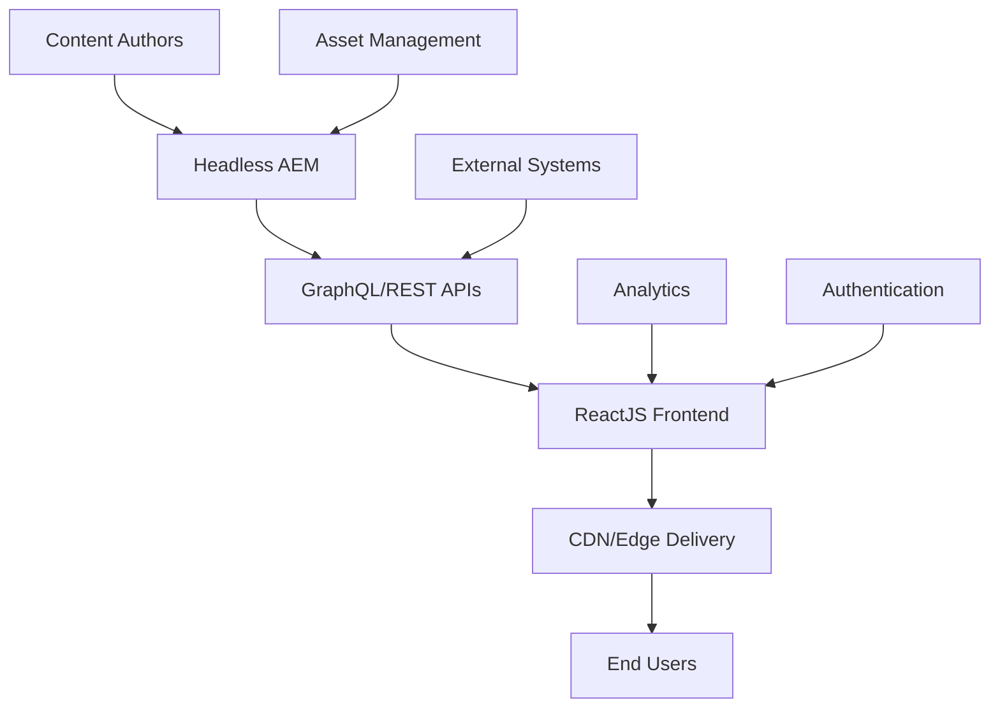

# 🚀 Adobe AEM to ReactJS Migration Plan

## 📋 **Executive Summary**

This document outlines a comprehensive migration strategy for converting an Adobe AEM website with 9 modules to a ReactJS-based frontend architecture. The plan includes discovery questions, technical assessments, implementation strategies, and risk mitigation approaches.

---

## 🎯 **Migration Objectives**

### **Primary Goals**

- ✅ Modernize frontend architecture with ReactJS
- ✅ Improve performance and user experience
- ✅ Enhance developer productivity and maintainability
- ✅ Reduce dependency on AEM for frontend changes
- ✅ Enable faster feature development and deployment

### **Success Metrics**

- **Performance:** 40% improvement in page load times
- **Development Speed:** 60% faster feature delivery
- **Maintenance:** 50% reduction in frontend bugs
- **SEO:** Maintain or improve search rankings
- **User Experience:** Improved Core Web Vitals scores

---

## 🚨 **EMERGENCY 3-WEEK MIGRATION STRATEGY**

> **⚡ CRITICAL TIMELINE: 21 Days Maximum Delivery**  
> **Expert Assessment:** This is an extremely aggressive timeline that requires parallel execution, experienced team, and potential scope compromises.

### **🎯 Success Factors for 3-Week Migration**

#### **✅ Prerequisites for Success:**

- **Experienced React Team:** 4-6 senior developers minimum
- **AEM Expert:** 1 dedicated AEM specialist for headless setup
- **Parallel Development:** Multiple modules developed simultaneously
- **Pre-existing AEM Headless:** AEM already configured for content services
- **Simplified Scope:** Focus on core functionality, defer advanced features
- **24/7 Development:** Extended hours and weekend work
- **Pre-approved Architecture:** No time for extensive planning phases

#### **❌ What We Must Sacrifice:**

- Extensive testing phases (rely on automated testing)
- Perfect UI polish (focus on functionality first)
- Complex integrations (defer non-critical systems)
- Comprehensive documentation (minimum viable documentation)
- Extensive performance optimization (basic optimization only)

---

## ⚡ **3-WEEK SPRINT BREAKDOWN**

### **Week 1: Foundation Blitz (Days 1-7)**

#### **Day 1-2: Rapid Setup & Architecture**

```bash
# Hour 1-4: Environment Setup
npx create-react-app aem-migration --template typescript
npm install @apollo/client graphql axios @reduxjs/toolkit react-redux
npm install react-router-dom @emotion/react @emotion/styled
npm install @mui/material @mui/icons-material # For rapid UI development

# Hour 5-8: AEM Headless Configuration (Parallel)
# Configure AEM Content Services
# Setup CORS policies
# Create basic content models
```

#### **Day 3-4: Core Infrastructure**

- **React App Structure:** Complete component hierarchy
- **AEM Integration Layer:** Generic content fetching service
- **Routing Setup:** All 9 module routes configured
- **Basic Layout Components:** Header, Footer, Navigation (simplified)

#### **Day 5-7: Module Prioritization & Parallel Development**

**Team Split Strategy:**

```
Developer 1-2: Header/Navigation + Footer (Critical Path)
Developer 3-4: Homepage + Product Catalog (High Priority)
Developer 5-6: User Dashboard + Forms (Medium Priority)
AEM Specialist: Content model creation + API endpoints
```

### **Week 2: Parallel Module Development (Days 8-14)**

#### **Day 8-10: Core Modules (Priority 1)**

- ✅ **Header/Navigation:** Basic navigation, responsive design
- ✅ **Homepage:** Hero section, basic content blocks
- ✅ **Product Catalog:** List view, basic filtering
- ✅ **User Dashboard:** Authentication, basic user info

#### **Day 11-14: Remaining Modules (Priority 2)**

- ✅ **Contact Forms:** Basic form handling, validation
- ✅ **Blog/News:** Article listing, detail views
- ✅ **About Pages:** Static content rendering
- ✅ **Search:** Basic search functionality
- ✅ **Footer:** Links, basic information

**Daily Standups:** 15 min max, focus on blockers only
**Continuous Integration:** Deploy to staging after every feature

### **Week 3: Integration & Launch (Days 15-21)**

#### **Day 15-17: Integration & Testing**

- **Module Integration:** Connect all modules with routing
- **Content Migration:** Transfer critical content from AEM
- **Basic Testing:** Automated tests for critical paths only
- **Cross-browser Testing:** Chrome, Safari, Edge (mobile responsive)

#### **Day 18-19: Performance & SEO**

- **Basic Optimization:** Code splitting by route
- **SEO Essentials:** Meta tags, sitemap, structured data
- **Performance Testing:** Core Web Vitals baseline
- **URL Redirects:** Map old AEM URLs to new React routes

#### **Day 20-21: Production Launch**

- **Final Testing:** End-to-end user journeys
- **Production Deployment:** Blue-green deployment strategy
- **Monitoring Setup:** Basic error tracking and analytics
- **Go-Live Support:** Team available for immediate fixes

---

## 🔥 **Rapid Development Strategies**

### **1. Component Library Approach**

```typescript
// Use Material-UI for rapid UI development
import { Box, Container, Typography, Button, Card } from "@mui/material";

// Generic AEM Component Wrapper
const AEMComponent: React.FC<{ path: string; children?: React.ReactNode }> = ({
  path,
  children,
}) => {
  const { data, loading } = useAEM(path);
  if (loading) return <Skeleton />;
  return (
    <Box>
      {children || <div dangerouslySetInnerHTML={{ __html: data.html }} />}
    </Box>
  );
};

// Rapid Module Template
const ModuleTemplate: React.FC<{ title: string; content: any }> = ({
  title,
  content,
}) => (
  <Container maxWidth="lg">
    <Typography variant="h2" gutterBottom>
      {title}
    </Typography>
    {content.map((item, idx) => (
      <Card key={idx} sx={{ mb: 2, p: 2 }}>
        <AEMComponent path={item.path} />
      </Card>
    ))}
  </Container>
);
```

### **2. AEM Content Service Integration**

```typescript
// Ultra-fast AEM integration
class RapidAEMService {
  private baseUrl = process.env.REACT_APP_AEM_HOST;

  // Generic content fetcher - works with any AEM component
  async getContent(path: string): Promise<any> {
    const response = await fetch(`${this.baseUrl}${path}.model.json`);
    return response.json();
  }

  // Batch content fetching for performance
  async getBatchContent(paths: string[]): Promise<any[]> {
    const promises = paths.map((path) => this.getContent(path));
    return Promise.all(promises);
  }
}
```

### **3. Module Development Pattern**

```typescript
// Standard module pattern for rapid development
export const ModuleFactory = (moduleName: string, path: string) => {
  return React.lazy(() =>
    import(`../modules/${moduleName}`).then((module) => ({
      default: () => {
        const { data, loading, error } = useAEM(path);

        if (loading) return <ModuleSkeleton />;
        if (error) return <ErrorBoundary error={error} />;

        return <module.default data={data} />;
      },
    }))
  );
};

// Usage for all 9 modules
const modules = [
  "Header",
  "Homepage",
  "ProductCatalog",
  "UserDashboard",
  "ContactForms",
  "Blog",
  "About",
  "Search",
  "Footer",
].map((name) => ({
  name,
  component: ModuleFactory(name, `/content/modules/${name.toLowerCase()}`),
}));
```

### **4. Rapid Testing Strategy**

```typescript
// Automated testing for critical paths only
describe("Critical User Journeys", () => {
  test("User can navigate all modules", async () => {
    render(<App />);

    // Test navigation to each module
    const moduleLinks = ["home", "products", "dashboard", "contact", "about"];
    for (const link of moduleLinks) {
      fireEvent.click(screen.getByTestId(`nav-${link}`));
      await waitFor(() =>
        expect(screen.getByTestId(`${link}-module`)).toBeVisible()
      );
    }
  });

  test("Content loads from AEM", async () => {
    jest.spyOn(global, "fetch").mockResolvedValue({
      json: () => Promise.resolve({ title: "Test Content", body: "Test Body" }),
    });

    render(<Homepage />);
    await waitFor(() => expect(screen.getByText("Test Content")).toBeVisible());
  });
});
```

---

## 📊 **3-Week Resource Allocation**

### **Team Structure (Minimum Viable Team)**

- **Technical Lead (1):** Architecture oversight, code review, blocker resolution
- **Senior React Developers (4):** 2 modules per developer
- **AEM Specialist (1):** Headless configuration, content modeling
- **QA Engineer (1):** Automated testing, critical path validation
- **DevOps (0.5):** CI/CD setup, deployment automation

### **Daily Schedule (High-Intensity)**

```
08:00-09:00: Team standup + blocker resolution
09:00-12:00: Deep development work
12:00-13:00: Lunch break
13:00-17:00: Continued development
17:00-17:30: Daily demo + integration check
17:30-19:00: Optional extended hours for complex tasks

Weekend Work:
Saturday: Integration testing, performance checks
Sunday: Buffer time for unexpected issues
```

### **Module Assignment Matrix**

| Developer          | Week 1               | Week 2                 | Week 3                   |
| ------------------ | -------------------- | ---------------------- | ------------------------ |
| **Dev 1**          | Header + Navigation  | Integration + Polish   | Testing Support          |
| **Dev 2**          | Homepage + Hero      | Product Catalog        | Performance Optimization |
| **Dev 3**          | User Dashboard       | Contact Forms + Search | Bug Fixes                |
| **Dev 4**          | Footer + About Pages | Blog/News              | Final Integration        |
| **AEM Specialist** | Content Models       | API Optimization       | Content Migration        |
| **QA**             | Test Setup           | Continuous Testing     | Final Validation         |

---

## ⚠️ **Critical Success Factors**

### **1. AEM Headless Readiness**

```bash
# Day 1 AEM Configuration Checklist
□ Enable AEM Content Services
□ Configure CORS for React domain
□ Create content fragment models for all modules
□ Setup GraphQL endpoints (if using)
□ Configure dispatcher rules
□ Test API endpoints with Postman
```

### **2. React App Architecture**

```typescript
// Minimal but scalable architecture
src/
├── components/
│   ├── layout/          # Header, Footer, Navigation (Day 3)
│   ├── common/          # Reusable UI components (Day 2)
│   └── modules/         # 9 individual modules (Week 2)
├── hooks/
│   └── useAEM.ts        # Single hook for all AEM data (Day 2)
├── services/
│   └── aem.service.ts   # AEM integration layer (Day 1)
├── utils/
│   └── constants.ts     # Configuration and constants (Day 1)
└── types/
    └── index.ts         # TypeScript definitions (Day 2)
```

### **3. Content Migration Strategy**

```typescript
// Automated content migration script
const migrateContent = async () => {
  const modules = [
    "header",
    "homepage",
    "products",
    "dashboard",
    "forms",
    "blog",
    "about",
    "search",
    "footer",
  ];

  for (const module of modules) {
    console.log(`Migrating ${module}...`);
    const content = await aemService.exportContent(
      `/content/modules/${module}`
    );
    await reactService.importContent(module, content);
    console.log(`✅ ${module} migrated successfully`);
  }
};
```

### **4. Risk Mitigation**

| Risk                     | Probability | Mitigation                                    |
| ------------------------ | ----------- | --------------------------------------------- |
| **AEM API delays**       | High        | Pre-build mock APIs, parallel AEM setup       |
| **Complex integrations** | High        | Defer to post-launch, use simplified versions |
| **Performance issues**   | Medium      | Basic optimization, monitor Core Web Vitals   |
| **Content loss**         | Low         | Complete AEM backup before start              |
| **Team burnout**         | High        | Clear scope limits, weekend rest periods      |

---

## 🚀 **Week-by-Week Delivery Checklist**

### **Week 1 Deliverables**

- [ ] React application scaffolded and running
- [ ] AEM headless APIs configured and tested
- [ ] Basic routing for all 9 modules
- [ ] Component library and design system setup
- [ ] CI/CD pipeline operational
- [ ] 2-3 modules in basic functional state

### **Week 2 Deliverables**

- [ ] All 9 modules functionally complete (basic version)
- [ ] AEM content integration working
- [ ] Responsive design implementation
- [ ] Basic user authentication (if required)
- [ ] Cross-module navigation functional
- [ ] Staging environment deployed and tested

### **Week 3 Deliverables**

- [ ] All modules integrated and polished
- [ ] Content migration completed
- [ ] Performance optimization applied
- [ ] SEO implementation (meta tags, sitemap)
- [ ] Cross-browser testing completed
- [ ] Production deployment successful
- [ ] Monitoring and error tracking active

---

## 🎯 **Go/No-Go Decision Points**

### **End of Week 1 Assessment**

**GO Criteria:**

- React app running with basic navigation ✅
- AEM APIs responding correctly ✅
- Team velocity on track (≥2 modules started) ✅
- No major technical blockers ✅

**NO-GO Triggers:**

- AEM headless setup blocked ❌
- Team missing critical skills ❌
- Major integration issues discovered ❌

### **End of Week 2 Assessment**

**GO Criteria:**

- 7+ modules functionally complete ✅
- Content integration working ✅
- No critical bugs blocking launch ✅
- Performance within acceptable range ✅

**NO-GO Triggers:**

- <6 modules working ❌
- Major data integrity issues ❌
- Performance degradation >50% ❌

---

## 📞 **Emergency Escalation Plan**

### **Daily Check-ins**

- **08:00:** Technical standup (blockers only)
- **12:00:** Progress check with stakeholders
- **17:00:** End-of-day demo and planning

### **Escalation Matrix**

- **Level 1:** Technical issues → Technical Lead
- **Level 2:** Resource conflicts → Project Manager
- **Level 3:** Scope/timeline issues → Executive Sponsor
- **Emergency:** Production issues → Full team + stakeholders

### **Success Communication**

```markdown
Daily Progress Template:
□ Modules completed: X/9
□ AEM integration status: ✅/⚠️/❌  
□ Critical blockers: [List or None]
□ Tomorrow's priority: [Top 3 items]
□ Risk level: Green/Yellow/Red
```

---

**⚡ REMEMBER: This 3-week timeline is EXTREMELY aggressive. Success depends on:**

- Experienced team with React + AEM expertise
- Simplified scope (defer complex features)
- Extended work hours and weekend availability
- Pre-existing AEM headless capability
- Stakeholder commitment to rapid decisions

**If any of these factors are missing, consider extending to 4-6 weeks for realistic delivery.**

---

## 🔍 **Discovery Phase - Critical Questions**

### **1. Current Architecture Assessment**

#### **AEM Infrastructure Questions:**

1. **Which version of AEM are you currently using?** (6.5, Cloud Service, etc.)
2. **How are your 9 modules structured?** (Components, templates, pages?)
3. **What is the content authoring workflow?** (Authors, approval process, publishing)
4. **Are you using AEM as a Cloud Service or on-premise?**
5. **What's your current deployment pipeline?** (CI/CD, environments)
6. **Do you have AEM Multi-Site Manager (MSM) implemented?**
7. **Are you using AEM Assets/DAM for media management?**

#### **Content & Data Questions:**

8. **What types of content do authors manage?** (Text, images, videos, forms)
9. **How much content needs to be migrated?** (Pages, assets, configurations)
10. **Are there any complex content relationships or references?**
11. **Do you have multilingual content?** (i18n requirements)
12. **What's your content versioning and rollback strategy?**

#### **Integration Questions:**

13. **What external systems integrate with AEM?** (CRM, ERP, Analytics)
14. **Are there any custom AEM OSGi services or bundles?**
15. **What authentication/authorization systems are in place?**
16. **Do you have any AEM Workflows or custom business logic?**

### **2. Technical Requirements Assessment**

#### **Performance & Scale Questions:**

17. **What's your current traffic volume?** (Monthly visitors, peak loads)
18. **What are your performance benchmarks?** (Page load times, server response)
19. **Do you have specific SEO requirements?** (Server-side rendering needs)
20. **What are your browser support requirements?** (IE, mobile, accessibility)

#### **Business Requirements Questions:**

21. **What's your target timeline for migration?** (Phased or big bang approach)
22. **What's your budget allocation?** (Development, infrastructure, training)
23. **Who are your key stakeholders?** (Content authors, developers, business users)
24. **What's your risk tolerance?** (Downtime, functionality loss)

### **3. Module-Specific Questions**

#### **For Each of Your 9 Modules:**

25. **Module Complexity:** Simple display, interactive, or complex business logic?
26. **Content Management:** Static content, dynamic content, or user-generated?
27. **Dependencies:** Does it depend on other modules or external systems?
28. **Customization Level:** Standard AEM components or heavily customized?
29. **User Interaction:** Read-only, forms, real-time features?
30. **Migration Priority:** Critical, important, or nice-to-have?

---

## 🏗️ **Proposed Architecture**

### **Target Architecture Overview**



### **Technology Stack**

#### **Frontend Stack:**

- **Framework:** ReactJS 18+ with TypeScript
- **State Management:** Redux Toolkit or Zustand
- **Routing:** React Router 6
- **Styling:** Tailwind CSS or Styled Components
- **Build Tool:** Vite or Create React App
- **Testing:** Jest + React Testing Library

#### **Backend/CMS Stack:**

- **Content Management:** AEM as Headless CMS
- **API Layer:** AEM GraphQL or Content Services
- **Authentication:** JWT with AEM authentication
- **Asset Delivery:** AEM Assets with CDN

#### **Infrastructure Stack:**

- **Hosting:** Vercel, Netlify, or AWS Amplify
- **CI/CD:** GitHub Actions or GitLab CI
- **Monitoring:** New Relic, DataDog, or Application Insights
- **CDN:** CloudFlare or AWS CloudFront

---

## 📊 **Migration Strategy Options**

### **Option 1: Big Bang Migration (3-6 months)**

#### **Pros:**

- ✅ Complete modernization at once
- ✅ Consistent architecture across all modules
- ✅ No hybrid maintenance overhead

#### **Cons:**

- ❌ High risk and complexity
- ❌ Significant downtime potential
- ❌ Large resource commitment

#### **Timeline:**

- Month 1-2: Architecture setup and core components
- Month 3-4: Module migration (5 modules)
- Month 5-6: Remaining modules and testing

### **Option 2: Phased Migration (6-12 months)**

#### **Pros:**

- ✅ Lower risk with incremental delivery
- ✅ Early feedback and course correction
- ✅ Business continuity maintained

#### **Cons:**

- ❌ Longer overall timeline
- ❌ Hybrid architecture complexity
- ❌ Potential integration challenges

#### **Timeline:**

- **Phase 1 (Months 1-3):** Infrastructure + 2-3 critical modules
- **Phase 2 (Months 4-6):** 3-4 medium priority modules
- **Phase 3 (Months 7-9):** 2-3 remaining modules + optimization
- **Phase 4 (Months 10-12):** Testing, optimization, and legacy cleanup

### **Option 3: Micro-Frontend Approach (4-8 months)**

#### **Pros:**

- ✅ Independent module development and deployment
- ✅ Team autonomy and parallel development
- ✅ Technology flexibility per module

#### **Cons:**

- ❌ Increased architectural complexity
- ❌ Inter-module communication challenges
- ❌ Potential performance overhead

---

## 🔄 **Detailed Migration Process**

### **Phase 1: Foundation & Setup (Weeks 1-4)**

#### **Week 1-2: Environment Setup**

```bash
# 1. Create React application
npx create-react-app aem-migration --template typescript
cd aem-migration

# 2. Install core dependencies
npm install @apollo/client graphql
npm install @reduxjs/toolkit react-redux
npm install react-router-dom
npm install tailwindcss

# 3. Setup development environment
npm install -D eslint prettier husky lint-staged
```

#### **Week 3-4: AEM Configuration**

- Configure AEM for headless delivery
- Set up GraphQL endpoints
- Create content models and fragments
- Implement CORS policies

### **Phase 2: Core Components (Weeks 5-8)**

#### **Component Architecture:**

```javascript
// Core component structure
src/
├── components/
│   ├── common/           // Reusable UI components
│   ├── layout/           // Header, Footer, Navigation
│   ├── modules/          // Module-specific components
│   └── forms/            // Form components
├── hooks/                // Custom React hooks
├── services/             // API integration
├── utils/                // Helper functions
└── types/                // TypeScript definitions
```

#### **AEM Integration Service:**

```typescript
// services/aem.service.ts
class AEMService {
  private baseURL = process.env.REACT_APP_AEM_ENDPOINT;

  async getContent(path: string): Promise<any> {
    const response = await fetch(`${this.baseURL}/content${path}.model.json`);
    return response.json();
  }

  async getContentByQuery(query: string): Promise<any> {
    // GraphQL implementation
    const response = await fetch(`${this.baseURL}/content/_cq_graphql`, {
      method: "POST",
      headers: { "Content-Type": "application/json" },
      body: JSON.stringify({ query }),
    });
    return response.json();
  }
}
```

### **Phase 3: Module Migration (Weeks 9-24)**

#### **Module Migration Checklist per Module:**

**✅ Pre-Migration:**

- [ ] Analyze current AEM component functionality
- [ ] Map content structure to React props
- [ ] Identify reusable components
- [ ] Plan data fetching strategy

**✅ Development:**

- [ ] Create React component structure
- [ ] Implement content fetching from AEM
- [ ] Add styling and responsive design
- [ ] Implement client-side interactivity
- [ ] Add error handling and loading states

**✅ Testing:**

- [ ] Unit tests for components
- [ ] Integration tests for data fetching
- [ ] Visual regression testing
- [ ] Cross-browser testing
- [ ] Performance testing

**✅ Deployment:**

- [ ] Content migration to new structure
- [ ] URL mapping and redirects
- [ ] SEO meta tags implementation
- [ ] Analytics integration
- [ ] Monitoring setup

### **Module Migration Priority Matrix:**

| Module            | Complexity | Business Impact | Migration Priority | Estimated Effort |
| ----------------- | ---------- | --------------- | ------------------ | ---------------- |
| Header/Navigation | Low        | High            | 1                  | 1 week           |
| Homepage          | Medium     | High            | 2                  | 2 weeks          |
| Product Catalog   | High       | High            | 3                  | 3 weeks          |
| User Dashboard    | High       | Medium          | 4                  | 3 weeks          |
| Contact Forms     | Medium     | Medium          | 5                  | 2 weeks          |
| Blog/News         | Low        | Low             | 6                  | 1 week           |
| About Pages       | Low        | Low             | 7                  | 1 week           |
| Search            | Medium     | Medium          | 8                  | 2 weeks          |
| Footer            | Low        | Low             | 9                  | 1 week           |

---

## 🔧 **Technical Implementation Guide**

### **1. AEM Headless Configuration**

#### **Content Fragment Models:**

```json
{
  "name": "Article",
  "fields": [
    {
      "name": "title",
      "type": "single-line-text",
      "required": true
    },
    {
      "name": "content",
      "type": "multi-line-text",
      "required": true
    },
    {
      "name": "featuredImage",
      "type": "content-reference",
      "rootPath": "/content/dam"
    }
  ]
}
```

#### **GraphQL Query Example:**

```graphql
query GetArticles {
  articleList {
    items {
      title
      content
      featuredImage {
        ... on ImageRef {
          _path
          alt
          width
          height
        }
      }
    }
  }
}
```

### **2. React Component Implementation**

#### **Module Component Pattern:**

```typescript
// components/modules/ProductCatalog.tsx
import React, { useEffect, useState } from "react";
import { useAEM } from "../hooks/useAEM";
import { ProductCard } from "../common/ProductCard";

interface ProductCatalogProps {
  path: string;
  maxItems?: number;
}

export const ProductCatalog: React.FC<ProductCatalogProps> = ({
  path,
  maxItems = 10,
}) => {
  const { data, loading, error } = useAEM(path);

  if (loading) return <div>Loading products...</div>;
  if (error) return <div>Error loading products</div>;

  return (
    <div className="product-catalog">
      <h2>{data.title}</h2>
      <div className="product-grid">
        {data.products.slice(0, maxItems).map((product) => (
          <ProductCard key={product.id} product={product} />
        ))}
      </div>
    </div>
  );
};
```

#### **Custom Hook for AEM Data:**

```typescript
// hooks/useAEM.ts
import { useState, useEffect } from "react";
import { AEMService } from "../services/aem.service";

export const useAEM = (path: string) => {
  const [data, setData] = useState(null);
  const [loading, setLoading] = useState(true);
  const [error, setError] = useState(null);

  useEffect(() => {
    const fetchData = async () => {
      try {
        setLoading(true);
        const result = await AEMService.getContent(path);
        setData(result);
      } catch (err) {
        setError(err);
      } finally {
        setLoading(false);
      }
    };

    fetchData();
  }, [path]);

  return { data, loading, error };
};
```

### **3. State Management Setup**

#### **Redux Store Configuration:**

```typescript
// store/index.ts
import { configureStore } from "@reduxjs/toolkit";
import contentReducer from "./slices/contentSlice";
import userReducer from "./slices/userSlice";

export const store = configureStore({
  reducer: {
    content: contentReducer,
    user: userReducer,
  },
  middleware: (getDefaultMiddleware) =>
    getDefaultMiddleware({
      serializableCheck: {
        ignoredActions: ["persist/PERSIST"],
      },
    }),
});
```

---

## 🧪 **Testing Strategy**

### **Testing Pyramid**

#### **Unit Tests (70%)**

```typescript
// __tests__/ProductCatalog.test.tsx
import { render, screen } from "@testing-library/react";
import { ProductCatalog } from "../components/modules/ProductCatalog";

jest.mock("../hooks/useAEM");

describe("ProductCatalog", () => {
  test("renders loading state", () => {
    (useAEM as jest.Mock).mockReturnValue({
      data: null,
      loading: true,
      error: null,
    });

    render(<ProductCatalog path="/products" />);
    expect(screen.getByText("Loading products...")).toBeInTheDocument();
  });
});
```

#### **Integration Tests (20%)**

- API integration with AEM
- Component interaction testing
- Form submission workflows

#### **E2E Tests (10%)**

```typescript
// cypress/integration/product-catalog.spec.ts
describe("Product Catalog", () => {
  it("should display products and allow filtering", () => {
    cy.visit("/products");
    cy.get('[data-testid="product-card"]').should("have.length.gte", 1);
    cy.get('[data-testid="filter-category"]').select("Electronics");
    cy.get('[data-testid="product-card"]').should("contain", "Electronics");
  });
});
```

---

## 🚀 **Deployment Strategy**

### **CI/CD Pipeline**

```yaml
# .github/workflows/deploy.yml
name: Deploy to Production

on:
  push:
    branches: [main]

jobs:
  build-and-deploy:
    runs-on: ubuntu-latest
    steps:
      - uses: actions/checkout@v3

      - name: Setup Node.js
        uses: actions/setup-node@v3
        with:
          node-version: "18"
          cache: "npm"

      - name: Install dependencies
        run: npm ci

      - name: Run tests
        run: npm test

      - name: Build application
        run: npm run build
        env:
          REACT_APP_AEM_ENDPOINT: ${{ secrets.AEM_ENDPOINT }}

      - name: Deploy to Vercel
        uses: vercel/action@v1
        with:
          vercel-token: ${{ secrets.VERCEL_TOKEN }}
          vercel-project-id: ${{ secrets.VERCEL_PROJECT_ID }}
```

### **Environment Configuration**

#### **Development:**

- Local AEM instance or AEM SDK
- Hot reloading for rapid development
- Mock data for offline development

#### **Staging:**

- AEM staging environment
- Production-like data
- Performance testing environment

#### **Production:**

- AEM production instance
- CDN for static assets
- Monitoring and analytics

---

## ⚠️ **Risk Assessment & Mitigation**

### **High-Risk Areas**

| Risk                           | Impact | Probability | Mitigation Strategy                              |
| ------------------------------ | ------ | ----------- | ------------------------------------------------ |
| **Data Loss During Migration** | High   | Low         | Complete backup, staged migration, rollback plan |
| **SEO Impact**                 | High   | Medium      | URL mapping, meta tags, sitemap updates          |
| **Performance Degradation**    | Medium | Medium      | Performance testing, optimization, CDN           |
| **Content Author Disruption**  | Medium | High        | Training, documentation, gradual transition      |
| **Integration Failures**       | High   | Medium      | Thorough testing, fallback mechanisms            |

### **Mitigation Strategies**

#### **1. Data Protection:**

- Complete AEM content backup before migration
- Incremental backup strategy during migration
- Database rollback procedures

#### **2. SEO Preservation:**

- Maintain URL structure where possible
- Implement 301 redirects for changed URLs
- Preserve meta tags and structured data
- Submit updated sitemap to search engines

#### **3. Performance Optimization:**

- Implement code splitting and lazy loading
- Optimize images and assets
- Use CDN for static content delivery
- Monitor Core Web Vitals

#### **4. Content Author Support:**

- Create comprehensive documentation
- Provide hands-on training sessions
- Establish support channels
- Gradual transition with parallel systems

---

## 📈 **Success Metrics & KPIs**

### **Technical Metrics**

#### **Performance:**

- **Page Load Time:** Target < 3 seconds
- **First Contentful Paint:** Target < 1.5 seconds
- **Core Web Vitals:** Green scores across all metrics
- **Bundle Size:** Target < 500KB initial load

#### **Development:**

- **Build Time:** Target < 5 minutes
- **Test Coverage:** Target > 80%
- **Code Quality:** ESLint score > 95%
- **Deployment Frequency:** Daily deployments

### **Business Metrics**

#### **User Experience:**

- **Bounce Rate:** Target improvement of 15%
- **Page Views per Session:** Target increase of 20%
- **User Engagement:** Target increase of 25%
- **Mobile Experience:** Target improvement of 30%

#### **Content Management:**

- **Content Publishing Speed:** Target 50% faster
- **Author Satisfaction:** Target > 85% satisfaction score
- **Content Errors:** Target 60% reduction
- **Time to Market:** Target 40% faster feature delivery

---

## 📝 **Project Timeline & Milestones**

### **Detailed Project Timeline**

#### **Month 1: Foundation & Planning**

- **Week 1:** Discovery and requirements gathering
- **Week 2:** Architecture design and technology decisions
- **Week 3:** Development environment setup
- **Week 4:** AEM headless configuration

#### **Month 2-3: Core Development**

- **Week 5-6:** Core components and utilities
- **Week 7-8:** AEM integration and data fetching
- **Week 9-10:** First module migration (Header/Navigation)
- **Week 11-12:** Second module migration (Homepage)

#### **Month 4-6: Module Migration**

- **Week 13-15:** High-priority modules (Product Catalog, User Dashboard)
- **Week 16-18:** Medium-priority modules (Forms, Search)
- **Week 19-21:** Low-priority modules (Blog, About, Footer)
- **Week 22-24:** Integration testing and optimization

#### **Month 7-8: Testing & Deployment**

- **Week 25-26:** Comprehensive testing (Unit, Integration, E2E)
- **Week 27-28:** Performance optimization and security testing
- **Week 29-30:** Staging deployment and user acceptance testing
- **Week 31-32:** Production deployment and monitoring setup

#### **Month 9: Post-Launch & Optimization**

- **Week 33-34:** Performance monitoring and issue resolution
- **Week 35-36:** User feedback collection and minor improvements

### **Key Milestones**

| Milestone                   | Target Date | Deliverables                               |
| --------------------------- | ----------- | ------------------------------------------ |
| **Architecture Approval**   | Week 2      | Technical design, technology stack         |
| **Development Environment** | Week 4      | Local setup, AEM configuration             |
| **Core Components**         | Week 8      | Reusable components, AEM integration       |
| **First Module Live**       | Week 10     | Header/Navigation in production            |
| **50% Migration Complete**  | Week 18     | 4-5 modules migrated                       |
| **Testing Phase Complete**  | Week 26     | All tests passing, performance targets met |
| **Production Launch**       | Week 32     | Full site live on React                    |
| **Project Closure**         | Week 36     | Documentation, handover, optimization      |

---

## 💰 **Budget & Resource Planning**

### **Resource Requirements**

#### **Development Team:**

- **Frontend Lead:** 1 person × 8 months
- **React Developers:** 2-3 people × 6 months
- **AEM Developer:** 1 person × 4 months
- **QA Engineer:** 1 person × 6 months
- **DevOps Engineer:** 0.5 person × 8 months

#### **Infrastructure Costs:**

- **Hosting:** $200-500/month (Vercel Pro or AWS)
- **CDN:** $100-300/month (CloudFlare or AWS CloudFront)
- **Monitoring:** $100-200/month (New Relic or DataDog)
- **Development Tools:** $50-100/month per developer

#### **Training & Documentation:**

- **Content Author Training:** 2 days
- **Developer Documentation:** Ongoing
- **Knowledge Transfer:** 1 week

### **Estimated Budget Range**

- **Small Team (3-4 people):** $150,000 - $200,000
- **Medium Team (5-6 people):** $200,000 - $300,000
- **Large Team (7+ people):** $300,000 - $450,000

_Note: Costs include salaries, infrastructure, tools, and training_

---

## 📚 **Documentation & Training Plan**

### **Documentation Requirements**

#### **Technical Documentation:**

1. **Architecture Documentation**

   - System architecture diagrams
   - Component hierarchy
   - Data flow documentation
   - API integration guides

2. **Developer Guidelines**

   - Coding standards and conventions
   - Component development guide
   - Testing best practices
   - Deployment procedures

3. **Operations Manual**
   - Monitoring and alerting setup
   - Troubleshooting guides
   - Performance optimization
   - Security guidelines

#### **User Documentation:**

1. **Content Author Guide**

   - AEM content management in headless mode
   - Content modeling best practices
   - Publishing workflows
   - Troubleshooting common issues

2. **Business User Guide**
   - New feature overview
   - Performance benefits
   - Reporting and analytics
   - Feedback mechanisms

### **Training Plan**

#### **Phase 1: Technical Team Training (Week 3)**

- React best practices workshop
- AEM headless development
- Testing strategies
- CI/CD pipeline usage

#### **Phase 2: Content Author Training (Week 30)**

- Headless content management
- New authoring workflows
- Content preview and publishing
- Support channels

#### **Phase 3: Business Stakeholder Training (Week 32)**

- New system overview
- Performance improvements
- Reporting capabilities
- Future roadmap

---

## 🔄 **Post-Migration Optimization Plan**

### **Month 1-3 Post-Launch**

#### **Performance Optimization:**

- Monitor Core Web Vitals and user experience metrics
- Implement additional performance optimizations
- Optimize bundle sizes and loading strategies
- Fine-tune CDN configuration

#### **Feature Enhancement:**

- Collect user feedback and prioritize improvements
- Implement A/B testing for new features
- Optimize conversion funnels
- Add advanced analytics tracking

### **Month 4-6 Post-Launch**

#### **Content Management Optimization:**

- Refine content workflows based on author feedback
- Implement advanced content features
- Optimize content delivery and caching
- Add content personalization capabilities

#### **Technical Debt Reduction:**

- Refactor complex components
- Improve test coverage
- Update dependencies and security patches
- Optimize development workflows

### **Long-term Roadmap (6+ months)**

#### **Advanced Features:**

- Progressive Web App (PWA) implementation
- Advanced personalization and targeting
- Real-time content updates
- AI-powered content recommendations

#### **Scalability Improvements:**

- Implement micro-frontend architecture
- Add multiple deployment environments
- Implement advanced monitoring and observability
- Plan for international expansion

---

## 📞 **Next Steps & Action Items**

### **Immediate Actions (Week 1):**

1. **✅ Stakeholder Alignment Meeting**

   - Review migration plan with all stakeholders
   - Confirm timeline and budget approval
   - Assign project roles and responsibilities
   - Establish communication channels

2. **✅ Technical Assessment**

   - Complete current AEM architecture audit
   - Inventory all 9 modules and their complexity
   - Assess integration points and dependencies
   - Evaluate content volume and structure

3. **✅ Team Assembly**

   - Recruit or assign React developers
   - Identify AEM specialist for headless configuration
   - Assign QA and DevOps resources
   - Plan team training and onboarding

4. **✅ Environment Preparation**
   - Set up development environments
   - Configure AEM for headless delivery
   - Establish CI/CD pipeline foundation
   - Create project repositories and documentation

### **Week 2-3 Deliverables:**

5. **✅ Detailed Technical Specification**

   - Component architecture design
   - API integration specifications
   - Performance benchmarks and targets
   - Security and compliance requirements

6. **✅ Project Kick-off**
   - Team onboarding and training
   - Development environment setup
   - First sprint planning
   - Risk mitigation plan activation

---

## 📋 **Decision Matrix Template**

### **Use this template to evaluate migration decisions:**

| Criteria                   | Weight | Option A (Big Bang) | Option B (Phased) | Option C (Micro-Frontend) |
| -------------------------- | ------ | ------------------- | ----------------- | ------------------------- |
| **Risk Level**             | 25%    | Low (3)             | High (5)          | Medium (4)                |
| **Time to Market**         | 20%    | Medium (4)          | High (5)          | Medium (4)                |
| **Resource Requirements**  | 20%    | High (5)            | Medium (4)        | High (5)                  |
| **Business Continuity**    | 15%    | Low (2)             | High (5)          | High (5)                  |
| **Technical Flexibility**  | 10%    | Medium (3)          | Medium (3)        | High (5)                  |
| **Maintenance Complexity** | 10%    | Low (5)             | Medium (3)        | High (2)                  |

**Scoring:** 1 = Poor, 5 = Excellent
**Total Score Calculation:** (Weight × Score) for each option

---

## 📧 **Contact & Support**

### **Project Leadership:**

- **Project Manager:** [Name] - [Email] - [Phone]
- **Technical Lead:** [Name] - [Email] - [Phone]
- **Business Stakeholder:** [Name] - [Email] - [Phone]

### **Support Channels:**

- **Technical Issues:** [Slack Channel] or [Email]
- **Business Questions:** [Stakeholder Contact]
- **Emergency Escalation:** [24/7 Contact Information]

---

**Document Version:** 1.0  
**Last Updated:** November 21, 2025  
**Next Review Date:** December 21, 2025

---

_This migration plan is a living document that will be updated throughout the project lifecycle. Regular reviews and updates ensure alignment with project goals and changing requirements._
