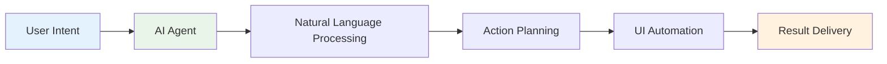
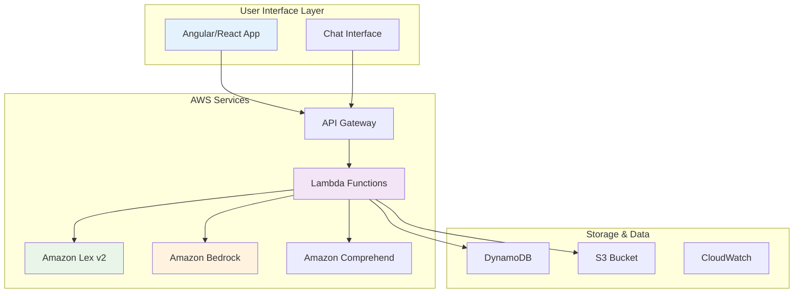
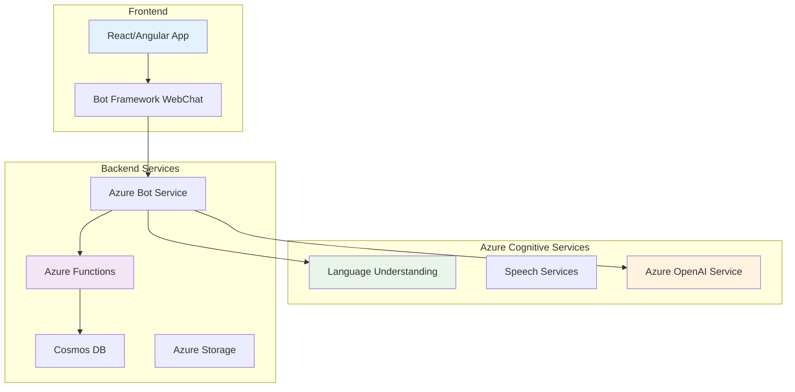
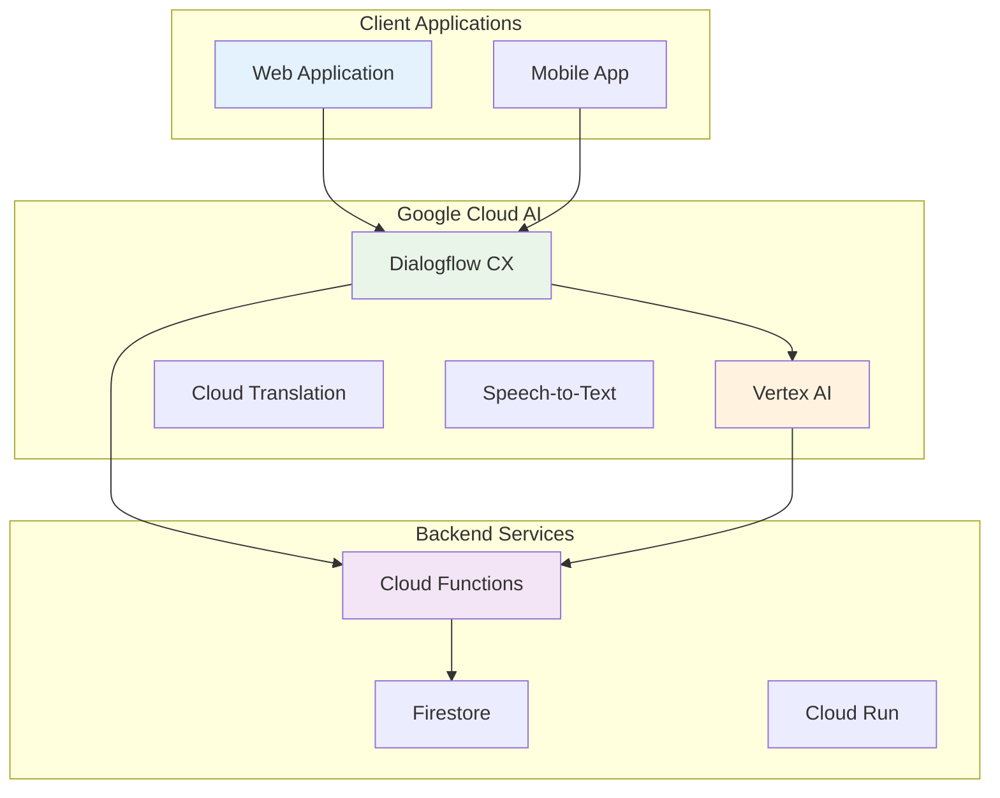

# 🤖 Agentic UI Approach: Complete Cloud Implementation Guide

## 🎯 What You'll Learn

This guide covers everything you need to know about implementing Agentic UI (AI-powered user interfaces) across major cloud platforms. Whether you're a beginner exploring AI-driven UIs or an expert looking for cloud-specific implementation details, we've got you covered!

**What's Inside:**

- Understanding Agentic UI concepts
- Implementation across AWS, Azure, and Google Cloud
- Integration with Angular and React applications
- Step-by-step deployment guides
- Navigation patterns and best practices

---

## 📚 Understanding Agentic UI (Start Here If You're New!)

### **What is Agentic UI?**

Think of Agentic UI as having a super-smart assistant built right into your web application! Instead of users clicking through menus and forms, they can simply tell the interface what they want to accomplish, and the AI agent figures out how to do it.

**Real-World Example:**

- **Traditional UI**: User clicks "Reports" → "Sales" → "Filter by Date" → Select dates → "Generate"
- **Agentic UI**: User types "Show me last month's sales report" and the AI automatically navigates, filters, and generates the report



### **Key Components of Agentic UI**

```typescript
interface AgenticUIComponents {
  naturalLanguageProcessor: {
    purpose: "Understands user intentions from text/voice";
    technologies: ["OpenAI GPT", "Azure Cognitive Services", "Google Cloud AI"];
  };

  actionPlanner: {
    purpose: "Decides what actions to take based on user intent";
    capabilities: [
      "Navigate pages",
      "Fill forms",
      "Click buttons",
      "Extract data"
    ];
  };

  uiController: {
    purpose: "Actually performs actions on the user interface";
    methods: ["DOM manipulation", "Event triggering", "State management"];
  };

  contextManager: {
    purpose: "Remembers conversation and application state";
    features: ["Chat history", "User preferences", "Session management"];
  };
}
```

### **Why Should You Care About Agentic UI?**

**For Users:**

- 🚀 **Faster workflows**: Get things done with simple commands
- 💡 **Intuitive interactions**: No need to learn complex navigation
- 🎯 **Personalized experience**: AI learns your preferences over time

**For Developers:**

- 📈 **Higher user engagement**: More intuitive interfaces keep users happy
- 🔧 **Reduced support tickets**: Users can accomplish tasks without help
- 🎨 **Competitive advantage**: Stand out with cutting-edge UI technology

---

## ☁️ Cloud Platform Implementation

### 🟠 **AWS Implementation**

AWS offers several services that work together beautifully for Agentic UI. Let's build this step by step!

#### **AWS Architecture Overview**



#### **Step 1: Setting Up Amazon Lex for Intent Recognition**

**What Amazon Lex Does**: It's like having a smart receptionist that understands what users want to do, even when they express it in different ways.

**Creating Your First Bot:**

1. **Navigate to Amazon Lex Console**
2. **Create a new bot** with these settings:
   - Bot name: `AgenticUIAssistant`
   - Language: English (US)
   - Voice: Joanna (optional)

**Intent Configuration Example:**

```json
{
  "intents": [
    {
      "name": "GenerateReport",
      "description": "User wants to generate various types of reports",
      "sampleUtterances": [
        "Show me the sales report for last month",
        "Generate quarterly revenue report",
        "I need the customer analytics dashboard",
        "Create a report for Q3 performance"
      ],
      "slots": [
        {
          "name": "ReportType",
          "slotType": "ReportTypeSlot",
          "valueElicitationPrompt": "What type of report would you like to generate?"
        },
        {
          "name": "TimePeriod",
          "slotType": "AMAZON.DATE",
          "valueElicitationPrompt": "For which time period?"
        }
      ]
    }
  ]
}
```

#### **Step 2: Amazon Bedrock Service with Guardrails**

**What Amazon Bedrock Does**: It's your AI brain that understands complex requests and generates safe, reliable responses. Think of guardrails as safety nets that ensure your AI behaves appropriately in business environments.

**Real-World Example**: An e-commerce platform where users can say "Cancel my order from last week" and the AI safely processes this without accidentally canceling the wrong order or exposing sensitive data.

#### **Setting Up Bedrock Guardrails**

**Why Guardrails Matter**:

- 🛡️ **Content Safety**: Prevent inappropriate or harmful responses
- 🔒 **Data Protection**: Ensure sensitive information isn't leaked
- 📋 **Business Compliance**: Follow company policies and regulations
- 🎯 **Quality Control**: Maintain consistent, professional interactions

**Guardrail Configuration:**

```typescript
// bedrock-guardrails-config.ts
import {
  BedrockRuntime,
  GuardrailContentFilter,
} from "@aws-sdk/client-bedrock-runtime";

interface GuardrailConfig {
  guardrailId: string;
  guardrailVersion: string;
  contentFilters: GuardrailContentFilter[];
  topicFilters: string[];
  wordFilters: string[];
  sensitiveInformationFilters: string[];
}

export const createGuardrailConfig = (): GuardrailConfig => ({
  guardrailId: "agentic-ui-guardrail-v1",
  guardrailVersion: "1",
  contentFilters: [
    {
      type: "SEXUAL",
      strength: "HIGH",
    },
    {
      type: "VIOLENCE",
      strength: "HIGH",
    },
    {
      type: "HATE",
      strength: "MEDIUM",
    },
    {
      type: "INSULTS",
      strength: "MEDIUM",
    },
    {
      type: "MISCONDUCT",
      strength: "HIGH",
    },
  ],
  topicFilters: [
    "financial_advice",
    "medical_diagnosis",
    "legal_advice",
    "personal_information",
  ],
  wordFilters: ["password", "ssn", "credit_card", "api_key"],
  sensitiveInformationFilters: [
    "EMAIL",
    "PHONE",
    "ADDRESS",
    "CREDIT_CARD_NUMBER",
  ],
});
```

#### **Enhanced Lambda Function with Bedrock Agents**

**Real-World Scenario**: Building an AI assistant for a banking application that helps customers check balances, transfer money, and pay bills safely.

```typescript
// enhanced-bedrock-lambda.ts
import { APIGatewayProxyHandler } from "aws-lambda";
import {
  BedrockAgentRuntimeClient,
  BedrockRuntimeClient,
  InvokeModelCommand,
  InvokeAgentCommand,
} from "@aws-sdk/client-bedrock-agent-runtime";
import {
  DynamoDBClient,
  PutItemCommand,
  GetItemCommand,
} from "@aws-sdk/client-dynamodb";

interface AgenticRequest {
  intent: string;
  slots: Record<string, string>;
  sessionId: string;
  userId: string;
  userMessage: string;
  applicationContext?: {
    currentPage: string;
    userRole: string;
    availableActions: string[];
  };
}

interface UIAction {
  type: "navigate" | "click" | "fillForm" | "extract" | "validate" | "confirm";
  target: string;
  value?: any;
  sequence: number;
  description: string;
  requiresConfirmation?: boolean;
  securityLevel?: "low" | "medium" | "high";
}

interface BedrockResponse {
  actions: UIAction[];
  explanation: string;
  confidence: number;
  requiresUserConfirmation: boolean;
  guardrailAssessment: {
    passed: boolean;
    blockedContent?: string[];
    recommendation: string;
  };
}

export class AgenticBedrockService {
  private bedrockClient: BedrockRuntimeClient;
  private bedrockAgentClient: BedrockAgentRuntimeClient;
  private dynamoClient: DynamoDBClient;
  private guardrailConfig: GuardrailConfig;

  constructor() {
    this.bedrockClient = new BedrockRuntimeClient({ region: "us-east-1" });
    this.bedrockAgentClient = new BedrockAgentRuntimeClient({
      region: "us-east-1",
    });
    this.dynamoClient = new DynamoDBClient({ region: "us-east-1" });
    this.guardrailConfig = createGuardrailConfig();
  }

  async processAgenticRequest(
    request: AgenticRequest
  ): Promise<BedrockResponse> {
    try {
      // Step 1: Validate request through guardrails
      const guardrailAssessment = await this.validateWithGuardrails(
        request.userMessage
      );

      if (!guardrailAssessment.passed) {
        return {
          actions: [],
          explanation: "I can't help with that request due to safety policies.",
          confidence: 0,
          requiresUserConfirmation: false,
          guardrailAssessment,
        };
      }

      // Step 2: Get user context and permissions
      const userContext = await this.getUserContext(request.userId);

      // Step 3: Use Bedrock Agent for intelligent action planning
      const agentResponse = await this.invokeBedrockAgent(request, userContext);

      // Step 4: Generate safe UI actions
      const actions = await this.generateSafeUIActions(
        agentResponse,
        userContext
      );

      // Step 5: Store session for audit trail
      await this.storeSessionData(request.sessionId, {
        request,
        actions,
        timestamp: new Date().toISOString(),
      });

      return {
        actions,
        explanation: agentResponse.explanation,
        confidence: agentResponse.confidence,
        requiresUserConfirmation: this.requiresConfirmation(actions),
        guardrailAssessment,
      };
    } catch (error) {
      console.error("Bedrock processing error:", error);
      throw new Error("Failed to process request safely");
    }
  }

  private async validateWithGuardrails(message: string): Promise<any> {
    const command = new InvokeModelCommand({
      modelId: "anthropic.claude-3-sonnet-20240229-v1:0",
      contentType: "application/json",
      accept: "application/json",
      guardrailIdentifier: this.guardrailConfig.guardrailId,
      guardrailVersion: this.guardrailConfig.guardrailVersion,
      body: JSON.stringify({
        anthropic_version: "bedrock-2023-05-31",
        max_tokens: 1000,
        messages: [
          {
            role: "user",
            content: `Analyze this request for safety and business appropriateness: "${message}"`,
          },
        ],
      }),
    });

    try {
      const response = await this.bedrockClient.send(command);
      const result = JSON.parse(new TextDecoder().decode(response.body));

      return {
        passed: !response.guardrailAssessment?.blocked,
        blockedContent: response.guardrailAssessment?.blockedOutputs || [],
        recommendation: result.content[0].text,
      };
    } catch (error) {
      return {
        passed: false,
        blockedContent: ["Guardrail validation failed"],
        recommendation: "Request cannot be processed due to safety concerns",
      };
    }
  }

  private async invokeBedrockAgent(
    request: AgenticRequest,
    userContext: any
  ): Promise<any> {
    // Real-world banking example prompts
    const systemPrompts = {
      banking: `You are a secure banking assistant. You can help with:
        - Account balance inquiries
        - Money transfers between user's own accounts
        - Bill payments to registered payees
        - Transaction history requests
        
        NEVER:
        - Share account details of other users
        - Process transactions without proper authorization
        - Provide financial advice
        - Access sensitive personal information`,

      ecommerce: `You are an e-commerce assistant. You can help with:
        - Order tracking and management
        - Product searches and recommendations
        - Shopping cart management
        - Return/refund requests
        
        NEVER:
        - Access payment information directly
        - Modify orders without user confirmation
        - Share customer data with third parties`,

      crm: `You are a CRM assistant for sales teams. You can help with:
        - Lead management and qualification
        - Contact information updates
        - Sales pipeline tracking
        - Report generation
        
        NEVER:
        - Delete customer records without confirmation
        - Share confidential sales information
        - Access competitor data`,
    };

    const contextPrompt = `
    User Context:
    - User ID: ${request.userId}
    - Role: ${userContext.role}
    - Permissions: ${JSON.stringify(userContext.permissions)}
    - Current Page: ${request.applicationContext?.currentPage}
    - Available Actions: ${JSON.stringify(
      request.applicationContext?.availableActions
    )}
    
    User Request: "${request.userMessage}"
    Intent: ${request.intent}
    Extracted Parameters: ${JSON.stringify(request.slots)}
    
    Generate a safe sequence of UI actions that:
    1. Respects user permissions
    2. Follows security best practices
    3. Provides clear explanations
    4. Asks for confirmation on sensitive operations
    
    Return JSON format:
    {
      "actions": [action objects],
      "explanation": "clear explanation of what will happen",
      "confidence": 0.0-1.0,
      "requiresConfirmation": boolean
    }
    `;

    const agentCommand = new InvokeAgentCommand({
      agentId: "agentic-ui-agent-v1",
      agentAliasId: "production",
      sessionId: request.sessionId,
      inputText: contextPrompt,
    });

    const response = await this.bedrockAgentClient.send(agentCommand);
    return JSON.parse(response.completion || "{}");
  }

  private async generateSafeUIActions(
    agentResponse: any,
    userContext: any
  ): Promise<UIAction[]> {
    const actions: UIAction[] = [];

    for (const [index, action] of agentResponse.actions.entries()) {
      // Add security validation for each action
      const securityLevel = this.assessActionSecurity(action, userContext);

      actions.push({
        ...action,
        sequence: index + 1,
        securityLevel,
        requiresConfirmation:
          securityLevel === "high" || action.type === "fillForm",
      });
    }

    return actions;
  }

  private assessActionSecurity(
    action: any,
    userContext: any
  ): "low" | "medium" | "high" {
    // Define security levels based on action type and user permissions
    const highSecurityActions = [
      "transfer_money",
      "delete_record",
      "change_password",
    ];
    const mediumSecurityActions = [
      "update_profile",
      "place_order",
      "send_message",
    ];

    if (
      highSecurityActions.some((secure) =>
        action.description.toLowerCase().includes(secure)
      )
    ) {
      return "high";
    }

    if (
      mediumSecurityActions.some((secure) =>
        action.description.toLowerCase().includes(secure)
      )
    ) {
      return "medium";
    }

    return "low";
  }

  private async getUserContext(userId: string): Promise<any> {
    const command = new GetItemCommand({
      TableName: "AgenticUserContexts",
      Key: {
        userId: { S: userId },
      },
    });

    try {
      const response = await this.dynamoClient.send(command);
      return response.Item
        ? {
            role: response.Item.role?.S || "user",
            permissions: JSON.parse(response.Item.permissions?.S || "[]"),
            preferences: JSON.parse(response.Item.preferences?.S || "{}"),
          }
        : {
            role: "user",
            permissions: ["basic_actions"],
            preferences: {},
          };
    } catch (error) {
      console.error("Failed to get user context:", error);
      return { role: "user", permissions: ["basic_actions"], preferences: {} };
    }
  }

  private async storeSessionData(sessionId: string, data: any): Promise<void> {
    const command = new PutItemCommand({
      TableName: "AgenticSessions",
      Item: {
        sessionId: { S: sessionId },
        data: { S: JSON.stringify(data) },
        timestamp: { S: new Date().toISOString() },
        ttl: { N: String(Math.floor(Date.now() / 1000) + 24 * 60 * 60) }, // 24 hour TTL
      },
    });

    await this.dynamoClient.send(command);
  }

  private requiresConfirmation(actions: UIAction[]): boolean {
    return actions.some(
      (action) =>
        action.requiresConfirmation ||
        action.securityLevel === "high" ||
        action.type === "fillForm"
    );
  }
}

// Lambda Handler
export const handler: APIGatewayProxyHandler = async (event) => {
  const agenticService = new AgenticBedrockService();

  try {
    const request: AgenticRequest = JSON.parse(event.body || "{}");

    // Validate required fields
    if (!request.userMessage || !request.sessionId || !request.userId) {
      return {
        statusCode: 400,
        headers: {
          "Access-Control-Allow-Origin": "*",
          "Content-Type": "application/json",
        },
        body: JSON.stringify({
          error: "Missing required fields: userMessage, sessionId, userId",
        }),
      };
    }

    const response = await agenticService.processAgenticRequest(request);

    return {
      statusCode: 200,
      headers: {
        "Access-Control-Allow-Origin": "*",
        "Content-Type": "application/json",
      },
      body: JSON.stringify(response),
    };
  } catch (error) {
    console.error("Lambda execution error:", error);

    return {
      statusCode: 500,
      headers: {
        "Access-Control-Allow-Origin": "*",
        "Content-Type": "application/json",
      },
      body: JSON.stringify({
        error: "Internal server error",
        message: "Failed to process agentic request",
      }),
    };
  }
};
```

#### **Real-World Implementation Examples**

**Example 1: Banking Application**

```typescript
// User says: "Transfer $500 from my checking to savings"
const bankingRequest: AgenticRequest = {
  intent: "transfer_money",
  slots: {
    amount: "500",
    fromAccount: "checking",
    toAccount: "savings",
  },
  sessionId: "banking-session-123",
  userId: "user-456",
  userMessage: "Transfer $500 from my checking to savings",
  applicationContext: {
    currentPage: "/accounts/overview",
    userRole: "account_holder",
    availableActions: ["view_balance", "transfer_funds", "pay_bills"],
  },
};

// Expected actions with high security:
const expectedActions: UIAction[] = [
  {
    type: "navigate",
    target: "/transfer",
    sequence: 1,
    description: "Navigate to money transfer page",
    securityLevel: "medium",
  },
  {
    type: "fillForm",
    target: "input[name='amount']",
    value: "500",
    sequence: 2,
    description: "Enter transfer amount",
    requiresConfirmation: true,
    securityLevel: "high",
  },
  {
    type: "click",
    target: "select[name='fromAccount'] option[value='checking']",
    sequence: 3,
    description: "Select source account",
    securityLevel: "high",
  },
  {
    type: "confirm",
    target: "button[data-action='confirm-transfer']",
    sequence: 4,
    description: "Confirm money transfer",
    requiresConfirmation: true,
    securityLevel: "high",
  },
];
```

**Example 2: E-commerce Application**

```typescript
// User says: "Find wireless headphones under $100 and add to cart"
const ecommerceRequest: AgenticRequest = {
  intent: "search_and_add_to_cart",
  slots: {
    product: "wireless headphones",
    maxPrice: "100",
  },
  sessionId: "shop-session-789",
  userId: "customer-321",
  userMessage: "Find wireless headphones under $100 and add to cart",
  applicationContext: {
    currentPage: "/",
    userRole: "customer",
    availableActions: ["search", "add_to_cart", "view_product"],
  },
};
```

#### **Step 3: API Gateway Setup**

**Quick Setup Commands:**

```bash
# Install AWS CLI if not already installed
aws configure

# Create API Gateway
aws apigatewayv2 create-api \
  --name agentic-ui-api \
  --protocol-type HTTP \
  --target arn:aws:lambda:us-east-1:YOUR_ACCOUNT:function:agentic-processor
```

### 🔵 **Azure Implementation**

Azure's AI services are fantastic for building conversational interfaces. Here's how to leverage them!

#### **Azure Architecture Overview**



#### **Step 1: Azure Bot Service Setup**

**What This Does**: Creates a conversational AI that can understand user intents and maintain conversation context.

**Bot Framework Setup:**

```typescript
// Azure Bot Framework
import { ActivityHandler, MessageFactory, TurnContext } from "botbuilder";
import { LuisRecognizer } from "botbuilder-ai";

export class AgenticUIBot extends ActivityHandler {
  private luisRecognizer: LuisRecognizer;

  constructor() {
    super();

    // Initialize LUIS recognizer
    this.luisRecognizer = new LuisRecognizer({
      applicationId: process.env.LUIS_APP_ID!,
      endpointKey: process.env.LUIS_API_KEY!,
      endpoint: process.env.LUIS_ENDPOINT!,
    });

    this.onMessage(async (context, next) => {
      await this.processUserMessage(context);
      await next();
    });
  }

  private async processUserMessage(context: TurnContext) {
    const userMessage = context.activity.text;

    // Get intent from LUIS
    const luisResult = await this.luisRecognizer.recognize(context);
    const intent = LuisRecognizer.topIntent(luisResult);

    // Generate action plan using Azure OpenAI
    const actionPlan = await this.generateActionPlan(intent, luisResult);

    // Send back to frontend
    const reply = MessageFactory.text(JSON.stringify(actionPlan));
    await context.sendActivity(reply);
  }

  private async generateActionPlan(intent: string, luisResult: any) {
    // Integration with Azure OpenAI Service
    const openai = new OpenAI({
      apiKey: process.env.AZURE_OPENAI_API_KEY,
      baseURL: process.env.AZURE_OPENAI_ENDPOINT,
      defaultQuery: { "api-version": "2023-12-01-preview" },
    });

    const response = await openai.chat.completions.create({
      model: "gpt-4",
      messages: [
        {
          role: "user",
          content: `Convert this intent "${intent}" with entities ${JSON.stringify(
            luisResult.entities
          )} 
                 into UI action steps for a web application.`,
        },
      ],
      max_tokens: 500,
    });

    return JSON.parse(response.choices[0].message.content || "[]");
  }
}
```

#### **Step 2: LUIS (Language Understanding) Configuration**

**Creating Intents and Entities:**

```json
{
  "luis_schema_version": "3.2.0",
  "versionId": "0.1",
  "name": "AgenticUI",
  "intents": [
    {
      "name": "Navigation",
      "features": []
    },
    {
      "name": "DataVisualization",
      "features": []
    },
    {
      "name": "FormFilling",
      "features": []
    }
  ],
  "entities": [
    {
      "name": "PageName",
      "children": [],
      "features": []
    },
    {
      "name": "ChartType",
      "children": [],
      "features": []
    }
  ],
  "utterances": [
    {
      "text": "show me the dashboard",
      "intent": "Navigation",
      "entities": [
        {
          "entity": "PageName",
          "startPos": 12,
          "endPos": 20
        }
      ]
    }
  ]
}
```

### 🔴 **Google Cloud Implementation**

Google Cloud's AI Platform provides excellent tools for natural language understanding and conversational AI.

#### **Google Cloud Architecture**



#### **Step 1: Dialogflow CX Setup**

**What Dialogflow CX Does**: It's like having a conversation designer that can handle complex, multi-turn conversations while maintaining context throughout the interaction.

**Agent Configuration:**

```typescript
// Dialogflow CX Webhook
import { WebhookRequest, WebhookResponse } from "dialogflow-fulfillment";

interface DialogflowRequest extends WebhookRequest {
  fulfillmentInfo: {
    tag: string;
  };
  pageInfo: {
    currentPage: string;
    formInfo?: {
      parameterInfo: Array<{
        displayName: string;
        value: any;
        state: string;
      }>;
    };
  };
}

export const dialogflowWebhook = (
  req: DialogflowRequest,
  res: WebhookResponse
) => {
  const tag = req.fulfillmentInfo?.tag;

  switch (tag) {
    case "generate-ui-actions":
      return handleUIActionGeneration(req, res);
    case "navigate-application":
      return handleNavigation(req, res);
    case "extract-data":
      return handleDataExtraction(req, res);
    default:
      return res.json({ fulfillmentResponse: { messages: [] } });
  }
};

async function handleUIActionGeneration(
  req: DialogflowRequest,
  res: WebhookResponse
) {
  const userIntent = req.queryResult?.intent?.displayName;
  const parameters = req.queryResult?.parameters;

  // Use Vertex AI for complex action planning
  const vertexAI = new VertexAI({
    project: "your-project-id",
    location: "us-central1",
  });

  const model = vertexAI.preview.getGenerativeModel({
    model: "gemini-1.5-pro",
  });

  const prompt = `
  User wants to: ${userIntent}
  With parameters: ${JSON.stringify(parameters)}
  
  Generate a sequence of UI automation steps:
  1. Navigation steps
  2. Form filling steps  
  3. Data extraction steps
  4. Confirmation steps
  
  Format as JSON array.
  `;

  const result = await model.generateContent(prompt);
  const actionPlan = JSON.parse(result.response.text());

  res.json({
    fulfillmentResponse: {
      messages: [
        {
          text: {
            text: [JSON.stringify(actionPlan)],
          },
        },
      ],
    },
  });
}
```

#### **Step 2: Vertex AI Integration**

**Custom Model Training for UI Understanding:**

```python
# Vertex AI Custom Training
from google.cloud import aiplatform

def train_ui_understanding_model():
    aiplatform.init(
        project="your-project-id",
        location="us-central1"
    )

    job = aiplatform.CustomTrainingJob(
        display_name="agentic-ui-model",
        script_path="training_script.py",
        container_uri="gcr.io/cloud-aiplatform/training/pytorch-gpu.1-9:latest",
        requirements=["transformers", "torch", "datasets"],
        model_serving_container_image_uri="gcr.io/cloud-aiplatform/prediction/pytorch-gpu.1-9:latest",
    )

    model = job.run(
        dataset=training_dataset,
        replica_count=1,
        machine_type="n1-standard-4",
        accelerator_type="NVIDIA_TESLA_K80",
        accelerator_count=1,
    )

    return model
```

---

## ⚛️ Frontend Integration

### **Angular Implementation with Bedrock Integration**

Let's build a comprehensive Angular service that safely consumes our Amazon Bedrock-powered agentic backend with real-world examples!

#### **Enhanced Agentic Service with Security & Guardrails**

```typescript
// enhanced-agentic-ui.service.ts
import { Injectable } from "@angular/core";
import { HttpClient, HttpHeaders } from "@angular/common/http";
import { BehaviorSubject, Observable, Subject } from "rxjs";
import { Router } from "@angular/router";

export interface AgenticAction {
  type:
    | "navigate"
    | "click"
    | "fillForm"
    | "extract"
    | "scroll"
    | "validate"
    | "confirm";
  target: string;
  value?: any;
  sequence: number;
  description: string;
  requiresConfirmation?: boolean;
  securityLevel?: "low" | "medium" | "high";
}

export interface BedrockAgenticResponse {
  actions: AgenticAction[];
  explanation: string;
  confidence: number;
  requiresUserConfirmation: boolean;
  guardrailAssessment: {
    passed: boolean;
    blockedContent?: string[];
    recommendation: string;
  };
  sessionId: string;
}

export interface UserContext {
  userId: string;
  role: string;
  permissions: string[];
  currentPage: string;
  applicationDomain: "banking" | "ecommerce" | "crm" | "general";
}

@Injectable({
  providedIn: "root",
})
export class EnhancedAgenticUIService {
  private apiUrl = "https://your-bedrock-api-gateway.amazonaws.com/prod";
  private currentSession$ = new BehaviorSubject<string>("");
  private executingActions$ = new BehaviorSubject<boolean>(false);
  private actionFeedback$ = new Subject<{
    action: AgenticAction;
    status: "executing" | "completed" | "failed";
  }>();
  private pendingConfirmations$ = new BehaviorSubject<AgenticAction[]>([]);

  constructor(private http: HttpClient, private router: Router) {}

  /**
   * Real-World Example: Banking Application
   * User: "Transfer $500 from checking to savings"
   */
  async processBankingRequest(
    userMessage: string,
    userContext: UserContext
  ): Promise<BedrockAgenticResponse> {
    const request = {
      userMessage,
      intent: this.extractIntent(userMessage),
      slots: this.extractSlots(userMessage),
      sessionId: this.currentSession$.value || this.generateSessionId(),
      userId: userContext.userId,
      applicationContext: {
        currentPage: userContext.currentPage,
        userRole: userContext.role,
        availableActions: this.getAvailableActions(userContext),
        domain: "banking",
      },
    };

    return this.processSecureRequest(request);
  }

  /**
   * Real-World Example: E-commerce Application
   * User: "Add wireless headphones under $100 to my cart"
   */
  async processEcommerceRequest(
    userMessage: string,
    userContext: UserContext
  ): Promise<BedrockAgenticResponse> {
    const request = {
      userMessage,
      intent: this.extractIntent(userMessage),
      slots: this.extractSlots(userMessage),
      sessionId: this.currentSession$.value || this.generateSessionId(),
      userId: userContext.userId,
      applicationContext: {
        currentPage: userContext.currentPage,
        userRole: userContext.role,
        availableActions: this.getAvailableActions(userContext),
        domain: "ecommerce",
      },
    };

    return this.processSecureRequest(request);
  }

  /**
   * Real-World Example: CRM Application
   * User: "Create a follow-up task for John Smith next Tuesday"
   */
  async processCRMRequest(
    userMessage: string,
    userContext: UserContext
  ): Promise<BedrockAgenticResponse> {
    const request = {
      userMessage,
      intent: this.extractIntent(userMessage),
      slots: this.extractSlots(userMessage),
      sessionId: this.currentSession$.value || this.generateSessionId(),
      userId: userContext.userId,
      applicationContext: {
        currentPage: userContext.currentPage,
        userRole: userContext.role,
        availableActions: this.getAvailableActions(userContext),
        domain: "crm",
      },
    };

    return this.processSecureRequest(request);
  }

  private async processSecureRequest(
    request: any
  ): Promise<BedrockAgenticResponse> {
    this.executingActions$.next(true);

    try {
      const headers = new HttpHeaders({
        "Content-Type": "application/json",
        Authorization: `Bearer ${await this.getAuthToken()}`,
        "X-Request-ID": this.generateRequestId(),
      });

      const response = await this.http
        .post<BedrockAgenticResponse>(
          `${this.apiUrl}/bedrock-agentic`,
          request,
          { headers }
        )
        .toPromise();

      if (response) {
        this.currentSession$.next(response.sessionId);

        // Check if guardrails passed
        if (!response.guardrailAssessment.passed) {
          console.warn(
            "Request blocked by guardrails:",
            response.guardrailAssessment
          );
          return response;
        }

        // Handle confirmation requirements
        if (response.requiresUserConfirmation) {
          const highSecurityActions = response.actions.filter(
            (a) => a.requiresConfirmation
          );
          this.pendingConfirmations$.next(highSecurityActions);
        } else {
          await this.executeActionsWithSafety(response.actions);
        }
      }

      return response!;
    } catch (error) {
      console.error("Bedrock request failed:", error);
      throw new Error("Failed to process request through AI assistant");
    } finally {
      this.executingActions$.next(false);
    }
  }

  async confirmPendingActions(): Promise<void> {
    const pendingActions = this.pendingConfirmations$.value;
    if (pendingActions.length > 0) {
      await this.executeActionsWithSafety(pendingActions);
      this.pendingConfirmations$.next([]);
    }
  }

  private async executeActionsWithSafety(
    actions: AgenticAction[]
  ): Promise<void> {
    const sortedActions = actions.sort((a, b) => a.sequence - b.sequence);

    for (const action of sortedActions) {
      try {
        this.actionFeedback$.next({ action, status: "executing" });

        // Add security check before execution
        if (await this.validateActionSafety(action)) {
          await this.executeAction(action);
          this.actionFeedback$.next({ action, status: "completed" });
        } else {
          console.warn("Action blocked by safety check:", action);
          this.actionFeedback$.next({ action, status: "failed" });
        }

        // Appropriate delay based on security level
        const delay =
          action.securityLevel === "high"
            ? 1000
            : action.securityLevel === "medium"
            ? 500
            : 200;
        await this.delay(delay);
      } catch (error) {
        console.error("Action execution failed:", action, error);
        this.actionFeedback$.next({ action, status: "failed" });
      }
    }
  }

  private async validateActionSafety(action: AgenticAction): Promise<boolean> {
    // Client-side safety validation
    const dangerousSelectors = [
      'input[type="password"]',
      'input[name*="ssn"]',
      'input[name*="credit"]',
      '[data-sensitive="true"]',
    ];

    if (
      action.type === "fillForm" &&
      dangerousSelectors.some((sel) => action.target.includes(sel))
    ) {
      return false;
    }

    // Validate navigation targets
    if (action.type === "navigate") {
      const allowedDomains = ["localhost", window.location.hostname];
      try {
        const url = new URL(action.target);
        return allowedDomains.includes(url.hostname);
      } catch {
        return true; // Relative URLs are OK
      }
    }

    return true;
  }

  private async executeAction(action: AgenticAction): Promise<void> {
    switch (action.type) {
      case "navigate":
        return this.navigateToRoute(action.target);

      case "click":
        return this.clickElementSafely(action.target);

      case "fillForm":
        return this.fillFormFieldSafely(action.target, action.value);

      case "extract":
        return this.extractData(action.target);

      case "scroll":
        return this.scrollToElement(action.target);

      case "validate":
        return this.validateFormField(action.target);

      case "confirm":
        return this.confirmAction(action.target);
    }
  }

  private navigateToRoute(route: string): void {
    if (route.startsWith("/")) {
      this.router.navigate([route]);
    } else {
      // External navigation with safety check
      if (this.isUrlSafe(route)) {
        window.location.href = route;
      }
    }
  }

  private clickElementSafely(selector: string): void {
    const element = document.querySelector(selector) as HTMLElement;
    if (element && this.isElementSafe(element)) {
      element.click();
      this.highlightElement(element, "success");
    } else {
      console.warn("Element not found or not safe to click:", selector);
    }
  }

  private fillFormFieldSafely(selector: string, value: any): void {
    const element = document.querySelector(selector) as HTMLInputElement;

    if (element && this.isElementSafe(element)) {
      // Don't fill sensitive fields automatically
      const isSensitive =
        element.type === "password" ||
        element.name.toLowerCase().includes("ssn") ||
        element.name.toLowerCase().includes("credit");

      if (!isSensitive) {
        element.value = value;
        element.dispatchEvent(new Event("input", { bubbles: true }));
        element.dispatchEvent(new Event("change", { bubbles: true }));
        this.highlightElement(element, "success");
      } else {
        console.warn("Refusing to fill sensitive field:", selector);
        this.highlightElement(element, "warning");
      }
    }
  }

  private validateFormField(selector: string): void {
    const element = document.querySelector(selector) as HTMLInputElement;
    if (element) {
      const isValid = element.checkValidity();
      this.highlightElement(element, isValid ? "success" : "error");
    }
  }

  private confirmAction(selector: string): void {
    const element = document.querySelector(selector) as HTMLElement;
    if (element) {
      // Show confirmation dialog for high-security actions
      const confirmed = window.confirm(
        `Are you sure you want to perform this action?\n\nElement: ${element.textContent?.trim()}`
      );

      if (confirmed) {
        element.click();
        this.highlightElement(element, "success");
      }
    }
  }

  private extractData(selector: string): string | null {
    const element = document.querySelector(selector);
    if (element) {
      const data = element.textContent?.trim() || element.getAttribute("value");
      this.highlightElement(element as HTMLElement, "info");
      return data || null;
    }
    return null;
  }

  private scrollToElement(selector: string): void {
    const element = document.querySelector(selector);
    if (element) {
      element.scrollIntoView({ behavior: "smooth", block: "center" });
      this.highlightElement(element as HTMLElement, "info");
    }
  }

  private highlightElement(
    element: HTMLElement,
    type: "success" | "error" | "warning" | "info"
  ): void {
    const colors = {
      success: "#4CAF50",
      error: "#F44336",
      warning: "#FF9800",
      info: "#2196F3",
    };

    const originalOutline = element.style.outline;
    element.style.outline = `3px solid ${colors[type]}`;
    element.style.outlineOffset = "2px";

    setTimeout(() => {
      element.style.outline = originalOutline;
    }, 2000);
  }

  private isElementSafe(element: HTMLElement): boolean {
    // Check if element is not in a dangerous context
    const dangerousParents = element.closest(
      'iframe, script, style, [data-dangerous="true"]'
    );
    return !dangerousParents && element.isConnected;
  }

  private isUrlSafe(url: string): boolean {
    try {
      const urlObj = new URL(url);
      const allowedProtocols = ["http:", "https:"];
      return allowedProtocols.includes(urlObj.protocol);
    } catch {
      return false;
    }
  }

  private extractIntent(message: string): string {
    // Simple intent extraction - in production, use more sophisticated NLP
    const intents = {
      transfer: ["transfer", "send", "move money"],
      search: ["find", "search", "look for"],
      create: ["create", "add", "make", "new"],
      update: ["update", "change", "modify", "edit"],
      delete: ["delete", "remove", "cancel"],
    };

    const lowerMessage = message.toLowerCase();

    for (const [intent, keywords] of Object.entries(intents)) {
      if (keywords.some((keyword) => lowerMessage.includes(keyword))) {
        return intent;
      }
    }

    return "general_query";
  }

  private extractSlots(message: string): Record<string, string> {
    const slots: Record<string, string> = {};

    // Extract common patterns
    const patterns = {
      amount: /\$?(\d+(?:,\d{3})*(?:\.\d{2})?)/,
      date: /(?:next\s+)?(?:monday|tuesday|wednesday|thursday|friday|saturday|sunday)|(?:\d{1,2}\/\d{1,2}\/\d{4})/i,
      account: /(?:checking|savings|credit)/i,
      product: /(?:headphones|laptop|phone|tablet)/i,
    };

    for (const [slot, pattern] of Object.entries(patterns)) {
      const match = message.match(pattern);
      if (match) {
        slots[slot] = match[0];
      }
    }

    return slots;
  }

  private getAvailableActions(userContext: UserContext): string[] {
    const roleActions = {
      admin: ["all_actions"],
      manager: ["view", "create", "update", "approve"],
      employee: ["view", "create", "update_own"],
      customer: ["view_own", "update_profile", "make_purchase"],
      guest: ["view_public", "register"],
    };

    return (
      roleActions[userContext.role as keyof typeof roleActions] || ["view"]
    );
  }

  private async getAuthToken(): Promise<string> {
    // In production, implement proper authentication
    return localStorage.getItem("authToken") || "demo-token";
  }

  private generateSessionId(): string {
    return (
      "session-" + Date.now() + "-" + Math.random().toString(36).substr(2, 9)
    );
  }

  private generateRequestId(): string {
    return "req-" + Date.now() + "-" + Math.random().toString(36).substr(2, 9);
  }

  private delay(ms: number): Promise<void> {
    return new Promise((resolve) => setTimeout(resolve, ms));
  }

  // Observable getters for components to subscribe to
  get isExecuting$(): Observable<boolean> {
    return this.executingActions$.asObservable();
  }

  get actionFeedback$(): Observable<{ action: AgenticAction; status: string }> {
    return this.actionFeedback$.asObservable();
  }

  get pendingConfirmations$(): Observable<AgenticAction[]> {
    return this.pendingConfirmations$.asObservable();
  }
}
```

#### **Real-World Angular Component Examples**

**Banking Application Component:**

```typescript
// banking-assistant.component.ts
import { Component, OnInit, OnDestroy } from '@angular/core';
import { EnhancedAgenticUIService, BedrockAgenticResponse, UserContext } from './enhanced-agentic-ui.service';
import { Subscription } from 'rxjs';

interface BankingTransaction {
  id: string;
  type: 'transfer' | 'payment' | 'deposit';
  amount: number;
  description: string;
  status: 'pending' | 'completed' | 'failed';
}

@Component({
  selector: 'app-banking-assistant',
  template: `
    <div class="banking-assistant">
      <div class="assistant-header">
        <h3>🏦 Banking Assistant</h3>
        <span class="security-badge">🛡️ Secured by AWS Bedrock</span>
      </div>

      <!-- Real-time Action Feedback -->
      <div class="action-feedback" *ngIf="currentAction">
        <div class="action-item" [class]="currentAction.status">
          <span class="action-icon">
            <ng-container [ngSwitch]="currentAction.status">
              <span *ngSwitchCase="'executing'">⏳</span>
              <span *ngSwitchCase="'completed'">✅</span>
              <span *ngSwitchCase="'failed'">❌</span>
            </ng-container>
          </span>
          <span class="action-description">{{ currentAction.action.description }}</span>
        </div>
      </div>

      <!-- Pending Confirmations -->
      <div class="pending-confirmations" *ngIf="pendingActions.length > 0">
        <h4>⚠️ Confirmation Required</h4>
        <div class="confirmation-notice">
          The following actions require your confirmation for security:
        </div>
        <ul class="pending-list">
          <li *ngFor="let action of pendingActions" class="pending-action">
            <span class="security-level" [class]="action.securityLevel">
              {{ action.securityLevel?.toUpperCase() }}
            </span>
            {{ action.description }}
          </li>
        </ul>
        <div class="confirmation-buttons">
          <button class="btn-confirm" (click)="confirmActions()">
            🔐 Confirm Actions
          </button>
          <button class="btn-cancel" (click)="cancelActions()">
            ❌ Cancel
          </button>
        </div>
      </div>

      <!-- Chat Interface -->
      <div class="chat-container">
        <div class="chat-messages" #messagesContainer>
          <div *ngFor="let message of messages"
               class="message"
               [class.user]="message.isUser"
               [class.assistant]="!message.isUser">

            <div class="message-content">
              {{ message.text }}

              <!-- Guardrail Assessment -->
              <div *ngIf="message.guardrailAssessment" class="guardrail-info">
                <span class="guardrail-status"
                      [class.passed]="message.guardrailAssessment.passed"
                      [class.blocked]="!message.guardrailAssessment.passed">
                  {{ message.guardrailAssessment.passed ? '✅ Safe' : '🚫 Blocked' }}
                </span>
                <small>{{ message.guardrailAssessment.recommendation }}</small>
              </div>

              <!-- Action Preview -->
              <div *ngIf="message.actions" class="actions-preview">
                <h5>🎯 I'll perform these actions:</h5>
                <ol class="action-list">
                  <li *ngFor="let action of message.actions"
                      class="action-item"
                      [class]="action.securityLevel">
                    <span class="action-type">{{ action.type }}</span>:
                    {{ action.description }}
                    <span *ngIf="action.requiresConfirmation" class="requires-confirmation">
                      🔐 Requires Confirmation
                    </span>
                  </li>
                </ol>
              </div>
            </div>

            <div class="message-timestamp">
              {{ message.timestamp | date:'HH:mm' }}
            </div>
          </div>

          <div *ngIf="isProcessing" class="typing-indicator">
            <div class="typing-dots">
              <span></span><span></span><span></span>
            </div>
            <span>AI is thinking...</span>
          </div>
        </div>

        <!-- Input Area -->
        <div class="chat-input">
          <div class="quick-actions">
            <button *ngFor="let action of quickActions"
                    class="quick-action-btn"
                    (click)="sendQuickAction(action.text)"
                    [disabled]="isProcessing">
              {{ action.emoji }} {{ action.label }}
            </button>
          </div>

          <div class="input-row">
            <input type="text"
                   [(ngModel)]="currentMessage"
                   (keyup.enter)="sendMessage()"
                   [disabled]="isProcessing"
                   placeholder="Ask me about your banking needs..."
                   class="message-input">

            <button class="send-btn"
                    (click)="sendMessage()"
                    [disabled]="!currentMessage.trim() || isProcessing">
              <span *ngIf="!isProcessing">Send</span>
              <span *ngIf="isProcessing">...</span>
            </button>
          </div>
        </div>
      </div>

      <!-- Recent Transactions (for context) -->
      <div class="context-panel">
        <h4>📊 Recent Activity</h4>
        <div class="recent-transactions">
          <div *ngFor="let txn of recentTransactions" class="transaction-item">
            <span class="txn-type">{{ txn.type }}</span>
            <span class="txn-amount">${{ txn.amount | number:'1.2-2' }}</span>
            <span class="txn-status" [class]="txn.status">{{ txn.status }}</span>
          </div>
        </div>
      </div>
    </div>
  `,
  styles: [`
    .banking-assistant {
      max-width: 800px;
      margin: 0 auto;
      border-radius: 12px;
      box-shadow: 0 4px 20px rgba(0,0,0,0.1);
      overflow: hidden;
    }

    .assistant-header {
      background: linear-gradient(135deg, #1976d2, #42a5f5);
      color: white;
      padding: 20px;
      display: flex;
      justify-content: space-between;
      align-items: center;
    }

    .security-badge {
      background: rgba(255,255,255,0.2);
      padding: 4px 8px;
      border-radius: 12px;
      font-size: 12px;
    }

    .action-feedback {
      background: #f8f9fa;
      border-left: 4px solid #2196f3;
      padding: 12px;
    }

    .action-item.executing { color: #ff9800; }
    .action-item.completed { color: #4caf50; }
    .action-item.failed { color: #f44336; }

    .pending-confirmations {
      background: #fff3e0;
      border: 2px solid #ff9800;
      padding: 16px;
      margin: 16px;
      border-radius: 8px;
    }

    .security-level {
      padding: 2px 6px;
      border-radius: 4px;
      font-size: 10px;
      font-weight: bold;
    }

    .security-level.low { background: #c8e6c9; color: #2e7d32; }
    .security-level.medium { background: #ffe0b2; color: #ef6c00; }
    .security-level.high { background: #ffcdd2; color: #c62828; }

    .chat-container {
      height: 400px;
      display: flex;
      flex-direction: column;
    }

    .chat-messages {
      flex: 1;
      overflow-y: auto;
      padding: 16px;
      background: #fafafa;
    }

    .message {
      margin-bottom: 16px;
      padding: 12px;
      border-radius: 12px;
      max-width: 80%;
    }

    .message.user {
      background: #e3f2fd;
      margin-left: auto;
      text-align: right;
    }

    .message.assistant {
      background: white;
      border: 1px solid #e0e0e0;
    }

    .guardrail-status.passed {
      color: #4caf50;
      background: #e8f5e8;
      padding: 2px 6px;
      border-radius: 4px;
      font-size: 12px;
    }

    .guardrail-status.blocked {
      color: #f44336;
      background: #ffebee;
      padding: 2px 6px;
      border-radius: 4px;
      font-size: 12px;
    }

    .quick-actions {
      display: flex;
      gap: 8px;
      padding: 8px 16px;
      border-top: 1px solid #e0e0e0;
      background: white;
    }

    .quick-action-btn {
      padding: 8px 12px;
      background: #f5f5f5;
      border: 1px solid #ddd;
      border-radius: 16px;
      cursor: pointer;
      font-size: 12px;
    }

    .quick-action-btn:hover {
      background: #e0e0e0;
    }

    .input-row {
      display: flex;
      padding: 16px;
      background: white;
      border-top: 1px solid #e0e0e0;
    }

    .message-input {
      flex: 1;
      padding: 12px;
      border: 1px solid #ddd;
      border-radius: 24px;
      outline: none;
      margin-right: 8px;
    }

    .send-btn {
      padding: 12px 24px;
      background: #1976d2;
      color: white;
      border: none;
      border-radius: 24px;
      cursor: pointer;
    }

    .send-btn:disabled {
      background: #ccc;
      cursor: not-allowed;
    }

    .context-panel {
      background: #f9f9f9;
      padding: 16px;
      border-top: 1px solid #e0e0e0;
    }

    .transaction-item {
      display: flex;
      justify-content: space-between;
      padding: 8px;
      background: white;
      margin-bottom: 4px;
      border-radius: 4px;
    }

    .txn-status.completed { color: #4caf50; }
    .txn-status.pending { color: #ff9800; }
    .txn-status.failed { color: #f44336; }
  `]
})
export class BankingAssistantComponent implements OnInit, OnDestroy {
  messages: any[] = [];
  currentMessage = '';
  isProcessing = false;
  currentAction: any = null;
  pendingActions: any[] = [];

  userContext: UserContext = {
    userId: 'user-12345',
    role: 'account_holder',
    permissions: ['view_balance', 'transfer_funds', 'pay_bills'],
    currentPage: '/banking/dashboard',
    applicationDomain: 'banking'
  };

  quickActions = [
    { emoji: '💰', label: 'Check Balance', text: 'What is my account balance?' },
    { emoji: '💸', label: 'Transfer Money', text: 'I want to transfer money between accounts' },
    { emoji: '📄', label: 'Recent Transactions', text: 'Show me my recent transactions' },
    { emoji: '💳', label: 'Pay Bills', text: 'Help me pay my bills' }
  ];

  recentTransactions: BankingTransaction[] = [
    { id: '1', type: 'transfer', amount: 500, description: 'Transfer to Savings', status: 'completed' },
    { id: '2', type: 'payment', amount: 120.50, description: 'Electric Bill', status: 'pending' },
    { id: '3', type: 'deposit', amount: 2500, description: 'Salary Deposit', status: 'completed' }
  ];

  private subscriptions: Subscription[] = [];

  constructor(private agenticService: EnhancedAgenticUIService) {}

  ngOnInit() {
    this.messages = [{
      text: "Hello! I'm your secure banking assistant powered by AWS Bedrock. I can help you with account management, transfers, and bill payments. All actions are protected by AI guardrails for your security. 🔒",
      isUser: false,
      timestamp: new Date(),
      guardrailAssessment: { passed: true, recommendation: "System message - safe to display" }
    }];

    // Subscribe to action feedback
    this.subscriptions.push(
      this.agenticService.actionFeedback$.subscribe(feedback => {
        this.currentAction = feedback;
        setTimeout(() => this.currentAction = null, 3000);
      })
    );

    // Subscribe to pending confirmations
    this.subscriptions.push(
      this.agenticService.pendingConfirmations$.subscribe(actions => {
        this.pendingActions = actions;
      })
    );

    // Subscribe to execution status
    this.subscriptions.push(
      this.agenticService.isExecuting$.subscribe(executing => {
        this.isProcessing = executing;
      })
    );
  }

  ngOnDestroy() {
    this.subscriptions.forEach(sub => sub.unsubscribe());
  }

  async sendMessage() {
    if (!this.currentMessage.trim() || this.isProcessing) return;

    const userMessage = this.currentMessage.trim();
    this.addUserMessage(userMessage);
    this.currentMessage = '';

    try {
      const response = await this.agenticService.processBankingRequest(userMessage, this.userContext);
      this.addAssistantMessage(response);
    } catch (error) {
      this.addErrorMessage("I'm sorry, I couldn't process your request at the moment. Please try again later.");
    }
  }

  sendQuickAction(text: string) {
    this.currentMessage = text;
    this.sendMessage();
  }

  confirmActions() {
    this.agenticService.confirmPendingActions();
  }

  cancelActions() {
    this.pendingActions = [];
  }

  private addUserMessage(text: string) {
    this.messages.push({
      text,
      isUser: true,
      timestamp: new Date()
    });
    this.scrollToBottom();
  }

  private addAssistantMessage(response: BedrockAgenticResponse) {
    this.messages.push({
      text: response.explanation,
      isUser: false,
      timestamp: new Date(),
      actions: response.actions,
      guardrailAssessment: response.guardrailAssessment
    });
    this.scrollToBottom();
  }

  private addErrorMessage(text: string) {
    this.messages.push({
      text,
      isUser: false,
      timestamp: new Date(),
      isError: true,
      guardrailAssessment: { passed: true, recommendation: "Error message - safe to display" }
    });
    this.scrollToBottom();
  }

  private scrollToBottom() {
    setTimeout(() => {
      const container = document.querySelector('.chat-messages');
      if (container) {
        container.scrollTop = container.scrollHeight;
      }
    }, 100);
  }
}
```

    if (element) {
      element.click();
      this.highlightElement(element);
    }

}

private fillFormField(selector: string, value: any): void {
const element = document.querySelector(selector) as HTMLInputElement;
if (element) {
element.value = value;
element.dispatchEvent(new Event("input", { bubbles: true }));
this.highlightElement(element);
}
}

private highlightElement(element: HTMLElement): void {
element.style.outline = "2px solid #4CAF50";
setTimeout(() => {
element.style.outline = "";
}, 1000);
}

private generateSessionId(): string {
return "session-" + Math.random().toString(36).substr(2, 9);
}

private delay(ms: number): Promise<void> {
return new Promise((resolve) => setTimeout(resolve, ms));
}
}

````

#### **Chat Component Implementation**

```typescript
// agentic-chat.component.ts
import { Component, OnInit } from "@angular/core";
import { AgenticUIService, AgenticAction } from "./agentic-ui.service";

interface ChatMessage {
  text: string;
  isUser: boolean;
  timestamp: Date;
  actions?: AgenticAction[];
}

@Component({
  selector: "app-agentic-chat",
  template: `
    <div class="chat-container">
      <div class="chat-header">
        <h3>🤖 AI Assistant</h3>
        <button
          class="minimize-btn"
          (click)="toggleMinimize()"
          [attr.aria-label]="isMinimized ? 'Expand chat' : 'Minimize chat'"
        >
          {{ isMinimized ? "▲" : "▼" }}
        </button>
      </div>

      <div class="chat-messages" *ngIf="!isMinimized">
        <div
          *ngFor="let message of messages"
          class="message"
          [class.user-message]="message.isUser"
          [class.ai-message]="!message.isUser"
        >
          <div class="message-content">
            {{ message.text }}
          </div>

          <div class="message-time">
            {{ message.timestamp | date : "HH:mm" }}
          </div>

          <div *ngIf="message.actions" class="action-preview">
            <h5>Actions I'll perform:</h5>
            <ul>
              <li *ngFor="let action of message.actions">
                {{ action.description }}
              </li>
            </ul>
          </div>
        </div>

        <div *ngIf="isProcessing" class="typing-indicator">
          <span></span><span></span><span></span>
        </div>
      </div>

      <div class="chat-input" *ngIf="!isMinimized">
        <input
          #messageInput
          type="text"
          [(ngModel)]="currentMessage"
          (keyup.enter)="sendMessage()"
          placeholder="Tell me what you'd like to do..."
          [disabled]="isProcessing"
          class="message-input"
        />

        <button
          (click)="sendMessage()"
          [disabled]="!currentMessage.trim() || isProcessing"
          class="send-button"
        >
          <span *ngIf="!isProcessing">Send</span>
          <span *ngIf="isProcessing">...</span>
        </button>
      </div>
    </div>
  `,
  styles: [
    `
      .chat-container {
        position: fixed;
        bottom: 20px;
        right: 20px;
        width: 350px;
        max-height: 500px;
        background: white;
        border-radius: 12px;
        box-shadow: 0 4px 20px rgba(0, 0, 0, 0.15);
        display: flex;
        flex-direction: column;
        z-index: 1000;
      }

      .chat-header {
        background: #4caf50;
        color: white;
        padding: 12px 16px;
        border-radius: 12px 12px 0 0;
        display: flex;
        justify-content: space-between;
        align-items: center;
      }

      .minimize-btn {
        background: transparent;
        border: none;
        color: white;
        cursor: pointer;
        font-size: 16px;
      }

      .chat-messages {
        flex: 1;
        max-height: 300px;
        overflow-y: auto;
        padding: 16px;
      }

      .message {
        margin-bottom: 12px;
      }

      .user-message .message-content {
        background: #e3f2fd;
        padding: 8px 12px;
        border-radius: 18px 18px 4px 18px;
        margin-left: 40px;
      }

      .ai-message .message-content {
        background: #f5f5f5;
        padding: 8px 12px;
        border-radius: 18px 18px 18px 4px;
        margin-right: 40px;
      }

      .action-preview {
        margin-top: 8px;
        padding: 8px;
        background: #fff3e0;
        border-radius: 8px;
        font-size: 12px;
      }

      .chat-input {
        display: flex;
        padding: 12px;
        border-top: 1px solid #eee;
      }

      .message-input {
        flex: 1;
        padding: 8px 12px;
        border: 1px solid #ddd;
        border-radius: 20px;
        outline: none;
        margin-right: 8px;
      }

      .send-button {
        background: #4caf50;
        color: white;
        border: none;
        border-radius: 20px;
        padding: 8px 16px;
        cursor: pointer;
      }

      .typing-indicator {
        display: flex;
        gap: 4px;
        padding: 8px 12px;
      }

      .typing-indicator span {
        height: 8px;
        width: 8px;
        background: #ccc;
        border-radius: 50%;
        display: inline-block;
        animation: typing 1.4s infinite ease-in-out;
      }

      @keyframes typing {
        0%,
        80%,
        100% {
          transform: scale(0);
        }
        40% {
          transform: scale(1);
        }
      }
    `,
  ],
})
export class AgenticChatComponent implements OnInit {
  messages: ChatMessage[] = [];
  currentMessage = "";
  isProcessing = false;
  isMinimized = false;

  constructor(private agenticService: AgenticUIService) {}

  ngOnInit() {
    this.addAIMessage(
      "Hi! I can help you navigate and interact with this application. Just tell me what you'd like to do! 😊"
    );
  }

  async sendMessage() {
    if (!this.currentMessage.trim() || this.isProcessing) return;

    const userMessage = this.currentMessage.trim();
    this.addUserMessage(userMessage);
    this.currentMessage = "";
    this.isProcessing = true;

    try {
      const response = await this.agenticService.processUserIntent(userMessage);

      this.addAIMessage(
        `I'll help you with that! I'm going to perform ${response.actions.length} actions.`,
        response.actions
      );
    } catch (error) {
      this.addAIMessage(
        "Sorry, I couldn't process that request. Could you try rephrasing it?"
      );
      console.error("Agentic processing error:", error);
    } finally {
      this.isProcessing = false;
    }
  }

  private addUserMessage(text: string) {
    this.messages.push({
      text,
      isUser: true,
      timestamp: new Date(),
    });
    this.scrollToBottom();
  }

  private addAIMessage(text: string, actions?: AgenticAction[]) {
    this.messages.push({
      text,
      isUser: false,
      timestamp: new Date(),
      actions,
    });
    this.scrollToBottom();
  }

  toggleMinimize() {
    this.isMinimized = !this.isMinimized;
  }

  private scrollToBottom() {
    setTimeout(() => {
      const messagesContainer = document.querySelector(".chat-messages");
      if (messagesContainer) {
        messagesContainer.scrollTop = messagesContainer.scrollHeight;
      }
    }, 100);
  }
}
````

### **React Implementation with Bedrock Integration**

Now let's see how to implement the same secure Bedrock-powered functionality in React with real-world examples!

#### **Enhanced Agentic Hook with Security & Guardrails**

```typescript
// useEnhancedAgenticUI.ts
import { useState, useCallback, useRef, useEffect } from "react";

interface AgenticAction {
  type:
    | "navigate"
    | "click"
    | "fillForm"
    | "extract"
    | "scroll"
    | "validate"
    | "confirm";
  target: string;
  value?: any;
  sequence: number;
  description: string;
  requiresConfirmation?: boolean;
  securityLevel?: "low" | "medium" | "high";
}

interface BedrockAgenticResponse {
  actions: AgenticAction[];
  explanation: string;
  confidence: number;
  requiresUserConfirmation: boolean;
  guardrailAssessment: {
    passed: boolean;
    blockedContent?: string[];
    recommendation: string;
  };
  sessionId: string;
}

interface UserContext {
  userId: string;
  role: string;
  permissions: string[];
  currentPage: string;
  applicationDomain: "banking" | "ecommerce" | "crm" | "general";
}

interface ActionFeedback {
  action: AgenticAction;
  status: "executing" | "completed" | "failed";
}

interface UseEnhancedAgenticUIReturn {
  // Banking specific methods
  processBankingRequest: (
    message: string,
    userContext: UserContext
  ) => Promise<BedrockAgenticResponse | null>;
  processEcommerceRequest: (
    message: string,
    userContext: UserContext
  ) => Promise<BedrockAgenticResponse | null>;
  processCRMRequest: (
    message: string,
    userContext: UserContext
  ) => Promise<BedrockAgenticResponse | null>;

  // State and feedback
  isExecuting: boolean;
  sessionId: string;
  actionFeedback: ActionFeedback | null;
  pendingConfirmations: AgenticAction[];

  // Action management
  executeActions: (actions: AgenticAction[]) => Promise<void>;
  confirmPendingActions: () => Promise<void>;
  cancelPendingActions: () => void;
}

export const useEnhancedAgenticUI = (
  apiUrl: string,
  authToken?: string
): UseEnhancedAgenticUIReturn => {
  const [isExecuting, setIsExecuting] = useState(false);
  const [sessionId, setSessionId] = useState(
    () =>
      "session-" + Date.now() + "-" + Math.random().toString(36).substr(2, 9)
  );
  const [actionFeedback, setActionFeedback] = useState<ActionFeedback | null>(
    null
  );
  const [pendingConfirmations, setPendingConfirmations] = useState<
    AgenticAction[]
  >([]);

  /**
   * Real-World Example: Banking Application Hook
   */
  const processBankingRequest = useCallback(
    async (
      userMessage: string,
      userContext: UserContext
    ): Promise<BedrockAgenticResponse | null> => {
      const request = {
        userMessage,
        intent: extractIntent(userMessage),
        slots: extractSlots(userMessage),
        sessionId,
        userId: userContext.userId,
        applicationContext: {
          currentPage: userContext.currentPage,
          userRole: userContext.role,
          availableActions: getAvailableActions(userContext),
          domain: "banking",
        },
      };

      return processSecureRequest(request);
    },
    [sessionId]
  );

  /**
   * Real-World Example: E-commerce Application Hook
   */
  const processEcommerceRequest = useCallback(
    async (
      userMessage: string,
      userContext: UserContext
    ): Promise<BedrockAgenticResponse | null> => {
      const request = {
        userMessage,
        intent: extractIntent(userMessage),
        slots: extractSlots(userMessage),
        sessionId,
        userId: userContext.userId,
        applicationContext: {
          currentPage: userContext.currentPage,
          userRole: userContext.role,
          availableActions: getAvailableActions(userContext),
          domain: "ecommerce",
        },
      };

      return processSecureRequest(request);
    },
    [sessionId]
  );

  /**
   * Real-World Example: CRM Application Hook
   */
  const processCRMRequest = useCallback(
    async (
      userMessage: string,
      userContext: UserContext
    ): Promise<BedrockAgenticResponse | null> => {
      const request = {
        userMessage,
        intent: extractIntent(userMessage),
        slots: extractSlots(userMessage),
        sessionId,
        userId: userContext.userId,
        applicationContext: {
          currentPage: userContext.currentPage,
          userRole: userContext.role,
          availableActions: getAvailableActions(userContext),
          domain: "crm",
        },
      };

      return processSecureRequest(request);
    },
    [sessionId]
  );

  const processSecureRequest = async (
    request: any
  ): Promise<BedrockAgenticResponse | null> => {
    setIsExecuting(true);

    try {
      const headers: HeadersInit = {
        "Content-Type": "application/json",
        Authorization: `Bearer ${authToken || getStoredAuthToken()}`,
        "X-Request-ID": generateRequestId(),
      };

      const response = await fetch(`${apiUrl}/bedrock-agentic`, {
        method: "POST",
        headers,
        body: JSON.stringify(request),
      });

      if (!response.ok) {
        throw new Error(`HTTP error! status: ${response.status}`);
      }

      const result: BedrockAgenticResponse = await response.json();
      setSessionId(result.sessionId);

      // Check guardrail assessment
      if (!result.guardrailAssessment.passed) {
        console.warn(
          "Request blocked by guardrails:",
          result.guardrailAssessment
        );
        return result;
      }

      // Handle confirmation requirements
      if (result.requiresUserConfirmation) {
        const highSecurityActions = result.actions.filter(
          (a) => a.requiresConfirmation
        );
        setPendingConfirmations(highSecurityActions);
      } else {
        await executeActionsWithSafety(result.actions);
      }

      return result;
    } catch (error) {
      console.error("Bedrock request failed:", error);
      return null;
    } finally {
      setIsExecuting(false);
    }
  };

  const executeActionsWithSafety = async (
    actions: AgenticAction[]
  ): Promise<void> => {
    const sortedActions = actions.sort((a, b) => a.sequence - b.sequence);

    for (const action of sortedActions) {
      try {
        setActionFeedback({ action, status: "executing" });

        if (await validateActionSafety(action)) {
          await executeAction(action);
          setActionFeedback({ action, status: "completed" });
        } else {
          console.warn("Action blocked by safety check:", action);
          setActionFeedback({ action, status: "failed" });
        }

        // Delay based on security level
        const delay =
          action.securityLevel === "high"
            ? 1000
            : action.securityLevel === "medium"
            ? 500
            : 200;
        await new Promise((resolve) => setTimeout(resolve, delay));
      } catch (error) {
        console.error("Action execution failed:", action, error);
        setActionFeedback({ action, status: "failed" });
      }
    }

    // Clear feedback after final action
    setTimeout(() => setActionFeedback(null), 2000);
  };

  const executeAction = async (action: AgenticAction): Promise<void> => {
    switch (action.type) {
      case "navigate":
        navigateToRoute(action.target);
        break;

      case "click":
        clickElementSafely(action.target);
        break;

      case "fillForm":
        fillFormFieldSafely(action.target, action.value);
        break;

      case "extract":
        extractData(action.target);
        break;

      case "scroll":
        scrollToElement(action.target);
        break;

      case "validate":
        validateFormField(action.target);
        break;

      case "confirm":
        await confirmAction(action.target);
        break;
    }
  };

  const validateActionSafety = async (
    action: AgenticAction
  ): Promise<boolean> => {
    // Client-side safety validation
    const dangerousSelectors = [
      'input[type="password"]',
      'input[name*="ssn"]',
      'input[name*="credit"]',
      '[data-sensitive="true"]',
    ];

    if (
      action.type === "fillForm" &&
      dangerousSelectors.some((sel) => action.target.includes(sel))
    ) {
      return false;
    }

    if (action.type === "navigate") {
      const allowedDomains = ["localhost", window.location.hostname];
      try {
        const url = new URL(action.target);
        return allowedDomains.includes(url.hostname);
      } catch {
        return true; // Relative URLs are OK
      }
    }

    return true;
  };

  const navigateToRoute = (route: string): void => {
    if (route.startsWith("/")) {
      window.history.pushState({}, "", route);
      window.dispatchEvent(new PopStateEvent("popstate"));
    } else if (isUrlSafe(route)) {
      window.location.href = route;
    }
  };

  const clickElementSafely = (selector: string): void => {
    const element = document.querySelector(selector) as HTMLElement;
    if (element && isElementSafe(element)) {
      element.click();
      highlightElement(element, "success");
    }
  };

  const fillFormFieldSafely = (selector: string, value: any): void => {
    const element = document.querySelector(selector) as HTMLInputElement;

    if (element && isElementSafe(element)) {
      const isSensitive =
        element.type === "password" ||
        element.name.toLowerCase().includes("ssn") ||
        element.name.toLowerCase().includes("credit");

      if (!isSensitive) {
        element.value = value;
        element.dispatchEvent(new Event("input", { bubbles: true }));
        element.dispatchEvent(new Event("change", { bubbles: true }));
        highlightElement(element, "success");
      } else {
        console.warn("Refusing to fill sensitive field:", selector);
        highlightElement(element, "warning");
      }
    }
  };

  const validateFormField = (selector: string): void => {
    const element = document.querySelector(selector) as HTMLInputElement;
    if (element) {
      const isValid = element.checkValidity();
      highlightElement(element, isValid ? "success" : "error");
    }
  };

  const confirmAction = async (selector: string): Promise<void> => {
    const element = document.querySelector(selector) as HTMLElement;
    if (element) {
      const confirmed = window.confirm(
        `Are you sure you want to perform this action?\n\nElement: ${element.textContent?.trim()}`
      );

      if (confirmed) {
        element.click();
        highlightElement(element, "success");
      }
    }
  };

  const extractData = (selector: string): string | null => {
    const element = document.querySelector(selector);
    if (element) {
      const data = element.textContent?.trim() || element.getAttribute("value");
      highlightElement(element as HTMLElement, "info");
      return data || null;
    }
    return null;
  };

  const scrollToElement = (selector: string): void => {
    const element = document.querySelector(selector);
    if (element) {
      element.scrollIntoView({ behavior: "smooth", block: "center" });
      highlightElement(element as HTMLElement, "info");
    }
  };

  const highlightElement = (
    element: HTMLElement,
    type: "success" | "error" | "warning" | "info"
  ): void => {
    const colors = {
      success: "#4CAF50",
      error: "#F44336",
      warning: "#FF9800",
      info: "#2196F3",
    };

    const originalOutline = element.style.outline;
    element.style.outline = `3px solid ${colors[type]}`;
    element.style.outlineOffset = "2px";

    setTimeout(() => {
      element.style.outline = originalOutline;
    }, 2000);
  };

  const confirmPendingActions = async (): Promise<void> => {
    if (pendingConfirmations.length > 0) {
      await executeActionsWithSafety(pendingConfirmations);
      setPendingConfirmations([]);
    }
  };

  const cancelPendingActions = (): void => {
    setPendingConfirmations([]);
  };

  // Helper functions
  const isElementSafe = (element: HTMLElement): boolean => {
    const dangerousParents = element.closest(
      'iframe, script, style, [data-dangerous="true"]'
    );
    return !dangerousParents && element.isConnected;
  };

  const isUrlSafe = (url: string): boolean => {
    try {
      const urlObj = new URL(url);
      const allowedProtocols = ["http:", "https:"];
      return allowedProtocols.includes(urlObj.protocol);
    } catch {
      return false;
    }
  };

  const extractIntent = (message: string): string => {
    const intents = {
      transfer: ["transfer", "send", "move money"],
      search: ["find", "search", "look for"],
      create: ["create", "add", "make", "new"],
      update: ["update", "change", "modify", "edit"],
      delete: ["delete", "remove", "cancel"],
    };

    const lowerMessage = message.toLowerCase();

    for (const [intent, keywords] of Object.entries(intents)) {
      if (keywords.some((keyword) => lowerMessage.includes(keyword))) {
        return intent;
      }
    }

    return "general_query";
  };

  const extractSlots = (message: string): Record<string, string> => {
    const slots: Record<string, string> = {};

    const patterns = {
      amount: /\$?(\d+(?:,\d{3})*(?:\.\d{2})?)/,
      date: /(?:next\s+)?(?:monday|tuesday|wednesday|thursday|friday|saturday|sunday)|(?:\d{1,2}\/\d{1,2}\/\d{4})/i,
      account: /(?:checking|savings|credit)/i,
      product: /(?:headphones|laptop|phone|tablet)/i,
    };

    for (const [slot, pattern] of Object.entries(patterns)) {
      const match = message.match(pattern);
      if (match) {
        slots[slot] = match[0];
      }
    }

    return slots;
  };

  const getAvailableActions = (userContext: UserContext): string[] => {
    const roleActions = {
      admin: ["all_actions"],
      manager: ["view", "create", "update", "approve"],
      employee: ["view", "create", "update_own"],
      customer: ["view_own", "update_profile", "make_purchase"],
      guest: ["view_public", "register"],
    };

    return (
      roleActions[userContext.role as keyof typeof roleActions] || ["view"]
    );
  };

  const getStoredAuthToken = (): string => {
    return localStorage.getItem("authToken") || "demo-token";
  };

  const generateRequestId = (): string => {
    return "req-" + Date.now() + "-" + Math.random().toString(36).substr(2, 9);
  };

  return {
    processBankingRequest,
    processEcommerceRequest,
    processCRMRequest,
    isExecuting,
    sessionId,
    actionFeedback,
    pendingConfirmations,
    executeActions: executeActionsWithSafety,
    confirmPendingActions,
    cancelPendingActions,
  };
};
```

#### **Real-World React Component Examples**

**E-commerce Application Component:**

```typescript
// EcommerceAssistant.tsx
import React, { useState, useEffect, useRef } from "react";
import { useEnhancedAgenticUI } from "./useEnhancedAgenticUI";

interface ChatMessage {
  text: string;
  isUser: boolean;
  timestamp: Date;
  actions?: any[];
  guardrailAssessment?: {
    passed: boolean;
    recommendation: string;
  };
  isError?: boolean;
}

interface Product {
  id: string;
  name: string;
  price: number;
  image: string;
  inStock: boolean;
}

interface UserContext {
  userId: string;
  role: string;
  permissions: string[];
  currentPage: string;
  applicationDomain: "banking" | "ecommerce" | "crm" | "general";
}

export const EcommerceAssistant: React.FC = () => {
  const [messages, setMessages] = useState<ChatMessage[]>([]);
  const [currentMessage, setCurrentMessage] = useState("");
  const [cartItems, setCartItems] = useState<Product[]>([]);
  const messagesEndRef = useRef<HTMLDivElement>(null);

  const userContext: UserContext = {
    userId: "customer-789",
    role: "customer",
    permissions: ["view_products", "add_to_cart", "place_order"],
    currentPage: "/shop",
    applicationDomain: "ecommerce",
  };

  const {
    processEcommerceRequest,
    isExecuting,
    actionFeedback,
    pendingConfirmations,
    confirmPendingActions,
    cancelPendingActions,
  } = useEnhancedAgenticUI("https://your-bedrock-api.com", "your-auth-token");

  const quickActions = [
    { emoji: "🔍", label: "Search Products", text: "Help me find products" },
    { emoji: "🛒", label: "View Cart", text: "Show me my shopping cart" },
    {
      emoji: "📱",
      label: "Electronics",
      text: "Show me electronics under $200",
    },
    { emoji: "👕", label: "Clothing", text: "Find casual clothing for men" },
    {
      emoji: "🏠",
      label: "Home & Garden",
      text: "I need home improvement items",
    },
  ];

  useEffect(() => {
    setMessages([
      {
        text: "Hello! I'm your shopping assistant powered by AWS Bedrock AI. I can help you find products, manage your cart, and complete purchases safely. What are you looking for today? 🛍️",
        isUser: false,
        timestamp: new Date(),
        guardrailAssessment: {
          passed: true,
          recommendation: "Welcome message - safe to display",
        },
      },
    ]);
  }, []);

  useEffect(() => {
    scrollToBottom();
  }, [messages]);

  const scrollToBottom = () => {
    messagesEndRef.current?.scrollIntoView({ behavior: "smooth" });
  };

  const sendMessage = async () => {
    if (!currentMessage.trim() || isExecuting) return;

    const userMessage = currentMessage.trim();
    addUserMessage(userMessage);
    setCurrentMessage("");

    try {
      const response = await processEcommerceRequest(userMessage, userContext);

      if (response) {
        addAssistantMessage(response);
      } else {
        addErrorMessage(
          "I'm sorry, I couldn't process your request. Please try again or contact customer support."
        );
      }
    } catch (error) {
      addErrorMessage("Something went wrong. Please try again later.");
    }
  };

  const sendQuickAction = (text: string) => {
    setCurrentMessage(text);
    setTimeout(sendMessage, 100);
  };

  const addUserMessage = (text: string) => {
    setMessages((prev) => [
      ...prev,
      {
        text,
        isUser: true,
        timestamp: new Date(),
      },
    ]);
  };

  const addAssistantMessage = (response: any) => {
    setMessages((prev) => [
      ...prev,
      {
        text: response.explanation,
        isUser: false,
        timestamp: new Date(),
        actions: response.actions,
        guardrailAssessment: response.guardrailAssessment,
      },
    ]);
  };

  const addErrorMessage = (text: string) => {
    setMessages((prev) => [
      ...prev,
      {
        text,
        isUser: false,
        timestamp: new Date(),
        isError: true,
        guardrailAssessment: {
          passed: true,
          recommendation: "Error message - safe to display",
        },
      },
    ]);
  };

  const handleKeyPress = (e: React.KeyboardEvent) => {
    if (e.key === "Enter" && !e.shiftKey) {
      e.preventDefault();
      sendMessage();
    }
  };

  return (
    <div className="ecommerce-assistant">
      {/* Header */}
      <div className="assistant-header">
        <div className="header-content">
          <h3>🛍️ Shopping Assistant</h3>
          <span className="ai-badge">🧠 Powered by AWS Bedrock</span>
        </div>
        <div className="cart-summary">🛒 Cart ({cartItems.length} items)</div>
      </div>

      {/* Action Feedback */}
      {actionFeedback && (
        <div className={`action-feedback ${actionFeedback.status}`}>
          <span className="action-icon">
            {actionFeedback.status === "executing" && "⏳"}
            {actionFeedback.status === "completed" && "✅"}
            {actionFeedback.status === "failed" && "❌"}
          </span>
          <span className="action-text">
            {actionFeedback.action.description}
          </span>
        </div>
      )}

      {/* Pending Confirmations */}
      {pendingConfirmations.length > 0 && (
        <div className="pending-confirmations">
          <h4>🛡️ Confirmation Required</h4>
          <p>The following actions require your confirmation:</p>
          <ul>
            {pendingConfirmations.map((action, index) => (
              <li
                key={index}
                className={`pending-action ${action.securityLevel}`}
              >
                <span className="security-badge">
                  {action.securityLevel?.toUpperCase()}
                </span>
                {action.description}
              </li>
            ))}
          </ul>
          <div className="confirmation-buttons">
            <button onClick={confirmPendingActions} className="btn-confirm">
              ✓ Confirm Actions
            </button>
            <button onClick={cancelPendingActions} className="btn-cancel">
              ✗ Cancel
            </button>
          </div>
        </div>
      )}

      {/* Chat Messages */}
      <div className="chat-container">
        <div className="messages">
          {messages.map((message, index) => (
            <div
              key={index}
              className={`message ${message.isUser ? "user" : "assistant"} ${
                message.isError ? "error" : ""
              }`}
            >
              <div className="message-content">
                <p>{message.text}</p>

                {/* Guardrail Status */}
                {message.guardrailAssessment && (
                  <div
                    className={`guardrail-status ${
                      message.guardrailAssessment.passed ? "passed" : "blocked"
                    }`}
                  >
                    <span className="status-icon">
                      {message.guardrailAssessment.passed ? "✅" : "🚫"}
                    </span>
                    <small>{message.guardrailAssessment.recommendation}</small>
                  </div>
                )}

                {/* Action Preview */}
                {message.actions && message.actions.length > 0 && (
                  <div className="actions-preview">
                    <h5>🎯 Planned Actions:</h5>
                    <ul className="action-list">
                      {message.actions.map((action, actionIndex) => (
                        <li
                          key={actionIndex}
                          className={`action-item ${action.securityLevel}`}
                        >
                          <span className="action-type">{action.type}</span>
                          <span className="action-description">
                            {action.description}
                          </span>
                          {action.requiresConfirmation && (
                            <span className="confirmation-required">
                              🔒 Needs Confirmation
                            </span>
                          )}
                        </li>
                      ))}
                    </ul>
                  </div>
                )}
              </div>

              <div className="message-time">
                {message.timestamp.toLocaleTimeString([], {
                  hour: "2-digit",
                  minute: "2-digit",
                })}
              </div>
            </div>
          ))}

          {isExecuting && (
            <div className="message assistant">
              <div className="message-content">
                <div className="typing-indicator">
                  <span></span>
                  <span></span>
                  <span></span>
                </div>
                <p>Finding the best options for you...</p>
              </div>
            </div>
          )}

          <div ref={messagesEndRef} />
        </div>

        {/* Quick Actions */}
        <div className="quick-actions">
          {quickActions.map((action, index) => (
            <button
              key={index}
              className="quick-action-btn"
              onClick={() => sendQuickAction(action.text)}
              disabled={isExecuting}
            >
              {action.emoji} {action.label}
            </button>
          ))}
        </div>

        {/* Input */}
        <div className="chat-input">
          <input
            type="text"
            value={currentMessage}
            onChange={(e) => setCurrentMessage(e.target.value)}
            onKeyPress={handleKeyPress}
            placeholder="Ask me to find products, manage your cart, or help with checkout..."
            disabled={isExecuting}
            className="message-input"
          />
          <button
            onClick={sendMessage}
            disabled={!currentMessage.trim() || isExecuting}
            className="send-button"
          >
            {isExecuting ? "⏳" : "📤"}
          </button>
        </div>
      </div>

      <style jsx>{`
        .ecommerce-assistant {
          max-width: 900px;
          height: 600px;
          margin: 20px auto;
          border-radius: 12px;
          box-shadow: 0 4px 20px rgba(0, 0, 0, 0.1);
          display: flex;
          flex-direction: column;
          overflow: hidden;
          background: white;
        }

        .assistant-header {
          background: linear-gradient(135deg, #e91e63, #f06292);
          color: white;
          padding: 16px 20px;
          display: flex;
          justify-content: space-between;
          align-items: center;
        }

        .header-content h3 {
          margin: 0;
          font-size: 18px;
        }

        .ai-badge {
          background: rgba(255, 255, 255, 0.2);
          padding: 4px 8px;
          border-radius: 12px;
          font-size: 12px;
          margin-top: 4px;
          display: block;
        }

        .cart-summary {
          background: rgba(255, 255, 255, 0.2);
          padding: 8px 12px;
          border-radius: 16px;
          font-size: 14px;
        }

        .action-feedback {
          padding: 12px 20px;
          display: flex;
          align-items: center;
          gap: 8px;
          font-size: 14px;
        }

        .action-feedback.executing {
          background: #fff3e0;
          border-left: 4px solid #ff9800;
        }

        .action-feedback.completed {
          background: #e8f5e8;
          border-left: 4px solid #4caf50;
        }

        .action-feedback.failed {
          background: #ffebee;
          border-left: 4px solid #f44336;
        }

        .pending-confirmations {
          background: #fff8e1;
          border: 2px solid #ffc107;
          margin: 16px;
          padding: 16px;
          border-radius: 8px;
        }

        .pending-confirmations h4 {
          margin: 0 0 8px 0;
          color: #f57c00;
        }

        .pending-action {
          margin: 8px 0;
          padding: 8px;
          background: white;
          border-radius: 4px;
          display: flex;
          align-items: center;
          gap: 8px;
        }

        .security-badge {
          padding: 2px 6px;
          border-radius: 4px;
          font-size: 10px;
          font-weight: bold;
        }

        .security-badge.low {
          background: #c8e6c9;
          color: #2e7d32;
        }
        .security-badge.medium {
          background: #ffe0b2;
          color: #ef6c00;
        }
        .security-badge.high {
          background: #ffcdd2;
          color: #c62828;
        }

        .confirmation-buttons {
          display: flex;
          gap: 12px;
          margin-top: 12px;
        }

        .btn-confirm {
          background: #4caf50;
          color: white;
          border: none;
          padding: 8px 16px;
          border-radius: 6px;
          cursor: pointer;
        }

        .btn-cancel {
          background: #f44336;
          color: white;
          border: none;
          padding: 8px 16px;
          border-radius: 6px;
          cursor: pointer;
        }

        .chat-container {
          flex: 1;
          display: flex;
          flex-direction: column;
        }

        .messages {
          flex: 1;
          overflow-y: auto;
          padding: 16px;
          background: #fafafa;
        }

        .message {
          margin-bottom: 16px;
          max-width: 80%;
        }

        .message.user {
          margin-left: auto;
          background: #e3f2fd;
          padding: 12px 16px;
          border-radius: 18px 18px 4px 18px;
          text-align: right;
        }

        .message.assistant {
          background: white;
          border: 1px solid #e0e0e0;
          padding: 12px 16px;
          border-radius: 18px 18px 18px 4px;
        }

        .message.error {
          background: #ffebee;
          border-color: #f44336;
        }

        .message-content p {
          margin: 0 0 8px 0;
        }

        .guardrail-status {
          margin-top: 8px;
          padding: 4px 8px;
          border-radius: 4px;
          font-size: 12px;
          display: flex;
          align-items: center;
          gap: 4px;
        }

        .guardrail-status.passed {
          background: #e8f5e8;
          color: #2e7d32;
        }

        .guardrail-status.blocked {
          background: #ffebee;
          color: #c62828;
        }

        .actions-preview {
          margin-top: 12px;
          background: #f8f9fa;
          padding: 12px;
          border-radius: 8px;
        }

        .actions-preview h5 {
          margin: 0 0 8px 0;
          font-size: 14px;
          color: #333;
        }

        .action-list {
          list-style: none;
          padding: 0;
          margin: 0;
        }

        .action-item {
          margin: 4px 0;
          padding: 6px 8px;
          background: white;
          border-radius: 4px;
          display: flex;
          align-items: center;
          gap: 8px;
          font-size: 12px;
        }

        .action-type {
          background: #e0e0e0;
          padding: 2px 6px;
          border-radius: 4px;
          font-weight: bold;
          text-transform: uppercase;
          font-size: 10px;
        }

        .confirmation-required {
          color: #f57c00;
          font-weight: bold;
          font-size: 10px;
        }

        .quick-actions {
          display: flex;
          flex-wrap: wrap;
          gap: 8px;
          padding: 12px 16px;
          background: white;
          border-top: 1px solid #e0e0e0;
        }

        .quick-action-btn {
          padding: 8px 12px;
          background: #f5f5f5;
          border: 1px solid #ddd;
          border-radius: 16px;
          cursor: pointer;
          font-size: 12px;
          transition: background 0.2s;
        }

        .quick-action-btn:hover:not(:disabled) {
          background: #e0e0e0;
        }

        .quick-action-btn:disabled {
          opacity: 0.5;
          cursor: not-allowed;
        }

        .chat-input {
          display: flex;
          padding: 16px;
          background: white;
          border-top: 1px solid #e0e0e0;
        }

        .message-input {
          flex: 1;
          padding: 12px 16px;
          border: 1px solid #ddd;
          border-radius: 24px;
          outline: none;
          margin-right: 8px;
          font-size: 14px;
        }

        .message-input:focus {
          border-color: #e91e63;
        }

        .send-button {
          padding: 12px 20px;
          background: #e91e63;
          color: white;
          border: none;
          border-radius: 24px;
          cursor: pointer;
          font-size: 16px;
          min-width: 60px;
        }

        .send-button:disabled {
          background: #ccc;
          cursor: not-allowed;
        }

        .typing-indicator {
          display: flex;
          gap: 4px;
          margin-bottom: 8px;
        }

        .typing-indicator span {
          height: 8px;
          width: 8px;
          background: #ccc;
          border-radius: 50%;
          animation: typing 1.4s infinite ease-in-out;
        }

        .typing-indicator span:nth-child(1) {
          animation-delay: -0.32s;
        }
        .typing-indicator span:nth-child(2) {
          animation-delay: -0.16s;
        }

        @keyframes typing {
          0%,
          80%,
          100% {
            transform: scale(0);
            opacity: 0.5;
          }
          40% {
            transform: scale(1);
            opacity: 1;
          }
        }

        .message-time {
          font-size: 11px;
          color: #666;
          margin-top: 4px;
          text-align: right;
        }
      `}</style>
    </div>
  );
};

export default EcommerceAssistant;
```

            message,
            sessionId,
            timestamp: new Date().toISOString(),
          }),
        });

        if (!response.ok) {
          throw new Error(`HTTP error! status: ${response.status}`);
        }

        const result: AgenticResponse = await response.json();
        setSessionId(result.sessionId);

        // Auto-execute actions
        await executeActions(result.actions);

        return result;
      } catch (error) {
        console.error("Failed to process user intent:", error);
        return null;
      } finally {
        setIsExecuting(false);
      }
    },
    [apiUrl, sessionId]

);

const executeActions = useCallback(
async (actions: AgenticAction[]): Promise<void> => {
const sortedActions = actions.sort((a, b) => a.sequence - b.sequence);

      for (const action of sortedActions) {
        await executeAction(action);
        await delay(300); // Smooth UX delay
      }
    },
    []

);

const executeAction = async (action: AgenticAction): Promise<void> => {
switch (action.type) {
case "navigate":
// React Router navigation
window.location.href = action.target;
break;

      case "click":
        const clickElement = document.querySelector(
          action.target
        ) as HTMLElement;
        if (clickElement) {
          clickElement.click();
          highlightElement(clickElement);
        }
        break;

      case "fillForm":
        const inputElement = document.querySelector(
          action.target
        ) as HTMLInputElement;
        if (inputElement) {
          inputElement.value = action.value;
          inputElement.dispatchEvent(new Event("input", { bubbles: true }));
          highlightElement(inputElement);
        }
        break;

      case "extract":
        const extractElement = document.querySelector(action.target);
        if (extractElement) {
          console.log("Extracted data:", extractElement.textContent);
          highlightElement(extractElement as HTMLElement);
        }
        break;

      case "scroll":
        const scrollElement = document.querySelector(action.target);
        if (scrollElement) {
          scrollElement.scrollIntoView({ behavior: "smooth" });
        }
        break;
    }

};

const highlightElement = (element: HTMLElement): void => {
element.style.outline = "2px solid #4CAF50";
setTimeout(() => {
element.style.outline = "";
}, 1000);
};

const delay = (ms: number): Promise<void> => {
return new Promise((resolve) => setTimeout(resolve, ms));
};

return {
processUserIntent,
isExecuting,
sessionId,
executeActions,
};
};

````

#### **React Chat Component**

```typescript
// AgenticChatComponent.tsx
import React, { useState, useRef, useEffect } from "react";
import { useAgenticUI } from "./useAgenticUI";
import "./AgenticChat.css";

interface ChatMessage {
  text: string;
  isUser: boolean;
  timestamp: Date;
  actions?: Array<{
    type: string;
    description: string;
  }>;
}

interface AgenticChatProps {
  apiUrl: string;
  position?: "bottom-right" | "bottom-left";
  theme?: "light" | "dark";
}

export const AgenticChat: React.FC<AgenticChatProps> = ({
  apiUrl,
  position = "bottom-right",
  theme = "light",
}) => {
  const [messages, setMessages] = useState<ChatMessage[]>([]);
  const [currentMessage, setCurrentMessage] = useState("");
  const [isMinimized, setIsMinimized] = useState(false);
  const messagesEndRef = useRef<HTMLDivElement>(null);
  const inputRef = useRef<HTMLInputElement>(null);

  const { processUserIntent, isExecuting } = useAgenticUI(apiUrl);

  useEffect(() => {
    // Welcome message
    setMessages([
      {
        text: "Hi! I'm your AI assistant. I can help you navigate and use this application. Just tell me what you'd like to do! 🚀",
        isUser: false,
        timestamp: new Date(),
      },
    ]);
  }, []);

  useEffect(() => {
    scrollToBottom();
  }, [messages]);

  const scrollToBottom = () => {
    messagesEndRef.current?.scrollIntoView({ behavior: "smooth" });
  };

  const handleSendMessage = async () => {
    if (!currentMessage.trim() || isExecuting) return;

    const userMessage = currentMessage.trim();

    // Add user message
    setMessages((prev) => [
      ...prev,
      {
        text: userMessage,
        isUser: true,
        timestamp: new Date(),
      },
    ]);

    setCurrentMessage("");

    try {
      const response = await processUserIntent(userMessage);

      if (response) {
        // Add AI response
        setMessages((prev) => [
          ...prev,
          {
            text: `Perfect! I'll help you with that. I'm going to perform ${response.actions.length} actions to complete your request.`,
            isUser: false,
            timestamp: new Date(),
            actions: response.actions.map((action) => ({
              type: action.type,
              description: action.description,
            })),
          },
        ]);
      } else {
        setMessages((prev) => [
          ...prev,
          {
            text: "Sorry, I couldn't process that request. Could you try rephrasing it or being more specific?",
            isUser: false,
            timestamp: new Date(),
          },
        ]);
      }
    } catch (error) {
      setMessages((prev) => [
        ...prev,
        {
          text: "Oops! Something went wrong. Please try again.",
          isUser: false,
          timestamp: new Date(),
        },
      ]);
    }
  };

  const handleKeyPress = (e: React.KeyboardEvent) => {
    if (e.key === "Enter" && !e.shiftKey) {
      e.preventDefault();
      handleSendMessage();
    }
  };

  return (
    <div className={`agentic-chat ${position} ${theme}`}>
      {/* Chat Header */}
      <div className="chat-header">
        <div className="header-content">
          <span className="bot-avatar">🤖</span>
          <div className="bot-info">
            <h4>AI Assistant</h4>
            <span className={`status ${isExecuting ? "working" : "ready"}`}>
              {isExecuting ? "Working..." : "Ready to help"}
            </span>
          </div>
        </div>
        <button
          className="minimize-btn"
          onClick={() => setIsMinimized(!isMinimized)}
          aria-label={isMinimized ? "Expand chat" : "Minimize chat"}
        >
          {isMinimized ? "▲" : "▼"}
        </button>
      </div>

      {/* Chat Body */}
      {!isMinimized && (
        <>
          <div className="chat-messages">
            {messages.map((message, index) => (
              <div
                key={index}
                className={`message ${message.isUser ? "user" : "ai"}`}
              >
                <div className="message-content">
                  <p>{message.text}</p>

                  {message.actions && (
                    <div className="action-preview">
                      <h5>🎯 Actions I'll perform:</h5>
                      <ul>
                        {message.actions.map((action, actionIndex) => (
                          <li key={actionIndex}>
                            <span className="action-type">{action.type}</span>:{" "}
                            {action.description}
                          </li>
                        ))}
                      </ul>
                    </div>
                  )}
                </div>
                <div className="message-time">
                  {message.timestamp.toLocaleTimeString([], {
                    hour: "2-digit",
                    minute: "2-digit",
                  })}
                </div>
              </div>
            ))}

            {isExecuting && (
              <div className="message ai">
                <div className="message-content typing-indicator">
                  <span></span>
                  <span></span>
                  <span></span>
                  <p>Processing your request...</p>
                </div>
              </div>
            )}

            <div ref={messagesEndRef} />
          </div>

          {/* Chat Input */}
          <div className="chat-input">
            <input
              ref={inputRef}
              type="text"
              value={currentMessage}
              onChange={(e) => setCurrentMessage(e.target.value)}
              onKeyPress={handleKeyPress}
              placeholder="Tell me what you'd like to do..."
              disabled={isExecuting}
              className="message-input"
            />
            <button
              onClick={handleSendMessage}
              disabled={!currentMessage.trim() || isExecuting}
              className="send-button"
              aria-label="Send message"
            >
              {isExecuting ? "⏳" : "➤"}
            </button>
          </div>
        </>
      )}
    </div>
  );
};
````

---

## 🧭 Navigation Patterns & Best Practices

### **Smart Navigation with Context Awareness**

One of the coolest things about Agentic UI is how it can understand user intent and navigate intelligently through your application.

#### **Context-Aware Routing**

```typescript
// Smart navigation service
export class SmartNavigationService {
  private navigationHistory: string[] = [];
  private userContext: any = {};

  async navigateWithIntent(intent: string, parameters: any): Promise<string> {
    const route = await this.determineOptimalRoute(intent, parameters);

    // Remember this navigation for context
    this.navigationHistory.push(route);
    this.updateUserContext(intent, parameters);

    return route;
  }

  private async determineOptimalRoute(
    intent: string,
    parameters: any
  ): Promise<string> {
    const routeMap = {
      view_dashboard: "/dashboard",
      generate_report: `/reports/${parameters.reportType}`,
      manage_users: "/admin/users",
      view_analytics: `/analytics?period=${parameters.timePeriod}`,
      update_profile: "/profile/edit",
    };

    let baseRoute = routeMap[intent as keyof typeof routeMap];

    if (!baseRoute) {
      // Use AI to determine route from natural language
      baseRoute = await this.inferRouteFromNaturalLanguage(intent);
    }

    return this.addContextualParameters(baseRoute, parameters);
  }

  private addContextualParameters(route: string, parameters: any): string {
    const url = new URL(route, window.location.origin);

    Object.keys(parameters).forEach((key) => {
      if (parameters[key] !== undefined) {
        url.searchParams.set(key, parameters[key]);
      }
    });

    return url.pathname + url.search;
  }
}
```

### **Progressive Disclosure Navigation**

```mermaid
graph TD
    A[User Intent: "Show me sales data"] --> B{Ambiguous?}
    B -->|Yes| C[Ask Clarifying Questions]
    B -->|No| D[Navigate Directly]

    C --> C1[What time period?]
    C --> C2[Which product line?]
    C --> C3[Which region?]

    C1 --> E[Navigate with Full Context]
    C2 --> E
    C3 --> E

    D --> F[Sales Dashboard]
    E --> G[Filtered Sales Report]

    style A fill:#e3f2fd
    style C fill:#fff3e0
    style E fill:#e8f5e8
    style G fill:#f3e5f5
```

### **Multi-Modal Navigation Support**

```typescript
interface MultiModalNavigation {
  voice: {
    commands: string[];
    wakeWord: "Hey Assistant";
    fallbackText: boolean;
  };

  gesture: {
    swipeNavigation: boolean;
    tapToSelect: boolean;
    pinchToZoom: boolean;
  };

  text: {
    naturalLanguage: boolean;
    commandShortcuts: boolean;
    autocomplete: boolean;
  };

  visual: {
    screenReaderSupport: boolean;
    highContrastMode: boolean;
    largeText: boolean;
  };
}
```

---

## ⚠️ Common Gotchas & Solutions

### **1. Context Management Issues**

**Problem**: Users lose context when navigating between pages.

**Solution**:

```typescript
// Persistent context service
export class ContextManager {
  private context = new Map<string, any>();

  saveContext(key: string, value: any) {
    this.context.set(key, value);
    localStorage.setItem("agenticContext", JSON.stringify([...this.context]));
  }

  restoreContext() {
    const saved = localStorage.getItem("agenticContext");
    if (saved) {
      this.context = new Map(JSON.parse(saved));
    }
  }
}
```

### **2. Action Execution Timing**

**Problem**: Actions execute too fast for users to follow.

**Solution**: Add visual feedback and appropriate delays:

```typescript
async executeWithFeedback(action: AgenticAction) {
  // Show what we're about to do
  this.showActionPreview(action);
  await this.delay(1000);

  // Execute with highlighting
  await this.executeAction(action);

  // Confirm completion
  this.showActionComplete(action);
}
```

### **3. Error Handling & Recovery**

**Problem**: When actions fail, users don't know what went wrong.

**Solution**: Implement graceful error handling:

```typescript
async executeActionWithRecovery(action: AgenticAction) {
  try {
    await this.executeAction(action);
  } catch (error) {
    // Try alternative approaches
    const alternatives = await this.findAlternativeActions(action);

    if (alternatives.length > 0) {
      await this.executeAction(alternatives[0]);
    } else {
      // Ask user for help
      this.requestUserAssistance(action, error);
    }
  }
}
```

---

## 🎉 Wrap-Up & Next Steps

Congratulations! You now have a comprehensive understanding of implementing Agentic UI across all major cloud platforms. Here's what you've learned:

### **🎯 Key Takeaways**

1. **Agentic UI transforms user experience** by making applications conversational and intelligent
2. **Each cloud platform has unique strengths**:
   - **AWS**: Great ecosystem integration with Lex, Bedrock, and Lambda
   - **Azure**: Excellent conversational AI with Bot Framework and OpenAI
   - **Google Cloud**: Powerful natural language understanding with Dialogflow CX
3. **Frontend integration** is straightforward with proper service abstraction
4. **Context management** is crucial for maintaining conversation flow

### **🚀 Your Next Steps**

1. **Start Small**: Pick one cloud platform and build a simple proof of concept
2. **Focus on User Experience**: Make sure actions are visible and provide feedback
3. **Iterate Based on Feedback**: Test with real users and improve the conversation flow
4. **Scale Gradually**: Add more complex actions and better context understanding over time

### **📚 Additional Resources**

- **AWS Lex Documentation**: Deep dive into conversation design
- **Azure Bot Framework Samples**: Real-world implementation examples
- **Google Cloud AI Platform**: Advanced ML model training guides
- **Web Accessibility Guidelines**: Ensure your agentic UI is accessible to everyone

Remember, the goal is to make technology feel more human and intuitive. Start with simple commands like "Show me the dashboard" and gradually build up to complex workflows. Your users will love the magic of just describing what they want instead of clicking through endless menus! ✨

Happy building! 🛠️
