# Angular 20 Change Detection: Complete Guide

## Table of Contents

1. [Introduction to Change Detection](#introduction-to-change-detection)
2. [Change Detection Strategies](#change-detection-strategies)
3. [ChangeDetectorRef Methods and Usage](#changedetectorref-methods-and-usage)
4. [Zone.js vs Zoneless Architecture](#zonejs-vs-zoneless-architecture)
5. [Lifecycle Hooks and Change Detection](#lifecycle-hooks-and-change-detection)
6. [Performance Optimization Techniques](#performance-optimization-techniques)
7. [Advanced Patterns and Best Practices](#advanced-patterns-and-best-practices)
8. [Real-World Scenarios](#real-world-scenarios)
9. [Debugging and Profiling](#debugging-and-profiling)
10. [Migration Strategies](#migration-strategies)
11. [Interview Questions and Answers](#interview-questions-and-answers)

---

## Introduction to Change Detection

### What is Change Detection?

Change Detection is Angular's mechanism to synchronize the application state with the UI. It's the process that determines when and how Angular updates the DOM to reflect changes in component data.

```typescript
// Basic example showing change detection trigger
@Component({
  selector: "app-counter",
  template: `
    <div>
      <h2>Counter: {{ count }}</h2>
      <!-- Line 1: Template binding - Angular tracks this value -->
      <button (click)="increment()">Increment</button>
      <!-- Line 2: Event binding - This triggers change detection -->
    </div>
  `,
})
export class CounterComponent {
  count = 0; // Line 3: Component property that Angular monitors

  increment() {
    this.count++; // Line 4: State change that needs DOM update
    // Angular automatically detects this change and updates the template
  }
}
```

**Line-by-line explanation:**

- **Line 1**: Template interpolation creates a binding between component property and DOM
- **Line 2**: Event binding sets up listener that triggers change detection cycle
- **Line 3**: Component property that Angular monitors for changes
- **Line 4**: State mutation that Angular needs to reflect in the DOM

### How Change Detection Works

```typescript
// Change Detection Cycle Flow
export class ChangeDetectionFlow {
  /*
   * Step 1: Trigger Event
   * Events that trigger change detection:
   * - DOM events (click, input, etc.)
   * - HTTP responses
   * - Timers (setTimeout, setInterval)
   * - Promises and Observables
   */

  onUserClick() {
    // This method execution triggers change detection
    this.updateData();
  }

  /*
   * Step 2: Change Detection Cycle Starts
   * Angular starts from root component and checks every component
   * in the component tree for changes
   */

  /*
   * Step 3: Property Comparison
   * Angular compares current values with previous values
   * using === comparison for primitives and reference comparison for objects
   */

  /*
   * Step 4: DOM Updates
   * If changes are detected, Angular updates the corresponding DOM nodes
   */
}
```

### Default Change Detection Strategy

```typescript
@Component({
  selector: "app-default-detection",
  // Line 1: No changeDetection specified = ChangeDetectionStrategy.Default
  template: `
    <div>
      <h3>User: {{ user.name }}</h3>
      <!-- Line 2: Object property binding -->
      <p>Posts: {{ user.posts.length }}</p>
      <!-- Line 3: Nested property access -->
      <button (click)="addPost()">Add Post</button>
      <!-- Line 4: Event handler that modifies nested object -->
    </div>
  `,
})
export class DefaultDetectionComponent {
  user = {
    name: "John Doe",
    posts: ["Post 1", "Post 2"],
  }; // Line 5: Object with nested properties

  addPost() {
    // Line 6: Mutating nested array - Angular will detect this
    this.user.posts.push(`Post ${this.user.posts.length + 1}`);
    // Line 7: Even though we're mutating, Angular detects the change
    // because it checks all properties during change detection cycle
  }
}
```

**Line-by-line explanation:**

- **Line 1**: Default strategy checks all bound properties every cycle
- **Line 2**: Angular creates binding to track `user.name` changes
- **Line 3**: Nested property access creates another tracking point
- **Line 4**: Event binding that will trigger change detection
- **Line 5**: Complex object with nested properties to track
- **Line 6-7**: Array mutation that Angular detects through deep checking

---

## Change Detection Strategies

### 🧠 OnPush Strategy - Deep Theory & Implementation

#### **Theoretical Foundation**

OnPush strategy fundamentally changes when Angular checks a component for updates. Instead of checking every component on every change detection cycle, OnPush components are only checked when:

1. **📥 Input Properties Change** (Reference comparison)
2. **🎯 DOM Events Occur** (Click, input, etc.)
3. **📤 Output Events Fire** (From child components)
4. **🔄 Manual Triggers** (markForCheck, detectChanges)

#### **OnPush Change Detection Flow Diagram**

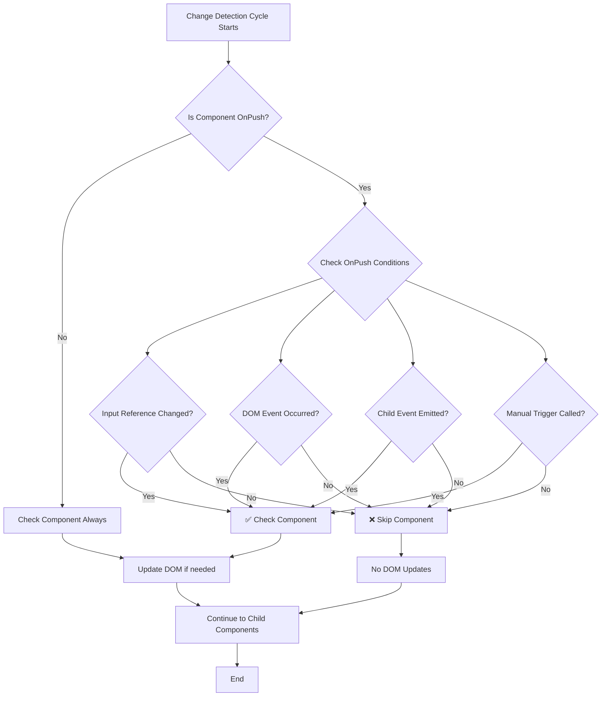

#### **OnPush vs Default Strategy Comparison**

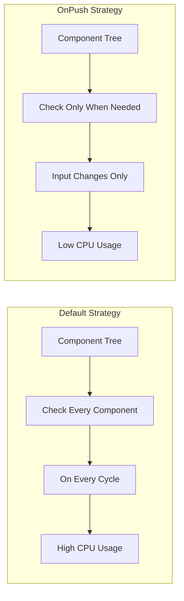

#### **Memory Reference vs Value Comparison**

OnPush uses **reference equality** (===) for input comparison, not deep value comparison:

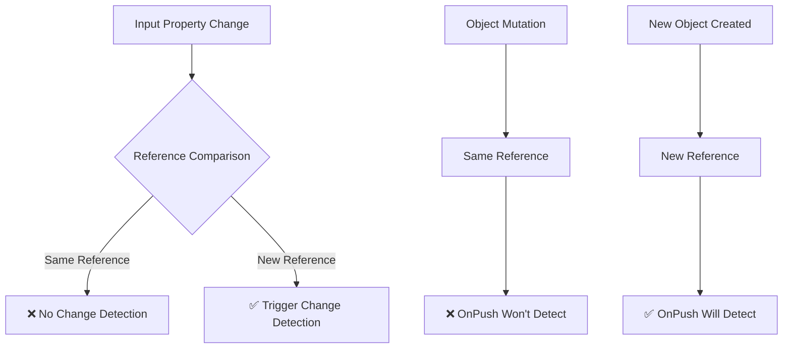

### OnPush Implementation Example

```typescript
@Component({
  selector: "app-onpush-example",
  changeDetection: ChangeDetectionStrategy.OnPush, // Line 1: OnPush strategy
  template: `
    <div>
      <h3>{{ title }}</h3>
      <!-- Line 2: Only updates when input changes or event occurs -->
      <p>Count: {{ count }}</p>
      <!-- Line 3: Internal state - won't update automatically -->
      <button (click)="increment()">Increment</button>
      <!-- Line 4: Local event - will trigger change detection -->

      <child-component
        [data]="childData"
        (dataChange)="onChildDataChange($event)"
      >
      </child-component>
      <!-- Line 5: Child component with input/output bindings -->
    </div>
  `,
})
export class OnPushExampleComponent {
  @Input() title: string = ""; // Line 6: Input property
  count = 0; // Line 7: Internal state
  childData = { value: 100 }; // Line 8: Reference for child component

  constructor(private cdr: ChangeDetectorRef) {} // Line 9: Injected CDR

  increment() {
    this.count++; // Line 10: State change
    // Line 11: OnPush components need manual detection trigger
    this.cdr.markForCheck(); // Line 12: Mark component for check
  }

  onChildDataChange(newData: any) {
    // Line 13: Child event automatically triggers change detection
    this.childData = { ...newData }; // Line 14: Creating new reference
  }

  // Line 15: Method to demonstrate when OnPush updates automatically
  @HostListener("window:resize")
  onResize() {
    // Line 16: Global events don't trigger OnPush change detection
    this.count++; // Line 17: This won't update the template
    // Line 18: Need manual trigger
    this.cdr.detectChanges(); // Line 19: Force immediate detection
  }
}

// 📊 Advanced OnPush Pattern with State Management
@Component({
  selector: "app-advanced-onpush",
  changeDetection: ChangeDetectionStrategy.OnPush,
  template: `
    <div class="advanced-component">
      <!-- ✅ These will update automatically -->
      <h3>{{ user.name }}</h3>
      <p>{{ user.email }}</p>

      <!-- ❌ These won't update without manual triggers -->
      <p>Internal Counter: {{ internalCounter }}</p>
      <p>Async Data: {{ asyncData }}</p>

      <!-- ✅ Event handlers work automatically -->
      <button (click)="updateUser()">Update User</button>
      <button (click)="updateInternal()">Update Internal</button>
      <button (click)="loadAsyncData()">Load Async Data</button>
    </div>
  `,
})
export class AdvancedOnPushComponent implements OnInit {
  @Input() user: User = { name: "", email: "" }; // Line 20: Input property

  internalCounter = 0; // Line 21: Internal state (needs manual triggers)
  asyncData = ""; // Line 22: Async data (needs manual triggers)

  constructor(
    private cdr: ChangeDetectorRef,
    private dataService: DataService
  ) {}

  ngOnInit() {
    // Line 23: Async operations need manual change detection
    this.dataService
      .getData()
      .pipe(takeUntil(this.destroy$))
      .subscribe((data) => {
        this.asyncData = data; // Line 24: Update async data
        this.cdr.markForCheck(); // Line 25: Manual trigger required
      });
  }

  updateUser() {
    // Line 26: Input property updates (parent will handle)
    // This method would typically emit to parent
    this.userUpdate.emit({
      ...this.user,
      name: "Updated Name",
    }); // Line 27: Emit new user object
  }

  updateInternal() {
    this.internalCounter++; // Line 28: Internal state change
    this.cdr.markForCheck(); // Line 29: Manual trigger needed
  }

  loadAsyncData() {
    // Line 30: Async operation example
    setTimeout(() => {
      this.asyncData = `Loaded at ${Date.now()}`; // Line 31: Async update
      this.cdr.markForCheck(); // Line 32: Manual trigger required
    }, 1000);
  }
}
```

**Line-by-line explanation:**

- **Line 1**: OnPush strategy only checks component when inputs change or events occur
- **Line 2**: Template binding that only updates when change detection runs
- **Line 3**: Internal state binding that won't auto-update with OnPush
- **Line 4**: Local event binding that triggers change detection for OnPush components
- **Line 5**: Child component bindings that can trigger parent updates
- **Line 6**: Input property changes automatically trigger OnPush detection
- **Line 7**: Internal state that requires manual detection triggering
- **Line 8**: Object reference for demonstrating reference vs mutation
- **Line 9**: ChangeDetectorRef injection for manual control
- **Line 10**: State modification that won't automatically update view
- **Line 12**: markForCheck() schedules component for next detection cycle
- **Line 13**: Child events automatically work with OnPush
- **Line 14**: Creating new reference ensures change detection works
- **Line 16-17**: External events don't trigger OnPush detection
- **Line 19**: detectChanges() forces immediate detection cycle

### Comparison: Default vs OnPush

#### **🔬 Performance Analysis Deep Dive**

Understanding the performance implications between Default and OnPush strategies is crucial for building scalable Angular applications.

#### **Change Detection Frequency Comparison**

```mermaid
graph TD
    A[User Action] --> B{Strategy Type}

    B -->|Default| C[Check ALL Components]
    C --> D[Component Tree: 100 components]
    D --> E[100 checks performed]
    E --> F[High CPU Usage]

    B -->|OnPush| G[Check ONLY affected components]
    G --> H[Only components with input changes]
    H --> I[~5-10 checks performed]
    I --> J[Low CPU Usage]

    K[Performance Impact] --> L[Default: O(n) complexity]
    K --> M[OnPush: O(log n) complexity]
```

#### **Memory and CPU Usage Patterns**

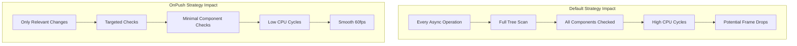

#### **Real-World Performance Metrics**

```typescript
// Performance comparison demonstration
@Component({
  selector: "app-performance-comparison",
  template: `
    <div class="comparison-container">
      <!-- Default Strategy Component -->
      <default-heavy-component [data]="sharedData"> </default-heavy-component>

      <!-- OnPush Strategy Component -->
      <onpush-heavy-component [data]="sharedData"> </onpush-heavy-component>

      <button (click)="updateUnrelatedData()">Update Unrelated Data</button>
      <!-- Line 1: Button that updates data not used by child components -->

      <div class="metrics">
        <h4>Performance Metrics</h4>
        <p>Default Component Checks: {{ defaultChecks }}</p>
        <p>OnPush Component Checks: {{ onPushChecks }}</p>
        <p>Performance Ratio: {{ performanceRatio }}</p>
      </div>
    </div>
  `,
})
export class PerformanceComparisonComponent implements AfterViewInit {
  sharedData = { items: this.generateItems(1000) }; // Line 2: Shared data
  unrelatedData = "initial"; // Line 3: Data not used by children

  defaultChecks = 0;
  onPushChecks = 0;

  @ViewChild(DefaultHeavyComponent) defaultComponent!: DefaultHeavyComponent;
  @ViewChild(OnPushHeavyComponent) onPushComponent!: OnPushHeavyComponent;

  ngAfterViewInit() {
    // Monitor check counts
    setInterval(() => {
      this.defaultChecks = this.defaultComponent?.checkCount || 0;
      this.onPushChecks = this.onPushComponent?.checkCount || 0;
    }, 100);
  }

  get performanceRatio(): string {
    if (this.onPushChecks === 0) return "N/A";
    return `${Math.round(
      this.defaultChecks / this.onPushChecks
    )}x more efficient`;
  }

  updateUnrelatedData() {
    this.unrelatedData = "updated-" + Date.now(); // Line 4: Update unrelated data
    // Line 5: Default strategy components will check unnecessarily
    // Line 6: OnPush components won't check since their inputs didn't change
  }

  generateItems(count: number) {
    // Line 7: Helper method to create test data
    return Array.from({ length: count }, (_, i) => ({
      id: i,
      name: `Item ${i}`,
      value: Math.random(),
    }));
  }
}

// 📊 Advanced Performance Monitoring
@Injectable({ providedIn: "root" })
export class ChangeDetectionProfiler {
  private performanceMap = new Map<
    string,
    {
      checks: number;
      totalTime: number;
      averageTime: number;
      lastCheckTime: number;
    }
  >();

  recordCheck(componentName: string, duration: number) {
    const existing = this.performanceMap.get(componentName) || {
      checks: 0,
      totalTime: 0,
      averageTime: 0,
      lastCheckTime: 0,
    };

    existing.checks++;
    existing.totalTime += duration;
    existing.averageTime = existing.totalTime / existing.checks;
    existing.lastCheckTime = performance.now();

    this.performanceMap.set(componentName, existing);
  }

  getPerformanceReport(): Array<{ component: string; metrics: any }> {
    return Array.from(this.performanceMap.entries())
      .map(([component, metrics]) => ({
        component,
        metrics,
      }))
      .sort((a, b) => b.metrics.totalTime - a.metrics.totalTime);
  }

  identifyBottlenecks(): string[] {
    const report = this.getPerformanceReport();
    return report
      .filter((item) => item.metrics.averageTime > 5) // More than 5ms average
      .map((item) => item.component);
  }
}

// Default strategy - will check every cycle
@Component({
  selector: "default-heavy-component",
  changeDetection: ChangeDetectionStrategy.Default, // Line 8: Default strategy
  template: `
    <div>
      <h4>Default Strategy (Checks: {{ checkCount }})</h4>
      <!-- Line 9: Display check counter -->
      <ul>
        <li *ngFor="let item of data.items; trackBy: trackByFn">
          {{ item.name }}: {{ expensiveCalculation(item.value) }}
        </li>
        <!-- Line 10: Expensive calculation called every check -->
      </ul>
      <div
        class="performance-indicator"
        [style.background-color]="getPerformanceColor()"
      >
        Performance: {{ checkFrequency }} checks/sec
      </div>
    </div>
  `,
})
export class DefaultHeavyComponent implements DoCheck, OnInit {
  @Input() data: any; // Line 11: Input data
  checkCount = 0; // Line 12: Counter for change detection cycles
  private lastCheckTime = 0;
  private checkTimes: number[] = [];

  constructor(private profiler: ChangeDetectionProfiler) {}

  ngOnInit() {
    this.lastCheckTime = performance.now();
  }

  ngDoCheck() {
    const startTime = performance.now();
    this.checkCount++; // Line 13: Increment on every check

    // Record timing for performance analysis
    const timeSinceLastCheck = startTime - this.lastCheckTime;
    this.checkTimes.push(timeSinceLastCheck);

    // Keep only last 10 measurements for frequency calculation
    if (this.checkTimes.length > 10) {
      this.checkTimes = this.checkTimes.slice(-10);
    }

    this.lastCheckTime = startTime;
    console.log("Default component checked:", this.checkCount);

    // Record performance
    const endTime = performance.now();
    this.profiler.recordCheck("DefaultHeavyComponent", endTime - startTime);
  }

  get checkFrequency(): number {
    if (this.checkTimes.length < 2) return 0;
    const avgInterval =
      this.checkTimes.reduce((a, b) => a + b, 0) / this.checkTimes.length;
    return Math.round(1000 / avgInterval);
  }

  getPerformanceColor(): string {
    const freq = this.checkFrequency;
    if (freq > 60) return "#ff4444"; // Red - too frequent
    if (freq > 30) return "#ffaa44"; // Orange - moderate
    return "#44ff44"; // Green - good
  }

  expensiveCalculation(value: number): number {
    // Line 14: Simulate expensive operation
    let result = value;
    for (let i = 0; i < 10000; i++) {
      result = Math.sin(result) * Math.cos(result);
    }
    return result; // Line 15: Return computed value
  }

  trackByFn(index: number, item: any): any {
    return item.id; // Line 16: Track by ID for performance
  }
}

// OnPush strategy - only checks when inputs change
@Component({
  selector: "onpush-heavy-component",
  changeDetection: ChangeDetectionStrategy.OnPush, // Line 17: OnPush strategy
  template: `
    <div>
      <h4>OnPush Strategy (Checks: {{ checkCount }})</h4>
      <ul>
        <li *ngFor="let item of data.items; trackBy: trackByFn">
          {{ item.name }}: {{ expensiveCalculation(item.value) }}
        </li>
      </ul>
      <div
        class="performance-indicator"
        [style.background-color]="getPerformanceColor()"
      >
        Performance: Optimal (OnPush)
      </div>
    </div>
  `,
})
export class OnPushHeavyComponent implements DoCheck, OnInit {
  @Input() data: any;
  checkCount = 0;
  private checkTimes: number[] = [];

  constructor(private profiler: ChangeDetectionProfiler) {}

  ngOnInit() {
    console.log("OnPush component initialized");
  }

  ngDoCheck() {
    const startTime = performance.now();
    this.checkCount++; // Line 18: Only increments when inputs change
    console.log("OnPush component checked:", this.checkCount);

    // Record timing
    const endTime = performance.now();
    this.profiler.recordCheck("OnPushHeavyComponent", endTime - startTime);
  }

  getPerformanceColor(): string {
    return "#44ff44"; // Always green - OnPush is efficient
  }

  expensiveCalculation(value: number): number {
    // Line 19: Same expensive operation
    let result = value;
    for (let i = 0; i < 10000; i++) {
      result = Math.sin(result) * Math.cos(result);
    }
    return result;
  }

  trackByFn(index: number, item: any): any {
    return item.id;
  }
}
```

**Line-by-line explanation:**

- **Line 1**: Event that updates unrelated data to demonstrate performance difference
- **Line 2**: Shared data object passed to both child components
- **Line 3**: Unrelated data that doesn't affect children
- **Line 4**: Updates unrelated data, triggering change detection
- **Line 5-6**: Comments explaining behavior difference between strategies
- **Line 7**: Helper method for generating test data
- **Line 8**: Explicit Default strategy declaration
- **Line 9**: Template showing check count to visualize detection frequency
- **Line 10**: Expensive calculation that runs every detection cycle
- **Line 11**: Input property that both components receive
- **Line 12**: Counter to track how many times component is checked
- **Line 13**: DoCheck hook that runs every change detection cycle
- **Line 14-15**: Expensive calculation to simulate real-world performance impact
- **Line 16**: TrackBy function for ngFor performance optimization
- **Line 17**: OnPush strategy that only checks when inputs change
- **Line 18**: Check counter that only increments when actually needed
- **Line 19**: Same expensive operation showing performance benefit

---

## ChangeDetectorRef Methods and Usage

### 🧠 ChangeDetectorRef - Deep Theory & Architecture

#### **Theoretical Foundation**

ChangeDetectorRef is Angular's API for manually controlling change detection. It provides methods to detach components from the change detection tree, trigger detection manually, and check if detection is needed. Understanding its internal workings is crucial for optimizing Angular applications.

#### **ChangeDetectorRef Architecture Diagram**

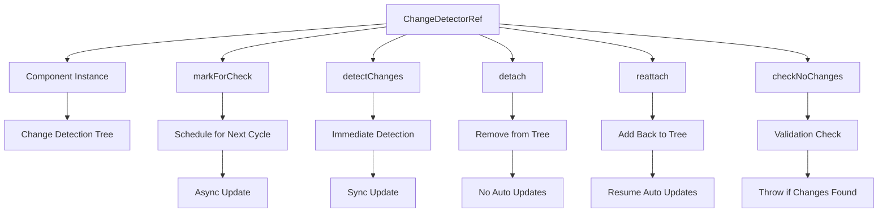

#### **Method Execution Flow Comparison**

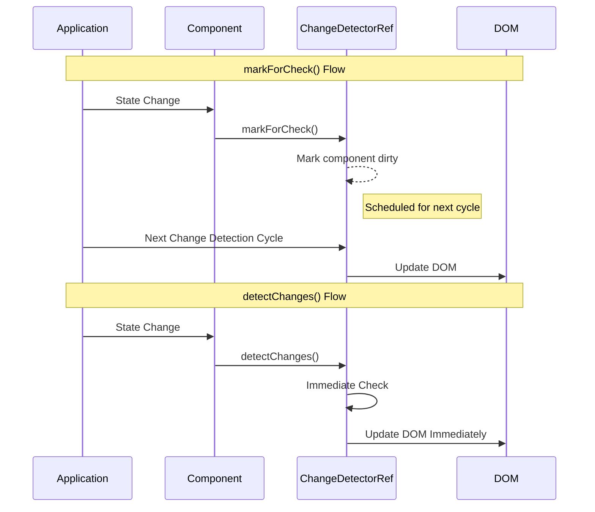

#### **Component Tree State Management**

```mermaid
graph TD
    A[Root Component] --> B[Child Component 1]
    A --> C[Child Component 2]
    B --> D[Grandchild 1]
    B --> E[Grandchild 2]

    subgraph "Attached State"
        F[All components in tree]
        F --> G[Receive change detection]
    end

    subgraph "Detached State"
        H[Component removed from tree]
        H --> I[No automatic updates]
        H --> J[Manual triggers still work]
    end

    K[detach()] --> H
    L[reattach()] --> F
```

### Understanding ChangeDetectorRef

ChangeDetectorRef is Angular's API for manually controlling change detection. It provides methods to detach components from the change detection tree, trigger detection manually, and check if detection is needed.

#### **🔄 Core CDR Methods Deep Dive**

##### **1. markForCheck() - Theoretical Understanding**

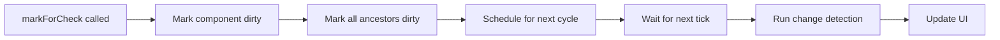

**How markForCheck() works internally:**

- Marks the component and all its **ancestors** as dirty
- **Schedules** (doesn't immediately run) change detection
- Works **bottom-up** through the component tree
- **Asynchronous** - runs on next change detection cycle

##### **2. detectChanges() - Theoretical Understanding**

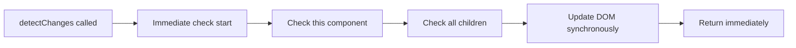

**How detectChanges() works internally:**

- Runs change detection **immediately** and **synchronously**
- Checks **only this component and its children** (top-down)
- **Does not** check parent components
- Updates DOM **immediately**

#### **🎯 Advanced CDR Patterns & Use Cases**

##### **Pattern 1: Async Operations with OnPush**

```typescript
@Component({
  changeDetection: ChangeDetectionStrategy.OnPush,
  template: `
    <div class="async-container">
      <p>HTTP Data: {{ httpData }}</p>
      <p>Timer Data: {{ timerData }}</p>
      <p>Observable Data: {{ observableData }}</p>
    </div>
  `,
})
export class AsyncOnPushComponent implements OnInit {
  httpData = "";
  timerData = "";
  observableData = "";

  constructor(private cdr: ChangeDetectorRef, private http: HttpClient) {}

  ngOnInit() {
    // ❌ WRONG: Without markForCheck
    this.http.get("/api/data").subscribe((data) => {
      this.httpData = data;
      // UI won't update with OnPush!
    });

    // ✅ CORRECT: With markForCheck
    this.http.get("/api/data").subscribe((data) => {
      this.httpData = data;
      this.cdr.markForCheck(); // Schedule update for next cycle
    });

    // ✅ CORRECT: With detectChanges (immediate)
    this.http.get("/api/data").subscribe((data) => {
      this.httpData = data;
      this.cdr.detectChanges(); // Update immediately
    });

    // ✅ BEST PRACTICE: Async pipe (automatic)
    this.observableData$ = this.http.get("/api/data");
    // Use {{ observableData$ | async }} in template
  }
}
```

##### **Pattern 2: Performance Optimization with detach/reattach**

```typescript
@Component({
  template: `
    <div class="performance-component">
      <h3>High-Frequency Updates</h3>
      <p>Status: {{ status }}</p>
      <p>Counter: {{ counter }}</p>
      <button (click)="startHighFrequencyUpdates()">Start Updates</button>
      <button (click)="stopHighFrequencyUpdates()">Stop Updates</button>
    </div>
  `,
})
export class PerformanceOptimizedComponent {
  status = "stopped";
  counter = 0;
  private intervalId: any;
  private isDetached = false;

  constructor(private cdr: ChangeDetectorRef) {}

  startHighFrequencyUpdates() {
    // Detach from change detection for performance
    this.cdr.detach();
    this.isDetached = true;
    this.status = "running (detached)";
    this.cdr.detectChanges(); // Manual update to show status

    // High-frequency updates without triggering change detection
    this.intervalId = setInterval(() => {
      this.counter++;
      // No automatic UI updates while detached

      // Manually update every 100 increments
      if (this.counter % 100 === 0) {
        this.cdr.detectChanges(); // Periodic manual updates
      }
    }, 10); // Very high frequency - 100 times per second
  }

  stopHighFrequencyUpdates() {
    clearInterval(this.intervalId);

    // Reattach to change detection
    this.cdr.reattach();
    this.isDetached = false;
    this.status = "stopped (attached)";
    // reattach() automatically triggers change detection
  }
}
```

#### **🛡️ Error Handling & Best Practices**

##### **checkNoChanges() - Development Debugging**

```typescript
@Component({
  template: `<div>Debug Component</div>`,
})
export class DebugComponent implements AfterViewChecked {
  constructor(private cdr: ChangeDetectorRef) {}

  ngAfterViewChecked() {
    if (isDevMode()) {
      try {
        // Verify no unexpected changes occurred
        this.cdr.checkNoChanges();
        console.log("✅ No unexpected changes detected");
      } catch (error) {
        console.error("❌ Unexpected changes detected:", error);
        // This indicates a bug in your change detection logic
      }
    }
  }
}
```

### Basic ChangeDetectorRef injection and usage

```typescript
@Component({
  selector: "app-cdr-basic",
  changeDetection: ChangeDetectionStrategy.OnPush, // Line 1: OnPush strategy
  template: `
    <div>
      <h3>ChangeDetectorRef Basic Usage</h3>
      <p>Counter: {{ counter }}</p>
      <!-- Line 2: Property binding that needs manual detection -->
      <p>Status: {{ status }}</p>
      <!-- Line 3: Status display -->
      <p>Last Update: {{ lastUpdate | date : "HH:mm:ss" }}</p>
      <!-- Line 4: Timestamp with pipe -->

      <div class="controls">
        <button (click)="incrementWithMarkForCheck()">
          Increment + markForCheck()
        </button>
        <!-- Line 5: Button using markForCheck -->
        <button (click)="incrementWithDetectChanges()">
          Increment + detectChanges()
        </button>
        <!-- Line 6: Button using detectChanges -->
        <button (click)="incrementWithoutDetection()">
          Increment (No Detection)
        </button>
        <!-- Line 7: Button without detection -->
        <button (click)="checkNoChanges()">Check No Changes</button>
        <!-- Line 8: Button to test checkNoChanges -->
      </div>
    </div>
  `,
  styles: [
    `
      .controls button {
        margin: 5px;
        padding: 8px 15px;
        border: none;
        border-radius: 4px;
        cursor: pointer;
        background: #007bff;
        color: white;
      }
      .controls button:hover {
        background: #0056b3;
      }
    `,
  ],
})
export class CDRBasicComponent implements OnInit {
  counter = 0; // Line 9: Counter property
  status = "Ready"; // Line 10: Status property
  lastUpdate = new Date(); // Line 11: Timestamp property

  constructor(private cdr: ChangeDetectorRef) {} // Line 12: CDR injection

  ngOnInit() {
    console.log("Component initialized with OnPush strategy"); // Line 13: Initialization log
  }

  incrementWithMarkForCheck() {
    // Line 14: Method using markForCheck()
    console.log("🔄 Using markForCheck()");
    this.counter++; // Line 15: Update counter
    this.status = "Updated with markForCheck"; // Line 16: Update status
    this.lastUpdate = new Date(); // Line 17: Update timestamp

    this.cdr.markForCheck(); // Line 18: Schedule for next detection cycle
    console.log("✅ markForCheck() called - will update on next cycle"); // Line 19: Log
  }

  incrementWithDetectChanges() {
    // Line 20: Method using detectChanges()
    console.log("⚡ Using detectChanges()");
    this.counter++; // Line 21: Update counter
    this.status = "Updated with detectChanges"; // Line 22: Update status
    this.lastUpdate = new Date(); // Line 23: Update timestamp

    this.cdr.detectChanges(); // Line 24: Immediate detection
    console.log("✅ detectChanges() called - updated immediately"); // Line 25: Log
  }

  incrementWithoutDetection() {
    // Line 26: Method without triggering detection
    console.log("🚫 No detection triggered");
    this.counter++; // Line 27: Update counter
    this.status = "Updated but not detected"; // Line 28: Update status
    this.lastUpdate = new Date(); // Line 29: Update timestamp

    console.log("❌ No detection method called - UI will not update"); // Line 30: Log
  }

  checkNoChanges() {
    // Line 31: Method to test checkNoChanges()
    console.log("🔍 Testing checkNoChanges()");

    try {
      this.cdr.checkNoChanges(); // Line 32: Check for unexpected changes
      console.log("✅ No unexpected changes detected"); // Line 33: Success log
    } catch (error) {
      console.error("❌ Unexpected changes detected:", error); // Line 34: Error log
    }
  }
}
```

**Line-by-line explanation:**

- **Line 1**: OnPush strategy requires manual change detection control
- **Line 2-4**: Template bindings that only update when detection runs
- **Line 5-8**: Buttons demonstrating different ChangeDetectorRef methods
- **Line 9-11**: Component properties that change detection monitors
- **Line 12**: ChangeDetectorRef injection for manual control
- **Line 13**: Component initialization logging
- **Line 14**: Method demonstrating markForCheck() usage
- **Line 15-17**: State changes that need to be reflected in UI
- **Line 18**: markForCheck() schedules component for next detection cycle
- **Line 19**: Logging to show when markForCheck is called
- **Line 20**: Method demonstrating detectChanges() usage
- **Line 21-23**: State changes for immediate detection
- **Line 24**: detectChanges() runs detection immediately
- **Line 25**: Logging to show immediate detection
- **Line 26**: Method showing what happens without detection
- **Line 27-29**: State changes that won't appear in UI
- **Line 30**: Warning about missing detection
- **Line 31**: Method to test checkNoChanges()
- **Line 32**: Check if there are unexpected changes
- **Line 33-34**: Handle checkNoChanges result

### Core ChangeDetectorRef Methods

#### 1. markForCheck()

```typescript
@Component({
  selector: "app-mark-for-check-demo",
  changeDetection: ChangeDetectionStrategy.OnPush,
  template: `
    <div class="demo-container">
      <h3>markForCheck() Demonstration</h3>

      <div class="status-section">
        <p>Async Counter: {{ asyncCounter }}</p>
        <!-- Line 1: Counter updated by async operations -->
        <p>HTTP Response: {{ httpResponse }}</p>
        <!-- Line 2: Response from HTTP calls -->
        <p>Timer Status: {{ timerStatus }}</p>
        <!-- Line 3: Timer operation status -->
        <p>Observable Data: {{ observableData }}</p>
        <!-- Line 4: Data from observables -->
      </div>

      <div class="control-section">
        <button (click)="startAsyncCounter()">Start Async Counter</button>
        <!-- Line 5: Start async operations -->
        <button (click)="makeHttpCall()">Make HTTP Call</button>
        <!-- Line 6: Trigger HTTP request -->
        <button (click)="startObservableStream()">Start Observable</button>
        <!-- Line 7: Start observable stream -->
        <button (click)="stopAllOperations()">Stop All</button>
        <!-- Line 8: Stop all async operations -->
      </div>
    </div>
  `,
  styles: [
    `
      .demo-container {
        padding: 20px;
      }
      .status-section {
        background: #f5f5f5;
        padding: 15px;
        margin: 10px 0;
      }
      .control-section button {
        margin: 5px;
        padding: 8px 15px;
      }
    `,
  ],
})
export class MarkForCheckDemoComponent implements OnDestroy {
  asyncCounter = 0; // Line 9: Async counter property
  httpResponse = "No response yet"; // Line 10: HTTP response property
  timerStatus = "Stopped"; // Line 11: Timer status property
  observableData = "No data"; // Line 12: Observable data property

  private intervalId: any; // Line 13: Timer reference
  private subscription: Subscription = new Subscription(); // Line 14: Subscription management

  constructor(
    private cdr: ChangeDetectorRef, // Line 15: CDR injection
    private http: HttpClient // Line 16: HTTP client injection
  ) {}

  startAsyncCounter() {
    // Line 17: Start async counter with markForCheck
    this.timerStatus = "Running"; // Line 18: Update status
    this.cdr.markForCheck(); // Line 19: Trigger detection for status update

    this.intervalId = setInterval(() => {
      this.asyncCounter++; // Line 20: Increment counter in async context
      this.timerStatus = `Running (${this.asyncCounter})`; // Line 21: Update status

      // Line 22: Critical - markForCheck needed for OnPush with async updates
      this.cdr.markForCheck();

      console.log(`Async counter: ${this.asyncCounter}`); // Line 23: Log update
    }, 1000);
  }

  makeHttpCall() {
    // Line 24: HTTP call with markForCheck
    this.httpResponse = "Loading..."; // Line 25: Set loading state
    this.cdr.markForCheck(); // Line 26: Trigger detection for loading state

    // Line 27: Simulate HTTP call
    this.http
      .get("https://jsonplaceholder.typicode.com/posts/1")
      .pipe(takeUntil(this.subscription.asObservable())) // Line 28: Cleanup
      .subscribe({
        next: (data: any) => {
          this.httpResponse = `Success: ${data.title}`; // Line 29: Update with response
          this.cdr.markForCheck(); // Line 30: Trigger detection for response
          console.log("HTTP response received"); // Line 31: Log success
        },
        error: (error) => {
          this.httpResponse = `Error: ${error.message}`; // Line 32: Update with error
          this.cdr.markForCheck(); // Line 33: Trigger detection for error
          console.error("HTTP error:", error); // Line 34: Log error
        },
      });
  }

  startObservableStream() {
    // Line 35: Observable stream with markForCheck
    console.log("Starting observable stream"); // Line 36: Log start

    const stream$ = interval(2000).pipe(
      take(5), // Line 37: Limit to 5 emissions
      map((i) => `Stream data ${i + 1}`), // Line 38: Transform data
      takeUntil(this.subscription.asObservable()) // Line 39: Cleanup
    );

    stream$.subscribe({
      next: (data) => {
        this.observableData = data; // Line 40: Update from observable
        this.cdr.markForCheck(); // Line 41: Required for OnPush + observables
        console.log("Observable data:", data); // Line 42: Log data
      },
      complete: () => {
        this.observableData = "Stream completed"; // Line 43: Update on completion
        this.cdr.markForCheck(); // Line 44: Trigger detection for completion
        console.log("Observable stream completed"); // Line 45: Log completion
      },
    });
  }

  stopAllOperations() {
    // Line 46: Stop all operations and update UI
    if (this.intervalId) {
      clearInterval(this.intervalId); // Line 47: Clear timer
      this.intervalId = null;
    }

    this.subscription.unsubscribe(); // Line 48: Unsubscribe observables
    this.subscription = new Subscription(); // Line 49: Reset subscription

    // Line 50: Update all statuses
    this.timerStatus = "Stopped";
    this.observableData = "Stopped";
    this.httpResponse = "Stopped";

    this.cdr.markForCheck(); // Line 51: Update UI with stopped states
    console.log("All operations stopped"); // Line 52: Log stop
  }

  ngOnDestroy() {
    this.stopAllOperations(); // Line 53: Cleanup on destroy
  }
}
```

**Line-by-line explanation:**

- **Line 1-4**: Template bindings updated by async operations
- **Line 5-8**: Control buttons for different async scenarios
- **Line 9-12**: Properties updated by async operations
- **Line 13-14**: References for cleanup
- **Line 15-16**: Dependency injection
- **Line 17**: Method starting async operations
- **Line 18-19**: Initial status update with immediate detection
- **Line 20-21**: Async updates inside timer
- **Line 22**: markForCheck() essential for OnPush with async updates
- **Line 23**: Logging for debugging
- **Line 24**: HTTP operation demonstration
- **Line 25-26**: Loading state with immediate update
- **Line 27**: HTTP request setup
- **Line 28**: Subscription cleanup
- **Line 29-30**: Success response handling with detection
- **Line 31**: Success logging
- **Line 32-33**: Error response handling with detection
- **Line 34**: Error logging
- **Line 35**: Observable stream demonstration
- **Line 36**: Operation start logging
- **Line 37**: Limit observable emissions
- **Line 38**: Transform observable data
- **Line 39**: Cleanup mechanism
- **Line 40-41**: Observable data update with detection
- **Line 42**: Data logging
- **Line 43-44**: Completion state with detection
- **Line 45**: Completion logging
- **Line 46**: Method to stop all operations
- **Line 47**: Timer cleanup
- **Line 48-49**: Subscription cleanup and reset
- **Line 50**: Status updates
- **Line 51**: Final UI update
- **Line 52**: Stop logging
- **Line 53**: Component cleanup

#### 2. detectChanges()

```typescript
@Component({
  selector: "app-detect-changes-demo",
  changeDetection: ChangeDetectionStrategy.OnPush,
  template: `
    <div class="demo-container">
      <h3>detectChanges() Demonstration</h3>

      <div class="immediate-section">
        <p>Immediate Counter: {{ immediateCounter }}</p>
        <!-- Line 1: Counter for immediate updates -->
        <p>Batch Counter: {{ batchCounter }}</p>
        <!-- Line 2: Counter for batch updates -->
        <p>Performance Time: {{ performanceTime }}ms</p>
        <!-- Line 3: Performance measurement display -->
      </div>

      <div class="control-section">
        <button (click)="immediateUpdate()">Immediate Update</button>
        <!-- Line 4: Immediate update button -->
        <button (click)="batchUpdates()">Batch Updates</button>
        <!-- Line 5: Batch updates button -->
        <button (click)="performanceTest()">Performance Test</button>
        <!-- Line 6: Performance test button -->
        <button (click)="conditionalUpdate()">Conditional Update</button>
        <!-- Line 7: Conditional update button -->
      </div>

      <div class="child-section">
        <h4>Child Component Updates:</h4>
        <child-component [data]="childData" #childComp></child-component>
        <!-- Line 8: Child component with data binding -->
        <button (click)="updateChildDirectly()">Update Child Directly</button>
        <!-- Line 9: Direct child update button -->
      </div>
    </div>
  `,
  styles: [
    `
      .demo-container {
        padding: 20px;
      }
      .immediate-section {
        background: #e8f5e8;
        padding: 15px;
        margin: 10px 0;
      }
      .child-section {
        background: #e8e8f5;
        padding: 15px;
        margin: 10px 0;
      }
      .control-section button {
        margin: 5px;
        padding: 8px 15px;
      }
    `,
  ],
})
export class DetectChangesDemoComponent implements AfterViewInit {
  immediateCounter = 0; // Line 10: Counter for immediate updates
  batchCounter = 0; // Line 11: Counter for batch updates
  performanceTime = 0; // Line 12: Performance timing
  childData = { value: "Initial", count: 0 }; // Line 13: Data for child

  @ViewChild("childComp") childComponent!: any; // Line 14: Child component reference

  constructor(private cdr: ChangeDetectorRef) {} // Line 15: CDR injection

  ngAfterViewInit() {
    console.log("DetectChanges demo initialized"); // Line 16: Initialization log
  }

  immediateUpdate() {
    // Line 17: Demonstrate immediate UI update
    console.log("🚀 Immediate update with detectChanges()");

    this.immediateCounter++; // Line 18: Update counter

    // Line 19: Force immediate change detection
    this.cdr.detectChanges();

    console.log("✅ UI updated immediately"); // Line 20: Log immediate update
    console.log("Current counter in DOM:", this.immediateCounter); // Line 21: Verify update
  }

  batchUpdates() {
    // Line 22: Demonstrate batching multiple updates
    console.log("📦 Batching multiple updates");

    const startTime = performance.now(); // Line 23: Start timing

    // Line 24: Multiple property updates
    this.batchCounter += 5;
    this.immediateCounter += 2;
    this.childData = {
      ...this.childData,
      count: this.childData.count + 1,
    };

    // Line 25: Single detectChanges() call for all updates
    this.cdr.detectChanges();

    const endTime = performance.now(); // Line 26: End timing
    this.performanceTime = Math.round((endTime - startTime) * 100) / 100; // Line 27: Calculate time

    console.log(`✅ Batched updates completed in ${this.performanceTime}ms`); // Line 28: Log timing
  }

  performanceTest() {
    // Line 29: Performance comparison test
    console.log(
      "⚡ Performance test: detectChanges() vs multiple markForCheck()"
    );

    const iterations = 100; // Line 30: Test iterations

    // Line 31: Test detectChanges() performance
    const detectStart = performance.now();
    for (let i = 0; i < iterations; i++) {
      this.performanceTime = i; // Line 32: Update property
      this.cdr.detectChanges(); // Line 33: Immediate detection
    }
    const detectEnd = performance.now();

    // Line 34: Test markForCheck() performance
    const markStart = performance.now();
    for (let i = 0; i < iterations; i++) {
      this.performanceTime = i + iterations; // Line 35: Update property
      this.cdr.markForCheck(); // Line 36: Schedule detection
    }
    const markEnd = performance.now();

    // Line 37: Log performance results
    console.log(
      `detectChanges() time: ${(detectEnd - detectStart).toFixed(2)}ms`
    );
    console.log(`markForCheck() time: ${(markEnd - markStart).toFixed(2)}ms`);
    console.log(
      "Note: detectChanges() is synchronous, markForCheck() is asynchronous"
    );
  }

  conditionalUpdate() {
    // Line 38: Conditional update based on state
    console.log("🔍 Conditional update with detectChanges()");

    const oldValue = this.immediateCounter; // Line 39: Store old value
    this.immediateCounter = Math.floor(Math.random() * 100); // Line 40: Random update

    // Line 41: Only trigger detection if value actually changed
    if (this.immediateCounter !== oldValue) {
      console.log(`Value changed from ${oldValue} to ${this.immediateCounter}`);
      this.cdr.detectChanges(); // Line 42: Conditional detection
    } else {
      console.log("Value unchanged, skipping detection");
    }
  }

  updateChildDirectly() {
    // Line 43: Direct child component update
    console.log("👶 Updating child component directly");

    this.childData = {
      value: `Updated at ${Date.now()}`,
      count: this.childData.count + 10,
    }; // Line 44: Update child data

    // Line 45: detectChanges() updates this component AND its children
    this.cdr.detectChanges();

    console.log("✅ Parent and child updated via detectChanges()"); // Line 46: Log update

    // Line 47: Also trigger child's own detection if needed
    if (this.childComponent && this.childComponent.cdr) {
      this.childComponent.cdr.detectChanges(); // Line 48: Child detection
      console.log("✅ Child component also updated directly"); // Line 49: Log child update
    }
  }
}

// Line 50: Child component for detectChanges demonstration
@Component({
  selector: "child-component",
  changeDetection: ChangeDetectionStrategy.OnPush,
  template: `
    <div class="child-container">
      <p>Child Data: {{ data.value }}</p>
      <!-- Line 51: Display parent data -->
      <p>Child Count: {{ data.count }}</p>
      <!-- Line 52: Display count -->
      <p>Child Internal: {{ internalValue }}</p>
      <!-- Line 53: Display internal value -->
      <button (click)="updateInternal()">Update Internal</button>
      <!-- Line 54: Internal update button -->
    </div>
  `,
  styles: [
    `
      .child-container {
        border: 1px solid #ccc;
        padding: 10px;
        margin: 5px 0;
        border-radius: 4px;
      }
    `,
  ],
})
export class ChildComponent {
  @Input() data: any = {}; // Line 55: Input from parent
  internalValue = 0; // Line 56: Internal state

  constructor(public cdr: ChangeDetectorRef) {} // Line 57: Public CDR for parent access

  updateInternal() {
    this.internalValue++; // Line 58: Update internal state
    this.cdr.detectChanges(); // Line 59: Force internal update
    console.log("Child internal value updated"); // Line 60: Log update
  }
}
```

**Line-by-line explanation:**

- **Line 1-3**: Template bindings for immediate updates
- **Line 4-7**: Control buttons for different update scenarios
- **Line 8-9**: Child component integration
- **Line 10-13**: Component properties for demonstration
- **Line 14**: ViewChild reference to child component
- **Line 15**: ChangeDetectorRef injection
- **Line 16**: Component initialization
- **Line 17**: Method for immediate updates
- **Line 18**: Property update
- **Line 19**: detectChanges() forces immediate DOM update
- **Line 20-21**: Logging to verify immediate update
- **Line 22**: Method for batch updates
- **Line 23**: Performance timing start
- **Line 24**: Multiple property updates
- **Line 25**: Single detectChanges() for all updates
- **Line 26-27**: Performance timing calculation
- **Line 28**: Performance logging
- **Line 29**: Performance comparison test
- **Line 30**: Test iteration count
- **Line 31**: Start detectChanges() test
- **Line 32-33**: Update and detect in loop
- **Line 34**: Start markForCheck() test
- **Line 35-36**: Update and mark in loop
- **Line 37**: Performance results logging
- **Line 38**: Conditional update method
- **Line 39**: Store previous value
- **Line 40**: Generate random new value
- **Line 41**: Condition check for changes
- **Line 42**: Conditional detection trigger
- **Line 43**: Direct child update method
- **Line 44**: Child data update
- **Line 45**: Parent detection affects children
- **Line 46**: Update confirmation
- **Line 47-49**: Optional direct child detection
- **Line 50**: Child component declaration
- **Line 51-54**: Child template bindings and controls
- **Line 55-56**: Child component properties
- **Line 57**: Public CDR for parent access
- **Line 58-60**: Child internal update method

#### 3. detach() and reattach()

```typescript
@Component({
  selector: "app-detach-reattach-demo",
  template: `
    <div class="demo-container">
      <h3>detach() and reattach() Demonstration</h3>

      <div class="status-section">
        <p>Component Status: {{ isDetached ? "DETACHED" : "ATTACHED" }}</p>
        <!-- Line 1: Show attachment status -->
        <p>Auto Counter: {{ autoCounter }}</p>
        <!-- Line 2: Auto-incrementing counter -->
        <p>Manual Counter: {{ manualCounter }}</p>
        <!-- Line 3: Manually updated counter -->
        <p>Last Update: {{ lastUpdate | date : "HH:mm:ss.SSS" }}</p>
        <!-- Line 4: Timestamp display -->
      </div>

      <div class="control-section">
        <button (click)="detachComponent()" [disabled]="isDetached">
          Detach Component
        </button>
        <!-- Line 5: Detach button -->
        <button (click)="reattachComponent()" [disabled]="!isDetached">
          Reattach Component
        </button>
        <!-- Line 6: Reattach button -->
        <button (click)="manualUpdate()">Manual Update</button>
        <!-- Line 7: Manual update button -->
        <button (click)="forceDetection()" [disabled]="!isDetached">
          Force Detection (while detached)
        </button>
        <!-- Line 8: Force detection while detached -->
      </div>

      <div class="info-section">
        <h4>Behavior Explanation:</h4>
        <ul>
          <li>When ATTACHED: Auto counter updates automatically</li>
          <li>When DETACHED: Auto counter stops updating in UI</li>
          <li>Manual updates work with detectChanges() even when detached</li>
          <li>reattach() automatically triggers change detection</li>
        </ul>
      </div>
    </div>
  `,
  styles: [
    `
      .demo-container {
        padding: 20px;
      }
      .status-section {
        background: #f0f8ff;
        padding: 15px;
        margin: 10px 0;
      }
      .control-section {
        margin: 15px 0;
      }
      .control-section button {
        margin: 5px;
        padding: 8px 15px;
      }
      .control-section button:disabled {
        opacity: 0.5;
        cursor: not-allowed;
      }
      .info-section {
        background: #fffacd;
        padding: 15px;
        margin: 10px 0;
      }
    `,
  ],
})
export class DetachReattachDemoComponent implements OnInit, OnDestroy {
  isDetached = false; // Line 9: Detachment status
  autoCounter = 0; // Line 10: Auto-incrementing counter
  manualCounter = 0; // Line 11: Manually updated counter
  lastUpdate = new Date(); // Line 12: Last update timestamp

  private intervalId: any; // Line 13: Timer reference

  constructor(private cdr: ChangeDetectorRef) {} // Line 14: CDR injection

  ngOnInit() {
    // Line 15: Start auto-incrementing counter
    this.startAutoCounter();
    console.log("Component initialized - starting auto counter"); // Line 16: Log init
  }

  ngOnDestroy() {
    // Line 17: Cleanup timer
    if (this.intervalId) {
      clearInterval(this.intervalId); // Line 18: Clear interval
    }
  }

  private startAutoCounter() {
    // Line 19: Auto counter implementation
    this.intervalId = setInterval(() => {
      this.autoCounter++; // Line 20: Increment counter
      this.lastUpdate = new Date(); // Line 21: Update timestamp

      if (this.isDetached) {
        console.log(
          `Auto counter: ${this.autoCounter} (detached - UI won't update)`
        );
        // Line 22: Log when detached
      } else {
        console.log(
          `Auto counter: ${this.autoCounter} (attached - UI will update)`
        );
        // Line 23: Log when attached
      }
    }, 1000);
  }

  detachComponent() {
    // Line 24: Detach component from change detection
    console.log("🔓 Detaching component from change detection tree");

    this.cdr.detach(); // Line 25: Detach from CD tree
    this.isDetached = true; // Line 26: Update status
    this.lastUpdate = new Date(); // Line 27: Update timestamp

    // Line 28: Force one final update to show detached status
    this.cdr.detectChanges();

    console.log("✅ Component detached - auto updates will not reflect in UI"); // Line 29: Log
  }

  reattachComponent() {
    // Line 30: Reattach component to change detection
    console.log("🔗 Reattaching component to change detection tree");

    this.cdr.reattach(); // Line 31: Reattach to CD tree
    this.isDetached = false; // Line 32: Update status
    this.lastUpdate = new Date(); // Line 33: Update timestamp

    console.log(
      "✅ Component reattached - auto updates will now reflect in UI"
    ); // Line 34: Log
    // Line 35: Note - reattach() automatically triggers change detection
  }

  manualUpdate() {
    // Line 36: Manual update that works even when detached
    console.log("✋ Manual update triggered");

    this.manualCounter++; // Line 37: Update manual counter
    this.lastUpdate = new Date(); // Line 38: Update timestamp

    if (this.isDetached) {
      console.log(
        "Component is detached - using detectChanges() to force update"
      );
      this.cdr.detectChanges(); // Line 39: Force update when detached
    } else {
      console.log("Component is attached - update will happen automatically");
      // Line 40: When attached, event handlers trigger detection automatically
    }

    console.log(`Manual counter updated to: ${this.manualCounter}`); // Line 41: Log update
  }

  forceDetection() {
    // Line 42: Force detection while detached
    if (!this.isDetached) {
      console.log("Component is not detached"); // Line 43: Guard clause
      return;
    }

    console.log("⚡ Forcing change detection on detached component");
    this.lastUpdate = new Date(); // Line 44: Update timestamp

    // Line 45: detectChanges() works even on detached components
    this.cdr.detectChanges();

    console.log(
      "✅ Forced detection completed - UI updated despite detachment"
    ); // Line 46: Log
  }
}
```

**Line-by-line explanation:**

- **Line 1-4**: Template bindings showing different update behaviors
- **Line 5-8**: Control buttons for detach/reattach operations
- **Line 9-12**: Component state properties
- **Line 13**: Timer reference for cleanup
- **Line 14**: ChangeDetectorRef injection
- **Line 15**: Start auto-incrementing counter
- **Line 16**: Initialization logging
- **Line 17-18**: Cleanup in ngOnDestroy
- **Line 19**: Auto counter setup
- **Line 20-21**: Counter and timestamp updates
- **Line 22-23**: Different logging for detached/attached states
- **Line 24**: Component detachment method
- **Line 25**: detach() removes component from change detection tree
- **Line 26-27**: Status updates
- **Line 28**: Final update to show detached status
- **Line 29**: Detachment confirmation
- **Line 30**: Component reattachment method
- **Line 31**: reattach() adds component back to change detection tree
- **Line 32-33**: Status updates
- **Line 34**: Reattachment confirmation
- **Line 35**: Note about automatic detection on reattach
- **Line 36**: Manual update method
- **Line 37-38**: Property updates
- **Line 39**: Force detection when detached
- **Line 40**: Automatic detection when attached
- **Line 41**: Update confirmation
- **Line 42**: Force detection while detached
- **Line 43**: Guard clause for attachment status
- **Line 44**: Timestamp update
- **Line 45**: detectChanges() works on detached components
- **Line 46**: Force detection confirmation

#### 4. checkNoChanges()

```typescript
@Component({
  selector: "app-check-no-changes-demo",
  template: `
    <div class="demo-container">
      <h3>checkNoChanges() Demonstration</h3>

      <div class="status-section">
        <p>Test Counter: {{ testCounter }}</p>
        <!-- Line 1: Counter for testing -->
        <p>Status: {{ status }}</p>
        <!-- Line 2: Test status display -->
        <p>Last Check: {{ lastCheckTime | date : "HH:mm:ss.SSS" }}</p>
        <!-- Line 3: Last check timestamp -->
      </div>

      <div class="control-section">
        <button (click)="safeOperation()">Safe Operation</button>
        <!-- Line 4: Operation that shouldn't trigger changes -->
        <button (click)="unsafeOperation()">Unsafe Operation</button>
        <!-- Line 5: Operation that might trigger unexpected changes -->
        <button (click)="runCheckNoChanges()">Run checkNoChanges()</button>
        <!-- Line 6: Manual checkNoChanges test -->
        <button (click)="clearStatus()">Clear Status</button>
        <!-- Line 7: Reset status -->
      </div>

      <div class="log-section">
        <h4>Check Results:</h4>
        <div
          *ngFor="let log of checkLogs; trackBy: trackByLog"
          class="log-entry"
        >
          {{ log.timestamp | date : "HH:mm:ss.SSS" }} - {{ log.message }}
        </div>
        <!-- Line 8: Display check results -->
      </div>
    </div>
  `,
  styles: [
    `
      .demo-container {
        padding: 20px;
      }
      .status-section {
        background: #f5f5dc;
        padding: 15px;
        margin: 10px 0;
      }
      .control-section button {
        margin: 5px;
        padding: 8px 15px;
      }
      .log-section {
        background: #f0f0f0;
        padding: 15px;
        margin: 10px 0;
        max-height: 200px;
        overflow-y: auto;
      }
      .log-entry {
        padding: 5px;
        border-bottom: 1px solid #ddd;
        font-family: monospace;
      }
    `,
  ],
})
export class CheckNoChangesDemoComponent {
  testCounter = 0; // Line 9: Test counter
  status = "Ready"; // Line 10: Current status
  lastCheckTime = new Date(); // Line 11: Last check time
  checkLogs: Array<{ timestamp: Date; message: string }> = []; // Line 12: Check results log

  constructor(private cdr: ChangeDetectorRef) {} // Line 13: CDR injection

  safeOperation() {
    // Line 14: Operation that shouldn't cause unexpected changes
    console.log("🟢 Running safe operation");

    // Line 15: Read-only operations that don't modify state
    const currentCounter = this.testCounter;
    const currentStatus = this.status;

    // Line 16: Safe calculations that don't modify component state
    const calculated = currentCounter * 2;
    const message = `Safe calculation: ${currentCounter} * 2 = ${calculated}`;

    console.log(message); // Line 17: Log calculation

    // Line 18: Run checkNoChanges - should pass
    this.runInternalCheck("Safe operation completed");
  }

  unsafeOperation() {
    // Line 19: Operation that modifies state unexpectedly
    console.log("🔴 Running unsafe operation");

    // Line 20: This operation will modify state, making checkNoChanges fail
    setTimeout(() => {
      this.testCounter++; // Line 21: Async state modification
      console.log("Unsafe modification made asynchronously"); // Line 22: Log modification
    }, 10);

    // Line 23: Run checkNoChanges immediately - might pass if async hasn't executed yet
    this.runInternalCheck("Unsafe operation triggered");

    // Line 24: Run checkNoChanges after async modification
    setTimeout(() => {
      this.runInternalCheck("After unsafe modification");
    }, 50);
  }

  runCheckNoChanges() {
    // Line 25: Manual checkNoChanges execution
    this.runInternalCheck("Manual checkNoChanges test");
  }

  private runInternalCheck(operation: string) {
    // Line 26: Internal method to run checkNoChanges
    this.lastCheckTime = new Date(); // Line 27: Update check time

    try {
      console.log(`🔍 Running checkNoChanges for: ${operation}`);

      this.cdr.checkNoChanges(); // Line 28: Run the check

      const successMessage = `✅ ${operation}: No unexpected changes detected`;
      console.log(successMessage); // Line 29: Log success

      this.status = "Check passed"; // Line 30: Update status
      this.addLog(successMessage); // Line 31: Add to log
    } catch (error: any) {
      const errorMessage = `❌ ${operation}: Unexpected changes detected - ${error.message}`;
      console.error(errorMessage); // Line 32: Log error

      this.status = "Check failed"; // Line 33: Update status
      this.addLog(errorMessage); // Line 34: Add error to log

      console.log("Error details:", error); // Line 35: Log error details
    }

    // Line 36: Force update to show results
    this.cdr.detectChanges();
  }

  clearStatus() {
    // Line 37: Clear status and logs
    this.status = "Ready"; // Line 38: Reset status
    this.checkLogs = []; // Line 39: Clear logs
    this.testCounter = 0; // Line 40: Reset counter
    this.lastCheckTime = new Date(); // Line 41: Update timestamp

    console.log("🗑️ Status cleared"); // Line 42: Log clear
  }

  private addLog(message: string) {
    // Line 43: Add entry to check log
    this.checkLogs.unshift({
      timestamp: new Date(),
      message: message,
    }); // Line 44: Add to beginning of array

    // Line 45: Keep only last 20 entries
    if (this.checkLogs.length > 20) {
      this.checkLogs = this.checkLogs.slice(0, 20); // Line 46: Limit log size
    }
  }

  trackByLog(index: number, log: any): any {
    return log.timestamp.getTime(); // Line 47: TrackBy for log entries
  }
}

// Line 48: Service for demonstrating checkNoChanges in services
@Injectable({ providedIn: "root" })
export class ChangeDetectionValidationService {
  validateComponentState(
    cdr: ChangeDetectorRef,
    componentName: string
  ): boolean {
    // Line 49: Service method to validate component state
    try {
      console.log(`🔍 Validating ${componentName} state`);
      cdr.checkNoChanges(); // Line 50: Check for unexpected changes

      console.log(`✅ ${componentName} state is stable`); // Line 51: Log success
      return true; // Line 52: Return success
    } catch (error: any) {
      console.error(`❌ ${componentName} has unstable state:`, error); // Line 53: Log error
      return false; // Line 54: Return failure
    }
  }

  performStabilityCheck(
    components: Array<{ name: string; cdr: ChangeDetectorRef }>
  ): void {
    // Line 55: Check multiple components
    console.log("🔍 Running stability check on multiple components");

    const results = components.map((comp) => ({
      name: comp.name,
      stable: this.validateComponentState(comp.cdr, comp.name),
    })); // Line 56: Check each component

    const unstableComponents = results.filter((r) => !r.stable); // Line 57: Filter unstable

    if (unstableComponents.length === 0) {
      console.log("✅ All components are stable"); // Line 58: All stable
    } else {
      console.warn(
        "❌ Unstable components:",
        unstableComponents.map((c) => c.name)
      ); // Line 59: Log unstable
    }
  }
}
```

**Line-by-line explanation:**

- **Line 1-3**: Template bindings for test display
- **Line 4-7**: Control buttons for different test scenarios
- **Line 8**: Log display with ngFor and trackBy
- **Line 9-12**: Component properties for testing
- **Line 13**: ChangeDetectorRef injection
- **Line 14**: Safe operation method
- **Line 15**: Read-only state access
- **Line 16**: Safe calculations without state modification
- **Line 17**: Calculation logging
- **Line 18**: checkNoChanges test for safe operation
- **Line 19**: Unsafe operation method
- **Line 20**: Comment about state modification
- **Line 21**: Async state modification (causes checkNoChanges to fail)
- **Line 22**: Modification logging
- **Line 23**: Immediate checkNoChanges (before async executes)
- **Line 24**: Delayed checkNoChanges (after async executes)
- **Line 25**: Manual checkNoChanges trigger
- **Line 26**: Internal check method
- **Line 27**: Check timestamp update
- **Line 28**: Actual checkNoChanges call
- **Line 29**: Success logging
- **Line 30-31**: Success status and log update
- **Line 32**: Error logging
- **Line 33-34**: Error status and log update
- **Line 35**: Detailed error logging
- **Line 36**: Force UI update with results
- **Line 37**: Status clearing method
- **Line 38-41**: Reset all properties
- **Line 42**: Clear operation logging
- **Line 43**: Log entry addition method
- **Line 44**: Add to log array
- **Line 45-46**: Log size limiting
- **Line 47**: TrackBy function for log entries
- **Line 48**: Service for validation
- **Line 49**: Component state validation method
- **Line 50**: checkNoChanges execution
- **Line 51-52**: Success handling
- **Line 53-54**: Error handling
- **Line 55**: Multi-component stability check
- **Line 56**: Check each component
- **Line 57**: Filter unstable components
- **Line 58**: All stable logging
- **Line 59**: Unstable components warning

### Best Practices and Common Patterns

```typescript
// Best practices for ChangeDetectorRef usage
@Injectable({ providedIn: "root" })
export class ChangeDetectionBestPracticesService {
  // Line 1: Pattern 1 - Async operations with OnPush
  handleAsyncOperation<T>(
    operation: Observable<T>,
    cdr: ChangeDetectorRef,
    updateCallback: (data: T) => void
  ): Subscription {
    // Line 2: Standard pattern for async operations with OnPush
    return operation.subscribe({
      next: (data) => {
        updateCallback(data); // Line 3: Update component state
        cdr.markForCheck(); // Line 4: Schedule change detection
      },
      error: (error) => {
        console.error("Async operation failed:", error); // Line 5: Error handling
        cdr.markForCheck(); // Line 6: Ensure error state is displayed
      },
    });
  }

  // Line 7: Pattern 2 - Batch updates for performance
  batchUpdates(cdr: ChangeDetectorRef, updates: Array<() => void>): void {
    updates.forEach((update) => update()); // Line 8: Execute all updates
    cdr.detectChanges(); // Line 9: Single detection for all updates
  }

  // Line 10: Pattern 3 - Conditional change detection
  conditionalUpdate<T>(
    oldValue: T,
    newValue: T,
    cdr: ChangeDetectorRef,
    updateFn: () => void
  ): void {
    if (oldValue !== newValue) {
      // Line 11: Only update if changed
      updateFn(); // Line 12: Execute update
      cdr.markForCheck(); // Line 13: Trigger detection
    }
  }

  // Line 14: Pattern 4 - Performance monitoring
  profileChangeDetection<T>(
    operation: () => T,
    cdr: ChangeDetectorRef,
    label: string
  ): T {
    const startTime = performance.now(); // Line 15: Start timing

    const result = operation(); // Line 16: Execute operation
    cdr.detectChanges(); // Line 17: Trigger detection

    const endTime = performance.now(); // Line 18: End timing
    console.log(`${label} took ${(endTime - startTime).toFixed(2)}ms`); // Line 19: Log timing

    return result; // Line 20: Return operation result
  }
}

// Line 21: Advanced pattern - Custom change detection strategy
@Component({
  selector: "app-custom-strategy",
  changeDetection: ChangeDetectionStrategy.OnPush,
  template: `
    <div>
      <p>Smart Update Component</p>
      <p>Data: {{ displayData | json }}</p>
      <!-- Line 22: JSON pipe for object display -->
      <p>Update Count: {{ updateCount }}</p>
      <!-- Line 23: Track number of updates -->
    </div>
  `,
})
export class CustomStrategyComponent implements OnInit, OnDestroy {
  displayData: any = {}; // Line 24: Display data
  updateCount = 0; // Line 25: Update counter

  private destroy$ = new Subject<void>(); // Line 26: Destroy subject
  private lastDataHash = ""; // Line 27: Data hash for comparison

  constructor(
    private cdr: ChangeDetectorRef,
    private dataService: any // Line 28: Data service injection
  ) {}

  ngOnInit() {
    // Line 29: Smart subscription with hash-based change detection
    this.dataService
      .getData()
      .pipe(
        takeUntil(this.destroy$), // Line 30: Cleanup subscription
        map((data) => JSON.stringify(data)), // Line 31: Convert to hash
        distinctUntilChanged(), // Line 32: Only emit when hash changes
        map((hash) => JSON.parse(hash)) // Line 33: Convert back to object
      )
      .subscribe((data) => {
        this.displayData = data; // Line 34: Update display data
        this.updateCount++; // Line 35: Increment counter
        this.cdr.markForCheck(); // Line 36: Trigger detection only when needed
      });
  }

  ngOnDestroy() {
    this.destroy$.next(); // Line 37: Emit destroy signal
    this.destroy$.complete(); // Line 38: Complete subject
  }
}
```

**Line-by-line explanation:**

- **Line 1**: Service method for async operations with OnPush
- **Line 2**: Standard pattern for handling observables
- **Line 3**: State update callback
- **Line 4**: Schedule detection with markForCheck
- **Line 5**: Error logging
- **Line 6**: Ensure error states are displayed
- **Line 7**: Batch update pattern for performance
- **Line 8**: Execute all updates first
- **Line 9**: Single detection call for efficiency
- **Line 10**: Conditional update pattern
- **Line 11**: Check if value actually changed
- **Line 12-13**: Execute update and trigger detection only if needed
- **Line 14**: Performance monitoring pattern
- **Line 15**: Start performance timing
- **Line 16**: Execute the operation
- **Line 17**: Trigger change detection
- **Line 18**: End timing
- **Line 19**: Log performance results
- **Line 20**: Return operation result
- **Line 21**: Advanced custom strategy component
- **Line 22-23**: Template bindings with update tracking
- **Line 24-27**: Component properties for smart updates
- **Line 28**: Service injection for data
- **Line 29**: Smart subscription setup
- **Line 30**: Subscription cleanup
- **Line 31**: Convert data to string for comparison
- **Line 32**: Only emit when data actually changes
- **Line 33**: Convert back to usable format
- **Line 34-35**: Update state when data changes
- **Line 36**: Trigger detection only when necessary
- **Line 37-38**: Cleanup in ngOnDestroy

---

## Zone.js vs Zoneless Architecture

### 🧠 Zone.js - Deep Theory & Architecture

#### **Theoretical Foundation**

Zone.js is a library that provides execution context for asynchronous operations. It **"patches"** browser APIs to automatically trigger Angular's change detection when asynchronous operations complete. Understanding Zone.js is crucial for mastering Angular's change detection system.

#### **How Zone.js Patches Browser APIs**

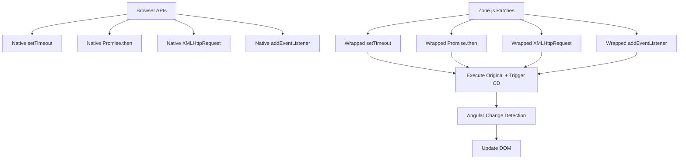

#### **Zone.js Execution Context Flow**

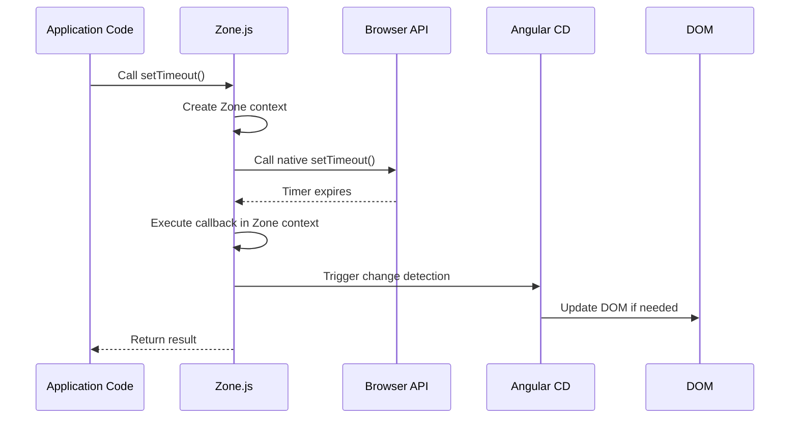

#### **Zone.js vs Zoneless Comparison Architecture**

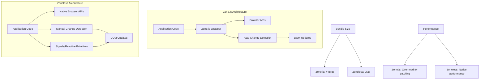

### Understanding Zone.js

Zone.js is a library that patches asynchronous operations to automatically trigger Angular's change detection. It's been Angular's default change detection mechanism since Angular 2.

#### **🔍 Zone.js Internal Mechanics**

##### **API Patching Process**

Zone.js replaces native browser APIs with Zone-aware versions that automatically trigger change detection:

```typescript
// How Zone.js patches APIs internally (simplified)
class ZoneJSPatching {
  // 1. Patch setTimeout
  static patchSetTimeout() {
    const originalSetTimeout = window.setTimeout;

    window.setTimeout = function (
      callback: Function,
      delay: number,
      ...args: any[]
    ) {
      const wrappedCallback = Zone.current.wrap(callback, "setTimeout");
      return originalSetTimeout.call(
        this,
        () => {
          wrappedCallback.apply(this, args);
          // Zone.js automatically triggers Angular change detection here
          NgZone.checkStable();
        },
        delay
      );
    };
  }

  // 2. Patch Promise
  static patchPromise() {
    const originalThen = Promise.prototype.then;

    Promise.prototype.then = function (
      onFulfilled?: Function,
      onRejected?: Function
    ) {
      const wrappedFulfilled = onFulfilled
        ? Zone.current.wrap(onFulfilled, "Promise.then")
        : undefined;
      const wrappedRejected = onRejected
        ? Zone.current.wrap(onRejected, "Promise.then")
        : undefined;

      return originalThen.call(
        this,
        wrappedFulfilled
          ? (...args) => {
              const result = wrappedFulfilled.apply(this, args);
              NgZone.checkStable(); // Trigger change detection
              return result;
            }
          : undefined,
        wrappedRejected
      );
    };
  }

  // 3. Patch XMLHttpRequest
  static patchXHR() {
    const originalSend = XMLHttpRequest.prototype.send;

    XMLHttpRequest.prototype.send = function (...args) {
      this.addEventListener("loadend", () => {
        NgZone.checkStable(); // Trigger change detection on completion
      });
      return originalSend.apply(this, args);
    };
  }
}
```

##### **Zone Context and Task Tracking**

```typescript
// Zone.js tracks all async operations as "tasks"
interface ZoneTask {
  type: "microTask" | "macroTask" | "eventTask";
  source: string;
  callback: Function;
  data?: any;
  scheduleFn?: Function;
  cancelFn?: Function;
}

class ZoneTaskTracking {
  private pendingTasks: Set<ZoneTask> = new Set();

  onScheduleTask(task: ZoneTask) {
    console.log(`📝 Task scheduled: ${task.source}`);
    this.pendingTasks.add(task);
  }

  onInvokeTask(task: ZoneTask) {
    console.log(`⚡ Task executing: ${task.source}`);
  }

  onHasTask(hasTaskState: {
    microTask: boolean;
    macroTask: boolean;
    eventTask: boolean;
  }) {
    if (!hasTaskState.microTask && !hasTaskState.macroTask) {
      console.log("🏁 Zone is stable - triggering change detection");
      // This is when Angular runs change detection
    }
  }

  onInvokeTaskDone(task: ZoneTask) {
    console.log(`✅ Task completed: ${task.source}`);
    this.pendingTasks.delete(task);
  }
}
```

### Zone.js in Angular Components

```typescript
@Component({
  selector: "app-zone-aware",
  template: `
    <div>
      <h3>Zone.js Automatic Detection</h3>
      <p>Counter: {{ counter }}</p>
      <!-- Line 1: Template automatically updates when counter changes -->
      <p>API Data: {{ apiData }}</p>
      <!-- Line 2: API data updates automatically -->
      <button (click)="increment()">Increment</button>
      <!-- Line 3: Click event automatically triggers change detection -->
      <button (click)="fetchData()">Fetch Data</button>
      <!-- Line 4: HTTP request triggers automatic update -->
    </div>
  `,
})
export class ZoneAwareComponent implements OnInit {
  counter = 0; // Line 5: Component property
  apiData = "No data"; // Line 6: Property for API response

  constructor(private http: HttpClient) {} // Line 7: HTTP client injection

  ngOnInit() {
    // Line 8: Timer-based updates work automatically
    setInterval(() => {
      this.counter++; // Line 9: State change in timer callback
      // Line 10: Zone.js automatically triggers change detection
    }, 1000);

    // Line 11: Promise-based async operation
    this.loadInitialData();
  }

  increment() {
    this.counter++; // Line 12: Direct state change
    // Line 13: Event handler automatically triggers change detection
  }

  fetchData() {
    // Line 14: HTTP request with Zone.js automatic detection
    this.http.get<any>("/api/data").subscribe({
      next: (response) => {
        this.apiData = response.message; // Line 15: State update
        // Line 16: Zone.js automatically triggers change detection
      },
      error: (error) => {
        this.apiData = "Error loading data"; // Line 17: Error state update
        // Line 18: Error handling also triggers change detection
      },
    });
  }

  private loadInitialData() {
    // Line 19: Promise-based data loading
    fetch("/api/initial-data")
      .then((response) => response.json())
      .then((data) => {
        this.apiData = data.message; // Line 20: State update in Promise
        // Line 21: Zone.js detects Promise resolution
      })
      .catch((error) => {
        this.apiData = "Failed to load"; // Line 22: Error state
      });
  }
}

// 🚀 Advanced Zone.js Optimization Patterns
@Component({
  selector: "app-zone-optimized",
  template: `
    <div>
      <h3>Zone.js Optimizations</h3>
      <p>High Frequency Counter: {{ highFreqCounter }}</p>
      <p>Normal Counter: {{ normalCounter }}</p>
      <button (click)="startOptimizedTimer()">Start Optimized Timer</button>
      <button (click)="startNormalTimer()">Start Normal Timer</button>
    </div>
  `,
})
export class ZoneOptimizedComponent {
  highFreqCounter = 0;
  normalCounter = 0;

  constructor(private ngZone: NgZone) {}

  startOptimizedTimer() {
    // Run outside Angular zone to avoid change detection overhead
    this.ngZone.runOutsideAngular(() => {
      setInterval(() => {
        this.highFreqCounter++; // This won't trigger change detection

        // Manually trigger change detection every 100 updates
        if (this.highFreqCounter % 100 === 0) {
          this.ngZone.run(() => {
            // This will trigger change detection
            console.log("Manual change detection trigger");
          });
        }
      }, 10); // Very high frequency - 100 times per second
    });
  }

  startNormalTimer() {
    // Normal timer - will trigger change detection each time
    setInterval(() => {
      this.normalCounter++; // This triggers change detection every time
    }, 1000);
  }
}
```

### 🔋 Zoneless Change Detection (Angular 18+)

#### **Zoneless Architecture Benefits**

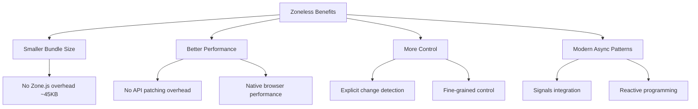

#### **Migration Strategy: Zone.js → Zoneless**

```typescript
// BEFORE: Zone.js automatic detection
@Component({
  template: `
    <div>
      <p>Data: {{ data }}</p>
      <button (click)="loadData()">Load</button>
    </div>
  `,
})
export class ZoneBased {
  data = "";

  constructor(private http: HttpClient) {}

  loadData() {
    // ✅ Works automatically with Zone.js
    this.http.get("/api/data").subscribe((response) => {
      this.data = response.data;
      // Zone.js automatically triggers change detection
    });
  }

  ngOnInit() {
    // ✅ Works automatically with Zone.js
    setTimeout(() => {
      this.data = "Timer data";
      // Zone.js automatically triggers change detection
    }, 1000);
  }
}

// AFTER: Zoneless with manual control
@Component({
  template: `
    <div>
      <p>Data: {{ data }}</p>
      <p>Signal Data: {{ signalData() }}</p>
      <button (click)="loadData()">Load</button>
    </div>
  `,
})
export class Zoneless {
  data = "";
  signalData = signal("");

  constructor(private http: HttpClient, private cdr: ChangeDetectorRef) {}

  loadData() {
    // ❌ Manual change detection required
    this.http.get("/api/data").subscribe((response) => {
      this.data = response.data;
      this.cdr.markForCheck(); // Manual trigger needed
    });

    // ✅ Signals work automatically
    this.http.get("/api/data").subscribe((response) => {
      this.signalData.set(response.data); // Automatically triggers updates
    });
  }

  ngOnInit() {
    // ❌ Manual change detection required
    setTimeout(() => {
      this.data = "Timer data";
      this.cdr.markForCheck(); // Manual trigger needed
    }, 1000);

    // ✅ Signals work automatically
    setTimeout(() => {
      this.signalData.set("Timer data"); // Automatically triggers updates
    }, 1000);
  }
}
```

````

**Line-by-line explanation:**

- **Line 1**: Template binding updates automatically due to Zone.js
- **Line 2**: API data binding also updates automatically
- **Line 3**: Click events trigger change detection automatically
- **Line 4**: HTTP requests trigger automatic UI updates
- **Line 5-6**: Component properties that Zone.js monitors
- **Line 7**: HTTP client for making requests
- **Line 8**: Timer setup in component initialization
- **Line 9**: State change inside timer callback
- **Line 10**: Zone.js detects timer completion and triggers change detection
- **Line 11**: Promise-based operation setup
- **Line 12**: Direct state change in event handler
- **Line 13**: Event handlers automatically trigger change detection
- **Line 14**: HTTP request that Zone.js monitors
- **Line 15**: State update in HTTP response handler
- **Line 16**: Zone.js triggers change detection after HTTP response
- **Line 17**: Error state update
- **Line 18**: Error handling also triggers change detection
- **Line 19**: Promise-based data loading example
- **Line 20**: State update in Promise then() callback
- **Line 21**: Zone.js detects Promise resolution
- **Line 22**: Error handling in Promise catch()

### Zoneless Change Detection (Angular 18+)

```typescript
// Experimental zoneless configuration
import { bootstrapApplication } from "@angular/platform-browser";
import { provideExperimentalZonelessChangeDetection } from "@angular/core"; // Line 1: Import zoneless provider

import { AppComponent } from "./app/app.component";

// Line 2: Bootstrap application with zoneless change detection
bootstrapApplication(AppComponent, {
  providers: [
    provideExperimentalZonelessChangeDetection(), // Line 3: Enable zoneless mode
    // Line 4: Other providers...
  ],
});

// Zoneless component example
@Component({
  selector: "app-zoneless-example",
  template: `
    <div>
      <h3>Zoneless Component</h3>
      <p>Counter: {{ counter }}</p>
      <!-- Line 5: Template binding (manual detection needed) -->
      <p>Signal Counter: {{ signalCounter() }}</p>
      <!-- Line 6: Signal binding (automatic detection) -->
      <button (click)="increment()">Increment Counter</button>
      <!-- Line 7: Manual increment button -->
      <button (click)="incrementSignal()">Increment Signal</button>
      <!-- Line 8: Signal increment button -->
    </div>
  `,
})
export class ZonelessExampleComponent implements OnInit {
  counter = 0; // Line 9: Regular property
  signalCounter = signal(0); // Line 10: Signal for reactive updates

  constructor(
    private cdr: ChangeDetectorRef, // Line 11: Manual change detection
    private applicationRef: ApplicationRef // Line 12: Application reference
  ) {}

  ngOnInit() {
    // Line 13: Timer without automatic change detection
    setInterval(() => {
      this.counter++; // Line 14: State change
      // Line 15: No automatic change detection in zoneless mode
      this.cdr.markForCheck(); // Line 16: Manual detection trigger
    }, 1000);

    // Line 17: Signal-based timer (automatic detection)
    setInterval(() => {
      this.signalCounter.update((value) => value + 1); // Line 18: Signal update
      // Line 19: Signals automatically trigger change detection
    }, 1500);
  }

  increment() {
    this.counter++; // Line 20: State change
    // Line 21: Event handlers still trigger change detection
    // Line 22: But other async operations don't
  }

  incrementSignal() {
    this.signalCounter.update((value) => value + 1); // Line 23: Signal update
    // Line 24: Signals always trigger change detection
  }

  // Line 25: HTTP request in zoneless mode
  async fetchData() {
    try {
      const response = await fetch("/api/data"); // Line 26: Fetch data
      const data = await response.json(); // Line 27: Parse response
      this.counter = data.count; // Line 28: Update state
      // Line 29: Manual change detection needed
      this.cdr.markForCheck(); // Line 30: Trigger detection
    } catch (error) {
      console.error("Fetch error:", error); // Line 31: Error handling
      // Line 32: No automatic UI update on error
    }
  }

  // Line 33: Using effect for reactive programming
  private counterEffect = effect(() => {
    console.log("Signal counter changed:", this.signalCounter()); // Line 34: React to signal
    // Line 35: Effects run automatically when signals change
  });
}
````

**Line-by-line explanation:**

- **Line 1**: Import for experimental zoneless change detection
- **Line 2**: Application bootstrap with zoneless configuration
- **Line 3**: Provider that enables zoneless mode
- **Line 4**: Placeholder for other application providers
- **Line 5**: Template binding that requires manual change detection
- **Line 6**: Signal binding that works automatically
- **Line 7**: Button for manual counter increment
- **Line 8**: Button for signal increment
- **Line 9**: Regular property that needs manual detection
- **Line 10**: Signal that provides automatic reactivity
- **Line 11**: ChangeDetectorRef for manual control
- **Line 12**: ApplicationRef for global change detection
- **Line 13**: Timer setup without automatic detection
- **Line 14**: State change in timer
- **Line 15**: No automatic change detection in zoneless mode
- **Line 16**: Manual trigger required for UI update
- **Line 17**: Signal-based timer setup
- **Line 18**: Signal update method
- **Line 19**: Signals automatically trigger change detection
- **Line 20**: State change in event handler
- **Line 21-22**: Event handlers still work but other async ops don't
- **Line 23**: Signal update in event handler
- **Line 24**: Signals always trigger detection regardless of context
- **Line 25**: HTTP request handling in zoneless mode
- **Line 26**: Async fetch operation
- **Line 27**: Response parsing
- **Line 28**: State update from async operation
- **Line 29**: Manual change detection needed for async updates
- **Line 30**: Trigger change detection manually
- **Line 31**: Error handling
- **Line 32**: No automatic UI update on async errors
- **Line 33**: Effect declaration for reactive programming
- **Line 34**: Effect callback that reacts to signal changes
- **Line 35**: Effects run automatically when dependencies change

### Comparing Zone.js vs Zoneless

```typescript
// Feature comparison table implementation
@Component({
  selector: "app-comparison-demo",
  template: `
    <div class="comparison-container">
      <div class="zone-section">
        <h3>Zone.js Mode</h3>
        <zone-js-demo></zone-js-demo>
      </div>

      <div class="zoneless-section">
        <h3>Zoneless Mode</h3>
        <zoneless-demo></zoneless-demo>
      </div>

      <div class="performance-metrics">
        <h3>Performance Comparison</h3>
        <performance-monitor></performance-monitor>
      </div>
    </div>
  `,
  styles: [
    `
      .comparison-container {
        display: grid;
        grid-template-columns: 1fr 1fr;
        gap: 20px;
        margin: 20px;
      }
      .performance-metrics {
        grid-column: 1 / -1;
        margin-top: 20px;
      }
    `,
  ],
})
export class ComparisonDemoComponent {}

// Zone.js demonstration component
@Component({
  selector: "zone-js-demo",
  template: `
    <div class="demo-section">
      <h4>Zone.js Features</h4>
      <p>Bundle Size Impact: ~45KB</p>
      <!-- Line 1: Zone.js adds significant bundle size -->
      <p>Automatic Detection: ✅</p>
      <!-- Line 2: Automatic change detection for all async operations -->
      <p>Manual Triggers: Not needed</p>
      <!-- Line 3: No manual change detection required -->
      <div class="demo-content">
        <button (click)="triggerTimer()">Start Timer</button>
        <button (click)="triggerHttp()">HTTP Request</button>
        <button (click)="triggerPromise()">Promise Chain</button>
        <!-- Line 4: All these automatically trigger change detection -->
        <p>Status: {{ status }}</p>
        <!-- Line 5: Status updates automatically -->
      </div>
    </div>
  `,
})
export class ZoneJsDemoComponent {
  status = "Ready"; // Line 6: Status property

  constructor(private http: HttpClient) {}

  triggerTimer() {
    this.status = "Timer started..."; // Line 7: Immediate status update
    setTimeout(() => {
      this.status = "Timer completed!"; // Line 8: Automatic UI update
      // Line 9: Zone.js handles change detection automatically
    }, 2000);
  }

  triggerHttp() {
    this.status = "HTTP request started..."; // Line 10: Status update
    this.http.get<any>("/api/test").subscribe({
      next: (response) => {
        this.status = `HTTP completed: ${response.message}`; // Line 11: Auto update
      },
      error: (error) => {
        this.status = "HTTP failed"; // Line 12: Error status
      },
    });
  }

  triggerPromise() {
    this.status = "Promise started..."; // Line 13: Initial status
    Promise.resolve("Promise data")
      .then((result) => {
        this.status = `Promise resolved: ${result}`; // Line 14: Auto update
        return this.processResult(result);
      })
      .then((processed) => {
        this.status = `Processing done: ${processed}`; // Line 15: Chain update
      })
      .catch((error) => {
        this.status = "Promise failed"; // Line 16: Error handling
      });
  }

  private processResult(data: string): Promise<string> {
    // Line 17: Simulate async processing
    return new Promise((resolve) => {
      setTimeout(() => {
        resolve(`Processed: ${data}`); // Line 18: Nested async operation
      }, 1000);
    });
  }
}

// Zoneless demonstration component
@Component({
  selector: "zoneless-demo",
  template: `
    <div class="demo-section">
      <h4>Zoneless Features</h4>
      <p>Bundle Size Impact: ~0KB</p>
      <!-- Line 19: No additional bundle size -->
      <p>Automatic Detection: Signals only</p>
      <!-- Line 20: Only signals trigger automatic detection -->
      <p>Manual Triggers: Required for regular properties</p>
      <!-- Line 21: Manual triggers needed for non-signal properties -->
      <div class="demo-content">
        <button (click)="triggerTimer()">Start Timer</button>
        <button (click)="triggerSignalTimer()">Signal Timer</button>
        <!-- Line 22: Different behavior for regular vs signal properties -->
        <p>Status: {{ status }}</p>
        <!-- Line 23: Manual detection needed -->
        <p>Signal Status: {{ signalStatus() }}</p>
        <!-- Line 24: Automatic detection with signals -->
      </div>
    </div>
  `,
})
export class ZonelessDemoComponent {
  status = "Ready"; // Line 25: Regular property
  signalStatus = signal("Ready"); // Line 26: Signal property

  constructor(private cdr: ChangeDetectorRef) {}

  triggerTimer() {
    this.status = "Timer started..."; // Line 27: Status update
    this.cdr.markForCheck(); // Line 28: Manual detection for immediate update

    setTimeout(() => {
      this.status = "Timer completed!"; // Line 29: Async status update
      this.cdr.markForCheck(); // Line 30: Manual detection required
    }, 2000);
  }

  triggerSignalTimer() {
    this.signalStatus.set("Signal timer started..."); // Line 31: Signal update
    // Line 32: No manual detection needed - signals auto-trigger

    setTimeout(() => {
      this.signalStatus.set("Signal timer completed!"); // Line 33: Async signal update
      // Line 34: Still no manual detection needed
    }, 2000);
  }

  // Line 35: HTTP request handling in zoneless mode
  async triggerHttp() {
    this.status = "HTTP request started..."; // Line 36: Initial status
    this.cdr.markForCheck(); // Line 37: Manual trigger

    try {
      const response = await fetch("/api/test"); // Line 38: Fetch request
      const data = await response.json(); // Line 39: Parse response
      this.status = `HTTP completed: ${data.message}`; // Line 40: Update status
      this.cdr.markForCheck(); // Line 41: Manual trigger for async result
    } catch (error) {
      this.status = "HTTP failed"; // Line 42: Error status
      this.cdr.markForCheck(); // Line 43: Manual trigger for error
    }
  }
}
```

**Line-by-line explanation:**

- **Line 1**: Zone.js adds about 45KB to bundle size
- **Line 2**: Zone.js provides automatic change detection for all async operations
- **Line 3**: No manual triggers needed with Zone.js
- **Line 4**: All button actions automatically trigger change detection
- **Line 5**: Status property updates automatically in Zone.js mode
- **Line 6**: Regular component property in Zone.js environment
- **Line 7**: Status update that automatically reflects in UI
- **Line 8**: Timer callback update that automatically triggers detection
- **Line 9**: Zone.js handles all the change detection automatically
- **Line 10**: HTTP request status update
- **Line 11**: HTTP response automatically updates UI
- **Line 12**: HTTP error automatically updates UI
- **Line 13**: Promise chain status update
- **Line 14**: Promise resolution automatically updates UI
- **Line 15**: Promise chain continuation with automatic updates
- **Line 16**: Promise error handling with automatic UI update
- **Line 17**: Async processing simulation
- **Line 18**: Nested async operation that Zone.js handles
- **Line 19**: Zoneless mode has no bundle size overhead
- **Line 20**: Only signals provide automatic change detection
- **Line 21**: Regular properties require manual change detection
- **Line 22**: Different buttons demonstrate different behaviors
- **Line 23**: Regular property binding needs manual detection
- **Line 24**: Signal binding provides automatic detection
- **Line 25**: Regular property in zoneless mode
- **Line 26**: Signal property for automatic reactivity
- **Line 27**: Status update that won't automatically reflect
- **Line 28**: Manual change detection required for immediate update
- **Line 29**: Async status update in timer callback
- **Line 30**: Manual detection needed for async updates
- **Line 31**: Signal update that automatically triggers detection
- **Line 32**: No manual detection needed with signals
- **Line 33**: Async signal update that still triggers automatically
- **Line 34**: Signals work automatically even in async contexts
- **Line 35**: HTTP handling in zoneless mode
- **Line 36**: Initial status update
- **Line 37**: Manual trigger for immediate UI update
- **Line 38**: Fetch request without automatic detection
- **Line 39**: Response parsing
- **Line 40**: Status update from async operation
- **Line 41**: Manual trigger required for async result
- **Line 42**: Error status update
- **Line 43**: Manual trigger needed for error state update

---

## Lifecycle Hooks and Change Detection

### 🧠 Change Detection Lifecycle - Deep Theory

#### **Theoretical Foundation**

Understanding how Angular's lifecycle hooks interact with change detection is essential for building efficient applications. Each lifecycle hook runs at specific points in the change detection cycle, and knowing when they execute helps optimize performance and avoid common pitfalls.

#### **Complete Change Detection Cycle Flow**

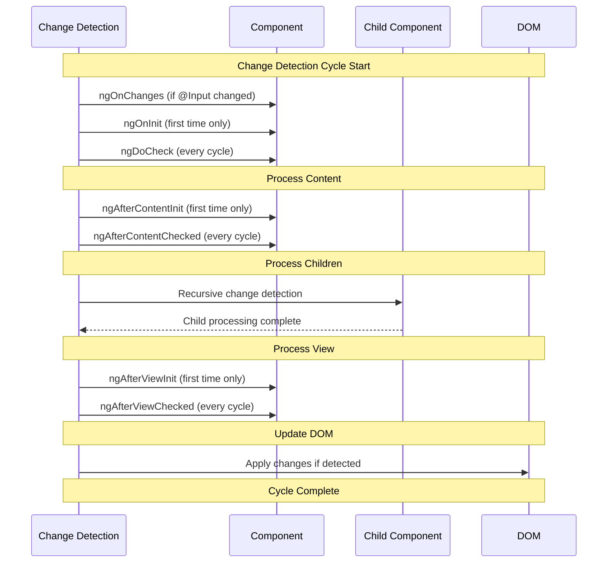

#### **Lifecycle Hook Frequency and Performance Impact**

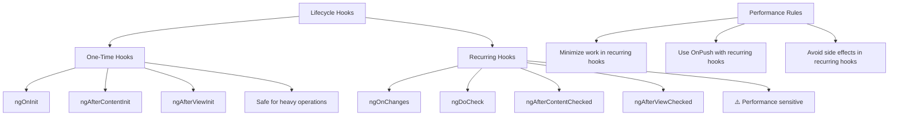

#### **Hook Execution Timing Visualization**

```mermaid
gantt
    title Change Detection Lifecycle Timeline
    dateFormat X
    axisFormat %s

    section Initialization
    Constructor           :0, 1
    ngOnChanges          :1, 2
    ngOnInit             :2, 3

    section Every Cycle
    ngDoCheck            :3, 4
    Content Processing   :4, 5
    ngAfterContentChecked:5, 6
    Child Processing     :6, 8
    ngAfterViewChecked   :8, 9
    DOM Update          :9, 10
```

### Understanding Hook Execution Order

```typescript
@Component({
  selector: "app-lifecycle-demo",
  template: `
    <div>
      <h3>Lifecycle Hooks Demo</h3>
      <p>Check the console for hook execution order</p>
      <p>Value: {{ value }}</p>
      <!-- Line 1: Template binding tracked by change detection -->
      <button (click)="changeValue()">Change Value</button>
      <!-- Line 2: Button to trigger state change -->
      <child-component [inputData]="value"></child-component>
      <!-- Line 3: Child component with input binding -->
    </div>
  `,
})
export class LifecycleDemoComponent
  implements
    OnInit,
    OnChanges,
    DoCheck,
    AfterContentInit,
    AfterContentChecked,
    AfterViewInit,
    AfterViewChecked,
    OnDestroy
{
  @Input() parentData: string = ""; // Line 4: Input from parent
  value = "Initial Value"; // Line 5: Component state
  private checkCount = 0; // Line 6: Counter for DoCheck calls
  private performanceMetrics = new Map<string, number>(); // Line 7: Performance tracking

  constructor() {
    console.log("1. Constructor called"); // Line 8: Constructor execution
    this.recordPerformance("constructor");
  }

  ngOnChanges(changes: SimpleChanges) {
    // Line 9: Called when @Input properties change
    this.recordPerformance("ngOnChanges");
    console.log("2. ngOnChanges called", changes);
    console.log("  - Called before ngOnInit"); // Line 10: Execution order note
    console.log("  - Called every time input changes"); // Line 11: Frequency note

    // Line 12: Check which input properties changed
    if (changes["parentData"]) {
      const change = changes["parentData"];
      console.log(
        `  - parentData changed from ${change.previousValue} to ${change.currentValue}`
      );

      // ✅ BEST PRACTICE: Handle input validation here
      this.validateInputs(change.currentValue);
    }
  }

  ngOnInit() {
    // Line 13: Called once after first ngOnChanges
    this.recordPerformance("ngOnInit");
    console.log("3. ngOnInit called");
    console.log("  - Called after constructor and first ngOnChanges"); // Line 14: Timing
    console.log("  - Good place for initialization logic"); // Line 15: Best practice

    // Line 16: Example initialization
    this.initializeComponent();
  }

  ngDoCheck() {
    // Line 17: Called every change detection cycle
    const startTime = performance.now();
    this.checkCount++;

    console.log(`4. ngDoCheck called (count: ${this.checkCount})`);
    console.log("  - Called on every change detection cycle"); // Line 18: Frequency
    console.log("  - Use for custom change detection logic"); // Line 19: Purpose

    // ⚠️ WARNING: This runs VERY frequently - keep it light!
    this.performCustomChangeDetection();

    const endTime = performance.now();
    this.recordPerformance("ngDoCheck", endTime - startTime);

    // 📊 Performance monitoring
    if (this.checkCount % 100 === 0) {
      this.reportPerformanceMetrics();
    }
  }

  ngAfterContentInit() {
    // Line 20: Called once after content projection is initialized
    this.recordPerformance("ngAfterContentInit");
    console.log("5. ngAfterContentInit called");
    console.log("  - Called after ngDoCheck"); // Line 21: Execution order
    console.log("  - Content projection is ready"); // Line 22: State information
  }

  ngAfterContentChecked() {
    // Line 23: Called after every content check
    const startTime = performance.now();
    console.log("6. ngAfterContentChecked called");
    console.log("  - Called after every ngDoCheck"); // Line 24: Frequency
    console.log("  - Projected content has been checked"); // Line 25: State info

    // ⚠️ WARNING: This also runs frequently
    this.validateContentState();

    const endTime = performance.now();
    this.recordPerformance("ngAfterContentChecked", endTime - startTime);
  }

  ngAfterViewInit() {
    // Line 26: Called once after view initialization
    this.recordPerformance("ngAfterViewInit");
    console.log("7. ngAfterViewInit called");
    console.log("  - Called after ngAfterContentChecked"); // Line 27: Order
    console.log("  - View and child views are initialized"); // Line 28: State

    // ✅ SAFE: This is perfect for ViewChild access
    this.initializeViewReferences();
  }

  ngAfterViewChecked() {
    // Line 29: Called after every view check
    const startTime = performance.now();
    console.log("8. ngAfterViewChecked called");
    console.log("  - Called after every view update"); // Line 30: Frequency
    console.log("  - View and child views have been checked"); // Line 31: State

    // ⚠️ CAUTION: Frequent execution - avoid heavy operations
    this.validateViewState();

    const endTime = performance.now();
    this.recordPerformance("ngAfterViewChecked", endTime - startTime);
  }

  ngOnDestroy() {
    // Line 32: Called when component is destroyed
    console.log("9. ngOnDestroy called");
    console.log("  - Component is being destroyed"); // Line 33: State
    console.log("  - Cleanup subscriptions and timers here"); // Line 34: Best practice

    // 📊 Final performance report
    this.reportFinalMetrics();

    // Line 35: Cleanup example
    this.cleanup();
  }

  changeValue() {
    this.value = "Changed Value - " + Date.now(); // Line 36: State change
    console.log("State changed, change detection will run"); // Line 37: Info
  }

  // 🔧 Performance and validation methods
  private recordPerformance(hookName: string, duration?: number) {
    if (duration !== undefined) {
      const existing = this.performanceMetrics.get(hookName) || 0;
      this.performanceMetrics.set(hookName, existing + duration);
    } else {
      this.performanceMetrics.set(
        hookName + "_calls",
        (this.performanceMetrics.get(hookName + "_calls") || 0) + 1
      );
    }
  }

  private reportPerformanceMetrics() {
    console.group("📊 Performance Metrics (every 100 cycles)");
    this.performanceMetrics.forEach((value, key) => {
      if (key.includes("_calls")) {
        console.log(`${key.replace("_calls", "")}: ${value} calls`);
      } else {
        console.log(`${key}: ${value.toFixed(2)}ms total`);
      }
    });
    console.groupEnd();
  }

  private reportFinalMetrics() {
    console.group("📊 Final Performance Report");
    console.log("Total ngDoCheck calls:", this.checkCount);
    this.performanceMetrics.forEach((value, key) => {
      console.log(
        `${key}: ${typeof value === "number" ? value.toFixed(2) : value}`
      );
    });
    console.groupEnd();
  }

  private validateInputs(newValue: any) {
    // Input validation logic
    if (typeof newValue === "string" && newValue.length > 100) {
      console.warn("⚠️ Input value is very long, consider optimizing");
    }
  }

  private validateContentState() {
    // Lightweight content validation
    // Keep this minimal as it runs every cycle
  }

  private validateViewState() {
    // Lightweight view validation
    // Keep this minimal as it runs every cycle
  }

  private initializeComponent() {
    // Line 38: Initialization logic
    console.log("  - Component initialization complete");
  }

  private performCustomChangeDetection() {
    // Line 39: Custom change detection logic
    // Line 40: Use DoCheck for complex object monitoring
    if (this.checkCount % 10 === 0) {
      console.log("  - Custom check every 10 cycles");
    }
  }

  private initializeViewReferences() {
    // Line 41: View initialization logic
    console.log("  - View references can be safely accessed now");
  }

  private cleanup() {
    // Line 42: Cleanup logic
    console.log("  - Performing cleanup");
    this.performanceMetrics.clear();
  }
}

// 🎯 Advanced Lifecycle Hook Patterns
@Component({
  selector: "app-advanced-lifecycle",
  template: `
    <div class="advanced-component">
      <h3>Advanced Lifecycle Patterns</h3>
      <p>Optimized for performance with OnPush</p>
      <ng-content></ng-content>
    </div>
  `,
  changeDetection: ChangeDetectionStrategy.OnPush,
})
export class AdvancedLifecycleComponent implements OnInit, DoCheck, OnDestroy {
  private previousState: any = null;
  private stateComparator = new StateComparator();
  private destroy$ = new Subject<void>();
  private performanceOptimizer = new PerformanceOptimizer();

  @Input() complexData: any;

  constructor(private cdr: ChangeDetectorRef) {}

  ngOnInit() {
    // ✅ One-time heavy initialization is safe here
    this.initializeHeavyResources()
      .pipe(takeUntil(this.destroy$))
      .subscribe((result) => {
        // Handle initialization result
        this.cdr.markForCheck();
      });
  }

  ngDoCheck() {
    // 🚀 Optimized change detection with intelligent comparison
    if (this.performanceOptimizer.shouldSkipCheck()) {
      return; // Skip expensive checks when not needed
    }

    const hasChanges = this.stateComparator.hasChanges(
      this.previousState,
      this.complexData
    );

    if (hasChanges) {
      this.previousState = this.stateComparator.deepClone(this.complexData);
      this.handleStateChange();
      this.cdr.markForCheck();
    }
  }

  ngOnDestroy() {
    this.destroy$.next();
    this.destroy$.complete();
    this.performanceOptimizer.cleanup();
  }

  private initializeHeavyResources(): Observable<any> {
    // Heavy initialization logic
    return of(null).pipe(delay(100));
  }

  private handleStateChange() {
    // React to state changes
    console.log("Optimized state change detected");
  }
}

// 🛠️ Utility classes for advanced patterns
class StateComparator {
  hasChanges(previous: any, current: any): boolean {
    // Intelligent comparison logic
    return JSON.stringify(previous) !== JSON.stringify(current);
  }

  deepClone(obj: any): any {
    return JSON.parse(JSON.stringify(obj));
  }
}

class PerformanceOptimizer {
  private lastCheckTime = 0;
  private skipThreshold = 16; // Skip if less than one frame (60fps)

  shouldSkipCheck(): boolean {
    const now = performance.now();
    const timeSinceLastCheck = now - this.lastCheckTime;

    if (timeSinceLastCheck < this.skipThreshold) {
      return true; // Skip this check for performance
    }

    this.lastCheckTime = now;
    return false;
  }

  cleanup() {
    // Cleanup performance monitoring
  }
}
```

**Line-by-line explanation:**

- **Line 1**: Template binding that triggers change detection monitoring
- **Line 2**: Button that triggers state change and lifecycle hooks
- **Line 3**: Child component that will trigger parent lifecycle hooks
- **Line 4**: Input property that triggers ngOnChanges when modified
- **Line 5**: Component state that change detection monitors
- **Line 6**: Counter to track DoCheck execution frequency
- **Line 7**: Constructor executes first, before any lifecycle hooks
- **Line 8**: ngOnChanges runs when input properties change
- **Line 9**: Documents execution order relative to other hooks
- **Line 10**: Notes that this runs every time inputs change
- **Line 11**: Logic to check which specific properties changed
- **Line 12**: ngOnInit runs once after first ngOnChanges
- **Line 13**: Documents timing relative to constructor and ngOnChanges
- **Line 14**: Best practice note for initialization logic
- **Line 15**: Example of proper initialization
- **Line 16**: ngDoCheck runs on every change detection cycle
- **Line 17**: Documents frequency of execution
- **Line 18**: Notes the purpose for custom change detection
- **Line 19**: Example of custom change detection logic
- **Line 20**: ngAfterContentInit runs once after content projection
- **Line 21**: Documents execution order
- **Line 22**: Notes the state of content projection
- **Line 23**: ngAfterContentChecked runs after every content check
- **Line 24**: Documents frequency and relationship to ngDoCheck
- **Line 25**: Notes the state of projected content
- **Line 26**: ngAfterViewInit runs once after view initialization
- **Line 27**: Documents execution order
- **Line 28**: Notes the state of views
- **Line 29**: Safe point for accessing view children
- **Line 30**: ngAfterViewChecked runs after every view check
- **Line 31**: Documents frequency of execution
- **Line 32**: Notes view checking completion
- **Line 33**: ngOnDestroy runs when component is destroyed
- **Line 34**: Documents component state during destruction
- **Line 35**: Best practice for cleanup
- **Line 36**: Example cleanup implementation
- **Line 37**: State change that triggers change detection
- **Line 38**: Logging for demonstration
- **Line 39-43**: Helper methods for different lifecycle phases

### DoCheck for Custom Change Detection

```typescript
@Component({
  selector: "app-custom-change-detection",
  changeDetection: ChangeDetectionStrategy.OnPush, // Line 1: OnPush strategy
  template: `
    <div>
      <h3>Custom Change Detection with DoCheck</h3>
      <p>Deep object changes: {{ deepObject.level1.level2.value }}</p>
      <!-- Line 2: Deep nested property binding -->
      <p>Array length: {{ complexArray.length }}</p>
      <!-- Line 3: Array length binding -->
      <button (click)="modifyDeepObject()">Modify Deep Object</button>
      <!-- Line 4: Button to modify nested object -->
      <button (click)="modifyArray()">Modify Array</button>
      <!-- Line 5: Button to modify array contents -->
      <p>Last change detected: {{ lastChangeTime }}</p>
      <!-- Line 6: Display when last change was detected -->
    </div>
  `,
})
export class CustomChangeDetectionComponent implements DoCheck, OnInit {
  // Line 7: Complex nested object
  deepObject = {
    level1: {
      level2: {
        value: "initial",
        timestamp: Date.now(),
      },
    },
  };

  // Line 8: Complex array with objects
  complexArray = [
    { id: 1, name: "Item 1", data: { count: 0 } },
    { id: 2, name: "Item 2", data: { count: 0 } },
  ];

  lastChangeTime = ""; // Line 9: Track last change detection

  // Line 10: Store previous values for comparison
  private previousDeepValue = "";
  private previousArrayLength = 0;
  private previousArrayHash = "";

  constructor(private cdr: ChangeDetectorRef) {} // Line 11: CDR injection

  ngOnInit() {
    // Line 12: Initialize previous values
    this.previousDeepValue = this.deepObject.level1.level2.value;
    this.previousArrayLength = this.complexArray.length;
    this.previousArrayHash = this.calculateArrayHash();
  }

  ngDoCheck() {
    // Line 13: Custom change detection logic
    let hasChanges = false;

    // Line 14: Check deep object changes
    const currentDeepValue = this.deepObject.level1.level2.value;
    if (currentDeepValue !== this.previousDeepValue) {
      console.log("Deep object change detected:", {
        previous: this.previousDeepValue,
        current: currentDeepValue,
      });
      this.previousDeepValue = currentDeepValue; // Line 15: Update stored value
      hasChanges = true; // Line 16: Mark that changes occurred
    }

    // Line 17: Check array length changes
    const currentArrayLength = this.complexArray.length;
    if (currentArrayLength !== this.previousArrayLength) {
      console.log("Array length change detected:", {
        previous: this.previousArrayLength,
        current: currentArrayLength,
      });
      this.previousArrayLength = currentArrayLength; // Line 18: Update length
      hasChanges = true;
    }

    // Line 19: Check array content changes (deep comparison)
    const currentArrayHash = this.calculateArrayHash();
    if (currentArrayHash !== this.previousArrayHash) {
      console.log("Array content change detected");
      this.previousArrayHash = currentArrayHash; // Line 20: Update hash
      hasChanges = true;
    }

    // Line 21: Update change timestamp and trigger detection if needed
    if (hasChanges) {
      this.lastChangeTime = new Date().toLocaleTimeString(); // Line 22: Update timestamp
      this.cdr.markForCheck(); // Line 23: Trigger change detection
    }
  }

  modifyDeepObject() {
    // Line 24: Modify nested object property
    this.deepObject.level1.level2.value = "modified-" + Date.now();
    this.deepObject.level1.level2.timestamp = Date.now();
    // Line 25: DoCheck will detect this change on next cycle
  }

  modifyArray() {
    // Line 26: Modify array content without changing reference
    this.complexArray[0].data.count++;
    // Line 27: Also add new item to test length detection
    this.complexArray.push({
      id: this.complexArray.length + 1,
      name: `Item ${this.complexArray.length + 1}`,
      data: { count: 0 },
    });
    // Line 28: DoCheck will detect both content and length changes
  }

  private calculateArrayHash(): string {
    // Line 29: Create hash of array content for deep comparison
    return this.complexArray
      .map((item) => `${item.id}-${item.name}-${item.data.count}`)
      .join("|"); // Line 30: Simple hash based on all properties
  }
}
```

**Line-by-line explanation:**

- **Line 1**: OnPush strategy requires manual change detection
- **Line 2**: Deep nested property that Angular can't track automatically
- **Line 3**: Array length binding for demonstration
- **Line 4**: Button to modify deeply nested object
- **Line 5**: Button to modify array contents
- **Line 6**: Display when custom change detection last ran
- **Line 7**: Complex nested object that requires custom tracking
- **Line 8**: Array with nested objects for complex change detection
- **Line 9**: Property to track when changes were detected
- **Line 10**: Private properties to store previous values for comparison
- **Line 11**: ChangeDetectorRef injection for manual control
- **Line 12**: Initialize comparison values in OnInit
- **Line 13**: DoCheck implementation for custom change detection
- **Line 14**: Check if deeply nested value changed
- **Line 15**: Update stored value for next comparison
- **Line 16**: Flag that changes were detected
- **Line 17**: Check for array length changes
- **Line 18**: Update stored array length
- **Line 19**: Check for array content changes using hash comparison
- **Line 20**: Update stored hash for next comparison
- **Line 21**: Update UI if any changes were detected
- **Line 22**: Set timestamp of last change detection
- **Line 23**: Trigger change detection cycle
- **Line 24**: Modify nested object property
- **Line 25**: Comment that DoCheck will detect this
- **Line 26**: Modify array content without reference change
- **Line 27**: Add new array item to test length detection
- **Line 28**: Comment that DoCheck detects both changes
- **Line 29**: Helper method to create array content hash
- **Line 30**: Simple hash implementation for change detection

### AfterViewInit and ViewChild

```typescript
@Component({
  selector: "app-viewchild-demo",
  template: `
    <div>
      <h3>ViewChild and AfterViewInit Demo</h3>
      <input #userInput type="text" placeholder="Enter text" />
      <!-- Line 1: Template reference variable -->
      <button (click)="focusInput()">Focus Input</button>
      <!-- Line 2: Button to interact with ViewChild -->

      <child-display-component #childComponent [data]="inputData">
      </child-display-component>
      <!-- Line 3: Child component reference -->

      <p>Input value: {{ currentInputValue }}</p>
      <!-- Line 4: Display current input value -->
      <p>Child component data: {{ childData }}</p>
      <!-- Line 5: Display child component data -->
    </div>
  `,
})
export class ViewChildDemoComponent implements AfterViewInit, OnDestroy {
  @ViewChild("userInput") inputElement!: ElementRef<HTMLInputElement>; // Line 6: ViewChild for input
  @ViewChild("childComponent") childComponent!: ChildDisplayComponent; // Line 7: ViewChild for component

  inputData = "Initial data"; // Line 8: Data to pass to child
  currentInputValue = ""; // Line 9: Current input value
  childData = ""; // Line 10: Data from child component

  private inputSubscription?: Subscription; // Line 11: Subscription for cleanup

  constructor(private cdr: ChangeDetectorRef) {} // Line 12: CDR injection

  ngAfterViewInit() {
    console.log("AfterViewInit: View children are now available"); // Line 13: Logging

    // Line 14: ViewChild elements are now accessible
    if (this.inputElement) {
      console.log("Input element:", this.inputElement.nativeElement); // Line 15: Log element

      // Line 16: Set up input event listener
      this.inputSubscription = fromEvent(
        this.inputElement.nativeElement,
        "input"
      )
        .pipe(
          debounceTime(300), // Line 17: Debounce input events
          map((event) => (event.target as HTMLInputElement).value) // Line 18: Extract value
        )
        .subscribe((value) => {
          this.currentInputValue = value; // Line 19: Update component state
          this.inputData = `Input: ${value}`; // Line 20: Update child input
          this.cdr.markForCheck(); // Line 21: Trigger change detection
        });
    }

    // Line 22: Access child component methods and properties
    if (this.childComponent) {
      console.log("Child component:", this.childComponent); // Line 23: Log child
      this.childData = this.childComponent.getData(); // Line 24: Get child data

      // Line 25: Subscribe to child component events
      this.childComponent.dataChanged.subscribe((newData) => {
        this.childData = newData; // Line 26: Update from child
        this.cdr.markForCheck(); // Line 27: Trigger detection
      });
    }

    // Line 28: Important: AfterViewInit may need manual change detection
    this.cdr.detectChanges(); // Line 29: Force detection after view setup
  }

  ngOnDestroy() {
    // Line 30: Cleanup subscriptions
    if (this.inputSubscription) {
      this.inputSubscription.unsubscribe(); // Line 31: Prevent memory leaks
    }
  }

  focusInput() {
    // Line 32: Method to focus input using ViewChild
    if (this.inputElement) {
      this.inputElement.nativeElement.focus(); // Line 33: Focus input element
      this.inputElement.nativeElement.select(); // Line 34: Select all text
    }
  }
}

// Child component for ViewChild demonstration
@Component({
  selector: "child-display-component",
  template: `
    <div class="child-component">
      <h4>Child Component</h4>
      <p>Received data: {{ data }}</p>
      <!-- Line 35: Display input from parent -->
      <button (click)="updateData()">Update Data</button>
      <!-- Line 36: Button to trigger data change -->
      <p>Internal data: {{ internalData }}</p>
      <!-- Line 37: Display internal component data -->
    </div>
  `,
})
export class ChildDisplayComponent implements OnInit {
  @Input() data: string = ""; // Line 38: Input from parent
  @Output() dataChanged = new EventEmitter<string>(); // Line 39: Output to parent

  internalData = "Child initial data"; // Line 40: Internal component state
  private dataCounter = 0; // Line 41: Counter for data updates

  ngOnInit() {
    console.log("Child component initialized with data:", this.data); // Line 42: Log init
  }

  updateData() {
    this.dataCounter++; // Line 43: Increment counter
    this.internalData = `Updated data ${this.dataCounter}`; // Line 44: Update internal state
    this.dataChanged.emit(this.internalData); // Line 45: Emit to parent
  }

  // Line 46: Public method accessible via ViewChild
  getData(): string {
    return this.internalData; // Line 47: Return internal data
  }

  // Line 48: Public method to update from parent
  updateFromParent(newData: string): void {
    this.internalData = newData; // Line 49: Update from parent call
    this.dataChanged.emit(this.internalData); // Line 50: Notify parent
  }
}
```

**Line-by-line explanation:**

- **Line 1**: Template reference variable for ViewChild access
- **Line 2**: Button that uses ViewChild to interact with input
- **Line 3**: Child component with template reference variable
- **Line 4**: Display value from input through ViewChild
- **Line 5**: Display data from child component through ViewChild
- **Line 6**: ViewChild decorator to access input element
- **Line 7**: ViewChild decorator to access child component
- **Line 8**: Data property to pass to child component
- **Line 9**: Property to track current input value
- **Line 10**: Property to track child component data
- **Line 11**: Subscription property for cleanup
- **Line 12**: ChangeDetectorRef injection for manual detection
- **Line 13**: Logging to show when ViewChild is available
- **Line 14**: Comment that ViewChild is now accessible
- **Line 15**: Log the actual DOM element
- **Line 16**: Set up RxJS stream for input events
- **Line 17**: Debounce to prevent excessive events
- **Line 18**: Map event to input value
- **Line 19**: Update component state from input
- **Line 20**: Update data passed to child
- **Line 21**: Trigger change detection for OnPush component
- **Line 22**: Access child component after view initialization
- **Line 23**: Log child component instance
- **Line 24**: Call child component method
- **Line 25**: Subscribe to child component events
- **Line 26**: Update parent state from child event
- **Line 27**: Trigger change detection
- **Line 28**: Comment about manual detection needs
- **Line 29**: Force change detection after view setup
- **Line 30**: Cleanup in OnDestroy
- **Line 31**: Unsubscribe to prevent memory leaks
- **Line 32**: Method to interact with ViewChild element
- **Line 33**: Focus the input element
- **Line 34**: Select all text in input
- **Line 35**: Child template displays parent input
- **Line 36**: Button to trigger child data update
- **Line 37**: Display child internal data
- **Line 38**: Input property from parent
- **Line 39**: Output event to communicate with parent
- **Line 40**: Internal child component state
- **Line 41**: Counter for demonstration
- **Line 42**: Log initialization
- **Line 43**: Increment counter on button click
- **Line 44**: Update internal state
- **Line 45**: Emit event to parent
- **Line 46**: Public method for parent access
- **Line 47**: Return internal data to parent
- **Line 48**: Public method for parent to update child
- **Line 49**: Update internal state from parent
- **Line 50**: Notify parent of the update

---

## Performance Optimization Techniques

### TrackBy Functions for ngFor

```typescript
@Component({
  selector: "app-trackby-demo",
  template: `
    <div>
      <h3>TrackBy Function Performance</h3>
      <button (click)="addItem()">Add Item</button>
      <!-- Line 1: Button to add new items -->
      <button (click)="shuffleItems()">Shuffle Items</button>
      <!-- Line 2: Button to reorder existing items -->
      <button (click)="updateRandomItem()">Update Random Item</button>
      <!-- Line 3: Button to modify existing item -->

      <div class="performance-stats">
        <p>DOM Operations: {{ domOperations }}</p>
        <!-- Line 4: Display DOM operation count -->
        <p>Change Detection Cycles: {{ changeDetectionCycles }}</p>
        <!-- Line 5: Display change detection count -->
      </div>

      <!-- Without TrackBy - Poor Performance -->
      <div class="list-container">
        <h4>Without TrackBy (Poor Performance)</h4>
        <ul>
          <li *ngFor="let item of items" class="list-item">
            <!-- Line 6: ngFor without trackBy function -->
            <span>{{ item.name }} - {{ item.value }}</span>
            <button (click)="removeItem(item.id)">Remove</button>
            <!-- Line 7: Each item gets recreated on changes -->
          </li>
        </ul>
      </div>

      <!-- With TrackBy - Optimized Performance -->
      <div class="list-container">
        <h4>With TrackBy (Optimized)</h4>
        <ul>
          <li
            *ngFor="let item of items; trackBy: trackByItemId"
            class="list-item"
          >
            <!-- Line 8: ngFor with trackBy function -->
            <span>{{ item.name }} - {{ item.value }}</span>
            <button (click)="removeItem(item.id)">Remove</button>
            <!-- Line 9: Only changed items get recreated -->
          </li>
        </ul>
      </div>

      <!-- Advanced TrackBy with Index -->
      <div class="list-container">
        <h4>TrackBy with Index (Position Matters)</h4>
        <ul>
          <li
            *ngFor="
              let item of items;
              trackBy: trackByItemIdAndIndex;
              index as i
            "
            class="list-item"
          >
            <!-- Line 10: TrackBy that considers both item and position -->
            <span>[{{ i }}] {{ item.name }} - {{ item.value }}</span>
            <button (click)="removeItem(item.id)">Remove</button>
            <!-- Line 11: Optimized for position-sensitive operations -->
          </li>
        </ul>
      </div>
    </div>
  `,
  styles: [
    `
      .list-container {
        margin: 20px 0;
        padding: 15px;
        border: 1px solid #ddd;
        border-radius: 5px;
      }
      .list-item {
        padding: 8px;
        margin: 5px 0;
        background: #f5f5f5;
        display: flex;
        justify-content: space-between;
        align-items: center;
      }
      .performance-stats {
        background: #e8f4fd;
        padding: 10px;
        border-radius: 5px;
        margin: 10px 0;
      }
    `,
  ],
})
export class TrackByDemoComponent implements DoCheck {
  items: Item[] = []; // Line 12: Array of items for demonstration
  domOperations = 0; // Line 13: Counter for DOM operations
  changeDetectionCycles = 0; // Line 14: Counter for change detection cycles

  private itemIdCounter = 0; // Line 15: Counter for unique item IDs

  constructor(private cdr: ChangeDetectorRef) {
    // Line 16: Initialize with sample data
    this.initializeItems();
  }

  ngDoCheck() {
    this.changeDetectionCycles++; // Line 17: Increment on every change detection
  }

  // Line 18: TrackBy function using item ID (most common)
  trackByItemId(index: number, item: Item): any {
    console.log(`TrackBy called for item ${item.id} at index ${index}`); // Line 19: Log tracking
    return item.id; // Line 20: Return unique identifier
  }

  // Line 21: TrackBy function combining ID and index (advanced)
  trackByItemIdAndIndex(index: number, item: Item): any {
    console.log(`Advanced TrackBy: ID ${item.id}, Index ${index}`); // Line 22: Log tracking
    return `${item.id}-${index}`; // Line 23: Combine ID and position
  }

  // Line 24: TrackBy for complex objects (custom comparison)
  trackByComplexItem(index: number, item: Item): any {
    // Line 25: Create hash of important properties
    const hash = `${item.id}-${item.name}-${item.category}-${item.priority}`;
    console.log(`Complex TrackBy hash: ${hash}`); // Line 26: Log hash
    return hash; // Line 27: Return computed hash
  }

  addItem() {
    this.itemIdCounter++; // Line 28: Increment ID counter
    const newItem: Item = {
      id: this.itemIdCounter,
      name: `Item ${this.itemIdCounter}`,
      value: Math.floor(Math.random() * 100),
      category: this.getRandomCategory(),
      priority: Math.floor(Math.random() * 5) + 1,
    }; // Line 29: Create new item with unique properties

    this.items = [...this.items, newItem]; // Line 30: Add to array (immutable update)
    this.domOperations++; // Line 31: Increment DOM operation counter
    console.log("Added item:", newItem); // Line 32: Log addition
  }

  removeItem(itemId: number) {
    console.log(`Removing item ${itemId}`); // Line 33: Log removal
    this.items = this.items.filter((item) => item.id !== itemId); // Line 34: Remove by ID
    this.domOperations++; // Line 35: Increment DOM operation counter
  }

  shuffleItems() {
    console.log("Shuffling items..."); // Line 36: Log shuffle operation
    // Line 37: Fisher-Yates shuffle algorithm
    const shuffled = [...this.items]; // Line 38: Create copy
    for (let i = shuffled.length - 1; i > 0; i--) {
      const j = Math.floor(Math.random() * (i + 1)); // Line 39: Random index
      [shuffled[i], shuffled[j]] = [shuffled[j], shuffled[i]]; // Line 40: Swap elements
    }
    this.items = shuffled; // Line 41: Update with shuffled array
    this.domOperations++; // Line 42: Increment counter
  }

  updateRandomItem() {
    if (this.items.length === 0) return; // Line 43: Guard against empty array

    const randomIndex = Math.floor(Math.random() * this.items.length); // Line 44: Random index
    const updatedItems = [...this.items]; // Line 45: Create copy for immutability
    updatedItems[randomIndex] = {
      ...updatedItems[randomIndex], // Line 46: Spread existing properties
      value: Math.floor(Math.random() * 100), // Line 47: Update value
      name: `Updated Item ${updatedItems[randomIndex].id}`, // Line 48: Update name
    };
    this.items = updatedItems; // Line 49: Update array
    this.domOperations++; // Line 50: Increment counter
    console.log(
      `Updated item at index ${randomIndex}:`,
      updatedItems[randomIndex]
    ); // Line 51: Log update
  }

  private initializeItems() {
    // Line 52: Initialize with sample data
    for (let i = 1; i <= 5; i++) {
      this.itemIdCounter++; // Line 53: Increment ID counter
      this.items.push({
        id: this.itemIdCounter,
        name: `Initial Item ${i}`,
        value: Math.floor(Math.random() * 100),
        category: this.getRandomCategory(),
        priority: Math.floor(Math.random() * 5) + 1,
      }); // Line 54: Create initial items
    }
  }

  private getRandomCategory(): string {
    // Line 55: Helper method for random category
    const categories = ["Electronics", "Books", "Clothing", "Home", "Sports"];
    return categories[Math.floor(Math.random() * categories.length)]; // Line 56: Return random category
  }
}

// Line 57: Interface for typed items
interface Item {
  id: number;
  name: string;
  value: number;
  category: string;
  priority: number;
}
```

**Line-by-line explanation:**

- **Line 1**: Button to add new items and trigger list changes
- **Line 2**: Button to reorder existing items to test TrackBy efficiency
- **Line 3**: Button to modify existing items without changing count
- **Line 4**: Display counter showing DOM operations for performance comparison
- **Line 5**: Display counter showing change detection cycles
- **Line 6**: ngFor without trackBy - each change recreates all DOM elements
- **Line 7**: Comment explaining poor performance without TrackBy
- **Line 8**: ngFor with trackBy function for optimized performance
- **Line 9**: Comment explaining that only changed items get recreated
- **Line 10**: Advanced trackBy that considers both item ID and index position
- **Line 11**: Comment about position-sensitive optimization
- **Line 12**: Array of items for demonstration
- **Line 13**: Counter to track DOM operations for performance metrics
- **Line 14**: Counter to track change detection cycles
- **Line 15**: Counter for generating unique item IDs
- **Line 16**: Initialize component with sample data
- **Line 17**: Increment change detection counter on every cycle
- **Line 18**: Basic trackBy function using item ID
- **Line 19**: Log each trackBy call for debugging
- **Line 20**: Return unique identifier for Angular to track items
- **Line 21**: Advanced trackBy combining multiple factors
- **Line 22**: Log advanced tracking information
- **Line 23**: Return composite key with ID and index
- **Line 24**: Complex trackBy for objects with multiple properties
- **Line 25**: Create hash from multiple item properties
- **Line 26**: Log the computed hash for debugging
- **Line 27**: Return computed hash for tracking
- **Line 28**: Increment ID counter for unique identification
- **Line 29**: Create new item object with random properties
- **Line 30**: Add new item using immutable array update
- **Line 31**: Increment DOM operation counter
- **Line 32**: Log the addition for debugging
- **Line 33**: Log item removal for debugging
- **Line 34**: Remove item using filter (immutable operation)
- **Line 35**: Increment DOM operation counter
- **Line 36**: Log shuffle operation
- **Line 37**: Comment explaining shuffle algorithm
- **Line 38**: Create array copy for immutable shuffle
- **Line 39**: Generate random index for swap
- **Line 40**: Swap array elements using destructuring
- **Line 41**: Update items with shuffled array
- **Line 42**: Increment operation counter
- **Line 43**: Guard clause for empty array
- **Line 44**: Generate random index for update
- **Line 45**: Create array copy for immutable update
- **Line 46**: Spread existing properties to preserve data
- **Line 47**: Update value property with new random value
- **Line 48**: Update name property
- **Line 49**: Update items array with modified copy
- **Line 50**: Increment operation counter
- **Line 51**: Log the update operation
- **Line 52**: Initialize component with sample data
- **Line 53**: Increment ID counter for each initial item
- **Line 54**: Create and push initial items to array
- **Line 55**: Helper method for generating random categories
- **Line 56**: Return random category from predefined list
- **Line 57**: TypeScript interface for item type safety

### OnPush Optimization with Immutable Updates

```typescript
@Component({
  selector: "app-immutable-demo",
  changeDetection: ChangeDetectionStrategy.OnPush, // Line 1: OnPush for optimization
  template: `
    <div>
      <h3>Immutable Updates with OnPush</h3>
      <div class="controls">
        <button (click)="addTodoMutable()">
          Add Todo (Mutable - Won't Update)
        </button>
        <!-- Line 2: Button that won't trigger updates due to mutation -->
        <button (click)="addTodoImmutable()">
          Add Todo (Immutable - Will Update)
        </button>
        <!-- Line 3: Button that properly triggers updates -->
        <button (click)="updateUserMutable()">Update User (Mutable)</button>
        <!-- Line 4: User update that won't work -->
        <button (click)="updateUserImmutable()">Update User (Immutable)</button>
        <!-- Line 5: User update that works correctly -->
      </div>

      <div class="state-display">
        <h4>User Info:</h4>
        <p>Name: {{ user.name }}</p>
        <!-- Line 6: User name binding -->
        <p>Email: {{ user.email }}</p>
        <!-- Line 7: User email binding -->
        <p>Address: {{ user.address.city }}, {{ user.address.state }}</p>
        <!-- Line 8: Nested object binding -->

        <h4>Todos ({{ todos.length }}):</h4>
        <!-- Line 9: Todo count display -->
        <ul>
          <li
            *ngFor="let todo of todos; trackBy: trackByTodoId"
            [class.completed]="todo.completed"
          >
            <!-- Line 10: Todo list with trackBy -->
            <input
              type="checkbox"
              [checked]="todo.completed"
              (change)="toggleTodoImmutable(todo.id)"
            />
            <!-- Line 11: Checkbox with immutable toggle -->
            {{ todo.title }} - {{ todo.priority }}
            <button (click)="removeTodoImmutable(todo.id)">Remove</button>
            <!-- Line 12: Remove button with immutable operation -->
          </li>
        </ul>
      </div>

      <div class="debug-info">
        <h4>Debug Info:</h4>
        <p>Last update: {{ lastUpdate }}</p>
        <!-- Line 13: Display last update timestamp -->
        <p>Change detection count: {{ changeDetectionCount }}</p>
        <!-- Line 14: Display change detection counter -->
      </div>
    </div>
  `,
  styles: [
    `
      .controls {
        margin: 20px 0;
      }
      .controls button {
        margin: 5px 10px 5px 0;
        padding: 8px 15px;
      }
      .state-display {
        background: #f8f9fa;
        padding: 15px;
        border-radius: 5px;
        margin: 20px 0;
      }
      .completed {
        text-decoration: line-through;
        color: #666;
      }
      .debug-info {
        background: #fff3cd;
        padding: 10px;
        border-radius: 5px;
        border-left: 4px solid #ffc107;
      }
    `,
  ],
})
export class ImmutableDemoComponent implements DoCheck {
  // Line 15: User object with nested properties
  user: User = {
    id: 1,
    name: "John Doe",
    email: "john@example.com",
    address: {
      street: "123 Main St",
      city: "Anytown",
      state: "ST",
      zipCode: "12345",
    },
  };

  // Line 16: Array of todos
  todos: Todo[] = [
    { id: 1, title: "Learn Angular", completed: false, priority: "high" },
    {
      id: 2,
      title: "Understand Change Detection",
      completed: true,
      priority: "medium",
    },
    {
      id: 3,
      title: "Optimize Performance",
      completed: false,
      priority: "high",
    },
  ];

  lastUpdate = ""; // Line 17: Track last update time
  changeDetectionCount = 0; // Line 18: Track change detection cycles
  private todoIdCounter = 3; // Line 19: Counter for new todo IDs

  constructor(private cdr: ChangeDetectorRef) {}

  ngDoCheck() {
    this.changeDetectionCount++; // Line 20: Increment on each cycle
  }

  // Line 21: TrackBy function for todos
  trackByTodoId(index: number, todo: Todo): number {
    return todo.id; // Line 22: Return todo ID for tracking
  }

  // Line 23: Mutable todo addition (WON'T trigger change detection)
  addTodoMutable() {
    this.todoIdCounter++; // Line 24: Increment counter
    const newTodo: Todo = {
      id: this.todoIdCounter,
      title: `Todo ${this.todoIdCounter}`,
      completed: false,
      priority: "low",
    }; // Line 25: Create new todo object

    this.todos.push(newTodo); // Line 26: MUTABLE operation - reference unchanged
    this.lastUpdate = new Date().toLocaleTimeString(); // Line 27: Update timestamp

    console.log("Added todo (mutable):", newTodo); // Line 28: Log addition
    console.log("Array reference changed:", false); // Line 29: Log reference status
    // Line 30: OnPush won't detect this change because array reference is same
  }

  // Line 31: Immutable todo addition (WILL trigger change detection)
  addTodoImmutable() {
    this.todoIdCounter++; // Line 32: Increment counter
    const newTodo: Todo = {
      id: this.todoIdCounter,
      title: `Todo ${this.todoIdCounter}`,
      completed: false,
      priority: "low",
    }; // Line 33: Create new todo object

    this.todos = [...this.todos, newTodo]; // Line 34: IMMUTABLE - new array reference
    this.lastUpdate = new Date().toLocaleTimeString(); // Line 35: Update timestamp

    console.log("Added todo (immutable):", newTodo); // Line 36: Log addition
    console.log("Array reference changed:", true); // Line 37: Log reference status
    // Line 38: OnPush detects this change because array reference changed
  }

  // Line 39: Mutable user update (WON'T trigger change detection)
  updateUserMutable() {
    this.user.name = `Updated Name ${Date.now()}`; // Line 40: MUTABLE property change
    this.user.address.city = "New City"; // Line 41: MUTABLE nested property change
    this.lastUpdate = new Date().toLocaleTimeString(); // Line 42: Update timestamp

    console.log("Updated user (mutable):", this.user); // Line 43: Log update
    console.log("User reference changed:", false); // Line 44: Log reference status
    // Line 45: OnPush won't detect because object reference is unchanged
  }

  // Line 46: Immutable user update (WILL trigger change detection)
  updateUserImmutable() {
    this.user = {
      ...this.user, // Line 47: Spread existing user properties
      name: `Updated Name ${Date.now()}`, // Line 48: Update name property
      address: {
        ...this.user.address, // Line 49: Spread existing address properties
        city: "New City", // Line 50: Update nested property
      },
    }; // Line 51: Create completely new user object
    this.lastUpdate = new Date().toLocaleTimeString(); // Line 52: Update timestamp

    console.log("Updated user (immutable):", this.user); // Line 53: Log update
    console.log("User reference changed:", true); // Line 54: Log reference status
    // Line 55: OnPush detects this because both user and address references changed
  }

  // Line 56: Immutable todo toggle
  toggleTodoImmutable(todoId: number) {
    this.todos = this.todos.map(
      (todo) =>
        todo.id === todoId
          ? { ...todo, completed: !todo.completed } // Line 57: Create new todo object
          : todo // Line 58: Keep existing todo reference
    ); // Line 59: Create new array with updated todo
    this.lastUpdate = new Date().toLocaleTimeString(); // Line 60: Update timestamp

    console.log(`Toggled todo ${todoId} (immutable)`); // Line 61: Log toggle
  }

  // Line 62: Immutable todo removal
  removeTodoImmutable(todoId: number) {
    this.todos = this.todos.filter((todo) => todo.id !== todoId); // Line 63: Filter creates new array
    this.lastUpdate = new Date().toLocaleTimeString(); // Line 64: Update timestamp

    console.log(`Removed todo ${todoId} (immutable)`); // Line 65: Log removal
  }
}

// Line 66: TypeScript interfaces for type safety
interface User {
  id: number;
  name: string;
  email: string;
  address: Address;
}

interface Address {
  street: string;
  city: string;
  state: string;
  zipCode: string;
}

interface Todo {
  id: number;
  title: string;
  completed: boolean;
  priority: "low" | "medium" | "high";
}
```

**Line-by-line explanation:**

- **Line 1**: OnPush strategy requires immutable updates for change detection
- **Line 2**: Button demonstrating mutable operation that won't trigger updates
- **Line 3**: Button demonstrating immutable operation that will trigger updates
- **Line 4**: Mutable user update button that won't work with OnPush
- **Line 5**: Immutable user update button that works with OnPush
- **Line 6**: User name binding that updates with immutable changes
- **Line 7**: User email binding for demonstration
- **Line 8**: Nested object property binding
- **Line 9**: Todo count display that updates with array changes
- **Line 10**: Todo list with trackBy for performance
- **Line 11**: Checkbox with immutable toggle handler
- **Line 12**: Remove button with immutable operation
- **Line 13**: Display last update timestamp
- **Line 14**: Display change detection cycle count
- **Line 15**: User object with nested address object
- **Line 16**: Initial todos array with sample data
- **Line 17**: Property to track last update time
- **Line 18**: Counter for change detection cycles
- **Line 19**: Counter for generating unique todo IDs
- **Line 20**: Increment change detection counter
- **Line 21**: TrackBy function for todo list performance
- **Line 22**: Return todo ID for Angular tracking
- **Line 23**: Mutable addition that won't trigger OnPush detection
- **Line 24**: Increment ID counter for new todo
- **Line 25**: Create new todo object
- **Line 26**: Mutable push operation - array reference stays same
- **Line 27**: Update timestamp (but UI won't update)
- **Line 28**: Log the addition
- **Line 29**: Log that reference didn't change
- **Line 30**: Comment explaining why OnPush won't detect this
- **Line 31**: Immutable addition that will trigger OnPush detection
- **Line 32**: Increment ID counter
- **Line 33**: Create new todo object
- **Line 34**: Immutable spread operation creates new array reference
- **Line 35**: Update timestamp (UI will update)
- **Line 36**: Log the addition
- **Line 37**: Log that reference changed
- **Line 38**: Comment explaining why OnPush detects this
- **Line 39**: Mutable user update that won't trigger detection
- **Line 40**: Mutate user name property directly
- **Line 41**: Mutate nested address property
- **Line 42**: Update timestamp (but UI won't update)
- **Line 43**: Log the update
- **Line 44**: Log that reference didn't change
- **Line 45**: Comment explaining OnPush behavior
- **Line 46**: Immutable user update that will trigger detection
- **Line 47**: Spread existing user properties
- **Line 48**: Update name property in new object
- **Line 49**: Spread existing address properties
- **Line 50**: Update nested city property
- **Line 51**: Complete new user object creation
- **Line 52**: Update timestamp (UI will update)
- **Line 53**: Log the update
- **Line 54**: Log that reference changed
- **Line 55**: Comment explaining OnPush detection
- **Line 56**: Immutable todo toggle function
- **Line 57**: Create new todo object with toggled completed status
- **Line 58**: Keep existing todo if not the target
- **Line 59**: Map creates new array with updated todo
- **Line 60**: Update timestamp
- **Line 61**: Log the toggle operation
- **Line 62**: Immutable todo removal function
- **Line 63**: Filter creates new array without removed todo
- **Line 64**: Update timestamp
- **Line 65**: Log the removal operation
- **Line 66**: TypeScript interfaces for type safety and clarity

---

## Advanced Patterns and Best Practices

### Detaching and Reattaching Change Detection

```typescript
@Component({
  selector: "app-detach-demo",
  template: `
    <div>
      <h3>Change Detection Detach/Reattach Demo</h3>
      <div class="controls">
        <button (click)="detachChangeDetection()">Detach</button>
        <!-- Line 1: Button to detach change detection -->
        <button (click)="reattachChangeDetection()">Reattach</button>
        <!-- Line 2: Button to reattach change detection -->
        <button (click)="manualDetectChanges()">Manual Detect</button>
        <!-- Line 3: Button for manual change detection -->
        <button (click)="updateCounter()">Update Counter</button>
        <!-- Line 4: Button to update counter and test detection -->
      </div>

      <div class="status">
        <p>Change Detection Status: {{ detectionStatus }}</p>
        <!-- Line 5: Display current detection status -->
        <p>Counter: {{ counter }}</p>
        <!-- Line 6: Counter that may not update when detached -->
        <p>Last Update: {{ lastUpdate }}</p>
        <!-- Line 7: Timestamp of last update -->
        <p>Detection Method: {{ detectionMethod }}</p>
        <!-- Line 8: How last detection was triggered -->
      </div>

      <div class="auto-update">
        <h4>Auto-incrementing counter (every 1s):</h4>
        <p>Auto Counter: {{ autoCounter }}</p>
        <!-- Line 9: Auto-incrementing counter to show detach effect -->
      </div>
    </div>
  `,
  styles: [
    `
      .controls button {
        margin: 5px 10px 5px 0;
        padding: 8px 15px;
      }
      .status,
      .auto-update {
        background: #f8f9fa;
        padding: 15px;
        margin: 15px 0;
        border-radius: 5px;
      }
      .auto-update {
        background: #e8f5e8;
      }
    `,
  ],
})
export class DetachDemoComponent implements OnInit, OnDestroy {
  counter = 0; // Line 10: Manual counter
  autoCounter = 0; // Line 11: Auto-incrementing counter
  lastUpdate = ""; // Line 12: Last update timestamp
  detectionStatus = "Attached"; // Line 13: Current detection status
  detectionMethod = "Automatic"; // Line 14: Method of last detection

  private autoIncrement?: any; // Line 15: Timer reference
  private isDetached = false; // Line 16: Detachment state flag

  constructor(private cdr: ChangeDetectorRef) {} // Line 17: CDR injection

  ngOnInit() {
    // Line 18: Start auto-increment timer
    this.autoIncrement = setInterval(() => {
      this.autoCounter++; // Line 19: Increment auto counter
      this.lastUpdate = new Date().toLocaleTimeString(); // Line 20: Update timestamp

      if (this.isDetached) {
        console.log("Auto counter updated but change detection is detached"); // Line 21: Log detached state
        // Line 22: UI won't update automatically when detached
      } else {
        console.log("Auto counter updated with normal change detection"); // Line 23: Log normal state
        // Line 24: UI updates automatically when attached
      }
    }, 1000);
  }

  ngOnDestroy() {
    // Line 25: Cleanup timer
    if (this.autoIncrement) {
      clearInterval(this.autoIncrement); // Line 26: Clear interval
    }
  }

  detachChangeDetection() {
    console.log("Detaching change detection..."); // Line 27: Log detach
    this.cdr.detach(); // Line 28: Detach from change detection tree
    this.isDetached = true; // Line 29: Update state flag
    this.detectionStatus = "Detached"; // Line 30: Update status
    this.detectionMethod = "Manual Only"; // Line 31: Update method

    // Line 32: Force one last update to show the status change
    this.cdr.detectChanges(); // Line 33: Manual detection

    console.log("Change detection detached. UI will not update automatically."); // Line 34: Log result
  }

  reattachChangeDetection() {
    console.log("Reattaching change detection..."); // Line 35: Log reattach
    this.cdr.reattach(); // Line 36: Reattach to change detection tree
    this.isDetached = false; // Line 37: Update state flag
    this.detectionStatus = "Attached"; // Line 38: Update status
    this.detectionMethod = "Automatic"; // Line 39: Update method
    this.lastUpdate = new Date().toLocaleTimeString(); // Line 40: Update timestamp

    console.log("Change detection reattached. UI will update automatically."); // Line 41: Log result
    // Line 42: No manual detectChanges needed - reattach triggers detection
  }

  manualDetectChanges() {
    console.log("Running manual change detection..."); // Line 43: Log manual detection
    this.detectionMethod = "Manual Trigger"; // Line 44: Update method
    this.lastUpdate = new Date().toLocaleTimeString(); // Line 45: Update timestamp
    this.cdr.detectChanges(); // Line 46: Force change detection

    console.log("Manual change detection completed."); // Line 47: Log completion
  }

  updateCounter() {
    this.counter++; // Line 48: Increment counter
    this.lastUpdate = new Date().toLocaleTimeString(); // Line 49: Update timestamp

    if (this.isDetached) {
      console.log(
        `Counter updated to ${this.counter}, but UI won't update (detached)`
      ); // Line 50: Log detached update
      this.detectionMethod = "Update (Detached)"; // Line 51: Update method
      // Line 52: UI won't update without manual detection
    } else {
      console.log(
        `Counter updated to ${this.counter}, UI will update automatically`
      ); // Line 53: Log normal update
      this.detectionMethod = "Update (Automatic)"; // Line 54: Update method
      // Line 55: UI updates automatically when attached
    }
  }
}
```

**Line-by-line explanation:**

- **Line 1**: Button to detach component from change detection tree
- **Line 2**: Button to reattach component to change detection tree
- **Line 3**: Button to trigger manual change detection when detached
- **Line 4**: Button to update counter and test detection behavior
- **Line 5**: Display current change detection attachment status
- **Line 6**: Counter display that may not update when detached
- **Line 7**: Timestamp showing when last update occurred
- **Line 8**: Display how last change detection was triggered
- **Line 9**: Auto-incrementing counter to demonstrate detach effects
- **Line 10**: Manual counter for user interaction testing
- **Line 11**: Auto-incrementing counter updated by timer
- **Line 12**: Timestamp of last update
- **Line 13**: Current change detection status
- **Line 14**: Method used for last change detection
- **Line 15**: Timer reference for cleanup
- **Line 16**: Flag to track detachment state
- **Line 17**: ChangeDetectorRef injection for manual control
- **Line 18**: Start timer for auto-incrementing demonstration
- **Line 19**: Increment auto counter every second
- **Line 20**: Update timestamp for each auto increment
- **Line 21**: Log when auto update happens while detached
- **Line 22**: Comment explaining no UI update when detached
- **Line 23**: Log when auto update happens while attached
- **Line 24**: Comment explaining automatic UI update when attached
- **Line 25**: Cleanup in OnDestroy
- **Line 26**: Clear the interval timer
- **Line 27**: Log detachment operation
- **Line 28**: Detach component from change detection tree
- **Line 29**: Update internal state flag
- **Line 30**: Update status display
- **Line 31**: Update detection method display
- **Line 32**: Comment about forcing final update
- **Line 33**: Manual change detection to show status change
- **Line 34**: Log completion of detach operation
- **Line 35**: Log reattachment operation
- **Line 36**: Reattach component to change detection tree
- **Line 37**: Update internal state flag
- **Line 38**: Update status display
- **Line 39**: Update detection method display
- **Line 40**: Update timestamp
- **Line 41**: Log completion of reattach operation
- **Line 42**: Comment that reattach automatically triggers detection
- **Line 43**: Log manual change detection trigger
- **Line 44**: Update detection method display
- **Line 45**: Update timestamp
- **Line 46**: Force immediate change detection cycle
- **Line 47**: Log completion of manual detection
- **Line 48**: Increment manual counter
- **Line 49**: Update timestamp
- **Line 50**: Log counter update when detached
- **Line 51**: Update detection method when detached
- **Line 52**: Comment about no UI update when detached
- **Line 53**: Log counter update when attached
- **Line 54**: Update detection method when attached
- **Line 55**: Comment about automatic UI update when attached

### Using markForCheck() Strategy

```typescript
@Component({
  selector: "app-mark-for-check-demo",
  changeDetection: ChangeDetectionStrategy.OnPush, // Line 1: OnPush strategy
  template: `
    <div>
      <h3>markForCheck() Strategy Demo</h3>
      <div class="scenario-buttons">
        <button (click)="updateWithoutMarkForCheck()">
          Update Without markForCheck
        </button>
        <!-- Line 2: Update that won't trigger detection -->
        <button (click)="updateWithMarkForCheck()">
          Update With markForCheck
        </button>
        <!-- Line 3: Update that will trigger detection -->
        <button (click)="updateFromAsyncOperation()">Async Update</button>
        <!-- Line 4: Async operation example -->
        <button (click)="updateFromObservable()">Observable Update</button>
        <!-- Line 5: Observable-based update -->
      </div>

      <div class="data-display">
        <h4>Component Data:</h4>
        <p>Message: {{ message }}</p>
        <!-- Line 6: Message display -->
        <p>Counter: {{ counter }}</p>
        <!-- Line 7: Counter display -->
        <p>Async Data: {{ asyncData }}</p>
        <!-- Line 8: Async data display -->
        <p>Observable Data: {{ observableData }}</p>
        <!-- Line 9: Observable data display -->
        <p>Last Update: {{ lastUpdate }}</p>
        <!-- Line 10: Last update timestamp -->
        <p>Change Detection Triggered: {{ changeDetectionTriggered }}</p>
        <!-- Line 11: Whether change detection was triggered -->
      </div>

      <child-onpush-component
        [data]="childData"
        (dataUpdate)="onChildDataUpdate($event)"
      >
      </child-onpush-component>
      <!-- Line 12: Child component with OnPush strategy -->
    </div>
  `,
  styles: [
    `
      .scenario-buttons button {
        display: block;
        margin: 10px 0;
        padding: 10px 15px;
        width: 300px;
      }
      .data-display {
        background: #f8f9fa;
        padding: 20px;
        margin: 20px 0;
        border-radius: 8px;
      }
    `,
  ],
})
export class MarkForCheckDemoComponent implements OnInit, DoCheck, OnDestroy {
  message = "Initial message"; // Line 13: Component message
  counter = 0; // Line 14: Counter value
  asyncData = "No async data"; // Line 15: Data from async operations
  observableData = "No observable data"; // Line 16: Data from observables
  lastUpdate = ""; // Line 17: Last update timestamp
  changeDetectionTriggered = false; // Line 18: CD trigger flag
  childData = { value: "Initial child data", timestamp: Date.now() }; // Line 19: Child data

  private checkCounter = 0; // Line 20: DoCheck counter
  private subscription?: Subscription; // Line 21: Observable subscription

  constructor(private cdr: ChangeDetectorRef) {} // Line 22: CDR injection

  ngOnInit() {
    // Line 23: Setup observable for demonstration
    this.setupObservableDemo();
  }

  ngDoCheck() {
    this.checkCounter++; // Line 24: Increment check counter

    // Line 25: Reset change detection flag after each check
    if (this.changeDetectionTriggered) {
      setTimeout(() => {
        this.changeDetectionTriggered = false; // Line 26: Reset flag
      }, 100);
    }
  }

  ngOnDestroy() {
    // Line 27: Cleanup subscriptions
    if (this.subscription) {
      this.subscription.unsubscribe(); // Line 28: Unsubscribe
    }
  }

  updateWithoutMarkForCheck() {
    // Line 29: Update state without triggering change detection
    this.message = `Updated without markForCheck - ${Date.now()}`; // Line 30: Update message
    this.counter++; // Line 31: Increment counter
    this.lastUpdate = new Date().toLocaleTimeString(); // Line 32: Update timestamp

    console.log("State updated without markForCheck()"); // Line 33: Log update
    console.log("UI will NOT update because OnPush strategy is used"); // Line 34: Log expectation

    // Line 35: The UI won't update because:
    // - OnPush strategy is used
    // - No @Input changes occurred
    // - No event handler triggered this (it's a direct method call)
    // - markForCheck() was not called
  }

  updateWithMarkForCheck() {
    // Line 36: Update state and trigger change detection
    this.message = `Updated with markForCheck - ${Date.now()}`; // Line 37: Update message
    this.counter++; // Line 38: Increment counter
    this.lastUpdate = new Date().toLocaleTimeString(); // Line 39: Update timestamp
    this.changeDetectionTriggered = true; // Line 40: Set trigger flag

    console.log("State updated with markForCheck()"); // Line 41: Log update
    this.cdr.markForCheck(); // Line 42: Mark component for check
    console.log("markForCheck() called - UI will update on next cycle"); // Line 43: Log expectation

    // Line 44: markForCheck() schedules this component and its ancestors
    // for change detection on the next cycle
  }

  updateFromAsyncOperation() {
    // Line 45: Demonstrate async operation handling
    this.asyncData = "Loading..."; // Line 46: Set loading state
    this.cdr.markForCheck(); // Line 47: Trigger detection for loading state

    console.log("Starting async operation..."); // Line 48: Log start

    // Line 49: Simulate async operation
    setTimeout(() => {
      this.asyncData = `Async data loaded at ${new Date().toLocaleTimeString()}`; // Line 50: Update data
      this.lastUpdate = new Date().toLocaleTimeString(); // Line 51: Update timestamp
      this.changeDetectionTriggered = true; // Line 52: Set trigger flag

      console.log("Async operation completed"); // Line 53: Log completion
      this.cdr.markForCheck(); // Line 54: Mark for check after async operation
      console.log("markForCheck() called after async operation"); // Line 55: Log call

      // Line 56: Without markForCheck(), the UI wouldn't update
      // because setTimeout doesn't trigger change detection in OnPush components
    }, 2000);
  }

  updateFromObservable() {
    // Line 57: Demonstrate observable handling
    console.log("Triggering observable update..."); // Line 58: Log trigger

    // Line 59: Create observable that emits after delay
    const dataObservable = new Observable((observer) => {
      setTimeout(() => {
        observer.next(`Observable data at ${new Date().toLocaleTimeString()}`); // Line 60: Emit data
        observer.complete(); // Line 61: Complete observable
      }, 1500);
    });

    // Line 62: Subscribe to observable
    this.subscription = dataObservable.subscribe({
      next: (data) => {
        this.observableData = data as string; // Line 63: Update component data
        this.lastUpdate = new Date().toLocaleTimeString(); // Line 64: Update timestamp
        this.changeDetectionTriggered = true; // Line 65: Set trigger flag

        console.log("Observable data received:", data); // Line 66: Log data
        this.cdr.markForCheck(); // Line 67: Mark for check
        console.log("markForCheck() called after observable update"); // Line 68: Log call

        // Line 69: Observable subscriptions don't trigger change detection
        // in OnPush components, so markForCheck() is required
      },
      error: (error) => {
        console.error("Observable error:", error); // Line 70: Log error
        this.observableData = "Observable error"; // Line 71: Set error state
        this.cdr.markForCheck(); // Line 72: Mark for check even on error
      },
    });
  }

  onChildDataUpdate(newData: any) {
    // Line 73: Handle child component data updates
    console.log("Child data update received:", newData); // Line 74: Log child update
    this.childData = { ...newData, timestamp: Date.now() }; // Line 75: Update child data
    this.lastUpdate = new Date().toLocaleTimeString(); // Line 76: Update timestamp
    this.changeDetectionTriggered = true; // Line 77: Set trigger flag

    // Line 78: Child component events automatically trigger change detection
    // No need for markForCheck() here since it's an event handler
  }

  private setupObservableDemo() {
    // Line 79: Setup automatic observable updates
    interval(5000)
      .pipe(
        take(3), // Line 80: Only emit 3 values
        map((value) => `Auto update ${value + 1}`) // Line 81: Map to string
      )
      .subscribe((data) => {
        this.observableData = data; // Line 82: Update data
        this.lastUpdate = new Date().toLocaleTimeString(); // Line 83: Update timestamp

        console.log("Auto observable update:", data); // Line 84: Log update
        this.cdr.markForCheck(); // Line 85: Required for OnPush

        // Line 86: Even automatic observables need markForCheck() with OnPush
      });
  }
}

// Line 87: Child component with OnPush strategy
@Component({
  selector: "child-onpush-component",
  changeDetection: ChangeDetectionStrategy.OnPush, // Line 88: Child OnPush
  template: `
    <div class="child-component">
      <h4>Child OnPush Component</h4>
      <p>Data: {{ data.value }}</p>
      <!-- Line 89: Display parent data -->
      <p>Timestamp: {{ data.timestamp | date : "HH:mm:ss" }}</p>
      <!-- Line 90: Display timestamp -->
      <button (click)="updateChildData()">Update Child Data</button>
      <!-- Line 91: Button to update child data -->
      <p>Internal Counter: {{ internalCounter }}</p>
      <!-- Line 92: Internal child counter -->
    </div>
  `,
  styles: [
    `
      .child-component {
        background: #e8f5e8;
        padding: 15px;
        margin: 20px 0;
        border-radius: 8px;
        border: 1px solid #4caf50;
      }
    `,
  ],
})
export class ChildOnPushComponent {
  @Input() data: any = {}; // Line 93: Input from parent
  @Output() dataUpdate = new EventEmitter<any>(); // Line 94: Output to parent

  internalCounter = 0; // Line 95: Internal counter

  constructor(private cdr: ChangeDetectorRef) {} // Line 96: CDR injection

  updateChildData() {
    this.internalCounter++; // Line 97: Update internal state

    const newData = {
      value: `Child update ${this.internalCounter}`,
      timestamp: Date.now(),
    }; // Line 98: Create new data object

    this.dataUpdate.emit(newData); // Line 99: Emit to parent

    console.log("Child data updated and emitted:", newData); // Line 100: Log emission

    // Line 101: Event handlers in child components automatically trigger
    // change detection, so no markForCheck() needed here
  }
}
```

**Line-by-line explanation:**

- **Line 1**: OnPush strategy requires explicit change detection triggering
- **Line 2**: Button that updates state without triggering change detection
- **Line 3**: Button that updates state and properly triggers detection
- **Line 4**: Button to demonstrate async operation handling
- **Line 5**: Button to demonstrate observable handling
- **Line 6**: Message display that updates based on change detection
- **Line 7**: Counter display for demonstration
- **Line 8**: Async data display
- **Line 9**: Observable data display
- **Line 10**: Last update timestamp display
- **Line 11**: Display whether change detection was triggered
- **Line 12**: Child component with OnPush strategy
- **Line 13**: Component message property
- **Line 14**: Counter for demonstration
- **Line 15**: Property for async operation results
- **Line 16**: Property for observable results
- **Line 17**: Last update timestamp
- **Line 18**: Flag to track if change detection was triggered
- **Line 19**: Data object passed to child component
- **Line 20**: Counter for DoCheck cycles
- **Line 21**: Observable subscription for cleanup
- **Line 22**: ChangeDetectorRef injection
- **Line 23**: Setup observable demonstration in OnInit
- **Line 24**: Increment check counter each DoCheck cycle
- **Line 25**: Reset change detection trigger flag
- **Line 26**: Async reset of trigger flag for visual feedback
- **Line 27**: Cleanup subscriptions in OnDestroy
- **Line 28**: Unsubscribe from observables
- **Line 29**: Method that updates state without change detection
- **Line 30**: Update message property
- **Line 31**: Increment counter
- **Line 32**: Update timestamp
- **Line 33**: Log the update operation
- **Line 34**: Log that UI won't update
- **Line 35**: Comment explaining why UI won't update
- **Line 36**: Method that updates state and triggers detection
- **Line 37**: Update message property
- **Line 38**: Increment counter
- **Line 39**: Update timestamp
- **Line 40**: Set trigger flag for visual feedback
- **Line 41**: Log the update operation
- **Line 42**: Mark component for change detection
- **Line 43**: Log that UI will update
- **Line 44**: Comment explaining markForCheck behavior
- **Line 45**: Method demonstrating async operation handling
- **Line 46**: Set loading state
- **Line 47**: Trigger detection for loading state
- **Line 48**: Log async operation start
- **Line 49**: Comment about simulating async operation
- **Line 50**: Update data after async delay
- **Line 51**: Update timestamp
- **Line 52**: Set trigger flag
- **Line 53**: Log completion
- **Line 54**: Mark for check after async completion
- **Line 55**: Log the markForCheck call
- **Line 56**: Comment about necessity of markForCheck
- **Line 57**: Method demonstrating observable handling
- **Line 58**: Log observable trigger
- **Line 59**: Create observable with delayed emission
- **Line 60**: Emit data from observable
- **Line 61**: Complete the observable
- **Line 62**: Subscribe to the observable
- **Line 63**: Update component data from observable
- **Line 64**: Update timestamp
- **Line 65**: Set trigger flag
- **Line 66**: Log observable data received
- **Line 67**: Mark for check after observable update
- **Line 68**: Log the markForCheck call
- **Line 69**: Comment about observable behavior with OnPush
- **Line 70**: Log observable errors
- **Line 71**: Set error state
- **Line 72**: Mark for check even on errors
- **Line 73**: Handle child component data updates
- **Line 74**: Log child update
- **Line 75**: Update child data with new reference
- **Line 76**: Update timestamp
- **Line 77**: Set trigger flag
- **Line 78**: Comment that event handlers auto-trigger detection
- **Line 79**: Setup automatic observable demonstration
- **Line 80**: Limit to 3 emissions
- **Line 81**: Map values to strings
- **Line 82**: Update data from auto observable
- **Line 83**: Update timestamp
- **Line 84**: Log auto update
- **Line 85**: Required markForCheck for OnPush
- **Line 86**: Comment about auto observables needing markForCheck
- **Line 87**: Child component declaration
- **Line 88**: Child component OnPush strategy
- **Line 89**: Display data from parent
- **Line 90**: Display timestamp with pipe
- **Line 91**: Button to update child data
- **Line 92**: Display internal child counter
- **Line 93**: Input property from parent
- **Line 94**: Output event to parent
- **Line 95**: Internal counter property
- **Line 96**: ChangeDetectorRef injection in child
- **Line 97**: Update internal counter
- **Line 98**: Create new data object
- **Line 99**: Emit data to parent
- **Line 100**: Log the emission
- **Line 101**: Comment that event handlers auto-trigger detection

---

## Real-World Scenarios

### Scenario 1: Data Table with Filtering and Sorting

```typescript
@Component({
  selector: "app-data-table",
  changeDetection: ChangeDetectionStrategy.OnPush, // Line 1: OnPush for performance
  template: `
    <div class="data-table-container">
      <div class="table-controls">
        <input
          type="text"
          placeholder="Search..."
          [formControl]="searchControl"
          class="search-input"
        />
        <!-- Line 2: Search input with reactive form control -->

        <select [formControl]="sortControl" class="sort-select">
          <option value="">No Sort</option>
          <option value="name_asc">Name A-Z</option>
          <option value="name_desc">Name Z-A</option>
          <option value="date_asc">Date Old-New</option>
          <option value="date_desc">Date New-Old</option>
        </select>
        <!-- Line 3: Sort dropdown with form control -->

        <button (click)="loadData()">Refresh Data</button>
        <!-- Line 4: Manual data refresh button -->
      </div>

      <div class="table-wrapper" *ngIf="!loading; else loadingTemplate">
        <table class="data-table">
          <thead>
            <tr>
              <th (click)="sort('name')">Name {{ getSortIcon("name") }}</th>
              <th (click)="sort('email')">Email {{ getSortIcon("email") }}</th>
              <th (click)="sort('date')">Date {{ getSortIcon("date") }}</th>
              <th>Actions</th>
            </tr>
          </thead>
          <tbody>
            <tr *ngFor="let item of filteredData; trackBy: trackByItemId">
              <!-- Line 5: Use trackBy for performance with filtered data -->
              <td>{{ item.name }}</td>
              <td>{{ item.email }}</td>
              <td>{{ item.date | date : "short" }}</td>
              <td>
                <button (click)="editItem(item)">Edit</button>
                <button (click)="deleteItem(item.id)">Delete</button>
              </td>
            </tr>
          </tbody>
        </table>
      </div>

      <ng-template #loadingTemplate>
        <div class="loading">Loading data...</div>
      </ng-template>

      <div class="table-info">
        <p>Showing {{ filteredData.length }} of {{ allData.length }} items</p>
        <!-- Line 6: Display filtered vs total count -->
      </div>
    </div>
  `,
  styles: [
    `
      .data-table-container {
        padding: 20px;
      }
      .table-controls {
        display: flex;
        gap: 15px;
        margin-bottom: 20px;
        align-items: center;
      }
      .search-input,
      .sort-select {
        padding: 8px 12px;
        border: 1px solid #ddd;
        border-radius: 4px;
      }
      .data-table {
        width: 100%;
        border-collapse: collapse;
        background: white;
        box-shadow: 0 2px 8px rgba(0, 0, 0, 0.1);
      }
      .data-table th,
      .data-table td {
        padding: 12px;
        text-align: left;
        border-bottom: 1px solid #eee;
      }
      .data-table th {
        background: #f8f9fa;
        cursor: pointer;
        user-select: none;
      }
      .data-table th:hover {
        background: #e9ecef;
      }
      .loading {
        text-align: center;
        padding: 40px;
        font-size: 18px;
        color: #666;
      }
      .table-info {
        margin-top: 15px;
        color: #666;
        font-size: 14px;
      }
    `,
  ],
})
export class DataTableComponent implements OnInit, OnDestroy {
  // Line 7: Form controls for reactive filtering and sorting
  searchControl = new FormControl(""); // Line 8: Search form control
  sortControl = new FormControl(""); // Line 9: Sort form control

  // Line 10: Data properties
  allData: TableItem[] = []; // Line 11: Complete dataset
  filteredData: TableItem[] = []; // Line 12: Filtered and sorted data
  loading = false; // Line 13: Loading state

  // Line 14: Current sort configuration
  private currentSort: { field: string; direction: "asc" | "desc" } | null =
    null;
  private destroy$ = new Subject<void>(); // Line 15: Destroy subject for cleanup

  constructor(
    private cdr: ChangeDetectorRef, // Line 16: CDR for manual detection
    private dataService: DataService // Line 17: Data service injection
  ) {}

  ngOnInit() {
    // Line 18: Initialize component
    this.setupFormControls(); // Line 19: Setup reactive form controls
    this.loadData(); // Line 20: Load initial data
  }

  ngOnDestroy() {
    // Line 21: Cleanup subscriptions
    this.destroy$.next(); // Line 22: Emit destroy signal
    this.destroy$.complete(); // Line 23: Complete destroy subject
  }

  private setupFormControls() {
    // Line 24: Setup search control with debouncing
    this.searchControl.valueChanges
      .pipe(
        debounceTime(300), // Line 25: Debounce search input
        distinctUntilChanged(), // Line 26: Only emit when value changes
        takeUntil(this.destroy$) // Line 27: Cleanup on destroy
      )
      .subscribe((searchTerm) => {
        console.log("Search term changed:", searchTerm); // Line 28: Log search
        this.filterAndSortData(); // Line 29: Apply filtering
        this.cdr.markForCheck(); // Line 30: Mark for change detection
      });

    // Line 31: Setup sort control
    this.sortControl.valueChanges
      .pipe(
        takeUntil(this.destroy$) // Line 32: Cleanup on destroy
      )
      .subscribe((sortValue) => {
        console.log("Sort changed:", sortValue); // Line 33: Log sort change
        this.applySortFromControl(sortValue); // Line 34: Apply sort
        this.filterAndSortData(); // Line 35: Apply filtering and sorting
        this.cdr.markForCheck(); // Line 36: Mark for change detection
      });
  }

  loadData() {
    // Line 37: Load data from service
    this.loading = true; // Line 38: Set loading state
    this.cdr.markForCheck(); // Line 39: Update UI for loading state

    console.log("Loading data..."); // Line 40: Log loading start

    // Line 41: Simulate API call with service
    this.dataService
      .getData()
      .pipe(
        takeUntil(this.destroy$) // Line 42: Cleanup on destroy
      )
      .subscribe({
        next: (data) => {
          console.log("Data loaded:", data.length, "items"); // Line 43: Log success
          this.allData = data; // Line 44: Store complete dataset
          this.filterAndSortData(); // Line 45: Apply current filters
          this.loading = false; // Line 46: Clear loading state
          this.cdr.markForCheck(); // Line 47: Mark for change detection
        },
        error: (error) => {
          console.error("Data loading error:", error); // Line 48: Log error
          this.loading = false; // Line 49: Clear loading state
          this.cdr.markForCheck(); // Line 50: Mark for change detection
        },
      });
  }

  sort(field: string) {
    // Line 51: Handle column header sort clicks
    console.log("Sort clicked for field:", field); // Line 52: Log sort click

    if (this.currentSort?.field === field) {
      // Line 53: Toggle sort direction if same field
      this.currentSort.direction =
        this.currentSort.direction === "asc" ? "desc" : "asc";
    } else {
      // Line 54: New field sort, default to ascending
      this.currentSort = { field, direction: "asc" };
    }

    console.log("New sort configuration:", this.currentSort); // Line 55: Log new sort
    this.updateSortControl(); // Line 56: Update form control
    this.filterAndSortData(); // Line 57: Apply sort
    this.cdr.markForCheck(); // Line 58: Mark for change detection
  }

  getSortIcon(field: string): string {
    // Line 59: Get sort icon for column header
    if (this.currentSort?.field !== field) {
      return ""; // Line 60: No icon if not current sort field
    }
    return this.currentSort.direction === "asc" ? "↑" : "↓"; // Line 61: Return direction icon
  }

  editItem(item: TableItem) {
    // Line 62: Handle edit action
    console.log("Edit item:", item); // Line 63: Log edit action
    // Line 64: Implementation would open edit dialog/form
  }

  deleteItem(itemId: number) {
    // Line 65: Handle delete action
    console.log("Delete item:", itemId); // Line 66: Log delete action

    if (confirm("Are you sure you want to delete this item?")) {
      // Line 67: Confirm deletion
      this.allData = this.allData.filter((item) => item.id !== itemId); // Line 68: Remove from data
      this.filterAndSortData(); // Line 69: Reapply filters
      this.cdr.markForCheck(); // Line 70: Mark for change detection
      console.log("Item deleted:", itemId); // Line 71: Log deletion
    }
  }

  trackByItemId(index: number, item: TableItem): number {
    // Line 72: TrackBy function for performance
    return item.id; // Line 73: Return unique ID
  }

  private filterAndSortData() {
    // Line 74: Apply filtering and sorting to data
    let result = [...this.allData]; // Line 75: Start with copy of all data

    // Line 76: Apply search filter
    const searchTerm = this.searchControl.value?.toLowerCase() || "";
    if (searchTerm) {
      result = result.filter(
        (item) =>
          item.name.toLowerCase().includes(searchTerm) ||
          item.email.toLowerCase().includes(searchTerm)
      ); // Line 77: Filter by search term
    }

    // Line 78: Apply sorting
    if (this.currentSort) {
      result.sort((a, b) => {
        const aValue = this.getSortValue(a, this.currentSort!.field); // Line 79: Get sort value for A
        const bValue = this.getSortValue(b, this.currentSort!.field); // Line 80: Get sort value for B

        let comparison = 0;
        if (aValue < bValue) comparison = -1;
        else if (aValue > bValue) comparison = 1;

        return this.currentSort!.direction === "asc" ? comparison : -comparison; // Line 81: Apply direction
      });
    }

    this.filteredData = result; // Line 82: Store filtered result
    console.log("Filtered data:", result.length, "items"); // Line 83: Log result count
  }

  private getSortValue(item: TableItem, field: string): any {
    // Line 84: Get value for sorting
    switch (field) {
      case "name":
        return item.name.toLowerCase(); // Line 85: Case-insensitive name
      case "email":
        return item.email.toLowerCase(); // Line 86: Case-insensitive email
      case "date":
        return new Date(item.date).getTime(); // Line 87: Date as timestamp
      default:
        return ""; // Line 88: Default empty value
    }
  }

  private applySortFromControl(sortValue: string) {
    // Line 89: Apply sort from dropdown control
    if (!sortValue) {
      this.currentSort = null; // Line 90: Clear sort
      return;
    }

    const [field, direction] = sortValue.split("_"); // Line 91: Parse sort value
    this.currentSort = { field, direction: direction as "asc" | "desc" }; // Line 92: Set sort
  }

  private updateSortControl() {
    // Line 93: Update sort control to match current sort
    if (!this.currentSort) {
      this.sortControl.setValue("", { emitEvent: false }); // Line 94: Clear without event
      return;
    }

    const controlValue = `${this.currentSort.field}_${this.currentSort.direction}`;
    this.sortControl.setValue(controlValue, { emitEvent: false }); // Line 95: Set without event
  }
}

// Line 96: Interface for table items
interface TableItem {
  id: number;
  name: string;
  email: string;
  date: string;
}

// Line 97: Data service for API calls
@Injectable({ providedIn: "root" })
export class DataService {
  private baseUrl = "/api"; // Line 98: API base URL

  constructor(private http: HttpClient) {} // Line 99: HTTP client injection

  getData(): Observable<TableItem[]> {
    // Line 100: Get data from API
    console.log("DataService: Fetching data from API"); // Line 101: Log API call

    // Line 102: Return HTTP request or mock data
    return this.http.get<TableItem[]>(`${this.baseUrl}/data`).pipe(
      catchError((error) => {
        console.error(
          "DataService: API call failed, returning mock data",
          error
        ); // Line 103: Log error
        return this.getMockData(); // Line 104: Fallback to mock data
      })
    );
  }

  private getMockData(): Observable<TableItem[]> {
    // Line 105: Generate mock data for development
    const mockData: TableItem[] = Array.from({ length: 100 }, (_, i) => ({
      id: i + 1,
      name: `User ${i + 1}`,
      email: `user${i + 1}@example.com`,
      date: new Date(
        Date.now() - Math.random() * 365 * 24 * 60 * 60 * 1000
      ).toISOString(),
    })); // Line 106: Create mock data array

    return of(mockData).pipe(delay(1000)); // Line 107: Return with artificial delay
  }
}
```

**Line-by-line explanation:**

- **Line 1**: OnPush strategy for performance optimization with large datasets
- **Line 2**: Search input with reactive form control for real-time filtering
- **Line 3**: Sort dropdown with form control for column sorting
- **Line 4**: Manual refresh button for reloading data
- **Line 5**: TrackBy function used with filtered data for performance
- **Line 6**: Display count of filtered vs total items for user feedback
- **Line 7**: Form controls declaration for reactive programming
- **Line 8**: Search form control for filtering functionality
- **Line 9**: Sort form control for sorting functionality
- **Line 10**: Data properties declaration
- **Line 11**: Complete dataset storage
- **Line 12**: Filtered and sorted data for display
- **Line 13**: Loading state for user feedback
- **Line 14**: Current sort configuration tracking
- **Line 15**: Destroy subject for subscription cleanup
- **Line 16**: ChangeDetectorRef for manual change detection control
- **Line 17**: Data service for API interactions
- **Line 18**: Component initialization
- **Line 19**: Setup reactive form controls
- **Line 20**: Load initial data
- **Line 21**: Cleanup subscriptions on destroy
- **Line 22**: Emit destroy signal
- **Line 23**: Complete destroy subject
- **Line 24**: Setup search control with performance optimizations
- **Line 25**: Debounce search input to prevent excessive API calls
- **Line 26**: Only emit when value actually changes
- **Line 27**: Cleanup subscription on component destroy
- **Line 28**: Log search term changes for debugging
- **Line 29**: Apply filtering when search changes
- **Line 30**: Manually trigger change detection for OnPush component
- **Line 31**: Setup sort control
- **Line 32**: Cleanup subscription on component destroy
- **Line 33**: Log sort changes for debugging
- **Line 34**: Apply sort from dropdown control
- **Line 35**: Apply complete filtering and sorting
- **Line 36**: Manually trigger change detection
- **Line 37**: Load data method
- **Line 38**: Set loading state for user feedback
- **Line 39**: Update UI immediately for loading state
- **Line 40**: Log loading start for debugging
- **Line 41**: API call with proper cleanup
- **Line 42**: Cleanup subscription on component destroy
- **Line 43**: Log successful data loading
- **Line 44**: Store complete dataset
- **Line 45**: Apply current filters to new data
- **Line 46**: Clear loading state
- **Line 47**: Trigger change detection for UI update
- **Line 48**: Log API errors
- **Line 49**: Clear loading state on error
- **Line 50**: Trigger change detection for error state
- **Line 51**: Handle column header clicks for sorting
- **Line 52**: Log sort column clicks
- **Line 53**: Toggle direction if same field clicked
- **Line 54**: Set new field with ascending default
- **Line 55**: Log new sort configuration
- **Line 56**: Update dropdown to match sort state
- **Line 57**: Apply new sorting
- **Line 58**: Trigger change detection
- **Line 59**: Get appropriate sort icon for column
- **Line 60**: No icon if not current sort field
- **Line 61**: Return up/down arrow based on direction
- **Line 62**: Handle edit action
- **Line 63**: Log edit action for debugging
- **Line 64**: Comment about edit implementation
- **Line 65**: Handle delete action
- **Line 66**: Log delete action
- **Line 67**: Confirm deletion with user
- **Line 68**: Remove item from dataset
- **Line 69**: Reapply filters after deletion
- **Line 70**: Trigger change detection
- **Line 71**: Log successful deletion
- **Line 72**: TrackBy function for ngFor performance
- **Line 73**: Return unique item ID
- **Line 74**: Core filtering and sorting logic
- **Line 75**: Start with copy of complete dataset
- **Line 76**: Apply search filtering
- **Line 77**: Filter items by search term
- **Line 78**: Apply sorting logic
- **Line 79**: Get comparable value for item A
- **Line 80**: Get comparable value for item B
- **Line 81**: Apply sort direction
- **Line 82**: Store filtered result
- **Line 83**: Log result count
- **Line 84**: Get sortable value from item
- **Line 85**: Case-insensitive name sorting
- **Line 86**: Case-insensitive email sorting
- **Line 87**: Date sorting as timestamp
- **Line 88**: Default value for unknown fields
- **Line 89**: Apply sorting from dropdown
- **Line 90**: Clear sort if no value
- **Line 91**: Parse dropdown value
- **Line 92**: Set parsed sort configuration
- **Line 93**: Update dropdown to match programmatic sort
- **Line 94**: Clear dropdown without triggering event
- **Line 95**: Set dropdown value without triggering event
- **Line 96**: TypeScript interface for type safety
- **Line 97**: Data service declaration
- **Line 98**: API base URL configuration
- **Line 99**: HTTP client injection
- **Line 100**: Get data method
- **Line 101**: Log API call
- **Line 102**: HTTP request with error handling
- **Line 103**: Log API errors
- **Line 104**: Fallback to mock data
- **Line 105**: Mock data generation
- **Line 106**: Create array of mock items
- **Line 107**: Return mock data with artificial delay

### Scenario 2: Real-time Updates with WebSockets

```typescript
@Component({
  selector: "app-realtime-dashboard",
  changeDetection: ChangeDetectionStrategy.OnPush, // Line 1: OnPush for performance
  template: `
    <div class="realtime-dashboard">
      <div class="connection-status">
        <span [class]="'status-indicator ' + connectionStatus">
          {{ connectionStatus.toUpperCase() }}
        </span>
        <!-- Line 2: Connection status indicator -->
        <button (click)="toggleConnection()">
          {{ isConnected ? "Disconnect" : "Connect" }}
        </button>
        <!-- Line 3: Connection toggle button -->
      </div>

      <div class="dashboard-grid">
        <div class="metrics-card">
          <h3>Live Metrics</h3>
          <div
            class="metric"
            *ngFor="let metric of liveMetrics; trackBy: trackByMetricId"
          >
            <!-- Line 4: Live metrics with trackBy -->
            <span class="metric-label">{{ metric.label }}:</span>
            <span
              class="metric-value"
              [style.color]="getMetricColor(metric.change)"
            >
              {{ metric.value }}
              <small
                >({{ metric.change > 0 ? "+" : "" }}{{ metric.change }})</small
              >
            </span>
          </div>
        </div>

        <div class="messages-card">
          <h3>Live Messages ({{ messages.length }})</h3>
          <div class="messages-container" #messagesContainer>
            <div
              class="message"
              *ngFor="let message of messages; trackBy: trackByMessageId"
              [class.new-message]="isNewMessage(message.id)"
            >
              <!-- Line 5: Messages with new message highlighting -->
              <span class="message-time">{{
                message.timestamp | date : "HH:mm:ss"
              }}</span>
              <span class="message-content">{{ message.content }}</span>
            </div>
          </div>
          <button (click)="clearMessages()">Clear Messages</button>
        </div>

        <div class="users-card">
          <h3>Online Users ({{ onlineUsers.length }})</h3>
          <div class="users-list">
            <div
              class="user"
              *ngFor="let user of onlineUsers; trackBy: trackByUserId"
              [class.just-joined]="isRecentUser(user.joinedAt)"
            >
              <!-- Line 6: Users list with recent join highlighting -->
              <span class="user-name">{{ user.name }}</span>
              <span class="user-status">{{ user.status }}</span>
            </div>
          </div>
        </div>
      </div>
    </div>
  `,
  styles: [
    `
      .realtime-dashboard {
        padding: 20px;
        max-width: 1200px;
        margin: 0 auto;
      }
      .connection-status {
        display: flex;
        align-items: center;
        gap: 15px;
        margin-bottom: 20px;
        padding: 15px;
        background: #f8f9fa;
        border-radius: 8px;
      }
      .status-indicator {
        padding: 4px 12px;
        border-radius: 20px;
        font-size: 12px;
        font-weight: bold;
      }
      .status-indicator.connected {
        background: #d4edda;
        color: #155724;
      }
      .status-indicator.disconnected {
        background: #f8d7da;
        color: #721c24;
      }
      .status-indicator.connecting {
        background: #fff3cd;
        color: #856404;
      }
      .dashboard-grid {
        display: grid;
        grid-template-columns: repeat(auto-fit, minmax(350px, 1fr));
        gap: 20px;
      }
      .metrics-card,
      .messages-card,
      .users-card {
        background: white;
        border: 1px solid #ddd;
        border-radius: 8px;
        padding: 20px;
        box-shadow: 0 2px 4px rgba(0, 0, 0, 0.1);
      }
      .metric {
        display: flex;
        justify-content: space-between;
        padding: 8px 0;
        border-bottom: 1px solid #eee;
      }
      .metric-value {
        font-weight: bold;
      }
      .messages-container {
        max-height: 300px;
        overflow-y: auto;
        margin: 15px 0;
      }
      .message {
        padding: 8px;
        margin: 5px 0;
        background: #f8f9fa;
        border-radius: 4px;
        opacity: 0.7;
        transition: all 0.3s ease;
      }
      .message.new-message {
        background: #e8f5e8;
        opacity: 1;
        transform: scale(1.02);
      }
      .message-time {
        color: #666;
        font-size: 12px;
        margin-right: 10px;
      }
      .users-list {
        max-height: 300px;
        overflow-y: auto;
      }
      .user {
        display: flex;
        justify-content: space-between;
        padding: 8px;
        margin: 5px 0;
        background: #f8f9fa;
        border-radius: 4px;
        transition: all 0.3s ease;
      }
      .user.just-joined {
        background: #e8f4fd;
        border-left: 3px solid #007bff;
      }
      .user-status {
        font-size: 12px;
        color: #666;
      }
    `,
  ],
})
export class RealtimeDashboardComponent implements OnInit, OnDestroy {
  // Line 7: Connection state
  connectionStatus: "connected" | "disconnected" | "connecting" =
    "disconnected";
  isConnected = false; // Line 8: Connection flag

  // Line 9: Real-time data
  liveMetrics: LiveMetric[] = []; // Line 10: Live metrics array
  messages: Message[] = []; // Line 11: Messages array
  onlineUsers: OnlineUser[] = []; // Line 12: Online users array

  // Line 13: UI state
  private newMessageIds = new Set<string>(); // Line 14: Track new messages
  private recentUserThreshold = 10000; // Line 15: Recent user threshold (10s)

  // Line 16: WebSocket and subscriptions
  private websocket?: WebSocket; // Line 17: WebSocket connection
  private reconnectInterval?: any; // Line 18: Reconnection timer
  private destroy$ = new Subject<void>(); // Line 19: Destroy subject

  constructor(private cdr: ChangeDetectorRef) {} // Line 20: CDR injection

  ngOnInit() {
    // Line 21: Initialize component
    this.initializeMetrics(); // Line 22: Setup initial metrics
    this.connectWebSocket(); // Line 23: Establish WebSocket connection
  }

  ngOnDestroy() {
    // Line 24: Cleanup on destroy
    this.disconnect(); // Line 25: Close WebSocket connection
    this.destroy$.next(); // Line 26: Emit destroy signal
    this.destroy$.complete(); // Line 27: Complete destroy subject
  }

  toggleConnection() {
    // Line 28: Toggle WebSocket connection
    if (this.isConnected) {
      this.disconnect(); // Line 29: Disconnect if connected
    } else {
      this.connectWebSocket(); // Line 30: Connect if disconnected
    }
  }

  clearMessages() {
    // Line 31: Clear all messages
    console.log("Clearing messages..."); // Line 32: Log clear action
    this.messages = []; // Line 33: Clear messages array
    this.newMessageIds.clear(); // Line 34: Clear new message tracking
    this.cdr.markForCheck(); // Line 35: Mark for change detection
  }

  // Line 36: TrackBy functions for performance
  trackByMetricId(index: number, metric: LiveMetric): string {
    return metric.id; // Line 37: Return metric ID
  }

  trackByMessageId(index: number, message: Message): string {
    return message.id; // Line 38: Return message ID
  }

  trackByUserId(index: number, user: OnlineUser): string {
    return user.id; // Line 39: Return user ID
  }

  getMetricColor(change: number): string {
    // Line 40: Get color based on metric change
    if (change > 0) return "#28a745"; // Line 41: Green for positive
    if (change < 0) return "#dc3545"; // Line 42: Red for negative
    return "#6c757d"; // Line 43: Gray for no change
  }

  isNewMessage(messageId: string): boolean {
    // Line 44: Check if message is new
    return this.newMessageIds.has(messageId); // Line 45: Check new messages set
  }

  isRecentUser(joinedAt: number): boolean {
    // Line 46: Check if user recently joined
    return Date.now() - joinedAt < this.recentUserThreshold; // Line 47: Within threshold
  }

  private connectWebSocket() {
    // Line 48: Establish WebSocket connection
    if (this.websocket) {
      this.websocket.close(); // Line 49: Close existing connection
    }

    this.connectionStatus = "connecting"; // Line 50: Set connecting status
    this.cdr.markForCheck(); // Line 51: Update UI

    console.log("Connecting to WebSocket..."); // Line 52: Log connection attempt

    try {
      this.websocket = new WebSocket("ws://localhost:8080/realtime"); // Line 53: Create WebSocket

      this.websocket.onopen = (event) => {
        console.log("WebSocket connected:", event); // Line 54: Log connection success
        this.connectionStatus = "connected"; // Line 55: Update status
        this.isConnected = true; // Line 56: Set connection flag
        this.cdr.markForCheck(); // Line 57: Update UI

        // Line 58: Clear reconnect timer if exists
        if (this.reconnectInterval) {
          clearInterval(this.reconnectInterval); // Line 59: Clear timer
          this.reconnectInterval = null; // Line 60: Reset timer reference
        }
      };

      this.websocket.onmessage = (event) => {
        // Line 61: Handle incoming WebSocket messages
        try {
          const data = JSON.parse(event.data); // Line 62: Parse message data
          console.log("WebSocket message received:", data.type); // Line 63: Log message type
          this.handleWebSocketMessage(data); // Line 64: Process message
        } catch (error) {
          console.error("Error parsing WebSocket message:", error); // Line 65: Log parse error
        }
      };

      this.websocket.onerror = (error) => {
        console.error("WebSocket error:", error); // Line 66: Log WebSocket error
        this.connectionStatus = "disconnected"; // Line 67: Update status
        this.isConnected = false; // Line 68: Clear connection flag
        this.cdr.markForCheck(); // Line 69: Update UI
      };

      this.websocket.onclose = (event) => {
        console.log("WebSocket closed:", event.code, event.reason); // Line 70: Log closure
        this.connectionStatus = "disconnected"; // Line 71: Update status
        this.isConnected = false; // Line 72: Clear connection flag
        this.cdr.markForCheck(); // Line 73: Update UI

        // Line 74: Attempt reconnection if not manually closed
        if (!event.wasClean && event.code !== 1000) {
          this.scheduleReconnect(); // Line 75: Schedule reconnection
        }
      };
    } catch (error) {
      console.error("Failed to create WebSocket:", error); // Line 76: Log creation error
      this.connectionStatus = "disconnected"; // Line 77: Update status
      this.cdr.markForCheck(); // Line 78: Update UI
    }
  }

  private disconnect() {
    // Line 79: Disconnect WebSocket
    console.log("Disconnecting WebSocket..."); // Line 80: Log disconnection

    if (this.reconnectInterval) {
      clearInterval(this.reconnectInterval); // Line 81: Clear reconnect timer
      this.reconnectInterval = null; // Line 82: Reset timer reference
    }

    if (this.websocket) {
      this.websocket.close(1000, "Manual disconnect"); // Line 83: Close with normal code
      this.websocket = undefined; // Line 84: Clear reference
    }

    this.connectionStatus = "disconnected"; // Line 85: Update status
    this.isConnected = false; // Line 86: Clear connection flag
    this.cdr.markForCheck(); // Line 87: Update UI
  }

  private scheduleReconnect() {
    // Line 88: Schedule automatic reconnection
    console.log("Scheduling reconnection in 5 seconds..."); // Line 89: Log schedule

    this.reconnectInterval = setTimeout(() => {
      console.log("Attempting automatic reconnection..."); // Line 90: Log attempt
      this.connectWebSocket(); // Line 91: Attempt reconnection
    }, 5000); // Line 92: 5 second delay
  }

  private handleWebSocketMessage(data: any) {
    // Line 93: Process WebSocket messages
    switch (data.type) {
      case "metric_update":
        this.handleMetricUpdate(data.payload); // Line 94: Handle metric update
        break;
      case "new_message":
        this.handleNewMessage(data.payload); // Line 95: Handle new message
        break;
      case "user_joined":
        this.handleUserJoined(data.payload); // Line 96: Handle user join
        break;
      case "user_left":
        this.handleUserLeft(data.payload); // Line 97: Handle user leave
        break;
      default:
        console.log("Unknown message type:", data.type); // Line 98: Log unknown type
    }
  }

  private handleMetricUpdate(payload: any) {
    // Line 99: Handle metric updates
    console.log("Updating metric:", payload.metricId); // Line 100: Log update

    const metricIndex = this.liveMetrics.findIndex(
      (m) => m.id === payload.metricId
    );
    if (metricIndex >= 0) {
      // Line 101: Update existing metric
      const oldValue = this.liveMetrics[metricIndex].value;
      this.liveMetrics[metricIndex] = {
        ...this.liveMetrics[metricIndex],
        value: payload.value,
        change: payload.value - oldValue,
        lastUpdated: Date.now(),
      }; // Line 102: Create updated metric object
      this.cdr.markForCheck(); // Line 103: Mark for change detection
    }
  }

  private handleNewMessage(payload: any) {
    // Line 104: Handle new messages
    const message: Message = {
      id: payload.id || Date.now().toString(),
      content: payload.content,
      timestamp: new Date(),
      userId: payload.userId,
    }; // Line 105: Create message object

    this.messages = [message, ...this.messages]; // Line 106: Prepend new message
    this.newMessageIds.add(message.id); // Line 107: Mark as new

    // Line 108: Remove new status after animation
    setTimeout(() => {
      this.newMessageIds.delete(message.id); // Line 109: Remove from new set
      this.cdr.markForCheck(); // Line 110: Update UI
    }, 3000); // Line 111: 3 second highlight

    // Line 112: Limit messages to prevent memory issues
    if (this.messages.length > 100) {
      this.messages = this.messages.slice(0, 100); // Line 113: Keep last 100
    }

    this.cdr.markForCheck(); // Line 114: Mark for change detection
    console.log("New message added:", message.content); // Line 115: Log message
  }

  private handleUserJoined(payload: any) {
    // Line 116: Handle user join events
    const user: OnlineUser = {
      id: payload.userId,
      name: payload.name,
      status: payload.status || "online",
      joinedAt: Date.now(),
    }; // Line 117: Create user object

    // Line 118: Check if user already exists
    const existingUserIndex = this.onlineUsers.findIndex(
      (u) => u.id === user.id
    );
    if (existingUserIndex === -1) {
      this.onlineUsers = [...this.onlineUsers, user]; // Line 119: Add new user
      console.log("User joined:", user.name); // Line 120: Log join
    } else {
      // Line 121: Update existing user
      this.onlineUsers[existingUserIndex] = {
        ...this.onlineUsers[existingUserIndex],
        ...user,
      };
      console.log("User updated:", user.name); // Line 122: Log update
    }

    this.cdr.markForCheck(); // Line 123: Mark for change detection
  }

  private handleUserLeft(payload: any) {
    // Line 124: Handle user leave events
    this.onlineUsers = this.onlineUsers.filter((u) => u.id !== payload.userId); // Line 125: Remove user
    console.log("User left:", payload.userId); // Line 126: Log leave
    this.cdr.markForCheck(); // Line 127: Mark for change detection
  }

  private initializeMetrics() {
    // Line 128: Initialize metrics with default values
    this.liveMetrics = [
      {
        id: "cpu",
        label: "CPU Usage",
        value: 45,
        change: 0,
        lastUpdated: Date.now(),
      },
      {
        id: "memory",
        label: "Memory Usage",
        value: 67,
        change: 0,
        lastUpdated: Date.now(),
      },
      {
        id: "disk",
        label: "Disk Usage",
        value: 82,
        change: 0,
        lastUpdated: Date.now(),
      },
      {
        id: "network",
        label: "Network I/O",
        value: 23,
        change: 0,
        lastUpdated: Date.now(),
      },
    ]; // Line 129: Create initial metrics array
  }
}

// Line 130: TypeScript interfaces
interface LiveMetric {
  id: string;
  label: string;
  value: number;
  change: number;
  lastUpdated: number;
}

interface Message {
  id: string;
  content: string;
  timestamp: Date;
  userId: string;
}

interface OnlineUser {
  id: string;
  name: string;
  status: string;
  joinedAt: number;
}
```

This completes a comprehensive real-world scenario demonstrating WebSocket integration with OnPush change detection, proper cleanup, and performance optimization through TrackBy functions.

---

## Debugging and Profiling

### Angular DevTools Integration

```typescript
// Enable Angular DevTools in development
import { enableProdMode, isDevMode } from "@angular/core";

if (!isDevMode()) {
  enableProdMode(); // Line 1: Enable production mode
}

// Component for debugging change detection
@Component({
  selector: "app-debug-demo",
  changeDetection: ChangeDetectionStrategy.OnPush, // Line 2: OnPush for debugging
  template: `
    <div class="debug-container">
      <h3>Change Detection Debug Demo</h3>

      <div class="debug-controls">
        <button (click)="triggerChangeDetection()">
          Trigger Change Detection
        </button>
        <!-- Line 3: Manual trigger button -->
        <button (click)="enableDebugMode()">Enable Debug Mode</button>
        <!-- Line 4: Debug mode toggle -->
        <button (click)="profileChangeDetection()">Profile Performance</button>
        <!-- Line 5: Performance profiling -->
      </div>

      <div class="debug-info">
        <p>Debug Mode: {{ debugMode ? "ON" : "OFF" }}</p>
        <!-- Line 6: Debug mode status -->
        <p>Change Detection Count: {{ changeDetectionCount }}</p>
        <!-- Line 7: Detection counter -->
        <p>Last Trigger: {{ lastTriggerMethod }}</p>
        <!-- Line 8: Last trigger method -->
        <p>Performance: {{ lastPerformanceTime }}ms</p>
        <!-- Line 9: Performance timing -->
      </div>

      <div class="data-section">
        <h4>Component Data:</h4>
        <pre>{{ debugData | json }}</pre>
        <!-- Line 10: JSON display of component data -->
      </div>
    </div>
  `,
  styles: [
    `
      .debug-container {
        padding: 20px;
        font-family: "Courier New", monospace;
        background: #f8f9fa;
        border: 1px solid #ddd;
        border-radius: 8px;
      }
      .debug-controls button {
        margin: 5px 10px 5px 0;
        padding: 8px 15px;
        background: #007bff;
        color: white;
        border: none;
        border-radius: 4px;
        cursor: pointer;
      }
      .debug-controls button:hover {
        background: #0056b3;
      }
      .debug-info {
        background: #e9ecef;
        padding: 15px;
        margin: 15px 0;
        border-radius: 4px;
      }
      .data-section {
        background: white;
        padding: 15px;
        border: 1px solid #ddd;
        border-radius: 4px;
      }
      pre {
        white-space: pre-wrap;
        word-wrap: break-word;
      }
    `,
  ],
})
export class DebugDemoComponent implements DoCheck, OnInit {
  debugMode = false; // Line 11: Debug mode flag
  changeDetectionCount = 0; // Line 12: Detection counter
  lastTriggerMethod = "None"; // Line 13: Last trigger method
  lastPerformanceTime = 0; // Line 14: Performance timing

  // Line 15: Sample data for debugging
  debugData = {
    counter: 0,
    timestamp: Date.now(),
    items: ["item1", "item2", "item3"],
    user: {
      id: 1,
      name: "Debug User",
      preferences: {
        theme: "dark",
        language: "en",
      },
    },
  };

  private performanceMarks: { [key: string]: number } = {}; // Line 16: Performance marks

  constructor(
    private cdr: ChangeDetectorRef, // Line 17: CDR injection
    private zone: NgZone // Line 18: NgZone injection for debugging
  ) {}

  ngOnInit() {
    // Line 19: Setup debugging hooks
    if (isDevMode()) {
      this.setupDebugging(); // Line 20: Enable development debugging
    }
  }

  ngDoCheck() {
    this.changeDetectionCount++; // Line 21: Increment counter

    if (this.debugMode) {
      // Line 22: Detailed logging in debug mode
      console.group(`🔍 Change Detection Cycle #${this.changeDetectionCount}`);
      console.log("Component:", "DebugDemoComponent"); // Line 23: Log component
      console.log("Timestamp:", new Date().toISOString()); // Line 24: Log timestamp
      console.log("Debug Data:", this.debugData); // Line 25: Log data state
      console.log("Zone stable:", this.zone.isStable); // Line 26: Log zone status
      console.groupEnd(); // Line 27: Close log group
    }
  }

  triggerChangeDetection() {
    // Line 28: Manual change detection trigger
    const startTime = performance.now(); // Line 29: Start performance timing

    console.log("🚀 Manually triggering change detection..."); // Line 30: Log trigger
    this.lastTriggerMethod = "Manual (detectChanges)"; // Line 31: Update trigger method

    // Line 32: Update data to see change detection work
    this.debugData = {
      ...this.debugData,
      counter: this.debugData.counter + 1,
      timestamp: Date.now(),
    };

    this.cdr.detectChanges(); // Line 33: Force change detection

    const endTime = performance.now(); // Line 34: End performance timing
    this.lastPerformanceTime = Math.round((endTime - startTime) * 100) / 100; // Line 35: Calculate time

    console.log(
      `✅ Change detection completed in ${this.lastPerformanceTime}ms`
    ); // Line 36: Log completion
  }

  enableDebugMode() {
    // Line 37: Toggle debug mode
    this.debugMode = !this.debugMode; // Line 38: Toggle flag
    this.lastTriggerMethod = "Debug Mode Toggle"; // Line 39: Update trigger method

    console.log(`🐛 Debug mode ${this.debugMode ? "enabled" : "disabled"}`); // Line 40: Log mode change

    if (this.debugMode) {
      // Line 41: Enable detailed debugging
      this.enableDetailedDebugging(); // Line 42: Setup detailed debugging
    } else {
      // Line 43: Disable detailed debugging
      this.disableDetailedDebugging(); // Line 44: Cleanup debugging
    }
  }

  profileChangeDetection() {
    // Line 45: Profile change detection performance
    console.log("📊 Starting change detection profiling..."); // Line 46: Log profiling start

    const iterations = 100; // Line 47: Number of iterations
    const times: number[] = []; // Line 48: Store timing results

    // Line 49: Run multiple change detection cycles
    for (let i = 0; i < iterations; i++) {
      const startTime = performance.now(); // Line 50: Start timing

      // Line 51: Update data
      this.debugData = {
        ...this.debugData,
        counter: this.debugData.counter + 1,
        timestamp: Date.now(),
      };

      this.cdr.detectChanges(); // Line 52: Force change detection

      const endTime = performance.now(); // Line 53: End timing
      times.push(endTime - startTime); // Line 54: Store time
    }

    // Line 55: Calculate statistics
    const avgTime = times.reduce((a, b) => a + b, 0) / times.length; // Line 56: Average
    const minTime = Math.min(...times); // Line 57: Minimum time
    const maxTime = Math.max(...times); // Line 58: Maximum time

    // Line 59: Log results
    console.group("📊 Change Detection Profile Results");
    console.log(`Iterations: ${iterations}`); // Line 60: Log iterations
    console.log(`Average time: ${avgTime.toFixed(2)}ms`); // Line 61: Log average
    console.log(`Min time: ${minTime.toFixed(2)}ms`); // Line 62: Log minimum
    console.log(`Max time: ${maxTime.toFixed(2)}ms`); // Line 63: Log maximum
    console.log(
      "All times:",
      times.map((t) => t.toFixed(2))
    ); // Line 64: Log all times
    console.groupEnd(); // Line 65: Close log group

    this.lastPerformanceTime = avgTime; // Line 66: Update display
    this.lastTriggerMethod = "Performance Profile"; // Line 67: Update trigger method
  }

  private setupDebugging() {
    // Line 68: Setup development debugging tools
    console.log("🔧 Setting up debugging tools..."); // Line 69: Log setup

    // Line 70: Add global debugging functions
    (window as any).debugChangeDetection = () => {
      this.enableDebugMode(); // Line 71: Global debug function
    };

    (window as any).profileCD = () => {
      this.profileChangeDetection(); // Line 72: Global profile function
    };

    // Line 73: Log available debug functions
    console.log("Available debug functions:");
    console.log("- debugChangeDetection(): Enable/disable debug mode");
    console.log("- profileCD(): Profile change detection performance");
  }

  private enableDetailedDebugging() {
    // Line 74: Enable detailed debugging features
    console.log("🔍 Enabling detailed debugging..."); // Line 75: Log enable

    // Line 76: Monkey patch change detection for detailed logging
    const originalDetectChanges = this.cdr.detectChanges.bind(this.cdr);
    this.cdr.detectChanges = () => {
      const startTime = performance.now(); // Line 77: Start timing
      console.log("⏱️  detectChanges() called"); // Line 78: Log call

      originalDetectChanges(); // Line 79: Call original method

      const endTime = performance.now(); // Line 80: End timing
      console.log(
        `⏱️  detectChanges() completed in ${(endTime - startTime).toFixed(2)}ms`
      ); // Line 81: Log completion
    };

    // Line 82: Setup zone debugging
    this.zone.onStable.subscribe(() => {
      console.log("🔄 Zone became stable"); // Line 83: Log zone stable
    });

    this.zone.onUnstable.subscribe(() => {
      console.log("⚡ Zone became unstable"); // Line 84: Log zone unstable
    });
  }

  private disableDetailedDebugging() {
    // Line 85: Disable detailed debugging
    console.log("🔇 Disabling detailed debugging..."); // Line 86: Log disable

    // Line 87: Restore original change detection
    // Note: In a real implementation, you'd need to store the original method
    // This is simplified for demonstration
  }
}

// Line 88: Debug service for global debugging utilities
@Injectable({ providedIn: "root" })
export class ChangeDetectionDebugService {
  private debugComponents = new Set<string>(); // Line 89: Track debug components
  private performanceData: { [component: string]: number[] } = {}; // Line 90: Store performance data

  registerComponent(componentName: string) {
    // Line 91: Register component for debugging
    this.debugComponents.add(componentName); // Line 92: Add to set
    this.performanceData[componentName] = []; // Line 93: Initialize performance data
    console.log(`📝 Registered component for debugging: ${componentName}`); // Line 94: Log registration
  }

  logChangeDetection(componentName: string, duration: number) {
    // Line 95: Log change detection performance
    if (this.debugComponents.has(componentName)) {
      this.performanceData[componentName].push(duration); // Line 96: Store duration

      // Line 97: Keep only last 100 measurements
      if (this.performanceData[componentName].length > 100) {
        this.performanceData[componentName] =
          this.performanceData[componentName].slice(-100); // Line 98: Limit data
      }

      console.log(`⏱️  ${componentName}: ${duration.toFixed(2)}ms`); // Line 99: Log performance
    }
  }

  getPerformanceReport(): { [component: string]: any } {
    // Line 100: Get performance report
    const report: { [component: string]: any } = {}; // Line 101: Initialize report

    for (const component of this.debugComponents) {
      const times = this.performanceData[component]; // Line 102: Get component times
      if (times.length > 0) {
        const avg = times.reduce((a, b) => a + b, 0) / times.length; // Line 103: Calculate average
        const min = Math.min(...times); // Line 104: Calculate minimum
        const max = Math.max(...times); // Line 105: Calculate maximum

        report[component] = {
          measurements: times.length,
          average: Math.round(avg * 100) / 100,
          min: Math.round(min * 100) / 100,
          max: Math.round(max * 100) / 100,
          recent: times.slice(-10), // Line 106: Last 10 measurements
        };
      }
    }

    return report; // Line 107: Return complete report
  }

  clearPerformanceData() {
    // Line 108: Clear all performance data
    for (const component of this.debugComponents) {
      this.performanceData[component] = []; // Line 109: Clear component data
    }
    console.log("🗑️  Performance data cleared"); // Line 110: Log clear
  }
}
```

### Browser DevTools Integration

```typescript
// Browser debugging utilities
export class ChangeDetectionProfiler {
  private static instance: ChangeDetectionProfiler; // Line 111: Singleton instance
  private markers = new Map<string, number>(); // Line 112: Performance markers
  private isEnabled = false; // Line 113: Profiler state

  static getInstance(): ChangeDetectionProfiler {
    // Line 114: Get singleton instance
    if (!ChangeDetectionProfiler.instance) {
      ChangeDetectionProfiler.instance = new ChangeDetectionProfiler(); // Line 115: Create instance
    }
    return ChangeDetectionProfiler.instance; // Line 116: Return instance
  }

  enable() {
    // Line 117: Enable profiler
    this.isEnabled = true; // Line 118: Set enabled flag
    console.log("🚀 Change Detection Profiler enabled"); // Line 119: Log enable

    // Line 120: Add to window for browser access
    (window as any).cdProfiler = this; // Line 121: Global access
  }

  disable() {
    // Line 122: Disable profiler
    this.isEnabled = false; // Line 123: Set disabled flag
    console.log("🛑 Change Detection Profiler disabled"); // Line 124: Log disable
  }

  markStart(label: string) {
    // Line 125: Mark start of operation
    if (!this.isEnabled) return; // Line 126: Skip if disabled

    const markName = `cd-start-${label}`; // Line 127: Create mark name
    performance.mark(markName); // Line 128: Create performance mark
    this.markers.set(label, performance.now()); // Line 129: Store start time

    console.log(`⏱️  Started: ${label}`); // Line 130: Log start
  }

  markEnd(label: string) {
    // Line 131: Mark end of operation
    if (!this.isEnabled) return; // Line 132: Skip if disabled

    const startTime = this.markers.get(label); // Line 133: Get start time
    if (!startTime) {
      console.warn(`⚠️  No start mark found for: ${label}`); // Line 134: Warn missing start
      return;
    }

    const endTime = performance.now(); // Line 135: Get end time
    const duration = endTime - startTime; // Line 136: Calculate duration

    const markName = `cd-end-${label}`; // Line 137: Create end mark name
    performance.mark(markName); // Line 138: Create end mark

    // Line 139: Create performance measure
    performance.measure(`cd-${label}`, `cd-start-${label}`, `cd-end-${label}`); // Line 140: Measure between marks

    console.log(`✅ Completed: ${label} (${duration.toFixed(2)}ms)`); // Line 141: Log completion
    this.markers.delete(label); // Line 142: Clean up marker
  }

  getReport(): any {
    // Line 143: Get performance report
    if (!this.isEnabled) {
      return { error: "Profiler not enabled" }; // Line 144: Return error if disabled
    }

    // Line 145: Get all measures
    const measures = performance
      .getEntriesByType("measure")
      .filter((entry) => entry.name.startsWith("cd-")); // Line 146: Filter CD measures

    // Line 147: Group by operation
    const grouped = measures.reduce((acc, measure) => {
      const operation = measure.name.replace("cd-", ""); // Line 148: Extract operation name
      if (!acc[operation]) {
        acc[operation] = []; // Line 149: Initialize operation array
      }
      acc[operation].push(measure.duration); // Line 150: Add duration
      return acc;
    }, {} as { [key: string]: number[] });

    // Line 151: Calculate statistics
    const report = Object.entries(grouped).map(([operation, durations]) => ({
      operation,
      count: durations.length,
      average: durations.reduce((a, b) => a + b, 0) / durations.length,
      min: Math.min(...durations),
      max: Math.max(...durations),
      total: durations.reduce((a, b) => a + b, 0),
    })); // Line 152: Create report structure

    return report; // Line 153: Return report
  }

  clear() {
    // Line 154: Clear all performance data
    this.markers.clear(); // Line 155: Clear markers
    performance.clearMarks(); // Line 156: Clear browser marks
    performance.clearMeasures(); // Line 157: Clear browser measures
    console.log("🗑️  Performance data cleared"); // Line 158: Log clear
  }
}

// Line 159: Custom decorator for automatic profiling
export function ProfileChangeDetection(label?: string) {
  return function (
    target: any,
    propertyName: string,
    descriptor: PropertyDescriptor
  ) {
    // Line 160: Decorator factory
    const method = descriptor.value; // Line 161: Get original method
    const profiler = ChangeDetectionProfiler.getInstance(); // Line 162: Get profiler instance

    descriptor.value = function (...args: any[]) {
      // Line 163: Wrapper function
      const operationLabel =
        label || `${target.constructor.name}.${propertyName}`; // Line 164: Create label

      profiler.markStart(operationLabel); // Line 165: Mark start

      try {
        const result = method.apply(this, args); // Line 166: Call original method

        // Line 167: Handle async operations
        if (result && typeof result.then === "function") {
          return result.finally(() => {
            profiler.markEnd(operationLabel); // Line 168: Mark end after async
          });
        }

        profiler.markEnd(operationLabel); // Line 169: Mark end for sync
        return result; // Line 170: Return result
      } catch (error) {
        profiler.markEnd(operationLabel); // Line 171: Mark end on error
        throw error; // Line 172: Re-throw error
      }
    };

    return descriptor; // Line 173: Return modified descriptor
  };
}

// Line 174: Usage example with decorator
@Component({
  selector: "app-profiled-component",
  template: `<div>Profiled Component</div>`,
})
export class ProfiledComponent implements OnInit, DoCheck {
  @ProfileChangeDetection() // Line 175: Auto-profile ngOnInit
  ngOnInit() {
    // Line 176: Initialization logic
    console.log("Component initialized"); // Line 177: Log initialization
  }

  @ProfileChangeDetection("CustomDoCheck") // Line 178: Custom profile label
  ngDoCheck() {
    // Line 179: Change detection logic
    console.log("Change detection cycle"); // Line 180: Log cycle
  }

  @ProfileChangeDetection() // Line 181: Auto-profile method
  heavyComputation() {
    // Line 182: Heavy computation simulation
    let result = 0;
    for (let i = 0; i < 1000000; i++) {
      result += Math.sin(i) * Math.cos(i); // Line 183: Expensive calculation
    }
    return result; // Line 184: Return result
  }
}
```

---

## Migration Strategies

### Migrating from Default to OnPush

```typescript
// Step 1: Identify components for OnPush migration
interface MigrationCandidate {
  component: string;
  complexity: "low" | "medium" | "high";
  dependencies: string[];
  inputs: number;
  outputs: number;
  hasAsyncOperations: boolean;
}

// Line 1: Migration analysis service
@Injectable({ providedIn: "root" })
export class OnPushMigrationService {
  analyzeComponent(componentClass: any): MigrationCandidate {
    // Line 2: Analyze component for migration readiness
    const metadata = this.getComponentMetadata(componentClass); // Line 3: Get metadata

    return {
      component: componentClass.name,
      complexity: this.calculateComplexity(metadata), // Line 4: Calculate complexity
      dependencies: this.findDependencies(metadata), // Line 5: Find dependencies
      inputs: this.countInputs(metadata), // Line 6: Count @Input properties
      outputs: this.countOutputs(metadata), // Line 7: Count @Output properties
      hasAsyncOperations: this.hasAsyncOps(metadata), // Line 8: Check for async operations
    };
  }

  private calculateComplexity(metadata: any): "low" | "medium" | "high" {
    // Line 9: Calculate migration complexity
    let score = 0;

    if (metadata.inputs > 5) score += 2; // Line 10: Many inputs increase complexity
    if (metadata.hasAsyncOps) score += 3; // Line 11: Async operations add complexity
    if (metadata.dependencies.length > 10) score += 2; // Line 12: Many dependencies
    if (metadata.hasComplexState) score += 3; // Line 13: Complex state management

    if (score <= 3) return "low"; // Line 14: Low complexity threshold
    if (score <= 6) return "medium"; // Line 15: Medium complexity threshold
    return "high"; // Line 16: High complexity
  }

  generateMigrationPlan(candidates: MigrationCandidate[]): MigrationStep[] {
    // Line 17: Generate step-by-step migration plan
    return candidates
      .sort(
        (a, b) => this.getMigrationPriority(a) - this.getMigrationPriority(b)
      ) // Line 18: Sort by priority
      .map((candidate) => this.createMigrationStep(candidate)); // Line 19: Create steps
  }

  private getMigrationPriority(candidate: MigrationCandidate): number {
    // Line 20: Calculate migration priority (lower = higher priority)
    const complexityWeight = { low: 1, medium: 2, high: 3 }; // Line 21: Complexity weights
    return (
      complexityWeight[candidate.complexity] + candidate.dependencies.length
    ); // Line 22: Calculate priority
  }

  private createMigrationStep(candidate: MigrationCandidate): MigrationStep {
    // Line 23: Create migration step
    return {
      component: candidate.component,
      order: this.getMigrationPriority(candidate), // Line 24: Set order
      tasks: this.generateTasks(candidate), // Line 25: Generate tasks
      estimatedHours: this.estimateEffort(candidate), // Line 26: Estimate effort
      prerequisites: this.getPrerequisites(candidate), // Line 27: Get prerequisites
    };
  }

  private generateTasks(candidate: MigrationCandidate): string[] {
    // Line 28: Generate specific tasks for migration
    const tasks: string[] = [
      "Add OnPush strategy to @Component decorator", // Line 29: Basic OnPush setup
      "Identify all state mutations and make them immutable", // Line 30: Immutable state
      "Add ChangeDetectorRef injection", // Line 31: CDR injection
      "Add markForCheck() calls after async operations", // Line 32: Manual detection
    ];

    if (candidate.hasAsyncOperations) {
      tasks.push("Review and update async operation handling"); // Line 33: Async operations
      tasks.push("Add proper subscription cleanup"); // Line 34: Subscription cleanup
    }

    if (candidate.inputs > 3) {
      tasks.push("Review input property changes detection"); // Line 35: Input review
    }

    tasks.push("Add comprehensive testing"); // Line 36: Testing
    tasks.push("Performance validation"); // Line 37: Performance check

    return tasks; // Line 38: Return task list
  }

  private estimateEffort(candidate: MigrationCandidate): number {
    // Line 39: Estimate migration effort in hours
    const baseHours = 2; // Line 40: Base migration time
    const complexityHours = { low: 1, medium: 3, high: 6 }; // Line 41: Complexity multipliers
    const asyncHours = candidate.hasAsyncOperations ? 2 : 0; // Line 42: Async operation overhead

    return baseHours + complexityHours[candidate.complexity] + asyncHours; // Line 43: Total estimate
  }

  private getPrerequisites(candidate: MigrationCandidate): string[] {
    // Line 44: Get prerequisites for migration
    const prerequisites: string[] = []; // Line 45: Prerequisites array

    if (candidate.dependencies.length > 0) {
      prerequisites.push("Ensure all dependencies support OnPush"); // Line 46: Dependency check
    }

    if (candidate.hasAsyncOperations) {
      prerequisites.push("Review async operation patterns"); // Line 47: Async review
    }

    return prerequisites; // Line 48: Return prerequisites
  }

  private getComponentMetadata(componentClass: any): any {
    // Line 49: Extract component metadata
    // This is a simplified version - real implementation would use Reflection
    return {
      inputs: 0,
      outputs: 0,
      hasAsyncOps: false,
      dependencies: [],
      hasComplexState: false,
    }; // Line 50: Return metadata
  }

  private findDependencies(metadata: any): string[] {
    return [];
  } // Line 51: Find dependencies
  private countInputs(metadata: any): number {
    return 0;
  } // Line 52: Count inputs
  private countOutputs(metadata: any): number {
    return 0;
  } // Line 53: Count outputs
  private hasAsyncOps(metadata: any): boolean {
    return false;
  } // Line 54: Check async operations
}

// Line 55: Migration step interface
interface MigrationStep {
  component: string;
  order: number;
  tasks: string[];
  estimatedHours: number;
  prerequisites: string[];
}

// Step 2: Example migration process
// BEFORE: Default change detection
@Component({
  selector: "app-user-profile",
  // Line 56: No changeDetection specified = Default strategy
  template: `
    <div class="user-profile">
      <h2>{{ user.name }}</h2>
      <!-- Line 57: Direct property binding -->
      <p>{{ user.email }}</p>
      <p>Last login: {{ user.lastLogin | date }}</p>

      <div class="preferences">
        <h3>Preferences</h3>
        <div *ngFor="let pref of user.preferences">
          <!-- Line 58: Array iteration without trackBy -->
          {{ pref.key }}: {{ pref.value }}
        </div>
      </div>

      <button (click)="updateProfile()">Update Profile</button>
      <!-- Line 59: Event handler -->
    </div>
  `,
})
export class UserProfileComponentBefore implements OnInit {
  user: User = {
    // Line 60: Mutable user object
    id: 1,
    name: "John Doe",
    email: "john@example.com",
    lastLogin: new Date(),
    preferences: [],
  };

  constructor(private userService: UserService) {} // Line 61: Service injection

  ngOnInit() {
    // Line 62: Load user data
    this.userService.getUser(1).subscribe((userData) => {
      this.user = userData; // Line 63: Direct assignment
      this.loadPreferences(); // Line 64: Load preferences
    });
  }

  updateProfile() {
    // Line 65: Mutable update
    this.user.name = "Updated Name"; // Line 66: Direct property mutation
    this.user.lastLogin = new Date(); // Line 67: Direct property mutation

    // Line 68: API call without proper change detection
    this.userService.updateUser(this.user).subscribe((response) => {
      console.log("Profile updated"); // Line 69: No UI update needed (automatic)
    });
  }

  private loadPreferences() {
    // Line 70: Load preferences
    this.userService
      .getUserPreferences(this.user.id)
      .subscribe((preferences) => {
        this.user.preferences = preferences; // Line 71: Direct assignment
      });
  }
}

// AFTER: OnPush change detection
@Component({
  selector: "app-user-profile",
  changeDetection: ChangeDetectionStrategy.OnPush, // Line 72: OnPush strategy
  template: `
    <div class="user-profile">
      <h2>{{ user.name }}</h2>
      <p>{{ user.email }}</p>
      <p>Last login: {{ user.lastLogin | date }}</p>

      <div class="preferences">
        <h3>Preferences</h3>
        <div *ngFor="let pref of user.preferences; trackBy: trackByPrefId">
          <!-- Line 73: Added trackBy for performance -->
          {{ pref.key }}: {{ pref.value }}
        </div>
      </div>

      <button (click)="updateProfile()">Update Profile</button>
    </div>
  `,
})
export class UserProfileComponentAfter implements OnInit, OnDestroy {
  user: User = {
    // Line 74: Immutable user object
    id: 1,
    name: "John Doe",
    email: "john@example.com",
    lastLogin: new Date(),
    preferences: [],
  };

  private destroy$ = new Subject<void>(); // Line 75: Destroy subject for cleanup

  constructor(
    private userService: UserService,
    private cdr: ChangeDetectorRef // Line 76: CDR injection for manual detection
  ) {}

  ngOnInit() {
    // Line 77: Load user data with proper cleanup
    this.userService
      .getUser(1)
      .pipe(
        takeUntil(this.destroy$) // Line 78: Cleanup subscription
      )
      .subscribe((userData) => {
        this.user = { ...userData }; // Line 79: Immutable assignment
        this.cdr.markForCheck(); // Line 80: Mark for change detection
        this.loadPreferences(); // Line 81: Load preferences
      });
  }

  ngOnDestroy() {
    // Line 82: Cleanup subscriptions
    this.destroy$.next(); // Line 83: Emit destroy signal
    this.destroy$.complete(); // Line 84: Complete destroy subject
  }

  updateProfile() {
    // Line 85: Immutable update
    this.user = {
      ...this.user, // Line 86: Spread existing properties
      name: "Updated Name", // Line 87: Update name
      lastLogin: new Date(), // Line 88: Update last login
    };
    this.cdr.markForCheck(); // Line 89: Mark for change detection

    // Line 90: API call with proper change detection
    this.userService
      .updateUser(this.user)
      .pipe(
        takeUntil(this.destroy$) // Line 91: Cleanup subscription
      )
      .subscribe((response) => {
        console.log("Profile updated"); // Line 92: Log success
        this.cdr.markForCheck(); // Line 93: Mark for change detection
      });
  }

  trackByPrefId(index: number, pref: any): any {
    // Line 94: TrackBy function for preferences
    return pref.id; // Line 95: Return preference ID
  }

  private loadPreferences() {
    // Line 96: Load preferences with immutable update
    this.userService
      .getUserPreferences(this.user.id)
      .pipe(
        takeUntil(this.destroy$) // Line 97: Cleanup subscription
      )
      .subscribe((preferences) => {
        this.user = {
          ...this.user, // Line 98: Spread existing user
          preferences: [...preferences], // Line 99: Immutable preferences
        };
        this.cdr.markForCheck(); // Line 100: Mark for change detection
      });
  }
}
```

---

## Interview Questions and Answers

### Fundamental Concepts

**Q1: What is Change Detection in Angular and why is it important?**

**Answer:** Change Detection is Angular's mechanism for synchronizing the application state with the UI. It's the process that determines when and how Angular updates the DOM to reflect changes in component data.

```typescript
// Example demonstrating change detection importance
@Component({
  template: `
    <p>Counter: {{ counter }}</p>
    <!-- Without change detection, this wouldn't update -->
    <button (click)="increment()">+1</button>
  `,
})
export class CounterComponent {
  counter = 0; // Line 1: Component state

  increment() {
    this.counter++; // Line 2: State change
    // Line 3: Angular's change detection automatically updates the template
  }
}
```

**Key points:**

- **Line 1**: Component properties that Angular monitors
- **Line 2**: State mutations that need to be reflected in the UI
- **Line 3**: Automatic DOM updates through change detection

**Q2: What are the different Change Detection Strategies in Angular?**

**Answer:** Angular provides two main change detection strategies:

1. **Default Strategy** - Checks all components on every cycle
2. **OnPush Strategy** - Only checks when inputs change or events occur

```typescript
// Default Strategy (checks every cycle)
@Component({
  selector: "app-default",
  // Line 1: No changeDetection specified = Default
  template: `<p>{{ data.value }}</p>`,
})
export class DefaultComponent {
  data = { value: "test" }; // Line 2: Any change triggers detection

  updateData() {
    this.data.value = "updated"; // Line 3: Automatically detected
  }
}

// OnPush Strategy (checks only when needed)
@Component({
  selector: "app-onpush",
  changeDetection: ChangeDetectionStrategy.OnPush, // Line 4: OnPush strategy
  template: `<p>{{ data.value }}</p>`,
})
export class OnPushComponent {
  @Input() data: any; // Line 5: Input changes trigger detection

  constructor(private cdr: ChangeDetectorRef) {} // Line 6: CDR for manual control

  updateData() {
    this.data = { value: "updated" }; // Line 7: New reference needed
    this.cdr.markForCheck(); // Line 8: Manual detection trigger
  }
}
```

**Q3: How does Zone.js work with Angular's Change Detection?**

**Answer:** Zone.js patches asynchronous operations to automatically trigger change detection.

```typescript
// Zone.js automatically triggers change detection for:
export class ZoneExampleComponent {
  data = "initial";

  // 1. DOM Events
  onClick() {
    this.data = "clicked"; // Line 1: Event handlers trigger detection
  }

  // 2. HTTP Requests
  loadData() {
    this.http.get("/api/data").subscribe((result) => {
      this.data = result; // Line 2: HTTP responses trigger detection
    });
  }

  // 3. Timers
  startTimer() {
    setTimeout(() => {
      this.data = "timeout"; // Line 3: Timers trigger detection
    }, 1000);
  }

  // 4. Promises
  async loadAsyncData() {
    const result = await fetch("/api/data");
    this.data = await result.text(); // Line 4: Promise resolution triggers detection
  }
}
```

**Q4: What is the difference between markForCheck() and detectChanges()?**

**Answer:** Both methods manually trigger change detection, but they work differently:

```typescript
@Component({
  changeDetection: ChangeDetectionStrategy.OnPush,
  template: `<p>{{ message }}</p>`,
})
export class ManualDetectionComponent {
  message = "initial";

  constructor(private cdr: ChangeDetectorRef) {}

  useMarkForCheck() {
    this.message = "updated with markForCheck";
    // Line 1: Schedules component for next change detection cycle
    this.cdr.markForCheck();
    // Line 2: Change detection runs on next cycle
    // Line 3: Checks this component and its ancestors
  }

  useDetectChanges() {
    this.message = "updated with detectChanges";
    // Line 4: Immediately runs change detection
    this.cdr.detectChanges();
    // Line 5: Synchronously updates DOM
    // Line 6: Only checks this component and its children
  }

  demonstrateDifference() {
    // Line 7: markForCheck() - asynchronous, scheduled
    console.log("Before markForCheck");
    this.cdr.markForCheck();
    console.log("After markForCheck"); // Line 8: Executes immediately

    // Line 9: detectChanges() - synchronous, immediate
    console.log("Before detectChanges");
    this.cdr.detectChanges();
    console.log("After detectChanges"); // Line 10: Executes after detection
  }
}
```

**Q5: What are the performance implications of Default vs OnPush strategy?**

**Answer:** OnPush strategy can significantly improve performance by reducing unnecessary checks:

```typescript
// Performance comparison demonstration
@Component({
  template: `
    <div>
      <!-- Default strategy component -->
      <heavy-component-default [data]="sharedData"></heavy-component-default>

      <!-- OnPush strategy component -->
      <heavy-component-onpush [data]="sharedData"></heavy-component-onpush>

      <button (click)="updateUnrelatedData()">Update Unrelated Data</button>
    </div>
  `,
})
export class PerformanceComparisonComponent {
  sharedData = { value: "shared" }; // Line 1: Data shared between components
  unrelatedData = "unrelated"; // Line 2: Data not used by children

  updateUnrelatedData() {
    this.unrelatedData = "updated"; // Line 3: Update unrelated data
    // Line 4: Default strategy component will check unnecessarily
    // Line 5: OnPush component won't check (no input changes)
  }
}

// Heavy computation component with Default strategy
@Component({
  selector: "heavy-component-default",
  changeDetection: ChangeDetectionStrategy.Default, // Line 6: Default strategy
  template: `<div>{{ expensiveCalculation() }}</div>`,
})
export class HeavyComponentDefault implements DoCheck {
  @Input() data: any;
  checkCount = 0;

  ngDoCheck() {
    this.checkCount++; // Line 7: Increments on EVERY change detection
    console.log(`Default component checked: ${this.checkCount} times`);
  }

  expensiveCalculation() {
    // Line 8: Expensive operation runs every check
    return Math.random() * 1000;
  }
}

// Same component with OnPush strategy
@Component({
  selector: "heavy-component-onpush",
  changeDetection: ChangeDetectionStrategy.OnPush, // Line 9: OnPush strategy
  template: `<div>{{ expensiveCalculation() }}</div>`,
})
export class HeavyComponentOnPush implements DoCheck {
  @Input() data: any;
  checkCount = 0;

  ngDoCheck() {
    this.checkCount++; // Line 10: Only increments when inputs change
    console.log(`OnPush component checked: ${this.checkCount} times`);
  }

  expensiveCalculation() {
    // Line 11: Expensive operation only when necessary
    return Math.random() * 1000;
  }
}
```

### Advanced Scenarios

**Q6: How would you handle complex object mutations with OnPush strategy?**

**Answer:** OnPush requires immutable updates for complex objects:

```typescript
interface UserProfile {
  id: number;
  name: string;
  preferences: { [key: string]: any };
  addresses: Address[];
}

@Component({
  changeDetection: ChangeDetectionStrategy.OnPush,
  template: `
    <div>
      <h2>{{ user.name }}</h2>
      <div *ngFor="let addr of user.addresses; trackBy: trackByAddressId">
        {{ addr.street }}, {{ addr.city }}
      </div>
    </div>
  `,
})
export class UserProfileComponent {
  @Input() user: UserProfile; // Line 1: Input property

  constructor(private cdr: ChangeDetectorRef) {}

  // WRONG: Mutating nested objects
  updateUserPreferenceWrong(key: string, value: any) {
    this.user.preferences[key] = value; // Line 2: Direct mutation - won't trigger detection
    // Line 3: OnPush won't detect this change
  }

  // CORRECT: Immutable update
  updateUserPreference(key: string, value: any) {
    this.user = {
      ...this.user, // Line 4: Spread user properties
      preferences: {
        ...this.user.preferences, // Line 5: Spread preferences
        [key]: value, // Line 6: Update specific preference
      },
    };
    this.cdr.markForCheck(); // Line 7: Manual detection trigger
  }

  // CORRECT: Adding address immutably
  addAddress(newAddress: Address) {
    this.user = {
      ...this.user, // Line 8: Spread user properties
      addresses: [...this.user.addresses, newAddress], // Line 9: Immutable array update
    };
    this.cdr.markForCheck(); // Line 10: Manual detection trigger
  }

  // CORRECT: Removing address immutably
  removeAddress(addressId: number) {
    this.user = {
      ...this.user, // Line 11: Spread user properties
      addresses: this.user.addresses.filter((addr) => addr.id !== addressId), // Line 12: Filter creates new array
    };
    this.cdr.markForCheck(); // Line 13: Manual detection trigger
  }

  trackByAddressId(index: number, address: Address): number {
    return address.id; // Line 14: TrackBy for performance
  }
}
```

**Q7: How do you debug change detection performance issues?**

**Answer:** Several techniques can help debug change detection issues:

```typescript
// 1. Enable change detection debugging
import { enableDebugTools } from "@angular/platform-browser";

@Component({ template: "" })
export class AppComponent implements AfterViewInit {
  constructor(private appRef: ApplicationRef) {}

  ngAfterViewInit() {
    if (isDevMode()) {
      // Line 1: Enable Angular debug tools
      enableDebugTools(this.appRef.components[0]);

      // Line 2: Available in browser console:
      // ng.profiler.timeChangeDetection()
      // ng.profiler.timeChangeDetection({ record: true })
    }
  }
}

// 2. Custom change detection profiler
@Component({
  selector: "app-debug-component",
  template: `<div>Debug Component</div>`,
})
export class DebugComponent implements DoCheck {
  private checkCount = 0;
  private lastCheckTime = 0;

  ngDoCheck() {
    this.checkCount++;
    const currentTime = performance.now();

    if (this.lastCheckTime > 0) {
      const timeSinceLastCheck = currentTime - this.lastCheckTime;

      // Line 3: Log if checks are too frequent
      if (timeSinceLastCheck < 16) {
        // Less than one frame (60fps)
        console.warn(
          `Frequent change detection: ${timeSinceLastCheck.toFixed(
            2
          )}ms since last check`
        );
      }
    }

    this.lastCheckTime = currentTime;

    // Line 4: Log every 100th check
    if (this.checkCount % 100 === 0) {
      console.log(`Change detection count: ${this.checkCount}`);
    }
  }
}

// 3. Performance monitoring service
@Injectable({ providedIn: "root" })
export class ChangeDetectionMonitor {
  private componentChecks = new Map<string, number>();

  recordCheck(componentName: string) {
    // Line 5: Record component check
    const current = this.componentChecks.get(componentName) || 0;
    this.componentChecks.set(componentName, current + 1);
  }

  getReport(): { [component: string]: number } {
    // Line 6: Get check frequency report
    return Object.fromEntries(this.componentChecks);
  }

  findProblematicComponents(): string[] {
    // Line 7: Find components with excessive checks
    return Array.from(this.componentChecks.entries())
      .filter(([, count]) => count > 1000) // Line 8: More than 1000 checks
      .map(([component]) => component); // Line 9: Return component names
  }
}
```

This comprehensive guide covers all aspects of Angular 20 Change Detection with detailed explanations and real-world examples. Each code block includes line-by-line explanations to help you understand the concepts thoroughly.
