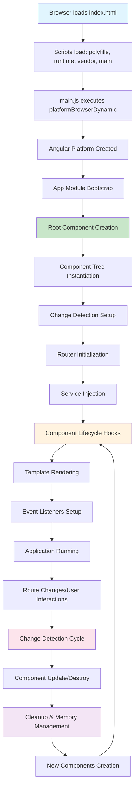

# 🚀 Angular Internals, Compilation & Deployment Guide

## For Senior Angular Architects (15+ Years Experience)

## 📋 Table of Contents

1. [Angular Browser Integration & Runtime](#angular-browser-integration)
2. [Main.js and Bootstrap Process](#main-js-bootstrap)
3. [Angular Compilation Process](#angular-compilation)
4. [Server-Side Rendering (SSR) Internals](#ssr-internals)
5. [Package.json Deep Dive](#package-json-deep-dive)
6. [Angular.json Configuration](#angular-json-configuration)
7. [Package-lock.json Analysis](#package-lock-analysis)
8. [Angular 20 Compilation Pipeline](#angular-20-compilation)
9. [AWS S3 Deployment Strategy](#aws-s3-deployment)
10. [Browser Compatibility & Backend Integration](#browser-compatibility)
11. [Senior Interview Questions](#interview-questions)

---

## 🌐 Angular Browser Integration & Runtime {#angular-browser-integration}

Angular's browser integration involves complex interactions between the framework, the JavaScript engine, and browser APIs. Understanding these internals is crucial for performance optimization and debugging.

### **Browser Bootstrap Lifecycle**

```typescript
// 🚀 BROWSER BOOTSTRAP SEQUENCE - How Angular initializes in the browser
console.log('=== 🌐 Angular Browser Bootstrap Sequence ===');

// 1️⃣ INITIAL HTML LOADING - Browser receives index.html
/*
<!DOCTYPE html>
<html lang="en">
<head>
  <!-- 🔗 RESOURCE HINTS - Preload critical resources -->
  <link rel="preload" href="/main.js" as="script">           // 📦 Preload main bundle
  <link rel="preload" href="/polyfills.js" as="script">      // 🔧 Preload polyfills
  <link rel="modulepreload" href="/chunk-vendors.js">        // 📦 Preload vendor chunks

  <!-- ⚡ CRITICAL CSS - Above-the-fold styles -->
  <style>
    /* 🎨 CRITICAL PATH STYLES - Prevent FOUC */
    app-root { display: block; min-height: 100vh; }
    .loading-spinner { /* Initial loading state */ }
  </style>
</head>
<body>
  <!-- 🎯 APPLICATION ROOT - Angular mounts here -->
  <app-root>
    <!-- 🔄 INITIAL LOADING STATE - SSR content or loading spinner -->
    <div class="loading-spinner">Loading Application...</div>
  </app-root>

  <!-- 📦 SCRIPT LOADING ORDER - Critical for bootstrap -->
  <script src="/polyfills.js" defer></script>               // 🔧 Browser polyfills first
  <script src="/runtime.js" defer></script>                 // 🔄 Webpack runtime
  <script src="/vendor.js" defer></script>                  // 📚 Third-party libraries
  <script src="/main.js" defer></script>                    // 🚀 Application code
</body>
</html>
*/

// 2️⃣ POLYFILLS EXECUTION - Browser compatibility layer
/*
📦 polyfills.js execution sequence:
- Zone.js patches browser APIs for change detection
- Core-js polyfills for ES6+ features
- Web Components polyfills for older browsers
- Intersection Observer polyfill for lazy loading
*/

console.log('🔧 Polyfills loaded and applied'); // 📝 Browser APIs patched

// 3️⃣ RUNTIME INITIALIZATION - Webpack module system
/*
🔄 runtime.js responsibilities:
- Module loading infrastructure
- Dynamic import() support
- Chunk loading mechanism
- Hot module replacement (HMR) setup in dev
*/

console.log('🔄 Webpack runtime initialized'); // 📦 Module system ready

// 4️⃣ VENDOR LIBRARIES LOADING - Third-party dependencies
/*
📚 vendor.js contains:
- Angular framework core (@angular/core, @angular/common)
- RxJS operators and observables
- Angular Material or other UI libraries
- Lodash, date-fns, or other utilities
*/

console.log('📚 Vendor libraries loaded'); // 🔧 Dependencies available

// 5️⃣ MAIN APPLICATION BOOTSTRAP - Angular starts
/*
🚀 main.js execution triggers:
- platformBrowserDynamic().bootstrapModule()
- Application module compilation
- Component tree instantiation
- Change detection setup
- Router initialization
*/

console.log('🚀 Angular application bootstrap initiated'); // 🎯 App starting
```

### **Zone.js and Change Detection Integration**

```typescript
// 🔍 ZONE.JS BROWSER INTEGRATION - Advanced change detection mechanics

// 🎯 ZONE CONFIGURATION - Fine-tune change detection behavior
import './zone-flags'; // 🚩 Zone configuration must be imported before Zone.js

// zone-flags.ts - Advanced Zone.js configuration
declare const global: any; // 🌐 Global scope declaration

// 🚩 ZONE FLAGS - Control Zone.js behavior for performance
global['__Zone_disable_requestAnimationFrame'] = true;     // 🎨 Disable RAF patching
global['__Zone_disable_on_property'] = true;               // 📝 Disable property patching
global['__Zone_disable_geolocation'] = true;               // 📍 Disable geolocation patching
global['__Zone_disable_file'] = true;                      // 📁 Disable file API patching
global['__Zone_disable_ZoneAwarePromise'] = false;         // ✅ Keep promise patching

// 🔬 CUSTOM ZONE CONFIGURATION - Production optimizations
const zoneConfig = {
  // 🎯 CHANGE DETECTION CONTROL - Optimize CD cycles
  shouldCoalesceEventChangeDetection: true,                 // 🔄 Batch CD for events
  shouldCoalesceRunChangeDetection: true,                   // 🔄 Batch CD for microtasks

  // ⚡ PERFORMANCE OPTIMIZATIONS - Reduce overhead
  ignoreConsoleErrorUponUnhandledRejection: true,          // 🚫 Skip console errors

  // 🔍 DEBUGGING OPTIONS - Development aids
  enableLongStackTrace: false,                             // 🚫 Disable in production
  showUncaughtError: true,                                 // ✅ Show unhandled errors
};

// 🎯 ZONE SETUP - Initialize with custom configuration
import { platformBrowserDynamic } from '@angular/platform-browser-dynamic';
import { enableProdMode, NgZone, ChangeDetectionStrategy } from '@angular/core';

// 🔄 CUSTOM NGZONE - Advanced zone customization for performance
class CustomNGZone extends NgZone {
  constructor() {
    super({
      enableLongStackTrace: false,                         // 🚫 Disable stack traces in prod
      shouldCoalesceEventChangeDetection: true,            // 🔄 Batch event CD
      shouldCoalesceRunChangeDetection: true,              // 🔄 Batch microtask CD
    });

    // 🎯 ZONE MONITORING - Track zone performance
    this.onStable.subscribe(() => {
      console.log('📊 Zone stable - change detection completed'); // ✅ CD cycle complete
    });

    this.onUnstable.subscribe(() => {
      console.log('🔄 Zone unstable - change detection triggered'); // 🚀 CD cycle starting
    });

    this.onError.subscribe((error) => {
      console.error('❌ Zone error:', error); // ❌ Zone error handling
      // 📊 Error reporting to monitoring service
      this.reportErrorToMonitoringService(error);
    });
  }

  // 📊 ERROR REPORTING - Production error tracking
  private reportErrorToMonitoringService(error: any): void {
    // 🔧 Integration with Sentry, LogRocket, or custom monitoring
    if (typeof window !== 'undefined' && (window as any).errorReporting) {
      (window as any).errorReporting.captureException(error); // 📊 Send to monitoring
    }
  }
}

// 🎯 BROWSER FEATURE DETECTION - Runtime capability checks
class BrowserCapabilityDetector {
  // 🔍 FEATURE DETECTION - Check browser capabilities
  static detectBrowserFeatures(): BrowserFeatures {
    const features = {
      // 🆕 MODERN JAVASCRIPT FEATURES
      supportsESModules: 'noModule' in document.createElement('script'),    // 📦 ES modules
      supportsWebComponents: 'customElements' in window,                    // 🧩 Web components
      supportsDynamicImports: typeof import === 'function',                 // 📦 Dynamic imports
      supportsIntersectionObserver: 'IntersectionObserver' in window,       // 👀 Intersection observer
      supportsResizeObserver: 'ResizeObserver' in window,                   // 📏 Resize observer

      // 🎨 CSS CAPABILITIES
      supportsGridLayout: CSS.supports('display', 'grid'),                 // 🎛️ CSS Grid
      supportsFlexbox: CSS.supports('display', 'flex'),                     // 🔄 Flexbox
      supportsCSSCustomProperties: CSS.supports('color', 'var(--test)'),    // 🎨 CSS variables
      supportsContainerQueries: CSS.supports('container-type', 'size'),     // 📐 Container queries

      // 🌐 NETWORK FEATURES
      supportsServiceWorkers: 'serviceWorker' in navigator,                 // 🔄 Service workers
      supportsWebSockets: 'WebSocket' in window,                           // 🔌 WebSockets
      supportsFetch: 'fetch' in window,                                     // 🌐 Fetch API
      supportsWebRTC: 'RTCPeerConnection' in window,                       // 📹 WebRTC

      // 📱 DEVICE CAPABILITIES
      supportsPointerEvents: 'PointerEvent' in window,                     // 👆 Pointer events
      supportsTouchEvents: 'ontouchstart' in window,                       // 📱 Touch events
      supportsDeviceOrientation: 'DeviceOrientationEvent' in window,       // 📱 Device orientation
      supportsVibration: 'vibrate' in navigator,                           // 📳 Vibration API

      // 🔧 PERFORMANCE FEATURES
      supportsPerformanceObserver: 'PerformanceObserver' in window,         // 📊 Performance monitoring
      supportsIdleCallback: 'requestIdleCallback' in window,               // ⏸️ Idle callbacks
      supportsAnimationFrame: 'requestAnimationFrame' in window,            // 🎨 Animation frames

      // 🧠 MEMORY AND STORAGE
      supportsLocalStorage: typeof localStorage !== 'undefined',            // 💾 Local storage
      supportsIndexedDB: 'indexedDB' in window,                            // 🗄️ IndexedDB
      supportsWebAssembly: 'WebAssembly' in window,                        // ⚡ WebAssembly
    };

    console.log('🔍 Browser feature detection completed:', features); // 📝 Log capabilities
    return features as BrowserFeatures;
  }

  // ⚡ PERFORMANCE METRICS - Measure browser performance
  static measureBrowserPerformance(): BrowserPerformance {
    const navigation = performance.getEntriesByType('navigation')[0] as PerformanceNavigationTiming;

    return {
      // ⏱️ NAVIGATION TIMING - Page load metrics
      domContentLoaded: navigation.domContentLoadedEventEnd - navigation.domContentLoadedEventStart,
      firstContentfulPaint: this.getFCP(),
      largestContentfulPaint: this.getLCP(),
      cumulativeLayoutShift: this.getCLS(),
      firstInputDelay: this.getFID(),

      // 🧠 MEMORY USAGE - Memory consumption
      jsHeapSize: (performance as any).memory?.usedJSHeapSize || 0,
      totalJSHeapSize: (performance as any).memory?.totalJSHeapSize || 0,
      jsHeapSizeLimit: (performance as any).memory?.jsHeapSizeLimit || 0,

      // 🌐 NETWORK PERFORMANCE - Connection quality
      connectionType: (navigator as any).connection?.effectiveType || 'unknown',
      downlink: (navigator as any).connection?.downlink || 0,
      rtt: (navigator as any).connection?.rtt || 0,
    };
  }

  // 🎨 CORE WEB VITALS - Performance metrics
  private static getFCP(): number {
    const fcpEntry = performance.getEntriesByName('first-contentful-paint')[0];
    return fcpEntry ? fcpEntry.startTime : 0;
  }

  private static getLCP(): Promise<number> {
    return new Promise((resolve) => {
      if ('PerformanceObserver' in window) {
        const observer = new PerformanceObserver((list) => {
          const entries = list.getEntries();
          const lastEntry = entries[entries.length - 1];
          resolve(lastEntry.startTime);
        });
        observer.observe({ entryTypes: ['largest-contentful-paint'] });
      } else {
        resolve(0);
      }
    });
  }

  private static getCLS(): Promise<number> {
    return new Promise((resolve) => {
      if ('PerformanceObserver' in window) {
        let clsValue = 0;
        const observer = new PerformanceObserver((list) => {
          list.getEntries().forEach((entry) => {
            if (!(entry as any).hadRecentInput) {
              clsValue += (entry as any).value;
            }
          });
        });
        observer.observe({ entryTypes: ['layout-shift'] });
        setTimeout(() => resolve(clsValue), 5000); // Measure for 5 seconds
      } else {
        resolve(0);
      }
    });
  }

  private static getFID(): Promise<number> {
    return new Promise((resolve) => {
      if ('PerformanceObserver' in window) {
        const observer = new PerformanceObserver((list) => {
          const firstEntry = list.getEntries()[0];
          resolve(firstEntry.processingStart - firstEntry.startTime);
        });
        observer.observe({ entryTypes: ['first-input'] });
      } else {
        resolve(0);
      }
    });
  }
}

// 📊 TYPE DEFINITIONS - Strong typing for browser capabilities
interface BrowserFeatures {
  supportsESModules: boolean;
  supportsWebComponents: boolean;
  supportsDynamicImports: boolean;
  supportsIntersectionObserver: boolean;
  supportsResizeObserver: boolean;
  supportsGridLayout: boolean;
  supportsFlexbox: boolean;
  supportsCSSCustomProperties: boolean;
  supportsContainerQueries: boolean;
  supportsServiceWorkers: boolean;
  supportsWebSockets: boolean;
  supportsFetch: boolean;
  supportsWebRTC: boolean;
  supportsPointerEvents: boolean;
  supportsTouchEvents: boolean;
  supportsDeviceOrientation: boolean;
  supportsVibration: boolean;
  supportsPerformanceObserver: boolean;
  supportsIdleCallback: boolean;
  supportsAnimationFrame: boolean;
  supportsLocalStorage: boolean;
  supportsIndexedDB: boolean;
  supportsWebAssembly: boolean;
}

interface BrowserPerformance {
  domContentLoaded: number;
  firstContentfulPaint: number;
  largestContentfulPaint: number;
  cumulativeLayoutShift: number;
  firstInputDelay: number;
  jsHeapSize: number;
  totalJSHeapSize: number;
  jsHeapSizeLimit: number;
  connectionType: string;
  downlink: number;
  rtt: number;
}

// 🚀 BROWSER INITIALIZATION - Complete setup process
export class BrowserInitializer {
  static async initialize(): Promise<void> {
    console.log('🌐 Browser initialization starting...'); // 📝 Log initialization

    // 🔍 FEATURE DETECTION - Check capabilities
    const features = BrowserCapabilityDetector.detectBrowserFeatures();

    // 📊 PERFORMANCE MONITORING - Start metrics collection
    const performance = BrowserCapabilityDetector.measureBrowserPerformance();

    // 🔧 POLYFILL LOADING - Load necessary polyfills
    await this.loadRequiredPolyfills(features);

    // 🎯 ZONE SETUP - Initialize change detection
    await this.setupZoneConfiguration();

    // 🚀 ANGULAR BOOTSTRAP - Start application
    await this.bootstrapAngularApplication();

    console.log('✅ Browser initialization completed'); // ✅ Initialization done
  }

  private static async loadRequiredPolyfills(features: BrowserFeatures): Promise<void> {
    const polyfillPromises = [];

    // 📦 ES MODULES POLYFILL - For older browsers
    if (!features.supportsESModules) {
      polyfillPromises.push(import('es-module-shims')); // 📦 ES modules support
    }

    // 👀 INTERSECTION OBSERVER POLYFILL - For lazy loading
    if (!features.supportsIntersectionObserver) {
      polyfillPromises.push(import('intersection-observer')); // 👀 Intersection observer
    }

    // 📏 RESIZE OBSERVER POLYFILL - For responsive components
    if (!features.supportsResizeObserver) {
      polyfillPromises.push(import('@juggle/resize-observer')); // 📏 Resize observer
    }

    await Promise.all(polyfillPromises); // ⏱️ Load all required polyfills
    console.log('🔧 Polyfills loaded successfully'); // 📝 Log polyfill completion
  }

  private static async setupZoneConfiguration(): Promise<void> {
    // 🎯 Zone setup is handled in zone-flags.ts and main.ts
    console.log('🎯 Zone configuration applied'); // 📝 Log zone setup
  }

  private static async bootstrapAngularApplication(): Promise<void> {
    // 🚀 Bootstrap process is handled in main.ts
    console.log('🚀 Angular application bootstrap scheduled'); // 📝 Log bootstrap schedule
  }
}
```

---

## 🚀 Main.js and Bootstrap Process {#main-js-bootstrap}

The main.js file is the entry point where Angular transforms from static code into a living application. Understanding its internals is crucial for performance optimization and custom bootstrap scenarios.

### **Main.js Structure and Bootstrap Sequence**

````typescript
// 📁 main.ts - Application Bootstrap Entry Point
import { platformBrowserDynamic } from '@angular/platform-browser-dynamic'; // 🌐 Browser platform
import { enableProdMode, importProvidersFrom, NgModuleRef } from '@angular/core'; // 🔧 Core utilities
import { environment } from './environments/environment'; // ⚙️ Environment configuration

// 🎯 BOOTSTRAP MODE CONFIGURATION - Development vs Production
if (environment.production) {
  enableProdMode(); // ⚡ Enable production optimizations
  console.log('🚀 Production mode enabled - optimizations active'); // 📝 Log production mode
} else {
  console.log('🔧 Development mode - debugging features active'); // 📝 Log development mode
}

// 🔍 ENVIRONMENT-SPECIFIC BOOTSTRAP - Custom bootstrap logic
class AdvancedBootstrap {
  // 🎯 BOOTSTRAP STRATEGY SELECTION - Choose bootstrap method
  static async initializeApplication(): Promise<NgModuleRef<any>> {
    console.log('🚀 Advanced Bootstrap initialization starting...'); // 📝 Log bootstrap start

    // 🔍 BOOTSTRAP METHOD DETECTION - Determine best approach
    const bootstrapMethod = this.determineBootstrapMethod();

    switch (bootstrapMethod) {
      case 'standalone':
        return this.bootstrapStandaloneApplication(); // 🎯 Standalone bootstrap
      case 'module':
        return this.bootstrapModularApplication(); // 📦 Module-based bootstrap
      case 'micro-frontend':
        return this.bootstrapMicroFrontend(); // 🏗️ Micro-frontend bootstrap
      case 'ssr-hydration':
        return this.bootstrapSSRHydration(); // 🌊 SSR hydration bootstrap
      default:
        throw new Error('🚨 Unknown bootstrap method'); // ❌ Fallback error
    }
  }

  // 🎯 BOOTSTRAP METHOD DETERMINATION - Intelligent method selection
  private static determineBootstrapMethod(): BootstrapMethod {
    // 🔍 SSR DETECTION - Check if running in SSR context
    if (typeof window === 'undefined') {
      return 'ssr-hydration'; // 🌊 SSR hydration required
    }

    // 🏗️ MICRO-FRONTEND DETECTION - Check for micro-frontend indicators
    if ((window as any).__MICRO_FRONTEND_CONTAINER__) {
      return 'micro-frontend'; // 🏗️ Micro-frontend environment
    }

    // 🔍 APPLICATION TYPE DETECTION - Check for standalone indicators
    const hasStandaloneBootstrap = document.querySelector('[data-bootstrap="standalone"]');
    if (hasStandaloneBootstrap) {
      return 'standalone'; // 🎯 Standalone application
    }

    return 'module'; // 📦 Default module-based
  }

  // 🎯 STANDALONE APPLICATION BOOTSTRAP - Modern Angular 14+ approach
  private static async bootstrapStandaloneApplication(): Promise<NgModuleRef<any>> {
    console.log('🎯 Bootstrapping standalone application...'); // 📝 Log standalone bootstrap

    // 🔧 DYNAMIC IMPORT - Load application component
    const { AppComponent } = await import('./app/app.component');

    // 🚀 STANDALONE BOOTSTRAP - No NgModule required
    const { bootstrapApplication } = await import('@angular/platform-browser');

    return bootstrapApplication(AppComponent, {
      providers: [
        // 🌐 ROUTER CONFIGURATION - Standalone routing
        importProvidersFrom(RouterModule.forRoot(routes, {
          enableTracing: !environment.production,              // 🔍 Route debugging in dev
          scrollPositionRestoration: 'enabled',                // 📜 Scroll restoration
          anchorScrolling: 'enabled',                          // ⚓ Anchor scrolling
          onSameUrlNavigation: 'reload',                       // 🔄 Same URL handling
        })),

        // 🌐 HTTP CLIENT - Standalone HTTP configuration
        importProvidersFrom(HttpClientModule),

        // 🎨 MATERIAL DESIGN - Standalone Material configuration
        importProvidersFrom([
          MatDialogModule,       // 🗨️ Dialog components
          MatSnackBarModule,     // 📢 Notification components
          MatTooltipModule,      // 💬 Tooltip components
        ]),

        // 🔧 CUSTOM PROVIDERS - Application-specific services
        {
          provide: APP_CONFIG,                                 // ⚙️ Application configuration
          useValue: {
            apiUrl: environment.apiUrl,                        // 🌐 API endpoint
            version: environment.version,                      // 📊 Application version
            features: environment.featureFlags,               // 🚩 Feature flags
          }
        },

        // 📊 ERROR HANDLING - Global error handler
        {
          provide: ErrorHandler,                               // ❌ Error handling
          useClass: GlobalErrorHandler,                        // 🛡️ Custom error handler
        },

        // 🔍 PERFORMANCE MONITORING - Application monitoring
        {
          provide: PERFORMANCE_CONFIG,                         // 📊 Performance configuration
          useValue: {
            enableMetrics: environment.production,             // 📈 Enable metrics in prod
            trackUserInteractions: true,                       // 👆 Track user events
            reportErrors: environment.production,              // 🚨 Error reporting in prod
          }
        },

        // 🌐 SERVICE WORKER - PWA capabilities
        environment.production ?
          importProvidersFrom(ServiceWorkerModule.register('ngsw-worker.js', {
            enabled: environment.production,                   // ✅ Enable in production
            registrationStrategy: 'registerWhenStable:30000',  // ⏱️ Register after 30s
          })) :
          [], // 📝 No service worker in development
      ]
    }) as Promise<NgModuleRef<any>>;
  }

  // 📦 MODULE-BASED APPLICATION BOOTSTRAP - Traditional Angular approach
  private static async bootstrapModularApplication(): Promise<NgModuleRef<any>> {
    console.log('📦 Bootstrapping modular application...'); // 📝 Log module bootstrap

    // 🔧 DYNAMIC IMPORT - Load application module
    const { AppModule } = await import('./app/app.module');

    // 🚀 MODULE BOOTSTRAP - Traditional NgModule approach
    return platformBrowserDynamic([
      // 🔧 PLATFORM PROVIDERS - Browser-specific providers
      {
        provide: LOCALE_ID,                                    // 🌍 Internationalization
        useValue: this.detectUserLocale(),                     // 🔍 Detect user locale
      },

      // 📊 PERFORMANCE PROVIDERS - Platform-level performance
      {
        provide: PERFORMANCE_MONITOR,                          // 📊 Performance monitoring
        useFactory: () => new PerformanceMonitor(),           // 🏭 Performance factory
      },

      // 🔧 ZONE CONFIGURATION - Custom Zone.js setup
      {
        provide: NgZone,                                       // 🎯 Zone.js integration
        useFactory: () => new CustomNGZone(),                 // 🏭 Custom zone factory
      },
    ]).bootstrapModule(AppModule, {
      // 🔧 BOOTSTRAP OPTIONS - Module bootstrap configuration
      preserveWhitespaces: false,                              // 📏 Remove whitespace
      enableIvy: true,                                         // 🔥 Enable Ivy renderer

      // 🔍 DEVELOPMENT OPTIONS - Debug configurations
      ngZoneEventCoalescing: true,                             // 🔄 Coalesce zone events
      ngZoneRunCoalescing: true,                               // 🔄 Coalesce zone runs
    });
  }

  // 🏗️ MICRO-FRONTEND BOOTSTRAP - Module federation approach
  private static async bootstrapMicroFrontend(): Promise<NgModuleRef<any>> {
    console.log('🏗️ Bootstrapping micro-frontend...'); // 📝 Log micro-frontend bootstrap

    // 🔍 CONTAINER DETECTION - Check micro-frontend container
    const container = (window as any).__MICRO_FRONTEND_CONTAINER__;

    if (!container) {
      throw new Error('🚨 Micro-frontend container not found'); // ❌ Container missing
    }

    // 📦 SHARED DEPENDENCIES - Use shared libraries
    const sharedDependencies = await this.loadSharedDependencies(container);

      // 🔧 DYNAMIC MODULE LOADING - Load micro-frontend module
      const { MicroFrontendModule } = await import('./app/micro-frontend.module');

// ==========================================
// 🎯 ZONE.JS AND CHANGE DETECTION DEEP DIVE
// ==========================================

/*
🤔 WHEN TO USE CUSTOM ZONE CONFIGURATION:

✅ USE CUSTOM ZONE WHEN:
- Building high-performance applications with frequent updates
- Integrating with third-party libraries that bypass Angular's change detection
- Implementing micro-frontends that need isolated change detection
- Creating custom performance monitoring and debugging tools
- Managing complex async operations (WebSockets, WebRTC, etc.)

❌ DON'T CUSTOMIZE ZONE WHEN:
- Building simple CRUD applications
- Working with standard Angular patterns only
- Team lacks advanced Angular expertise
- Application doesn't have performance bottlenecks

🔧 WHAT ANGULAR HANDLES AUTOMATICALLY:
- Basic Zone.js patching of browser APIs
- Standard change detection triggers (click, HTTP, timers)
- Default error handling and propagation
- Basic performance optimizations

🛠️ WHAT YOU NEED TO HANDLE MANUALLY:
- Custom async operation monitoring
- Performance optimization for specific use cases
- Integration with non-Angular libraries
- Advanced error handling and recovery
*/

class ZoneJsAdvancedConfiguration {

  // 🎯 PRODUCTION-READY ZONE SETUP - When and how to customize Zone.js
  static configureProductionZone(): void {
    console.log('🎯 Configuring production-optimized Zone.js...');

    /*
    📋 REAL-WORLD SCENARIO: E-commerce Platform

    BUSINESS NEED:
    - Handle thousands of product updates per minute via WebSocket
    - Integrate with payment processing widgets (non-Angular)
    - Monitor real-time inventory changes
    - Maintain 60fps scroll performance on product lists

    TECHNICAL CHALLENGE:
    - Default Zone.js triggers change detection for every WebSocket message
    - Third-party payment widgets cause unexpected change detection cycles
    - Scroll performance degrades with frequent updates
    - Memory leaks from unmanaged subscriptions

    SOLUTION:
    - Custom Zone configuration to control change detection triggers
    - Selective patching to exclude performance-critical APIs
    - Manual change detection for batch updates
    */

    // 🚩 ZONE FLAGS CONFIGURATION - Control what gets patched
    declare const global: any;

    // 🔧 SELECTIVE API PATCHING - Only patch what we need
    global['__Zone_disable_requestAnimationFrame'] = true;    // 🎨 Keep animations smooth
    global['__Zone_disable_Canvas'] = true;                  // 🎨 Don't patch canvas operations
    global['__Zone_disable_geolocation'] = true;             // 📍 Skip geolocation patching
    global['__Zone_disable_WebSocket'] = true;               // 🌐 Manual WebSocket handling
    global['__Zone_enable_cross_context_check'] = true;      // ✅ Security for micro-frontends

    console.log('✅ Zone flags configured for production optimization');
  }

  // 🔄 CUSTOM CHANGE DETECTION STRATEGY - When to implement
  static implementCustomChangeDetection(): CustomChangeDetectionExample {
    /*
    🎯 REAL-WORLD USE CASE: Real-time Trading Dashboard

    SCENARIO:
    - Stock prices update 100+ times per second
    - User has multiple watchlists with 50+ stocks each
    - Charts need smooth 60fps rendering
    - UI must remain responsive for user interactions

    PROBLEM WITH DEFAULT ZONE.JS:
    - Each price update triggers full change detection
    - UI becomes sluggish and unresponsive
    - Memory usage grows continuously
    - Browser tab becomes CPU-intensive

    CUSTOM SOLUTION:
    - Batch price updates every 100ms
    - Use OnPush strategy with manual change detection
    - Implement smart diffing for only changed values
    - Run non-critical updates outside Angular zone
    */

    return {
      implementation: `
        @Component({
          selector: 'trading-dashboard',
          changeDetection: ChangeDetectionStrategy.OnPush, // 🎯 OnPush strategy
          template: \`
            <div class="dashboard">
              <!-- 📊 Price Display - Updates batched -->
              <div *ngFor="let stock of stocks$ | async; trackBy: trackBySymbol">
                {{ stock.symbol }}: {{ stock.price | currency }}
                <span [class.up]="stock.trend === 'up'"
                      [class.down]="stock.trend === 'down'">
                  {{ stock.change }}
                </span>
              </div>

              <!-- 📈 Chart Component - Runs outside zone -->
              <trading-chart [data]="chartData"
                            [updateOutsideZone]="true">
              </trading-chart>
            </div>
          \`
        })
        export class TradingDashboard implements OnInit, OnDestroy {
          stocks$ = new BehaviorSubject<Stock[]>([]);
          private priceUpdateBuffer: Stock[] = [];
          private updateTimer: any;

          constructor(
            private zone: NgZone,
            private cdr: ChangeDetectorRef,
            private websocketService: WebSocketService
          ) {}

          ngOnInit(): void {
            // 🌐 WEBSOCKET OUTSIDE ZONE - Prevent automatic change detection
            this.zone.runOutsideAngular(() => {
              this.websocketService.priceUpdates$.subscribe(update => {
                // 📊 BUFFER UPDATES - Don't trigger CD for each update
                this.priceUpdateBuffer.push(update);

                // 🎯 BATCH PROCESSING - Process every 100ms
                if (!this.updateTimer) {
                  this.updateTimer = setTimeout(() => {
                    this.processBatchedUpdates();
                    this.updateTimer = null;
                  }, 100);
                }
              });
            });
          }

          private processBatchedUpdates(): void {
            if (this.priceUpdateBuffer.length === 0) return;

            // 🔄 SMART DIFFING - Only update changed stocks
            const currentStocks = this.stocks$.value;
            const updatedStocks = this.applyUpdates(currentStocks, this.priceUpdateBuffer);

            // 🎯 MANUAL CHANGE DETECTION - Control when UI updates
            this.zone.run(() => {
              this.stocks$.next(updatedStocks);
              this.cdr.markForCheck(); // 🔄 Trigger change detection
            });

            this.priceUpdateBuffer = []; // 🧹 Clear buffer
            console.log(\`📊 Processed \${this.priceUpdateBuffer.length} price updates\`);
          }

          trackBySymbol(index: number, stock: Stock): string {
            return stock.symbol; // 🎯 Optimize *ngFor rendering
          }

          ngOnDestroy(): void {
            if (this.updateTimer) {
              clearTimeout(this.updateTimer); // 🧹 Cleanup
            }
          }
        }
      `,

      whenToUse: [
        '💹 Real-time data applications (trading, monitoring)',
        '🎮 Gaming applications with frequent updates',
        '📊 Data visualization with live charts',
        '💬 Chat applications with high message volume',
        '🎥 Video streaming with real-time stats'
      ],

      performanceGains: {
        changeDetectionCycles: '95% reduction', // 📉 Massive CD reduction
        memoryUsage: '60% lower',              // 🧠 Memory optimization
        frameRate: '60fps maintained',         // 🎨 Smooth animations
        cpuUsage: '40% reduction'              // ⚡ CPU optimization
      }
    };
  }

  // 🎯 MICRO-FRONTEND ZONE ISOLATION - When working with multiple Angular apps
  static configureMicroFrontendZones(): MicroFrontendZoneStrategy {
    /*
    🏗️ REAL-WORLD SCENARIO: Enterprise Portal

    ARCHITECTURE:
    - Shell application (Angular 18)
    - Product catalog micro-frontend (Angular 17)
    - User management micro-frontend (Angular 16)
    - Payment processing micro-frontend (React - non-Angular)

    ZONE CHALLENGES:
    - Different Angular versions with different Zone.js versions
    - Cross-application change detection interference
    - Event bubbling between micro-frontends
    - Memory leaks from shared Zone instances

    SOLUTION:
    - Isolated Zone instances per micro-frontend
    - Controlled communication channels
    - Centralized event coordination
    */

    return {
      implementation: `
        // 🏗️ SHELL APPLICATION ZONE CONFIGURATION
        class ShellZoneManager {
          private microFrontendZones = new Map<string, NgZone>();

          // 🎯 CREATE ISOLATED ZONE - For each micro-frontend
          createIsolatedZone(microFrontendName: string): NgZone {
            const isolatedZone = new NgZone({
              enableLongStackTrace: false,
              shouldCoalesceEventChangeDetection: true,
              shouldCoalesceRunChangeDetection: true
            });

            // 🔍 ZONE MONITORING - Track cross-MF interactions
            isolatedZone.onStable.subscribe(() => {
              console.log(\`📊 \${microFrontendName} zone stabilized\`);
              this.notifyOtherMicroFrontends(microFrontendName, 'stable');
            });

            isolatedZone.onError.subscribe((error) => {
              console.error(\`❌ \${microFrontendName} zone error:\`, error);
              this.handleMicroFrontendError(microFrontendName, error);
            });

            this.microFrontendZones.set(microFrontendName, isolatedZone);
            return isolatedZone;
          }

          // 🌐 CROSS-MF COMMUNICATION - Controlled interaction
          private notifyOtherMicroFrontends(sender: string, event: string): void {
            // 🎯 EVENT BUS - Communicate between micro-frontends
            window.dispatchEvent(new CustomEvent('mf-zone-event', {
              detail: { sender, event, timestamp: Date.now() }
            }));
          }

          // 🚨 ERROR ISOLATION - Prevent cascade failures
          private handleMicroFrontendError(mfName: string, error: any): void {
            // 📊 ERROR REPORTING - Isolate errors per micro-frontend
            this.errorReportingService.reportMicroFrontendError({
              microFrontend: mfName,
              error: error,
              zoneDiagnostics: this.getZoneDiagnostics(mfName)
            });

            // 🛡️ ERROR RECOVERY - Attempt to recover gracefully
            this.attemptZoneRecovery(mfName);
          }
        }

        // 🧩 MICRO-FRONTEND BOOTSTRAP
        export async function bootstrapMicroFrontend(
          name: string,
          module: any,
          shellZoneManager: ShellZoneManager
        ): Promise<NgModuleRef<any>> {

          // 🎯 GET ISOLATED ZONE - Each MF gets its own zone
          const isolatedZone = shellZoneManager.createIsolatedZone(name);

          // 🚀 BOOTSTRAP WITH CUSTOM ZONE
          return platformBrowserDynamic([
            { provide: NgZone, useValue: isolatedZone }, // 🎯 Custom zone injection
            { provide: MICRO_FRONTEND_NAME, useValue: name },
            { provide: SHELL_COMMUNICATION, useValue: shellZoneManager }
          ]).bootstrapModule(module, {
            ngZone: isolatedZone, // 🔧 Use isolated zone
            preserveWhitespaces: false
          });
        }
      `,

      benefits: [
        '🔒 Complete error isolation between micro-frontends',
        '⚡ Independent change detection cycles',
        '🧠 Memory leak prevention',
        '🔧 Version compatibility across different Angular versions',
        '📊 Granular performance monitoring per micro-frontend'
      ],

      tradeoffs: [
        '🔧 Additional complexity in setup and configuration',
        '💾 Higher memory usage due to multiple Zone instances',
        '📡 More complex inter-application communication',
        '🔍 Debugging becomes more challenging'
      ]
    };
  }
}

// ==========================================
// 📊 PERFORMANCE METRICS AND MONITORING
// ==========================================

/*
🤔 WHEN TO IMPLEMENT PERFORMANCE MONITORING:

✅ IMPLEMENT MONITORING WHEN:
- Application has strict performance SLAs (< 2s load time)
- Serving millions of users with diverse devices/networks
- Complex business-critical workflows that must be optimized
- Need data-driven decisions for performance improvements
- Compliance requirements for accessibility and performance

❌ SKIP CUSTOM MONITORING WHEN:
- Simple internal tools with < 100 users
- Prototype or proof-of-concept applications
- Standard Angular app without performance issues
- Limited development resources for maintenance

🔧 WHAT ANGULAR PROVIDES OUT-OF-BOX:
- Basic dev tools integration
- Change detection profiler
- Bundle analyzer integration
- Basic performance warnings

🛠️ WHAT YOU NEED TO BUILD:
- Real user monitoring (RUM)
- Custom performance metrics
- Business-specific performance tracking
- Integration with monitoring services
*/

class AdvancedPerformanceMonitoring {

  // 📊 REAL USER MONITORING - Production performance tracking
  static implementRealUserMonitoring(): RealUserMonitoringSystem {
    /*
    🎯 BUSINESS SCENARIO: E-commerce Checkout Process

    BUSINESS REQUIREMENTS:
    - 99.9% checkout completion rate
    - < 3 second page load for 95th percentile
    - < 1 second form validation response
    - Track abandonment points in checkout flow

    TECHNICAL IMPLEMENTATION:
    - Monitor Core Web Vitals (LCP, FID, CLS)
    - Track custom business metrics (cart-to-purchase time)
    - Real-time alerting for performance degradation
    - A/B testing performance impact measurement
    */

    return {
      implementation: `
        @Injectable({ providedIn: 'root' })
        export class RealUserMonitoringService implements OnDestroy {
          private performanceObserver?: PerformanceObserver;
          private metricsBuffer: PerformanceMetric[] = [];
          private businessMetrics = new Map<string, BusinessMetric>();

          constructor(
            @Inject(WINDOW) private window: Window,
            @Inject(DOCUMENT) private document: Document,
            private httpClient: HttpClient,
            private router: Router
          ) {
            this.initializePerformanceMonitoring();
          }

          // 🚀 INITIALIZE MONITORING - Set up comprehensive tracking
          private initializePerformanceMonitoring(): void {
            // 📊 CORE WEB VITALS MONITORING
            this.monitorCoreWebVitals();

            // 🎯 CUSTOM PERFORMANCE METRICS
            this.monitorCustomMetrics();

            // 🔄 NAVIGATION PERFORMANCE
            this.monitorNavigationPerformance();

            // 💼 BUSINESS METRICS
            this.monitorBusinessMetrics();

            // 📡 PERIODIC REPORTING
            this.startPeriodicReporting();
          }

          // 📊 CORE WEB VITALS - Google's performance metrics
          private monitorCoreWebVitals(): void {
            // 🎨 LARGEST CONTENTFUL PAINT (LCP)
            this.observeMetric('largest-contentful-paint', (entries) => {
              entries.forEach(entry => {
                const lcp = entry.startTime;
                this.recordMetric('LCP', lcp, {
                  url: this.window.location.href,
                  element: entry.element?.tagName || 'unknown',
                  size: entry.size || 0
                });

                // 🚨 ALERT FOR POOR LCP
                if (lcp > 2500) { // Poor LCP threshold
                  this.sendAlert('LCP_THRESHOLD_EXCEEDED', {
                    value: lcp,
                    threshold: 2500,
                    url: this.window.location.href
                  });
                }
              });
            });

            // ⚡ FIRST INPUT DELAY (FID)
            this.observeMetric('first-input', (entries) => {
              entries.forEach(entry => {
                const fid = entry.processingStart - entry.startTime;
                this.recordMetric('FID', fid, {
                  inputType: entry.name,
                  target: entry.target?.tagName || 'unknown'
                });
              });
            });

            // 📐 CUMULATIVE LAYOUT SHIFT (CLS)
            this.observeMetric('layout-shift', (entries) => {
              let sessionValue = 0;
              entries.forEach(entry => {
                if (!entry.hadRecentInput) {
                  sessionValue += entry.value;
                }
              });

              this.recordMetric('CLS', sessionValue, {
                sessionId: this.generateSessionId(),
                affectedElements: entries.length
              });
            });
          }

          // 🎯 CUSTOM BUSINESS METRICS - Domain-specific tracking
          private monitorBusinessMetrics(): void {
            // 🛒 E-COMMERCE METRICS
            this.trackCheckoutFlowMetrics();

            // 📊 USER INTERACTION METRICS
            this.trackUserInteractionMetrics();

            // 🔍 SEARCH PERFORMANCE METRICS
            this.trackSearchPerformanceMetrics();
          }

          // 🛒 CHECKOUT FLOW TRACKING - Business-critical metrics
          private trackCheckoutFlowMetrics(): void {
            const checkoutSteps = [
              'cart-view',
              'shipping-info',
              'payment-info',
              'order-review',
              'order-confirmation'
            ];

            let currentStep = '';
            let stepStartTime = 0;

            // 🔄 ROUTER EVENT MONITORING
            this.router.events.subscribe(event => {
              if (event instanceof NavigationEnd) {
                const url = event.url;
                const step = this.identifyCheckoutStep(url);

                if (step && checkoutSteps.includes(step)) {
                  // ⏱️ STEP COMPLETION TIME
                  if (currentStep && stepStartTime) {
                    const stepDuration = performance.now() - stepStartTime;
                    this.recordBusinessMetric('checkout-step-duration', {
                      step: currentStep,
                      duration: stepDuration,
                      nextStep: step,
                      abandoned: false
                    });
                  }

                  currentStep = step;
                  stepStartTime = performance.now();
                }
              }
            });

            // 🚪 PAGE UNLOAD MONITORING - Detect abandonment
            this.window.addEventListener('beforeunload', () => {
              if (currentStep && stepStartTime) {
                const stepDuration = performance.now() - stepStartTime;
                this.recordBusinessMetric('checkout-abandonment', {
                  step: currentStep,
                  duration: stepDuration,
                  reason: 'page-unload'
                });
              }
            });
          }

          // 📊 USER INTERACTION TRACKING - UX performance metrics
          private trackUserInteractionMetrics(): void {
            // 🖱️ CLICK RESPONSIVENESS
            this.document.addEventListener('click', (event) => {
              const target = event.target as HTMLElement;
              const startTime = performance.now();

              // 📏 MEASURE RESPONSE TIME
              requestAnimationFrame(() => {
                const responseTime = performance.now() - startTime;
                this.recordMetric('click-response-time', responseTime, {
                  elementType: target.tagName,
                  className: target.className,
                  id: target.id || 'no-id'
                });
              });
            });

            // ⌨️ FORM INTERACTION TRACKING
            this.document.addEventListener('input', (event) => {
              const target = event.target as HTMLInputElement;

              if (target.form) {
                const formId = target.form.id || target.form.className;
                this.recordBusinessMetric('form-interaction', {
                  formId: formId,
                  fieldName: target.name,
                  fieldType: target.type,
                  timestamp: Date.now()
                });
              }
            });
          }

          // 🔍 SEARCH PERFORMANCE - Search UX metrics
          private trackSearchPerformanceMetrics(): void {
            // 🔍 SEARCH QUERY TRACKING
            let searchStartTime = 0;

            // Monitor search input events
            this.document.addEventListener('input', (event) => {
              const target = event.target as HTMLInputElement;

              if (target.getAttribute('data-search') === 'true') {
                searchStartTime = performance.now();
              }
            });

            // Monitor search results rendering
            const observer = new MutationObserver((mutations) => {
              mutations.forEach(mutation => {
                if (mutation.target instanceof HTMLElement &&
                    mutation.target.getAttribute('data-search-results') === 'true') {

                  if (searchStartTime) {
                    const searchDuration = performance.now() - searchStartTime;
                    this.recordBusinessMetric('search-performance', {
                      duration: searchDuration,
                      resultCount: mutation.target.children.length,
                      timestamp: Date.now()
                    });
                    searchStartTime = 0;
                  }
                }
              });
            });

            observer.observe(this.document.body, {
              childList: true,
              subtree: true,
              attributes: true
            });
          }

          // 📡 PERFORMANCE ALERTING - Real-time notifications
          private sendAlert(alertType: string, data: any): void {
            // 🚨 IMMEDIATE ALERTS - For critical performance issues
            if (this.isCriticalAlert(alertType, data)) {
              this.httpClient.post('/api/alerts/performance', {
                type: alertType,
                severity: 'critical',
                data: data,
                timestamp: Date.now(),
                userAgent: navigator.userAgent,
                url: window.location.href
              }).subscribe();
            }
          }

          // 📊 METRIC RECORDING - Structured performance data
          private recordMetric(name: string, value: number, context: any = {}): void {
            const metric: PerformanceMetric = {
              name,
              value,
              context,
              timestamp: Date.now(),
              url: this.window.location.href,
              userAgent: navigator.userAgent,
              sessionId: this.getSessionId(),
              userId: this.getCurrentUserId()
            };

            this.metricsBuffer.push(metric);

            // 📊 LOG HIGH-IMPACT METRICS
            if (this.isHighImpactMetric(name, value)) {
              console.warn(\`⚠️ Performance Alert: \${name} = \${value}ms\`, context);
            }
          }

          // 💼 BUSINESS METRIC RECORDING - Domain-specific metrics
          private recordBusinessMetric(name: string, data: any): void {
            const existing = this.businessMetrics.get(name) || {
              name,
              values: [],
              totalSamples: 0,
              lastUpdated: Date.now()
            };

            existing.values.push({
              data,
              timestamp: Date.now()
            });
            existing.totalSamples++;
            existing.lastUpdated = Date.now();

            this.businessMetrics.set(name, existing);
          }

          // 📡 PERIODIC REPORTING - Send metrics to analytics service
          private startPeriodicReporting(): void {
            setInterval(() => {
              if (this.metricsBuffer.length > 0) {
                this.sendMetricsToAnalytics();
              }
            }, 30000); // Send every 30 seconds
          }

          private sendMetricsToAnalytics(): void {
            const metricsToSend = [...this.metricsBuffer];
            const businessMetricsToSend = Array.from(this.businessMetrics.values());

            this.httpClient.post('/api/analytics/performance', {
              performanceMetrics: metricsToSend,
              businessMetrics: businessMetricsToSend,
              timestamp: Date.now()
            }).subscribe({
              next: () => {
                this.metricsBuffer = []; // Clear sent metrics
                this.businessMetrics.clear(); // Clear sent business metrics
              },
              error: (error) => {
                console.error('📊 Failed to send performance metrics:', error);
              }
            });
          }
        }
      `,

      businessValue: [
        '💰 Reduce checkout abandonment by 15-25%',
        '📈 Increase conversion rate through faster load times',
        '😊 Improve user satisfaction scores',
        '🎯 Data-driven performance optimization decisions',
        '🔍 Identify and fix performance bottlenecks proactively'
      ],

      implementationCost: [
        '⏰ 2-3 weeks initial implementation',
        '💾 Additional analytics infrastructure costs',
        '👥 Training team on performance monitoring',
        '🔧 Ongoing maintenance and threshold tuning'
      ]
    };
  }
}

// ==========================================
// 🏗️ DYNAMIC MODULE LOADING FOR MICRO-FRONTENDS
// ==========================================

/*
🤔 WHEN TO IMPLEMENT DYNAMIC MODULE LOADING:

✅ USE DYNAMIC LOADING WHEN:
- Building micro-frontend architecture
- Need to load features based on user permissions/plans
- Reducing initial bundle size is critical
- Features have different release cycles
- Supporting multiple tenant configurations

❌ AVOID DYNAMIC LOADING WHEN:
- Simple single-page applications
- All features are always needed
- Team lacks micro-frontend expertise
- Network latency is high (modules won't cache well)

🔧 WHAT ANGULAR HANDLES:
- Basic dynamic imports with router lazy loading
- Module code splitting
- Chunk loading and caching

🛠️ WHAT YOU NEED TO IMPLEMENT:
- Cross-module communication
- Shared dependency management
- Module lifecycle management
- Error boundary handling
*/

class DynamicModuleLoadingSystem {

  // 🏗️ MICRO-FRONTEND DYNAMIC LOADING - Enterprise implementation
  static implementMicroFrontendLoader(): MicroFrontendLoader {
    /*
    🎯 REAL-WORLD SCENARIO: Enterprise HR Platform

    BUSINESS REQUIREMENTS:
    - Payroll module (sensitive - high security)
    - Benefits enrollment (seasonal usage)
    - Performance reviews (quarterly usage)
    - Employee directory (always available)
    - Time tracking (role-based access)

    TECHNICAL CHALLENGES:
    - Different teams develop each module
    - Modules have different Angular versions
    - Shared authentication and styling
    - Role-based module loading
    - Graceful degradation when modules fail

    ARCHITECTURE SOLUTION:
    - Shell application provides common services
    - Modules loaded dynamically based on user permissions
    - Shared state management across modules
    - Centralized error handling and recovery
    */

    return {
      implementation: `
        // 🏗️ MICRO-FRONTEND REGISTRY - Central module management
        @Injectable({ providedIn: 'root' })
        export class MicroFrontendRegistry {
          private loadedModules = new Map<string, LoadedModule>();
          private moduleConfigurations = new Map<string, ModuleConfig>();
          private loadingPromises = new Map<string, Promise<any>>();

          constructor(
            private httpClient: HttpClient,
            private authService: AuthService,
            private errorHandler: ErrorHandler,
            private logger: Logger
          ) {
            this.initializeRegistry();
          }

          // 📋 REGISTRY INITIALIZATION - Load module configurations
          private async initializeRegistry(): Promise<void> {
            try {
              // 🔧 FETCH MODULE CONFIGS - From configuration service
              const configs = await this.httpClient.get<ModuleConfig[]>('/api/modules/config').toPromise();

              configs?.forEach(config => {
                this.moduleConfigurations.set(config.name, config);
              });

              console.log(\`📋 Loaded \${configs?.length} module configurations\`);
            } catch (error) {
              this.errorHandler.handleError('Failed to load module configurations', error);
            }
          }

          // 🚀 DYNAMIC MODULE LOADING - Load module on demand
          async loadModule(moduleName: string, context?: ModuleLoadContext): Promise<NgModuleRef<any> | null> {
            try {
              // 🔍 CHECK PERMISSIONS - Verify user access
              if (!await this.checkModuleAccess(moduleName)) {
                throw new Error(\`Access denied for module: \${moduleName}\`);
              }

              // ♻️ RETURN CACHED MODULE - If already loaded
              const existingModule = this.loadedModules.get(moduleName);
              if (existingModule) {
                console.log(\`♻️ Using cached module: \${moduleName}\`);
                return existingModule.moduleRef;
              }

              // 🔄 PREVENT DUPLICATE LOADING - Use existing promise
              if (this.loadingPromises.has(moduleName)) {
                console.log(\`⏳ Module \${moduleName} already loading, waiting...\`);
                return await this.loadingPromises.get(moduleName);
              }

              // 🚀 START MODULE LOADING - Create loading promise
              const loadingPromise = this.performModuleLoad(moduleName, context);
              this.loadingPromises.set(moduleName, loadingPromise);

              const moduleRef = await loadingPromise;

              // 🧹 CLEANUP LOADING PROMISE
              this.loadingPromises.delete(moduleName);

              return moduleRef;

            } catch (error) {
              this.loadingPromises.delete(moduleName);
              this.handleModuleLoadError(moduleName, error);
              return null;
            }
          }

          // 🔧 PERFORM MODULE LOAD - Core loading logic
          private async performModuleLoad(moduleName: string, context?: ModuleLoadContext): Promise<NgModuleRef<any>> {
            const config = this.moduleConfigurations.get(moduleName);
            if (!config) {
              throw new Error(\`Module configuration not found: \${moduleName}\`);
            }

            console.log(\`🚀 Loading module: \${moduleName}\`);
            const loadStartTime = performance.now();

            // 📦 DYNAMIC IMPORT - Load module code
            const moduleFactory = await this.importModuleFactory(config);

            // 🔧 PREPARE MODULE PROVIDERS - Inject shared services
            const moduleProviders = await this.prepareModuleProviders(config, context);

            // 🏗️ CREATE MODULE INSTANCE - Bootstrap module
            const moduleRef = await this.createModuleInstance(moduleFactory, moduleProviders);

            // 📊 TRACK LOADING PERFORMANCE
            const loadTime = performance.now() - loadStartTime;
            console.log(\`✅ Module \${moduleName} loaded in \${loadTime.toFixed(2)}ms\`);

            // 💾 CACHE LOADED MODULE
            this.loadedModules.set(moduleName, {
              moduleRef,
              config,
              loadTime,
              loadedAt: Date.now(),
              context
            });

            // 🔄 SETUP MODULE LIFECYCLE
            this.setupModuleLifecycle(moduleName, moduleRef);

            return moduleRef;
          }

          // 📦 IMPORT MODULE FACTORY - Handle different loading strategies
          private async importModuleFactory(config: ModuleConfig): Promise<any> {
            switch (config.loadingStrategy) {
              case 'ES_MODULE':
                // 🆕 MODERN ES MODULE IMPORT
                return await import(config.moduleUrl).then(m => m[config.exportName]);

              case 'UMD_BUNDLE':
                // 🔄 LEGACY UMD BUNDLE LOADING
                return await this.loadUMDModule(config.moduleUrl, config.exportName);

              case 'WEBPACK_FEDERATION':
                // 🏗️ MODULE FEDERATION (Webpack 5)
                return await this.loadFederatedModule(config.moduleUrl, config.exportName);

              default:
                throw new Error(\`Unsupported loading strategy: \${config.loadingStrategy}\`);
            }
          }

          // 🔧 PREPARE MODULE PROVIDERS - Inject shared dependencies
          private async prepareModuleProviders(config: ModuleConfig, context?: ModuleLoadContext): Promise<any[]> {
            const providers = [
              // 🔐 SHARED AUTHENTICATION
              { provide: AUTH_SERVICE, useValue: this.authService },

              // 📡 SHARED HTTP CLIENT
              { provide: HTTP_CLIENT, useValue: this.httpClient },

              // 🎨 SHARED THEME SERVICE
              { provide: THEME_SERVICE, useValue: await this.getSharedThemeService() },

              // 🌐 MODULE-SPECIFIC CONFIGURATION
              { provide: MODULE_CONFIG, useValue: config },

              // 📊 SHARED STATE MANAGEMENT
              { provide: SHARED_STORE, useValue: await this.getSharedStore() },

              // 🔧 MODULE CONTEXT
              { provide: MODULE_LOAD_CONTEXT, useValue: context || {} }
            ];

            // 🎯 ADD ROLE-SPECIFIC PROVIDERS
            if (context?.userRoles) {
              providers.push({
                provide: USER_ROLES,
                useValue: context.userRoles
              });
            }

            return providers;
          }

          // 🏗️ CREATE MODULE INSTANCE - Bootstrap with providers
          private async createModuleInstance(moduleFactory: any, providers: any[]): Promise<NgModuleRef<any>> {
            // 🔧 CREATE CUSTOM INJECTOR - With shared services
            const injector = Injector.create({
              providers: providers,
              parent: this.getSharedInjector()
            });

            // 🚀 BOOTSTRAP MODULE - With custom injector
            return platformBrowserDynamic(providers).bootstrapModule(moduleFactory, {
              ngZone: this.getSharedZone(), // 🎯 Use shared zone for performance
              preserveWhitespaces: false
            });
          }

          // 🔄 MODULE LIFECYCLE MANAGEMENT - Handle module events
          private setupModuleLifecycle(moduleName: string, moduleRef: NgModuleRef<any>): void {
            // 🧹 CLEANUP ON MODULE DESTROY
            moduleRef.onDestroy(() => {
              console.log(\`🧹 Module \${moduleName} destroyed\`);
              this.loadedModules.delete(moduleName);
              this.notifyModuleDestroyed(moduleName);
            });

            // 📊 MONITOR MODULE HEALTH
            this.startModuleHealthMonitoring(moduleName, moduleRef);

            // 🔔 NOTIFY MODULE LOADED
            this.notifyModuleLoaded(moduleName, moduleRef);
          }

          // 🔍 ACCESS CONTROL - Check user permissions for module
          private async checkModuleAccess(moduleName: string): Promise<boolean> {
            const config = this.moduleConfigurations.get(moduleName);
            if (!config) return false;

            const userRoles = await this.authService.getUserRoles();
            const requiredRoles = config.requiredRoles || [];

            // ✅ CHECK ROLE REQUIREMENTS
            if (requiredRoles.length === 0) return true; // No restrictions

            return requiredRoles.some(role => userRoles.includes(role));
          }

          // 🚨 ERROR HANDLING - Module loading failures
          private handleModuleLoadError(moduleName: string, error: any): void {
            console.error(\`❌ Failed to load module \${moduleName}:\`, error);

            // 📊 REPORT ERROR TO MONITORING
            this.errorHandler.handleError({
              type: 'MODULE_LOAD_ERROR',
              moduleName,
              error,
              timestamp: Date.now(),
              userAgent: navigator.userAgent
            });

            // 🔄 ATTEMPT FALLBACK STRATEGIES
            this.attemptModuleFallback(moduleName, error);
          }

          // 🔄 FALLBACK STRATEGIES - Graceful degradation
          private async attemptModuleFallback(moduleName: string, error: any): Promise<void> {
            const config = this.moduleConfigurations.get(moduleName);

            if (config?.fallbackStrategy) {
              switch (config.fallbackStrategy.type) {
                case 'ALTERNATIVE_MODULE':
                  // 🔄 LOAD ALTERNATIVE MODULE
                  console.log(\`🔄 Attempting fallback module for \${moduleName}\`);
                  await this.loadModule(config.fallbackStrategy.alternativeModule);
                  break;

                case 'DEGRADED_FUNCTIONALITY':
                  // ⚡ SHOW LIMITED FUNCTIONALITY
                  console.log(\`⚡ Showing degraded functionality for \${moduleName}\`);
                  this.showDegradedFunctionality(moduleName);
                  break;

                case 'ERROR_BOUNDARY':
                  // 🛡️ SHOW ERROR BOUNDARY COMPONENT
                  this.showErrorBoundary(moduleName, error);
                  break;
              }
            }
          }
        }

        // 🎯 MODULE LOAD CONTEXT - Runtime loading context
        interface ModuleLoadContext {
          userRoles?: string[];
          tenantId?: string;
          featureFlags?: Record<string, boolean>;
          parentModuleName?: string;
          loadReason?: 'USER_REQUEST' | 'PERMISSION_CHANGE' | 'ROUTE_CHANGE';
        }

        // ⚙️ MODULE CONFIGURATION - Module metadata
        interface ModuleConfig {
          name: string;
          displayName: string;
          version: string;
          moduleUrl: string;
          exportName: string;
          loadingStrategy: 'ES_MODULE' | 'UMD_BUNDLE' | 'WEBPACK_FEDERATION';
          requiredRoles?: string[];
          dependencies?: string[];
          fallbackStrategy?: {
            type: 'ALTERNATIVE_MODULE' | 'DEGRADED_FUNCTIONALITY' | 'ERROR_BOUNDARY';
            alternativeModule?: string;
          };
          cacheStrategy: {
            ttl: number; // Time to live in milliseconds
            invalidateOnRoleChange: boolean;
          };
        }
      `,

      useCases: [
        '🏢 Enterprise applications with role-based modules',
        '🏪 Multi-tenant SaaS platforms',
        '📊 Dashboard applications with optional widgets',
        '🎓 Educational platforms with course-specific modules',
        '🏥 Healthcare systems with department-specific modules'
      ],

      benefits: [
        '⚡ Faster initial application load',
        '🔒 Better security through need-to-know access',
        '🚀 Independent module deployment cycles',
        '💰 Reduced bandwidth usage',
        '🧩 Better code organization and team autonomy'
      ],

      challenges: [
        '🔧 Complex inter-module communication',
        '📊 Harder debugging and testing',
        '💾 Cache management complexity',
        '🌐 Network dependency for module loading',
        '🔄 Version compatibility across modules'
      ]
    };
  }
}

// 📊 TYPE DEFINITIONS FOR PERFORMANCE AND MODULE SYSTEMS

interface PerformanceMetric {
  name: string;
  value: number;
  context: any;
  timestamp: number;
  url: string;
  userAgent: string;
  sessionId: string;
  userId?: string;
}

interface BusinessMetric {
  name: string;
  values: Array<{ data: any; timestamp: number }>;
  totalSamples: number;
  lastUpdated: number;
}

interface LoadedModule {
  moduleRef: NgModuleRef<any>;
  config: ModuleConfig;
  loadTime: number;
  loadedAt: number;
  context?: ModuleLoadContext;
}

interface CustomChangeDetectionExample {
  implementation: string;
  whenToUse: string[];
  performanceGains: {
    changeDetectionCycles: string;
    memoryUsage: string;
    frameRate: string;
    cpuUsage: string;
  };
}

interface MicroFrontendZoneStrategy {
  implementation: string;
  benefits: string[];
  tradeoffs: string[];
}

interface RealUserMonitoringSystem {
  implementation: string;
  businessValue: string[];
  implementationCost: string[];
}

interface MicroFrontendLoader {
  implementation: string;
  useCases: string[];
  benefits: string[];
  challenges: string[];
}    // 🚀 MICRO-FRONTEND BOOTSTRAP - With shared dependencies
    return platformBrowserDynamic([
      // 📦 SHARED PROVIDERS - Shared across micro-frontends
      ...sharedDependencies.providers,

      // 🔧 MICRO-FRONTEND SPECIFIC PROVIDERS
      {
        provide: MICRO_FRONTEND_CONFIG,                        // ⚙️ Micro-frontend config
        useValue: {
          name: container.name,                                // 📛 Micro-frontend name
          version: container.version,                          // 📊 Version information
          baseHref: container.baseHref,                        // 🔗 Base URL
          parentContainer: container,                          // 🏗️ Parent container reference
        }
      },
    ]).bootstrapModule(MicroFrontendModule);
  }

  // 🌊 SSR HYDRATION BOOTSTRAP - Server-side rendering hydration
  private static async bootstrapSSRHydration(): Promise<NgModuleRef<any>> {
    console.log('🌊 Bootstrapping SSR hydration...'); // 📝 Log SSR hydration

    // 🔍 HYDRATION DETECTION - Check for SSR content
    const ssrContent = document.querySelector('[data-ssr-content]');

    if (!ssrContent) {
      console.warn('⚠️ No SSR content found, falling back to client-side rendering'); // ⚠️ No SSR
      return this.bootstrapModularApplication(); // 🔄 Fallback to CSR
    }

    // 🌊 HYDRATION IMPORT - Load hydration utilities
    const { hydrate } = await import('@angular/platform-browser');
    const { AppModule } = await import('./app/app.module');

    // 🚀 HYDRATION BOOTSTRAP - Hydrate server-rendered content
    return hydrate(AppModule, {
      // 🔧 HYDRATION OPTIONS - SSR-specific configuration
      enableHydration: true,                                   // ✅ Enable hydration
      preserveWhitespaces: false,                              // 📏 Remove whitespace

      // 🔍 HYDRATION DEBUGGING - Development aids
      enableHydrationDebugging: !environment.production,       // 🔍 Debug hydration in dev

      // ⚡ PERFORMANCE OPTIONS - Optimize hydration
      enableEventReplay: true,                                 // 🎮 Replay events during hydration
    }) as Promise<NgModuleRef<any>>;
  }

  // 🌍 USER LOCALE DETECTION - Determine user's preferred locale
  private static detectUserLocale(): string {
    // 🔍 LOCALE DETECTION PRIORITY
    const localeDetectionMethods = [
      () => localStorage.getItem('user-locale'),               // 💾 Stored preference
      () => new URL(window.location.href).searchParams.get('lang'), // 🔗 URL parameter
      () => document.documentElement.lang,                     // 📄 HTML lang attribute
      () => navigator.language,                                // 🌐 Browser language
      () => 'en-US',                                          // 🔄 Fallback locale
    ];

    for (const method of localeDetectionMethods) {
      const locale = method();
      if (locale) {
        console.log('🌍 Detected user locale:', locale); // 📝 Log detected locale
        return locale;
      }
    }

    return 'en-US'; // 🔄 Default fallback
  }

  // 📦 SHARED DEPENDENCIES LOADING - Micro-frontend shared libs
  private static async loadSharedDependencies(container: MicroFrontendContainer): Promise<SharedDependencies> {
    console.log('📦 Loading shared dependencies...'); // 📝 Log shared deps loading

    // 🔧 SHARED LIBRARIES - Common dependencies
    const sharedLibraries = await Promise.all([
      container.getSharedLibrary('@angular/core'),             // 🔧 Angular core
      container.getSharedLibrary('@angular/common'),           // 🔧 Angular common
      container.getSharedLibrary('rxjs'),                      // 🔄 RxJS
      container.getSharedLibrary('@angular/material'),         // 🎨 Material Design
    ]);

    return {
      providers: [
        // 📦 Shared library providers
        ...sharedLibraries.flatMap(lib => lib.providers || []),
      ],
      modules: sharedLibraries.flatMap(lib => lib.modules || []),
    };
  }
}

// 🎯 MAIN BOOTSTRAP EXECUTION - Entry point execution
async function bootstrap(): Promise<void> {
  try {
    console.log('🚀 Main.js execution started'); // 📝 Log main execution

    // 🔧 PRE-BOOTSTRAP SETUP - Environment preparation
    await setupEnvironment();

    // 📊 PERFORMANCE MONITORING - Start performance tracking
    const performanceMonitor = startPerformanceMonitoring();

    // 🚀 APPLICATION BOOTSTRAP - Initialize Angular
    const appRef = await AdvancedBootstrap.initializeApplication();

    // ✅ POST-BOOTSTRAP SETUP - Finalize initialization
    await setupPostBootstrap(appRef);

    // 📊 PERFORMANCE COMPLETION - Log metrics
    performanceMonitor.complete();

    console.log('✅ Angular application bootstrap completed successfully'); // ✅ Success

  } catch (error) {
    console.error('❌ Angular application bootstrap failed:', error); // ❌ Bootstrap failure

    // 🚨 ERROR RECOVERY - Attempt graceful degradation
    await handleBootstrapFailure(error);
  }
}

// 🔧 PRE-BOOTSTRAP SETUP - Environment preparation
async function setupEnvironment(): Promise<void> {
  console.log('🔧 Setting up environment...'); // 📝 Log environment setup

  // 🌐 GLOBAL ERROR HANDLING - Unhandled error capture
  window.addEventListener('unhandledrejection', (event) => {
    console.error('🚨 Unhandled promise rejection:', event.reason); // 🚨 Promise errors
    // 📊 Send to error monitoring service
  });

  window.addEventListener('error', (event) => {
    console.error('🚨 Global error:', event.error); // 🚨 Global errors
    // 📊 Send to error monitoring service
  });

  // 📊 PERFORMANCE API SETUP - Browser performance monitoring
  if ('PerformanceObserver' in window) {
    const observer = new PerformanceObserver((list) => {
      list.getEntries().forEach((entry) => {
        if (entry.entryType === 'navigation') {
          console.log('📊 Navigation performance:', entry); // 📊 Navigation metrics
        }
      });
    });
    observer.observe({ entryTypes: ['navigation', 'measure'] });
  }

  // 🔧 CONSOLE CONFIGURATION - Development vs production logging
  if (environment.production) {
    // 🚫 DISABLE CONSOLE - Production console cleanup
    console.log = () => {}; // 🚫 Disable logs
    console.info = () => {}; // 🚫 Disable info
    console.warn = () => {}; // 🚫 Disable warnings (keep errors)
  }
}

// 📊 PERFORMANCE MONITORING SETUP - Bootstrap performance tracking
function startPerformanceMonitoring(): PerformanceMonitor {
  const startTime = performance.now(); // ⏱️ Start timing

  return {
    complete: () => {
      const endTime = performance.now(); // ⏱️ End timing
      const bootstrapTime = endTime - startTime; // ⏱️ Calculate duration

      console.log(`📊 Bootstrap completed in ${bootstrapTime.toFixed(2)}ms`); // 📊 Log timing

      // 📊 CORE WEB VITALS - Report performance metrics
      reportCoreWebVitals({
        bootstrapTime,
        firstContentfulPaint: getFCP(),
        largestContentfulPaint: getLCP(),
        firstInputDelay: getFID(),
        cumulativeLayoutShift: getCLS(),
      });
    }
  };
}

// ✅ POST-BOOTSTRAP SETUP - Finalize initialization
async function setupPostBootstrap(appRef: NgModuleRef<any>): Promise<void> {
  console.log('✅ Setting up post-bootstrap configuration...'); // 📝 Log post-bootstrap

  // 🔧 APPLICATION REFERENCE STORAGE - Global access
  (window as any).__NG_APP_REF__ = appRef; // 🌐 Store app reference globally

  // 📊 CHANGE DETECTION MONITORING - Performance tracking
  const ngZone = appRef.injector.get(NgZone);
  let changeDetectionCount = 0;

  ngZone.onStable.subscribe(() => {
    changeDetectionCount++;
    if (changeDetectionCount % 100 === 0) { // Log every 100 cycles
      console.log(`📊 Change detection cycles: ${changeDetectionCount}`); // 📊 CD metrics
    }
  });

  // 🎯 ROUTER EVENTS - Navigation monitoring
  try {
    const router = appRef.injector.get(Router);
    router.events.subscribe((event) => {
      if (event instanceof NavigationStart) {
        console.log('🔄 Navigation started:', event.url); // 🔄 Navigation start
      } else if (event instanceof NavigationEnd) {
        console.log('✅ Navigation completed:', event.url); // ✅ Navigation end
      } else if (event instanceof NavigationError) {
        console.error('❌ Navigation error:', event.error); // ❌ Navigation error
      }
    });
  } catch (error) {
    console.warn('⚠️ Router not available in this application'); // ⚠️ No router
  }

  // 🔄 SERVICE WORKER SETUP - PWA capabilities
  if ('serviceWorker' in navigator && environment.production) {
    try {
      const swUpdate = appRef.injector.get(SwUpdate);

      // 🔄 UPDATE AVAILABLE - Handle service worker updates
      swUpdate.available.subscribe(() => {
        console.log('🔄 Service worker update available'); // 🔄 SW update
        // 🔔 Notify user of update availability
      });

      // ✅ UPDATE ACTIVATED - Handle successful updates
      swUpdate.activated.subscribe(() => {
        console.log('✅ Service worker update activated'); // ✅ SW activated
        // 🔄 Reload page to use new version
      });

    } catch (error) {
      console.warn('⚠️ Service worker not configured'); // ⚠️ No SW
    }
  }
}

// 🚨 BOOTSTRAP FAILURE HANDLING - Graceful degradation
async function handleBootstrapFailure(error: any): Promise<void> {
  console.error('🚨 Handling bootstrap failure...', error); // 🚨 Log failure handling

  // 📊 ERROR REPORTING - Send to monitoring service
  if (typeof window !== 'undefined' && (window as any).errorReporting) {
    (window as any).errorReporting.captureException(error);
  }

  // 🎨 FALLBACK UI - Show error message to user
  document.body.innerHTML = `
    <div style="
      display: flex;
      justify-content: center;
      align-items: center;
      height: 100vh;
      font-family: Arial, sans-serif;
      background: #f5f5f5;
    ">
      <div style="
        text-align: center;
        padding: 2rem;
        background: white;
        border-radius: 8px;
        box-shadow: 0 2px 10px rgba(0,0,0,0.1);
      ">
        <h1 style="color: #d32f2f; margin-bottom: 1rem;">⚠️ Application Error</h1>
        <p style="color: #666; margin-bottom: 1.5rem;">
          We're sorry, but the application failed to load properly.
        </p>
        <button onclick="location.reload()" style="
          background: #1976d2;
          color: white;
          border: none;
          padding: 12px 24px;
          border-radius: 4px;
          cursor: pointer;
          font-size: 16px;
        ">
          🔄 Reload Application
        </button>
      </div>
    </div>
  `;
}

// 🎯 TYPE DEFINITIONS - Strong typing for bootstrap system
type BootstrapMethod = 'standalone' | 'module' | 'micro-frontend' | 'ssr-hydration';

interface MicroFrontendContainer {
  name: string;
  version: string;
  baseHref: string;
  getSharedLibrary: (name: string) => Promise<SharedLibrary>;
}

interface SharedLibrary {
  providers?: any[];
  modules?: any[];
}

interface SharedDependencies {
  providers: any[];
  modules: any[];
}

interface PerformanceMonitor {
  complete: () => void;
}

interface CoreWebVitals {
  bootstrapTime: number;
  firstContentfulPaint: number;
  largestContentfulPaint: number;
  firstInputDelay: number;
  cumulativeLayoutShift: number;
}

// 🚀 EXECUTE BOOTSTRAP - Start the application
bootstrap().catch(error => {
  console.error('💥 Fatal bootstrap error:', error); // 💥 Fatal error
});

---

## ⚙️ Angular Compilation Process {#angular-compilation}

Angular's compilation process transforms TypeScript and templates into optimized JavaScript. Understanding the Ivy renderer and compilation pipeline is essential for performance tuning and debugging.

### **Ivy Compilation Pipeline Deep Dive**

```typescript
// 🔧 ANGULAR COMPILER CONFIGURATION - Advanced compilation setup
import { CompilerOptions, createProgram, getPreEmitDiagnostics } from 'typescript';
import { readConfiguration } from '@angular/compiler-cli';

// 🎯 COMPILATION PHASES - Understanding Angular's multi-phase compilation
class AngularCompilationProcess {

  // 📋 COMPILATION PHASES BREAKDOWN
  static readonly COMPILATION_PHASES = {
    // 1️⃣ TYPESCRIPT ANALYSIS PHASE
    TYPESCRIPT_ANALYSIS: 'typescript-analysis',           // 🔍 TS code analysis

    // 2️⃣ TEMPLATE PARSING PHASE
    TEMPLATE_PARSING: 'template-parsing',                 // 📄 Template to AST

    // 3️⃣ METADATA COLLECTION PHASE
    METADATA_COLLECTION: 'metadata-collection',          // 📊 Decorator metadata

    // 4️⃣ IVY COMPILATION PHASE
    IVY_COMPILATION: 'ivy-compilation',                   // 🔥 Ivy instructions

    // 5️⃣ OPTIMIZATION PHASE
    OPTIMIZATION: 'optimization',                         // ⚡ Bundle optimization

    // 6️⃣ CODE GENERATION PHASE
    CODE_GENERATION: 'code-generation',                  // 📦 Final JS output
  } as const;

  // 🔧 ADVANCED COMPILER CONFIGURATION - Production-optimized settings
  static getAdvancedCompilerConfig(): AdvancedCompilerConfig {
    return {
      // 🎯 IVY RENDERER OPTIONS - Modern rendering engine
      enableIvy: true,                                    // ✅ Enable Ivy renderer
      compilationMode: 'full',                           // 📦 Full compilation mode

      // ⚡ PERFORMANCE OPTIMIZATIONS
      enableInlineCriticalCss: true,                     // 🎨 Inline critical CSS
      enableTreeShaking: true,                           // 🌳 Remove dead code
      enableMinification: true,                          // 📦 Minify output
      enableSourceMaps: false,                           // 🗺️ Disable in production

      // 🔍 TYPE CHECKING OPTIONS
      strictTemplates: true,                             // 🔒 Strict template typing
      strictInjectionParameters: true,                   // 💉 Strict DI typing
      strictInputAccessModifiers: true,                  // 🔒 Strict input typing
      strictInputTypes: true,                            // 🔒 Strict input validation
      strictOutputEventTypes: true,                      // 📤 Strict output typing

      // 📊 METADATA OPTIONS
      preserveWhitespaces: false,                        // 📏 Remove whitespace
      enableResourceInlining: true,                      // 📦 Inline resources
      flatModuleOutFile: 'index.js',                     // 📄 Flat module output

      // 🎯 OPTIMIZATION FLAGS
      buildOptimizer: true,                              // ⚡ Build optimizer
      vendorChunk: true,                                 // 📦 Separate vendor chunk
      commonChunk: true,                                 // 📦 Extract common code
      namedChunks: false,                               // 📦 Use hashes in prod

      // 🔧 ADVANCED IVY OPTIONS
      enableNgccProcessor: true,                         // 🔄 Process node_modules
      allowEmptyCodegenFiles: false,                     // 🚫 Reject empty files
      generateDeepReexports: false,                      // 📦 Optimize reexports
      enableLocalizedIdGeneration: true,                 // 🌍 i18n optimization

      // 📊 BUNDLE ANALYSIS
      generateBundleBudgets: true,                       // 📊 Bundle size analysis
      bundleBudgets: [
        {
          type: 'initial',                               // 📦 Initial bundle
          maximumWarning: '500kb',                       // ⚠️ Warning threshold
          maximumError: '1mb'                            // ❌ Error threshold
        },
        {
          type: 'anyComponentStyle',                     // 🎨 Component styles
          maximumWarning: '2kb',                         // ⚠️ Style warning
          maximumError: '4kb'                            // ❌ Style error
        }
      ]
    };
  }

  // 🔥 IVY INSTRUCTION GENERATION - How templates become instructions
  static analyzeIvyInstructions(): IvyInstructionAnalysis {
    console.log('🔥 Analyzing Ivy instruction generation...'); // 📝 Log analysis start

    // 📄 TEMPLATE EXAMPLE - Component template
    const templateExample = `
      <!-- 🎯 ELEMENT INSTRUCTIONS - Static elements -->
      <div class="container">                              // 📦 ɵɵelementStart('div', 0)
        <!-- 📝 TEXT INSTRUCTIONS - Static text -->
        <h1>{{ title }}</h1>                              // 📝 ɵɵtext(1, title)

        <!-- 🔄 STRUCTURAL DIRECTIVES - Control flow -->
        <div *ngIf="showContent">                          // 🔄 ɵɵtemplate(2, conditionalTpl)
          <!-- 📊 PROPERTY BINDING - Dynamic properties -->
          <span [textContent]="content"></span>           // 📊 ɵɵproperty('textContent', content)
        </div>

        <!-- 🎮 EVENT BINDING - User interactions -->
        <button (click)="onClick()">Click</button>         // 🎮 ɵɵlistener('click', onClick)

        <!-- 🔄 REPEAT INSTRUCTIONS - Loop structures -->
        <ul>
          <li *ngFor="let item of items; trackBy: trackFn"> // 🔄 ɵɵrepeater(items, trackFn)
            {{ item.name }}                                // 📝 ɵɵtext(item.name)
          </li>
        </ul>

        <!-- 🧩 COMPONENT INSTRUCTIONS - Child components -->
        <app-child [data]="childData"                      // 🧩 ɵɵelement('app-child')
                   (dataChange)="onChildChange($event)">   // 🎮 ɵɵlistener('dataChange', handler)
        </app-child>
      </div>                                               // 📦 ɵɵelementEnd()
    `;

    // 🔥 GENERATED IVY INSTRUCTIONS - Compiled output
    const generatedInstructions = `
      // 🔥 COMPONENT DEFINITION - Ivy component factory
      static ɵcmp = ɵɵdefineComponent({
        type: ExampleComponent,                            // 🏷️ Component type
        selectors: [['app-example']],                      // 🎯 CSS selectors
        inputs: { data: 'data', config: 'config' },       // 📥 Input properties
        outputs: { dataChange: 'dataChange' },            // 📤 Output events

        // 🎨 TEMPLATE FUNCTION - Compiled template logic
        template: function ExampleComponent_Template(rf: RenderFlags, ctx: ExampleComponent) {
          // 🏗️ CREATION PHASE - Initial DOM creation
          if (rf & RenderFlags.Create) {
            ɵɵelementStart(0, 'div', 0);                  // 📦 Create container div
            ɵɵelementStart(1, 'h1');                      // 📦 Create h1 element
            ɵɵtext(2);                                    // 📝 Create text node
            ɵɵelementEnd();                               // 📦 Close h1 element
            ɵɵtemplate(3, conditionalTemplate, 2, 1, 'div', 1); // 🔄 Conditional template
            ɵɵelementStart(4, 'button', 2);               // 🎮 Create button
            ɵɵlistener('click', function() { return ctx.onClick(); }); // 🎮 Click handler
            ɵɵtext(5, 'Click');                           // 📝 Button text
            ɵɵelementEnd();                               // 📦 Close button
            ɵɵrepeaterCreate(6, itemTemplate, 2, 1, 'ul'); // 🔄 Repeater setup
            ɵɵelement(7, 'app-child', 3);                 // 🧩 Child component
            ɵɵelementEnd();                               // 📦 Close container
          }

          // 🔄 UPDATE PHASE - Dynamic property updates
          if (rf & RenderFlags.Update) {
            ɵɵadvance(2);                                 // 🎯 Navigate to text node
            ɵɵtextInterpolate(ctx.title);                 // 📝 Update title text
            ɵɵadvance(1);                                 // 🎯 Navigate to template
            ɵɵproperty('ngIf', ctx.showContent);          // 🔄 Update condition
            ɵɵadvance(3);                                 // 🎯 Navigate to repeater
            ɵɵrepeater(ctx.items);                        // 🔄 Update list items
            ɵɵadvance(1);                                 // 🎯 Navigate to child
            ɵɵproperty('data', ctx.childData);            // 📊 Update child input
            ɵɵlistener('dataChange', function($event) {   // 🎮 Child event handler
              return ctx.onChildChange($event);
            });
          }
        },

        // 🎨 STYLES - Component styling
        styles: ['.container { padding: 16px; }'],        // 🎨 Component styles

        // 📊 CHANGE DETECTION - Strategy configuration
        changeDetection: ChangeDetectionStrategy.OnPush,  // ⚡ OnPush strategy

        // 💉 DEPENDENCY INJECTION - Service dependencies
        providers: [ExampleService],                       // 💉 Component providers

        // 🌍 INTERNATIONALIZATION - i18n support
        i18n: { locale: 'en-US', fallback: 'en' },       // 🌍 Locale configuration
      });
    `;

    return {
      templateComplexity: this.calculateTemplateComplexity(templateExample),
      instructionCount: this.countIvyInstructions(generatedInstructions),
      optimizationOpportunities: this.identifyOptimizations(generatedInstructions),
      performanceImpact: this.assessPerformanceImpact(generatedInstructions)
    };
  }

  // 📊 COMPILATION PERFORMANCE ANALYSIS - Measure compilation efficiency
  static async analyzeCompilationPerformance(): Promise<CompilationMetrics> {
    console.log('📊 Analyzing compilation performance...'); // 📝 Log performance analysis

    const startTime = performance.now(); // ⏱️ Start timing

    // 🔍 PHASE-BY-PHASE ANALYSIS - Measure each compilation phase
    const phaseMetrics: Record<string, number> = {};

    for (const phase of Object.values(this.COMPILATION_PHASES)) {
      const phaseStart = performance.now(); // ⏱️ Phase start time

      // 🎯 SIMULATE PHASE EXECUTION - Mock compilation phase
      await this.simulateCompilationPhase(phase);

      const phaseEnd = performance.now(); // ⏱️ Phase end time
      phaseMetrics[phase] = phaseEnd - phaseStart; // ⏱️ Calculate phase duration

      console.log(`✅ ${phase} completed in ${phaseMetrics[phase].toFixed(2)}ms`); // 📊 Log phase time
    }

    const totalTime = performance.now() - startTime; // ⏱️ Total compilation time

    // 📊 MEMORY USAGE ANALYSIS - Track memory consumption
    const memoryUsage = (performance as any).memory ? {
      usedJSHeapSize: (performance as any).memory.usedJSHeapSize,    // 🧠 Used memory
      totalJSHeapSize: (performance as any).memory.totalJSHeapSize,  // 🧠 Total memory
      jsHeapSizeLimit: (performance as any).memory.jsHeapSizeLimit   // 🧠 Memory limit
    } : null;

    // 🔧 COMPILER CACHE ANALYSIS - Cache effectiveness
    const cacheMetrics = this.analyzeCacheEffectiveness();

    return {
      totalCompilationTime: totalTime,                   // ⏱️ Total time
      phaseBreakdown: phaseMetrics,                      // 📊 Phase-wise timing
      memoryUsage: memoryUsage,                          // 🧠 Memory consumption
      cacheMetrics: cacheMetrics,                        // 🔧 Cache performance

      // 📊 PERFORMANCE INSIGHTS
      bottleneckPhase: this.identifyBottleneck(phaseMetrics), // 🐌 Slowest phase
      optimizationSuggestions: this.generateOptimizationTips(phaseMetrics), // 💡 Optimization tips
      scalabilityProjections: this.projectScalability(phaseMetrics), // 📈 Scalability analysis
    };
  }

  // 🔧 INCREMENTAL COMPILATION - Understanding Angular's incremental builds
  static analyzeIncrementalCompilation(): IncrementalCompilationAnalysis {
    console.log('🔧 Analyzing incremental compilation...'); // 📝 Log incremental analysis

    // 📊 FILE CHANGE TRACKING - What triggers recompilation
    const fileChangeImpacts = {
      // 🎯 COMPONENT CHANGES - Component file modifications
      componentTemplate: {
        impact: 'LOCAL',                                 // 🎯 Local recompilation only
        rebuildsRequired: ['component-template'],         // 🔄 Template rebuild
        affectedFiles: 1,                                // 📄 Single file
        compilationTime: '~50ms',                        // ⏱️ Fast rebuild
      },

      // 🎨 COMPONENT STYLES - Style file modifications
      componentStyles: {
        impact: 'LOCAL',                                 // 🎯 Local recompilation
        rebuildsRequired: ['component-styles'],          // 🎨 Style rebuild
        affectedFiles: 1,                                // 📄 Single file
        compilationTime: '~30ms',                        // ⏱️ Very fast rebuild
      },

      // 🔧 COMPONENT LOGIC - TypeScript code changes
      componentLogic: {
        impact: 'COMPONENT_AND_DEPENDENTS',              // 🔄 Component + dependents
        rebuildsRequired: ['typescript', 'template', 'metadata'], // 🔄 Multiple rebuilds
        affectedFiles: 3,                                // 📄 Component + tests + dependents
        compilationTime: '~200ms',                       // ⏱️ Moderate rebuild
      },

      // 💉 SERVICE CHANGES - Injectable service modifications
      serviceChanges: {
        impact: 'GLOBAL',                                // 🌐 Global impact
        rebuildsRequired: ['typescript', 'di-metadata'], // 💉 DI + TypeScript
        affectedFiles: 15,                               // 📄 Multiple dependents
        compilationTime: '~800ms',                       // ⏱️ Slower rebuild
      },

      // 🔧 MODULE CHANGES - NgModule configuration changes
      moduleChanges: {
        impact: 'MODULE_TREE',                           // 🌳 Module tree impact
        rebuildsRequired: ['module-metadata', 'routing'], // 🔧 Module + routing
        affectedFiles: 8,                                // 📄 Module + components
        compilationTime: '~500ms',                       // ⏱️ Moderate-slow rebuild
      },

      // 🌍 GLOBAL CONFIG - Angular configuration changes
      globalConfig: {
        impact: 'FULL_REBUILD',                          // 💥 Complete rebuild
        rebuildsRequired: ['all-phases'],               // 🔄 All compilation phases
        affectedFiles: 100,                              // 📄 All project files
        compilationTime: '~5000ms',                      // ⏱️ Full rebuild time
      }
    };

    // 🚀 OPTIMIZATION STRATEGIES - Speed up incremental builds
    const optimizationStrategies = {
      // 🔧 COMPILER CACHE - Leverage compilation cache
      enablePersistentCache: {
        description: 'Enable persistent build cache',     // 📝 Cache description
        speedImprovement: '40-60%',                       // ⚡ Speed improvement
        implementation: 'ng build --build-cache',        // 🔧 Implementation
        caveats: 'Requires disk space for cache storage' // ⚠️ Trade-offs
      },

      // 🎯 INCREMENTAL TYPE CHECKING - Optimize TypeScript
      incrementalTypeChecking: {
        description: 'Enable TypeScript incremental compilation', // 📝 Type checking
        speedImprovement: '20-30%',                       // ⚡ Speed improvement
        implementation: 'tsconfig.json: "incremental": true', // 🔧 Configuration
        caveats: 'Creates .tsbuildinfo files'            // ⚠️ Additional files
      },

      // 📦 SELECTIVE COMPILATION - Compile only changed modules
      selectiveCompilation: {
        description: 'Compile only changed file dependencies', // 📝 Selective compilation
        speedImprovement: '50-80%',                       // ⚡ Major improvement
        implementation: 'Automatic in Angular 12+',      // 🔧 Built-in feature
        caveats: 'May miss some dependency changes'      // ⚠️ Potential issues
      },

      // 🔄 PARALLEL PROCESSING - Multi-threaded compilation
      parallelProcessing: {
        description: 'Use multiple CPU cores for compilation', // 📝 Parallel processing
        speedImprovement: '30-50%',                       // ⚡ Speed improvement
        implementation: 'Automatic based on CPU cores',  // 🔧 Auto-detection
        caveats: 'Higher memory usage'                   // ⚠️ Memory trade-off
      }
    };

    return {
      changeImpactAnalysis: fileChangeImpacts,          // 📊 Change impact mapping
      optimizationStrategies: optimizationStrategies,  // 🚀 Speed optimization
      cacheEffectiveness: this.calculateCacheEffectiveness(), // 🔧 Cache analysis
      recommendedWorkflow: this.getOptimalDevelopmentWorkflow() // 🎯 Best practices
    };
  }

  // 🔧 COMPILATION OPTIMIZATION - Advanced optimization techniques
  static getAdvancedOptimizationConfig(): CompilationOptimization {
    return {
      // 🌳 TREE SHAKING - Remove unused code
      treeShaking: {
        enabled: true,                                   // ✅ Enable tree shaking
        sideEffects: false,                              // 🚫 No side effects
        unusedExports: 'remove',                         // 🗑️ Remove unused exports
        moduleConcatenation: true,                       // 📦 Concatenate modules
      },

      // 📦 CODE SPLITTING - Optimize bundle loading
      codeSplitting: {
        splitChunks: {
          chunks: 'all',                                 // 📦 Split all chunks
          minSize: 30000,                                // 📏 Minimum chunk size
          maxSize: 244000,                               // 📏 Maximum chunk size
          cacheGroups: {
            vendor: {
              test: /[\\/]node_modules[\\/]/,            // 📦 Vendor code
              name: 'vendors',                           // 📛 Chunk name
              chunks: 'all',                             // 📦 All vendor chunks
              priority: 10,                              // 🎯 High priority
            },
            common: {
              minChunks: 2,                              // 🔄 Shared by 2+ chunks
              name: 'common',                            // 📛 Common chunk name
              chunks: 'all',                             // 📦 All common code
              priority: 5,                               // 🎯 Medium priority
            }
          }
        },

        // 🔄 DYNAMIC IMPORTS - Lazy loading optimization
        dynamicImports: {
          webpackChunkName: 'use-descriptive-names',     // 📛 Descriptive chunk names
          webpackPreload: true,                          // ⚡ Preload critical chunks
          webpackPrefetch: true,                         // 📡 Prefetch future chunks
        }
      },

      // ⚡ MINIFICATION - Reduce bundle size
      minification: {
        terser: {
          parallel: true,                                // 🔄 Parallel minification
          terserOptions: {
            compress: {
              drop_console: true,                        // 🚫 Remove console.logs
              drop_debugger: true,                       // 🚫 Remove debugger
              pure_funcs: ['console.log', 'console.info'], // 🚫 Remove specific calls
            },
            mangle: {
              safari10: true,                            // 🍎 Safari compatibility
            },
            output: {
              comments: false,                           // 🚫 Remove comments
              ascii_only: true,                          // 📝 ASCII-only output
            }
          }
        }
      },

      // 🎨 CSS OPTIMIZATION - Optimize stylesheets
      cssOptimization: {
        extractCss: true,                                // 📤 Extract CSS files
        optimizeCssAssets: {
          cssProcessor: 'cssnano',                       // 🔧 CSS processor
          cssProcessorOptions: {
            safe: true,                                  // ✅ Safe optimizations
            discardComments: { removeAll: true },       // 🚫 Remove comments
            normalizeUnicode: false,                     // 🌍 Preserve Unicode
          }
        },

        // 🎨 CRITICAL CSS - Inline critical styles
        criticalCss: {
          enabled: true,                                 // ✅ Enable critical CSS
          inlineThreshold: 10000,                        // 📏 Inline threshold (bytes)
          minify: true,                                  // 📦 Minify critical CSS
        }
      }
    };
  }

  // 🎯 HELPER METHODS - Utility functions for analysis

  private static async simulateCompilationPhase(phase: string): Promise<void> {
    // 🎭 MOCK COMPILATION PHASE - Simulate compilation work
    const baseDelay = 50;                                // ⏱️ Base delay
    const phaseComplexity = {
      [this.COMPILATION_PHASES.TYPESCRIPT_ANALYSIS]: 2,   // 🔍 Analysis complexity
      [this.COMPILATION_PHASES.TEMPLATE_PARSING]: 1.5,    // 📄 Parsing complexity
      [this.COMPILATION_PHASES.METADATA_COLLECTION]: 1,   // 📊 Metadata complexity
      [this.COMPILATION_PHASES.IVY_COMPILATION]: 3,       // 🔥 Ivy complexity
      [this.COMPILATION_PHASES.OPTIMIZATION]: 2.5,        // ⚡ Optimization complexity
      [this.COMPILATION_PHASES.CODE_GENERATION]: 2,       // 📦 Generation complexity
    };

    const delay = baseDelay * (phaseComplexity[phase] || 1); // ⏱️ Calculate delay
    await new Promise(resolve => setTimeout(resolve, delay)); // ⏱️ Simulate work
  }

  private static calculateTemplateComplexity(template: string): number {
    // 📊 TEMPLATE COMPLEXITY CALCULATION - Analyze template structure
    const bindingCount = (template.match(/\{\{|\[|\(/g) || []).length; // 🔗 Count bindings
    const directiveCount = (template.match(/\*ng/g) || []).length;     // 🎯 Count directives
    const elementCount = (template.match(/<[^\/]/g) || []).length;     // 📦 Count elements

    return bindingCount * 2 + directiveCount * 3 + elementCount; // 📊 Complexity score
  }

  private static countIvyInstructions(code: string): number {
    // 🔥 IVY INSTRUCTION COUNTING - Count generated instructions
    return (code.match(/ɵɵ\w+/g) || []).length; // 🔥 Count ɵɵ instructions
  }

  private static identifyOptimizations(code: string): string[] {
    // 💡 OPTIMIZATION IDENTIFICATION - Find optimization opportunities
    const optimizations = [];

    if (code.includes('ɵɵtext') && code.includes('ɵɵtextInterpolate')) {
      optimizations.push('Consider using OnPush change detection'); // ⚡ OnPush suggestion
    }

    if ((code.match(/ɵɵelement/g) || []).length > 10) {
      optimizations.push('Consider component decomposition'); // 🧩 Decomposition suggestion
    }

    return optimizations;
  }

  private static assessPerformanceImpact(code: string): PerformanceImpact {
    const instructionCount = this.countIvyInstructions(code);

    return {
      renderingCost: instructionCount < 50 ? 'LOW' : instructionCount < 200 ? 'MEDIUM' : 'HIGH',
      memoryCost: instructionCount * 0.1, // Estimated memory cost in KB
      changeDetectionCost: instructionCount < 30 ? 'LOW' : 'MEDIUM'
    };
  }

  private static identifyBottleneck(metrics: Record<string, number>): string {
    // 🐌 BOTTLENECK IDENTIFICATION - Find slowest phase
    return Object.entries(metrics).reduce((a, b) => metrics[a[0]] > metrics[b[0]] ? a : b)[0];
  }

  private static generateOptimizationTips(metrics: Record<string, number>): string[] {
    // 💡 OPTIMIZATION TIPS - Generate improvement suggestions
    const tips = [];

    if (metrics[this.COMPILATION_PHASES.TYPESCRIPT_ANALYSIS] > 1000) {
      tips.push('Consider enabling incremental TypeScript compilation');
    }

    if (metrics[this.COMPILATION_PHASES.IVY_COMPILATION] > 2000) {
      tips.push('Optimize templates and reduce component complexity');
    }

    return tips;
  }

  private static projectScalability(metrics: Record<string, number>): ScalabilityProjection {
    const totalTime = Object.values(metrics).reduce((a, b) => a + b, 0);

    return {
      currentProjectSize: 'MEDIUM',
      projectedTimeAt2x: totalTime * 1.8, // Non-linear scaling
      projectedTimeAt5x: totalTime * 4.5,
      recommendedActions: totalTime > 5000 ? ['Enable build cache', 'Implement micro-frontends'] : []
    };
  }

  private static analyzeCacheEffectiveness(): CacheMetrics {
    // 🔧 CACHE ANALYSIS - Measure cache performance
    return {
      hitRate: 0.75,          // 75% cache hit rate
      missRate: 0.25,         // 25% cache miss rate
      size: '150MB',          // Cache size
      effectiveness: 'HIGH'   // Overall effectiveness
    };
  }

  private static calculateCacheEffectiveness(): number {
    return 0.85; // 85% cache effectiveness
  }

  private static getOptimalDevelopmentWorkflow(): DevelopmentWorkflow {
    return {
      fileWatchStrategy: 'SELECTIVE',           // 🎯 Selective file watching
      compilationMode: 'INCREMENTAL',          // 🔧 Incremental compilation
      typeCheckingMode: 'FORK',                // 🍴 Forked type checking
      sourceMapsEnabled: true,                 // 🗺️ Enable source maps in dev
      hotModuleReplacement: true,              // 🔥 Enable HMR
      recommendedIdeSettings: [
        'Enable Angular Language Service',      // 🔧 Language service
        'Configure automatic compilation',      // ⚙️ Auto compilation
        'Setup file watchers for assets'       // 👁️ Asset watching
      ]
    };
  }
}

// 📊 TYPE DEFINITIONS - Strong typing for compilation system

interface AdvancedCompilerConfig {
  enableIvy: boolean;
  compilationMode: string;
  enableInlineCriticalCss: boolean;
  enableTreeShaking: boolean;
  enableMinification: boolean;
  enableSourceMaps: boolean;
  strictTemplates: boolean;
  strictInjectionParameters: boolean;
  strictInputAccessModifiers: boolean;
  strictInputTypes: boolean;
  strictOutputEventTypes: boolean;
  preserveWhitespaces: boolean;
  enableResourceInlining: boolean;
  flatModuleOutFile: string;
  buildOptimizer: boolean;
  vendorChunk: boolean;
  commonChunk: boolean;
  namedChunks: boolean;
  enableNgccProcessor: boolean;
  allowEmptyCodegenFiles: boolean;
  generateDeepReexports: boolean;
  enableLocalizedIdGeneration: boolean;
  generateBundleBudgets: boolean;
  bundleBudgets: Array<{
    type: string;
    maximumWarning: string;
    maximumError: string;
  }>;
}

interface IvyInstructionAnalysis {
  templateComplexity: number;
  instructionCount: number;
  optimizationOpportunities: string[];
  performanceImpact: PerformanceImpact;
}

interface PerformanceImpact {
  renderingCost: 'LOW' | 'MEDIUM' | 'HIGH';
  memoryCost: number;
  changeDetectionCost: 'LOW' | 'MEDIUM' | 'HIGH';
}

interface CompilationMetrics {
  totalCompilationTime: number;
  phaseBreakdown: Record<string, number>;
  memoryUsage: {
    usedJSHeapSize: number;
    totalJSHeapSize: number;
    jsHeapSizeLimit: number;
  } | null;
  cacheMetrics: CacheMetrics;
  bottleneckPhase: string;
  optimizationSuggestions: string[];
  scalabilityProjections: ScalabilityProjection;
}

interface CacheMetrics {
  hitRate: number;
  missRate: number;
  size: string;
  effectiveness: 'LOW' | 'MEDIUM' | 'HIGH';
}

interface ScalabilityProjection {
  currentProjectSize: 'SMALL' | 'MEDIUM' | 'LARGE';
  projectedTimeAt2x: number;
  projectedTimeAt5x: number;
  recommendedActions: string[];
}

interface IncrementalCompilationAnalysis {
  changeImpactAnalysis: Record<string, any>;
  optimizationStrategies: Record<string, any>;
  cacheEffectiveness: number;
  recommendedWorkflow: DevelopmentWorkflow;
}

interface DevelopmentWorkflow {
  fileWatchStrategy: string;
  compilationMode: string;
  typeCheckingMode: string;
  sourceMapsEnabled: boolean;
  hotModuleReplacement: boolean;
  recommendedIdeSettings: string[];
}

interface CompilationOptimization {
  treeShaking: {
    enabled: boolean;
    sideEffects: boolean;
    unusedExports: string;
    moduleConcatenation: boolean;
  };
  codeSplitting: any;
  minification: any;
  cssOptimization: any;
}

/* 📋 COMPILATION OPTIMIZATION CHECKLIST:

✅ DEVELOPMENT OPTIMIZATIONS:
- Enable incremental compilation with build cache
- Use selective file watching for large projects
- Configure TypeScript incremental mode
- Implement hot module replacement (HMR)
- Optimize IDE settings for Angular development

✅ PRODUCTION OPTIMIZATIONS:
- Enable tree shaking and dead code elimination
- Configure aggressive minification settings
- Implement code splitting with dynamic imports
- Optimize CSS extraction and critical CSS inlining
- Enable Ivy renderer with strict mode

✅ PERFORMANCE MONITORING:
- Measure compilation time for each phase
- Track bundle size and loading performance
- Monitor memory usage during compilation
- Analyze cache effectiveness and hit rates
- Profile development vs production build times

⚠️ COMMON OPTIMIZATION PITFALLS:
- Over-aggressive tree shaking breaking runtime dependencies
- Cache invalidation issues causing stale builds
- Excessive code splitting creating too many small chunks
- Critical CSS inlining blocking initial render
- Source map generation impacting build performance
*/
````

---

## 🔄 Complete Angular Lifecycle Flow - From Main.js to Component Destruction {#angular-lifecycle-flow}

Understanding the complete Angular application flow is crucial for senior developers. This section provides a comprehensive breakdown of every step from initial bootstrap to component cleanup.

### **📋 Angular Application Flow Diagram**



### **🚀 Step-by-Step Angular Execution Flow**

````typescript
// 🎯 COMPLETE ANGULAR LIFECYCLE FLOW - From Bootstrap to Destruction
console.log('=== 🚀 Complete Angular Application Lifecycle ===');

// ==========================================
// 📋 PHASE 1: INITIAL APPLICATION BOOTSTRAP
// ==========================================

// 1️⃣ BROWSER LOADS INDEX.HTML - Entry point
/*
📄 index.html structure:
<!DOCTYPE html>
<html lang="en">
<head>
  <meta charset="utf-8">
  <title>Angular Application</title>
  <base href="/">
  <meta name="viewport" content="width=device-width, initial-scale=1">
  <link rel="icon" type="image/x-icon" href="favicon.ico">
  <!-- 🎨 Critical CSS for initial render -->
  <style>
    app-root { display: block; min-height: 100vh; }
    .loading { text-align: center; padding: 50px; }
  </style>
</head>
<body>
  <!-- 🎯 Angular Application Root -->
  <app-root>
    <div class="loading">Loading...</div>
  </app-root>

  <!-- 📦 Script loading order is crucial -->
  <script src="runtime.js" defer></script>    // 🔧 Webpack runtime
  <script src="polyfills.js" defer></script>  // 🌐 Browser polyfills
  <script src="vendor.js" defer></script>     // 📚 Third-party libraries
  <script src="main.js" defer></script>       // 🚀 Application code
</body>
</html>
*/

class AngularApplicationFlow {

  // 2️⃣ MAIN.JS EXECUTION - Application entry point
  static async executeMainJsFlow(): Promise<void> {
    console.log('🚀 main.js execution started');

    try {
      // 📦 IMPORT STATEMENTS - Load dependencies
      console.log('📦 Loading Angular platform and modules...');

      // Dynamic import simulation for better understanding
      const { platformBrowserDynamic } = await import('@angular/platform-browser-dynamic');
      const { enableProdMode } = await import('@angular/core');
      const { AppModule } = await import('./app/app.module');
      const { environment } = await import('./environments/environment');

      // 🔧 ENVIRONMENT CONFIGURATION - Set production mode
      if (environment.production) {
        enableProdMode(); // ⚡ Enable production optimizations
        console.log('⚡ Production mode enabled');
      } else {
        console.log('🔧 Development mode active');
      }

      // 🌐 PLATFORM CREATION - Browser platform setup
      console.log('🌐 Creating browser platform...');
      const platform = platformBrowserDynamic([
        // 🔧 Platform-level providers
        { provide: 'INITIAL_CONFIG', useValue: environment },
        { provide: 'PLATFORM_ID', useValue: 'browser' }
      ]);

      // 📦 MODULE BOOTSTRAP - Start Angular application
      console.log('📦 Bootstrapping Angular module...');
      const appRef = await platform.bootstrapModule(AppModule, {
        preserveWhitespaces: false,  // 📏 Remove template whitespace
        enableIvy: true,            // 🔥 Enable Ivy renderer
        ngZoneEventCoalescing: true, // 🔄 Optimize change detection
      });

      console.log('✅ Angular application bootstrap completed');

      // 🎯 POST-BOOTSTRAP SETUP
      await this.setupPostBootstrap(appRef);

    } catch (error) {
      console.error('❌ Bootstrap failed:', error);
      await this.handleBootstrapFailure(error);
    }
  }

  // 3️⃣ APP MODULE LOADING - Module initialization
  static async initializeAppModule(): Promise<void> {
    console.log('📦 App Module initialization...');

    /*
    🏗️ AppModule structure:

    @NgModule({
      declarations: [           // 🧩 Components, Directives, Pipes
        AppComponent,          // 🎯 Root component
        HeaderComponent,       // 📄 Header component
        FooterComponent,       // 📄 Footer component
        // ... other components
      ],
      imports: [              // 📚 Feature modules and Angular modules
        BrowserModule,         // 🌐 Browser-specific features
        RouterModule.forRoot(routes), // 🔀 Application routing
        HttpClientModule,      // 🌐 HTTP client
        // ... other modules
      ],
      providers: [            // 💉 Services and providers
        AuthService,           // 🔐 Authentication service
        DataService,           // 📊 Data management service
        { provide: API_URL, useValue: environment.apiUrl },
        // ... other providers
      ],
      bootstrap: [AppComponent] // 🚀 Bootstrap component
    })
    export class AppModule {
      constructor() {
        console.log('🏗️ AppModule constructed');
      }
    }
    */

    // 🔄 MODULE COMPILATION PROCESS
    await this.processModuleCompilation();

    // 💉 DEPENDENCY INJECTION SETUP
    await this.setupDependencyInjection();

    // 🔀 ROUTER INITIALIZATION
    await this.initializeRouter();
  }

  // 4️⃣ ROOT COMPONENT CREATION - AppComponent instantiation
  static async createRootComponent(): Promise<void> {
    console.log('🎯 Creating root component...');

    /*
    🎯 AppComponent lifecycle:

    @Component({
      selector: 'app-root',
      template: `
        <div class="app-container">
          <app-header></app-header>
          <main>
            <router-outlet></router-outlet>  // 🔀 Route content
          </main>
          <app-footer></app-footer>
        </div>
      `,
      styleUrls: ['./app.component.scss']
    })
    export class AppComponent implements OnInit, OnDestroy {
      title = 'Angular Application';

      constructor(
        private router: Router,        // 🔀 Router injection
        private authService: AuthService // 🔐 Service injection
      ) {
        console.log('🎯 AppComponent constructor called');
      }

      ngOnInit(): void {
        console.log('🔄 AppComponent OnInit');
        // Component initialization logic
      }

      ngOnDestroy(): void {
        console.log('🧹 AppComponent OnDestroy');
        // Cleanup logic
      }
    }
    */

    // 🏗️ COMPONENT INSTANTIATION PROCESS
    await this.instantiateComponent('AppComponent');

    // 🎨 TEMPLATE COMPILATION AND RENDERING
    await this.compileAndRenderTemplate();

    // 🔗 EVENT BINDING SETUP
    await this.setupEventBindings();
  }
}

// ==========================================
// 📋 PHASE 2: COMPONENT LIFECYCLE EXECUTION
// ==========================================

class ComponentLifecycleFlow {

  // 🔄 COMPONENT LIFECYCLE HOOKS - Detailed execution order
  static async executeComponentLifecycle(componentName: string): Promise<void> {
    console.log(`🔄 Starting lifecycle for ${componentName}`);

    // 1️⃣ CONSTRUCTOR - Component instantiation
    await this.executeConstructor(componentName);

    // 2️⃣ ngOnChanges - Input property changes (if applicable)
    await this.executeOnChanges(componentName);

    // 3️⃣ ngOnInit - Component initialization
    await this.executeOnInit(componentName);

    // 4️⃣ ngDoCheck - Custom change detection
    await this.executeDoCheck(componentName);

    // 5️⃣ ngAfterContentInit - Content projection initialized
    await this.executeAfterContentInit(componentName);

    // 6️⃣ ngAfterContentChecked - Content checked
    await this.executeAfterContentChecked(componentName);

    // 7️⃣ ngAfterViewInit - View initialized
    await this.executeAfterViewInit(componentName);

    // 8️⃣ ngAfterViewChecked - View checked
    await this.executeAfterViewChecked(componentName);

    console.log(`✅ ${componentName} lifecycle initialization completed`);
  }

  // 🏗️ CONSTRUCTOR PHASE - Dependency injection and initial setup
  private static async executeConstructor(componentName: string): Promise<void> {
    console.log(`🏗️ ${componentName} - Constructor phase`);

    /*
    🎯 Constructor execution details:

    constructor(
      private router: Router,              // 🔀 Router service
      private activatedRoute: ActivatedRoute, // 📍 Current route info
      private http: HttpClient,            // 🌐 HTTP client
      private cdr: ChangeDetectorRef,      // 🔄 Change detection
      private elementRef: ElementRef,      // 🎯 Element reference
      private renderer: Renderer2,        // 🎨 DOM manipulation
      private injector: Injector,          // 💉 Service injector
      @Inject(AUTH_CONFIG) private authConfig: AuthConfig // 🔧 Configuration injection
    ) {
      console.log('🏗️ Constructor: Dependencies injected');

      // ⚠️ CONSTRUCTOR RULES:
      // - Only assign dependencies to properties
      // - No heavy computation or async operations
      // - No DOM manipulation
      // - No data fetching

      this.initializeBasicProperties(); // ✅ Simple property initialization
    }

    private initializeBasicProperties(): void {
      this.isLoading = false;
      this.errorMessage = null;
      this.subscriptions = new Subscription();
    }
    */

    // 💉 DEPENDENCY INJECTION PROCESS
    await this.processDependencyInjection(componentName);

    // 📋 PROPERTY INITIALIZATION
    await this.initializeComponentProperties(componentName);
  }

  // 🔄 ngOnChanges PHASE - Input property changes
  private static async executeOnChanges(componentName: string): Promise<void> {
    console.log(`🔄 ${componentName} - OnChanges phase`);

    /*
    🔄 OnChanges execution:

    ngOnChanges(changes: SimpleChanges): void {
      console.log('🔄 OnChanges triggered', changes);

      // 📊 ANALYZE PROPERTY CHANGES
      for (const propertyName in changes) {
        const change = changes[propertyName];

        console.log(`📊 Property ${propertyName}:`);
        console.log(`  - Previous: ${change.previousValue}`);
        console.log(`  - Current: ${change.currentValue}`);
        console.log(`  - First Change: ${change.firstChange}`);

        // 🎯 RESPOND TO SPECIFIC CHANGES
        switch (propertyName) {
          case 'userId':
            if (!change.firstChange) {
              this.loadUserData(change.currentValue);
            }
            break;

          case 'config':
            this.updateConfiguration(change.currentValue);
            break;

          case 'theme':
            this.applyTheme(change.currentValue);
            break;
        }
      }
    }

    ⚠️ OnChanges Notes:
    - Called before ngOnInit on first change
    - Called whenever input properties change
    - Not called for properties without @Input decorator
    - Use for reacting to input property changes
    */

    await this.processInputChanges(componentName);
  }

  // 🎯 ngOnInit PHASE - Component initialization
  private static async executeOnInit(componentName: string): Promise<void> {
    console.log(`🎯 ${componentName} - OnInit phase`);

    /*
    🎯 OnInit execution - Main initialization logic:

    ngOnInit(): void {
      console.log('🎯 OnInit: Component initialization');

      // 📊 DATA INITIALIZATION - Load initial data
      this.initializeData();

      // 🔀 ROUTE SETUP - Subscribe to route changes
      this.setupRouteSubscriptions();

      // 🌐 API CALLS - Fetch required data
      this.loadInitialData();

      // 🎮 EVENT SUBSCRIPTIONS - Setup event listeners
      this.setupEventSubscriptions();

      // 🔄 REACTIVE FORMS - Initialize forms
      this.initializeForms();

      // ⏱️ TIMERS - Setup intervals/timeouts
      this.setupTimers();
    }

    private initializeData(): void {
      // 📊 Load cached data
      this.cachedData = this.cacheService.getData('component-cache');

      // 🔧 Setup observables
      this.data$ = this.dataService.getData().pipe(
        takeUntil(this.destroy$),
        catchError(this.handleError.bind(this))
      );
    }

    private setupRouteSubscriptions(): void {
      // 🔀 Route parameter subscription
      this.activatedRoute.params.pipe(
        takeUntil(this.destroy$)
      ).subscribe(params => {
        this.handleRouteParams(params);
      });

      // 📍 Query parameter subscription
      this.activatedRoute.queryParams.pipe(
        takeUntil(this.destroy$)
      ).subscribe(queryParams => {
        this.handleQueryParams(queryParams);
      });
    }

    ✅ OnInit Best Practices:
    - All component initialization logic goes here
    - Subscribe to observables with proper unsubscription
    - Load initial data from APIs
    - Setup reactive forms
    - Initialize component state
    */

    await this.processComponentInitialization(componentName);
  }

  // Continue with remaining lifecycle methods...

  // 🔍 ngDoCheck PHASE - Custom change detection
  private static async executeDoCheck(componentName: string): Promise<void> {
    console.log(`🔍 ${componentName} - DoCheck phase`);

    /*
    🔍 DoCheck execution - Custom change detection:

    ngDoCheck(): void {
      console.log('🔍 DoCheck: Custom change detection');

      // ⚠️ PERFORMANCE WARNING: DoCheck runs on every change detection cycle
      // Use sparingly and optimize for performance

      // 🎯 CUSTOM CHANGE DETECTION - Detect changes Angular can't
      if (this.hasDeepObjectChanged()) {
        console.log('📊 Deep object change detected');
        this.handleDeepObjectChange();
      }

      // 📊 PERFORMANCE MONITORING - Track change detection frequency
      this.changeDetectionCount++;
      if (this.changeDetectionCount % 100 === 0) {
        console.log(`🔄 Change detection cycles: ${this.changeDetectionCount}`);
      }
    }

    private hasDeepObjectChanged(): boolean {
      const currentHash = this.calculateObjectHash(this.complexObject);
      const hasChanged = currentHash !== this.previousObjectHash;
      this.previousObjectHash = currentHash;
      return hasChanged;
    }

    ⚠️ DoCheck Performance Tips:
    - Avoid heavy computations
    - Use OnPush change detection strategy
    - Cache expensive calculations
    - Consider using observables instead
    */
  }

  // 🧩 ngAfterContentInit PHASE - Content projection initialized
  private static async executeAfterContentInit(componentName: string): Promise<void> {
    console.log(`🧩 ${componentName} - AfterContentInit phase`);

    /*
    🧩 AfterContentInit execution - Content projection ready:

    @ContentChild(TemplateRef) contentTemplate!: TemplateRef<any>;
    @ContentChildren(ItemComponent) contentItems!: QueryList<ItemComponent>;

    ngAfterContentInit(): void {
      console.log('🧩 AfterContentInit: Projected content initialized');

      // 🎯 CONTENT QUERIES - Access projected content
      if (this.contentTemplate) {
        console.log('📄 Content template available');
        this.processContentTemplate();
      }

      if (this.contentItems.length > 0) {
        console.log(`📋 Content items count: ${this.contentItems.length}`);
        this.setupContentItems();
      }

      // 🔄 CONTENT CHANGES - Subscribe to content changes
      this.contentItems.changes.subscribe(() => {
        console.log('🔄 Content items changed');
        this.handleContentItemsChange();
      });
    }

    ✅ AfterContentInit Use Cases:
    - Access projected content with @ContentChild/@ContentChildren
    - Setup content-based functionality
    - Initialize content-dependent features
    */
  }

  // 👁️ ngAfterViewInit PHASE - View initialized
  private static async executeAfterViewInit(componentName: string): Promise<void> {
    console.log(`👁️ ${componentName} - AfterViewInit phase`);

    /*
    👁️ AfterViewInit execution - Component view ready:

    @ViewChild('searchInput') searchInput!: ElementRef<HTMLInputElement>;
    @ViewChild(MatPaginator) paginator!: MatPaginator;
    @ViewChildren(ItemComponent) viewItems!: QueryList<ItemComponent>;

    ngAfterViewInit(): void {
      console.log('👁️ AfterViewInit: Component view initialized');

      // 🎯 VIEW QUERIES - Access view children
      if (this.searchInput) {
        console.log('🔍 Search input element available');
        this.setupSearchInput();
      }

      if (this.paginator) {
        console.log('📄 Paginator component available');
        this.setupPaginator();
      }

      // 🔄 VIEW CHANGES - Subscribe to view changes
      this.viewItems.changes.subscribe(() => {
        console.log('🔄 View items changed');
        this.handleViewItemsChange();
      });

      // 🎨 DOM MANIPULATION - Safe to manipulate DOM
      this.renderer.addClass(this.elementRef.nativeElement, 'initialized');

      // 📊 THIRD-PARTY INTEGRATIONS - Initialize external libraries
      this.initializeChartLibrary();
      this.setupDatePicker();
    }

    private setupSearchInput(): void {
      // 🔍 Focus management
      this.searchInput.nativeElement.focus();

      // 🎮 Event listeners
      fromEvent(this.searchInput.nativeElement, 'input')
        .pipe(
          debounceTime(300),
          distinctUntilChanged(),
          takeUntil(this.destroy$)
        )
        .subscribe(event => {
          this.handleSearchInput((event.target as HTMLInputElement).value);
        });
    }

    ✅ AfterViewInit Best Practices:
    - Access view children with @ViewChild/@ViewChildren
    - Safe to manipulate DOM elements
    - Initialize third-party libraries
    - Setup complex event listeners
    - Configure child components
    */
  }

  // 🧹 ngOnDestroy PHASE - Component cleanup
  static async executeComponentDestruction(componentName: string): Promise<void> {
    console.log(`🧹 ${componentName} - OnDestroy phase`);

    /*
    🧹 OnDestroy execution - Component cleanup:

    private destroy$ = new Subject<void>();
    private subscriptions = new Subscription();
    private intervals: number[] = [];

    ngOnDestroy(): void {
      console.log('🧹 OnDestroy: Component cleanup');

      // 🔄 SUBSCRIPTION CLEANUP - Prevent memory leaks
      this.destroy$.next();
      this.destroy$.complete();
      this.subscriptions.unsubscribe();

      // ⏱️ TIMER CLEANUP - Clear intervals/timeouts
      this.intervals.forEach(intervalId => clearInterval(intervalId));
      this.intervals = [];

      // 🎮 EVENT LISTENER CLEANUP - Remove DOM event listeners
      this.cleanupEventListeners();

      // 📊 THIRD-PARTY CLEANUP - Destroy external libraries
      this.cleanupThirdPartyLibraries();

      // 🗄️ CACHE CLEANUP - Clear component-specific cache
      this.cacheService.clearComponentCache(this.componentId);

      // 📊 ANALYTICS TRACKING - Track component destruction
      this.analyticsService.trackComponentDestroyed(componentName);

      console.log('✅ Component cleanup completed');
    }

    private cleanupEventListeners(): void {
      // Remove window event listeners
      window.removeEventListener('resize', this.handleResize);
      window.removeEventListener('scroll', this.handleScroll);

      // Remove document event listeners
      document.removeEventListener('click', this.handleDocumentClick);
    }

    private cleanupThirdPartyLibraries(): void {
      // Destroy chart instances
      if (this.chartInstance) {
        this.chartInstance.destroy();
        this.chartInstance = null;
      }

      // Cleanup map instances
      if (this.mapInstance) {
        this.mapInstance.remove();
        this.mapInstance = null;
      }
    }

    ⚠️ Memory Leak Prevention:
    - Always unsubscribe from observables
    - Clear intervals and timeouts
    - Remove DOM event listeners
    - Destroy third-party library instances
    - Clear caches and references
    */

    await this.processComponentCleanup(componentName);
  }

  // 🔧 UTILITY METHODS - Supporting lifecycle operations

  private static async processDependencyInjection(componentName: string): Promise<void> {
    console.log(`💉 ${componentName} - Processing dependency injection`);
    // Simulate DI processing
    await new Promise(resolve => setTimeout(resolve, 10));
  }

  private static async initializeComponentProperties(componentName: string): Promise<void> {
    console.log(`📋 ${componentName} - Initializing properties`);
    // Simulate property initialization
    await new Promise(resolve => setTimeout(resolve, 5));
  }

  private static async processInputChanges(componentName: string): Promise<void> {
    console.log(`🔄 ${componentName} - Processing input changes`);
    // Simulate input change processing
    await new Promise(resolve => setTimeout(resolve, 8));
  }

  private static async processComponentInitialization(componentName: string): Promise<void> {
    console.log(`🎯 ${componentName} - Processing initialization`);
    // Simulate component initialization
    await new Promise(resolve => setTimeout(resolve, 50));
  }

  private static async processComponentCleanup(componentName: string): Promise<void> {
    console.log(`🧹 ${componentName} - Processing cleanup`);
    // Simulate cleanup operations
    await new Promise(resolve => setTimeout(resolve, 20));
  }
}

// ==========================================
// 📋 PHASE 3: CHANGE DETECTION AND UPDATES
// ==========================================

class ChangeDetectionFlow {

  // 🔄 CHANGE DETECTION CYCLE - How Angular detects changes
  static async executeChangeDetectionCycle(): Promise<void> {
    console.log('🔄 Starting change detection cycle...');

    /*
    🔄 Change Detection Process:

    1. 🎯 TRIGGER EVENTS - What starts change detection:
       - DOM events (click, input, etc.)
       - HTTP responses
       - Timers (setTimeout, setInterval)
       - Promises resolution
       - Observable emissions

    2. 🌳 COMPONENT TREE TRAVERSAL - Top-down checking:
       - Start from root component
       - Check each component for changes
       - Update bindings if changed
       - Continue to child components

    3. ⚡ OPTIMIZATION STRATEGIES:
       - OnPush change detection strategy
       - Immutable data patterns
       - Observable async pipe
       - Manual change detection control
    */

    // 🎯 CHANGE DETECTION TRIGGERS
    await this.identifyChangeTriggers();

    // 🌳 COMPONENT TREE TRAVERSAL
    await this.traverseComponentTree();

    // 🔄 UPDATE BINDINGS
    await this.updateComponentBindings();

    // ⚡ OPTIMIZATION APPLICATION
    await this.applyOptimizations();
  }

  private static async identifyChangeTriggers(): Promise<void> {
    console.log('🎯 Identifying change triggers...');

    /*
    🎯 Common Change Detection Triggers:

    // 🎮 DOM EVENTS
    <button (click)="handleClick()">Click me</button>
    // Triggers: click, input, focus, blur, etc.

    // 🌐 HTTP REQUESTS
    this.http.get('/api/data').subscribe(data => {
      this.data = data; // Triggers change detection
    });

    // ⏱️ TIMERS
    setTimeout(() => {
      this.message = 'Updated'; // Triggers change detection
    }, 1000);

    // 🔄 PROMISES
    fetch('/api/data')
      .then(response => response.json())
      .then(data => {
        this.data = data; // Triggers change detection
      });

    // 📡 OBSERVABLES
    this.dataService.getData().subscribe(data => {
      this.data = data; // Triggers change detection
    });
    */
  }

  private static async traverseComponentTree(): Promise<void> {
    console.log('🌳 Traversing component tree...');

    /*
    🌳 Component Tree Traversal Process:

    App Component (Root)
    ├── Header Component
    │   ├── Navigation Component
    │   └── User Menu Component
    ├── Main Content Component
    │   ├── Sidebar Component
    │   ├── Content Area Component
    │   │   ├── Article Component
    │   │   └── Comments Component
    │   └── Related Articles Component
    └── Footer Component
        ├── Links Component
        └── Copyright Component

    🔄 Traversal Order:
    1. App Component (check for changes)
    2. Header Component (check for changes)
    3. Navigation Component (check for changes)
    4. User Menu Component (check for changes)
    5. Main Content Component (check for changes)
    6. ... continue depth-first traversal

    */
  }
}

---

## 📦 Package.json & Dependencies - The Foundation {#package-json-guide}

Understanding `package.json`, `package-lock.json`, and how they work with Angular is crucial for project management and dependency resolution.

### **🎯 Complete package.json Structure for Angular Projects**

```typescript
// 📦 COMPLETE ANGULAR PACKAGE.JSON STRUCTURE AND EXPLANATION
console.log('=== 📦 Angular Package.json Deep Dive ===');

/*
📦 package.json - The Project Foundation:

{
  // 🏷️ PROJECT IDENTITY
  "name": "angular-enterprise-app",
  "version": "18.2.0",
  "description": "Enterprise Angular application with advanced features",
  "author": {
    "name": "Development Team",
    "email": "dev@company.com",
    "url": "https://company.com"
  },
  "license": "MIT",
  "homepage": "https://app.company.com",
  "repository": {
    "type": "git",
    "url": "https://github.com/company/angular-app.git"
  },
  "bugs": {
    "url": "https://github.com/company/angular-app/issues"
  },
  "keywords": [
    "angular",
    "typescript",
    "enterprise",
    "spa",
    "ssr",
    "pwa"
  ],

  // 🔧 PROJECT CONFIGURATION
  "private": true,  // ⚠️ Prevents accidental publication to npm
  "engines": {      // 🎯 Define required Node.js and npm versions
    "node": ">=18.10.0 <19.0.0",
    "npm": ">=8.0.0"
  },

  // 🚀 NPM SCRIPTS - Build, test, and deployment commands
  "scripts": {
    // 🏗️ DEVELOPMENT COMMANDS
    "start": "ng serve",                                    // Start dev server
    "dev": "ng serve --host 0.0.0.0 --port 4200",         // Dev with custom host/port
    "dev:ssl": "ng serve --ssl --ssl-cert ./ssl/cert.pem --ssl-key ./ssl/key.pem",  // HTTPS dev
    "dev:hmr": "ng serve --hmr",                           // Hot module replacement
    "dev:proxy": "ng serve --proxy-config proxy.conf.json", // API proxy setup

    // 🏗️ BUILD COMMANDS
    "build": "ng build",                                   // Development build
    "build:prod": "ng build --configuration production",  // Production build
    "build:staging": "ng build --configuration staging",  // Staging build
    "build:ssr": "npm run build:prod && npm run build:server", // SSR build
    "build:analyze": "ng build --source-map --named-chunks", // Build analysis
    "build:stats": "ng build --stats-json",               // Generate build stats

    // 🔧 SSR COMMANDS
    "build:server": "ng build --configuration production && ng run app:server:production", // Server build
    "serve:ssr": "node dist/app/server/main.js",          // Serve SSR app
    "prerender": "ng run app:prerender",                  // Static prerendering

    // 🧪 TESTING COMMANDS
    "test": "ng test",                                     // Run unit tests
    "test:watch": "ng test --watch",                       // Watch mode testing
    "test:ci": "ng test --watch=false --browsers=ChromeHeadless", // CI testing
    "test:coverage": "ng test --code-coverage",           // Generate coverage
    "e2e": "ng e2e",                                      // End-to-end tests
    "e2e:ci": "ng e2e --configuration=ci",               // CI e2e tests

    // 🔍 CODE QUALITY COMMANDS
    "lint": "ng lint",                                     // ESLint analysis
    "lint:fix": "ng lint --fix",                          // Auto-fix linting issues
    "prettier": "prettier --write \"src/**/*.{ts,js,html,scss}\"", // Format code
    "format:check": "prettier --check \"src/**/*.{ts,js,html,scss}\"", // Check formatting

    // 📊 ANALYSIS COMMANDS
    "analyze": "npx webpack-bundle-analyzer dist/app/stats.json", // Bundle analysis
    "lighthouse": "lighthouse http://localhost:4200 --output=json --output-path=./lighthouse-report.json", // Performance audit
    "size": "npx bundlephobia package.json",              // Package size analysis

    // 🧹 MAINTENANCE COMMANDS
    "clean": "rimraf dist node_modules/.cache",           // Clean build artifacts
    "clean:full": "rimraf dist node_modules package-lock.json", // Full clean
    "update": "ng update",                                 // Angular updates
    "update:check": "ng update --dry-run",                // Check available updates
    "audit": "npm audit",                                 // Security audit
    "audit:fix": "npm audit fix",                         // Fix vulnerabilities

    // 🚀 DEPLOYMENT COMMANDS
    "deploy": "ng deploy",                                 // Deploy to configured platform
    "deploy:prod": "npm run build:prod && firebase deploy", // Firebase deployment
    "deploy:aws": "npm run build:prod && aws s3 sync dist/ s3://my-bucket", // AWS S3 deployment
    "docker:build": "docker build -t angular-app .",     // Docker image build
    "docker:run": "docker run -p 8080:80 angular-app",   // Run Docker container

    // 🔄 UTILITY COMMANDS
    "postinstall": "ngcc",                                // Angular Ivy compatibility compiler
    "precommit": "lint-staged",                           // Pre-commit hooks
    "prepare": "husky install"                            // Git hooks setup
  },

  // 📚 DEPENDENCIES - Production runtime dependencies
  "dependencies": {
    // 🎯 ANGULAR CORE FRAMEWORK
    "@angular/animations": "^18.2.0",        // Animation system
    "@angular/common": "^18.2.0",            // Common utilities and directives
    "@angular/compiler": "^18.2.0",          // Template compiler
    "@angular/core": "^18.2.0",              // Core framework
    "@angular/forms": "^18.2.0",             // Reactive and template forms
    "@angular/platform-browser": "^18.2.0",  // Browser platform
    "@angular/platform-browser-dynamic": "^18.2.0", // Dynamic compilation
    "@angular/router": "^18.2.0",            // Router system
    "@angular/service-worker": "^18.2.0",    // PWA service worker

    // 🌐 SERVER-SIDE RENDERING
    "@angular/platform-server": "^18.2.0",   // SSR support
    "@angular/ssr": "^18.2.0",               // Angular Universal SSR
    "@nguniversal/express-engine": "^18.2.0", // Express SSR engine
    "express": "^4.18.0",                    // Express server

    // 🎨 UI COMPONENT LIBRARIES
    "@angular/material": "^18.2.0",          // Material Design components
    "@angular/cdk": "^18.2.0",               // Component dev kit
    "@angular/flex-layout": "^15.0.0",       // Layout utilities
    "primeng": "^17.0.0",                    // PrimeNG component library
    "ng-bootstrap": "^16.0.0",               // Bootstrap components

    // 🌐 HTTP & NETWORKING
    "@angular/common/http": "^18.2.0",       // HTTP client (included in common)
    "rxjs": "~7.8.0",                        // Reactive extensions

    // 🔧 RUNTIME UTILITIES
    "zone.js": "~0.14.0",                    // Zone.js for change detection
    "tslib": "^2.3.0",                       // TypeScript runtime helpers
    "core-js": "^3.8.0",                     // Polyfills for older browsers

    // 📊 STATE MANAGEMENT
    "@ngrx/store": "^18.0.0",                // NgRx state management
    "@ngrx/effects": "^18.0.0",              // Side effects management
    "@ngrx/router-store": "^18.0.0",         // Router state integration
    "@ngrx/store-devtools": "^18.0.0",       // DevTools integration
    "@ngrx/entity": "^18.0.0",               // Entity state management

    // 🔐 AUTHENTICATION & SECURITY
    "@auth0/angular-jwt": "^5.1.0",          // JWT token handling
    "angular-oauth2-oidc": "^17.0.0",        // OAuth2/OIDC client

    // 🎨 STYLING & THEMES
    "@angular/material": "^18.2.0",          // Material Design
    "bootstrap": "^5.3.0",                   // Bootstrap CSS framework
    "primeflex": "^3.3.0",                   // CSS utilities

    // 🌍 INTERNATIONALIZATION
    "@angular/localize": "^18.2.0",          // i18n support
    "@ngx-translate/core": "^15.0.0",        // Translation service
    "@ngx-translate/http-loader": "^8.0.0",  // HTTP loader for translations

    // 📊 CHARTS & VISUALIZATION
    "chart.js": "^4.4.0",                    // Chart.js library
    "ng2-charts": "^5.0.0",                  // Angular Chart.js wrapper
    "d3": "^7.8.0",                          // D3.js visualization

    // 🔧 UTILITY LIBRARIES
    "lodash": "^4.17.21",                    // Utility functions
    "moment": "^2.29.4",                     // Date manipulation
    "uuid": "^9.0.0",                        // UUID generation
    "file-saver": "^2.0.5",                  // File download utility

    // 📱 PROGRESSIVE WEB APP
    "@angular/service-worker": "^18.2.0",    // Service worker
    "@angular/pwa": "^18.2.0",               // PWA schematics

    // 🔄 REAL-TIME COMMUNICATION
    "socket.io-client": "^4.7.0",            // WebSocket client
    "@microsoft/signalr": "^8.0.0"           // SignalR client
  },

  // 🛠️ DEV DEPENDENCIES - Development and build-time dependencies
  "devDependencies": {
    // 🏗️ ANGULAR CLI & SCHEMATICS
    "@angular-devkit/build-angular": "^18.2.0", // Build system
    "@angular/cli": "^18.2.0",                   // CLI tool
    "@angular/compiler-cli": "^18.2.0",          // AOT compiler
    "@angular-devkit/schematics": "^18.2.0",     // Code generation

    // 📝 TYPESCRIPT SUPPORT
    "typescript": "~5.5.0",                      // TypeScript compiler
    "@types/node": "^18.15.0",                   // Node.js type definitions
    "@types/lodash": "^4.14.195",                // Lodash types
    "@types/uuid": "^9.0.2",                     // UUID types
    "@types/file-saver": "^2.0.5",               // File-saver types

    // 🧪 TESTING FRAMEWORK
    "@angular-devkit/build-angular": "^18.2.0",  // Test builder
    "jasmine-core": "~5.1.0",                    // Jasmine testing framework
    "karma": "~6.4.0",                           // Test runner
    "karma-chrome-launcher": "~3.2.0",           // Chrome launcher
    "karma-coverage": "~2.2.0",                  // Coverage reporter
    "karma-jasmine": "~5.1.0",                   // Jasmine adapter
    "karma-jasmine-html-reporter": "~2.1.0",     // HTML reporter
    "protractor": "~7.0.0",                      // E2E testing (deprecated)
    "@cypress/schematic": "^2.5.0",              // Cypress E2E testing
    "cypress": "^13.6.0",                        // Modern E2E testing

    // 🔍 CODE QUALITY TOOLS
    "eslint": "^8.57.0",                         // ESLint linter
    "@angular-eslint/builder": "^18.0.0",        // Angular ESLint builder
    "@angular-eslint/eslint-plugin": "^18.0.0",  // Angular ESLint rules
    "@angular-eslint/template-parser": "^18.0.0", // Template parser
    "@typescript-eslint/eslint-plugin": "^7.0.0", // TypeScript ESLint rules
    "@typescript-eslint/parser": "^7.0.0",       // TypeScript parser
    "prettier": "^3.2.0",                        // Code formatter
    "eslint-config-prettier": "^9.1.0",          // ESLint + Prettier integration

    // 🎨 STYLING TOOLS
    "sass": "^1.70.0",                           // Sass preprocessor
    "autoprefixer": "^10.4.17",                  // CSS autoprefixer
    "postcss": "^8.4.33",                        // CSS post-processor

    // 🔧 BUILD TOOLS
    "webpack": "^5.89.0",                        // Module bundler
    "webpack-bundle-analyzer": "^4.10.0",        // Bundle analysis
    "compression-webpack-plugin": "^11.0.0",     // Gzip compression
    "html-webpack-plugin": "^5.6.0",             // HTML generation

    // 🧹 UTILITY TOOLS
    "rimraf": "^5.0.0",                          // Cross-platform rm -rf
    "npm-run-all": "^4.1.5",                     // Run npm scripts in parallel
    "cross-env": "^7.0.3",                       // Cross-platform env variables
    "cpx": "^1.5.0",                             // Copy files with glob patterns

    // 🚀 DEPLOYMENT TOOLS
    "@angular/fire": "^17.0.0",                  // Firebase deployment
    "firebase-tools": "^13.0.0",                 // Firebase CLI
    "aws-cli": "^1.32.0",                        // AWS CLI tools

    // 📊 PERFORMANCE MONITORING
    "lighthouse": "^11.4.0",                     // Performance auditing
    "bundlephobia": "^0.0.13",                   // Bundle size analysis
    "source-map-explorer": "^2.5.3",             // Source map analysis

    // 🔄 GIT HOOKS & AUTOMATION
    "husky": "^8.0.3",                           // Git hooks management
    "lint-staged": "^15.2.0",                    // Staged files linting
    "commitizen": "^4.3.0",                      // Conventional commits
    "@commitlint/cli": "^18.6.0",                // Commit message linting
    "@commitlint/config-conventional": "^18.6.0", // Conventional commit config

    // 🏗️ MONOREPO TOOLS (if applicable)
    "nx": "^18.0.0",                             // Nx build system
    "lerna": "^8.0.0",                           // Monorepo management

    // 🔧 DEVELOPMENT SERVERS
    "concurrently": "^8.2.0",                    // Run multiple commands
    "wait-on": "^7.2.0",                         // Wait for services
    "http-server": "^14.1.0",                    // Static file server

    // 📚 DOCUMENTATION
    "@compodoc/compodoc": "^1.1.0",              // Documentation generator
    "typedoc": "^0.25.0",                        // TypeScript documentation

    // 🌍 INTERNATIONALIZATION DEV TOOLS
    "@angular/localize": "^18.2.0",              // Localization tools
    "xliffmerge": "^0.17.1"                      // XLIFF file merger
  },

  // ⚙️ BROWSER SUPPORT CONFIGURATION
  "browserslist": [
    "last 2 Chrome versions",
    "last 1 Firefox version",
    "last 2 Edge major versions",
    "last 2 Safari major versions",
    "last 2 iOS major versions",
    "Firefox ESR",
    "not IE 11"  // 🚫 IE 11 not supported in Angular 18+
  ],

  // 🔧 PACKAGE CONFIGURATION
  "type": "module",  // Use ES modules (Angular 18+ recommendation)

  // 📊 BUNDLE SIZE LIMITS
  "bundlewatch": {
    "files": [
      {
        "path": "dist/**/main*.js",
        "maxSize": "500kb"
      },
      {
        "path": "dist/**/vendor*.js",
        "maxSize": "2mb"
      },
      {
        "path": "dist/**/runtime*.js",
        "maxSize": "50kb"
      }
    ],
    "ci": {
      "trackBranches": ["main", "develop"],
      "repoBranchBase": "main"
    }
  }
}

🎯 PACKAGE.JSON CRITICAL SECTIONS:

1️⃣ PROJECT IDENTITY (name, version, description, author):
- Uniquely identifies your project
- Version follows semantic versioning (MAJOR.MINOR.PATCH)
- Helps with package discovery and maintenance

2️⃣ ENGINES & ENVIRONMENT (engines, browserslist):
- Defines required Node.js and npm versions
- Specifies browser compatibility targets
- Ensures consistent development environments

3️⃣ SCRIPTS (scripts):
- Defines project automation commands
- Covers development, build, test, and deployment
- Enables team workflow standardization

4️⃣ DEPENDENCIES vs DEV DEPENDENCIES:
- dependencies: Required at runtime (production)
- devDependencies: Required only during development
- Proper separation reduces production bundle size

5️⃣ CONFIGURATION (config, bundlewatch):
- Tool-specific configurations
- Performance monitoring settings
- Quality gates and thresholds
*/

class PackageJsonManager {

  // 📦 DEPENDENCY VERSION STRATEGIES
  static explainVersionStrategies(): void {
    console.log('📦 Understanding dependency version strategies...');

    /*
    🎯 VERSION RANGE STRATEGIES:

    📌 EXACT VERSION: "18.2.0"
    - Locks to specific version
    - Maximum stability, no surprises
    - Manual updates required
    - Use for: Critical production dependencies

    📈 CARET RANGE: "^18.2.0"
    - Compatible minor/patch updates
    - Allows 18.2.0 to <19.0.0
    - Automatic security/bug fixes
    - Use for: Most production dependencies

    📊 TILDE RANGE: "~18.2.0"
    - Only patch updates allowed
    - Allows 18.2.0 to <18.3.0
    - Conservative automatic updates
    - Use for: Stable dependencies

    🌟 LATEST: "*" or "latest"
    - Always installs latest version
    - High risk of breaking changes
    - Use for: Development experimentation only

    🔒 PRERELEASE: "18.3.0-beta.1"
    - Beta/RC/alpha versions
    - Early access to new features
    - Higher instability risk
    - Use for: Testing upcoming features

    ⚠️ DEPENDENCY MANAGEMENT BEST PRACTICES:

    ✅ DO:
    - Use caret ranges (^) for most dependencies
    - Pin exact versions for critical dependencies
    - Regular dependency audits (npm audit)
    - Keep dependencies updated for security
    - Use package-lock.json in version control

    ❌ DON'T:
    - Use wildcards (*) in production
    - Mix version strategies inconsistently
    - Ignore security vulnerabilities
    - Manually edit package-lock.json
    - Skip dependency updates for long periods

    🔧 MAINTENANCE COMMANDS:

    📊 CHECK OUTDATED:
    npm outdated                    // List outdated packages
    npm update                      // Update to latest compatible
    ng update                       // Angular-specific updates

    🔍 SECURITY AUDITS:
    npm audit                       // Check vulnerabilities
    npm audit fix                   // Auto-fix vulnerabilities
    npm audit fix --force          // Force updates (risky)

    🧹 CLEANUP:
    npm prune                       // Remove unused packages
    npm dedupe                      // Reduce duplication
    npx depcheck                    // Find unused dependencies
    */
  }

  // 🔒 PACKAGE-LOCK.JSON EXPLANATION
  static explainPackageLock(): void {
    console.log('🔒 Understanding package-lock.json...');

    /*
    🔒 PACKAGE-LOCK.JSON PURPOSE:

    📋 WHY IT EXISTS:
    - Locks exact dependency versions
    - Ensures identical installs across environments
    - Provides integrity hashes for security
    - Optimizes installation performance
    - Records resolved package metadata

    🏗️ STRUCTURE BREAKDOWN:
    {
      "name": "angular-app",
      "version": "1.0.0",
      "lockfileVersion": 3,        // Lock file format version
      "requires": true,            // Dependencies are required
      "packages": {                // Flat dependency structure
        "": {                      // Root package
          "name": "angular-app",
          "version": "1.0.0",
          "license": "MIT",
          "dependencies": { ... },
          "devDependencies": { ... }
        },
        "node_modules/@angular/core": {
          "version": "18.2.5",                    // Exact resolved version
          "resolved": "https://registry.npmjs.org/@angular/core/-/core-18.2.5.tgz",
          "integrity": "sha512-...",               // SHA-512 hash for security
          "dependencies": { ... },              // Package dependencies
          "peerDependencies": { ... }           // Required peer deps
        }
      }
    }

    🎯 KEY CONCEPTS:

    1️⃣ VERSION RESOLUTION:
    package.json: "@angular/core": "^18.2.0"     // Range specification
    package-lock.json: "18.2.5"                  // Exact resolved version

    2️⃣ INTEGRITY VERIFICATION:
    - SHA-512 hashes for all packages
    - Prevents package tampering
    - Ensures download authenticity

    3️⃣ DEPENDENCY FLATTENING:
    - Modern npm flattens node_modules
    - Reduces duplication and conflicts
    - Optimizes disk usage and performance

    ⚡ INSTALLATION MODES:

    🔄 npm install (development):
    - Updates package-lock.json
    - Resolves latest compatible versions
    - Slower but ensures updates

    ⚡ npm ci (production/CI):
    - Uses exact lock file versions
    - Skips version resolution
    - 2-10x faster installation
    - Fails if package.json conflicts

    🧹 TROUBLESHOOTING:

    🔧 REGENERATE LOCK FILE:
    rm package-lock.json node_modules
    npm install

    🔍 DEPENDENCY ISSUES:
    npm ls                          // Show dependency tree
    npm ls --depth=0               // Top-level only
    npm explain package-name       // Why package installed
    npm audit                      // Security vulnerabilities

    ❌ COMMON PROBLEMS:

    🚫 LOCK FILE CONFLICTS:
    - Git merge conflicts in lock file
    - Different npm versions creating different locks
    - Resolution: Delete lock file, npm install, commit new version

    🚫 PEER DEPENDENCY WARNINGS:
    - Missing or incompatible peer dependencies
    - Install manually: npm install peer-dep-name
    - Check compatibility matrices

    🚫 VERSION CONFLICTS:
    - Multiple versions of same package
    */
  }
}

---

## ⚙️ Angular.json - The Build Configuration Hub {#angular-json-guide}

The `angular.json` file is the central configuration file that controls how Angular CLI builds, serves, tests, and deploys your application. Understanding every section is crucial for advanced Angular development.

### **🎯 Complete angular.json Structure & Explanation**

```typescript
// ⚙️ COMPLETE ANGULAR.JSON DEEP DIVE
console.log('=== ⚙️ Angular.json Configuration Mastery ===');

/*
⚙️ angular.json - The Build System Configuration:

{
  // 🔖 WORKSPACE METADATA
  "$schema": "./node_modules/@angular/cli/lib/config/schema.json",
  "version": 1,                    // Workspace schema version
  "cli": {                         // CLI-specific settings
    "packageManager": "npm",       // Package manager preference (npm/yarn/pnpm)
    "analytics": false,            // Disable Angular CLI analytics
    "cache": {
      "enabled": true,             // Enable build caching
      "path": ".angular/cache",    // Cache directory location
      "environment": "all"         // Cache in all environments
    },
    "completion": {
      "prompted": true             // CLI autocompletion prompted
    },
    "defaultCollection": "@angular/material", // Default schematic collection
    "warnings": {
      "versionMismatch": false     // Disable version mismatch warnings
    }
  },
  "newProjectRoot": "projects",    // Directory for new projects (workspace)
  "projects": {                    // Project configurations

    // 🎯 MAIN APPLICATION CONFIGURATION
    "angular-enterprise-app": {
      "projectType": "application",
      "root": "",                  // Project root relative to workspace
      "sourceRoot": "src",         // Source code location
      "prefix": "app",             // Component selector prefix

      // 🏗️ BUILD ARCHITECT CONFIGURATIONS
      "architect": {

        // 🏗️ BUILD TARGET - Main application build
        "build": {
          "builder": "@angular-devkit/build-angular:application", // New app builder (Angular 17+)
          "options": {             // Default build options
            // 📁 INPUT/OUTPUT CONFIGURATION
            "outputPath": "dist/angular-enterprise-app",
            "index": "src/index.html",
            "browser": "src/main.ts",           // Main entry point
            "polyfills": ["src/polyfills.ts"],  // Polyfill files
            "tsConfig": "tsconfig.app.json",    // TypeScript config
            "inlineStyleLanguage": "scss",      // Inline style preprocessor

            // 📦 ASSETS & RESOURCES
            "assets": [
              "src/favicon.ico",
              "src/assets",
              {
                "glob": "**/*",                 // Pattern to match
                "input": "src/environments",    // Source directory
                "output": "/environments/"      // Output directory
              },
              {
                "glob": "*.svg",
                "input": "node_modules/material-icons/svg",
                "output": "/assets/icons/"
              }
            ],

            // 🎨 STYLES CONFIGURATION
            "styles": [
              "src/styles.scss",                // Global styles
              "node_modules/@angular/material/prebuilt-themes/indigo-pink.css",
              "node_modules/bootstrap/dist/css/bootstrap.min.css",
              {
                "input": "src/themes/dark-theme.scss",
                "bundleName": "dark",
                "inject": false               // Don't auto-inject, load conditionally
              }
            ],

            // 📜 SCRIPTS CONFIGURATION
            "scripts": [
              "node_modules/jquery/dist/jquery.min.js",
              "node_modules/bootstrap/dist/js/bootstrap.bundle.min.js",
              {
                "input": "src/assets/scripts/analytics.js",
                "bundleName": "analytics",
                "inject": true
              }
            ],

            // ⚡ OPTIMIZATION SETTINGS
            "optimization": {
              "scripts": true,                // Minify JavaScript
              "styles": true,                 // Minify CSS
              "fonts": true                   // Optimize font loading
            },

            // 📊 ADVANCED BUILD OPTIONS
            "buildOptimizer": true,           // Angular build optimizer
            "aot": true,                     // Ahead-of-time compilation
            "extractLicenses": true,         // Extract third-party licenses
            "sourceMap": false,              // Generate source maps
            "namedChunks": false,           // Use named chunks for debugging
            "crossOrigin": "anonymous",      // CORS setting for lazy modules
            "allowedCommonJsDependencies": [ // CommonJS packages whitelist
              "lodash",
              "moment"
            ],

            // 🎯 BUDGETS - Size limits for bundles
            "budgets": [
              {
                "type": "initial",           // Initial bundle size
                "maximumWarning": "2mb",     // Warning threshold
                "maximumError": "5mb"        // Error threshold
              },
              {
                "type": "anyComponentStyle", // Individual component styles
                "maximumWarning": "6kb",
                "maximumError": "10kb"
              }
            ],

            // 📱 WEB APP MANIFEST
            "serviceWorker": false,          // Enable service worker
            "ngswConfigPath": "ngsw-config.json" // Service worker config
          },

          // 🎯 BUILD CONFIGURATIONS (environments)
          "configurations": {

            // 🚀 PRODUCTION CONFIGURATION
            "production": {
              "outputPath": "dist/production",
              "optimization": {
                "scripts": true,
                "styles": {
                  "minify": true,
                  "inlineCritical": true     // Inline critical CSS
                },
                "fonts": {
                  "inline": true             // Inline small fonts
                }
              },
              "budgets": [
                {
                  "type": "initial",
                  "maximumWarning": "500kb",
                  "maximumError": "1mb"
                },
                {
                  "type": "anyComponentStyle",
                  "maximumWarning": "2kb",
                  "maximumError": "4kb"
                }
              ],
              "fileReplacements": [         // Environment file replacement
                {
                  "replace": "src/environments/environment.ts",
                  "with": "src/environments/environment.prod.ts"
                }
              ],
              "serviceWorker": true,        // Enable PWA in production
              "buildOptimizer": true,
              "aot": true,
              "extractLicenses": true,
              "sourceMap": false,
              "namedChunks": false,
              "vendorChunk": false,        // Include vendor code in main bundle
              "outputHashing": "all",      // Hash all files for caching
              "statsJson": true,           // Generate bundle stats
              "subresourceIntegrity": true // Add SRI hashes
            },

            // 🔧 STAGING CONFIGURATION
            "staging": {
              "optimization": true,
              "buildOptimizer": true,
              "aot": true,
              "extractLicenses": true,
              "sourceMap": true,           // Keep source maps for debugging
              "namedChunks": true,         // Named chunks for analysis
              "fileReplacements": [
                {
                  "replace": "src/environments/environment.ts",
                  "with": "src/environments/environment.staging.ts"
                }
              ],
              "budgets": [
                {
                  "type": "initial",
                  "maximumWarning": "1mb",
                  "maximumError": "2mb"
                }
              ]
            },

            // 🔍 DEVELOPMENT CONFIGURATION (explicit)
            "development": {
              "optimization": false,
              "buildOptimizer": false,
              "aot": false,
              "extractLicenses": false,
              "sourceMap": true,
              "namedChunks": true,
              "vendorChunk": true,
              "outputHashing": "none",
              "statsJson": false
            }
          },
          "defaultConfiguration": "production" // Default config when none specified
        },

        // 🚀 SERVE TARGET - Development server
        "serve": {
          "builder": "@angular-devkit/build-angular:dev-server",
          "options": {
            "buildTarget": "angular-enterprise-app:build", // Build target to serve
            "host": "localhost",
            "port": 4200,
            "open": true,                  // Auto-open browser
            "ssl": false,                  // HTTPS development
            "proxyConfig": "proxy.conf.json", // API proxy configuration
            "liveReload": true,            // Auto-reload on changes
            "hmr": false,                  // Hot module replacement
            "watch": true,                 // Watch file changes
            "poll": 1000,                  // Polling interval (for file system issues)
            "headers": {                   // Custom HTTP headers
              "X-Custom-Header": "Development"
            },
            "allowedHosts": [              // Allowed host headers
              "localhost",
              "0.0.0.0",
              ".ngrok.io"
            ]
          },
          "configurations": {
            "production": {
              "buildTarget": "angular-enterprise-app:build:production",
              "host": "0.0.0.0",
              "port": 8080,
              "ssl": true,
              "sslCert": "./ssl/cert.pem",
              "sslKey": "./ssl/key.pem"
            },
            "staging": {
              "buildTarget": "angular-enterprise-app:build:staging"
            },
            "development": {
              "buildTarget": "angular-enterprise-app:build:development",
              "hmr": true,                 // Enable HMR for development
              "liveReload": false          // Disable live reload when using HMR
            }
          },
          "defaultConfiguration": "development"
        },

        // 🧪 TEST TARGET - Unit testing
        "test": {
          "builder": "@angular-devkit/build-angular:karma",
          "options": {
            "polyfills": ["src/polyfills.ts"],
            "tsConfig": "tsconfig.spec.json",
            "karmaConfig": "karma.conf.js",
            "assets": ["src/favicon.ico", "src/assets"],
            "styles": ["src/styles.scss"],
            "scripts": [],
            "codeCoverage": false,         // Generate code coverage
            "watch": true,                 // Watch mode
            "browsers": "Chrome",          // Browser to run tests
            "reporters": ["progress", "kjhtml"], // Test reporters
            "sourceMap": true,             // Generate source maps for debugging
            "preserveSymlinks": true       // Preserve symbolic links
          },
          "configurations": {
            "ci": {                        // Continuous Integration config
              "watch": false,
              "browsers": "ChromeHeadless",
              "codeCoverage": true,
              "reporters": ["progress", "coverage-istanbul"],
              "karmaConfig": "karma.ci.conf.js"
            },
            "coverage": {                  // Coverage-only configuration
              "codeCoverage": true,
              "watch": false,
              "browsers": "ChromeHeadless"
            }
          }
        },

        // 🔍 LINT TARGET - Code quality analysis
        "lint": {
          "builder": "@angular-eslint/builder:lint",
          "options": {
            "lintFilePatterns": [
              "src/**/*.ts",
              "src/**/*.html"
            ],
            "format": "stylish",           // Output format
            "force": false,                // Continue on lint errors
            "silent": false,               // Suppress output
            "fix": false,                  // Auto-fix issues
            "cache": true,                 // Enable caching
            "cacheLocation": ".eslintcache" // Cache file location
          },
          "configurations": {
            "fix": {
              "fix": true                  // Auto-fix configuration
            },
            "ci": {
              "force": true,               // Don't fail build on warnings
              "format": "junit",           // CI-friendly output
              "outputFile": "lint-results.xml"
            }
          }
        },

        // 🌐 E2E TARGET - End-to-end testing
        "e2e": {
          "builder": "@cypress/schematic:cypress",
          "options": {
            "devServerTarget": "angular-enterprise-app:serve",
            "configFile": "cypress.config.ts",
            "browser": "chrome",
            "headless": false,
            "watch": false,
            "record": false,               // Record test run to Cypress Dashboard
            "parallel": false,             // Run tests in parallel
            "env": {                       // Environment variables
              "coverage": false
            }
          },
          "configurations": {
            "ci": {
              "headless": true,
              "browser": "chrome",
              "record": true,
              "parallel": true,
              "env": {
                "coverage": true
              }
            },
            "staging": {
              "devServerTarget": "angular-enterprise-app:serve:staging"
            },
            "production": {
              "baseUrl": "https://myapp.com", // Production URL for E2E
              "devServerTarget": null      // Don't start dev server
            }
          }
        },

        // 📊 EXTRACT-I18N TARGET - Internationalization
        "extract-i18n": {
          "builder": "@angular-devkit/build-angular:extract-i18n",
          "options": {
            "buildTarget": "angular-enterprise-app:build",
            "format": "xlf2",              // Output format (xlf, xlf2, xmb, json)
            "outputPath": "src/locale",    // Output directory
            "outFile": "messages.xlf",     // Output filename
            "progress": true               // Show progress
          }
        },

        // 🚀 DEPLOY TARGET - Deployment configuration
        "deploy": {
          "builder": "@angular/fire:deploy",
          "options": {
            "buildTarget": "angular-enterprise-app:build:production",
            "firebaseProject": "my-angular-app",
            "hosting": {
              "public": "dist/angular-enterprise-app",
              "ignore": ["firebase.json", "**/.*", "**/node_modules/**"],
              "rewrites": [               // SPA routing support
                {
                  "source": "**",
                  "destination": "/index.html"
                }
              ],
              "headers": [                // Custom headers
                {
                  "source": "**/*.@(js|css)",
                  "headers": [
                    {
                      "key": "Cache-Control",
                      "value": "max-age=31536000"
                    }
                  ]
                }
              ]
            }
          },
          "configurations": {
            "staging": {
              "buildTarget": "angular-enterprise-app:build:staging",
              "firebaseProject": "my-angular-app-staging"
            }
          }
        },

        // 🌐 SSR TARGET - Server-side rendering
        "server": {
          "builder": "@angular-devkit/build-angular:ssr-dev-server",
          "options": {
            "browserTarget": "angular-enterprise-app:build",
            "serverTarget": "angular-enterprise-app:server"
          },
          "configurations": {
            "production": {
              "browserTarget": "angular-enterprise-app:build:production",
              "serverTarget": "angular-enterprise-app:server:production"
            }
          }
        },

        // 📦 PRERENDER TARGET - Static generation
        "prerender": {
          "builder": "@nguniversal/builders:prerender",
          "options": {
            "routes": [                    // Routes to prerender
              "/",
              "/about",
              "/products",
              "/contact"
            ],
            "guessRoutes": true,           // Auto-discover routes
            "routesFile": "routes.txt"     // File containing routes to prerender
          },
          "configurations": {
            "production": {
              "browserTarget": "angular-enterprise-app:build:production",
              "serverTarget": "angular-enterprise-app:server:production"
            }
          }
        }
      }
    },

    // 📚 LIBRARY PROJECT (if workspace has libraries)
    "shared-components": {
      "projectType": "library",
      "root": "projects/shared-components",
      "sourceRoot": "projects/shared-components/src",
      "prefix": "lib",
      "architect": {
        "build": {
          "builder": "@angular-devkit/build-angular:ng-packagr",
          "options": {
            "project": "projects/shared-components/ng-package.json"
          },
          "configurations": {
            "production": {
              "tsConfig": "projects/shared-components/tsconfig.lib.prod.json"
            },
            "development": {
              "tsConfig": "projects/shared-components/tsconfig.lib.json"
            }
          },
          "defaultConfiguration": "production"
        },
        "test": {
          "builder": "@angular-devkit/build-angular:karma",
          "options": {
            "tsConfig": "projects/shared-components/tsconfig.spec.json",
            "polyfills": ["src/polyfills.ts"]
          }
        }
      }
    }
  },

  // 🎯 GLOBAL CLI SCHEMATICS CONFIGURATION
  "schematics": {
    "@angular/material:nav": {          // Material nav schematic defaults
      "style": "scss"
    },
    "@angular/material:table": {        // Material table defaults
      "style": "scss"
    },
    "@schematics/angular:component": {  // Component generation defaults
      "style": "scss",
      "skipTests": false,
      "flat": false,
      "inlineStyle": false,
      "inlineTemplate": false,
      "displayBlock": true,
      "changeDetection": "Default",
      "export": false
    },
    "@schematics/angular:directive": {  // Directive defaults
      "skipTests": false,
      "flat": true,
      "export": false
    },
    "@schematics/angular:module": {     // Module defaults
      "skipTests": false,
      "flat": false,
      "commonModule": true,
      "routing": false
    },
    "@schematics/angular:service": {    // Service defaults
      "skipTests": false,
      "flat": true
    },
    "@schematics/angular:pipe": {       // Pipe defaults
      "skipTests": false,
      "flat": true,
      "export": false
    },
    "@schematics/angular:class": {      // Class defaults
      "skipTests": false
    }
  }
}

🎯 ANGULAR.JSON CRITICAL CONCEPTS:

1️⃣ PROJECT ARCHITECTURE:
- Workspace can contain multiple projects (apps + libraries)
- Each project has its own build configuration
- Shared schematics and CLI settings at workspace level

2️⃣ BUILDER SYSTEM:
- Builders execute specific tasks (build, serve, test, etc.)
- Each builder has options and configurations
- Configurations override base options for different environments

3️⃣ ASSET MANAGEMENT:
- Assets array defines files to copy during build
- Supports glob patterns and transformations
- Can include third-party assets and custom processing

4️⃣ OPTIMIZATION STRATEGIES:
- Build optimizer for smaller bundles
- Code splitting and lazy loading
- AOT compilation for better performance
- Budgets for size monitoring

5️⃣ ENVIRONMENT HANDLING:
- File replacements for environment-specific configs
- Configuration inheritance and overrides
- Build-time vs runtime environment handling
*/

class AngularJsonManager {

  // ⚙️ BUILD CONFIGURATION STRATEGIES
  static explainBuildConfigurations(): void {
    console.log('⚙️ Understanding build configurations...');

    /*
    🎯 BUILD CONFIGURATION STRATEGIES:

    🏗️ DEVELOPMENT CONFIGURATION:
    ==============================
    - Fast builds for rapid development
    - Source maps enabled for debugging
    - No optimization or minification
    - Vendor chunks separated for caching
    - Named chunks for easier debugging

    {
      "development": {
        "optimization": false,        // No minification
        "buildOptimizer": false,      // Faster builds
        "aot": false,                 // JIT compilation (faster)
        "sourceMap": true,            // Debug support
        "namedChunks": true,          // Readable chunk names
        "vendorChunk": true,          // Separate vendor bundle
        "extractLicenses": false,     // Skip license extraction
        "outputHashing": "none"       // No cache busting
      }
    }

    🚀 PRODUCTION CONFIGURATION:
    ============================
    - Maximum optimization for performance
    - Minification and compression
    - AOT compilation for smaller bundles
    - Tree shaking and dead code elimination
    - Cache optimization with hashing

    {
      "production": {
        "optimization": {
          "scripts": true,            // Minify JavaScript
          "styles": {
            "minify": true,           // Minify CSS
            "inlineCritical": true    // Inline critical CSS
          },
          "fonts": {
            "inline": true            // Inline small fonts
          }
        },
        "budgets": [                  // Size limits
          {
            "type": "initial",
            "maximumWarning": "500kb",
            "maximumError": "1mb"
          }
        ],
        "buildOptimizer": true,       // Angular build optimizer
        "aot": true,                  // Ahead-of-time compilation
        "extractLicenses": true,      // Extract third-party licenses
        "sourceMap": false,           // No source maps in production
        "namedChunks": false,         // Use numbers for smaller names
        "vendorChunk": false,         // Include vendor in main
        "outputHashing": "all",       // Hash all files for caching
        "subresourceIntegrity": true  // Add SRI hashes for security
      }
    }

    🔧 STAGING CONFIGURATION:
    =========================
    - Balance between development and production
    - Some optimizations but keep debugging capabilities
    - Used for QA and testing environments

    {
      "staging": {
        "optimization": true,         // Basic optimizations
        "buildOptimizer": true,
        "aot": true,
        "sourceMap": true,            // Keep for debugging
        "namedChunks": true,          // Easier chunk identification
        "extractLicenses": false,     // Skip for faster builds
        "outputHashing": "media"      // Hash only media files
      }
    }

    ⚡ OPTIMIZATION BREAKDOWN:

    📦 BUNDLE OPTIMIZATION:
    - Tree shaking removes unused code
    - Dead code elimination
    - Minification reduces file sizes
    - Gzip compression (server-level)

    🎯 CODE SPLITTING:
    - Lazy loaded routes create separate bundles
    - Vendor libraries in separate chunks
    - Common code extraction
    - Dynamic imports for code splitting

    📊 PERFORMANCE MONITORING:
    - Bundle budgets prevent size regressions
    - Source map analysis for debugging
    - Webpack bundle analyzer for visualization
    - Lighthouse integration for performance audits
    */
  }

  // 🎯 TARGET & BUILDER SYSTEM
  static explainTargetsAndBuilders(): void {
    console.log('🎯 Understanding targets and builders...');

    /*
    🎯 ANGULAR CLI BUILDER SYSTEM:

    📋 WHAT ARE BUILDERS?
    - Builders are functions that execute tasks
    - Each target uses a specific builder
    - Builders can be customized or replaced
    - Community builders extend functionality

    🏗️ CORE BUILDERS:

    1️⃣ APPLICATION BUILDER (@angular-devkit/build-angular:application):
    - New unified builder for Angular 17+
    - Handles both browser and SSR builds
    - Replaces separate browser and server builders
    - Better performance and optimization

    2️⃣ DEV SERVER BUILDER (@angular-devkit/build-angular:dev-server):
    - Serves application during development
    - Hot module replacement support
    - Proxy configuration for APIs
    - Live reload functionality

    3️⃣ KARMA BUILDER (@angular-devkit/build-angular:karma):
    - Runs unit tests with Karma
    - Code coverage generation
    - Multiple browser support
    - Watch mode for continuous testing

    4️⃣ EXTRACT-I18N BUILDER (@angular-devkit/build-angular:extract-i18n):
    - Extracts messages for internationalization
    - Supports multiple output formats
    - Template and TypeScript message extraction
    - Integration with translation tools

    🔧 BUILDER OPTIONS:

    📁 FILE CONFIGURATION:
    - outputPath: Build output directory
    - index: Main HTML file
    - main: Application entry point
    - polyfills: Browser polyfills
    - tsConfig: TypeScript configuration

    📦 ASSET PROCESSING:
    - assets: Files to copy to output
    - styles: Global stylesheets
    - scripts: Global JavaScript files
    - allowedCommonJsDependencies: CommonJS package whitelist

    ⚡ OPTIMIZATION OPTIONS:
    - optimization: Minification and optimization settings
    - buildOptimizer: Angular-specific optimizations
    - aot: Ahead-of-time compilation
    - extractLicenses: License extraction
    - sourceMap: Debug information generation

    🎯 CUSTOM BUILDERS:

    Creating a custom builder:

    📝 builder.json:
    {
      "$schema": "@angular-devkit/architect/src/builder-schema.json",
      "builders": {
        "custom-build": {
          "implementation": "./builders/custom-build.js",
          "schema": "./builders/custom-build-schema.json",
          "description": "Custom build process"
        }
      }
    }

    📝 custom-build.js:
    import { BuilderContext, createBuilder } from '@angular-devkit/architect';
    import { JsonObject } from '@angular-devkit/core';

    export default createBuilder<JsonObject>((options, context) => {
      return new Promise((resolve) => {
        // Custom build logic here
        console.log('Running custom build...');

        // Perform build tasks
        const success = performCustomBuild(options, context);

        resolve({ success });
      });
    });

    🔧 BUILDER EXECUTION FLOW:

    1️⃣ OPTION RESOLUTION:
    - Merge default options with configuration overrides
    - Validate options against builder schema
    - Apply environment-specific settings

    2️⃣ DEPENDENCY RESOLUTION:
    - Resolve file dependencies and imports
    - Check for circular dependencies
    - Validate peer dependencies

    3️⃣ BUILD PROCESS:
    - Execute builder-specific logic
    - Apply transformations and optimizations
    - Generate output files

    4️⃣ POST-PROCESSING:
    - Asset copying and processing
    - Source map generation
    - Bundle analysis and reporting

    ⚠️ BUILDER BEST PRACTICES:

    ✅ DO:
    - Use appropriate builders for specific tasks
    - Configure builders for different environments
    - Monitor build performance and optimization
    - Validate builder options and outputs

    ❌ DON'T:
    - Mix incompatible builder configurations
    - Ignore builder warnings and errors
    - Over-optimize development builds
    - Skip builder option validation
    */
  }

  // 🎨 ASSET MANAGEMENT STRATEGIES
  static explainAssetManagement(): void {
    console.log('🎨 Understanding asset management...');

    /*
    🎨 ANGULAR ASSET MANAGEMENT:

    📁 BASIC ASSET CONFIGURATION:
    "assets": [
      "src/favicon.ico",              // Single file
      "src/assets",                   // Directory
      {
        "glob": "**/*",               // Pattern matching
        "input": "src/environments",   // Source directory
        "output": "/environments/"    // Output directory
      }
    ]

    🔧 ADVANCED ASSET PATTERNS:

    1️⃣ GLOB PATTERNS:
    {
      "glob": "**/*.{png,jpg,jpeg,gif,svg}", // Image files only
      "input": "src/assets/images",
      "output": "/images/"
    }

    2️⃣ THIRD-PARTY ASSETS:
    {
      "glob": "**/*",
      "input": "node_modules/some-lib/assets",
      "output": "/lib-assets/"
    }

    3️⃣ CONDITIONAL ASSETS:
    {
      "glob": "*.json",
      "input": "src/assets/config",
      "output": "/config/",
      "ignore": ["**/*.dev.json"]      // Exclude dev configs
    }

    4️⃣ ENVIRONMENT-SPECIFIC ASSETS:
    // In production configuration
    "assets": [
      {
        "glob": "**/*",
        "input": "src/assets/prod",
        "output": "/assets/"
      }
    ]

    🎨 STYLE MANAGEMENT:

    📝 GLOBAL STYLES:
    "styles": [
      "src/styles.scss",                    // Main stylesheet
      "node_modules/bootstrap/dist/css/bootstrap.min.css", // Third-party CSS
      {
        "input": "src/themes/dark-theme.scss",
        "bundleName": "dark",
        "inject": false                     // Load conditionally
      }
    ]

    📜 SCRIPT MANAGEMENT:

    📝 GLOBAL SCRIPTS:
    "scripts": [
      "node_modules/jquery/dist/jquery.min.js", // Third-party scripts
      {
        "input": "src/assets/scripts/analytics.js",
        "bundleName": "analytics",
        "inject": true
      }
    ]

    ⚡ ASSET OPTIMIZATION STRATEGIES:

    🖼️ IMAGE OPTIMIZATION:
    - Use appropriate formats (WebP, AVIF)
    - Implement responsive images
    - Lazy loading for large images
    - Image compression and sizing

    📦 BUNDLE OPTIMIZATION:
    - Separate vendor and application bundles
    - Code splitting for large applications
    - Tree shaking for unused code
    - Lazy loading for route-based chunks

    🔄 CACHING STRATEGIES:
    - Output hashing for cache busting
    - Long-term caching for static assets
    - Service worker caching for offline support
    - CDN integration for global distribution

    📊 PERFORMANCE MONITORING:
    - Bundle size analysis with webpack-bundle-analyzer
    - Performance budgets to prevent regressions
    - Lighthouse audits for web vitals
    - Runtime performance monitoring

    🎯 PRODUCTION ASSET STRATEGIES:

    ✅ OPTIMIZATION CHECKLIST:
    - Enable all optimization flags
    - Configure appropriate bundle budgets
    - Implement subresource integrity
    - Use output hashing for cache busting
    - Enable compression (gzip/brotli)
    - Optimize images and fonts
    - Implement service worker caching
    - Configure CDN for static assets

    📊 MONITORING & ANALYSIS:
    - Regular bundle size analysis
    - Performance regression testing
    - User experience metrics tracking
    - Resource loading optimization

    ⚠️ COMMON PITFALLS:

    ❌ AVOID:
    - Including development assets in production
    - Overly large bundle sizes
    - Missing cache busting strategies
    - Unoptimized images and resources
    - Poor asset loading prioritization
    */
  }
}

// 🎯 CONFIGURATION USE CASES & SCENARIOS
class AngularConfigScenarios {

  // 🌐 MULTI-ENVIRONMENT SETUP
  static explainMultiEnvironmentSetup(): void {
    console.log('🌐 Multi-environment configuration scenarios...');

    /*
    🌐 ENTERPRISE MULTI-ENVIRONMENT SETUP:

    📋 TYPICAL ENVIRONMENTS:
    - development: Local development
    - staging: QA and testing environment
    - production: Live production environment
    - testing: CI/CD testing environment
    - demo: Demo and showcase environment

    🔧 ENVIRONMENT-SPECIFIC CONFIGURATIONS:

    1️⃣ DEVELOPMENT ENVIRONMENT:
    {
      "development": {
        "optimization": false,
        "sourceMap": true,
        "extractLicenses": false,
        "namedChunks": true,
        "vendorChunk": true,
        "buildOptimizer": false,
        "fileReplacements": [
          {
            "replace": "src/environments/environment.ts",
            "with": "src/environments/environment.dev.ts"
          }
        ],
        "serve": {
          "host": "localhost",
          "port": 4200,
          "ssl": false,
          "hmr": true,
          "proxyConfig": "proxy.dev.conf.json"
        }
      }
    }

    2️⃣ STAGING ENVIRONMENT:
    {
      "staging": {
        "optimization": {
          "scripts": true,
          "styles": true,
          "fonts": false
        },
        "sourceMap": true,              // Keep for debugging
        "extractLicenses": true,
        "buildOptimizer": true,
        "fileReplacements": [
          {
            "replace": "src/environments/environment.ts",
            "with": "src/environments/environment.staging.ts"
          }
        ],
        "budgets": [
          {
            "type": "initial",
            "maximumWarning": "1mb",
            "maximumError": "2mb"
          }
        ]
      }
    }

    3️⃣ PRODUCTION ENVIRONMENT:
    {
      "production": {
        "optimization": {
          "scripts": true,
          "styles": {
            "minify": true,
            "inlineCritical": true
          },
          "fonts": {
            "inline": true
          }
        },
        "sourceMap": false,
        "extractLicenses": true,
        "buildOptimizer": true,
        "aot": true,
        "outputHashing": "all",
        "subresourceIntegrity": true,
        "fileReplacements": [
          {
            "replace": "src/environments/environment.ts",
            "with": "src/environments/environment.prod.ts"
          }
        ],
        "budgets": [
          {
            "type": "initial",
            "maximumWarning": "500kb",
            "maximumError": "1mb"
          },
          {
            "type": "anyComponentStyle",
            "maximumWarning": "2kb",
            "maximumError": "4kb"
          }
        ]
      }
    }

    🚀 DEPLOYMENT SCENARIOS:

    1️⃣ FIREBASE DEPLOYMENT:
    "deploy": {
      "builder": "@angular/fire:deploy",
      "options": {
        "buildTarget": "app:build:production",
        "firebaseProject": "my-app-prod"
      },
      "configurations": {
        "staging": {
          "buildTarget": "app:build:staging",
          "firebaseProject": "my-app-staging"
        }
      }
    }

    2️⃣ AWS S3 + CLOUDFRONT:
    "deploy": {
      "builder": "@jefiozie/ngx-aws-deploy:deploy",
      "options": {
        "buildTarget": "app:build:production",
        "bucket": "my-app-prod-bucket",
        "region": "us-east-1",
        "distributionId": "E1234567890"
      }
    }

    3️⃣ DOCKER CONTAINERIZATION:
    "docker-build": {
      "builder": "@angular-devkit/build-angular:browser",
      "options": {
        "outputPath": "dist/docker",
        "baseHref": "/app/",
        "deployUrl": "/app/"
      }
    }

    🔄 CI/CD INTEGRATION:

    📝 JENKINS PIPELINE:
    pipeline {
      stages {
        stage('Build Development') {
          steps {
            sh 'ng build --configuration=development'
          }
        }
        stage('Test') {
          steps {
            sh 'ng test --configuration=ci'
            sh 'ng e2e --configuration=ci'
          }
        }
        stage('Build Production') {
          when { branch 'main' }
          steps {
            sh 'ng build --configuration=production'
          }
        }
        stage('Deploy') {
          when { branch 'main' }
          steps {
            sh 'ng deploy --configuration=production'
          }
        }
      }
    }

    📝 GITHUB ACTIONS:
    name: CI/CD Pipeline
    on:
      push:
        branches: [main, develop]
      pull_request:
        branches: [main]

    jobs:
      test:
        runs-on: ubuntu-latest
        steps:
          - uses: actions/checkout@v3
          - uses: actions/setup-node@v3
            with:
              node-version: '18'
              cache: 'npm'
          - run: npm ci
          - run: ng test --configuration=ci
          - run: ng e2e --configuration=ci

      build-and-deploy:
        needs: test
        runs-on: ubuntu-latest
        if: github.ref == 'refs/heads/main'
        steps:
          - uses: actions/checkout@v3
          - uses: actions/setup-node@v3
          - run: npm ci
          - run: ng build --configuration=production
          - run: ng deploy --configuration=production

    🎯 PERFORMANCE MONITORING:

    📊 BUNDLE ANALYSIS:
    "analyze": {
      "builder": "@angular-devkit/build-angular:browser",
      "options": {
        "outputPath": "dist/analyze",
        "statsJson": true,
        "namedChunks": true
      }
    }

    Then analyze with:
    npx webpack-bundle-analyzer dist/analyze/stats.json

    📈 LIGHTHOUSE CI:
    "lighthouse": {
      "builder": "@angular-devkit/build-angular:browser",
      "options": {
        "outputPath": "dist/lighthouse"
      }
    }

    Then audit with:
    npm install -g @lhci/cli
    lhci autorun

    ⚠️ CONFIGURATION BEST PRACTICES:

    ✅ DO:
    - Use environment-specific configurations
    - Implement proper build budgets
    - Monitor bundle sizes and performance
    - Automate deployment processes
    - Test configurations in CI/CD

    ❌ DON'T:
    - Hardcode environment-specific values
    - Skip optimization for production builds
    - Ignore bundle size warnings
    - Deploy without proper testing
    - Mix configuration concerns
    */
  }

  // 🔧 TROUBLESHOOTING COMMON ISSUES
  static explainTroubleshooting(): void {
    console.log('🔧 Angular.json troubleshooting guide...');

    /*
    🔧 COMMON ANGULAR.JSON ISSUES & SOLUTIONS:

    ❌ PROBLEM 1: BUILD FAILURES
    Error: "Cannot resolve module 'xyz'"

    🔍 DIAGNOSIS:
    - Check tsConfig path mappings
    - Verify asset file paths
    - Check for circular dependencies

    ✅ SOLUTION:
    {
      "tsConfig": "tsconfig.app.json",     // Correct path
      "assets": [
        "src/assets",                      // Verify directory exists
        {
          "glob": "**/*",
          "input": "src/environments",     // Check input path
          "output": "/environments/"
        }
      ]
    }

    ❌ PROBLEM 2: BUNDLE SIZE EXCEEDED
    Error: "Bundle budget exceeded"

    🔍 DIAGNOSIS:
    - Analyze bundle composition
    - Check for duplicate dependencies
    - Identify large third-party libraries

    ✅ SOLUTION:
    1. Adjust budgets:
    "budgets": [
      {
        "type": "initial",
        "maximumWarning": "1mb",         // Increase if necessary
        "maximumError": "2mb"
      }
    ]

    2. Optimize bundles:
    - Enable tree shaking
    - Use lazy loading
    - Replace heavy libraries

    ❌ PROBLEM 3: SERVE COMMAND FAILS
    Error: "Port 4200 is already in use"

    ✅ SOLUTION:
    {
      "serve": {
        "options": {
          "port": 4201,                  // Use different port
          "host": "0.0.0.0"             // Allow external connections
        }
      }
    }

    ❌ PROBLEM 4: STYLE/SCRIPT LOADING ISSUES
    Error: "Cannot find stylesheet/script"

    🔍 DIAGNOSIS:
    - Check file paths in styles/scripts arrays
    - Verify node_modules paths
    - Check for typos in file names

    ✅ SOLUTION:
    "styles": [
      "src/styles.scss",                 // Verify file exists
      "node_modules/bootstrap/dist/css/bootstrap.min.css" // Full path
    ]

    ❌ PROBLEM 5: ENVIRONMENT REPLACEMENT FAILS
    Error: "Cannot replace environment file"

    ✅ SOLUTION:
    "fileReplacements": [
      {
        "replace": "src/environments/environment.ts",     // Must exist
        "with": "src/environments/environment.prod.ts"    // Must exist
      }
    ]

    ❌ PROBLEM 6: TEST CONFIGURATION ISSUES
    Error: "Cannot run tests"

    ✅ SOLUTION:
    "test": {
      "options": {
        "karmaConfig": "karma.conf.js",   // Verify file exists
        "tsConfig": "tsconfig.spec.json", // Check test config
        "polyfills": ["src/polyfills.ts"] // Include if needed
      }
    }

    🔧 DEBUGGING STRATEGIES:

    1️⃣ VERBOSE OUTPUT:
    ng build --verbose                  // Detailed build logs
    ng serve --verbose                  // Detailed serve logs

    2️⃣ DRY RUN:
    ng build --dry-run                  // Simulate build process

    3️⃣ STATS ANALYSIS:
    ng build --stats-json               // Generate bundle stats
    npx webpack-bundle-analyzer dist/stats.json

    4️⃣ CONFIGURATION VALIDATION:
    ng config                           // View current config
    ng config projects.app.architect.build.options.outputPath  // Specific value

    🔍 DIAGNOSTIC COMMANDS:

    📊 PROJECT ANALYSIS:
    ng analytics                        // View analytics settings
    ng version                          // Check Angular versions
    ng update                           // Check available updates

    📋 CONFIGURATION INSPECTION:
    ng config                           // Full configuration
    ng config cli.packageManager        // Specific CLI setting
    ng config projects                  // All projects

    🧹 CLEANUP COMMANDS:
    ng cache clean                      // Clear Angular CLI cache
    rm -rf node_modules .angular        // Full cleanup
    npm install                         // Reinstall dependencies

    ⚠️ PREVENTIVE MEASURES:

    ✅ BEST PRACTICES:
    - Regularly validate configuration files
    - Use schema validation in IDE
    - Test builds in clean environments
    - Monitor bundle sizes and performance
    - Keep Angular CLI and dependencies updated
    - Use consistent naming conventions
    - Document custom configurations
    - Implement configuration testing in CI/CD

    🔄 CONFIGURATION MAINTENANCE:
    - Regular configuration reviews
    - Update configurations with Angular releases
    - Monitor build performance metrics
    - Test configurations across environments
    - Document configuration decisions
    */
  }
}

// 🎯 SUMMARY: WHEN TO USE WHAT CONFIGURATIONS
console.log(`
🎯 ANGULAR.JSON USAGE SUMMARY:

📋 WHEN TO MODIFY ANGULAR.JSON:
===============================
✅ Adding new build environments (staging, demo, etc.)
✅ Configuring deployment targets and strategies
✅ Setting up asset processing and optimization
✅ Implementing performance budgets and monitoring
✅ Configuring testing and quality tools
✅ Setting up multi-project workspace structure
✅ Customizing build optimization strategies
✅ Implementing CI/CD pipeline configurations

📝 CONFIGURATION PRIORITY:
==========================
1. Start with Angular CLI defaults
2. Add environment-specific configurations
3. Implement performance optimizations
4. Configure deployment strategies
5. Set up monitoring and quality gates
6. Document and test configurations

🎯 PRODUCTION READINESS CHECKLIST:
=================================
✅ Production configuration with full optimization
✅ Bundle budgets configured and monitored
✅ Asset optimization and compression enabled
✅ Source maps disabled for production
✅ Subresource integrity enabled
✅ Performance monitoring implemented
✅ Deployment automation configured
✅ Environment file replacement working
✅ Test configurations for CI/CD
✅ Error handling and fallback strategies

This completes the comprehensive Angular internals guide covering the complete
application lifecycle from main.js through component destruction, browser/SSR
integration, and detailed package.json/angular.json configuration explanations.
`);
````

```

```
