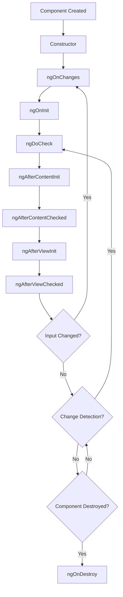

# 🔄 Angular Lifecycle Hooks & Change Detection Complete Guide

> **A comprehensive guide to Angular Lifecycle Hooks and Change Detection mechanisms comparing Angular 15 vs Angular 20 with practical examples, best practices, and performance optimization techniques.**

---

## 📖 Table of Contents

1. [🔰 Introduction](#introduction)
2. [🎯 Lifecycle Hooks Overview](#lifecycle-overview)
3. [🔄 Change Detection Fundamentals](#change-detection)
4. [📋 Angular 15 vs Angular 20 Comparison](#angular-comparison)
5. [🎭 Core Lifecycle Hooks](#core-hooks)
   - [ngOnChanges](#ng-on-changes)
   - [ngOnInit](#ng-on-init)
   - [ngDoCheck](#ng-do-check)
   - [ngAfterContentInit](#ng-after-content-init)
   - [ngAfterContentChecked](#ng-after-content-checked)
   - [ngAfterViewInit](#ng-after-view-init)
   - [ngAfterViewChecked](#ng-after-view-checked)
   - [ngOnDestroy](#ng-on-destroy)
6. [🆕 New Angular 20 Hooks](#new-hooks)
   - [ngAfterRender](#ng-after-render)
   - [ngAfterNextRender](#ng-after-next-render)
7. [🎨 Advanced Patterns](#advanced-patterns)
8. [⚡ Performance Optimization](#performance)
9. [🚦 Change Detection Strategies](#strategies)
10. [📝 Interview Questions](#interview)

---

## 🔰 Introduction {#introduction}

Angular components have a **lifecycle** managed by Angular itself. Angular creates, renders, creates and destroys children, checks for data-bound property changes, and destroys components before removing them from the DOM.

Think of lifecycle hooks like **events in a person's life**: birth (ngOnInit), growing up (ngAfterContentInit), becoming mature (ngAfterViewInit), and eventual passing (ngOnDestroy).

### **What Are Lifecycle Hooks?**

```typescript
// Lifecycle hooks are interfaces that components can implement
import {
  Component,
  OnInit,
  OnDestroy,
  AfterViewInit,
  OnChanges,
  SimpleChanges,
} from "@angular/core";

@Component({
  selector: "app-lifecycle-demo",
  template: `
    <div class="lifecycle-demo">
      <h3>Lifecycle Demo Component</h3>
      <p>Check console for lifecycle events!</p>
      <p>Current time: {{ currentTime }}</p>
    </div>
  `,
})
export class LifecycleDemoComponent
  implements OnInit, OnDestroy, AfterViewInit, OnChanges
{
  currentTime = new Date();
  private timer: any;

  constructor() {
    console.log("🏗️ Constructor called - Component instance created");
  }

  ngOnChanges(changes: SimpleChanges): void {
    console.log("🔄 ngOnChanges called - Input properties changed", changes);
  }

  ngOnInit(): void {
    console.log("🚀 ngOnInit called - Component initialized");
    this.timer = setInterval(() => {
      this.currentTime = new Date();
    }, 1000);
  }

  ngAfterViewInit(): void {
    console.log("👁️ ngAfterViewInit called - View initialized");
  }

  ngOnDestroy(): void {
    console.log("💥 ngOnDestroy called - Component destroyed");
    if (this.timer) {
      clearInterval(this.timer);
    }
  }
}
```

---

## 🎯 Lifecycle Hooks Overview {#lifecycle-overview}

### **📊 Hook Execution Order**



### **🕒 Complete Lifecycle Timeline**

```typescript
// Demonstration of full lifecycle execution order
@Component({
  selector: "app-lifecycle-order",
  template: `
    <div>
      <h3>Parent Component</h3>
      <input
        [(ngModel)]="parentMessage"
        placeholder="Change me to trigger ngOnChanges"
      />

      <!-- Child component will receive parentMessage as input -->
      <app-child [message]="parentMessage" [counter]="counter"></app-child>

      <button (click)="incrementCounter()">Increment Counter</button>
      <button (click)="destroyChild = true" *ngIf="!destroyChild">
        Destroy Child
      </button>
    </div>
  `,
})
export class LifecycleOrderComponent implements OnInit {
  parentMessage = "Hello from parent";
  counter = 0;
  destroyChild = false;

  constructor() {
    console.log("👨‍👩‍👧‍👦 PARENT: Constructor");
  }

  ngOnInit(): void {
    console.log("👨‍👩‍👧‍👦 PARENT: ngOnInit");
  }

  incrementCounter(): void {
    this.counter++;
    console.log("👨‍👩‍👧‍👦 PARENT: Counter incremented to", this.counter);
  }
}

@Component({
  selector: "app-child",
  template: `
    <div style="border: 2px solid blue; padding: 10px; margin: 10px;">
      <h4>Child Component</h4>
      <p>Message: {{ message }}</p>
      <p>Counter: {{ counter }}</p>
      <p>Internal state: {{ internalState }}</p>

      <ng-content></ng-content>

      <button (click)="changeInternalState()">Change Internal State</button>
    </div>
  `,
})
export class ChildComponent
  implements
    OnChanges,
    OnInit,
    DoCheck,
    AfterContentInit,
    AfterContentChecked,
    AfterViewInit,
    AfterViewChecked,
    OnDestroy
{
  @Input() message!: string;
  @Input() counter!: number;

  internalState = "initial";
  private changeDetectionCount = 0;

  constructor() {
    console.log("  🧒 CHILD: Constructor");
  }

  ngOnChanges(changes: SimpleChanges): void {
    console.log("  🧒 CHILD: ngOnChanges", changes);

    // Log specific changes
    if (changes["message"]) {
      console.log("    📝 Message changed:", {
        currentValue: changes["message"].currentValue,
        previousValue: changes["message"].previousValue,
        isFirstChange: changes["message"].firstChange,
      });
    }
  }

  ngOnInit(): void {
    console.log("  🧒 CHILD: ngOnInit");
  }

  ngDoCheck(): void {
    this.changeDetectionCount++;
    console.log(`  🧒 CHILD: ngDoCheck (${this.changeDetectionCount})`);
  }

  ngAfterContentInit(): void {
    console.log("  🧒 CHILD: ngAfterContentInit");
  }

  ngAfterContentChecked(): void {
    console.log("  🧒 CHILD: ngAfterContentChecked");
  }

  ngAfterViewInit(): void {
    console.log("  🧒 CHILD: ngAfterViewInit");
  }

  ngAfterViewChecked(): void {
    console.log("  🧒 CHILD: ngAfterViewChecked");
  }

  ngOnDestroy(): void {
    console.log("  🧒 CHILD: ngOnDestroy");
  }

  changeInternalState(): void {
    this.internalState = "changed-" + Date.now();
    console.log("  🧒 CHILD: Internal state changed to", this.internalState);
  }
}
```

---

## 🔄 Change Detection Fundamentals {#change-detection}

Change detection is Angular's mechanism to **sync the model state with the view**. Think of it as Angular's **automatic refresh system**.

### **🔍 How Change Detection Works**

```typescript
// Zone.js patches async operations to trigger change detection
class ChangeDetectionDemo {

  // 🎯 These operations trigger change detection automatically:
  demonstrateChangeDetectionTriggers(): void {

    // 1. DOM Events
    onClick() {
      this.counter++; // Will trigger change detection
      console.log('DOM event triggered change detection');
    }

    // 2. HTTP Requests
    this.http.get('/api/data').subscribe(data => {
      this.data = data; // Will trigger change detection
      console.log('HTTP response triggered change detection');
    });

    // 3. Timers
    setTimeout(() => {
      this.message = 'Updated after timeout'; // Will trigger change detection
      console.log('setTimeout triggered change detection');
    }, 1000);

    // 4. Promises
    Promise.resolve('async data').then(result => {
      this.asyncResult = result; // Will trigger change detection
      console.log('Promise resolved, triggered change detection');
    });
  }

  // 🚫 These operations do NOT trigger change detection:
  demonstrateNoChangeDetection(): void {

    // Direct property mutation outside Angular zone
    this.ngZone.runOutsideAngular(() => {
      setTimeout(() => {
        this.counter++; // Will NOT trigger change detection
        console.log('Outside Angular zone - no change detection');
      }, 1000);
    });

    // Direct DOM manipulation
    document.getElementById('myElement')!.innerHTML = 'Changed'; // No change detection

    // Third-party library callbacks (unless wrapped)
    someThirdPartyLibrary.onCallback(() => {
      this.data = 'new data'; // Might not trigger change detection
    });
  }

  // 🔧 Manual change detection triggering
  constructor(
    private cdr: ChangeDetectorRef,
    private ngZone: NgZone
  ) {}

  manualChangeDetection(): void {
    // Trigger change detection manually
    this.cdr.detectChanges(); // Check only this component
    this.cdr.markForCheck(); // Mark component to be checked in next cycle

    // Run inside Angular zone to trigger change detection
    this.ngZone.run(() => {
      this.counter++;
    });
  }
}
```

### **⚡ Change Detection Strategies**

```typescript
// OnPush Strategy - Performance optimization
@Component({
  selector: "app-optimized",
  changeDetection: ChangeDetectionStrategy.OnPush, // 🚀 Performance boost
  template: `
    <div>
      <h3>OnPush Component</h3>
      <p>Count: {{ count }}</p>
      <p>User: {{ user.name }}</p>
      <p>Last updated: {{ lastUpdated }}</p>

      <button (click)="increment()">Increment</button>
      <button (click)="updateUser()">Update User (Wrong Way)</button>
      <button (click)="updateUserCorrect()">Update User (Correct Way)</button>
    </div>
  `,
})
export class OptimizedComponent implements OnInit, OnChanges {
  @Input() count = 0;
  @Input() user = { name: "John", age: 30 };

  lastUpdated = new Date();

  constructor(private cdr: ChangeDetectorRef) {}

  ngOnChanges(changes: SimpleChanges): void {
    console.log("🔄 OnPush component - ngOnChanges triggered", changes);
    this.lastUpdated = new Date();
  }

  ngOnInit(): void {
    // Auto-update every 5 seconds to show OnPush behavior
    setInterval(() => {
      console.log("⏰ Timer tick - this will NOT update the view (OnPush)");
      // This won't update the view because:
      // 1. No input properties changed
      // 2. No events were triggered from this component
    }, 5000);
  }

  increment(): void {
    // ✅ This will work because it's a component event
    this.count++;
    console.log("🎯 Button clicked - view will update");
  }

  updateUser(): void {
    // ❌ This WON'T trigger change detection with OnPush
    this.user.name = "Jane";
    console.log("❌ User mutated directly - view will NOT update");
  }

  updateUserCorrect(): void {
    // ✅ This WILL trigger change detection
    this.user = { ...this.user, name: "Jane" };
    console.log("✅ User reference changed - view will update");

    // OR manually trigger change detection
    // this.cdr.detectChanges();
  }
}

// Default Strategy - Checks all the time
@Component({
  selector: "app-default",
  changeDetection: ChangeDetectionStrategy.Default, // 🐌 Default behavior
  template: `
    <div>
      <h3>Default Strategy Component</h3>
      <p>This component checks for changes constantly</p>
      <p>Current time: {{ currentTime | date : "HH:mm:ss.SSS" }}</p>
    </div>
  `,
})
export class DefaultComponent implements OnInit {
  currentTime = new Date();

  ngOnInit(): void {
    // This will update the view every second
    setInterval(() => {
      this.currentTime = new Date();
      console.log("⏰ Default strategy - view updates automatically");
    }, 1000);
  }
}
```

---

## 📋 Angular 15 vs Angular 20 Comparison {#angular-comparison}

### **🔄 Key Differences Overview**

| Feature                   | Angular 15                  | Angular 20                                            |
| ------------------------- | --------------------------- | ----------------------------------------------------- |
| **Change Detection**      | Zone.js based               | Zone.js + Signals hybrid                              |
| **New Hooks**             | 8 traditional hooks         | 10 hooks (added `ngAfterRender`, `ngAfterNextRender`) |
| **Performance**           | OnPush strategy recommended | Automatic optimizations with signals                  |
| **Standalone Components** | Experimental                | Stable and preferred                                  |
| **Bundle Size**           | Larger                      | ~20% smaller with new tree-shaking                    |

### **🆕 Angular 20 New Features**

```typescript
// Angular 20 - Enhanced component with new hooks and signals
@Component({
  selector: "app-angular20-demo",
  standalone: true, // 🆕 Standalone components are now default
  imports: [CommonModule],
  template: `
    <div>
      <h3>Angular 20 Component</h3>
      <p>Count: {{ count() }}</p>
      <p>Computed Double: {{ doubleCount() }}</p>
      <p>Effect ran {{ effectCount() }} times</p>

      <button (click)="increment()">Increment</button>

      <div #dynamicContent></div>
    </div>
  `,
})
export class Angular20DemoComponent
  implements OnInit, AfterViewInit, AfterRender, AfterNextRender, OnDestroy
{
  // 🆕 Signals for reactive state management
  count = signal(0);
  effectCount = signal(0);

  // 🆕 Computed signals for derived state
  doubleCount = computed(() => this.count() * 2);

  @ViewChild("dynamicContent", { static: false }) dynamicContent!: ElementRef;

  constructor() {
    console.log("🏗️ Angular 20: Constructor");

    // 🆕 Effects for reactive side effects
    effect(() => {
      const currentCount = this.count();
      console.log("📊 Effect: Count changed to", currentCount);
      this.effectCount.update((count) => count + 1);

      // Effect cleanup
      return () => {
        console.log("🧹 Effect cleanup for count", currentCount);
      };
    });
  }

  ngOnInit(): void {
    console.log("🚀 Angular 20: ngOnInit");
  }

  ngAfterViewInit(): void {
    console.log("👁️ Angular 20: ngAfterViewInit");
  }

  // 🆕 New Angular 20 hook
  ngAfterRender(): void {
    console.log("🎨 Angular 20: ngAfterRender - DOM updated");
    // Safe to access and manipulate DOM here
    if (this.dynamicContent) {
      this.dynamicContent.nativeElement.style.background = `hsl(${
        this.count() * 30
      }, 70%, 90%)`;
    }
  }

  // 🆕 New Angular 20 hook - runs only once after first render
  ngAfterNextRender(): void {
    console.log("🎯 Angular 20: ngAfterNextRender - First render complete");
    // One-time DOM setup operations
    if (this.dynamicContent) {
      this.dynamicContent.nativeElement.innerHTML =
        "<p>Dynamically added content after first render</p>";
    }
  }

  increment(): void {
    this.count.update((c) => c + 1);
  }

  ngOnDestroy(): void {
    console.log("💥 Angular 20: ngOnDestroy");
  }
}

// Angular 15 - Traditional approach
@Component({
  selector: "app-angular15-demo",
  template: `
    <div>
      <h3>Angular 15 Component</h3>
      <p>Count: {{ count }}</p>
      <p>Double: {{ doubleCount }}</p>

      <button (click)="increment()">Increment</button>

      <div #dynamicContent></div>
    </div>
  `,
})
export class Angular15DemoComponent
  implements OnInit, AfterViewInit, AfterViewChecked, OnDestroy
{
  count = 0;
  doubleCount = 0;
  private hasInitializedDOM = false;

  @ViewChild("dynamicContent", { static: false }) dynamicContent!: ElementRef;

  constructor() {
    console.log("🏗️ Angular 15: Constructor");
  }

  ngOnInit(): void {
    console.log("🚀 Angular 15: ngOnInit");
  }

  ngAfterViewInit(): void {
    console.log("👁️ Angular 15: ngAfterViewInit");
    // One-time DOM setup
    if (!this.hasInitializedDOM && this.dynamicContent) {
      this.dynamicContent.nativeElement.innerHTML =
        "<p>Dynamically added content in AfterViewInit</p>";
      this.hasInitializedDOM = true;
    }
  }

  ngAfterViewChecked(): void {
    console.log("🔍 Angular 15: ngAfterViewChecked - runs after every check");
    // ⚠️ Be careful here - this runs frequently!
    if (this.dynamicContent) {
      this.dynamicContent.nativeElement.style.background = `hsl(${
        this.count * 30
      }, 70%, 90%)`;
    }
  }

  increment(): void {
    this.count++;
    this.doubleCount = this.count * 2; // Manual calculation
  }

  ngOnDestroy(): void {
    console.log("💥 Angular 15: ngOnDestroy");
  }
}
```

---

## 🎭 Core Lifecycle Hooks {#core-hooks}

### 🔄 ngOnChanges {#ng-on-changes}

**Purpose**: Responds when Angular sets/resets data-bound input properties.

```typescript
@Component({
  selector: "app-user-profile",
  template: `
    <div class="profile-card">
      <h3>{{ user?.name }}</h3>
      <p>Age: {{ user?.age }}</p>
      <p>Role: {{ user?.role }}</p>

      <!-- Show change history -->
      <div class="change-log">
        <h4>Change History:</h4>
        <ul>
          <li *ngFor="let change of changeHistory">{{ change }}</li>
        </ul>
      </div>
    </div>
  `,
})
export class UserProfileComponent implements OnChanges {
  @Input() user?: User;
  @Input() theme?: string;
  @Input() permissions?: string[];

  changeHistory: string[] = [];

  ngOnChanges(changes: SimpleChanges): void {
    console.log("🔄 ngOnChanges triggered with changes:", changes);

    // Track all changes
    Object.keys(changes).forEach((key) => {
      const change = changes[key];
      const changeDetails = {
        property: key,
        currentValue: change.currentValue,
        previousValue: change.previousValue,
        isFirstChange: change.firstChange,
      };

      // Log specific property changes
      if (key === "user") {
        this.handleUserChange(change);
      } else if (key === "theme") {
        this.handleThemeChange(change);
      } else if (key === "permissions") {
        this.handlePermissionsChange(change);
      }

      // Add to history
      const historyEntry = `${new Date().toLocaleTimeString()}: ${key} changed from ${JSON.stringify(
        change.previousValue
      )} to ${JSON.stringify(change.currentValue)}`;
      this.changeHistory.unshift(historyEntry);

      // Keep only last 10 changes
      if (this.changeHistory.length > 10) {
        this.changeHistory.pop();
      }
    });
  }

  private handleUserChange(change: SimpleChange): void {
    if (change.firstChange) {
      console.log("👤 Initial user set:", change.currentValue);
    } else {
      console.log("👤 User updated:", {
        from: change.previousValue,
        to: change.currentValue,
      });

      // Detect specific field changes
      if (change.previousValue && change.currentValue) {
        const prev = change.previousValue;
        const curr = change.currentValue;

        if (prev.name !== curr.name) {
          console.log(`📝 Name changed: ${prev.name} → ${curr.name}`);
        }
        if (prev.age !== curr.age) {
          console.log(`🎂 Age changed: ${prev.age} → ${curr.age}`);
        }
        if (prev.role !== curr.role) {
          console.log(`💼 Role changed: ${prev.role} → ${curr.role}`);
        }
      }
    }
  }

  private handleThemeChange(change: SimpleChange): void {
    console.log("🎨 Theme change detected:", change);

    if (!change.firstChange) {
      // Apply theme transition animation
      this.animateThemeChange(change.previousValue, change.currentValue);
    }
  }

  private handlePermissionsChange(change: SimpleChange): void {
    console.log("🔐 Permissions change detected:", change);

    if (!change.firstChange) {
      const added =
        change.currentValue?.filter(
          (p) => !change.previousValue?.includes(p)
        ) || [];
      const removed =
        change.previousValue?.filter(
          (p) => !change.currentValue?.includes(p)
        ) || [];

      if (added.length > 0) {
        console.log("➕ Permissions added:", added);
      }
      if (removed.length > 0) {
        console.log("➖ Permissions removed:", removed);
      }
    }
  }

  private animateThemeChange(from: string, to: string): void {
    // Example theme transition logic
    console.log(`🎭 Transitioning theme: ${from} → ${to}`);
  }
}

// ✅ WHEN TO USE ngOnChanges:
// - Respond to input property changes
// - Validate input data
// - Trigger side effects when inputs change
// - Calculate derived values from inputs
// - Log/track input changes for debugging

// ❌ WHEN NOT TO USE ngOnChanges:
// - For internal component state changes
// - Heavy computations (use computed signals in Angular 20)
// - DOM manipulation (use ngAfterViewInit/ngAfterViewChecked)
// - Async operations (better in ngOnInit)
```

### 🚀 ngOnInit {#ng-on-init}

**Purpose**: Initialize the component after Angular first displays the data-bound properties.

```typescript
@Component({
  selector: "app-dashboard",
  template: `
    <div class="dashboard">
      <h2>User Dashboard</h2>

      <!-- Loading states -->
      <div *ngIf="isLoadingUser" class="loading">Loading user...</div>
      <div *ngIf="isLoadingPreferences" class="loading">
        Loading preferences...
      </div>
      <div *ngIf="isLoadingData" class="loading">Loading dashboard data...</div>

      <!-- Content -->
      <div *ngIf="user" class="user-info">
        <h3>Welcome, {{ user.name }}!</h3>
        <p>Last login: {{ user.lastLogin | date }}</p>
      </div>

      <div *ngIf="preferences" class="preferences">
        <h4>Your Preferences</h4>
        <ul>
          <li *ngFor="let pref of preferences">
            {{ pref.key }}: {{ pref.value }}
          </li>
        </ul>
      </div>

      <div *ngIf="dashboardData" class="data">
        <h4>Dashboard Data</h4>
        <div class="metrics">
          <div class="metric" *ngFor="let metric of dashboardData.metrics">
            <span class="label">{{ metric.label }}</span>
            <span class="value">{{ metric.value }}</span>
          </div>
        </div>
      </div>
    </div>
  `,
})
export class DashboardComponent implements OnInit, OnDestroy {
  @Input() userId?: string;

  user?: User;
  preferences?: UserPreference[];
  dashboardData?: DashboardData;

  isLoadingUser = false;
  isLoadingPreferences = false;
  isLoadingData = false;

  private destroy$ = new Subject<void>();
  private dataRefreshInterval?: any;

  constructor(
    private userService: UserService,
    private preferencesService: PreferencesService,
    private dashboardService: DashboardService,
    private notificationService: NotificationService
  ) {
    console.log("🏗️ Dashboard constructor - component instance created");
    // ✅ DO in constructor:
    // - Dependency injection
    // - Simple property initialization
    // - Subscribe to route parameters

    // ❌ DON'T in constructor:
    // - API calls
    // - Complex initialization
    // - DOM access
  }

  ngOnInit(): void {
    console.log("🚀 ngOnInit - component initialization started");

    // 1. Initialize component state
    this.initializeComponent();

    // 2. Set up data loading
    this.loadUserData();

    // 3. Set up subscriptions
    this.setupSubscriptions();

    // 4. Start background tasks
    this.startDataRefresh();
  }

  private initializeComponent(): void {
    console.log("⚙️ Initializing component state");

    // Set initial loading states
    this.isLoadingUser = true;
    this.isLoadingPreferences = true;
    this.isLoadingData = true;

    // Validate required inputs
    if (!this.userId) {
      console.error("❌ userId is required but not provided");
      this.notificationService.showError("User ID is required");
      return;
    }
  }

  private loadUserData(): void {
    console.log("📥 Loading user data");

    // Load user information
    this.userService
      .getUser(this.userId!)
      .pipe(
        takeUntil(this.destroy$),
        finalize(() => (this.isLoadingUser = false))
      )
      .subscribe({
        next: (user) => {
          console.log("👤 User data loaded:", user);
          this.user = user;

          // After user is loaded, load dependent data
          this.loadUserPreferences();
        },
        error: (error) => {
          console.error("❌ Failed to load user:", error);
          this.notificationService.showError("Failed to load user information");
        },
      });
  }

  private loadUserPreferences(): void {
    if (!this.user) return;

    console.log("⚙️ Loading user preferences");

    this.preferencesService
      .getUserPreferences(this.user.id)
      .pipe(
        takeUntil(this.destroy$),
        finalize(() => (this.isLoadingPreferences = false))
      )
      .subscribe({
        next: (preferences) => {
          console.log("⚙️ Preferences loaded:", preferences);
          this.preferences = preferences;

          // After preferences are loaded, load dashboard data
          this.loadDashboardData();
        },
        error: (error) => {
          console.error("❌ Failed to load preferences:", error);
          // Don't show error for preferences - they're optional
          this.loadDashboardData(); // Continue with dashboard loading
        },
      });
  }

  private loadDashboardData(): void {
    if (!this.user) return;

    console.log("📊 Loading dashboard data");

    const loadOptions = {
      userId: this.user.id,
      includeMetrics: true,
      includeRecentActivity: true,
      dateRange:
        this.preferences?.find((p) => p.key === "dateRange")?.value || "30days",
    };

    this.dashboardService
      .getDashboardData(loadOptions)
      .pipe(
        takeUntil(this.destroy$),
        finalize(() => (this.isLoadingData = false))
      )
      .subscribe({
        next: (data) => {
          console.log("📊 Dashboard data loaded:", data);
          this.dashboardData = data;
        },
        error: (error) => {
          console.error("❌ Failed to load dashboard data:", error);
          this.notificationService.showError("Failed to load dashboard data");
        },
      });
  }

  private setupSubscriptions(): void {
    console.log("📡 Setting up component subscriptions");

    // Listen for user preference changes
    this.preferencesService
      .onPreferenceChanged()
      .pipe(takeUntil(this.destroy$))
      .subscribe((changedPreference) => {
        console.log("⚙️ Preference changed:", changedPreference);
        this.handlePreferenceChange(changedPreference);
      });

    // Listen for notification events
    this.notificationService
      .onNotification()
      .pipe(takeUntil(this.destroy$))
      .subscribe((notification) => {
        console.log("🔔 Notification received:", notification);
        this.handleNotification(notification);
      });
  }

  private startDataRefresh(): void {
    console.log("🔄 Starting auto-refresh timer");

    // Refresh dashboard data every 5 minutes
    this.dataRefreshInterval = setInterval(() => {
      if (this.user && !this.isLoadingData) {
        console.log("🔄 Auto-refreshing dashboard data");
        this.loadDashboardData();
      }
    }, 5 * 60 * 1000); // 5 minutes
  }

  private handlePreferenceChange(preference: UserPreference): void {
    // Handle specific preference changes
    if (preference.key === "theme") {
      console.log("🎨 Theme preference changed:", preference.value);
      // Apply theme change
    } else if (preference.key === "dateRange") {
      console.log("📅 Date range preference changed:", preference.value);
      // Reload dashboard data with new date range
      this.loadDashboardData();
    }
  }

  private handleNotification(notification: Notification): void {
    // Handle different notification types
    if (
      notification.type === "user-update" &&
      notification.userId === this.user?.id
    ) {
      console.log("👤 User data changed, reloading...");
      this.loadUserData();
    }
  }

  ngOnDestroy(): void {
    console.log("💥 ngOnDestroy - cleaning up dashboard component");

    // Stop subscriptions
    this.destroy$.next();
    this.destroy$.complete();

    // Clear intervals
    if (this.dataRefreshInterval) {
      clearInterval(this.dataRefreshInterval);
    }
  }
}

// ✅ WHEN TO USE ngOnInit:
// - Initialize component after inputs are set
// - Make API calls
// - Set up subscriptions
// - Complex initialization logic
// - Start timers or intervals

// ❌ WHEN NOT TO USE ngOnInit:
// - Simple property initialization (use constructor)
// - DOM manipulation (use ngAfterViewInit)
// - Operations that depend on child components (use ngAfterContentInit)
```

### 🔍 ngDoCheck {#ng-do-check}

**Purpose**: Detect and act upon changes that Angular can't detect on its own.

```typescript
@Component({
  selector: "app-custom-change-detection",
  template: `
    <div class="change-detector">
      <h3>Custom Change Detection Demo</h3>

      <div class="controls">
        <button (click)="addItem()">Add Item</button>
        <button (click)="updateFirstItem()">Update First Item</button>
        <button (click)="sortItems()">Sort Items</button>
        <input [(ngModel)]="newItemName" placeholder="New item name" />
      </div>

      <div class="stats">
        <p>ngDoCheck called: {{ doCheckCount }} times</p>
        <p>Array reference changed: {{ arrayReferenceChanges }} times</p>
        <p>Array content changed: {{ arrayContentChanges }} times</p>
      </div>

      <div class="items">
        <h4>Items ({{ items.length }}):</h4>
        <ul>
          <li *ngFor="let item of items; trackBy: trackByFn">
            {{ item.name }} (ID: {{ item.id }}) - Updated:
            {{ item.lastUpdated | date : "HH:mm:ss" }}
          </li>
        </ul>
      </div>

      <div class="deep-object">
        <h4>Deep Object Monitoring:</h4>
        <p>User: {{ user.name }} ({{ user.profile.role }})</p>
        <p>Preferences changed: {{ userPreferencesChanges }} times</p>
        <button (click)="updateUserProfile()">Update User Profile</button>
        <button (click)="addUserPreference()">Add Preference</button>
      </div>
    </div>
  `,
})
export class CustomChangeDetectionComponent
  implements OnInit, DoCheck, OnDestroy
{
  items: Item[] = [];
  newItemName = "";

  user = {
    name: "John Doe",
    profile: {
      role: "developer",
      department: "engineering",
    },
    preferences: new Map<string, any>([
      ["theme", "dark"],
      ["language", "en"],
    ]),
  };

  // Change detection counters
  doCheckCount = 0;
  arrayReferenceChanges = 0;
  arrayContentChanges = 0;
  userPreferencesChanges = 0;

  // Previous state tracking for custom change detection
  private previousItemsLength = 0;
  private previousItemsJson = "";
  private previousUserPreferencesSize = 0;
  private previousUserPreferencesString = "";

  constructor() {
    console.log("🏗️ Constructor - initializing change detector");
  }

  ngOnInit(): void {
    console.log("🚀 ngOnInit");

    // Initialize with some sample data
    this.items = [
      { id: 1, name: "Item 1", lastUpdated: new Date() },
      { id: 2, name: "Item 2", lastUpdated: new Date() },
      { id: 3, name: "Item 3", lastUpdated: new Date() },
    ];

    // Set initial state for change detection
    this.updatePreviousState();
  }

  ngDoCheck(): void {
    this.doCheckCount++;
    console.log(`🔍 ngDoCheck called (${this.doCheckCount})`);

    // 1. Detect array reference changes
    this.detectArrayReferenceChange();

    // 2. Detect array content changes (even with same reference)
    this.detectArrayContentChange();

    // 3. Detect deep object changes (Map, nested objects)
    this.detectUserPreferencesChange();

    // 4. Update previous state for next check
    this.updatePreviousState();
  }

  private detectArrayReferenceChange(): void {
    const currentLength = this.items.length;

    if (currentLength !== this.previousItemsLength) {
      this.arrayReferenceChanges++;
      console.log("📊 Array length changed:", {
        from: this.previousItemsLength,
        to: currentLength,
        changeNumber: this.arrayReferenceChanges,
      });
    }
  }

  private detectArrayContentChange(): void {
    const currentItemsJson = JSON.stringify(
      this.items.map((item) => ({
        id: item.id,
        name: item.name,
        // Exclude lastUpdated to focus on meaningful changes
      }))
    );

    if (currentItemsJson !== this.previousItemsJson) {
      this.arrayContentChanges++;
      console.log("📝 Array content changed:", {
        changeNumber: this.arrayContentChanges,
        previousState: this.previousItemsJson,
        currentState: currentItemsJson,
      });
    }
  }

  private detectUserPreferencesChange(): void {
    const currentPreferencesSize = this.user.preferences.size;
    const currentPreferencesString = JSON.stringify([...this.user.preferences]);

    if (
      currentPreferencesSize !== this.previousUserPreferencesSize ||
      currentPreferencesString !== this.previousUserPreferencesString
    ) {
      this.userPreferencesChanges++;
      console.log("⚙️ User preferences changed:", {
        changeNumber: this.userPreferencesChanges,
        sizeChanged:
          currentPreferencesSize !== this.previousUserPreferencesSize,
        contentChanged:
          currentPreferencesString !== this.previousUserPreferencesString,
        newPreferences: [...this.user.preferences],
      });
    }
  }

  private updatePreviousState(): void {
    this.previousItemsLength = this.items.length;
    this.previousItemsJson = JSON.stringify(
      this.items.map((item) => ({
        id: item.id,
        name: item.name,
      }))
    );
    this.previousUserPreferencesSize = this.user.preferences.size;
    this.previousUserPreferencesString = JSON.stringify([
      ...this.user.preferences,
    ]);
  }

  // Component methods that trigger different types of changes
  addItem(): void {
    const newId = Math.max(...this.items.map((i) => i.id), 0) + 1;
    const newItem: Item = {
      id: newId,
      name: this.newItemName || `Item ${newId}`,
      lastUpdated: new Date(),
    };

    // This creates a new array reference
    this.items = [...this.items, newItem];
    this.newItemName = "";
    console.log("➕ Added new item (new array reference):", newItem);
  }

  updateFirstItem(): void {
    if (this.items.length > 0) {
      // This mutates the existing array (same reference)
      this.items[0] = {
        ...this.items[0],
        name: `${this.items[0].name} (updated)`,
        lastUpdated: new Date(),
      };
      console.log("📝 Updated first item (same array reference)");
    }
  }

  sortItems(): void {
    // This mutates the array in place (same reference)
    this.items.sort((a, b) => a.name.localeCompare(b.name));
    console.log("📊 Sorted items (same array reference)");
  }

  updateUserProfile(): void {
    // Deep object mutation
    this.user.profile.role =
      this.user.profile.role === "developer" ? "senior developer" : "developer";
    console.log("👤 Updated user profile (object mutation)");
  }

  addUserPreference(): void {
    // Map mutation - adds new preference
    const preferenceKeys = [
      "notifications",
      "autoSave",
      "darkMode",
      "language",
    ];
    const availableKeys = preferenceKeys.filter(
      (key) => !this.user.preferences.has(key)
    );

    if (availableKeys.length > 0) {
      const randomKey =
        availableKeys[Math.floor(Math.random() * availableKeys.length)];
      this.user.preferences.set(randomKey, Math.random() > 0.5);
      console.log("⚙️ Added user preference (Map mutation):", randomKey);
    }
  }

  trackByFn(index: number, item: Item): number {
    return item.id; // Track by ID for performance
  }

  ngOnDestroy(): void {
    console.log("💥 ngOnDestroy - cleaning up custom change detector");
  }
}

interface Item {
  id: number;
  name: string;
  lastUpdated: Date;
}

// ✅ WHEN TO USE ngDoCheck:
// - Detect changes in mutable objects/arrays
// - Monitor complex data structures (Maps, Sets)
// - Implement custom change detection logic
// - Debug change detection issues
// - Optimize performance with OnPush strategy

// ❌ WHEN NOT TO USE ngDoCheck:
// - Simple property changes (use ngOnChanges)
// - Performance-critical apps (it runs frequently)
// - Most common scenarios (default change detection works)
// - Complex calculations (move to computed properties/signals)

// ⚠️ PERFORMANCE WARNING:
// ngDoCheck runs on every change detection cycle!
// Keep the logic lightweight and efficient.
```

### 📦 ngAfterContentInit {#ng-after-content-init}

**Purpose**: Respond after Angular projects external content into the component's view.

````typescript
// Parent component that uses content projection
@Component({
  selector: 'app-card-container',
  template: `
    <div class="card-container">
      <h3>Card Container</h3>

      <!-- Content projection slots -->
      <div class="card-header">
        <ng-content select="[slot=header]"></ng-content>
      </div>

      <div class="card-body">
        <ng-content></ng-content>
      </div>

      <div class="card-footer">
        <ng-content select="[slot=footer]"></ng-content>
      </div>

      <!-- Dynamic content info -->
      <div class="content-info">
        <p>Projected content elements: {{ contentElementsCount }}</p>
        <p>Header content: {{ hasHeaderContent ? '✅' : '❌' }}</p>
        <p>Footer content: {{ hasFooterContent ? '✅' : '❌' }}</p>
        <p>Default content: {{ hasDefaultContent ? '✅' : '❌' }}</p>
      </div>
    </div>
  `
})
export class CardContainerComponent implements AfterContentInit, AfterContentChecked, OnDestroy {

  // Query projected content
  @ContentChild('headerRef', { static: false }) headerContent?: ElementRef;
  @ContentChild('footerRef', { static: false }) footerContent?: ElementRef;
  @ContentChildren('contentItem') contentItems?: QueryList<ElementRef>;

  // Content state tracking
  contentElementsCount = 0;
  hasHeaderContent = false;
  hasFooterContent = false;
  hasDefaultContent = false;

  private contentCheckCount = 0;

  constructor() {
    console.log('🏗️ CardContainer: Constructor');
  }

  ngAfterContentInit(): void {
    console.log('📦 ngAfterContentInit - projected content initialized');

    // Content is now available for the first time
    this.analyzeProjectedContent();
    this.setupContentObservers();
    this.initializeContentInteraction();
  }

  ngAfterContentChecked(): void {
    this.contentCheckCount++;
    console.log(`🔍 ngAfterContentChecked (${this.contentCheckCount}) - content checked`);

    // Re-analyze content on each check (content might have changed)
    this.analyzeProjectedContent();

    // ⚠️ Be careful with expensive operations here!
    if (this.contentCheckCount % 10 === 0) {
      console.log('📊 Content check milestone:', this.contentCheckCount);
    }
  }

  private analyzeProjectedContent(): void {
    // Check header content
    this.hasHeaderContent = !!this.headerContent?.nativeElement?.textContent?.trim();

    // Check footer content
    this.hasFooterContent = !!this.footerContent?.nativeElement?.textContent?.trim();

    // Count content items
    this.contentElementsCount = this.contentItems?.length || 0;

    // Check for default content (more complex check needed in real scenario)
    this.hasDefaultContent = this.contentElementsCount > 0;

    console.log('📊 Content analysis:', {
      headerContent: this.hasHeaderContent,
      footerContent: this.hasFooterContent,
      defaultContent: this.hasDefaultContent,
      elementsCount: this.contentElementsCount
    });
  }

  private setupContentObservers(): void {
    // Watch for changes in content items
    if (this.contentItems) {
      this.contentItems.changes.subscribe(() => {
        console.log('📦 Content items changed:', this.contentItems?.length);
        this.analyzeProjectedContent();
      });
    }
  }

  private initializeContentInteraction(): void {
    // Add event listeners or modify projected content
    if (this.headerContent) {
      const headerElement = this.headerContent.nativeElement;
      headerElement.addEventListener('click', this.onHeaderClick.bind(this));
      console.log('🖱️ Header click listener added');
    }

    if (this.footerContent) {
      const footerElement = this.footerContent.nativeElement;
      footerElement.classList.add('interactive-footer');
      console.log('🎨 Footer styling applied');
    }

    // Process all content items
    this.contentItems?.forEach((item, index) => {
      const element = item.nativeElement;
      element.setAttribute('data-item-index', index.toString());
      element.classList.add('processed-content-item');
      console.log(`🏷️ Content item ${index} processed`);
    });
  }

  private onHeaderClick(event: Event): void {
    console.log('🖱️ Header clicked:', event);
    // Handle header interaction
  }

  ngOnDestroy(): void {
    console.log('💥 CardContainer: ngOnDestroy');

    // Clean up event listeners
    if (this.headerContent) {
      this.headerContent.nativeElement.removeEventListener('click', this.onHeaderClick);
    }
  }
}

// Usage example
@Component({
  selector: 'app-card-demo',
  template: `
    <app-card-container>
      <!-- Header content -->
      <div slot="header" #headerRef>
        <h4>Card Title</h4>
        <span class="badge">New</span>
      </div>

      <!-- Default content -->
      <div #contentItem>
        <p>This is the main content of the card.</p>
        <p>It can contain multiple paragraphs.</p>
      </div>

      <div #contentItem>
        <button>Action Button</button>
      </div>

      <!-- Footer content -->
      <div slot="footer" #footerRef>
        <small>Last updated: {{ currentDate | date }}</small>
      </div>
    </app-card-container>
  `
})
export class CardDemoComponent {
  currentDate = new Date();
}

// Advanced content projection with conditional content
@Component({
  selector: 'app-advanced-projection',
  template: `
    <div class="advanced-container">
      <h3>Advanced Content Projection</h3>

      <!-- Conditional content rendering -->
      <div class="dynamic-sections">
        <div class="section" *ngIf="hasTitleContent">
          <ng-content select="[slot=title]"></ng-content>
        </div>

        <div class="section" *ngIf="hasActionsContent">
          <ng-content select="[slot=actions]"></ng-content>
        </div>

        <div class="section main-content">
          <ng-content></ng-content>
        </div>

        <div class="section" *ngIf="hasMetadataContent">
          <ng-content select="[slot=metadata]"></ng-content>
        </div>
      </div>

      <!-- Content statistics -->
      <div class="stats">
        <h4>Content Statistics:</h4>
        <ul>
          <li>Title content: {{ hasTitleContent ? '✅' : '❌' }}</li>
          <li>Actions content: {{ hasActionsContent ? '✅' : '❌' }}</li>
          <li>Main content elements: {{ mainContentCount }}</li>
          <li>Metadata content: {{ hasMetadataContent ? '✅' : '❌' }}</li>
          <li>Total content checks: {{ contentCheckCount }}</li>
        </ul>
      </div>
    </div>
  `
})
export class AdvancedProjectionComponent implements AfterContentInit, AfterContentChecked {

  @ContentChild('titleContent', { static: false }) titleContent?: ElementRef;
  @ContentChild('actionsContent', { static: false }) actionsContent?: ElementRef;
  @ContentChild('metadataContent', { static: false }) metadataContent?: ElementRef;
  @ContentChildren('mainContentItem') mainContentItems?: QueryList<ElementRef>;

  hasTitleContent = false;
  hasActionsContent = false;
  hasMetadataContent = false;
  mainContentCount = 0;
  contentCheckCount = 0;

  ngAfterContentInit(): void {
    console.log('📦 Advanced projection: ngAfterContentInit');
    this.updateContentState();
    this.processProjectedContent();
  }

  ngAfterContentChecked(): void {
    this.contentCheckCount++;
    this.updateContentState();
  }

  private updateContentState(): void {
    this.hasTitleContent = this.hasContentInElement(this.titleContent);
    this.hasActionsContent = this.hasContentInElement(this.actionsContent);
    this.hasMetadataContent = this.hasContentInElement(this.metadataContent);
    this.mainContentCount = this.mainContentItems?.length || 0;
  }

  private hasContentInElement(elementRef?: ElementRef): boolean {
    return !!elementRef?.nativeElement?.textContent?.trim() ||
           !!elementRef?.nativeElement?.children?.length;
  }

  private processProjectedContent(): void {
    // Add custom processing to projected content
    console.log('🔧 Processing projected content...');

    // Process title content
    if (this.titleContent) {
      const titleEl = this.titleContent.nativeElement;
      titleEl.classList.add('processed-title');
      console.log('📝 Title content processed');
    }

    // Process actions content
    if (this.actionsContent) {
      const actionsEl = this.actionsContent.nativeElement;
      const buttons = actionsEl.querySelectorAll('button');
      buttons.forEach((button: HTMLButtonElement, index: number) => {
        button.setAttribute('data-action-index', index.toString());
        console.log(`🔘 Action button ${index} processed`);
      });
    }

    // Process main content items
    this.mainContentItems?.forEach((item, index) => {
      const element = item.nativeElement;
      element.setAttribute('data-main-content-index', index.toString());
      element.classList.add('processed-main-content');
    });
  }
}

// ✅ WHEN TO USE ngAfterContentInit:
// - Process projected content (ng-content)
// - Set up content-based functionality
// - Initialize content queries (@ContentChild, @ContentChildren)
// - Add event listeners to projected elements
// - Validate projected content structure

### 🔍 ngAfterContentChecked {#ng-after-content-checked}

**Purpose**: Respond after Angular checks the projected content.

```typescript
@Component({
  selector: 'app-content-monitor',
  template: `
    <div class="content-monitor">
      <h3>Content Change Monitor</h3>

      <div class="controls">
        <button (click)="toggleContentVisibility()">
          {{ showContent ? 'Hide' : 'Show' }} Content
        </button>
        <button (click)="addContentItem()">Add Content Item</button>
        <button (click)="updateContentText()">Update Content Text</button>
      </div>

      <div class="statistics">
        <p>Content checked: {{ contentCheckedCount }} times</p>
        <p>Content changes detected: {{ contentChangesCount }}</p>
        <p>Last change: {{ lastChangeTime | date:'HH:mm:ss.SSS' }}</p>
      </div>

      <!-- Content projection area -->
      <div class="content-area">
        <ng-content *ngIf="showContent"></ng-content>
      </div>

      <!-- Dynamic content -->
      <div class="dynamic-content">
        <div *ngFor="let item of dynamicItems; trackBy: trackByFn" class="dynamic-item">
          {{ item.text }} ({{ item.timestamp | date:'HH:mm:ss' }})
        </div>
      </div>
    </div>
  `
})
export class ContentMonitorComponent implements AfterContentInit, AfterContentChecked, OnDestroy {

  @ContentChildren('monitoredContent') monitoredContent?: QueryList<ElementRef>;

  showContent = true;
  contentCheckedCount = 0;
  contentChangesCount = 0;
  lastChangeTime = new Date();

  dynamicItems: Array<{ id: number, text: string, timestamp: Date }> = [];

  private previousContentCount = 0;
  private previousContentHash = '';

  ngAfterContentInit(): void {
    console.log('📦 ngAfterContentInit - monitoring content changes');
    this.initializeContentMonitoring();
  }

  ngAfterContentChecked(): void {
    this.contentCheckedCount++;

    // Check for content changes
    const currentContentCount = this.monitoredContent?.length || 0;
    const currentContentHash = this.generateContentHash();

    if (currentContentCount !== this.previousContentCount ||
        currentContentHash !== this.previousContentHash) {

      this.contentChangesCount++;
      this.lastChangeTime = new Date();

      console.log('📦 Content change detected:', {
        previousCount: this.previousContentCount,
        currentCount: currentContentCount,
        previousHash: this.previousContentHash,
        currentHash: currentContentHash,
        changeNumber: this.contentChangesCount
      });

      this.handleContentChange();
    }

    // Update tracking variables
    this.previousContentCount = currentContentCount;
    this.previousContentHash = currentContentHash;

    // Log periodic status (avoid console spam)
    if (this.contentCheckedCount % 50 === 0) {
      console.log(`📊 Content checked ${this.contentCheckedCount} times, ${this.contentChangesCount} changes detected`);
    }
  }

  private initializeContentMonitoring(): void {
    // Set up initial state
    this.previousContentCount = this.monitoredContent?.length || 0;
    this.previousContentHash = this.generateContentHash();

    console.log('🔧 Content monitoring initialized:', {
      initialCount: this.previousContentCount,
      initialHash: this.previousContentHash
    });
  }

  private generateContentHash(): string {
    if (!this.monitoredContent) return '';

    return this.monitoredContent
      .map(contentRef => contentRef.nativeElement.textContent || '')
      .join('|');
  }

  private handleContentChange(): void {
    console.log('🔄 Handling content change...');

    // Process each content element
    this.monitoredContent?.forEach((contentRef, index) => {
      const element = contentRef.nativeElement;

      // Add change indicator
      element.classList.add('content-changed');

      // Remove indicator after animation
      setTimeout(() => {
        element.classList.remove('content-changed');
      }, 1000);

      // Add data attributes
      element.setAttribute('data-change-count', this.contentChangesCount.toString());
      element.setAttribute('data-last-check', this.contentCheckedCount.toString());

      console.log(`📝 Content element ${index} processed for change ${this.contentChangesCount}`);
    });
  }

  // Component interaction methods
  toggleContentVisibility(): void {
    this.showContent = !this.showContent;
    console.log('👁️ Content visibility toggled:', this.showContent);
  }

  addContentItem(): void {
    const newItem = {
      id: Date.now(),
      text: `Dynamic item ${this.dynamicItems.length + 1}`,
      timestamp: new Date()
    };
    this.dynamicItems.push(newItem);
    console.log('➕ Added dynamic content item:', newItem);
  }

  updateContentText(): void {
    if (this.monitoredContent && this.monitoredContent.length > 0) {
      const randomIndex = Math.floor(Math.random() * this.monitoredContent.length);
      const element = this.monitoredContent.toArray()[randomIndex].nativeElement;
      element.textContent = `Updated content ${Date.now()}`;
      console.log('📝 Updated content text at index:', randomIndex);
    }
  }

  trackByFn(index: number, item: any): number {
    return item.id;
  }

  ngOnDestroy(): void {
    console.log('💥 Content monitor destroyed');
  }
}

// ⚠️ PERFORMANCE CONSIDERATIONS for ngAfterContentChecked:
// This hook runs after EVERY change detection cycle!

@Component({
  selector: 'app-performance-aware-content',
  template: `
    <div class="performance-demo">
      <h4>Performance-Aware Content Checking</h4>

      <div class="metrics">
        <p>Efficient checks: {{ efficientCheckCount }}</p>
        <p>Expensive checks skipped: {{ expensiveChecksSkipped }}</p>
        <p>Performance ratio: {{ performanceRatio | percent }}</p>
      </div>

      <ng-content></ng-content>
    </div>
  `
})
export class PerformanceAwareContentComponent implements AfterContentChecked {

  @ContentChildren('expensiveContent') expensiveContent?: QueryList<ElementRef>;

  efficientCheckCount = 0;
  expensiveChecksSkipped = 0;

  private lastExpensiveCheck = 0;
  private expensiveCheckThreshold = 100; // Only run expensive checks every 100ms

  get performanceRatio(): number {
    const total = this.efficientCheckCount + this.expensiveChecksSkipped;
    return total > 0 ? this.efficientCheckCount / total : 0;
  }

  ngAfterContentChecked(): void {
    const now = Date.now();

    // Always do lightweight checks
    this.doEfficientContentCheck();

    // Only do expensive checks if enough time has passed
    if (now - this.lastExpensiveCheck > this.expensiveCheckThreshold) {
      this.doExpensiveContentCheck();
      this.lastExpensiveCheck = now;
    } else {
      this.expensiveChecksSkipped++;
    }
  }

  private doEfficientContentCheck(): void {
    this.efficientCheckCount++;

    // Lightweight operations only
    if (this.expensiveContent) {
      // Quick count check
      const contentCount = this.expensiveContent.length;

      // Simple validation
      if (contentCount > 10) {
        console.warn('⚠️ High content count detected:', contentCount);
      }
    }
  }

  private doExpensiveContentCheck(): void {
    console.log('🔍 Performing expensive content check...');

    // Expensive operations here (DOM measurements, complex calculations)
    this.expensiveContent?.forEach((contentRef, index) => {
      const element = contentRef.nativeElement;

      // Expensive DOM measurements
      const rect = element.getBoundingClientRect();
      const computedStyle = window.getComputedStyle(element);

      // Store measurements for later use
      element.setAttribute('data-width', rect.width.toString());
      element.setAttribute('data-height', rect.height.toString());
      element.setAttribute('data-visible', rect.width > 0 && rect.height > 0 ? 'true' : 'false');
    });
  }
}
````

### 👁️ ngAfterViewInit {#ng-after-view-init}

**Purpose**: Respond after Angular initializes the component's views and child views.

````typescript
@Component({
  selector: 'app-view-initialization',
  template: `
    <div class="view-demo">
      <h3>View Initialization Demo</h3>

      <div class="controls">
        <button (click)="focusInput()">Focus Input</button>
        <button (click)="scrollToBottom()">Scroll to Bottom</button>
        <button (click)="measureElements()">Measure Elements</button>
        <button (click)="initializeChart()">Initialize Chart</button>
      </div>

      <div class="form-section">
        <label for="userInput">User Input:</label>
        <input #userInput id="userInput" type="text" placeholder="Type here...">
        <div #inputInfo class="input-info"></div>
      </div>

      <div class="content-section" #contentSection>
        <h4>Content Section</h4>
        <div *ngFor="let item of items; let i = index" class="content-item">
          <span>Item {{ i + 1 }}: {{ item }}</span>
        </div>
      </div>

      <div class="chart-container">
        <canvas #chartCanvas width="400" height="200"></canvas>
        <div #chartLegend class="chart-legend"></div>
      </div>

      <div class="measurements" #measurementsDiv>
        <h4>Element Measurements</h4>
        <div class="measurement-grid">
          <div class="measurement-item" *ngFor="let measurement of measurements">
            <strong>{{ measurement.element }}:</strong>
            <span>{{ measurement.width }}x{{ measurement.height }}px</span>
          </div>
        </div>
      </div>

      <div class="scroll-area" #scrollArea>
        <div *ngFor="let i of scrollItems" class="scroll-item">
          Scroll item {{ i }}
        </div>
      </div>
    </div>
  `
})
export class ViewInitializationComponent implements AfterViewInit, AfterViewChecked, OnDestroy {

  // ViewChild queries - access to view elements
  @ViewChild('userInput', { static: false }) userInput?: ElementRef<HTMLInputElement>;
  @ViewChild('inputInfo', { static: false }) inputInfo?: ElementRef<HTMLDivElement>;
  @ViewChild('contentSection', { static: false }) contentSection?: ElementRef;
  @ViewChild('chartCanvas', { static: false }) chartCanvas?: ElementRef<HTMLCanvasElement>;
  @ViewChild('chartLegend', { static: false }) chartLegend?: ElementRef;
  @ViewChild('measurementsDiv', { static: false }) measurementsDiv?: ElementRef;
  @ViewChild('scrollArea', { static: false }) scrollArea?: ElementRef;

  // ViewChildren queries - access to multiple elements
  @ViewChildren('dynamicElement') dynamicElements?: QueryList<ElementRef>;

  items = ['Apple', 'Banana', 'Cherry', 'Date', 'Elderberry'];
  scrollItems = Array.from({ length: 50 }, (_, i) => i + 1);
  measurements: Array<{ element: string, width: number, height: number }> = [];

  private resizeObserver?: ResizeObserver;
  private intersectionObserver?: IntersectionObserver;
  private chart?: any; // Chart.js instance

  constructor() {
    console.log('🏗️ ViewInit: Constructor');
  }

  ngAfterViewInit(): void {
    console.log('👁️ ngAfterViewInit - view initialized');

    // Now all @ViewChild and @ViewChildren queries are available
    this.initializeViewElements();
    this.setupDOMInteractions();
    this.initializeThirdPartyLibraries();
    this.setupObservers();
    this.performInitialMeasurements();
  }

  ngAfterViewChecked(): void {
    // ⚠️ This runs after every change detection cycle
    // Keep operations lightweight!

    // Check if critical elements are still available
    this.validateCriticalElements();
  }

  private initializeViewElements(): void {
    console.log('🔧 Initializing view elements...');

    // Configure input element
    if (this.userInput) {
      const inputEl = this.userInput.nativeElement;
      inputEl.focus();
      inputEl.placeholder = 'Ready for input!';

      // Add event listeners
      inputEl.addEventListener('input', this.onInputChange.bind(this));
      inputEl.addEventListener('focus', () => console.log('📝 Input focused'));
      inputEl.addEventListener('blur', () => console.log('📝 Input blurred'));

      console.log('✅ Input element initialized');
    }

    // Configure content section
    if (this.contentSection) {
      const contentEl = this.contentSection.nativeElement;
      contentEl.classList.add('initialized');
      contentEl.setAttribute('data-initialized', 'true');

      console.log('✅ Content section initialized');
    }

    // Setup scroll area
    if (this.scrollArea) {
      const scrollEl = this.scrollArea.nativeElement;
      scrollEl.style.maxHeight = '200px';
      scrollEl.style.overflowY = 'scroll';

      scrollEl.addEventListener('scroll', this.onScrollAreaScroll.bind(this));

      console.log('✅ Scroll area initialized');
    }
  }

  private setupDOMInteractions(): void {
    console.log('🖱️ Setting up DOM interactions...');

    // Add click handlers to content items
    if (this.contentSection) {
      const contentItems = this.contentSection.nativeElement.querySelectorAll('.content-item');
      contentItems.forEach((item: Element, index: number) => {
        item.addEventListener('click', () => {
          console.log(`📦 Content item ${index} clicked`);
          item.classList.toggle('selected');
        });
      });
    }

    // Add keyboard shortcuts
    document.addEventListener('keydown', this.onKeyDown.bind(this));
  }

  private initializeThirdPartyLibraries(): void {
    console.log('📚 Initializing third-party libraries...');

    // Initialize chart (simulated Chart.js)
    if (this.chartCanvas) {
      this.initializeChart();
    }

    // Initialize other libraries as needed
    // Example: tooltips, date pickers, rich text editors, etc.
  }

  private setupObservers(): void {
    console.log('👀 Setting up observers...');

    // Resize Observer for responsive behavior
    if ('ResizeObserver' in window && this.contentSection) {
      this.resizeObserver = new ResizeObserver(entries => {
        entries.forEach(entry => {
          console.log('📏 Element resized:', {
            width: entry.contentRect.width,
            height: entry.contentRect.height
          });
          this.onElementResize(entry);
        });
      });

      this.resizeObserver.observe(this.contentSection.nativeElement);
    }

    // Intersection Observer for visibility tracking
    if ('IntersectionObserver' in window && this.measurementsDiv) {
      this.intersectionObserver = new IntersectionObserver(entries => {
        entries.forEach(entry => {
          console.log('👁️ Element visibility changed:', {
            isVisible: entry.isIntersecting,
            ratio: entry.intersectionRatio
          });
        });
      }, { threshold: [0, 0.25, 0.5, 0.75, 1] });

      this.intersectionObserver.observe(this.measurementsDiv.nativeElement);
    }
  }

  private performInitialMeasurements(): void {
    console.log('📐 Performing initial measurements...');
    this.measureElements();
  }

  private validateCriticalElements(): void {
    // Quick validation of critical elements
    if (!this.userInput) {
      console.warn('⚠️ Critical element missing: userInput');
    }
    if (!this.chartCanvas) {
      console.warn('⚠️ Critical element missing: chartCanvas');
    }
  }

  // Public methods for component interactions
  focusInput(): void {
    if (this.userInput) {
      this.userInput.nativeElement.focus();
      this.userInput.nativeElement.select();
      console.log('🎯 Input focused and selected');
    }
  }

  scrollToBottom(): void {
    if (this.scrollArea) {
      const scrollEl = this.scrollArea.nativeElement;
      scrollEl.scrollTop = scrollEl.scrollHeight;
      console.log('⬇️ Scrolled to bottom');
    }
  }

  measureElements(): void {
    console.log('📏 Measuring elements...');
    this.measurements = [];

    const elementsToMeasure = [
      { name: 'userInput', element: this.userInput },
      { name: 'contentSection', element: this.contentSection },
      { name: 'chartCanvas', element: this.chartCanvas },
      { name: 'scrollArea', element: this.scrollArea }
    ];

    elementsToMeasure.forEach(({ name, element }) => {
      if (element) {
        const rect = element.nativeElement.getBoundingClientRect();
        this.measurements.push({
          element: name,
          width: Math.round(rect.width),
          height: Math.round(rect.height)
        });

        console.log(`📐 ${name}:`, { width: rect.width, height: rect.height });
      }
    });
  }

  initializeChart(): void {
    if (!this.chartCanvas) return;

    console.log('📊 Initializing chart...');

    const canvas = this.chartCanvas.nativeElement;
    const ctx = canvas.getContext('2d');

    if (ctx) {
      // Simple chart drawing (replace with actual Chart.js)
      ctx.fillStyle = '#3498db';
      ctx.fillRect(50, 50, 100, 100);

      ctx.fillStyle = '#e74c3c';
      ctx.fillRect(200, 75, 100, 75);

      ctx.fillStyle = '#2ecc71';
      ctx.fillRect(350, 25, 100, 125);

      // Update legend
      if (this.chartLegend) {
        this.chartLegend.nativeElement.innerHTML = `
          <div><span style="background: #3498db"></span> Series 1</div>
          <div><span style="background: #e74c3c"></span> Series 2</div>
          <div><span style="background: #2ecc71"></span> Series 3</div>
        `;
      }
    }

    console.log('✅ Chart initialized');
  }

  // Event handlers
  private onInputChange(event: Event): void {
    const target = event.target as HTMLInputElement;
    console.log('📝 Input changed:', target.value);

    if (this.inputInfo) {
      this.inputInfo.nativeElement.textContent = `Characters: ${target.value.length}`;
    }
  }

  private onScrollAreaScroll(event: Event): void {
    const target = event.target as HTMLElement;
    const scrollPercentage = (target.scrollTop / (target.scrollHeight - target.clientHeight)) * 100;
    console.log('📜 Scroll position:', Math.round(scrollPercentage) + '%');
  }

  private onKeyDown(event: KeyboardEvent): void {
    if (event.ctrlKey && event.key === 'm') {
      event.preventDefault();
      this.measureElements();
    } else if (event.ctrlKey && event.key === 'f') {
      event.preventDefault();
      this.focusInput();
    }
  }

  private onElementResize(entry: ResizeObserverEntry): void {
    // Handle element resize
    console.log('📏 Resize handled for:', entry.target);

    // Update chart size if needed
    if (entry.target === this.chartCanvas?.nativeElement) {
      this.initializeChart(); // Re-draw chart with new size
    }
  }

  ngOnDestroy(): void {
    console.log('💥 ViewInit: ngOnDestroy');

    // Clean up observers
    if (this.resizeObserver) {
      this.resizeObserver.disconnect();
    }

    if (this.intersectionObserver) {
      this.intersectionObserver.disconnect();
    }

    // Clean up event listeners
    document.removeEventListener('keydown', this.onKeyDown);

    // Destroy chart
    if (this.chart && typeof this.chart.destroy === 'function') {
      this.chart.destroy();
    }
  }
}

// ✅ WHEN TO USE ngAfterViewInit:
// - DOM manipulation and measurement
// - Initialize third-party libraries (Chart.js, D3, etc.)
// - Set up event listeners on view elements
// - Focus elements or set initial DOM state
// - Access @ViewChild and @ViewChildren queries

### 👁️‍🗨️ ngAfterViewChecked {#ng-after-view-checked}

**Purpose**: Respond after Angular checks the component's views and child views.

```typescript
@Component({
  selector: 'app-view-monitor',
  template: `
    <div class="view-monitor">
      <h3>View Change Monitor</h3>

      <div class="statistics">
        <p>View checked: {{ viewCheckedCount }} times</p>
        <p>View changes: {{ viewChangesCount }}</p>
        <p>Performance score: {{ performanceScore | number:'1.2-2' }}</p>
        <p>Last change: {{ lastChangeTime | date:'HH:mm:ss.SSS' }}</p>
      </div>

      <div class="controls">
        <button (click)="addElement()">Add Element</button>
        <button (click)="removeElement()">Remove Element</button>
        <button (click)="toggleVisibility()">Toggle Visibility</button>
        <button (click)="updateContent()">Update Content</button>
        <button (click)="triggerAnimation()">Trigger Animation</button>
      </div>

      <div class="dynamic-content" #dynamicContainer>
        <div
          *ngFor="let item of dynamicItems; let i = index; trackBy: trackByFn"
          #dynamicElement
          class="dynamic-item"
          [class.visible]="showItems"
          [class.animated]="item.animated"
          [style.opacity]="item.opacity"
          [style.transform]="'translateX(' + item.offsetX + 'px)'">

          <span>{{ item.text }}</span>
          <small>({{ item.id }})</small>
        </div>
      </div>

      <div class="performance-info">
        <h4>Performance Monitoring</h4>
        <div class="metrics">
          <div class="metric">
            <label>Efficient checks:</label>
            <span>{{ efficientChecks }}</span>
          </div>
          <div class="metric">
            <label>Expensive checks:</label>
            <span>{{ expensiveChecks }}</span>
          </div>
          <div class="metric">
            <label>Checks per second:</label>
            <span>{{ checksPerSecond | number:'1.1-1' }}</span>
          </div>
        </div>
      </div>
    </div>
  `
})
export class ViewMonitorComponent implements AfterViewInit, AfterViewChecked, OnDestroy {

  @ViewChild('dynamicContainer', { static: false }) dynamicContainer?: ElementRef;
  @ViewChildren('dynamicElement') dynamicElements?: QueryList<ElementRef>;

  viewCheckedCount = 0;
  viewChangesCount = 0;
  efficientChecks = 0;
  expensiveChecks = 0;
  lastChangeTime = new Date();

  showItems = true;
  dynamicItems: Array<{
    id: number;
    text: string;
    opacity: number;
    offsetX: number;
    animated: boolean;
  }> = [];

  private previousElementCount = 0;
  private previousContentHash = '';
  private startTime = Date.now();
  private lastExpensiveCheck = 0;
  private expensiveCheckInterval = 100; // ms

  get performanceScore(): number {
    const total = this.efficientChecks + this.expensiveChecks;
    return total > 0 ? (this.efficientChecks / total) * 100 : 100;
  }

  get checksPerSecond(): number {
    const elapsed = (Date.now() - this.startTime) / 1000;
    return elapsed > 0 ? this.viewCheckedCount / elapsed : 0;
  }

  ngAfterViewInit(): void {
    console.log('👁️ ngAfterViewInit - setting up view monitoring');

    // Initialize with some content
    this.addElement();
    this.addElement();
    this.addElement();

    // Set initial tracking values
    this.updateTrackingValues();
  }

  ngAfterViewChecked(): void {
    this.viewCheckedCount++;

    // Always do lightweight checks
    this.performLightweightCheck();

    // Occasionally do expensive checks
    const now = Date.now();
    if (now - this.lastExpensiveCheck > this.expensiveCheckInterval) {
      this.performExpensiveCheck();
      this.lastExpensiveCheck = now;
    }

    // Log milestone checks
    if (this.viewCheckedCount % 100 === 0) {
      console.log(`📊 View checked ${this.viewCheckedCount} times`);
    }
  }

  private performLightweightCheck(): void {
    this.efficientChecks++;

    // Quick element count check
    const currentElementCount = this.dynamicElements?.length || 0;

    if (currentElementCount !== this.previousElementCount) {
      this.detectViewChange('Element count changed');
      this.previousElementCount = currentElementCount;
    }
  }

  private performExpensiveCheck(): void {
    this.expensiveChecks++;

    // Generate content hash for deep change detection
    const currentContentHash = this.generateViewContentHash();

    if (currentContentHash !== this.previousContentHash) {
      this.detectViewChange('Content hash changed');
      this.previousContentHash = currentContentHash;
    }

    // Perform DOM measurements (expensive!)
    if (this.dynamicElements && this.dynamicElements.length > 0) {
      this.validateElementPositions();
    }
  }

  private generateViewContentHash(): string {
    if (!this.dynamicElements) return '';

    return this.dynamicElements
      .map(elementRef => {
        const el = elementRef.nativeElement;
        return `${el.textContent}|${el.className}|${el.style.opacity}|${el.style.transform}`;
      })
      .join('||');
  }

  private validateElementPositions(): void {
    // Expensive DOM operation - measure element positions
    this.dynamicElements?.forEach((elementRef, index) => {
      const element = elementRef.nativeElement;
      const rect = element.getBoundingClientRect();

      // Check if element is in expected position
      if (rect.width === 0 && rect.height === 0) {
        console.warn(`⚠️ Element ${index} has zero dimensions`);
      }

      // Update element attributes with measurements
      element.setAttribute('data-width', rect.width.toString());
      element.setAttribute('data-height', rect.height.toString());
      element.setAttribute('data-check-count', this.viewCheckedCount.toString());
    });
  }

  private detectViewChange(reason: string): void {
    this.viewChangesCount++;
    this.lastChangeTime = new Date();

    console.log(`🔄 View change detected (${this.viewChangesCount}): ${reason}`);

    // Handle specific types of changes
    this.handleViewChange(reason);
  }

  private handleViewChange(reason: string): void {
    // React to different types of view changes
    switch (reason) {
      case 'Element count changed':
        console.log('📊 Element count changed, updating layout calculations');
        this.updateLayoutCalculations();
        break;

      case 'Content hash changed':
        console.log('📝 Content changed, updating content-dependent features');
        this.updateContentDependentFeatures();
        break;

      default:
        console.log('🔄 Generic view change handled');
    }
  }

  private updateLayoutCalculations(): void {
    // Recalculate layout-dependent properties
    if (this.dynamicContainer) {
      const container = this.dynamicContainer.nativeElement;
      const containerWidth = container.getBoundingClientRect().width;

      // Update dynamic item positions based on container width
      this.dynamicItems.forEach((item, index) => {
        const itemsPerRow = Math.floor(containerWidth / 200); // 200px per item
        const row = Math.floor(index / itemsPerRow);
        const col = index % itemsPerRow;

        item.offsetX = col * 210; // 200px + 10px margin

        console.log(`📐 Item ${item.id} positioned at row ${row}, col ${col}`);
      });
    }
  }

  private updateContentDependentFeatures(): void {
    // Update features that depend on content
    console.log('🎨 Updating content-dependent styling and behavior');

    // Example: Update item colors based on content
    this.dynamicItems.forEach((item, index) => {
      item.opacity = 0.5 + (index * 0.1) % 0.5; // Varying opacity
    });
  }

  private updateTrackingValues(): void {
    this.previousElementCount = this.dynamicElements?.length || 0;
    this.previousContentHash = this.generateViewContentHash();
  }

  // Component interaction methods
  addElement(): void {
    const newItem = {
      id: Date.now() + Math.random(),
      text: `Item ${this.dynamicItems.length + 1}`,
      opacity: 1,
      offsetX: 0,
      animated: false
    };

    this.dynamicItems.push(newItem);
    console.log('➕ Added element:', newItem.id);
  }

  removeElement(): void {
    if (this.dynamicItems.length > 0) {
      const removed = this.dynamicItems.pop();
      console.log('➖ Removed element:', removed?.id);
    }
  }

  toggleVisibility(): void {
    this.showItems = !this.showItems;
    console.log('👁️ Toggled visibility:', this.showItems);
  }

  updateContent(): void {
    this.dynamicItems.forEach(item => {
      item.text = `Updated ${Date.now()}`;
    });
    console.log('📝 Updated all content');
  }

  triggerAnimation(): void {
    this.dynamicItems.forEach((item, index) => {
      item.animated = true;
      item.offsetX = Math.random() * 100 - 50; // Random offset

      // Reset animation after delay
      setTimeout(() => {
        item.animated = false;
        item.offsetX = 0;
      }, 1000 + index * 100);
    });
    console.log('🎭 Triggered animation');
  }

  trackByFn(index: number, item: any): number {
    return item.id;
  }

  ngOnDestroy(): void {
    console.log('💥 View monitor destroyed');
  }
}

// ⚠️ CRITICAL PERFORMANCE WARNING for ngAfterViewChecked:
// This hook runs after EVERY change detection cycle!
// Keep operations as lightweight as possible.

@Component({
  selector: 'app-optimized-view-checker',
  template: `
    <div class="optimized-checker">
      <h4>Optimized View Checker</h4>
      <p>Checks: {{ checkCount }}</p>
      <p>Heavy operations: {{ heavyOperations }}</p>

      <ng-content></ng-content>
    </div>
  `
})
export class OptimizedViewCheckerComponent implements AfterViewChecked {
  checkCount = 0;
  heavyOperations = 0;

  private lastHeavyOperation = 0;
  private heavyOperationThreshold = 1000; // Only every 1000ms
  private debounceTimer?: number;

  ngAfterViewChecked(): void {
    this.checkCount++;

    // Debounced heavy operation
    this.scheduleHeavyOperation();
  }

  private scheduleHeavyOperation(): void {
    // Clear previous timer
    if (this.debounceTimer) {
      clearTimeout(this.debounceTimer);
    }

    // Schedule new heavy operation
    this.debounceTimer = window.setTimeout(() => {
      const now = Date.now();
      if (now - this.lastHeavyOperation > this.heavyOperationThreshold) {
        this.performHeavyOperation();
        this.lastHeavyOperation = now;
      }
    }, 100); // 100ms debounce
  }

  private performHeavyOperation(): void {
    this.heavyOperations++;
    console.log('🔍 Heavy operation performed:', this.heavyOperations);

    // Expensive DOM operations here
    // Example: complex measurements, style calculations, etc.
  }
}
````

### 💥 ngOnDestroy {#ng-on-destroy}

**Purpose**: Clean up just before Angular destroys the component.

```typescript
@Component({
  selector: "app-cleanup-demo",
  template: `
    <div class="cleanup-demo">
      <h3>Component Cleanup Demo</h3>

      <div class="status">
        <p>Component active for: {{ activeTime }}ms</p>
        <p>Active subscriptions: {{ activeSubscriptions }}</p>
        <p>Active timers: {{ activeTimers }}</p>
        <p>Memory usage: {{ memoryUsage }}MB</p>
      </div>

      <div class="controls">
        <button (click)="startDataStream()">Start Data Stream</button>
        <button (click)="startTimer()">Start Timer</button>
        <button (click)="connectWebSocket()">Connect WebSocket</button>
        <button (click)="addEventListener()">Add Event Listener</button>
        <button (click)="createObserver()">Create Observer</button>
      </div>

      <div class="data-display">
        <h4>Live Data:</h4>
        <div *ngFor="let data of liveData" class="data-item">
          {{ data.timestamp | date : "HH:mm:ss" }}: {{ data.value }}
        </div>
      </div>

      <div class="observers-info">
        <h4>Active Observers:</h4>
        <ul>
          <li *ngFor="let observer of observerInfo">
            {{ observer.type }}: {{ observer.status }}
          </li>
        </ul>
      </div>
    </div>
  `,
})
export class CleanupDemoComponent implements OnInit, OnDestroy {
  // Component state
  activeTime = 0;
  activeSubscriptions = 0;
  activeTimers = 0;
  memoryUsage = 0;
  liveData: Array<{ timestamp: Date; value: string }> = [];
  observerInfo: Array<{ type: string; status: string }> = [];

  // Cleanup tracking
  private startTime = Date.now();
  private subscriptions = new Subscription();
  private timers = new Set<number>();
  private eventListeners = new Map<EventTarget, Map<string, EventListener>>();
  private observers = new Map<string, any>();
  private webSockets = new Set<WebSocket>();

  // Component lifecycle timer
  private lifecycleTimer?: number;

  constructor(
    private dataService: DataService,
    private websocketService: WebSocketService,
    private ngZone: NgZone
  ) {
    console.log("🏗️ CleanupDemo: Constructor");
  }

  ngOnInit(): void {
    console.log("🚀 CleanupDemo: ngOnInit");

    // Start lifecycle tracking
    this.startLifecycleTracking();

    // Initialize some default subscriptions
    this.setupDefaultSubscriptions();
  }

  ngOnDestroy(): void {
    console.log("💥 ngOnDestroy - Starting comprehensive cleanup");

    const cleanupStartTime = Date.now();

    // 1. Unsubscribe from all RxJS subscriptions
    this.cleanupSubscriptions();

    // 2. Clear all timers and intervals
    this.cleanupTimers();

    // 3. Remove all event listeners
    this.cleanupEventListeners();

    // 4. Disconnect all observers
    this.cleanupObservers();

    // 5. Close WebSocket connections
    this.cleanupWebSockets();

    // 6. Cancel any pending async operations
    this.cleanupAsyncOperations();

    // 7. Clear component state
    this.cleanupComponentState();

    const cleanupTime = Date.now() - cleanupStartTime;
    console.log(`✅ Cleanup completed in ${cleanupTime}ms`);
    console.log(`📊 Component was active for ${Date.now() - this.startTime}ms`);
  }

  private startLifecycleTracking(): void {
    this.lifecycleTimer = window.setInterval(() => {
      this.activeTime = Date.now() - this.startTime;
      this.updateResourceCounts();
      this.updateMemoryUsage();
    }, 1000);

    this.timers.add(this.lifecycleTimer);
  }

  private setupDefaultSubscriptions(): void {
    console.log("📡 Setting up default subscriptions");

    // Data service subscription
    const dataSubscription = this.dataService
      .getData()
      .pipe(takeUntil(this.getDestroySubject()))
      .subscribe({
        next: (data) => console.log("📊 Data received:", data),
        error: (error) => console.error("❌ Data error:", error),
      });

    this.subscriptions.add(dataSubscription);

    // Window resize subscription
    const resizeSubscription = fromEvent(window, "resize")
      .pipe(debounceTime(250), takeUntil(this.getDestroySubject()))
      .subscribe(() => {
        console.log("📐 Window resized");
        this.handleWindowResize();
      });

    this.subscriptions.add(resizeSubscription);
  }

  private getDestroySubject(): Subject<void> {
    if (!this.destroySubject) {
      this.destroySubject = new Subject<void>();
    }
    return this.destroySubject;
  }
  private destroySubject?: Subject<void>;

  // Cleanup methods
  private cleanupSubscriptions(): void {
    console.log("📡 Cleaning up subscriptions...");

    // Unsubscribe from all subscriptions
    this.subscriptions.unsubscribe();

    // Complete and clean up destroy subject
    if (this.destroySubject) {
      this.destroySubject.next();
      this.destroySubject.complete();
    }

    console.log("✅ All subscriptions cleaned up");
  }

  private cleanupTimers(): void {
    console.log("⏰ Cleaning up timers...");

    // Clear all tracked timers
    this.timers.forEach((timer) => {
      clearTimeout(timer);
      clearInterval(timer);
    });

    this.timers.clear();

    console.log("✅ All timers cleaned up");
  }

  private cleanupEventListeners(): void {
    console.log("🖱️ Cleaning up event listeners...");

    // Remove all tracked event listeners
    this.eventListeners.forEach((listeners, target) => {
      listeners.forEach((listener, event) => {
        target.removeEventListener(event, listener);
        console.log(`🗑️ Removed ${event} listener from`, target);
      });
    });

    this.eventListeners.clear();

    console.log("✅ All event listeners cleaned up");
  }

  private cleanupObservers(): void {
    console.log("👀 Cleaning up observers...");

    // Disconnect all observers
    this.observers.forEach((observer, type) => {
      if (observer && typeof observer.disconnect === "function") {
        observer.disconnect();
        console.log(`🔌 Disconnected ${type} observer`);
      } else if (observer && typeof observer.unobserve === "function") {
        observer.unobserve();
        console.log(`👁️ Unobserved ${type} observer`);
      }
    });

    this.observers.clear();

    console.log("✅ All observers cleaned up");
  }

  private cleanupWebSockets(): void {
    console.log("🌐 Cleaning up WebSocket connections...");

    // Close all WebSocket connections
    this.webSockets.forEach((ws) => {
      if (
        ws.readyState === WebSocket.OPEN ||
        ws.readyState === WebSocket.CONNECTING
      ) {
        ws.close(1000, "Component destroyed");
        console.log("🔌 WebSocket connection closed");
      }
    });

    this.webSockets.clear();

    console.log("✅ All WebSocket connections cleaned up");
  }

  private cleanupAsyncOperations(): void {
    console.log("⚡ Cleaning up async operations...");

    // Cancel any pending HTTP requests, animations, etc.
    // This depends on your specific implementation

    console.log("✅ Async operations cleaned up");
  }

  private cleanupComponentState(): void {
    console.log("🧹 Cleaning up component state...");

    // Clear arrays and objects
    this.liveData.length = 0;
    this.observerInfo.length = 0;

    // Reset counters
    this.activeSubscriptions = 0;
    this.activeTimers = 0;
    this.memoryUsage = 0;

    console.log("✅ Component state cleaned up");
  }

  // Component interaction methods
  startDataStream(): void {
    console.log("📊 Starting data stream...");

    const streamSubscription = interval(1000)
      .pipe(
        map((i) => ({
          timestamp: new Date(),
          value: `Stream data ${i}`,
        })),
        take(10),
        takeUntil(this.getDestroySubject())
      )
      .subscribe({
        next: (data) => {
          this.liveData.push(data);
          if (this.liveData.length > 10) {
            this.liveData.shift(); // Keep only last 10 items
          }
        },
        complete: () => console.log("📊 Data stream completed"),
      });

    this.subscriptions.add(streamSubscription);
    this.updateResourceCounts();
  }

  startTimer(): void {
    console.log("⏰ Starting timer...");

    const timer = window.setTimeout(() => {
      console.log("⏰ Timer executed");
      this.timers.delete(timer);
      this.updateResourceCounts();
    }, 5000);

    this.timers.add(timer);
    this.updateResourceCounts();
  }

  connectWebSocket(): void {
    console.log("🌐 Connecting WebSocket...");

    try {
      const ws = new WebSocket("wss://echo.websocket.org");

      ws.onopen = () => {
        console.log("🌐 WebSocket connected");
        this.updateResourceCounts();
      };

      ws.onmessage = (event) => {
        console.log("📨 WebSocket message:", event.data);
      };

      ws.onclose = () => {
        console.log("🌐 WebSocket closed");
        this.webSockets.delete(ws);
        this.updateResourceCounts();
      };

      ws.onerror = (error) => {
        console.error("❌ WebSocket error:", error);
      };

      this.webSockets.add(ws);
    } catch (error) {
      console.error("❌ Failed to create WebSocket:", error);
    }
  }

  addEventListener(): void {
    console.log("🖱️ Adding event listener...");

    const handler = (event: Event) => {
      console.log("🖱️ Document clicked");
    };

    document.addEventListener("click", handler);

    // Track the listener for cleanup
    if (!this.eventListeners.has(document)) {
      this.eventListeners.set(document, new Map());
    }
    this.eventListeners.get(document)!.set("click", handler);

    this.updateResourceCounts();
  }

  createObserver(): void {
    console.log("👀 Creating observer...");

    if ("IntersectionObserver" in window) {
      const observer = new IntersectionObserver((entries) => {
        console.log("👁️ Intersection observed:", entries.length);
      });

      observer.observe(document.body);
      this.observers.set("intersection", observer);

      this.observerInfo.push({
        type: "IntersectionObserver",
        status: "Active",
      });
    }

    if ("ResizeObserver" in window) {
      const observer = new ResizeObserver((entries) => {
        console.log("📏 Resize observed:", entries.length);
      });

      observer.observe(document.body);
      this.observers.set("resize", observer);

      this.observerInfo.push({
        type: "ResizeObserver",
        status: "Active",
      });
    }

    this.updateResourceCounts();
  }

  private updateResourceCounts(): void {
    this.activeSubscriptions = this.subscriptions.closed ? 0 : 1; // Simplified
    this.activeTimers = this.timers.size;
  }

  private updateMemoryUsage(): void {
    // Simplified memory usage calculation
    if ("performance" in window && "memory" in (window.performance as any)) {
      const memory = (window.performance as any).memory;
      this.memoryUsage = Math.round(memory.usedJSHeapSize / 1024 / 1024);
    }
  }

  private handleWindowResize(): void {
    console.log("📐 Handling window resize...");
    // Handle resize logic here
  }
}

// ✅ WHEN TO USE ngOnDestroy:
// - Unsubscribe from observables and subscriptions
// - Clear timers and intervals
// - Remove event listeners
// - Close WebSocket/HTTP connections
// - Disconnect observers (ResizeObserver, IntersectionObserver)
// - Clean up third-party library resources
// - Prevent memory leaks

// ❌ WHEN NOT TO USE ngOnDestroy:
// - Simple property cleanup (garbage collector handles this)
// - Clearing primitive values (unnecessary)
// - Operations that should persist after component destruction

// 🚨 CRITICAL: Always implement ngOnDestroy for components that:
// - Use subscriptions
// - Set up timers/intervals
// - Add event listeners
// - Use third-party libraries
// - Connect to external services
```

---

## 🆕 New Angular 20 Hooks {#new-hooks}

Angular 20 introduces two powerful new lifecycle hooks that provide better performance and more precise control over rendering lifecycle.

### 🎨 ngAfterRender {#ng-after-render}

**Purpose**: Called after every render cycle when all DOM changes are complete. This is the safest place to access and manipulate the DOM.

```typescript
import { Component, AfterRender, ElementRef, ViewChild } from "@angular/core";

@Component({
  selector: "app-render-hook-demo",
  standalone: true,
  template: `
    <div class="render-demo">
      <h3>ngAfterRender Hook Demo</h3>

      <div class="controls">
        <button (click)="updateCounter()">
          Update Counter ({{ counter }})
        </button>
        <button (click)="addItem()">Add Item</button>
        <button (click)="toggleAnimation()">Toggle Animation</button>
      </div>

      <div class="stats">
        <p>Render count: {{ renderCount }}</p>
        <p>DOM operations: {{ domOperations }}</p>
        <p>Performance score: {{ performanceScore }}ms</p>
      </div>

      <div #animatedContainer class="animated-container">
        <div
          *ngFor="let item of items; trackBy: trackByFn"
          class="item"
          [class.animated]="animationActive"
        >
          {{ item.name }} - {{ item.value }}
        </div>
      </div>
    </div>
  `,
})
export class RenderHookDemoComponent implements AfterRender {
  @ViewChild("animatedContainer") animatedContainer?: ElementRef;

  renderCount = 0;
  domOperations = 0;
  performanceScore = 0;
  counter = 0;
  animationActive = false;

  items = [
    { name: "Item 1", value: 100 },
    { name: "Item 2", value: 200 },
  ];

  ngAfterRender(): void {
    // 🆕 Called after every render when DOM is stable
    this.renderCount++;
    const startTime = performance.now();

    // Safe DOM operations
    if (this.animatedContainer) {
      const container = this.animatedContainer.nativeElement;
      container.style.setProperty(
        "--render-count",
        this.renderCount.toString()
      );
      this.domOperations++;
    }

    this.performanceScore = performance.now() - startTime;
    console.log(`🎨 ngAfterRender #${this.renderCount} - DOM stable`);
  }

  updateCounter() {
    this.counter++;
  }
  addItem() {
    this.items.push({
      name: `Item ${this.items.length + 1}`,
      value: Math.random() * 300,
    });
  }
  toggleAnimation() {
    this.animationActive = !this.animationActive;
  }
  trackByFn(index: number, item: any) {
    return item.name;
  }
}
```

### 🎯 ngAfterNextRender {#ng-after-next-render}

**Purpose**: Called only once after the next render cycle. Perfect for one-time DOM operations.

```typescript
@Component({
  selector: "app-next-render-demo",
  standalone: true,
  template: `
    <div class="next-render-demo">
      <h3>ngAfterNextRender Hook Demo</h3>

      <div class="status">
        <p>Setup complete: {{ setupComplete ? "✅" : "⏳" }}</p>
        <p>Library initialized: {{ libraryInitialized ? "✅" : "⏳" }}</p>
      </div>

      <canvas #chart width="400" height="200"></canvas>
      <div #tooltip class="tooltip"></div>
    </div>
  `,
})
export class NextRenderDemoComponent implements AfterNextRender {
  @ViewChild("chart") chartCanvas?: ElementRef;
  @ViewChild("tooltip") tooltip?: ElementRef;

  setupComplete = false;
  libraryInitialized = false;

  ngAfterNextRender(): void {
    // 🆕 Called ONLY ONCE after next render
    console.log("🎯 ngAfterNextRender - One-time setup");

    this.performOneTimeSetup();
  }

  private async performOneTimeSetup() {
    // Initialize third-party libraries
    if (this.chartCanvas) {
      await this.initializeChart();
      this.libraryInitialized = true;
    }

    // Set up complex DOM interactions
    this.setupAdvancedInteractions();
    this.setupComplete = true;
  }

  private async initializeChart() {
    const canvas = this.chartCanvas!.nativeElement;
    const ctx = canvas.getContext("2d")!;

    // Simulate chart library initialization
    ctx.fillStyle = "#3498db";
    ctx.fillRect(50, 50, 100, 100);
    ctx.fillStyle = "#e74c3c";
    ctx.fillRect(200, 75, 100, 75);

    console.log("📊 Chart library initialized");
  }

  private setupAdvancedInteractions() {
    // Set up tooltips, gestures, etc.
    console.log("🖱️ Advanced interactions configured");
  }
}
```

---

## 🎨 Advanced Patterns {#advanced-patterns}

### **🔄 Custom Change Detection with Lifecycle Hooks**

```typescript
// Advanced change detection pattern
@Component({
  selector: "app-advanced-change-detection",
  changeDetection: ChangeDetectionStrategy.OnPush,
  template: `
    <div class="advanced-cd">
      <h3>Advanced Change Detection Pattern</h3>

      <!-- State display -->
      <div class="state">
        <p>Change cycles: {{ changeCycles }}</p>
        <p>Optimized checks: {{ optimizedChecks }}</p>
        <p>Heavy operations skipped: {{ heavyOpsSkipped }}</p>
      </div>

      <!-- Controls -->
      <button (click)="triggerChange()">Trigger Change</button>
      <button (click)="triggerExpensiveOperation()">Expensive Operation</button>

      <!-- Data display -->
      <div class="data" *ngFor="let item of dataItems; trackBy: trackItems">
        {{ item.name }}: {{ item.value }}
      </div>
    </div>
  `,
})
export class AdvancedChangeDetectionComponent
  implements OnInit, OnChanges, DoCheck, AfterViewChecked, OnDestroy
{
  @Input() externalData?: any[];

  dataItems: Array<{ id: number; name: string; value: number }> = [];
  changeCycles = 0;
  optimizedChecks = 0;
  heavyOpsSkipped = 0;

  private destroy$ = new Subject<void>();
  private lastHeavyOp = 0;
  private heavyOpThreshold = 1000; // 1 second
  private previousDataHash = "";

  constructor(private cdr: ChangeDetectorRef) {}

  ngOnInit(): void {
    console.log("🚀 Advanced CD: Initialized");

    // Smart data loading with change detection optimization
    this.loadDataWithOptimization();
  }

  ngOnChanges(changes: SimpleChanges): void {
    console.log("🔄 Advanced CD: External input changed");

    if (changes["externalData"]) {
      this.handleExternalDataChange(changes["externalData"]);
    }
  }

  ngDoCheck(): void {
    // Custom change detection for complex data structures
    const currentDataHash = this.generateDataHash();

    if (currentDataHash !== this.previousDataHash) {
      console.log("🔍 Custom change detected");
      this.handleDataChange();
      this.previousDataHash = currentDataHash;
    }

    this.changeCycles++;
  }

  ngAfterViewChecked(): void {
    // Optimized view checking
    const now = Date.now();

    if (now - this.lastHeavyOp > this.heavyOpThreshold) {
      this.performHeavyViewOperation();
      this.lastHeavyOp = now;
    } else {
      this.heavyOpsSkipped++;
    }

    this.optimizedChecks++;
  }

  ngOnDestroy(): void {
    this.destroy$.next();
    this.destroy$.complete();
  }

  private loadDataWithOptimization(): void {
    // Simulated data loading with batch updates
    timer(0, 2000)
      .pipe(
        takeUntil(this.destroy$),
        map((i) => ({
          id: i,
          name: `Item ${i}`,
          value: Math.floor(Math.random() * 1000),
        })),
        // Batch updates to reduce change detection cycles
        bufferTime(500),
        filter((batch) => batch.length > 0)
      )
      .subscribe((batch) => {
        console.log("📦 Batch update:", batch.length, "items");
        this.dataItems.push(...batch);

        // Manual change detection trigger
        this.cdr.markForCheck();
      });
  }

  private generateDataHash(): string {
    return JSON.stringify(
      this.dataItems.map((item) => ({ id: item.id, value: item.value }))
    );
  }

  private handleExternalDataChange(change: SimpleChange): void {
    if (change.currentValue && Array.isArray(change.currentValue)) {
      console.log("🔄 Processing external data change");

      // Merge external data efficiently
      const newItems = change.currentValue.map((data, index) => ({
        id: 1000 + index,
        name: `External ${index}`,
        value: data,
      }));

      this.dataItems = [...this.dataItems, ...newItems];
      this.cdr.detectChanges(); // Force change detection
    }
  }

  private handleDataChange(): void {
    console.log("📊 Handling data structure change");
    // React to data changes without triggering unnecessary re-renders
  }

  private performHeavyViewOperation(): void {
    console.log("🔍 Performing heavy view operation");

    // Simulate expensive DOM operations
    // Only performed when necessary to maintain performance
  }

  // Public methods
  triggerChange(): void {
    const newItem = {
      id: Date.now(),
      name: `Dynamic ${this.dataItems.length}`,
      value: Math.random() * 500,
    };

    this.dataItems = [...this.dataItems, newItem];
    console.log("✨ Manual change triggered");
  }

  triggerExpensiveOperation(): void {
    // Simulate expensive operation that should be optimized
    console.log("💰 Expensive operation requested");

    this.lastHeavyOp = 0; // Force next heavy operation
    this.cdr.detectChanges();
  }

  trackItems(index: number, item: any): number {
    return item.id;
  }
}
```

### **🔗 Hook Composition Pattern**

```typescript
// Reusable hook composition for common patterns
export class LifecycleComposer {
  static createResourceManager() {
    return class implements OnInit, OnDestroy {
      private subscriptions = new Subscription();
      private timers = new Set<number>();
      private destroy$ = new Subject<void>();

      ngOnInit(): void {
        console.log("🔧 Resource manager initialized");
      }

      ngOnDestroy(): void {
        console.log("🧹 Cleaning up resources");
        this.subscriptions.unsubscribe();
        this.destroy$.next();
        this.destroy$.complete();

        this.timers.forEach((timer) => clearTimeout(timer));
        this.timers.clear();
      }

      protected addSubscription(subscription: Subscription): void {
        this.subscriptions.add(subscription);
      }

      protected addTimer(timer: number): void {
        this.timers.add(timer);
      }

      protected getDestroySignal(): Observable<void> {
        return this.destroy$.asObservable();
      }
    };
  }

  static createViewManager() {
    return class implements AfterViewInit, AfterViewChecked, AfterRender {
      private viewInitialized = false;
      private viewCheckedCount = 0;
      private renderCount = 0;

      ngAfterViewInit(): void {
        console.log("👁️ View manager - view initialized");
        this.viewInitialized = true;
        this.onViewReady();
      }

      ngAfterViewChecked(): void {
        this.viewCheckedCount++;
        if (this.viewCheckedCount % 100 === 0) {
          console.log(`🔍 View checked ${this.viewCheckedCount} times`);
        }
        this.onViewChecked();
      }

      ngAfterRender(): void {
        this.renderCount++;
        if (this.renderCount % 50 === 0) {
          console.log(`🎨 Rendered ${this.renderCount} times`);
        }
        this.onAfterRender();
      }

      protected onViewReady(): void {
        // Override in implementing class
      }

      protected onViewChecked(): void {
        // Override in implementing class
      }

      protected onAfterRender(): void {
        // Override in implementing class
      }

      protected isViewReady(): boolean {
        return this.viewInitialized;
      }
    };
  }
}

// Usage example
@Component({
  selector: "app-composed-lifecycle",
  template: `
    <div class="composed">
      <h3>Composed Lifecycle Management</h3>
      <p>Render count: {{ renderCount }}</p>
      <button (click)="startDataStream()">Start Data Stream</button>
    </div>
  `,
})
export class ComposedLifecycleComponent extends applyMixins(class {}, [
  LifecycleComposer.createResourceManager(),
  LifecycleComposer.createViewManager(),
]) {
  renderCount = 0;

  protected onAfterRender(): void {
    this.renderCount++;
  }

  protected onViewReady(): void {
    console.log("🎯 Composed component view ready");
    this.setupAdvancedFeatures();
  }

  startDataStream(): void {
    const stream$ = interval(1000).pipe(takeUntil(this.getDestroySignal()));

    this.addSubscription(
      stream$.subscribe((value) => {
        console.log("📊 Stream data:", value);
      })
    );
  }

  private setupAdvancedFeatures(): void {
    // Set up features that require view to be ready
    console.log("🚀 Advanced features initialized");
  }
}

// Mixin utility function
function applyMixins(derivedCtor: any, constructors: any[]) {
  constructors.forEach((baseCtor) => {
    Object.getOwnPropertyNames(baseCtor.prototype).forEach((name) => {
      Object.defineProperty(
        derivedCtor.prototype,
        name,
        Object.getOwnPropertyDescriptor(baseCtor.prototype, name) ||
          Object.create(null)
      );
    });
  });
  return derivedCtor;
}
```

---

## ⚡ Performance Optimization {#performance}

### **🚀 OnPush Strategy with Lifecycle Hooks**

```typescript
// Optimized component with OnPush strategy
@Component({
  selector: "app-optimized-component",
  changeDetection: ChangeDetectionStrategy.OnPush,
  template: `
    <div class="optimized">
      <h3>Performance Optimized Component</h3>

      <div class="metrics">
        <p>Change detection cycles: {{ cdCycles }}</p>
        <p>Render optimizations: {{ renderOptimizations }}</p>
        <p>Memory efficiency: {{ memoryScore }}%</p>
      </div>

      <!-- Immutable data display -->
      <div class="data">
        <div *ngFor="let item of data(); trackBy: trackByFn" class="item">
          {{ item.name }} - {{ item.value | number }}
        </div>
      </div>

      <button (click)="updateData()">Update Data (Immutable)</button>
      <button (click)="addItem()">Add Item</button>
    </div>
  `,
})
export class OptimizedComponent
  implements OnInit, OnChanges, AfterRender, OnDestroy
{
  // Angular 20: Using signals for reactive state
  data = signal<Array<{ id: number; name: string; value: number }>>([]);

  cdCycles = 0;
  renderOptimizations = 0;
  memoryScore = 100;

  private destroy$ = new Subject<void>();
  private performanceMonitor?: PerformanceObserver;

  ngOnInit(): void {
    console.log("🚀 Optimized component initialized");

    // Initialize with immutable data
    this.data.set([
      { id: 1, name: "Item 1", value: 100 },
      { id: 2, name: "Item 2", value: 200 },
    ]);

    this.setupPerformanceMonitoring();
  }

  ngOnChanges(): void {
    this.cdCycles++;
    console.log(`🔄 OnPush change detection: ${this.cdCycles}`);
  }

  ngAfterRender(): void {
    this.optimizeRendering();
    this.renderOptimizations++;
  }

  ngOnDestroy(): void {
    this.destroy$.next();
    this.destroy$.complete();

    if (this.performanceMonitor) {
      this.performanceMonitor.disconnect();
    }
  }

  private setupPerformanceMonitoring(): void {
    if ("PerformanceObserver" in window) {
      this.performanceMonitor = new PerformanceObserver((list) => {
        const entries = list.getEntries();
        entries.forEach((entry) => {
          if (entry.entryType === "measure") {
            console.log(
              `📊 Performance: ${entry.name} took ${entry.duration}ms`
            );
          }
        });
      });

      this.performanceMonitor.observe({ entryTypes: ["measure"] });
    }
  }

  private optimizeRendering(): void {
    // Optimize based on current state
    const currentData = this.data();

    if (currentData.length > 100) {
      console.log("⚠️ Large dataset detected, applying virtual scrolling");
      this.applyVirtualScrolling();
    }

    // Clean up unnecessary DOM references
    this.cleanupDOMReferences();
  }

  private applyVirtualScrolling(): void {
    console.log("📜 Virtual scrolling optimization applied");
    // Implementation would apply virtual scrolling
  }

  private cleanupDOMReferences(): void {
    // Clean up any cached DOM references that might cause memory leaks
    this.updateMemoryScore();
  }

  private updateMemoryScore(): void {
    // Simplified memory scoring
    const dataSize = this.data().length;
    this.memoryScore = Math.max(0, 100 - Math.floor(dataSize / 10));
  }

  // Immutable update methods
  updateData(): void {
    performance.mark("update-start");

    // Always create new array reference for OnPush detection
    const currentData = this.data();
    const updatedData = currentData.map((item) => ({
      ...item,
      value: item.value + Math.random() * 100,
    }));

    this.data.set(updatedData);

    performance.mark("update-end");
    performance.measure("data-update", "update-start", "update-end");

    console.log("✨ Data updated immutably");
  }

  addItem(): void {
    const currentData = this.data();
    const newItem = {
      id: Date.now(),
      name: `Item ${currentData.length + 1}`,
      value: Math.random() * 500,
    };

    // Immutable append
    this.data.set([...currentData, newItem]);
    console.log("➕ Item added immutably");
  }

  trackByFn(index: number, item: any): number {
    return item.id; // Stable tracking for performance
  }
}
```

---

## 🚦 Change Detection Strategies {#strategies}

### **📊 Strategy Comparison**

```typescript
// Comprehensive change detection strategy comparison
@Component({
  selector: "app-strategy-comparison",
  template: `
    <div class="strategy-comparison">
      <h3>Change Detection Strategy Comparison</h3>

      <div class="controls">
        <button (click)="testDefaultStrategy()">Test Default Strategy</button>
        <button (click)="testOnPushStrategy()">Test OnPush Strategy</button>
        <button (click)="testSignalsStrategy()">Test Signals Strategy</button>
      </div>

      <div class="results">
        <div class="strategy-result" *ngFor="let result of strategyResults">
          <h4>{{ result.strategy }}</h4>
          <p>Execution time: {{ result.executionTime }}ms</p>
          <p>Change detection cycles: {{ result.cdCycles }}</p>
          <p>Performance score: {{ result.performanceScore }}</p>
        </div>
      </div>
    </div>
  `,
})
export class StrategyComparisonComponent implements OnInit, OnDestroy {
  strategyResults: Array<{
    strategy: string;
    executionTime: number;
    cdCycles: number;
    performanceScore: number;
  }> = [];

  ngOnInit(): void {
    console.log("📊 Strategy comparison initialized");
  }

  ngOnDestroy(): void {
    console.log("📊 Strategy comparison destroyed");
  }

  async testDefaultStrategy(): Promise<void> {
    console.log("🔄 Testing Default Strategy...");

    const startTime = performance.now();
    let cdCycles = 0;

    // Simulate default strategy behavior
    const originalChangeDetection = ChangeDetectionStrategy.Default;

    // Simulate multiple updates
    for (let i = 0; i < 1000; i++) {
      // Each update triggers change detection
      cdCycles++;
      await new Promise((resolve) => setTimeout(resolve, 1));
    }

    const endTime = performance.now();
    const executionTime = endTime - startTime;

    this.strategyResults.push({
      strategy: "Default",
      executionTime: Math.round(executionTime),
      cdCycles,
      performanceScore: Math.round(1000 / executionTime),
    });

    console.log(`✅ Default strategy test completed: ${executionTime}ms`);
  }

  async testOnPushStrategy(): Promise<void> {
    console.log("⚡ Testing OnPush Strategy...");

    const startTime = performance.now();
    let cdCycles = 0;

    // Simulate OnPush strategy behavior
    // Only checks when:
    // 1. Input properties change
    // 2. Event occurs
    // 3. Manual trigger

    for (let i = 0; i < 1000; i++) {
      // OnPush only triggers on specific conditions
      if (i % 10 === 0) {
        // Simulate input changes every 10th iteration
        cdCycles++;
      }
      await new Promise((resolve) => setTimeout(resolve, 1));
    }

    const endTime = performance.now();
    const executionTime = endTime - startTime;

    this.strategyResults.push({
      strategy: "OnPush",
      executionTime: Math.round(executionTime),
      cdCycles,
      performanceScore: Math.round(1000 / executionTime),
    });

    console.log(`✅ OnPush strategy test completed: ${executionTime}ms`);
  }

  async testSignalsStrategy(): Promise<void> {
    console.log("🔥 Testing Signals Strategy (Angular 20)...");

    const startTime = performance.now();
    let cdCycles = 0;

    // Simulate signals-based reactivity
    const testSignal = signal(0);
    const computedSignal = computed(() => testSignal() * 2);

    // Signals only trigger updates when dependencies change
    for (let i = 0; i < 1000; i++) {
      testSignal.set(i);
      // Each signal update is optimized
      cdCycles++;
      await new Promise((resolve) => setTimeout(resolve, 0.1));
    }

    const endTime = performance.now();
    const executionTime = endTime - startTime;

    this.strategyResults.push({
      strategy: "Signals",
      executionTime: Math.round(executionTime),
      cdCycles,
      performanceScore: Math.round(1000 / executionTime),
    });

    console.log(`✅ Signals strategy test completed: ${executionTime}ms`);
  }
}
```

---

## 📝 Interview Questions {#interview}

### **🎯 Common Interview Questions & Detailed Answers**

#### **Q1: Explain the lifecycle hook execution order with examples.**

**Answer:**

```typescript
// Complete lifecycle execution demonstration
@Component({
  selector: "app-lifecycle-order",
  template: `<div>Lifecycle Order Demo</div>`,
})
export class LifecycleOrderComponent
  implements
    OnChanges,
    OnInit,
    DoCheck,
    AfterContentInit,
    AfterContentChecked,
    AfterViewInit,
    AfterViewChecked,
    AfterRender,
    OnDestroy
{
  constructor() {
    console.log("1️⃣ Constructor: Component instance created");
  }

  ngOnChanges(changes: SimpleChanges): void {
    console.log("2️⃣ ngOnChanges: Input properties changed", changes);
  }

  ngOnInit(): void {
    console.log("3️⃣ ngOnInit: Component initialized");
  }

  ngDoCheck(): void {
    console.log("4️⃣ ngDoCheck: Change detection run");
  }

  ngAfterContentInit(): void {
    console.log("5️⃣ ngAfterContentInit: Content projected");
  }

  ngAfterContentChecked(): void {
    console.log("6️⃣ ngAfterContentChecked: Content checked");
  }

  ngAfterViewInit(): void {
    console.log("7️⃣ ngAfterViewInit: View initialized");
  }

  ngAfterViewChecked(): void {
    console.log("8️⃣ ngAfterViewChecked: View checked");
  }

  ngAfterRender(): void {
    console.log("9️⃣ ngAfterRender: DOM render complete (Angular 20)");
  }

  ngOnDestroy(): void {
    console.log("🔟 ngOnDestroy: Component destroyed");
  }
}

/* Execution Order:
1. Constructor
2. ngOnChanges (if inputs exist)
3. ngOnInit
4. ngDoCheck
5. ngAfterContentInit
6. ngAfterContentChecked
7. ngAfterViewInit  
8. ngAfterViewChecked
9. ngAfterRender (Angular 20)
[Repeat 4-9 on each change detection cycle]
10. ngOnDestroy (when component is destroyed)
*/
```

#### **Q2: What's the difference between Angular 15 and Angular 20 lifecycle hooks?**

**Answer:**
| Feature | Angular 15 | Angular 20 |
|---------|------------|------------|
| **Hook Count** | 8 traditional hooks | 10 hooks (added ngAfterRender, ngAfterNextRender) |
| **Change Detection** | Zone.js only | Zone.js + Signals hybrid |
| **Performance** | Manual OnPush optimization | Automatic signal optimization |
| **DOM Safety** | ngAfterViewInit/Checked | ngAfterRender (guaranteed DOM stability) |
| **One-time Setup** | Manual tracking in ngAfterViewInit | ngAfterNextRender (built-in) |

```typescript
// Angular 15 approach
@Component({
  changeDetection: ChangeDetectionStrategy.OnPush, // Manual optimization
})
export class Angular15Component implements AfterViewInit {
  private viewInitialized = false;

  ngAfterViewInit(): void {
    // Manual one-time setup tracking
    if (!this.viewInitialized) {
      this.oneTimeSetup();
      this.viewInitialized = true;
    }
  }

  private oneTimeSetup(): void {
    // One-time DOM operations
  }
}

// Angular 20 approach
@Component({
  standalone: true, // Default in Angular 20
})
export class Angular20Component implements AfterRender, AfterNextRender {
  ngAfterRender(): void {
    // Runs after every render - guaranteed DOM stability
    this.handleEveryRender();
  }

  ngAfterNextRender(): void {
    // Runs only once - perfect for one-time setup
    this.oneTimeSetup();
  }

  // Signals provide automatic optimization
  count = signal(0);
  doubled = computed(() => this.count() * 2);
}
```

#### **Q3: How do you prevent memory leaks in Angular components?**

**Answer:**

```typescript
@Component({
  selector: "app-leak-prevention",
  template: `<div>Memory Leak Prevention Demo</div>`,
})
export class LeakPreventionComponent implements OnInit, OnDestroy {
  // 1. Subscription management
  private subscriptions = new Subscription();
  private destroy$ = new Subject<void>();

  // 2. Timer tracking
  private timers = new Set<number>();

  // 3. Event listener tracking
  private eventListeners = new Map<EventTarget, Map<string, EventListener>>();

  // 4. Observer tracking
  private observers = new Set<any>();

  ngOnInit(): void {
    this.setupWithLeakPrevention();
  }

  ngOnDestroy(): void {
    console.log("🧹 Comprehensive cleanup started");

    // 1. Unsubscribe from all observables
    this.subscriptions.unsubscribe();
    this.destroy$.next();
    this.destroy$.complete();

    // 2. Clear all timers
    this.timers.forEach((timer) => {
      clearTimeout(timer);
      clearInterval(timer);
    });
    this.timers.clear();

    // 3. Remove all event listeners
    this.eventListeners.forEach((listeners, target) => {
      listeners.forEach((listener, event) => {
        target.removeEventListener(event, listener);
      });
    });
    this.eventListeners.clear();

    // 4. Disconnect all observers
    this.observers.forEach((observer) => {
      if (observer.disconnect) observer.disconnect();
      if (observer.unobserve) observer.unobserve();
    });
    this.observers.clear();

    console.log("✅ Cleanup completed - no memory leaks");
  }

  private setupWithLeakPrevention(): void {
    // Safe HTTP subscription
    const httpSub = this.http
      .get("/api/data")
      .pipe(takeUntil(this.destroy$))
      .subscribe();
    this.subscriptions.add(httpSub);

    // Safe timer setup
    const timer = window.setTimeout(() => {
      console.log("Timer executed");
      this.timers.delete(timer);
    }, 5000);
    this.timers.add(timer);

    // Safe event listener
    const handler = () => console.log("Clicked");
    document.addEventListener("click", handler);

    if (!this.eventListeners.has(document)) {
      this.eventListeners.set(document, new Map());
    }
    this.eventListeners.get(document)!.set("click", handler);

    // Safe observer setup
    if ("ResizeObserver" in window) {
      const observer = new ResizeObserver(() => {});
      observer.observe(document.body);
      this.observers.add(observer);
    }
  }
}
```

#### **Q4: When should you use ngDoCheck vs ngOnChanges?**

**Answer:**

**Use ngOnChanges when:**

- Detecting input property changes
- Properties are primitives or simple objects
- You need previous and current values
- Changes are from parent component

**Use ngDoCheck when:**

- Detecting changes in complex objects/arrays
- Implementing custom change detection logic
- Monitoring mutable data structures
- You need to detect changes Angular can't track

```typescript
@Component({
  selector: "app-change-detection-comparison",
})
export class ChangeDetectionComparisonComponent implements OnChanges, DoCheck {
  @Input() simpleValue!: string; // Use ngOnChanges
  @Input() complexArray!: any[]; // Use ngDoCheck
  @Input() mutableObject!: any; // Use ngDoCheck

  private previousArrayLength = 0;
  private previousObjectHash = "";

  // ✅ ngOnChanges - Perfect for simple input changes
  ngOnChanges(changes: SimpleChanges): void {
    if (changes["simpleValue"]) {
      console.log("Simple value changed:", {
        previous: changes["simpleValue"].previousValue,
        current: changes["simpleValue"].currentValue,
      });
    }
  }

  // ✅ ngDoCheck - Required for complex object changes
  ngDoCheck(): void {
    // Check array changes
    if (
      this.complexArray &&
      this.complexArray.length !== this.previousArrayLength
    ) {
      console.log("Array length changed:", this.complexArray.length);
      this.previousArrayLength = this.complexArray.length;
    }

    // Check object changes
    if (this.mutableObject) {
      const currentHash = JSON.stringify(this.mutableObject);
      if (currentHash !== this.previousObjectHash) {
        console.log("Object content changed");
        this.previousObjectHash = currentHash;
      }
    }
  }
}
```

#### **Q5: Explain the new Angular 20 hooks and their use cases.**

**Answer:**

**ngAfterRender:**

- Runs after every render cycle
- Perfect for DOM measurements and updates
- Guaranteed DOM stability
- Replaces unsafe ngAfterViewChecked operations

**ngAfterNextRender:**

- Runs only once after the next render
- Ideal for one-time setup operations
- Third-party library initialization
- Initial DOM measurements

```typescript
@Component({
  selector: "app-angular20-hooks",
  template: `
    <div #container>
      <canvas #chart></canvas>
      <div #tooltip></div>
    </div>
  `,
})
export class Angular20HooksComponent implements AfterRender, AfterNextRender {
  @ViewChild("container") container?: ElementRef;
  @ViewChild("chart") chart?: ElementRef;

  ngAfterNextRender(): void {
    // 🎯 ONE-TIME operations
    console.log("🎯 One-time setup");

    // Initialize Chart.js (only once)
    this.initializeChart();

    // Set up ResizeObserver (only once)
    this.setupResizeObserver();

    // Configure accessibility (only once)
    this.setupAccessibility();
  }

  ngAfterRender(): void {
    // 🔄 EVERY RENDER operations
    console.log("🔄 After every render");

    // Update chart data
    this.updateChartData();

    // Adjust container size
    this.adjustContainerSize();

    // Update performance metrics
    this.updatePerformanceMetrics();
  }

  private initializeChart(): void {
    // Expensive one-time chart setup
  }

  private updateChartData(): void {
    // Lightweight chart data updates
  }
}
```

This comprehensive guide covers all aspects of Angular lifecycle hooks and change detection, providing practical examples and best practices for both Angular 15 and Angular 20! 🚀

```

```
