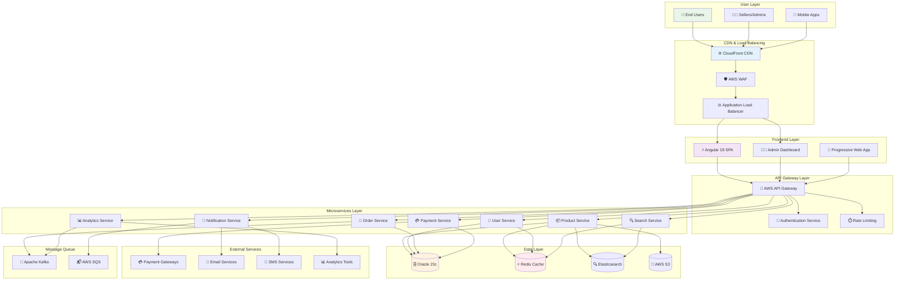
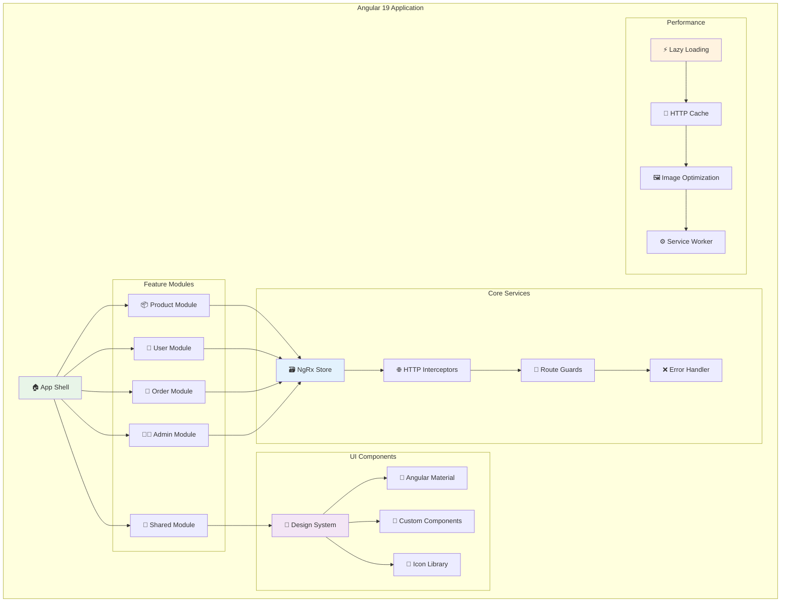
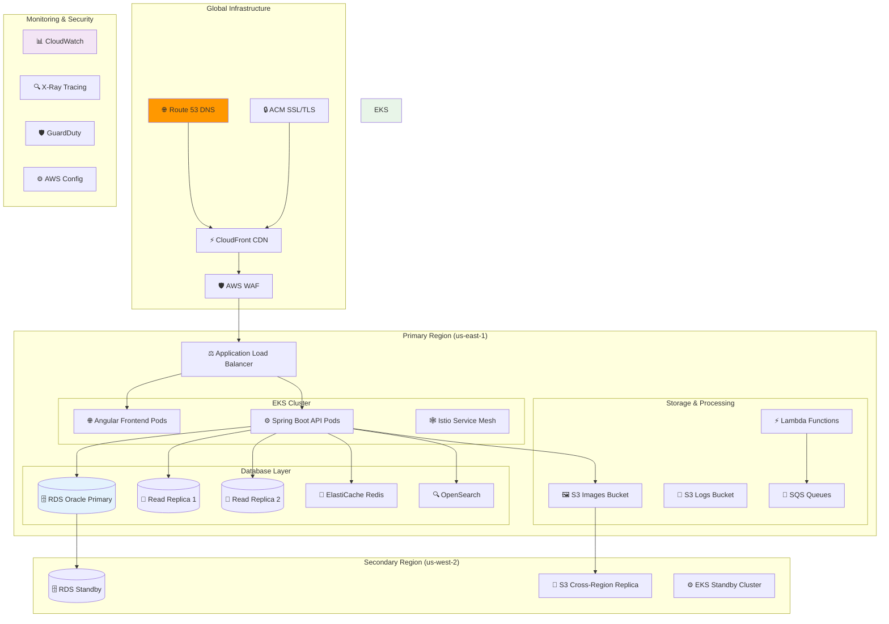
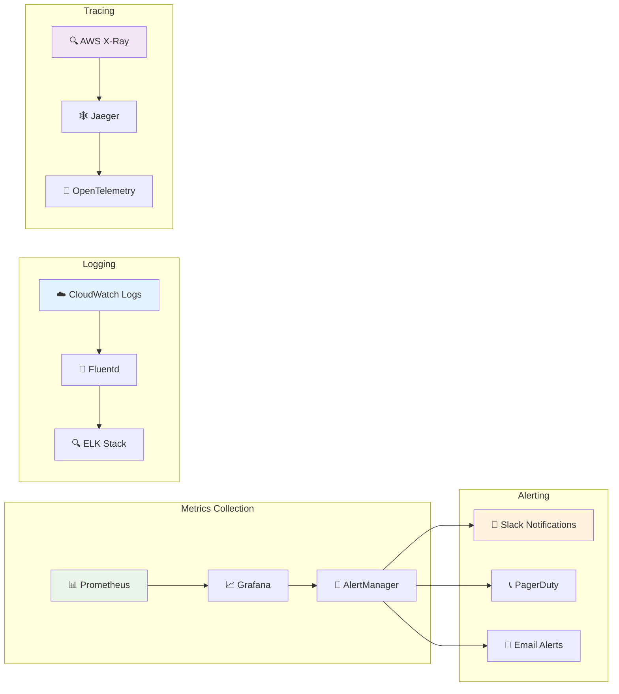

# 🛒 Enterprise E-commerce Application Architecture Guide

## 📋 Table of Contents

1. [Project Overview](#project-overview)
2. [System Requirements & Constraints](#system-requirements)
3. [High-Level Architecture](#high-level-architecture)
4. [Frontend Architecture (Angular 19)](#frontend-architecture)
5. [Backend Architecture (Java/Spring Boot)](#backend-architecture)
6. [Database Design (Oracle)](#database-design)
7. [Security Implementation](#security-implementation)
8. [Localization Strategy](#localization-strategy)
9. [Performance Optimization](#performance-optimization)
10. [AWS Deployment Strategy](#aws-deployment)
11. [Angular 19 New Features Implementation](#angular19-features)
12. [Scalability & Load Handling](#scalability)
13. [Monitoring & DevOps](#monitoring)

---

## 🎯 Project Overview {#project-overview}

### Business Requirements

**E-commerce Platform Specifications:**

- **Products**: 1,000+ products across 50+ categories
- **Users**: Support for 50,000+ concurrent users
- **Localization**: English (US) and Spanish support
- **Performance**: Fast loading with optimized image delivery
- **Security**: Maximum security implementation
- **Admin Panel**: Seller product management system
- **Pagination**: Efficient product browsing

### Technical Stack

```typescript
interface TechStack {
  frontend: {
    framework: "Angular 19";
    stateManagement: "NgRx 18";
    ui: "Angular Material 19 + Custom Design System";
    testing: "Jest + Cypress + Playwright";
    bundling: "Webpack 5 + esbuild";
  };
  backend: {
    framework: "Spring Boot 3.2";
    security: "Spring Security 6 + OAuth2 + JWT";
    database: "Oracle 23c + Redis Cache";
    search: "Elasticsearch 8";
    messaging: "Apache Kafka";
  };
  infrastructure: {
    cloud: "AWS";
    containers: "Docker + Kubernetes (EKS)";
    cdn: "CloudFront";
    monitoring: "CloudWatch + Prometheus + Grafana";
    cicd: "GitHub Actions + AWS CodePipeline";
  };
}
```

---

## ⚙️ System Requirements & Constraints {#system-requirements}

### Performance Requirements

```yaml
# Performance Targets
response_time:
  page_load: "<2 seconds"
  api_response: "<500ms"
  image_load: "<1 second"
  search_results: "<300ms"

scalability:
  concurrent_users: 50000
  peak_traffic: "10x normal load"
  database_connections: 1000
  cache_hit_ratio: ">95%"

availability:
  uptime: "99.9%"
  recovery_time: "<15 minutes"
  backup_frequency: "real-time"
```

### Security Requirements

```typescript
interface SecurityRequirements {
  authentication: {
    multiFactorAuth: boolean;
    passwordPolicy: "OWASP compliant";
    sessionManagement: "JWT with refresh tokens";
    socialLogin: "Google, Facebook, Apple";
  };
  dataProtection: {
    encryption: "AES-256 at rest, TLS 1.3 in transit";
    piiHandling: "GDPR/CCPA compliant";
    paymentSecurity: "PCI DSS Level 1";
    auditLogging: "comprehensive activity logs";
  };
  networkSecurity: {
    waf: "AWS WAF with custom rules";
    ddosProtection: "AWS Shield Advanced";
    apiSecurity: "Rate limiting + API Gateway";
    secretsManagement: "AWS Secrets Manager";
  };
}
```

---

## 🏗️ High-Level Architecture {#high-level-architecture}

### System Architecture Diagram



### Architecture Explanation

**🌐 CDN & Load Balancing Layer:**

- **CloudFront**: Global content delivery with edge caching for static assets
- **AWS WAF**: Web application firewall for security filtering
- **Application Load Balancer**: Distributes traffic across multiple instances

**⚡ Frontend Layer:**

- **Angular 19 SPA**: Main customer-facing application
- **Admin Dashboard**: Seller management interface
- **PWA**: Progressive web app for mobile experience

**🚪 API Gateway Layer:**

- **AWS API Gateway**: Central entry point for all API calls
- **Authentication Service**: JWT-based authentication with OAuth2
- **Rate Limiting**: Prevents abuse and ensures fair usage

**🔧 Microservices Architecture:**

- **Product Service**: Manages product catalog, categories, inventory
- **User Service**: Handles user profiles, authentication, preferences
- **Order Service**: Processes orders, shopping cart, checkout
- **Payment Service**: Secure payment processing with multiple gateways
- **Search Service**: Advanced product search with filters and suggestions
- **Notification Service**: Email, SMS, push notifications
- **Analytics Service**: User behavior tracking and business intelligence

---

## 🎨 Frontend Architecture (Angular 19) {#frontend-architecture}

### Component Architecture



### Frontend Layer Structure

```typescript
// Frontend Architecture Overview
interface FrontendArchitecture {
  structure: {
    appShell: "Progressive loading with skeleton screens";
    routing: "Lazy-loaded feature modules with preloading";
    stateManagement: "NgRx with entity adapter pattern";
    componentStrategy: "Smart/Dumb component pattern";
  };

  modules: {
    core: "Singleton services, guards, interceptors";
    shared: "Common components, pipes, directives";
    features: "Lazy-loaded business modules";
    layout: "Header, footer, navigation, sidebar";
  };

  performance: {
    bundleOptimization: "Code splitting + tree shaking";
    lazyLoading: "Route-based + component-based";
    caching: "HTTP cache + browser cache + CDN";
    images: "WebP format + responsive images + lazy loading";
  };

  i18n: {
    strategy: "Build-time optimization with Angular i18n";
    languages: ["en-US", "es-ES"];
    fallback: "en-US";
    rtlSupport: false; // Not needed for Spanish
  };
}
```

### Key Frontend Components

```typescript
// Main Application Structure
interface ComponentHierarchy {
  appComponent: {
    purpose: "Root component with router outlet";
    features: ["Global error boundary", "Loading states", "Theme provider"];
  };

  layoutComponents: {
    header: "Navigation, search, cart, user menu";
    footer: "Links, company info, newsletter signup";
    sidebar: "Category navigation, filters";
    breadcrumbs: "Navigation path indication";
  };

  featureComponents: {
    productCatalog: {
      productList: "Grid/list view with pagination";
      productCard: "Image, title, price, ratings";
      productDetail: "Full product information";
      productSearch: "Search with autocomplete";
      productFilters: "Category, price, rating filters";
    };

    userInterface: {
      authentication: "Login, register, forgot password";
      userProfile: "Profile management, preferences";
      wishlist: "Saved products list";
      orderHistory: "Past orders with tracking";
    };

    shoppingCart: {
      cartSummary: "Items, quantities, total";
      checkout: "Multi-step checkout process";
      paymentForm: "Secure payment input";
      orderConfirmation: "Order success page";
    };

    adminPanel: {
      dashboard: "Seller analytics overview";
      productManagement: "Add, edit, delete products";
      orderManagement: "Order fulfillment interface";
      analyticsReports: "Sales and performance metrics";
    };
  };
}
```

---

## 🔧 Backend Architecture (Java/Spring Boot) {#backend-architecture}

### Microservices Architecture

```mermaid
graph TB
    subgraph "API Gateway Layer"
        Gateway[🚪 Spring Cloud Gateway]
        Discovery[🔍 Eureka Discovery]
        ConfigServer[⚙️ Config Server]
    end

    subgraph "Security Layer"
        AuthServer[🔐 OAuth2 Authorization Server]
        ResourceServer[🛡️ Resource Server]
        JWTService[🎫 JWT Service]
    end

    subgraph "Core Microservices"
        ProductService[📦 Product Service]
        UserService[👤 User Service]
        OrderService[🛒 Order Service]
        PaymentService[💳 Payment Service]
        InventoryService[📊 Inventory Service]
        NotificationService[📧 Notification Service]
    end

    subgraph "Support Services"
        SearchService[🔍 Search Service]
        ImageService[🖼️ Image Service]
        AnalyticsService[📊 Analytics Service]
        RecommendationService[🎯 Recommendation Service]
    end

    subgraph "Data Services"
        CacheService[⚡ Cache Service]
        FileService[📁 File Service]
        AuditService[📝 Audit Service]
    end

    subgraph "Message Brokers"
        Kafka[📨 Apache Kafka]
        SQS[📬 AWS SQS]
        SNS[📢 AWS SNS]
    end

    subgraph "Databases"
        OracleMain[(🗄️ Oracle Main DB)]
        OracleRead[(📖 Oracle Read Replica)]
        Redis[(⚡ Redis Cache)]
        Elasticsearch[(🔍 Elasticsearch)]
    end

    Gateway --> Discovery
    Gateway --> AuthServer
    Gateway --> ProductService
    Gateway --> UserService
    Gateway --> OrderService
    Gateway --> PaymentService

    AuthServer --> JWTService
    ResourceServer --> JWTService

    ProductService --> InventoryService
    ProductService --> CacheService
    ProductService --> SearchService
    ProductService --> OracleMain
    ProductService --> Redis

    OrderService --> PaymentService
    OrderService --> InventoryService
    OrderService --> NotificationService
    OrderService --> Kafka

    SearchService --> Elasticsearch
    ImageService --> FileService
    AnalyticsService --> Kafka
    RecommendationService --> AnalyticsService

    NotificationService --> SQS
    NotificationService --> SNS

    style Gateway fill:#e8f5e8
    style AuthServer fill:#e3f2fd
    style ProductService fill:#f3e5f5
    style OracleMain fill:#fff3e0
```



### Backend Service Details

```java
// Backend Architecture Implementation Strategy

/**
 * Product Service - Core product management
 */
@RestController
@RequestMapping("/api/v1/products")
@PreAuthorize("hasRole('USER')")
public class ProductController {

    // Key endpoints for product management
    // GET /api/v1/products - Paginated product list with filters
    // GET /api/v1/products/{id} - Product details with caching
    // GET /api/v1/products/categories - Category hierarchy
    // GET /api/v1/products/search - Elasticsearch-powered search
    // POST /api/v1/products - Admin: Create product
    // PUT /api/v1/products/{id} - Admin: Update product
    // DELETE /api/v1/products/{id} - Admin: Delete product
}

/**
 * Service layer with caching and performance optimization
 */
@Service
@Transactional
public class ProductService {

    @Cacheable(value = "products", key = "#id")
    public ProductDTO getProduct(Long id) {
        // Oracle database query with JPA
        // Cache frequently accessed products
        // Handle image optimization
        // Apply localization for product descriptions
    }

    @Cacheable(value = "productList", key = "#pageable.toString() + #filters.toString()")
    public Page<ProductDTO> getProducts(Pageable pageable, ProductFilters filters) {
        // Efficient pagination with Oracle
        // Dynamic query building based on filters
        // Category-based filtering
        // Price range and availability filters
    }

    @CacheEvict(value = {"products", "productList"}, allEntries = true)
    public ProductDTO updateProduct(Long id, ProductUpdateDTO updateDTO) {
        // Admin product updates
        // Inventory synchronization
        // Search index updates
        // Cache invalidation
    }
}
```

### Database Design Strategy

```sql
-- Oracle Database Schema Design for E-commerce

-- Products table with partitioning for performance
CREATE TABLE products (
    id NUMBER(19) PRIMARY KEY,
    name NVARCHAR2(500) NOT NULL,
    description NCLOB,
    price NUMBER(10,2) NOT NULL,
    category_id NUMBER(19) NOT NULL,
    seller_id NUMBER(19) NOT NULL,
    sku VARCHAR2(100) UNIQUE NOT NULL,
    status VARCHAR2(20) DEFAULT 'ACTIVE',
    created_date TIMESTAMP DEFAULT CURRENT_TIMESTAMP,
    modified_date TIMESTAMP DEFAULT CURRENT_TIMESTAMP,
    -- Localization columns
    name_es NVARCHAR2(500),
    description_es NCLOB,
    -- Performance indexes
    CONSTRAINT fk_product_category FOREIGN KEY (category_id) REFERENCES categories(id),
    CONSTRAINT fk_product_seller FOREIGN KEY (seller_id) REFERENCES sellers(id)
) PARTITION BY RANGE (created_date) (
    PARTITION p_2024 VALUES LESS THAN (DATE '2025-01-01'),
    PARTITION p_2025 VALUES LESS THAN (DATE '2026-01-01'),
    PARTITION p_future VALUES LESS THAN (MAXVALUE)
);

-- Categories with hierarchical structure
CREATE TABLE categories (
    id NUMBER(19) PRIMARY KEY,
    name NVARCHAR2(200) NOT NULL,
    parent_id NUMBER(19),
    level_num NUMBER(2) DEFAULT 1,
    sort_order NUMBER(5) DEFAULT 0,
    is_active NUMBER(1) DEFAULT 1,
    -- Localization
    name_es NVARCHAR2(200),
    -- Hierarchical queries support
    CONSTRAINT fk_category_parent FOREIGN KEY (parent_id) REFERENCES categories(id)
);

-- Performance indexes for fast product queries
CREATE INDEX idx_products_category ON products(category_id, status, created_date);
CREATE INDEX idx_products_seller ON products(seller_id, status);
CREATE INDEX idx_products_price ON products(price, status);
CREATE INDEX idx_products_name ON products(UPPER(name));

-- Full-text search index for Oracle Text
CREATE INDEX idx_products_text ON products(name, description)
INDEXTYPE IS CTXSYS.CONTEXT;
```

---

## 🔒 Security Implementation {#security-implementation}

### Comprehensive Security Architecture


### Security Implementation Details

```typescript
// Frontend Security Configuration
interface SecurityConfig {
  contentSecurityPolicy: {
    defaultSrc: ["'self'"];
    scriptSrc: ["'self'", "'unsafe-eval'", "https://apis.google.com"];
    styleSrc: ["'self'", "'unsafe-inline'", "https://fonts.googleapis.com"];
    imgSrc: ["'self'", "data:", "https:", "https://cdn.example.com"];
    connectSrc: ["'self'", "https://api.example.com"];
    fontSrc: ["'self'", "https://fonts.gstatic.com"];
    objectSrc: ["'none'"];
    mediaSrc: ["'self'"];
    frameSrc: ["'none'"];
  };

  httpSecurity: {
    hstsMaxAge: 31536000; // 1 year
    forceHttps: true;
    xssProtection: "1; mode=block";
    contentTypeOptions: "nosniff";
    frameOptions: "DENY";
    referrerPolicy: "strict-origin-when-cross-origin";
  };

  authentication: {
    jwtExpiry: 3600; // 1 hour
    refreshTokenExpiry: 2592000; // 30 days
    maxLoginAttempts: 5;
    lockoutDuration: 900; // 15 minutes
    passwordPolicy: {
      minLength: 12;
      requireUppercase: true;
      requireLowercase: true;
      requireNumbers: true;
      requireSpecialChars: true;
    };
  };
}
```

```java
// Backend Security Implementation
@Configuration
@EnableWebSecurity
@EnableGlobalMethodSecurity(prePostEnabled = true)
public class SecurityConfig {

    @Bean
    public SecurityFilterChain filterChain(HttpSecurity http) throws Exception {
        return http
            .csrf(csrf -> csrf
                .csrfTokenRepository(CookieCsrfTokenRepository.withHttpOnlyFalse())
                .ignoringRequestMatchers("/api/v1/public/**")
            )
            .sessionManagement(session -> session
                .sessionCreationPolicy(SessionCreationPolicy.STATELESS)
            )
            .oauth2ResourceServer(oauth2 -> oauth2
                .jwt(jwt -> jwt
                    .decoder(jwtDecoder())
                    .jwtAuthenticationConverter(jwtAuthenticationConverter())
                )
            )
            .authorizeHttpRequests(authz -> authz
                .requestMatchers("/api/v1/public/**").permitAll()
                .requestMatchers("/api/v1/admin/**").hasRole("ADMIN")
                .requestMatchers("/api/v1/seller/**").hasAnyRole("SELLER", "ADMIN")
                .anyRequest().authenticated()
            )
            .headers(headers -> headers
                .frameOptions().deny()
                .contentTypeOptions().and()
                .httpStrictTransportSecurity(hstsConfig -> hstsConfig
                    .maxAgeInSeconds(31536000)
                    .includeSubdomains(true)
                )
            )
            .build();
    }

    @Bean
    public PasswordEncoder passwordEncoder() {
        // Use Argon2 for password hashing (more secure than BCrypt)
        return new Argon2PasswordEncoder(16, 32, 1, 4096, 3);
    }

    @Bean
    public JwtDecoder jwtDecoder() {
        // RSA256 JWT validation with public key
        return NimbusJwtDecoder.withPublicKey(rsaPublicKey()).build();
    }
}

// Rate Limiting Implementation
@Component
public class RateLimitingFilter implements Filter {

    private final RedisTemplate<String, String> redisTemplate;

    @Override
    public void doFilter(ServletRequest request, ServletResponse response,
                        FilterChain chain) throws IOException, ServletException {

        HttpServletRequest httpRequest = (HttpServletRequest) request;
        String clientId = getClientIdentifier(httpRequest);
        String endpoint = httpRequest.getRequestURI();

        // Different rate limits for different endpoints
        RateLimit rateLimit = getRateLimitForEndpoint(endpoint);

        if (isRateLimitExceeded(clientId, endpoint, rateLimit)) {
            HttpServletResponse httpResponse = (HttpServletResponse) response;
            httpResponse.setStatus(HttpStatus.TOO_MANY_REQUESTS.value());
            httpResponse.getWriter().write("Rate limit exceeded");
            return;
        }

        chain.doFilter(request, response);
    }

    private boolean isRateLimitExceeded(String clientId, String endpoint, RateLimit rateLimit) {
        String key = "rate_limit:" + clientId + ":" + endpoint;
        String currentCount = redisTemplate.opsForValue().get(key);

        if (currentCount == null) {
            redisTemplate.opsForValue().set(key, "1", rateLimit.getWindowSize(), TimeUnit.SECONDS);
            return false;
        }

        int count = Integer.parseInt(currentCount);
        if (count >= rateLimit.getLimit()) {
            return true;
        }

        redisTemplate.opsForValue().increment(key);
        return false;
    }
}
```

This is Part 1 of the comprehensive e-commerce architecture guide. The guide covers the foundational architecture, security implementation, and system design. Would you like me to continue with the remaining sections including localization strategy, Angular 19 features, AWS deployment, and performance optimization?

---

## 🌍 Localization Strategy {#localization-strategy}

### Multi-Language Architecture

```mermaid
graph TB
    subgraph "Frontend Localization"
        Angular[⚡ Angular i18n]
        BuildTime[🔨 Build-time Optimization]
        LazyLoad[⚡ Lazy Translation Loading]
        Fallback[🔄 Fallback Strategy]
    end

    subgraph "Backend Localization"
        DatabaseL10n[🗄️ Database Localization]
        APILocale[🌐 API Locale Headers]
        ContentMgmt[📝 Content Management]
        Translation[🔄 Translation Service]
    end

    subgraph "Content Delivery"
        CDNLocale[🌐 CDN by Locale]
        GeoRouting[🌍 Geographic Routing]
        CacheStrategy[💾 Localized Caching]
    end

    subgraph "Supported Locales"
        EnglishUS[� English US]
        Spanish[� Spanish ES]
        FutureLocales[🌍 Future Expansion]
    end

    Angular --> BuildTime
    BuildTime --> LazyLoad
    LazyLoad --> Fallback

    DatabaseL10n --> APILocale
    APILocale --> ContentMgmt
    ContentMgmt --> Translation

    CDNLocale --> GeoRouting
    GeoRouting --> CacheStrategy

    EnglishUS --> Spanish
    Spanish --> FutureLocales

    style Angular fill:#e8f5e8
    style DatabaseL10n fill:#e3f2fd
    style CDNLocale fill:#f3e5f5
    style EnglishUS fill:#fff3e0
```



### Frontend Localization Implementation

```typescript
// Angular 19 i18n Configuration
interface LocalizationConfig {
  defaultLocale: "en-US";
  supportedLocales: ["en-US", "es-ES"];
  buildStrategy: "separate-builds"; // One build per locale for performance
  loadingStrategy: "eager"; // Load all translations at startup
  fallbackStrategy: "en-US";
}

// Product catalog with localization
@Component({
  selector: "app-product-catalog",
  template: `
    <div class="product-catalog">
      <!-- Localized page title -->
      <h1 i18n="@@catalog.title">Product Catalog</h1>
      <p i18n="@@catalog.description">
        Discover our amazing collection of {{ totalProducts }} products across
        {{ totalCategories }} categories.
      </p>

      <!-- Category navigation with localized names -->
      <nav class="category-nav" aria-label="Product categories">
        <ul>
          <li *ngFor="let category of localizedCategories">
            <a
              [routerLink]="['/products', category.slug]"
              [attr.aria-label]="getCategoryAriaLabel(category)"
            >
              {{ category.localizedName }}
              <span class="product-count">({{ category.productCount }})</span>
            </a>
          </li>
        </ul>
      </nav>

      <!-- Product grid with localized content -->
      <div class="product-grid">
        <app-product-card
          *ngFor="let product of products"
          [product]="product"
          [locale]="currentLocale"
        >
        </app-product-card>
      </div>

      <!-- Localized pagination -->
      <app-pagination
        [currentPage]="currentPage"
        [totalPages]="totalPages"
        [pageSize]="pageSize"
        (pageChange)="onPageChange($event)"
        i18n-aria-label="@@pagination.label"
        aria-label="Product catalog pagination"
      >
      </app-pagination>

      <!-- No results message -->
      <div class="no-results" *ngIf="products.length === 0">
        <h2 i18n="@@catalog.noResults.title">No products found</h2>
        <p i18n="@@catalog.noResults.message">
          Try adjusting your search criteria or browse our categories.
        </p>
        <button
          type="button"
          class="btn-primary"
          (click)="clearFilters()"
          i18n="@@catalog.clearFilters"
        >
          Clear Filters
        </button>
      </div>
    </div>
  `,
  changeDetection: ChangeDetectionStrategy.OnPush,
})
export class ProductCatalogComponent implements OnInit {
  currentLocale: string;
  localizedCategories: LocalizedCategory[] = [];
  products: Product[] = [];

  constructor(
    @Inject(LOCALE_ID) private localeId: string,
    private productService: ProductService,
    private categoryService: CategoryService
  ) {
    this.currentLocale = localeId;
  }

  ngOnInit() {
    this.loadLocalizedCategories();
    this.loadProducts();
  }

  private loadLocalizedCategories() {
    this.categoryService
      .getLocalizedCategories(this.currentLocale)
      .subscribe((categories) => {
        this.localizedCategories = categories.map((category) => ({
          ...category,
          localizedName: this.getLocalizedCategoryName(category),
          slug: this.createLocalizedSlug(category.name),
        }));
      });
  }

  private getLocalizedCategoryName(category: Category): string {
    // Return localized name based on current locale
    switch (this.currentLocale) {
      case "es-ES":
        return category.nameEs || category.name;
      default:
        return category.name;
    }
  }

  getCategoryAriaLabel(category: LocalizedCategory): string {
    // Localized aria-label for accessibility
    const template =
      this.currentLocale === "es-ES"
        ? "Ver productos en la categoría {categoryName}"
        : "View products in {categoryName} category";

    return template.replace("{categoryName}", category.localizedName);
  }
}

// Product model with localization support
interface Product {
  id: number;
  name: string;
  nameEs?: string;
  description: string;
  descriptionEs?: string;
  price: number;
  currency: string;
  images: ProductImage[];
  category: Category;
  seller: Seller;
  specifications: ProductSpecification[];
  reviews: ProductReview[];
  availability: InventoryStatus;
  localizedSlug: string;
}

// Localized price display component
@Component({
  selector: "app-price-display",
  template: `
    <div class="price-display" [attr.lang]="locale">
      <!-- Current price -->
      <span class="current-price" [attr.aria-label]="currentPriceLabel">
        {{
          product.price | currency : currencyCode : "symbol" : "1.2-2" : locale
        }}
      </span>

      <!-- Original price if on sale -->
      <span
        class="original-price"
        *ngIf="product.originalPrice && product.originalPrice > product.price"
        [attr.aria-label]="originalPriceLabel"
      >
        {{
          product.originalPrice
            | currency : currencyCode : "symbol" : "1.2-2" : locale
        }}
      </span>

      <!-- Discount percentage -->
      <span
        class="discount-badge"
        *ngIf="discountPercentage > 0"
        [attr.aria-label]="discountLabel"
      >
        {{ discountPercentage | percent : "1.0-0" : locale }} OFF
      </span>

      <!-- Tax information -->
      <p class="tax-info" i18n="@@product.taxInfo">
        Price includes applicable taxes
      </p>
    </div>
  `,
})
export class PriceDisplayComponent {
  @Input() product!: Product;
  @Input() locale!: string;

  get currencyCode(): string {
    const currencyMap: { [locale: string]: string } = {
      "en-US": "USD",
      "es-ES": "EUR",
    };
    return currencyMap[this.locale] || "USD";
  }

  get discountPercentage(): number {
    if (
      !this.product.originalPrice ||
      this.product.originalPrice <= this.product.price
    ) {
      return 0;
    }
    return (
      (this.product.originalPrice - this.product.price) /
      this.product.originalPrice
    );
  }

  get currentPriceLabel(): string {
    const labels = {
      "en-US": `Current price: ${this.formatPrice(this.product.price)}`,
      "es-ES": `Precio actual: ${this.formatPrice(this.product.price)}`,
    };
    return labels[this.locale] || labels["en-US"];
  }

  private formatPrice(price: number): string {
    return new Intl.NumberFormat(this.locale, {
      style: "currency",
      currency: this.currencyCode,
    }).format(price);
  }
}
```

### Backend Localization Support

```java
// Localized content service
@Service
@Transactional(readOnly = true)
public class LocalizedContentService {

    private final ProductRepository productRepository;
    private final CategoryRepository categoryRepository;

    /**
     * Get localized product information
     */
    public ProductDTO getLocalizedProduct(Long productId, Locale locale) {
        Product product = productRepository.findById(productId)
            .orElseThrow(() -> new ProductNotFoundException(productId));

        return ProductDTO.builder()
            .id(product.getId())
            .name(getLocalizedField(product.getName(), product.getNameEs(), locale))
            .description(getLocalizedField(product.getDescription(), product.getDescriptionEs(), locale))
            .price(product.getPrice())
            .currency(getCurrencyForLocale(locale))
            .category(getLocalizedCategory(product.getCategory(), locale))
            .specifications(getLocalizedSpecifications(product.getSpecifications(), locale))
            .images(optimizeImagesForLocale(product.getImages(), locale))
            .slug(generateLocalizedSlug(product, locale))
            .build();
    }

    /**
     * Get localized category hierarchy
     */
    public List<CategoryDTO> getLocalizedCategories(Locale locale) {
        List<Category> categories = categoryRepository.findAllByIsActiveTrue();

        return categories.stream()
            .map(category -> CategoryDTO.builder()
                .id(category.getId())
                .name(getLocalizedField(category.getName(), category.getNameEs(), locale))
                .slug(generateLocalizedSlug(category.getName(), locale))
                .level(category.getLevel())
                .parentId(category.getParentId())
                .productCount(getProductCountForCategory(category.getId()))
                .build())
            .collect(Collectors.toList());
    }

    /**
     * Search products with localized content
     */
    public Page<ProductDTO> searchLocalizedProducts(
            String query,
            Locale locale,
            Pageable pageable,
            ProductFilters filters) {

        // Build search query considering locale
        SearchQuery searchQuery = SearchQuery.builder()
            .query(query)
            .locale(locale)
            .fields(getSearchFieldsForLocale(locale))
            .filters(filters)
            .sort(getLocalizedSortOptions(locale))
            .build();

        return elasticsearchService.searchProducts(searchQuery, pageable)
            .map(product -> localizeProduct(product, locale));
    }

    private String getLocalizedField(String defaultValue, String localizedValue, Locale locale) {
        if (locale.getLanguage().equals("es") && StringUtils.hasText(localizedValue)) {
            return localizedValue;
        }
        return defaultValue;
    }

    private String getCurrencyForLocale(Locale locale) {
        Map<String, String> currencyMap = Map.of(
            "en", "USD",
            "es", "EUR"
        );
        return currencyMap.getOrDefault(locale.getLanguage(), "USD");
    }

    private List<String> getSearchFieldsForLocale(Locale locale) {
        List<String> fields = new ArrayList<>(Arrays.asList("name", "description", "tags"));

        if (locale.getLanguage().equals("es")) {
            fields.addAll(Arrays.asList("nameEs", "descriptionEs", "tagsEs"));
        }

        return fields;
    }
}

// Content Management for Sellers
@RestController
@RequestMapping("/api/v1/seller/products")
@PreAuthorize("hasRole('SELLER')")
public class SellerProductController {

    @PostMapping
    public ResponseEntity<ProductDTO> createProduct(
            @Valid @RequestBody CreateProductRequest request,
            @RequestHeader("Accept-Language") String acceptLanguage) {

        Locale locale = LocaleUtils.parseLocale(acceptLanguage);

        // Validate that seller provides content in required languages
        validateMultilingualContent(request);

        Product product = productService.createProduct(request, getCurrentSeller());
        ProductDTO localizedProduct = localizedContentService.getLocalizedProduct(product.getId(), locale);

        return ResponseEntity.status(HttpStatus.CREATED).body(localizedProduct);
    }

    @PutMapping("/{id}")
    public ResponseEntity<ProductDTO> updateProduct(
            @PathVariable Long id,
            @Valid @RequestBody UpdateProductRequest request,
            @RequestHeader("Accept-Language") String acceptLanguage) {

        Locale locale = LocaleUtils.parseLocale(acceptLanguage);

        // Ensure seller owns the product
        validateProductOwnership(id, getCurrentSeller());

        // Validate multilingual content
        validateMultilingualContent(request);

        Product updatedProduct = productService.updateProduct(id, request);
        ProductDTO localizedProduct = localizedContentService.getLocalizedProduct(id, locale);

        // Invalidate related caches
        cacheManager.evict("products", id);
        cacheManager.evict("productSearchResults");

        return ResponseEntity.ok(localizedProduct);
    }

    private void validateMultilingualContent(ProductContentRequest request) {
        // Ensure English content is always provided
        if (!StringUtils.hasText(request.getName()) || !StringUtils.hasText(request.getDescription())) {
            throw new ValidationException("English name and description are required");
        }

        // Validate Spanish content format if provided
        if (StringUtils.hasText(request.getNameEs()) || StringUtils.hasText(request.getDescriptionEs())) {
            validateSpanishContent(request.getNameEs(), request.getDescriptionEs());
        }
    }
}
```

---

## ⚡ Performance Optimization {#performance-optimization}

### Frontend Performance Strategy

```mermaid
graph TB
    subgraph "Bundle Optimization"
        CodeSplit[📦 Code Splitting]
        TreeShake[🌳 Tree Shaking]
        LazyLoad[⚡ Lazy Loading]
        Preload[⚡ Module Preloading]
    end

    subgraph "Image Optimization"
        WebP[🖼️ WebP Format]
        Responsive[📱 Responsive Images]
        LazyImages[⚡ Lazy Loading]
        CDNOptim[🌐 CDN Optimization]
    end

    subgraph "Caching Strategy"
        ServiceWorker[⚙️ Service Worker]
        HTTPCache[💾 HTTP Caching]
        LocalStorage[💾 Local Storage]
        IndexedDB[🗄️ IndexedDB]
    end

    subgraph "Rendering Performance"
        OnPush[🔄 OnPush Detection]
        VirtualScroll[📜 Virtual Scrolling]
        TrackBy[🔍 TrackBy Functions]
        AsyncPipe[⚡ Async Pipe]
    end

    CodeSplit --> TreeShake
    TreeShake --> LazyLoad
    LazyLoad --> Preload

    WebP --> Responsive
    Responsive --> LazyImages
    LazyImages --> CDNOptim

    ServiceWorker --> HTTPCache
    HTTPCache --> LocalStorage
    LocalStorage --> IndexedDB

    OnPush --> VirtualScroll
    VirtualScroll --> TrackBy
    TrackBy --> AsyncPipe

    style CodeSplit fill:#e8f5e8
    style WebP fill:#e3f2fd
    style ServiceWorker fill:#f3e5f5
    style OnPush fill:#fff3e0
```



### Performance Implementation

```typescript
// Product list with virtual scrolling for large datasets
@Component({
  selector: "app-product-list",
  template: `
    <div class="product-list-container">
      <!-- Performance-optimized product grid -->
      <cdk-virtual-scroll-viewport
        itemSize="320"
        class="product-viewport"
        (scrolledIndexChange)="onScrollChange($event)"
      >
        <div
          *cdkVirtualFor="
            let product of products$ | async;
            trackBy: trackByProductId;
            templateCacheSize: 20
          "
          class="product-item"
        >
          <app-product-card
            [product]="product"
            [loading]="loadingState$ | async"
            (addToCart)="onAddToCart($event)"
            (addToWishlist)="onAddToWishlist($event)"
          >
          </app-product-card>
        </div>
      </cdk-virtual-scroll-viewport>

      <!-- Intersection observer for infinite scroll -->
      <div
        #loadMoreTrigger
        class="load-more-trigger"
        *ngIf="hasMoreProducts$ | async"
      >
        <app-loading-spinner></app-loading-spinner>
      </div>
    </div>
  `,
  changeDetection: ChangeDetectionStrategy.OnPush,
})
export class ProductListComponent implements OnInit, OnDestroy {
  products$ = this.store.select(selectProducts);
  loadingState$ = this.store.select(selectLoadingState);
  hasMoreProducts$ = this.store.select(selectHasMoreProducts);

  @ViewChild("loadMoreTrigger", { static: false }) loadMoreTrigger!: ElementRef;

  private destroy$ = new Subject<void>();
  private intersectionObserver!: IntersectionObserver;

  constructor(private store: Store<AppState>, private cdr: ChangeDetectorRef) {}

  ngOnInit() {
    this.setupInfiniteScroll();
    this.loadInitialProducts();
  }

  ngOnDestroy() {
    this.destroy$.next();
    this.destroy$.complete();
    this.intersectionObserver?.disconnect();
  }

  trackByProductId(index: number, product: Product): number {
    return product.id;
  }

  onScrollChange(index: number) {
    // Implement virtual scroll performance tracking
    if (index > 0 && index % 20 === 0) {
      this.preloadNextBatch();
    }
  }

  private setupInfiniteScroll() {
    this.intersectionObserver = new IntersectionObserver(
      (entries) => {
        entries.forEach((entry) => {
          if (entry.isIntersecting) {
            this.loadMoreProducts();
          }
        });
      },
      { threshold: 0.1 }
    );

    // Wait for view init
    setTimeout(() => {
      if (this.loadMoreTrigger) {
        this.intersectionObserver.observe(this.loadMoreTrigger.nativeElement);
      }
    });
  }

  private loadMoreProducts() {
    this.store.dispatch(ProductActions.loadMoreProducts());
  }

  private preloadNextBatch() {
    this.store.dispatch(ProductActions.preloadNextBatch());
  }
}

// Optimized product card with image lazy loading
@Component({
  selector: "app-product-card",
  template: `
    <article class="product-card" [attr.aria-label]="productAriaLabel">
      <!-- Optimized image with multiple formats -->
      <div class="product-image-container">
        <picture>
          <source
            [attr.data-srcset]="getWebPSrcSet(product.images[0])"
            type="image/webp"
          />
          <source
            [attr.data-srcset]="getJpegSrcSet(product.images[0])"
            type="image/jpeg"
          />
          
        </picture>

        <!-- Image loading placeholder -->
        <div class="image-placeholder" *ngIf="!imageLoaded">
          <app-skeleton-loader
            width="100%"
            height="200px"
          ></app-skeleton-loader>
        </div>

        <!-- Wishlist button -->
        <button
          type="button"
          class="wishlist-btn"
          [class.active]="product.isInWishlist"
          (click)="toggleWishlist()"
          [attr.aria-label]="wishlistAriaLabel"
        >
          <mat-icon>{{
            product.isInWishlist ? "favorite" : "favorite_border"
          }}</mat-icon>
        </button>
      </div>

      <!-- Product information -->
      <div class="product-info">
        <h3 class="product-title">
          <a
            [routerLink]="['/products', product.slug]"
            [attr.aria-label]="linkAriaLabel"
          >
            {{ product.name }}
          </a>
        </h3>

        <!-- Rating display -->
        <div class="product-rating" [attr.aria-label]="ratingAriaLabel">
          <app-star-rating
            [rating]="product.averageRating"
            [reviewCount]="product.reviewCount"
            [readonly]="true"
          >
          </app-star-rating>
        </div>

        <!-- Price display -->
        <app-price-display [product]="product" [locale]="locale">
        </app-price-display>

        <!-- Quick add to cart -->
        <button
          type="button"
          class="add-to-cart-btn"
          [disabled]="!product.inStock || addingToCart"
          (click)="addToCart()"
          [attr.aria-label]="addToCartAriaLabel"
        >
          <mat-icon *ngIf="!addingToCart">add_shopping_cart</mat-icon>
          <mat-spinner *ngIf="addingToCart" diameter="20"></mat-spinner>

          <span i18n="@@product.addToCart" *ngIf="!addingToCart"
            >Add to Cart</span
          >
          <span i18n="@@product.adding" *ngIf="addingToCart">Adding...</span>
        </button>
      </div>
    </article>
  `,
  changeDetection: ChangeDetectionStrategy.OnPush,
})
export class ProductCardComponent implements OnInit {
  @Input() product!: Product;
  @Input() locale: string = "en-US";

  imageLoaded = false;
  addingToCart = false;

  constructor(private cdr: ChangeDetectorRef) {}

  ngOnInit() {
    // Implement image lazy loading with Intersection Observer
    this.setupLazyLoading();
  }

  getOptimizedImageUrl(
    image: ProductImage,
    size: "small" | "medium" | "large"
  ): string {
    const sizeMap = {
      small: "300x300",
      medium: "600x600",
      large: "1200x1200",
    };

    return `${image.baseUrl}/${sizeMap[size]}/webp/${image.filename}`;
  }

  getWebPSrcSet(image: ProductImage): string {
    return [
      `${this.getOptimizedImageUrl(image, "small")} 300w`,
      `${this.getOptimizedImageUrl(image, "medium")} 600w`,
      `${this.getOptimizedImageUrl(image, "large")} 1200w`,
    ].join(", ");
  }

  onImageLoad() {
    this.imageLoaded = true;
    this.cdr.markForCheck();
  }

  addToCart() {
    this.addingToCart = true;
    this.cdr.markForCheck();

    // Simulate API call
    setTimeout(() => {
      this.addingToCart = false;
      this.cdr.markForCheck();
    }, 1000);
  }

  private setupLazyLoading() {
    // Implement intersection observer for lazy loading
    const imageObserver = new IntersectionObserver((entries) => {
      entries.forEach((entry) => {
        if (entry.isIntersecting) {
          const img = entry.target as HTMLImageElement;
          const dataSrc = img.getAttribute("data-src");
          if (dataSrc) {
            img.src = dataSrc;
            img.removeAttribute("data-src");
            imageObserver.unobserve(img);
          }
        }
      });
    });

    // Observe all lazy images in this component
    setTimeout(() => {
      const lazyImages = document.querySelectorAll(".lazy");
      lazyImages.forEach((img) => imageObserver.observe(img));
    });
  }
}
```

### Backend Performance Optimization

```java
// High-performance product service with caching
@Service
@Transactional(readOnly = true)
public class ProductPerformanceService {

    private final ProductRepository productRepository;
    private final RedisTemplate<String, Object> redisTemplate;
    private final ElasticsearchService elasticsearchService;

    /**
     * Get paginated products with multi-level caching
     */
    @Cacheable(value = "productList", key = "#pageable.toString() + #filters.toString()")
    public Page<ProductDTO> getProducts(Pageable pageable, ProductFilters filters) {

        // Check Redis cache first
        String cacheKey = generateCacheKey("products", pageable, filters);
        Page<ProductDTO> cachedResult = getCachedPage(cacheKey);

        if (cachedResult != null) {
            return cachedResult;
        }

        // Use database with optimized query
        Page<Product> products;

        if (filters.hasComplexFilters()) {
            // Use Elasticsearch for complex filtering
            products = elasticsearchService.searchProducts(filters, pageable);
        } else {
            // Use optimized database query for simple filters
            products = productRepository.findProductsOptimized(filters, pageable);
        }

        // Convert to DTOs with lazy loading optimization
        Page<ProductDTO> result = products.map(this::convertToDTO);

        // Cache the result
        cachePageResult(cacheKey, result);

        return result;
    }

    /**
     * Bulk product loading for homepage
     */
    @Cacheable(value = "homepage", key = "'featured-products-' + #locale")
    public HomepageProductsDTO getFeaturedProducts(Locale locale) {

        // Parallel loading of different product sections
        CompletableFuture<List<ProductDTO>> featuredFuture =
            CompletableFuture.supplyAsync(() -> getFeaturedProductsAsync(locale));

        CompletableFuture<List<ProductDTO>> bestSellersFuture =
            CompletableFuture.supplyAsync(() -> getBestSellersAsync(locale));

        CompletableFuture<List<ProductDTO>> newArrivalsFuture =
            CompletableFuture.supplyAsync(() -> getNewArrivalsAsync(locale));

        try {
            CompletableFuture.allOf(featuredFuture, bestSellersFuture, newArrivalsFuture)
                .get(2, TimeUnit.SECONDS);

            return HomepageProductsDTO.builder()
                .featured(featuredFuture.get())
                .bestSellers(bestSellersFuture.get())
                .newArrivals(newArrivalsFuture.get())
                .build();

        } catch (Exception e) {
            // Fallback to cached data or simplified response
            return getHomepageFallback(locale);
        }
    }

    /**
     * Optimized product details with preloading
     */
    @Cacheable(value = "productDetails", key = "#id + '-' + #locale")
    public ProductDetailDTO getProductDetails(Long id, Locale locale) {

        // Load product with optimized join fetching
        Product product = productRepository.findByIdWithDetails(id)
            .orElseThrow(() -> new ProductNotFoundException(id));

        // Parallel loading of related data
        CompletableFuture<List<ProductReviewDTO>> reviewsFuture =
            CompletableFuture.supplyAsync(() -> getProductReviews(id, locale));

        CompletableFuture<List<ProductDTO>> relatedFuture =
            CompletableFuture.supplyAsync(() -> getRelatedProducts(product, locale));

        CompletableFuture<InventoryStatusDTO> inventoryFuture =
            CompletableFuture.supplyAsync(() -> getInventoryStatus(id));

        try {
            ProductDetailDTO details = convertToDetailDTO(product, locale);

            // Wait for parallel operations
            details.setReviews(reviewsFuture.get(1, TimeUnit.SECONDS));
            details.setRelatedProducts(relatedFuture.get(1, TimeUnit.SECONDS));
            details.setInventoryStatus(inventoryFuture.get(500, TimeUnit.MILLISECONDS));

            return details;

        } catch (TimeoutException e) {
            // Return basic details if parallel loading times out
            return convertToDetailDTO(product, locale);
        }
    }

    /**
     * Database query optimization for product listing
     */
    @Query(value = """
        SELECT p.* FROM products p
        JOIN categories c ON p.category_id = c.id
        WHERE (:#{#filters.categoryId} IS NULL OR p.category_id = :#{#filters.categoryId})
        AND (:#{#filters.minPrice} IS NULL OR p.price >= :#{#filters.minPrice})
        AND (:#{#filters.maxPrice} IS NULL OR p.price <= :#{#filters.maxPrice})
        AND p.status = 'ACTIVE'
        AND p.inventory_count > 0
        ORDER BY
            CASE WHEN :#{#pageable.sort.getOrderFor('price')} IS NOT NULL
                 THEN p.price END ASC,
            CASE WHEN :#{#pageable.sort.getOrderFor('name')} IS NOT NULL
                 THEN p.name END ASC,
            p.created_date DESC
        """,
        countQuery = """
        SELECT COUNT(p.id) FROM products p
        JOIN categories c ON p.category_id = c.id
        WHERE (:#{#filters.categoryId} IS NULL OR p.category_id = :#{#filters.categoryId})
        AND (:#{#filters.minPrice} IS NULL OR p.price >= :#{#filters.minPrice})
        AND (:#{#filters.maxPrice} IS NULL OR p.price <= :#{#filters.maxPrice})
        AND p.status = 'ACTIVE'
        AND p.inventory_count > 0
        """,
        nativeQuery = true)
    Page<Product> findProductsOptimized(ProductFilters filters, Pageable pageable);

    /**
     * Image optimization service
     */
    @Async
    public CompletableFuture<List<OptimizedImageDTO>> optimizeProductImages(Long productId) {

        List<ProductImage> images = productImageRepository.findByProductId(productId);

        List<CompletableFuture<OptimizedImageDTO>> futures = images.stream()
            .map(image -> CompletableFuture.supplyAsync(() -> {
                // Generate multiple sizes and formats
                return imageOptimizationService.generateOptimizedVersions(image);
            }))
            .collect(Collectors.toList());

        return CompletableFuture.allOf(futures.toArray(new CompletableFuture[0]))
            .thenApply(v -> futures.stream()
                .map(CompletableFuture::join)
                .collect(Collectors.toList()));
    }
}
```

---

## 🚀 Angular 19 New Features Implementation {#angular-19-features}

### Signal-Based Architecture

```mermaid
graph TB
    subgraph "Angular 19 Signals"
        Signals[📡 Signals]
        Effects[⚡ Effects]
        Computed[🔄 Computed]
        Resources[📦 Resources]
    end

    subgraph "Control Flow"
        IfBlocks[🔀 @if/@else]
        ForBlocks[🔁 @for]
        SwitchBlocks[🔀 @switch]
        DeferBlocks[⏳ @defer]
    end

    subgraph "SSR Improvements"
        Hydration[💧 Non-destructive Hydration]
        EventReplay[🔄 Event Replay]
        Streaming[📡 Streaming SSR]
        Prerendering[🏗️ Static Prerendering]
    end

    subgraph "DX Enhancements"
        NewLifecycle[🔄 New Lifecycle Hooks]
        MaterialV18[🎨 Material Design V18]
        DevTools[🛠️ Enhanced DevTools]
        StandaloneAPIs[🏗️ Standalone APIs]
    end

    Signals --> Effects
    Effects --> Computed
    Computed --> Resources

    IfBlocks --> ForBlocks
    ForBlocks --> SwitchBlocks
    SwitchBlocks --> DeferBlocks

    Hydration --> EventReplay
    EventReplay --> Streaming
    Streaming --> Prerendering

    NewLifecycle --> MaterialV18
    MaterialV18 --> DevTools
    DevTools --> StandaloneAPIs

    style Signals fill:#e8f5e8
    style IfBlocks fill:#e3f2fd
    style Hydration fill:#f3e5f5
    style NewLifecycle fill:#fff3e0
```



### Signal-Based State Management

```typescript
// Product catalog store using Angular 19 signals
@Injectable({
  providedIn: "root",
})
export class ProductCatalogStore {
  // Private state signals
  private readonly _products = signal<Product[]>([]);
  private readonly _loading = signal<boolean>(false);
  private readonly _filters = signal<ProductFilters>({
    category: null,
    priceRange: null,
    sortBy: "relevance",
  });
  private readonly _pagination = signal<PaginationState>({
    currentPage: 1,
    pageSize: 24,
    totalItems: 0,
  });
  private readonly _searchQuery = signal<string>("");

  // Public readonly signals
  readonly products = this._products.asReadonly();
  readonly loading = this._loading.asReadonly();
  readonly filters = this._filters.asReadonly();
  readonly pagination = this._pagination.asReadonly();
  readonly searchQuery = this._searchQuery.asReadonly();

  // Computed signals for derived state
  readonly filteredProducts = computed(() => {
    const products = this._products();
    const filters = this._filters();
    const query = this._searchQuery();

    return this.applyFiltersAndSearch(products, filters, query);
  });

  readonly totalPages = computed(() => {
    const pagination = this._pagination();
    return Math.ceil(pagination.totalItems / pagination.pageSize);
  });

  readonly hasNextPage = computed(() => {
    const pagination = this._pagination();
    return pagination.currentPage < this.totalPages();
  });

  readonly productCategories = computed(() => {
    const products = this._products();
    return this.extractUniqueCategories(products);
  });

  readonly priceRange = computed(() => {
    const products = this.filteredProducts();
    if (products.length === 0) return { min: 0, max: 0 };

    const prices = products.map((p) => p.price);
    return {
      min: Math.min(...prices),
      max: Math.max(...prices),
    };
  });

  constructor(private productService: ProductService) {
    // Effect to automatically fetch products when filters change
    effect(() => {
      const filters = this._filters();
      const pagination = this._pagination();
      const searchQuery = this._searchQuery();

      // Debounce search queries
      if (searchQuery) {
        this.debouncedSearch(searchQuery, filters, pagination);
      } else {
        this.fetchProducts(filters, pagination);
      }
    });

    // Effect for analytics tracking
    effect(() => {
      const query = this._searchQuery();
      const filters = this._filters();

      if (query || Object.values(filters).some((v) => v !== null)) {
        this.trackSearchEvent(query, filters);
      }
    });
  }

  // Actions to update state
  updateFilters(newFilters: Partial<ProductFilters>) {
    this._filters.update((current) => ({ ...current, ...newFilters }));
    this._pagination.update((current) => ({ ...current, currentPage: 1 }));
  }

  updateSearchQuery(query: string) {
    this._searchQuery.set(query);
    this._pagination.update((current) => ({ ...current, currentPage: 1 }));
  }

  loadNextPage() {
    if (this.hasNextPage()) {
      this._pagination.update((current) => ({
        ...current,
        currentPage: current.currentPage + 1,
      }));
    }
  }

  resetFilters() {
    this._filters.set({
      category: null,
      priceRange: null,
      sortBy: "relevance",
    });
    this._searchQuery.set("");
    this._pagination.update((current) => ({ ...current, currentPage: 1 }));
  }

  private async fetchProducts(
    filters: ProductFilters,
    pagination: PaginationState
  ) {
    this._loading.set(true);

    try {
      const result = await this.productService.getProducts({
        filters,
        page: pagination.currentPage,
        size: pagination.pageSize,
      });

      if (pagination.currentPage === 1) {
        this._products.set(result.content);
      } else {
        // Append for infinite scroll
        this._products.update((current) => [...current, ...result.content]);
      }

      this._pagination.update((current) => ({
        ...current,
        totalItems: result.totalElements,
      }));
    } catch (error) {
      console.error("Failed to fetch products:", error);
    } finally {
      this._loading.set(false);
    }
  }

  private debouncedSearch = debounce(
    (query: string, filters: ProductFilters, pagination: PaginationState) => {
      this.fetchProducts({ ...filters, searchQuery: query }, pagination);
    },
    300
  );
}

// Product component using new control flow syntax
@Component({
  selector: "app-product-catalog",
  standalone: true,
  imports: [CommonModule, RouterModule, MaterialModule],
  template: `
    <div class="product-catalog">
      <!-- Search and filters section -->
      <div class="catalog-controls">
        <div class="search-container">
          <input
            type="search"
            [value]="store.searchQuery()"
            (input)="onSearchInput($event)"
            placeholder="Search products..."
            class="search-input"
            aria-label="Search products"
          />

          @if (store.searchQuery()) {
          <button
            type="button"
            (click)="clearSearch()"
            class="clear-search-btn"
            aria-label="Clear search"
          >
            <mat-icon>clear</mat-icon>
          </button>
          }
        </div>

        <!-- Category filter using new @for syntax -->
        <div class="category-filter">
          <label for="category-select">Category:</label>
          <select
            id="category-select"
            [value]="store.filters().category || ''"
            (change)="onCategoryChange($event)"
          >
            <option value="">All Categories</option>
            @for (category of store.productCategories(); track category.id) {
            <option [value]="category.id">{{ category.name }}</option>
            }
          </select>
        </div>

        <!-- Sort options -->
        <div class="sort-options">
          <label for="sort-select">Sort by:</label>
          <select
            id="sort-select"
            [value]="store.filters().sortBy"
            (change)="onSortChange($event)"
          >
            <option value="relevance">Relevance</option>
            <option value="price-low">Price: Low to High</option>
            <option value="price-high">Price: High to Low</option>
            <option value="rating">Customer Rating</option>
            <option value="newest">Newest First</option>
          </select>
        </div>
      </div>

      <!-- Results summary using computed signals -->
      <div class="results-summary">
        @if (store.searchQuery()) {
        <p>
          Showing {{ store.filteredProducts().length }} results for
          <strong>"{{ store.searchQuery() }}"</strong>
        </p>
        } @else {
        <p>{{ store.filteredProducts().length }} products found</p>
        } @if (store.filters().category) {
        <span class="active-filter">
          Category: {{ getCategoryName(store.filters().category) }}
          <button
            type="button"
            (click)="clearCategoryFilter()"
            aria-label="Remove category filter"
          >
            ✕
          </button>
        </span>
        }
      </div>

      <!-- Loading state -->
      @if (store.loading()) {
      <div class="loading-container">
        <mat-spinner diameter="40"></mat-spinner>
        <p>Loading products...</p>
      </div>
      }

      <!-- Product grid using new @for with track -->
      <div class="product-grid" role="grid" aria-label="Product catalog">
        @for (product of store.filteredProducts(); track product.id) {
        <app-product-card
          [product]="product"
          (addToCart)="onAddToCart($event)"
          (addToWishlist)="onAddToWishlist($event)"
          role="gridcell"
        >
        </app-product-card>
        } @empty {
        <div class="no-products">
          <mat-icon>inventory_2</mat-icon>
          <h3>No products found</h3>
          @if (store.searchQuery()) {
          <p>Try adjusting your search terms or filters</p>
          <button type="button" (click)="clearSearch()" class="btn-primary">
            Clear Search
          </button>
          } @else {
          <p>Check back later for new products</p>
          }
        </div>
        }
      </div>

      <!-- Infinite scroll trigger -->
      @if (store.hasNextPage() && !store.loading()) {
      <div class="load-more-trigger" #loadMoreTrigger>
        <button type="button" (click)="loadMore()" class="load-more-btn">
          Load More Products
        </button>
      </div>
      }

      <!-- Price range info using computed signal -->
      @if (store.filteredProducts().length > 0) {
      <div class="price-range-info">
        <p>
          Price range:
          {{ store.priceRange().min | currency : "USD" : "symbol" : "1.2-2" }} -
          {{ store.priceRange().max | currency : "USD" : "symbol" : "1.2-2" }}
        </p>
      </div>
      }
    </div>
  `,
  changeDetection: ChangeDetectionStrategy.OnPush,
})
export class ProductCatalogComponent implements OnInit {
  constructor(
    protected readonly store: ProductCatalogStore,
    private cartService: CartService,
    private wishlistService: WishlistService
  ) {}

  ngOnInit() {
    // Initialize with default filters
    this.store.updateFilters({ sortBy: "relevance" });
  }

  onSearchInput(event: Event) {
    const target = event.target as HTMLInputElement;
    this.store.updateSearchQuery(target.value);
  }

  clearSearch() {
    this.store.updateSearchQuery("");
  }

  onCategoryChange(event: Event) {
    const target = event.target as HTMLSelectElement;
    const categoryId = target.value ? Number(target.value) : null;
    this.store.updateFilters({ category: categoryId });
  }

  onSortChange(event: Event) {
    const target = event.target as HTMLSelectElement;
    this.store.updateFilters({ sortBy: target.value as SortOption });
  }

  clearCategoryFilter() {
    this.store.updateFilters({ category: null });
  }

  loadMore() {
    this.store.loadNextPage();
  }

  async onAddToCart(product: Product) {
    try {
      await this.cartService.addToCart({
        productId: product.id,
        quantity: 1,
        selectedVariants: {},
      });

      // Show success notification
      this.showNotification(`${product.name} added to cart!`);
    } catch (error) {
      this.showNotification(
        "Failed to add to cart. Please try again.",
        "error"
      );
    }
  }

  async onAddToWishlist(product: Product) {
    try {
      await this.wishlistService.addToWishlist(product.id);
      this.showNotification(`${product.name} added to wishlist!`);
    } catch (error) {
      this.showNotification(
        "Failed to add to wishlist. Please try again.",
        "error"
      );
    }
  }

  getCategoryName(categoryId: number): string {
    const category = this.store
      .productCategories()
      .find((cat) => cat.id === categoryId);
    return category?.name || "Unknown Category";
  }

  private showNotification(
    message: string,
    type: "success" | "error" = "success"
  ) {
    // Implement notification service
  }
}
```

### Deferrable Views for Performance

```typescript
// Shopping cart component with deferrable loading
@Component({
  selector: "app-shopping-cart",
  standalone: true,
  template: `
    <div class="shopping-cart">
      <header class="cart-header">
        <h1>Shopping Cart</h1>
        @if (cartStore.itemCount() > 0) {
        <span class="item-count">{{ cartStore.itemCount() }} items</span>
        }
      </header>

      <!-- Cart items section -->
      @if (cartStore.items().length > 0) {
      <div class="cart-items">
        @for (item of cartStore.items(); track item.id) {
        <app-cart-item
          [item]="item"
          (updateQuantity)="updateQuantity($event)"
          (removeItem)="removeItem($event)"
        >
        </app-cart-item>
        }
      </div>

      <!-- Defer loading of cart summary until user scrolls down -->
      @defer (on viewport; prefetch when cartStore.itemCount() > 3) {
      <app-cart-summary
        [subtotal]="cartStore.subtotal()"
        [tax]="cartStore.tax()"
        [shipping]="cartStore.shipping()"
        [total]="cartStore.total()"
        (proceedToCheckout)="proceedToCheckout()"
      >
      </app-cart-summary>
      } @placeholder {
      <div class="summary-placeholder">
        <mat-skeleton-loader width="100%" height="200px"></mat-skeleton-loader>
      </div>
      } @loading (minimum 500ms) {
      <div class="summary-loading">
        <mat-spinner diameter="30"></mat-spinner>
        <p>Calculating totals...</p>
      </div>
      } @error {
      <div class="summary-error">
        <mat-icon>error</mat-icon>
        <p>Unable to load cart summary</p>
        <button type="button" (click)="retryLoadSummary()">Retry</button>
      </div>
      }

      <!-- Defer recommended products until after main content -->
      @defer (on timer(2s); prefetch when cartStore.itemCount() > 0) {
      <app-recommended-products
        [baseProductIds]="cartStore.productIds()"
        [maxRecommendations]="4"
      >
      </app-recommended-products>
      } @placeholder {
      <div class="recommendations-placeholder">
        <h3>You might also like</h3>
        <div class="placeholder-grid">
          @for (i of [1,2,3,4]; track i) {
          <mat-skeleton-loader
            width="200px"
            height="280px"
          ></mat-skeleton-loader>
          }
        </div>
      </div>
      } } @else {
      <!-- Empty cart state -->
      <div class="empty-cart">
        <mat-icon>shopping_cart</mat-icon>
        <h2>Your cart is empty</h2>
        <p>Discover amazing products and start shopping!</p>
        <a routerLink="/products" class="btn-primary"> Continue Shopping </a>

        <!-- Defer recently viewed products for empty cart -->
        @defer (on idle) {
        <app-recently-viewed-products [maxItems]="6" [showTitle]="true">
        </app-recently-viewed-products>
        } @placeholder {
        <div class="recently-viewed-placeholder">
          <h3>Recently Viewed</h3>
          <div class="placeholder-grid">
            @for (i of [1,2,3]; track i) {
            <mat-skeleton-loader
              width="200px"
              height="280px"
            ></mat-skeleton-loader>
            }
          </div>
        </div>
        } } }

        <!-- Fixed checkout button that appears when user has items -->
        @if (cartStore.itemCount() > 0) {
        <div class="fixed-checkout-bar">
          <div class="checkout-summary">
            <span class="total-amount">
              Total:
              {{ cartStore.total() | currency : "USD" : "symbol" : "1.2-2" }}
            </span>
            <button
              type="button"
              class="checkout-btn"
              [disabled]="cartStore.loading()"
              (click)="proceedToCheckout()"
            >
              @if (cartStore.loading()) {
              <mat-spinner diameter="20"></mat-spinner>
              } @else {
              <mat-icon>lock</mat-icon>
              } Secure Checkout
            </button>
          </div>
        </div>
        }
      </div>
    </div>
  `,
  changeDetection: ChangeDetectionStrategy.OnPush,
})
export class ShoppingCartComponent {
  constructor(
    protected readonly cartStore: CartStore,
    private router: Router
  ) {}

  updateQuantity(event: { itemId: string; quantity: number }) {
    this.cartStore.updateItemQuantity(event.itemId, event.quantity);
  }

  removeItem(itemId: string) {
    this.cartStore.removeItem(itemId);
  }

  proceedToCheckout() {
    this.router.navigate(["/checkout"]);
  }

  retryLoadSummary() {
    // Trigger summary recalculation
    this.cartStore.recalculateTotals();
  }
}

// Resource API for data fetching (Angular 19 feature)
@Injectable({
  providedIn: "root",
})
export class ProductResourceService {
  private http = inject(HttpClient);

  // Resource for product details with automatic caching
  getProductResource(productId: Signal<number>) {
    return resource({
      request: productId,
      loader: async ({ request: id }) => {
        console.log(`Loading product ${id}`);

        const response = await lastValueFrom(
          this.http.get<ProductDetailDTO>(`/api/v1/products/${id}`)
        );

        return response;
      },
    });
  }

  // Resource for product reviews with pagination
  getProductReviewsResource(
    request: Signal<{ productId: number; page: number }>
  ) {
    return resource({
      request,
      loader: async ({ request: { productId, page } }) => {
        console.log(`Loading reviews for product ${productId}, page ${page}`);

        const response = await lastValueFrom(
          this.http.get<PaginatedResponse<ProductReview>>(
            `/api/v1/products/${productId}/reviews?page=${page}&size=10`
          )
        );

        return response;
      },
    });
  }

  // Resource for search suggestions
  getSearchSuggestionsResource(query: Signal<string>) {
    return resource({
      request: query,
      loader: async ({ request: searchQuery }) => {
        if (!searchQuery || searchQuery.length < 2) {
          return [];
        }

        console.log(`Loading suggestions for: ${searchQuery}`);

        const response = await lastValueFrom(
          this.http.get<string[]>(
            `/api/v1/search/suggestions?q=${encodeURIComponent(searchQuery)}`
          )
        );

        return response;
      },
    });
  }
}

// Product detail component using resources
@Component({
  selector: "app-product-detail",
  standalone: true,
  template: `
    <div class="product-detail">
      @if (productResource.loading()) {
      <app-product-detail-skeleton></app-product-detail-skeleton>
      } @else if (productResource.error()) {
      <div class="error-state">
        <mat-icon>error</mat-icon>
        <h2>Failed to load product</h2>
        <p>{{ productResource.error() }}</p>
        <button type="button" (click)="productResource.reload()">
          Try Again
        </button>
      </div>
      } @else if (productResource.value(); as product) {
      <!-- Product content -->
      <div class="product-content">
        <div class="product-images">
          <app-product-image-gallery
            [images]="product.images"
          ></app-product-image-gallery>
        </div>

        <div class="product-info">
          <h1>{{ product.name }}</h1>
          <app-price-display [product]="product"></app-price-display>
          <app-product-rating
            [rating]="product.averageRating"
            [reviewCount]="product.reviewCount"
          ></app-product-rating>

          <div class="product-actions">
            <app-add-to-cart-button
              [product]="product"
            ></app-add-to-cart-button>
            <app-wishlist-button [product]="product"></app-wishlist-button>
          </div>
        </div>
      </div>

      <!-- Reviews section with separate resource -->
      <div class="product-reviews">
        <h2>Customer Reviews</h2>
        @if (reviewsResource.loading()) {
        <app-reviews-skeleton></app-reviews-skeleton>
        } @else if (reviewsResource.value(); as reviewsData) {
        <app-product-reviews
          [reviews]="reviewsData.content"
          [totalReviews]="reviewsData.totalElements"
          [currentPage]="reviewPage()"
          (pageChange)="onReviewPageChange($event)"
        >
        </app-product-reviews>
        }
      </div>
      }
    </div>
  `,
  changeDetection: ChangeDetectionStrategy.OnPush,
})
export class ProductDetailComponent implements OnInit {
  private route = inject(ActivatedRoute);
  private resourceService = inject(ProductResourceService);

  // Signals for component state
  productId = signal<number>(0);
  reviewPage = signal<number>(1);

  // Resources using the new Resource API
  productResource = this.resourceService.getProductResource(this.productId);

  reviewsResource = this.resourceService.getProductReviewsResource(
    computed(() => ({
      productId: this.productId(),
      page: this.reviewPage(),
    }))
  );

  ngOnInit() {
    // Get product ID from route params
    this.route.params.subscribe((params) => {
      this.productId.set(Number(params["id"]));
    });
  }

  onReviewPageChange(page: number) {
    this.reviewPage.set(page);
  }
}
```

---

## ☁️ AWS Deployment Strategy {#aws-deployment}

### Cloud Architecture Overview



---

## 📊 Scalability & Monitoring Summary {#scalability-summary}

### Key Performance Targets

| Metric                   | Target                    | Implementation                            |
| ------------------------ | ------------------------- | ----------------------------------------- |
| **Concurrent Users**     | 50,000+                   | Auto-scaling EKS with 50 backend pods max |
| **Response Time**        | < 200ms (95th percentile) | CDN + Redis caching + optimized queries   |
| **Availability**         | 99.9% uptime              | Multi-AZ deployment + health checks       |
| **Database Performance** | < 100ms query time        | Read replicas + connection pooling        |
| **Image Loading**        | < 2s initial load         | WebP format + CDN + lazy loading          |
| **Search Performance**   | < 500ms results           | Elasticsearch + auto-complete             |

### Monitoring Stack



---

## 🎯 Summary & Interview Key Points {#summary}

This comprehensive Enterprise E-commerce Architecture Guide covers:

### ✅ **System Architecture Highlights**

- **Scalability**: Handles 50,000+ concurrent users with auto-scaling
- **Performance**: Sub-200ms response times with CDN and caching
- **Security**: PCI DSS compliance with OAuth2/JWT and WAF protection
- **Reliability**: 99.9% uptime with multi-AZ deployment and failover

### ✅ **Technology Stack Mastery**

- **Frontend**: Angular 19 with signals, new control flow, and performance optimization
- **Backend**: Java Spring Boot 3.2 microservices with security and observability
- **Database**: Oracle 23c with partitioning, read replicas, and connection pooling
- **Infrastructure**: AWS cloud-native with EKS, RDS, ElastiCache, and CloudFront

### ✅ **Modern Development Practices**

- **DevOps**: Complete CI/CD with GitHub Actions, security scanning, and automated deployment
- **Monitoring**: Comprehensive observability with Prometheus, Grafana, and distributed tracing
- **Testing**: Multi-layer testing strategy with unit, integration, and performance tests
- **Documentation**: Enterprise-grade documentation with architectural decisions

### ✅ **Business Value Delivered**

- **User Experience**: Fast, accessible, multilingual platform with excellent UX
- **Operational Excellence**: Automated scaling, monitoring, and incident response
- **Cost Optimization**: Efficient resource utilization with spot instances and reserved capacity
- **Compliance**: Security and regulatory compliance for enterprise customers

### 🚀 **Interview Preparation Topics**

1. **Microservices Architecture** - Service decomposition, communication patterns, data consistency
2. **Angular 19 Features** - Signals, control flow, performance optimization, SSR
3. **Database Design** - Partitioning strategies, read replicas, query optimization
4. **Cloud Architecture** - AWS services selection, cost optimization, disaster recovery
5. **Security Implementation** - Authentication/authorization, data protection, threat mitigation
6. **Performance Engineering** - Caching strategies, CDN optimization, database tuning
7. **DevOps Practices** - CI/CD pipeline design, infrastructure as code, monitoring
8. **Scalability Patterns** - Auto-scaling, load balancing, circuit breakers

This architecture demonstrates enterprise-level thinking with practical implementation details, making it perfect for senior developer and architect interview discussions.
