# IT Project Management: Multi-Pod Excellence Guide

## 🎯 **Complete Framework for Managing Multiple Development Pods**

### **Table of Contents**

1. [Multi-Pod Management Fundamentals](#multi-pod-management-fundamentals)
2. [Pod Organization Patterns](#pod-organization-patterns)
3. [Management Principles & Best Practices](#management-principles--best-practices)
4. [Department-Specific Solutions](#department-specific-solutions)
5. [Communication & Coordination Frameworks](#communication--coordination-frameworks)
6. [Scaling & Evolution Strategies](#scaling--evolution-strategies)
7. [Crisis Management & Problem Resolution](#crisis-management--problem-resolution)
8. [Tools & Technology Stack](#tools--technology-stack)

---

## 🏗️ Multi-Pod Management Fundamentals

### **What is Multi-Pod Management?**

Multi-pod management is the practice of coordinating multiple cross-functional, autonomous teams (pods) working on different aspects of a larger product or platform while maintaining alignment, consistency, and efficiency.

### **Core Pod Structure**

```mermaid
graph TD
    A[Product Pod] --> B[Frontend Developer]
    A --> C[Backend Developer]
    A --> D[UI/UX Designer]
    A --> E[Product Manager]
    A --> F[QA Engineer]
    A --> G[DevOps Engineer]

    H[Platform Pod] --> I[Infrastructure Engineer]
    H --> J[Security Engineer]
    H --> K[Database Administrator]
    H --> L[Platform Architect]

    M[Data Pod] --> N[Data Engineer]
    M --> O[Analytics Engineer]
    M --> P[ML Engineer]
    M --> Q[Data Scientist]

    style A fill:#e1f5fe
    style H fill:#f3e5f5
    style M fill:#e8f5e8
```

### **Multi-Pod Ecosystem Architecture**

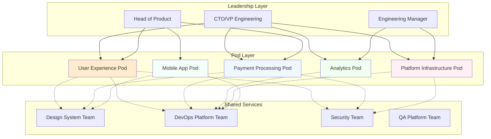

---

## 🎨 Pod Organization Patterns

### **1. Feature-Based Pod Organization**

**When to Use:** When products have distinct feature areas with clear boundaries

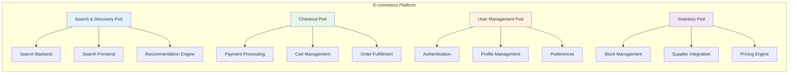

**Benefits:**

- Clear feature ownership
- Independent deployment cycles
- Specialized domain expertise
- Easier feature prioritization

**Challenges:**

- Cross-feature integration complexity
- Potential duplication of common functionality
- Coordination overhead for shared components

### **2. Customer Journey-Based Pod Organization**

**When to Use:** When user experience flows span multiple technical domains

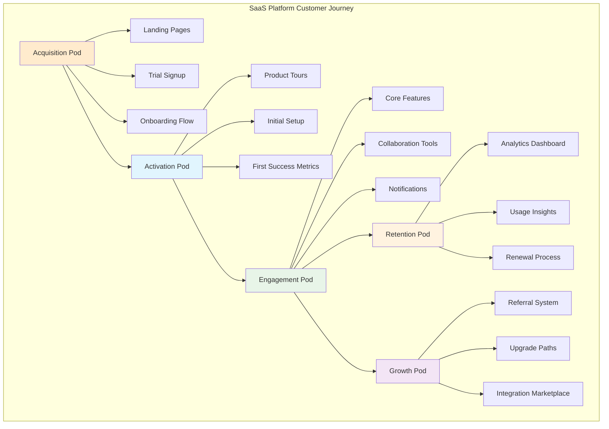

### **3. Technology Stack-Based Pod Organization**

**When to Use:** When technical specialization is more important than feature alignment

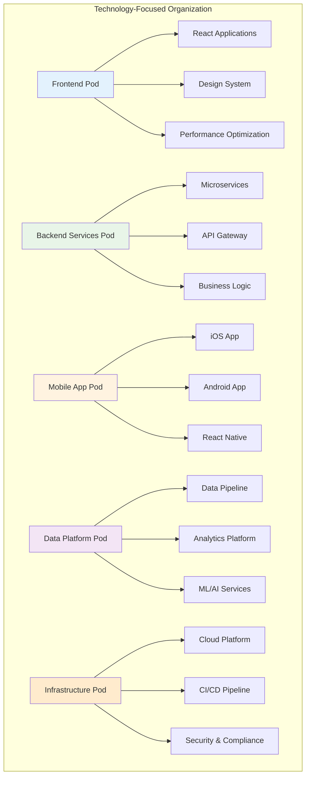

### **4. Hybrid Pod Organization (Recommended)**

**When to Use:** Most complex products benefit from a hybrid approach

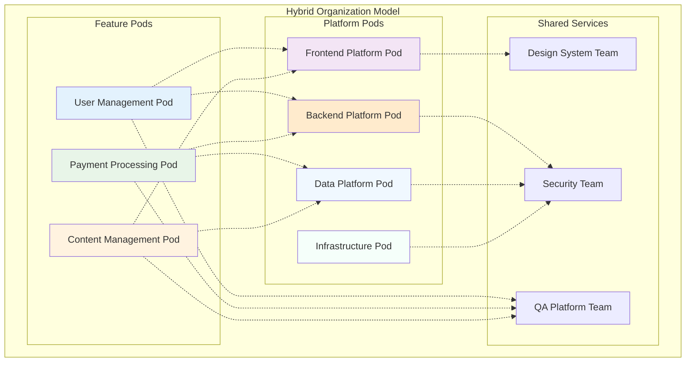

---

## 🎯 Management Principles & Best Practices

### **1. Autonomy with Alignment Principle**

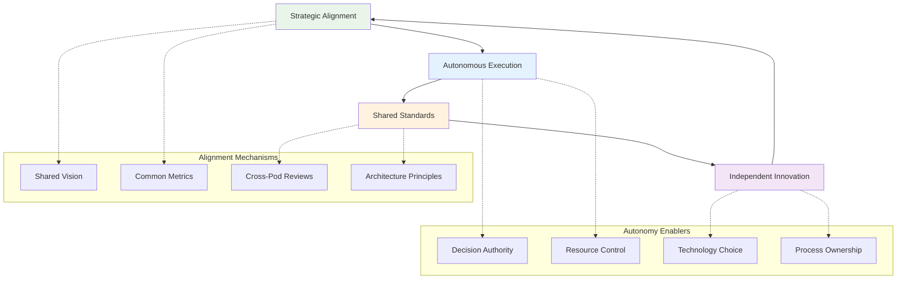

### **2. Conway's Law Management**

**Conway's Law:** "Organizations design systems that mirror their own communication structure"

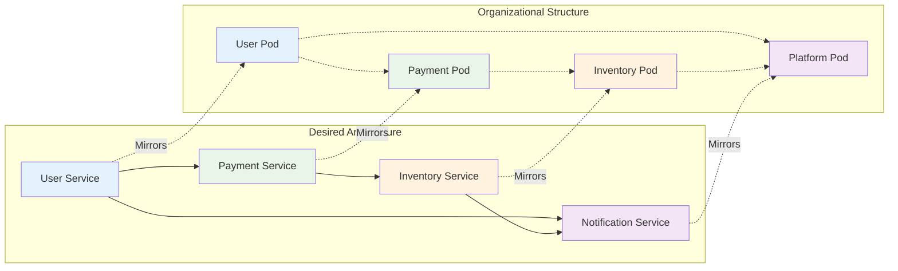

### **3. Pod Maturity Model**

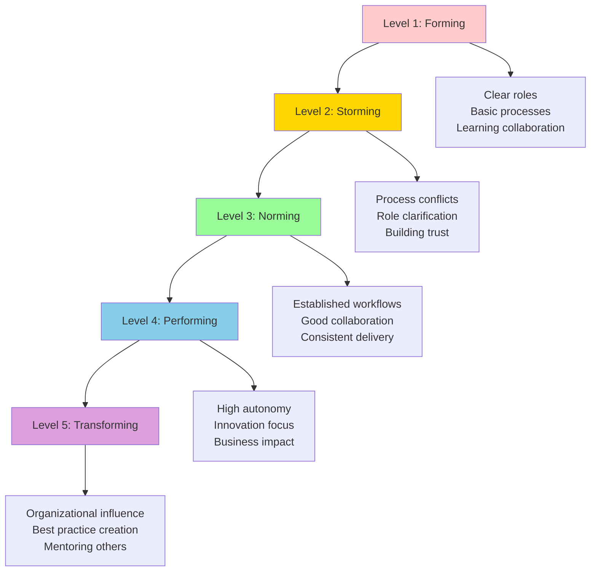

### **4. Decision-Making Framework**

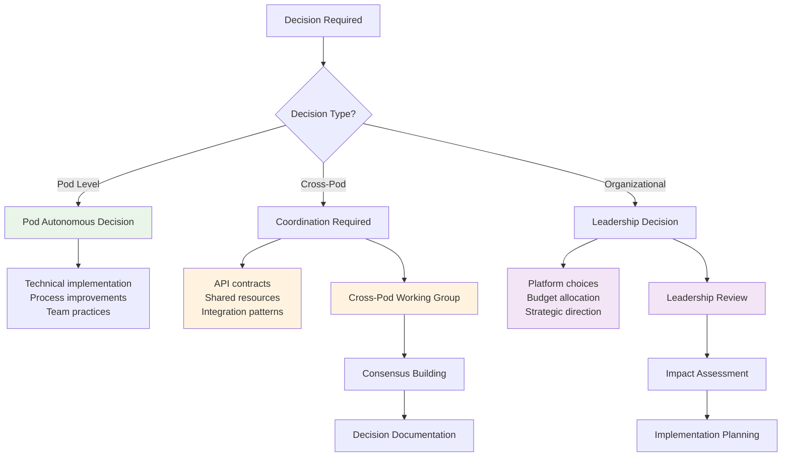

---

## 🛠️ Department-Specific Solutions

### **Frontend Development Pod Management**

#### **Structure & Responsibilities**

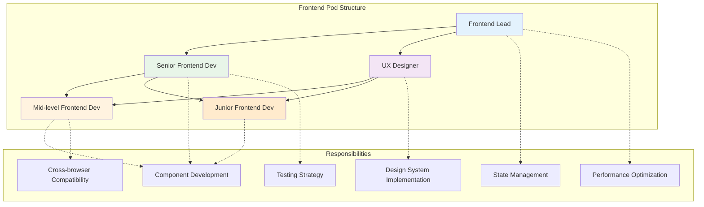

#### **Frontend Pod Best Practices**

**Component Architecture:**

```typescript
// Standardized component structure across all frontend pods
interface ComponentStructure {
  // Core component logic
  component: ReactComponent;
  // Type definitions
  types: TypeDefinitions;
  // Unit tests
  tests: TestSuite;
  // Storybook documentation
  stories: StorybookStories;
  // Style definitions
  styles: StyledComponents;
}

// Pod-level component governance
interface ComponentGovernance {
  designSystemCompliance: boolean;
  accessibilityChecks: AccessibilityReport;
  performanceMetrics: PerformanceReport;
  crossBrowserTesting: BrowserCompatibilityReport;
}
```

**Code Quality Standards:**

- **ESLint/Prettier:** Consistent code formatting across all pods
- **TypeScript:** Strict type checking for better maintainability
- **Code Review:** Minimum 2 reviewers for all PRs
- **Testing Coverage:** Minimum 80% unit test coverage
- **Performance Budget:** Bundle size limits per feature

#### **Frontend Pod Communication Pattern**

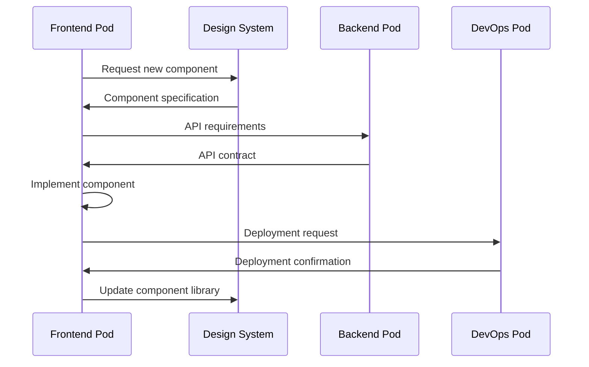

### **Backend Development Pod Management**

#### **Microservices Architecture Pattern**

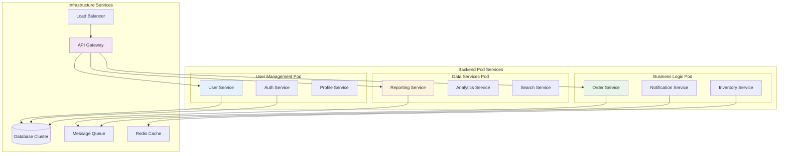

#### **Backend Pod Best Practices**

**Service Design Principles:**

```yaml
# Service Design Standards
service_standards:
  single_responsibility: "Each service owns one business capability"
  data_ownership: "Each service owns its data completely"
  api_first: "Design APIs before implementation"
  stateless: "Services should be stateless for scalability"
  fault_tolerant: "Implement circuit breakers and retries"

# API Design Standards
api_standards:
  versioning: "Semantic versioning (v1, v2, etc.)"
  documentation: "OpenAPI/Swagger specifications"
  authentication: "JWT tokens with proper scopes"
  rate_limiting: "Per-client rate limiting"
  monitoring: "Request/response logging and metrics"

# Data Management
data_standards:
  database_per_service: "No shared databases between services"
  event_sourcing: "Use events for cross-service communication"
  data_consistency: "Eventually consistent across services"
  backup_strategy: "Automated daily backups"
  migration_strategy: "Zero-downtime database migrations"
```

### **Testing Pod Management**

#### **Testing Strategy Across Pods**

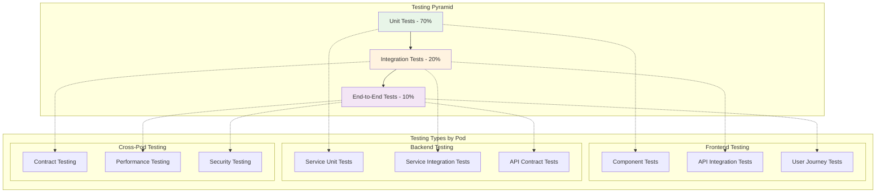

#### **Quality Assurance Framework**

**Testing Pod Responsibilities:**

```typescript
interface QAFramework {
  testStrategy: {
    unitTesting: {
      coverage: "minimum 80%";
      tools: ["Jest", "React Testing Library", "JUnit"];
      responsibility: "Individual developers";
    };
    integrationTesting: {
      apiTesting: "Postman/Newman automation";
      databaseTesting: "Test containers";
      serviceToService: "Contract testing with Pact";
    };
    e2eTesting: {
      tools: ["Cypress", "Playwright", "Selenium"];
      scenarios: "Critical user journeys";
      frequency: "Every release";
    };
  };

  qualityGates: {
    codeQuality: "SonarQube analysis required";
    security: "OWASP security scanning";
    performance: "Load testing for critical paths";
    accessibility: "WCAG 2.1 AA compliance";
  };

  testEnvironments: {
    development: "Local testing environment";
    staging: "Pre-production replica";
    uat: "User acceptance testing";
    production: "Smoke tests only";
  };
}
```

### **Database Pod Management**

#### **Database Architecture Pattern**

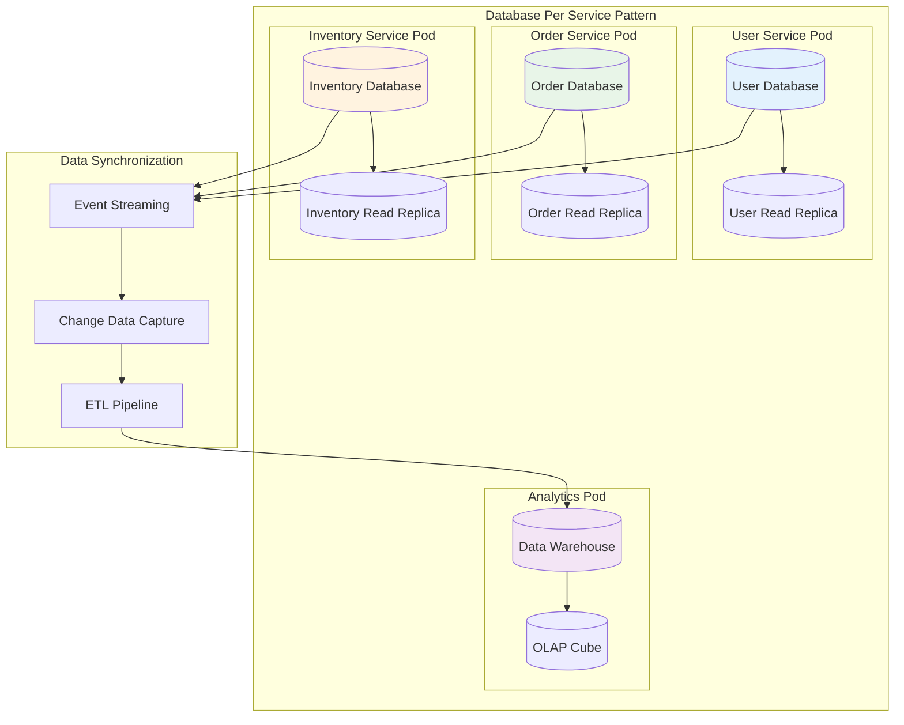

#### **Database Management Best Practices**

**Data Governance Framework:**

```sql
-- Database Standards Example
-- Naming Conventions
CREATE TABLE user_profiles (
    user_profile_id UUID PRIMARY KEY DEFAULT gen_random_uuid(),
    user_id UUID NOT NULL REFERENCES users(user_id),
    first_name VARCHAR(255) NOT NULL,
    last_name VARCHAR(255) NOT NULL,
    email VARCHAR(320) UNIQUE NOT NULL,
    created_at TIMESTAMP WITH TIME ZONE DEFAULT NOW(),
    updated_at TIMESTAMP WITH TIME ZONE DEFAULT NOW(),
    version INTEGER DEFAULT 1
);

-- Indexing Strategy
CREATE INDEX CONCURRENTLY idx_user_profiles_user_id ON user_profiles(user_id);
CREATE INDEX CONCURRENTLY idx_user_profiles_email ON user_profiles(email);

-- Data Retention Policy
CREATE TABLE audit_logs (
    -- audit fields
    created_at TIMESTAMP WITH TIME ZONE DEFAULT NOW()
) PARTITION BY RANGE (created_at);

-- Security Policies
CREATE POLICY user_profile_policy ON user_profiles
    FOR ALL TO application_role
    USING (user_id = current_setting('app.current_user_id')::UUID);
```

### **DevOps Pod Management**

#### **CI/CD Pipeline Architecture**

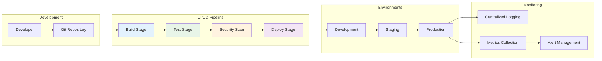

#### **Infrastructure as Code Framework**

**DevOps Pod Standards:**

```yaml
# Infrastructure Standards
infrastructure:
  cloud_provider: "AWS/Azure/GCP"
  container_platform: "Kubernetes"
  service_mesh: "Istio"
  monitoring: "Prometheus + Grafana"
  logging: "ELK Stack"
  secret_management: "Vault/AWS Secrets Manager"

# Deployment Standards
deployment:
  strategy: "Blue-Green/Canary"
  rollback_time: "< 5 minutes"
  health_checks: "Required for all services"
  resource_limits: "CPU and memory limits defined"
  scaling_policies: "Auto-scaling based on metrics"

# Security Standards
security:
  image_scanning: "Container vulnerability scanning"
  network_policies: "Kubernetes network policies"
  rbac: "Role-based access control"
  encryption: "Data encryption at rest and in transit"
  compliance: "SOC2/ISO27001 compliance"
```

### **Jenkins Pipeline Management**

#### **Multi-Pod Jenkins Pipeline**

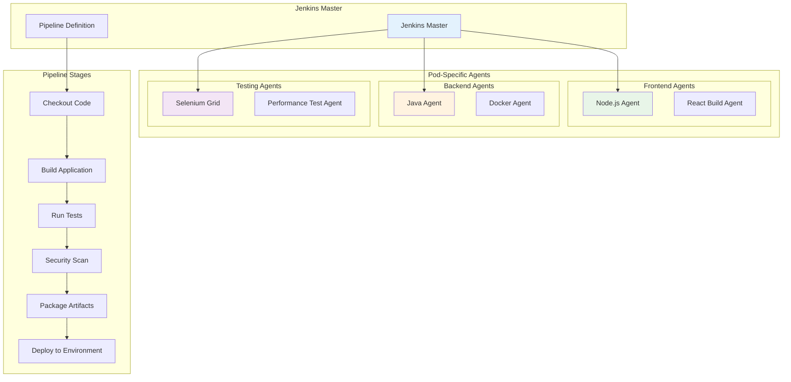

#### **Jenkins Pipeline Best Practices**

**Pipeline Configuration:**

```groovy
// Jenkinsfile for Multi-Pod Environment
pipeline {
    agent none

    environment {
        // Global environment variables
        DOCKER_REGISTRY = 'your-registry.com'
        KUBECONFIG = credentials('kubeconfig')
        SLACK_CHANNEL = '#deployments'
    }

    stages {
        stage('Checkout') {
            agent { label 'git-agent' }
            steps {
                checkout scm
                stash includes: '**/*', name: 'source-code'
            }
        }

        stage('Parallel Build') {
            parallel {
                stage('Frontend Build') {
                    agent { label 'node-agent' }
                    when { changeset "**/frontend/**" }
                    steps {
                        unstash 'source-code'
                        dir('frontend') {
                            sh 'npm ci'
                            sh 'npm run build'
                            sh 'npm run test'
                        }
                        stash includes: 'frontend/build/**', name: 'frontend-build'
                    }
                }

                stage('Backend Build') {
                    agent { label 'java-agent' }
                    when { changeset "**/backend/**" }
                    steps {
                        unstash 'source-code'
                        dir('backend') {
                            sh './gradlew clean build test'
                            sh './gradlew sonarqube'
                        }
                        stash includes: 'backend/build/**', name: 'backend-build'
                    }
                }
            }
        }

        stage('Integration Tests') {
            agent { label 'docker-agent' }
            steps {
                unstash 'source-code'
                script {
                    if (env.CHANGE_ID) {
                        // Run integration tests for PR
                        sh 'docker-compose -f docker-compose.test.yml up --abort-on-container-exit'
                    }
                }
            }
        }

        stage('Security Scanning') {
            parallel {
                stage('SAST') {
                    agent { label 'security-agent' }
                    steps {
                        sh 'sonar-scanner'
                    }
                }
                stage('Container Scanning') {
                    agent { label 'docker-agent' }
                    steps {
                        sh 'trivy image your-app:latest'
                    }
                }
            }
        }

        stage('Deploy') {
            when { branch 'main' }
            agent { label 'kubectl-agent' }
            steps {
                script {
                    // Blue-Green Deployment
                    sh '''
                        kubectl apply -f k8s/
                        kubectl rollout status deployment/your-app
                        kubectl get pods
                    '''
                }
            }
        }
    }

    post {
        success {
            slackSend(
                channel: env.SLACK_CHANNEL,
                color: 'good',
                message: ":white_check_mark: Deployment successful for ${env.JOB_NAME} - ${env.BUILD_NUMBER}"
            )
        }
        failure {
            slackSend(
                channel: env.SLACK_CHANNEL,
                color: 'danger',
                message: ":x: Deployment failed for ${env.JOB_NAME} - ${env.BUILD_NUMBER}"
            )
        }
    }
}
```

### **GitHub Management for Multi-Pod Teams**

#### **Repository Structure Strategy**

```mermaid
graph TB
    subgraph "Monorepo Strategy"
        MONO[Monorepo]

        MONO --> FRONTEND[/frontend]
        MONO --> BACKEND[/backend]
        MONO --> MOBILE[/mobile]
        MONO --> SHARED[/shared]
        MONO --> TOOLS[/tools]
        MONO --> DOCS[/docs]

        FRONTEND --> F1[/components]
        FRONTEND --> F2[/pages]
        FRONTEND --> F3[/utils]

        BACKEND --> B1[/services]
        BACKEND --> B2[/shared]
        BACKEND --> B3[/infrastructure]
    end

    subgraph "Multi-Repo Strategy"
        subgraph "Frontend Repos"
            FR1[user-management-ui]
            FR2[payment-processing-ui]
            FR3[shared-components]
        end

        subgraph "Backend Repos"
            BR1[user-service]
            BR2[payment-service]
            BR3[shared-libraries]
        end

        subgraph "Infrastructure Repos"
            IR1[k8s-manifests]
            IR2[terraform-modules]
            IR3[ci-cd-pipelines]
        end
    end

    style MONO fill:#e3f2fd
    style FR1 fill:#e8f5e8
    style BR1 fill:#fff3e0
    style IR1 fill:#f3e5f5
```

#### **Branching Strategy for Multi-Pod Teams**

```mermaid
gitgraph
    commit id: "Initial"

    branch develop
    checkout develop
    commit id: "Dev Setup"

    branch feature/user-auth
    checkout feature/user-auth
    commit id: "Auth Implementation"
    commit id: "Auth Tests"

    checkout develop
    merge feature/user-auth

    branch feature/payment-integration
    checkout feature/payment-integration
    commit id: "Payment Service"
    commit id: "Payment Tests"

    checkout develop
    merge feature/payment-integration

    branch release/v1.0.0
    checkout release/v1.0.0
    commit id: "Version Bump"
    commit id: "Release Prep"

    checkout main
    merge release/v1.0.0
    commit id: "v1.0.0" tag: "v1.0.0"

    checkout develop
    merge release/v1.0.0
```

#### **GitHub Workflow Configuration**

**Multi-Pod GitHub Actions:**

```yaml
# .github/workflows/multi-pod-ci.yml
name: Multi-Pod CI/CD

on:
  push:
    branches: [main, develop]
  pull_request:
    branches: [main]

jobs:
  detect-changes:
    runs-on: ubuntu-latest
    outputs:
      frontend: ${{ steps.changes.outputs.frontend }}
      backend: ${{ steps.changes.outputs.backend }}
      infrastructure: ${{ steps.changes.outputs.infrastructure }}
    steps:
      - uses: actions/checkout@v3
      - uses: dorny/paths-filter@v2
        id: changes
        with:
          filters: |
            frontend:
              - 'frontend/**'
            backend:
              - 'backend/**'
            infrastructure:
              - 'infrastructure/**'

  frontend-ci:
    needs: detect-changes
    if: ${{ needs.detect-changes.outputs.frontend == 'true' }}
    runs-on: ubuntu-latest
    strategy:
      matrix:
        node-version: [16.x, 18.x]
    steps:
      - uses: actions/checkout@v3
      - name: Setup Node.js
        uses: actions/setup-node@v3
        with:
          node-version: ${{ matrix.node-version }}
          cache: "npm"
          cache-dependency-path: frontend/package-lock.json

      - name: Install dependencies
        working-directory: ./frontend
        run: npm ci

      - name: Run tests
        working-directory: ./frontend
        run: npm run test:ci

      - name: Build application
        working-directory: ./frontend
        run: npm run build

      - name: Upload coverage to Codecov
        uses: codecov/codecov-action@v3
        with:
          files: ./frontend/coverage/lcov.info
          flags: frontend

  backend-ci:
    needs: detect-changes
    if: ${{ needs.detect-changes.outputs.backend == 'true' }}
    runs-on: ubuntu-latest
    services:
      postgres:
        image: postgres:13
        env:
          POSTGRES_PASSWORD: postgres
          POSTGRES_DB: test
        options: >-
          --health-cmd pg_isready
          --health-interval 10s
          --health-timeout 5s
          --health-retries 5
    steps:
      - uses: actions/checkout@v3
      - name: Setup JDK 11
        uses: actions/setup-java@v3
        with:
          java-version: "11"
          distribution: "temurin"

      - name: Cache Gradle packages
        uses: actions/cache@v3
        with:
          path: ~/.gradle/caches
          key: ${{ runner.os }}-gradle-${{ hashFiles('**/*.gradle') }}
          restore-keys: ${{ runner.os }}-gradle

      - name: Run tests
        working-directory: ./backend
        run: ./gradlew test

      - name: Run integration tests
        working-directory: ./backend
        run: ./gradlew integrationTest

      - name: Generate test report
        uses: dorny/test-reporter@v1
        if: success() || failure()
        with:
          name: Backend Tests
          path: backend/build/test-results/test/*.xml
          reporter: java-junit

  security-scan:
    runs-on: ubuntu-latest
    steps:
      - uses: actions/checkout@v3
      - name: Run Trivy vulnerability scanner
        uses: aquasecurity/trivy-action@master
        with:
          scan-type: "fs"
          scan-ref: "."
          format: "sarif"
          output: "trivy-results.sarif"

      - name: Upload Trivy scan results to GitHub Security tab
        uses: github/codeql-action/upload-sarif@v2
        with:
          sarif_file: "trivy-results.sarif"

  deploy-staging:
    needs: [frontend-ci, backend-ci, security-scan]
    if: github.ref == 'refs/heads/develop'
    runs-on: ubuntu-latest
    environment: staging
    steps:
      - uses: actions/checkout@v3
      - name: Deploy to staging
        run: |
          echo "Deploying to staging environment"
          # Add your deployment commands here

  deploy-production:
    needs: [frontend-ci, backend-ci, security-scan]
    if: github.ref == 'refs/heads/main'
    runs-on: ubuntu-latest
    environment: production
    steps:
      - uses: actions/checkout@v3
      - name: Deploy to production
        run: |
          echo "Deploying to production environment"
          # Add your production deployment commands here
```

---

## 📊 Communication & Coordination Frameworks

### **Cross-Pod Communication Patterns**

#### **Synchronous Communication**

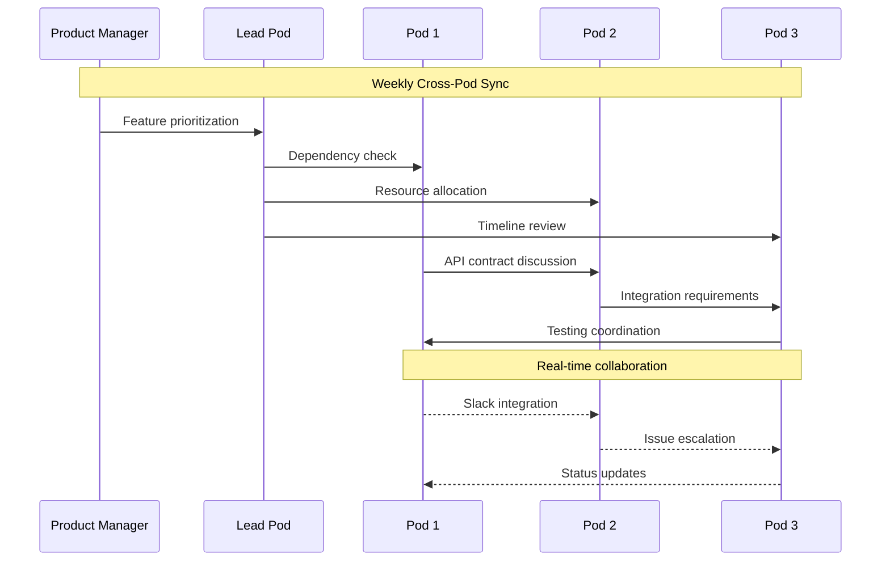

#### **Asynchronous Communication**

```mermaid
graph TB
    subgraph "Asynchronous Communication Tools"
        SLACK[Slack Channels]
        CONF[Confluence Wiki]
        JIRA[Jira Tickets]
        EMAIL[Email Updates]
        DOCS[Shared Documentation]
    end

    subgraph "Communication Types"
        DAILY[Daily Updates]
        WEEKLY[Weekly Reports]
        MONTHLY[Monthly Reviews]
        ADHOC[Ad-hoc Discussions]
    end

    subgraph "Pod Communication Channels"
        POD1[Frontend Pod Channel]
        POD2[Backend Pod Channel]
        POD3[DevOps Pod Channel]
        CROSS[Cross-Pod Channel]
        URGENT[Urgent Issues Channel]
    end

    SLACK --> POD1
    SLACK --> POD2
    SLACK --> POD3
    SLACK --> CROSS
    SLACK --> URGENT

    DAILY --> SLACK
    WEEKLY --> EMAIL
    MONTHLY --> CONF
    ADHOC --> SLACK

    style SLACK fill:#e3f2fd
    style CONF fill:#e8f5e8
    style JIRA fill:#fff3e0
    style CROSS fill:#f3e5f5
```

### **Decision Documentation Framework**

#### **Architecture Decision Records (ADRs)**

```markdown
# ADR Template for Multi-Pod Decisions

## Title: [Decision Title]

**Status:** [Proposed | Accepted | Superseded]
**Date:** [YYYY-MM-DD]
**Deciders:** [List of people involved]
**Pods Affected:** [List of affected pods]

### Context

What is the issue that we're seeing that is motivating this decision or change?

### Decision

What is the change that we're proposing or have agreed to implement?

### Consequences

What becomes easier or more difficult to do and any risks introduced by this change?

### Implementation Plan

- [ ] Phase 1: [Description]
- [ ] Phase 2: [Description]
- [ ] Phase 3: [Description]

### Affected Systems

- **Frontend:** [Impact description]
- **Backend:** [Impact description]
- **Database:** [Impact description]
- **Infrastructure:** [Impact description]

### Migration Strategy

How will we transition from the current state to the desired state?

### Success Metrics

How will we know this decision was successful?

### Rollback Plan

What's our plan if this doesn't work out?
```

### **Meeting Structure Framework**

#### **Pod Ceremony Calendar**

```mermaid
gantt
    title Multi-Pod Meeting Schedule
    dateFormat  YYYY-MM-DD
    section Daily
    Pod Standups          :daily-pod, 2024-01-01, 1d
    Cross-Pod Check-in    :daily-cross, 2024-01-01, 1d

    section Weekly
    Sprint Planning       :weekly-sprint, 2024-01-01, 7d
    Architecture Review   :weekly-arch, 2024-01-01, 7d
    Retrospectives       :weekly-retro, 2024-01-01, 7d

    section Monthly
    Pod Health Review     :monthly-health, 2024-01-01, 30d
    Technical Debt Review :monthly-debt, 2024-01-01, 30d
    Quarterly Planning    :monthly-plan, 2024-01-01, 30d

    section Quarterly
    Strategy Review       :quarterly-strategy, 2024-01-01, 90d
    Team Evaluation      :quarterly-eval, 2024-01-01, 90d
    Technology Review    :quarterly-tech, 2024-01-01, 90d
```

---

## 📈 Scaling & Evolution Strategies

### **Pod Scaling Decision Matrix**

```mermaid
graph TD
    A[Scaling Trigger] --> B{Team Size > 10?}
    B -->|Yes| C[Split Pod]
    B -->|No| D{Complexity High?}

    D -->|Yes| E[Add Specialists]
    D -->|No| F{Load High?}

    F -->|Yes| G[Add Developers]
    F -->|No| H[Optimize Current Team]

    C --> C1[Domain Split]
    C --> C2[Technology Split]
    C --> C3[Customer Journey Split]

    E --> E1[Senior Developer]
    E --> E2[Architect]
    E --> E3[Specialist Role]

    G --> G1[Junior Developer]
    G --> G2[Mid-level Developer]

    H --> H1[Process Improvement]
    H --> H2[Tool Enhancement]
    H --> H3[Skill Development]

    style A fill:#f3e5f5
    style C fill:#e8f5e8
    style E fill:#fff3e0
    style G fill:#e3f2fd
    style H fill:#ffebcd
```

### **Evolution Pathway**

```mermaid
graph LR
    A[Single Team] --> B[Multiple Teams]
    B --> C[Pod Structure]
    C --> D[Scaled Pods]
    D --> E[Platform Teams]

    A --> A1[5-8 people<br/>All skills<br/>Single product]
    B --> B1[10-20 people<br/>Specialized teams<br/>Coordination needed]
    C --> C1[20-50 people<br/>Cross-functional pods<br/>Autonomous teams]
    D --> D1[50-100 people<br/>Multiple pods<br/>Shared services]
    E --> E1[100+ people<br/>Platform thinking<br/>Enabling teams]

    style A fill:#ffcccb
    style B fill:#ffd700
    style C fill:#98fb98
    style D fill:#87ceeb
    style E fill:#dda0dd
```

---

## 🚨 Crisis Management & Problem Resolution

### **Incident Response Framework**

```mermaid
graph TD
    A[Incident Detected] --> B[Severity Assessment]

    B --> B1{Severity Level}
    B1 -->|Critical| C[Immediate Response]
    B1 -->|High| D[Urgent Response]
    B1 -->|Medium| E[Standard Response]
    B1 -->|Low| F[Planned Response]

    C --> C1[War Room Activation]
    C1 --> C2[All Hands Response]
    C2 --> C3[Executive Notification]

    D --> D1[Pod Lead Response]
    D1 --> D2[Cross-Pod Coordination]
    D2 --> D3[Stakeholder Update]

    E --> E1[Pod Team Response]
    E1 --> E2[Standard Procedures]
    E2 --> E3[Regular Updates]

    F --> F1[Individual Response]
    F1 --> F2[Documentation]
    F2 --> F3[Scheduled Fix]

    C3 --> G[Resolution & Recovery]
    D3 --> G
    E3 --> G
    F3 --> G

    G --> H[Post-Mortem]
    H --> I[Process Improvement]

    style A fill:#ff6b6b
    style C fill:#ff4757
    style D fill:#ffa502
    style E fill:#2ed573
    style F fill:#70a1ff
```

### **Post-Incident Review Process**

```markdown
# Post-Incident Review Template

## Incident Summary

**Date:** [YYYY-MM-DD]
**Duration:** [Start time] - [End time]
**Severity:** [Critical/High/Medium/Low]
**Affected Pods:** [List of pods]
**Impact:** [User impact description]

## Timeline

| Time  | Event                 | Action Taken          | Pod Responsible |
| ----- | --------------------- | --------------------- | --------------- |
| 14:00 | Alert triggered       | Investigation started | DevOps Pod      |
| 14:15 | Root cause identified | Fix implemented       | Backend Pod     |
| 14:30 | Service restored      | Monitoring continued  | All Pods        |

## Root Cause Analysis

### What Happened?

[Detailed description of the incident]

### Why Did It Happen?

[Technical root cause analysis]

### Why Wasn't It Caught Earlier?

[Process and monitoring gaps]

## Action Items

| Action Item          | Owner        | Due Date    | Priority |
| -------------------- | ------------ | ----------- | -------- |
| Improve monitoring   | DevOps Pod   | Next Sprint | High     |
| Update documentation | Backend Pod  | This Week   | Medium   |
| Add automated tests  | Frontend Pod | Next Sprint | High     |

## Lessons Learned

### What Went Well?

- Quick detection and response
- Good cross-pod communication
- Effective war room coordination

### What Could Be Improved?

- Earlier detection needed
- Better runbook documentation
- Improved monitoring coverage

## Process Improvements

1. **Monitoring Enhancement**

   - Add specific alerts for this scenario
   - Improve alert threshold tuning

2. **Documentation Updates**

   - Update incident response procedures
   - Enhance troubleshooting guides

3. **Training Needs**
   - Cross-pod incident response training
   - Tool-specific training sessions
```

---

## 🛠️ Tools & Technology Stack

### **Multi-Pod Toolchain Architecture**

```mermaid
graph TB
    subgraph "Development Tools"
        IDE[IDEs/Editors]
        VCS[Version Control]
        LOCAL[Local Development]

        IDE --> VS_CODE[VS Code]
        IDE --> INTELLIJ[IntelliJ IDEA]
        VCS --> GIT[Git]
        VCS --> GITHUB[GitHub/GitLab]
        LOCAL --> DOCKER[Docker]
        LOCAL --> K8S[Kubernetes]
    end

    subgraph "CI/CD Pipeline"
        BUILD[Build Tools]
        TEST[Testing Tools]
        DEPLOY[Deployment Tools]

        BUILD --> JENKINS[Jenkins]
        BUILD --> GITHUB_ACTIONS[GitHub Actions]
        TEST --> JEST[Jest]
        TEST --> CYPRESS[Cypress]
        TEST --> JUNIT[JUnit]
        DEPLOY --> KUBECTL[kubectl]
        DEPLOY --> HELM[Helm]
        DEPLOY --> TERRAFORM[Terraform]
    end

    subgraph "Monitoring & Observability"
        METRICS[Metrics]
        LOGGING[Logging]
        TRACING[Tracing]
        ALERTS[Alerting]

        METRICS --> PROMETHEUS[Prometheus]
        METRICS --> GRAFANA[Grafana]
        LOGGING --> ELK[ELK Stack]
        LOGGING --> FLUENTD[Fluentd]
        TRACING --> JAEGER[Jaeger]
        TRACING --> ZIPKIN[Zipkin]
        ALERTS --> ALERTMANAGER[AlertManager]
        ALERTS --> PAGERDUTY[PagerDuty]
    end

    subgraph "Communication & Collaboration"
        CHAT[Team Chat]
        DOCS[Documentation]
        PLANNING[Project Planning]

        CHAT --> SLACK[Slack]
        CHAT --> TEAMS[Microsoft Teams]
        DOCS --> CONFLUENCE[Confluence]
        DOCS --> NOTION[Notion]
        PLANNING --> JIRA[Jira]
        PLANNING --> LINEAR[Linear]
    end

    style IDE fill:#e3f2fd
    style BUILD fill:#e8f5e8
    style METRICS fill:#fff3e0
    style CHAT fill:#f3e5f5
```

### **Tool Integration Framework**

#### **Development Environment Setup**

```yaml
# development-environment.yml
version: "3.8"

services:
  # Frontend Development
  frontend-dev:
    image: node:18-alpine
    volumes:
      - ./frontend:/app
      - node_modules:/app/node_modules
    working_dir: /app
    ports:
      - "3000:3000"
    command: npm run dev
    environment:
      - NODE_ENV=development
      - API_URL=http://backend-dev:8080

  # Backend Development
  backend-dev:
    image: openjdk:11-jdk-slim
    volumes:
      - ./backend:/app
      - gradle_cache:/home/gradle/.gradle
    working_dir: /app
    ports:
      - "8080:8080"
    command: ./gradlew bootRun
    environment:
      - SPRING_PROFILES_ACTIVE=development
      - DATABASE_URL=jdbc:postgresql://postgres:5432/devdb
    depends_on:
      - postgres
      - redis

  # Database
  postgres:
    image: postgres:13
    environment:
      - POSTGRES_DB=devdb
      - POSTGRES_USER=devuser
      - POSTGRES_PASSWORD=devpass
    ports:
      - "5432:5432"
    volumes:
      - postgres_data:/var/lib/postgresql/data

  # Cache
  redis:
    image: redis:alpine
    ports:
      - "6379:6379"

  # Message Queue
  rabbitmq:
    image: rabbitmq:3-management
    ports:
      - "5672:5672"
      - "15672:15672"

volumes:
  node_modules:
  gradle_cache:
  postgres_data:
```

### **Monitoring Dashboard Configuration**

```yaml
# Grafana Dashboard for Multi-Pod Metrics
apiVersion: v1
kind: ConfigMap
metadata:
  name: grafana-dashboards
data:
  multi-pod-overview.json: |
    {
      "dashboard": {
        "title": "Multi-Pod Overview",
        "panels": [
          {
            "title": "Pod Health Status",
            "type": "stat",
            "targets": [
              {
                "expr": "sum(up{job=~'.*-pod'}) by (pod)"
              }
            ]
          },
          {
            "title": "Request Rate by Pod",
            "type": "graph",
            "targets": [
              {
                "expr": "sum(rate(http_requests_total[5m])) by (pod)"
              }
            ]
          },
          {
            "title": "Error Rate by Pod",
            "type": "graph",
            "targets": [
              {
                "expr": "sum(rate(http_requests_total{status=~'5..'}[5m])) by (pod)"
              }
            ]
          },
          {
            "title": "Response Time P95",
            "type": "graph",
            "targets": [
              {
                "expr": "histogram_quantile(0.95, sum(rate(http_request_duration_seconds_bucket[5m])) by (le, pod))"
              }
            ]
          },
          {
            "title": "Pod Resource Usage",
            "type": "graph",
            "targets": [
              {
                "expr": "sum(container_memory_usage_bytes{pod=~'.*-pod.*'}) by (pod)"
              },
              {
                "expr": "sum(rate(container_cpu_usage_seconds_total{pod=~'.*-pod.*'}[5m])) by (pod)"
              }
            ]
          }
        ]
      }
    }
```

### **Multi-Pod Testing Strategy**

```typescript
// Multi-Pod Testing Framework
interface MultiPodTestConfig {
  unitTests: {
    coverage: number;
    threshold: number;
    tools: string[];
  };

  integrationTests: {
    contractTesting: boolean;
    apiTesting: boolean;
    databaseTesting: boolean;
  };

  e2eTests: {
    crossPodFlows: boolean;
    performanceTesting: boolean;
    securityTesting: boolean;
  };
}

// Contract Testing Example
class ContractTestSuite {
  async testUserServiceContract() {
    // Test contract between Frontend Pod and User Service Pod
    const contract = await loadContract("user-service.yaml");
    const response = await callUserService("/api/users/123");

    expect(response).toMatchContract(contract);
  }

  async testPaymentServiceContract() {
    // Test contract between Payment Pod and External Payment Provider
    const contract = await loadContract("payment-provider.yaml");
    const response = await callPaymentProvider("/process-payment");

    expect(response).toMatchContract(contract);
  }
}

// Cross-Pod Integration Test
class CrossPodIntegrationTests {
  async testUserRegistrationFlow() {
    // Test flow across multiple pods
    const user = await createUser(); // User Management Pod
    const profile = await createProfile(user.id); // Profile Pod
    const notification = await sendWelcomeEmail(user.email); // Notification Pod

    expect(user).toBeDefined();
    expect(profile.userId).toBe(user.id);
    expect(notification.status).toBe("sent");
  }

  async testOrderProcessingFlow() {
    // Test e-commerce order flow
    const cart = await addItemToCart(); // Shopping Cart Pod
    const order = await processOrder(cart); // Order Processing Pod
    const payment = await processPayment(order); // Payment Pod
    const shipment = await createShipment(order); // Fulfillment Pod

    expect(order.status).toBe("confirmed");
    expect(payment.status).toBe("completed");
    expect(shipment.trackingNumber).toBeDefined();
  }
}
```

---

## 📋 **Conclusion & Best Practices Summary**

### **Key Success Factors for Multi-Pod Management**

1. **Clear Boundaries**: Well-defined pod responsibilities and interfaces
2. **Autonomous Operation**: Pods can make decisions and deploy independently
3. **Shared Standards**: Common tools, practices, and quality gates
4. **Effective Communication**: Both synchronous and asynchronous channels
5. **Continuous Improvement**: Regular retrospectives and process evolution
6. **Monitoring & Observability**: Comprehensive visibility across all pods
7. **Crisis Management**: Prepared incident response and recovery procedures

### **Implementation Roadmap**

```mermaid
gantt
    title Multi-Pod Implementation Timeline
    dateFormat  YYYY-MM-DD
    section Phase 1: Foundation
    Team Formation          :p1-team, 2024-01-01, 30d
    Tool Setup             :p1-tools, 2024-01-15, 45d
    Process Definition     :p1-process, 2024-01-01, 60d

    section Phase 2: Scaling
    Pod Multiplication     :p2-pods, 2024-03-01, 60d
    Cross-Pod Integration  :p2-integration, 2024-04-01, 45d
    Advanced Monitoring    :p2-monitoring, 2024-03-15, 45d

    section Phase 3: Optimization
    Performance Tuning     :p3-perf, 2024-05-15, 30d
    Process Refinement     :p3-process, 2024-06-01, 30d
    Knowledge Sharing      :p3-knowledge, 2024-06-15, 30d

    section Phase 4: Excellence
    Continuous Improvement :p4-improvement, 2024-07-15, 90d
    Innovation Culture     :p4-innovation, 2024-08-01, 90d
    Scaling Preparation    :p4-scaling, 2024-09-01, 60d
```

This comprehensive guide provides the framework, tools, and practices needed to successfully manage multiple development pods while maintaining efficiency, quality, and team satisfaction. Regular review and adaptation of these practices based on your specific context and challenges will ensure continued success in your multi-pod environment.
