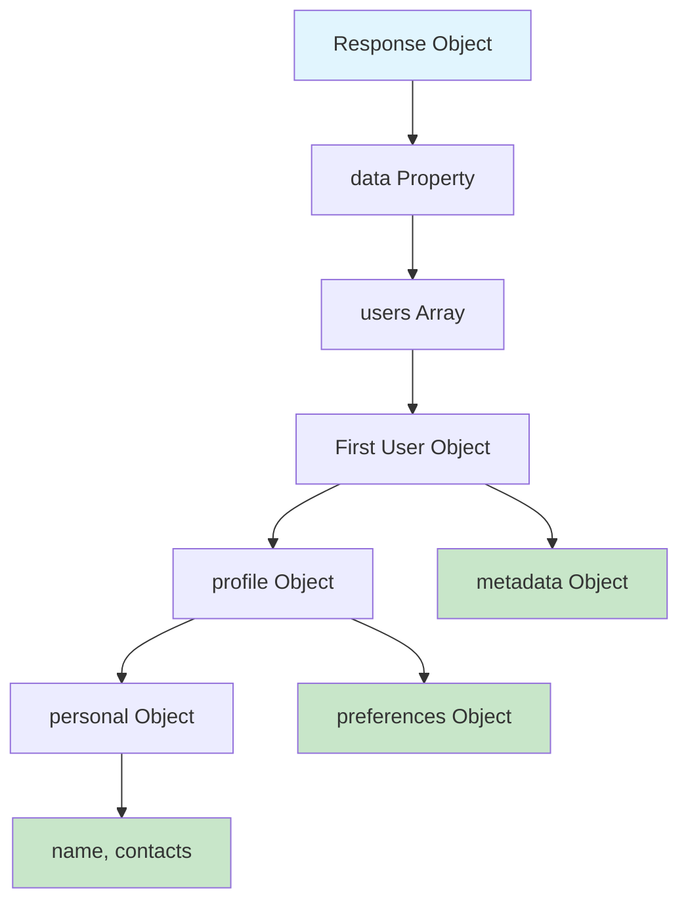
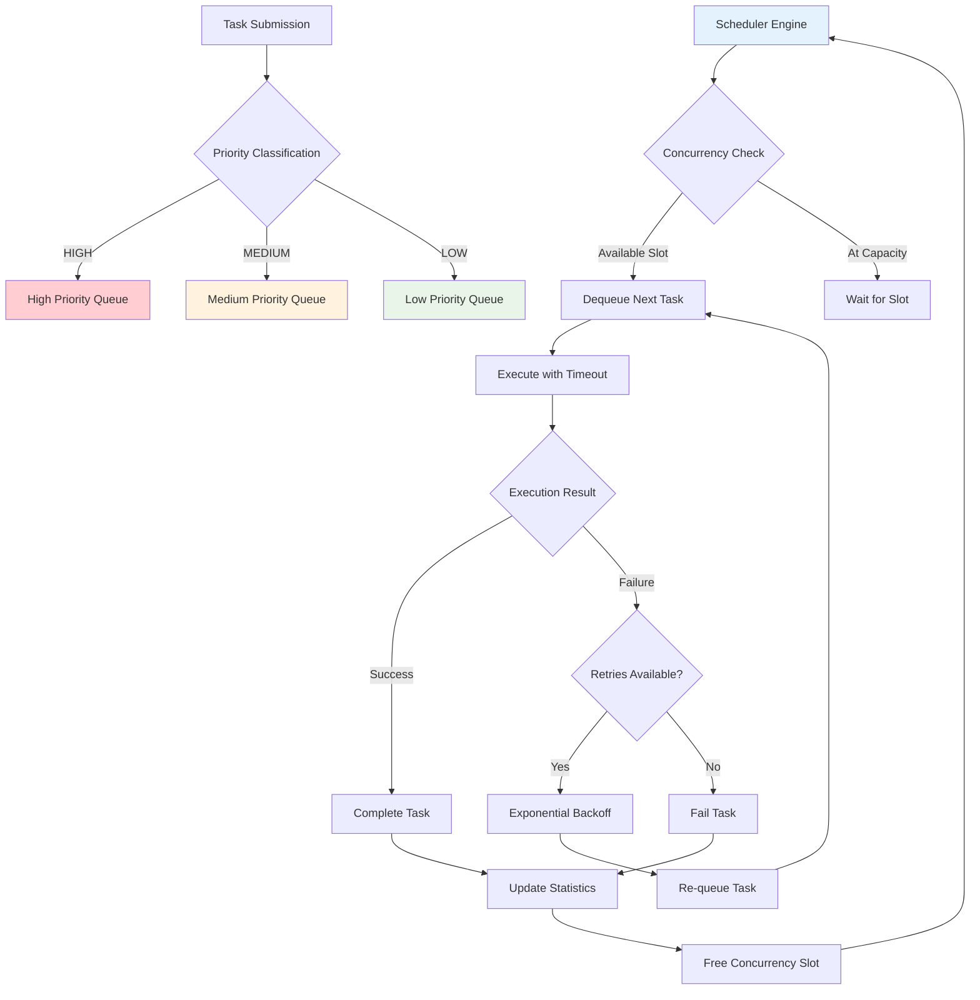
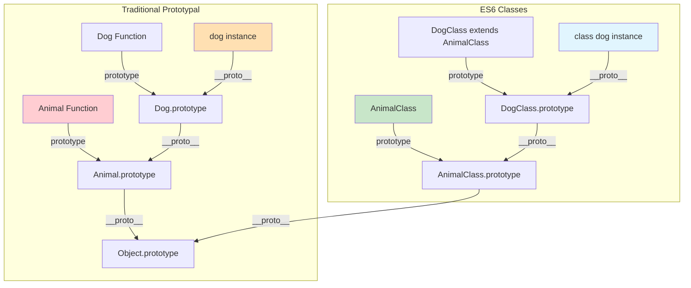
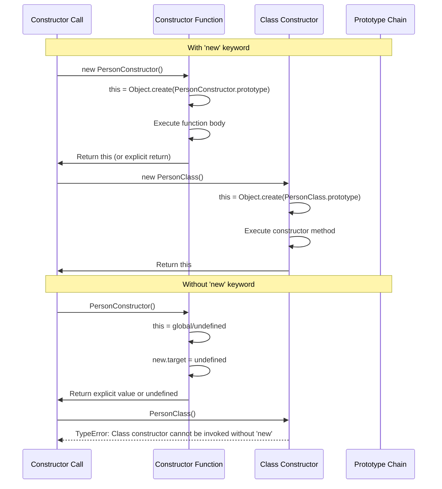
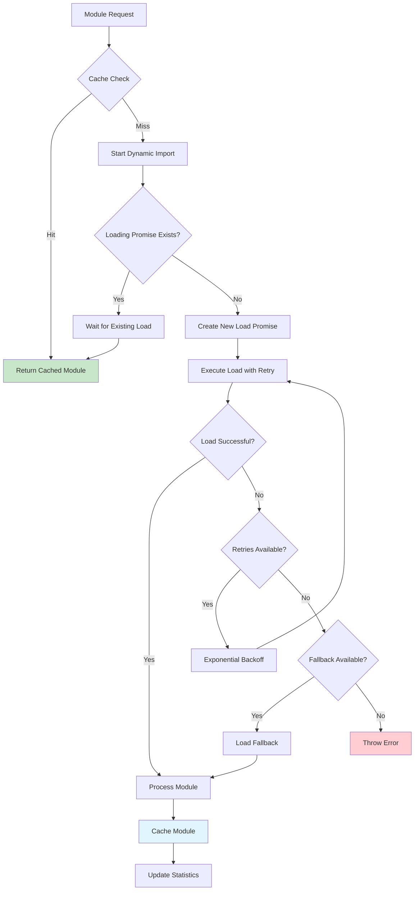
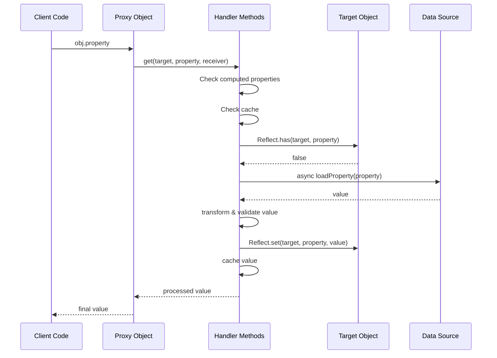
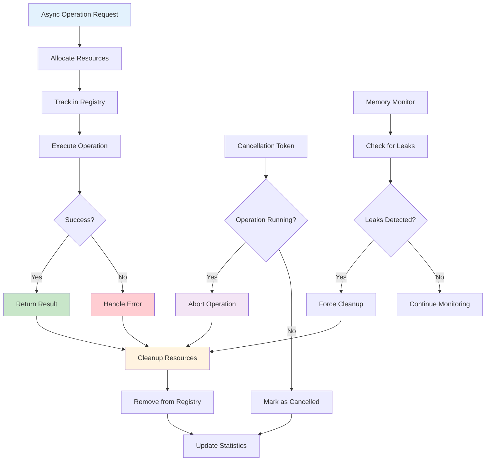

# JavaScript 2015 (ES6) & ES7 Ultra Senior Code Questions

## 🎯 **Advanced JavaScript Interview Guide for 15+ Years Experience**

### Table of Contents

1. [ES6 Core Features Questions](#es6-core-features-questions)
2. [Advanced Async Programming](#advanced-async-programming)
3. [Module System & Import/Export](#module-system--importexport)
4. [Advanced Object Patterns](#advanced-object-patterns)
5. [Proxy & Reflection](#proxy--reflection)
6. [Symbol & Well-Known Symbols](#symbol--well-known-symbols)
7. [ES7 Features](#es7-features)
8. [Memory Management & Performance](#memory-management--performance)

---

## ES6 Core Features Questions

### **Question 1: Advanced Destructuring with Complex Patterns**

**🔥 Challenge:** Write a function that extracts and transforms deeply nested data using destructuring.

```javascript
// Given this complex nested structure
const apiResponse = {
  status: "success",
  data: {
    users: [
      {
        id: 1,
        profile: {
          personal: {
            name: { first: "John", last: "Doe" },
            contacts: {
              emails: ["john@work.com", "john@personal.com"],
              phones: ["+1-555-0123", "+1-555-0456"],
            },
          },
          preferences: {
            theme: "dark",
            notifications: { email: true, sms: false },
          },
        },
        metadata: { created: "2023-01-15", role: "admin" },
      },
    ],
    pagination: { page: 1, total: 100, hasMore: true },
  },
};

// Write a function using destructuring to extract and format user data
function extractUserInfo(response) {
  // Your implementation here
}

// Expected output format:
// {
//   fullName: 'John Doe',
//   primaryEmail: 'john@work.com',
//   primaryPhone: '+1-555-0123',
//   isAdmin: true,
//   canReceiveEmail: true,
//   userTheme: 'dark'
// }
```

**💡 Solution with Line-by-Line Explanation:**

```javascript
function extractUserInfo(response) {
  // Line 1: Destructure the main response structure
  const {
    data: {
      // Line 2: Extract users array from nested data object
      users: [
        // Line 3: Destructure first user object (index 0)
        {
          // Line 4-8: Extract deeply nested profile information
          profile: {
            personal: {
              // Line 5: Destructure name object with renaming
              name: { first: firstName, last: lastName },
              // Line 6: Extract first email and phone from arrays
              contacts: {
                emails: [primaryEmail], // Gets first element
                phones: [primaryPhone], // Gets first element
              },
            },
            // Line 7-10: Extract preferences with nested destructuring
            preferences: {
              theme: userTheme,
              notifications: { email: canReceiveEmail },
            },
          },
          // Line 11: Extract metadata with default handling
          metadata: { role = "user" },
        },
      ],
    },
  } = response;

  // Line 12-19: Return formatted object using extracted values
  return {
    fullName: `${firstName} ${lastName}`, // Line 13: Template literal combination
    primaryEmail, // Line 14: Shorthand property (ES6)
    primaryPhone, // Line 15: Shorthand property
    isAdmin: role === "admin", // Line 16: Boolean transformation
    canReceiveEmail, // Line 17: Direct boolean value
    userTheme, // Line 18: Shorthand property
  };
}

// Usage demonstration
console.log(extractUserInfo(apiResponse));
```

**🧠 Theoretical Explanation:**

**Destructuring Assignment Pattern Matching:**



**Key Concepts:**

- **Pattern Matching:** Destructuring uses structural pattern matching to extract values
- **Renaming During Destructuring:** `{ first: firstName }` syntax
- **Array Destructuring:** `[primaryEmail]` extracts first element
- **Default Values:** `role = 'user'` provides fallback
- **Nested Destructuring:** Deep object access in single operation

---

### **Question 2: Generator Functions with Complex State Management**

**🔥 Challenge:** Implement a stateful iterator that manages a finite state machine using generators.

```javascript
// Implement a traffic light system using generators
// States: RED (30s) -> GREEN (45s) -> YELLOW (5s) -> RED
// Should track time, allow manual control, and handle state transitions

class TrafficLightSystem {
  constructor() {
    // Initialize your generator-based system
  }

  next() {
    // Advance to next state
  }

  getCurrentState() {
    // Return current state and remaining time
  }

  forceState(state) {
    // Manually override current state
  }

  getStatistics() {
    // Return state transition history
  }
}

// Usage should work like this:
const traffic = new TrafficLightSystem();
console.log(traffic.getCurrentState()); // { state: 'RED', timeRemaining: 30, cycleCount: 0 }
traffic.next();
console.log(traffic.getCurrentState()); // { state: 'GREEN', timeRemaining: 45, cycleCount: 0 }
```

**💡 Solution with Line-by-Line Explanation:**

```javascript
class TrafficLightSystem {
  constructor() {
    // Line 1: Initialize state tracking properties
    this.currentGenerator = null; // Stores active generator instance
    this.stateHistory = []; // Tracks all state transitions
    this.cycleCount = 0; // Complete cycle counter
    this.isManualOverride = false; // Manual control flag

    // Line 2: Initialize the generator system
    this.restart();
  }

  // Line 3: Generator function defining state machine logic
  *trafficLightStateMachine() {
    while (true) {
      // Line 4: Infinite state machine loop
      // RED state
      this.logStateTransition("RED", 30); // Line 5: Record state change
      yield { state: "RED", timeRemaining: 30, cycleCount: this.cycleCount };

      // GREEN state
      this.logStateTransition("GREEN", 45); // Line 6: Record state change
      yield { state: "GREEN", timeRemaining: 45, cycleCount: this.cycleCount };

      // YELLOW state
      this.logStateTransition("YELLOW", 5); // Line 7: Record state change
      yield { state: "YELLOW", timeRemaining: 5, cycleCount: this.cycleCount };

      // Line 8: Increment cycle after complete RED->GREEN->YELLOW sequence
      this.cycleCount++;
    }
  }

  // Line 9: Helper method to track state transitions
  logStateTransition(state, duration) {
    const transition = {
      state, // Line 10: Current state name
      duration, // Line 11: State duration in seconds
      timestamp: new Date().toISOString(), // Line 12: ISO timestamp
      cycleCount: this.cycleCount, // Line 13: Current cycle number
      wasManual: this.isManualOverride, // Line 14: Manual override flag
    };

    this.stateHistory.push(transition); // Line 15: Add to history array
    this.isManualOverride = false; // Line 16: Reset manual flag
  }

  // Line 17: Advance to next state in sequence
  next() {
    if (!this.currentGenerator) {
      // Line 18: Safety check for generator
      throw new Error("Traffic light system not initialized");
    }

    const result = this.currentGenerator.next(); // Line 19: Get next state from generator

    if (result.done) {
      // Line 20: Handle generator completion
      this.restart(); // Line 21: Restart if generator finished
      return this.currentGenerator.next().value; // Line 22: Return first state of new cycle
    }

    return result.value; // Line 23: Return current state data
  }

  // Line 24: Get current state without advancing
  getCurrentState() {
    if (!this.currentGenerator) {
      // Line 25: Initialize if needed
      this.restart();
    }

    // Line 26: Use generator's current value or get first state
    const result = this.currentGenerator.next();
    return result.value;
  }

  // Line 27: Force specific state (manual override)
  forceState(targetState) {
    const validStates = ["RED", "GREEN", "YELLOW"]; // Line 28: Define valid states

    if (!validStates.includes(targetState)) {
      // Line 29: Validate input
      throw new Error(`Invalid state: ${targetState}`);
    }

    this.isManualOverride = true; // Line 30: Set manual flag

    // Line 31: Create new generator starting from target state
    this.currentGenerator = this.createStateGenerator(targetState);

    return this.next(); // Line 32: Return new state
  }

  // Line 33: Helper to create generator from specific state
  *createStateGenerator(startState) {
    const states = ["RED", "GREEN", "YELLOW"]; // Line 34: State sequence
    const durations = [30, 45, 5]; // Line 35: Corresponding durations

    // Line 36: Find starting index
    let startIndex = states.indexOf(startState);

    while (true) {
      // Line 37: Infinite loop for continuous operation
      for (let i = 0; i < states.length; i++) {
        // Line 38: Cycle through all states
        const index = (startIndex + i) % states.length; // Line 39: Circular array access
        const state = states[index]; // Line 40: Get state name
        const duration = durations[index]; // Line 41: Get state duration

        this.logStateTransition(state, duration); // Line 42: Record transition
        yield {
          state,
          timeRemaining: duration,
          cycleCount: this.cycleCount,
        }; // Line 43: Yield state object
      }
      this.cycleCount++; // Line 44: Increment after full cycle
      startIndex = 0; // Line 45: Reset to normal sequence
    }
  }

  // Line 46: Restart generator system
  restart() {
    this.currentGenerator = this.trafficLightStateMachine(); // Line 47: Create new generator
  }

  // Line 48: Return state transition statistics
  getStatistics() {
    const stats = {
      totalTransitions: this.stateHistory.length, // Line 49: Count all transitions
      completeCycles: this.cycleCount, // Line 50: Complete cycle count
      stateFrequency: {}, // Line 51: State occurrence count
      averageCycleTime: 0, // Line 52: Average cycle duration
      manualOverrides: 0, // Line 53: Manual intervention count
    };

    // Line 54: Calculate state frequencies and manual overrides
    this.stateHistory.forEach((transition) => {
      // Line 55: Count state occurrences
      stats.stateFrequency[transition.state] =
        (stats.stateFrequency[transition.state] || 0) + 1;

      // Line 56: Count manual overrides
      if (transition.wasManual) {
        stats.manualOverrides++;
      }
    });

    // Line 57: Calculate average cycle time if we have complete cycles
    if (this.cycleCount > 0) {
      const totalDuration = Object.keys(stats.stateFrequency).reduce(
        (total, state) => {
          const count = stats.stateFrequency[state];
          const stateDuration = { RED: 30, GREEN: 45, YELLOW: 5 }[state];
          return total + count * stateDuration;
        },
        0
      );

      stats.averageCycleTime = totalDuration / this.cycleCount; // Line 58: Average calculation
    }

    return stats; // Line 59: Return statistics object
  }
}

// Usage demonstration with detailed output
const traffic = new TrafficLightSystem();

console.log("Initial State:", traffic.getCurrentState());
// Output: { state: 'RED', timeRemaining: 30, cycleCount: 0 }

console.log("Next State:", traffic.next());
// Output: { state: 'GREEN', timeRemaining: 45, cycleCount: 0 }

console.log("Force to YELLOW:", traffic.forceState("YELLOW"));
// Output: { state: 'YELLOW', timeRemaining: 5, cycleCount: 0 }

console.log("Statistics:", traffic.getStatistics());
// Output: Complete statistics with state frequencies and manual override count
```

**🧠 Theoretical Explanation:**

**Generator State Machine Architecture:**

```mermaid
stateDiagram-v2
    [*] --> RED
    RED --> GREEN: next() called
    GREEN --> YELLOW: next() called
    YELLOW --> RED: next() called (cycle++)

    RED --> YELLOW: forceState('YELLOW')
    RED --> GREEN: forceState('GREEN')
    GREEN --> RED: forceState('RED')
    GREEN --> YELLOW: forceState('YELLOW')
    YELLOW --> RED: forceState('RED')
    YELLOW --> GREEN: forceState('GREEN')

    note right of RED: Duration: 30s
    note right of GREEN: Duration: 45s
    note right of YELLOW: Duration: 5s
```

**Key Advanced Concepts:**

- **Generator Functions as State Machines:** Generators maintain internal state between calls
- **Yield Expressions:** Pause execution and return values while preserving context
- **Infinite Generators:** `while(true)` creates continuous state machines
- **Generator Composition:** Multiple generators can work together
- **State Persistence:** Generator maintains state across function calls

---

### **Question 3: Advanced Promise Patterns and Custom Schedulers**

**🔥 Challenge:** Implement a sophisticated promise scheduler with priority queues, concurrency limits, and error recovery.

```javascript
// Implement a PriorityPromiseScheduler that:
// 1. Executes promises with priority (HIGH, MEDIUM, LOW)
// 2. Limits concurrent execution
// 3. Implements retry logic with exponential backoff
// 4. Provides comprehensive monitoring and statistics
// 5. Supports promise cancellation

class PriorityPromiseScheduler {
  constructor(maxConcurrency = 3) {
    // Initialize scheduler with concurrency control
  }

  schedule(promiseFactory, options = {}) {
    // Add promise to queue with priority and options
    // Return promise that resolves when scheduled promise completes
  }

  cancel(taskId) {
    // Cancel a scheduled or running task
  }

  getStatistics() {
    // Return comprehensive execution statistics
  }

  pause() {
    // Pause scheduler execution
  }

  resume() {
    // Resume scheduler execution
  }
}

// Usage example:
const scheduler = new PriorityPromiseScheduler(2);

// High priority task
scheduler.schedule(() => fetch("/api/critical-data"), {
  priority: "HIGH",
  retries: 3,
  timeout: 5000,
});

// Medium priority with custom retry
scheduler.schedule(() => processLargeFile(), {
  priority: "MEDIUM",
  retries: 2,
  backoffMultiplier: 2,
});
```

**💡 Solution with Line-by-Line Explanation:**

```javascript
class PriorityPromiseScheduler {
  constructor(maxConcurrency = 3) {
    // Line 1-8: Initialize core scheduler properties
    this.maxConcurrency = maxConcurrency; // Maximum concurrent executions
    this.currentConcurrency = 0; // Currently running tasks
    this.queues = {
      // Priority-based queue system
      HIGH: [], // High priority queue
      MEDIUM: [], // Medium priority queue
      LOW: [], // Low priority queue
    };

    // Line 9-15: Initialize tracking and control systems
    this.runningTasks = new Map(); // Active task tracking
    this.completedTasks = []; // Completed task history
    this.taskIdCounter = 0; // Unique task ID generator
    this.isPaused = false; // Scheduler pause state
    this.statistics = {
      // Performance metrics
      totalScheduled: 0, // Total tasks scheduled
      totalCompleted: 0, // Total tasks completed
      totalFailed: 0, // Total tasks failed
      totalCancelled: 0, // Total tasks cancelled
      totalRetries: 0, // Total retry attempts
      averageExecutionTime: 0, // Average task duration
      queueWaitTimes: { HIGH: [], MEDIUM: [], LOW: [] }, // Queue wait time tracking
    };

    // Line 16: Start the scheduler processing loop
    this.startProcessing();
  }

  // Line 17: Main task scheduling method
  schedule(promiseFactory, options = {}) {
    // Line 18-25: Parse and validate options with defaults
    const {
      priority = "MEDIUM", // Default priority level
      retries = 0, // Number of retry attempts
      timeout = 30000, // Task timeout in milliseconds
      backoffMultiplier = 1.5, // Exponential backoff multiplier
      onProgress = () => {}, // Progress callback
      onRetry = () => {}, // Retry callback
      signal = null, // AbortSignal for cancellation
    } = options;

    // Line 26: Generate unique task identifier
    const taskId = ++this.taskIdCounter;

    // Line 27-39: Create comprehensive task object
    const task = {
      id: taskId, // Unique identifier
      promiseFactory, // Factory function to create promise
      priority, // Task priority level
      retries, // Maximum retry attempts
      remainingRetries: retries, // Current remaining retries
      timeout, // Task timeout duration
      backoffMultiplier, // Retry delay multiplier
      onProgress, // Progress reporting callback
      onRetry, // Retry event callback
      signal, // Cancellation signal
      scheduledAt: Date.now(), // Task creation timestamp
      startedAt: null, // Execution start timestamp
      completedAt: null, // Execution completion timestamp
      attempts: 0, // Number of execution attempts
      lastError: null, // Last encountered error
      status: "QUEUED", // Current task status
    };

    // Line 40-46: Create promise that resolves when task completes
    const taskPromise = new Promise((resolve, reject) => {
      task.resolve = resolve; // Store resolve function
      task.reject = reject; // Store reject function

      // Line 41-45: Handle cancellation if AbortSignal provided
      if (signal) {
        signal.addEventListener("abort", () => {
          this.cancel(taskId); // Cancel task on abort signal
        });
      }
    });

    // Line 46-48: Add task to appropriate priority queue
    this.queues[priority].push(task);
    this.statistics.totalScheduled++; // Update statistics

    // Line 49: Trigger processing (if not paused)
    this.processNextTask();

    // Line 50: Return promise that resolves when task completes
    return { taskId, promise: taskPromise };
  }

  // Line 51: Asynchronous task processing engine
  async processNextTask() {
    // Line 52-53: Exit conditions
    if (this.isPaused || this.currentConcurrency >= this.maxConcurrency) {
      return; // Don't process if paused or at capacity
    }

    // Line 54: Get next highest priority task
    const task = this.getNextTask();
    if (!task) return; // No tasks available

    // Line 55-57: Update concurrency and task status
    this.currentConcurrency++;
    task.status = "RUNNING";
    task.startedAt = Date.now();
    task.attempts++;

    // Line 58: Track running task
    this.runningTasks.set(task.id, task);

    try {
      // Line 59-61: Execute task with timeout and cancellation support
      const result = await this.executeTaskWithTimeout(task);

      // Line 62-68: Handle successful completion
      task.status = "COMPLETED";
      task.completedAt = Date.now();
      this.statistics.totalCompleted++;
      this.updateAverageExecutionTime(task);

      // Line 63: Resolve the task promise
      task.resolve(result);
    } catch (error) {
      // Line 64-72: Handle task failure
      task.lastError = error;

      // Line 65-71: Retry logic with exponential backoff
      if (task.remainingRetries > 0 && !this.isCancellationError(error)) {
        await this.retryTask(task); // Attempt retry
      } else {
        // Line 66-70: Final failure handling
        task.status = "FAILED";
        task.completedAt = Date.now();
        this.statistics.totalFailed++;
        task.reject(error); // Reject task promise
      }
    } finally {
      // Line 71-75: Cleanup and continue processing
      this.runningTasks.delete(task.id); // Remove from running tasks
      this.completedTasks.push(task); // Add to completed history
      this.currentConcurrency--; // Decrease concurrency counter

      // Line 72: Process next task if available
      setImmediate(() => this.processNextTask());
    }
  }

  // Line 73: Execute task with timeout wrapper
  async executeTaskWithTimeout(task) {
    // Line 74-79: Create timeout promise
    const timeoutPromise = new Promise((_, reject) => {
      setTimeout(() => {
        reject(new Error(`Task ${task.id} timed out after ${task.timeout}ms`));
      }, task.timeout);
    });

    // Line 80-85: Create cancellation-aware promise
    const taskExecution = new Promise(async (resolve, reject) => {
      try {
        // Line 81: Check for cancellation before execution
        if (task.signal?.aborted) {
          throw new Error("Task was cancelled");
        }

        // Line 82-83: Execute the actual task
        const result = await task.promiseFactory();
        resolve(result);
      } catch (error) {
        reject(error); // Line 84: Propagate task errors
      }
    });

    // Line 85: Race between task execution and timeout
    return Promise.race([taskExecution, timeoutPromise]);
  }

  // Line 86: Retry failed task with exponential backoff
  async retryTask(task) {
    // Line 87-89: Calculate delay and update retry state
    const delay = Math.pow(task.backoffMultiplier, task.attempts - 1) * 1000;
    task.remainingRetries--;
    this.statistics.totalRetries++;

    // Line 90: Notify about retry attempt
    task.onRetry({
      taskId: task.id,
      attempt: task.attempts,
      delay,
      error: task.lastError,
    });

    // Line 91-94: Implement delay before retry
    await new Promise((resolve) => setTimeout(resolve, delay));

    // Line 95: Re-queue task for retry (maintain priority)
    task.status = "QUEUED";
    this.queues[task.priority].unshift(task); // Add to front of queue

    // Line 96: Trigger immediate processing
    setImmediate(() => this.processNextTask());
  }

  // Line 97: Get next highest priority task from queues
  getNextTask() {
    // Line 98-102: Check queues in priority order
    const priorities = ["HIGH", "MEDIUM", "LOW"];

    for (const priority of priorities) {
      if (this.queues[priority].length > 0) {
        const task = this.queues[priority].shift(); // Remove from queue

        // Line 99-101: Calculate and record queue wait time
        const waitTime = Date.now() - task.scheduledAt;
        this.statistics.queueWaitTimes[priority].push(waitTime);

        return task; // Line 102: Return next task
      }
    }

    return null; // Line 103: No tasks available
  }

  // Line 104: Cancel a scheduled or running task
  cancel(taskId) {
    // Line 105-109: Find task in queues
    for (const priority in this.queues) {
      const queueIndex = this.queues[priority].findIndex(
        (task) => task.id === taskId
      );
      if (queueIndex !== -1) {
        const task = this.queues[priority][queueIndex];
        this.queues[priority].splice(queueIndex, 1); // Remove from queue
        task.status = "CANCELLED";
        task.reject(new Error("Task was cancelled"));
        this.statistics.totalCancelled++;
        return true; // Line 106: Successfully cancelled
      }
    }

    // Line 107-111: Handle running task cancellation
    const runningTask = this.runningTasks.get(taskId);
    if (runningTask) {
      runningTask.status = "CANCELLING"; // Mark for cancellation
      // Note: Actual cancellation depends on promise implementation
      return true;
    }

    return false; // Line 112: Task not found
  }

  // Line 113: Get comprehensive scheduler statistics
  getStatistics() {
    // Line 114-124: Calculate derived statistics
    const totalProcessed =
      this.statistics.totalCompleted +
      this.statistics.totalFailed +
      this.statistics.totalCancelled;

    const queueSizes = {
      HIGH: this.queues.HIGH.length,
      MEDIUM: this.queues.MEDIUM.length,
      LOW: this.queues.LOW.length,
    };

    const averageWaitTimes = {};
    for (const priority in this.statistics.queueWaitTimes) {
      const times = this.statistics.queueWaitTimes[priority];
      averageWaitTimes[priority] =
        times.length > 0 ? times.reduce((a, b) => a + b, 0) / times.length : 0;
    }

    // Line 115-130: Return comprehensive statistics
    return {
      concurrency: {
        current: this.currentConcurrency,
        maximum: this.maxConcurrency,
        utilizationPercent:
          (this.currentConcurrency / this.maxConcurrency) * 100,
      },
      tasks: {
        scheduled: this.statistics.totalScheduled,
        running: this.runningTasks.size,
        completed: this.statistics.totalCompleted,
        failed: this.statistics.totalFailed,
        cancelled: this.statistics.totalCancelled,
        queued: Object.values(queueSizes).reduce((a, b) => a + b, 0),
      },
      performance: {
        averageExecutionTime: this.statistics.averageExecutionTime,
        totalRetries: this.statistics.totalRetries,
        successRate:
          totalProcessed > 0
            ? (this.statistics.totalCompleted / totalProcessed) * 100
            : 0,
      },
      queues: {
        sizes: queueSizes,
        averageWaitTimes,
      },
      status: this.isPaused ? "PAUSED" : "RUNNING",
    };
  }

  // Line 131-134: Control methods
  pause() {
    this.isPaused = true;
  }

  resume() {
    this.isPaused = false;
    this.processNextTask(); // Resume processing
  }

  // Line 135-143: Helper methods
  updateAverageExecutionTime(task) {
    const executionTime = task.completedAt - task.startedAt;
    const totalCompleted = this.statistics.totalCompleted;

    this.statistics.averageExecutionTime =
      (this.statistics.averageExecutionTime * (totalCompleted - 1) +
        executionTime) /
      totalCompleted;
  }

  isCancellationError(error) {
    return (
      error.message.includes("cancelled") || error.message.includes("aborted")
    );
  }

  // Line 144: Start continuous processing loop
  startProcessing() {
    setInterval(() => {
      if (!this.isPaused) {
        this.processNextTask();
      }
    }, 100); // Check every 100ms
  }
}

// Usage demonstration
const scheduler = new PriorityPromiseScheduler(2);

// High priority critical task
scheduler.schedule(() => fetch("/api/critical-data").then((r) => r.json()), {
  priority: "HIGH",
  retries: 3,
  timeout: 5000,
  onRetry: (info) =>
    console.log(`Retrying task ${info.taskId}, attempt ${info.attempt}`),
});

// Medium priority with custom error handling
scheduler.schedule(
  () =>
    new Promise((resolve, reject) => {
      setTimeout(
        () =>
          Math.random() > 0.5
            ? resolve("Success")
            : reject(new Error("Random failure")),
        2000
      );
    }),
  {
    priority: "MEDIUM",
    retries: 2,
    backoffMultiplier: 2,
  }
);

// Monitor statistics
setInterval(() => {
  console.log("Scheduler Stats:", scheduler.getStatistics());
}, 5000);
```

**🧠 Theoretical Explanation:**

**Promise Scheduler Architecture:**



**Key Advanced Concepts:**

- **Priority Queue Implementation:** Multiple queues with priority-based dequeuing
- **Concurrency Control:** Semaphore-like mechanism to limit parallel execution
- **Exponential Backoff:** Progressively longer delays between retry attempts
- **Promise Factory Pattern:** Lazy promise creation for better resource management
- **Comprehensive Monitoring:** Detailed statistics and performance metrics

---

## Prototypal Inheritance & Class System Questions

### **Question 4: Advanced Prototypal Inheritance vs ES6 Classes**

**🔥 Challenge:** Demonstrate the differences between prototypal inheritance patterns and ES6 classes, including edge cases and performance implications.

```javascript
// Part A: Implement the same functionality using both approaches
// Requirements:
// 1. Base Animal class with species, name, and speak() method
// 2. Dog subclass that extends Animal with breed property and bark() method
// 3. Both should support static methods
// 4. Implement method overriding
// 5. Show prototype chain differences

// Implement using traditional prototypal inheritance
function Animal(species, name) {
  // Your implementation here
}

// Implement using ES6 classes
class AnimalClass {
  // Your implementation here
}

// Part B: Analyze the differences
console.log("=== Prototype Chain Analysis ===");
// Show prototype chain differences between both approaches

console.log("=== Performance Comparison ===");
// Compare instantiation performance

console.log("=== Hoisting Behavior ===");
// Demonstrate hoisting differences

console.log("=== Method Override Patterns ===");
// Show different override mechanisms
```

**💡 Solution with Line-by-Line Explanation:**

```javascript
// ===== TRADITIONAL PROTOTYPAL INHERITANCE =====

// Line 1: Traditional constructor function
function Animal(species, name) {
  // Line 2-4: Instance property initialization
  this.species = species; // Set species property
  this.name = name; // Set name property
  this.energy = 100; // Default energy level

  // Line 5-7: Avoid defining methods in constructor (performance)
  // Methods should be on prototype, not instance
  // this.speak = function() { ... } // ❌ Bad practice - creates method per instance
}

// Line 8-12: Define methods on prototype for shared behavior
Animal.prototype.speak = function () {
  console.log(`${this.name} the ${this.species} makes a sound`);
  return `${this.name} speaking`; // Line 9: Return value for chaining
};

Animal.prototype.eat = function (food) {
  this.energy += 10; // Line 10: Modify instance state
  console.log(`${this.name} eats ${food}, energy: ${this.energy}`);
  return this; // Line 11: Enable method chaining
};

Animal.prototype.sleep = function () {
  this.energy = 100; // Line 12: Reset energy
  console.log(`${this.name} sleeps and restores energy`);
  return this;
};

// Line 13-15: Static method on constructor function
Animal.getSpeciesInfo = function (species) {
  const info = {
    dog: "Domestic canine, loyal companion",
    cat: "Independent feline, skilled hunter",
    bird: "Flying vertebrate, varies greatly",
  };
  return info[species.toLowerCase()] || "Unknown species";
};

// Line 16-18: Prototypal inheritance setup
function Dog(species, name, breed) {
  // Line 17: Call parent constructor with current context
  Animal.call(this, species, name); // Equivalent to super() in classes
  this.breed = breed; // Line 18: Child-specific property
  this.tricks = []; // Line 19: Initialize tricks array
}

// Line 20-22: Set up prototype chain inheritance
Dog.prototype = Object.create(Animal.prototype); // Line 21: Inherit from Animal.prototype
Dog.prototype.constructor = Dog; // Line 22: Restore constructor reference

// Line 23-27: Add child-specific methods
Dog.prototype.bark = function () {
  console.log(`${this.name} barks: Woof! Woof!`);
  this.energy -= 5; // Line 24: Barking costs energy
  return this; // Line 25: Enable chaining
};

Dog.prototype.learnTrick = function (trick) {
  this.tricks.push(trick); // Line 26: Add to tricks array
  console.log(`${this.name} learned: ${trick}`);
  return this;
};

// Line 28-32: Override parent method
Dog.prototype.speak = function () {
  // Line 29: Call parent method using .call()
  const parentResult = Animal.prototype.speak.call(this);
  console.log(`${this.name} also wags tail while speaking`); // Line 30: Additional behavior
  return parentResult; // Line 31: Return parent result
};

// Line 32-35: Static method inheritance
Dog.getBreedInfo = function (breed) {
  const breeds = {
    labrador: "Friendly, outgoing, active",
    bulldog: "Docile, willful, friendly",
    poodle: "Intelligent, active, elegant",
  };
  return breeds[breed.toLowerCase()] || "Unknown breed";
};

// ===== ES6 CLASS IMPLEMENTATION =====

// Line 36-40: ES6 Class definition
class AnimalClass {
  // Line 37: Constructor method (equivalent to constructor function)
  constructor(species, name) {
    this.species = species; // Line 38: Instance property
    this.name = name; // Line 39: Instance property
    this.energy = 100; // Line 40: Default energy
  }

  // Line 41-45: Instance methods (automatically on prototype)
  speak() {
    console.log(`${this.name} the ${this.species} makes a sound`);
    return `${this.name} speaking`; // Line 42: Consistent return
  }

  eat(food) {
    this.energy += 10; // Line 43: State modification
    console.log(`${this.name} eats ${food}, energy: ${this.energy}`);
    return this; // Line 44: Method chaining
  }

  sleep() {
    this.energy = 100; // Line 45: Energy reset
    console.log(`${this.name} sleeps and restores energy`);
    return this;
  }

  // Line 46-52: Static method (called on class, not instance)
  static getSpeciesInfo(species) {
    const info = {
      dog: "Domestic canine, loyal companion",
      cat: "Independent feline, skilled hunter",
      bird: "Flying vertebrate, varies greatly",
    };
    return info[species.toLowerCase()] || "Unknown species";
  }
}

// Line 53-58: ES6 Class inheritance with extends
class DogClass extends AnimalClass {
  // Line 54: Constructor with super() call
  constructor(species, name, breed) {
    super(species, name); // Line 55: Call parent constructor
    this.breed = breed; // Line 56: Child property
    this.tricks = []; // Line 57: Initialize array
  }

  // Line 58-63: Child-specific methods
  bark() {
    console.log(`${this.name} barks: Woof! Woof!`);
    this.energy -= 5; // Line 59: Energy cost
    return this; // Line 60: Chaining support
  }

  learnTrick(trick) {
    this.tricks.push(trick); // Line 61: Add trick
    console.log(`${this.name} learned: ${trick}`);
    return this;
  }

  // Line 62-67: Method override with super
  speak() {
    const parentResult = super.speak(); // Line 63: Call parent method
    console.log(`${this.name} also wags tail while speaking`); // Line 64: Additional behavior
    return parentResult; // Line 65: Return parent result
  }

  // Line 66-73: Static method with inheritance
  static getBreedInfo(breed) {
    const breeds = {
      labrador: "Friendly, outgoing, active",
      bulldog: "Docile, willful, friendly",
      poodle: "Intelligent, active, elegant",
    };
    return breeds[breed.toLowerCase()] || "Unknown breed";
  }
}

// ===== COMPREHENSIVE COMPARISON AND ANALYSIS =====

console.log("=== Prototype Chain Analysis ===");

// Line 68-75: Create instances for comparison
const traditionalDog = new Dog("dog", "Buddy", "labrador");
const classDog = new DogClass("dog", "Max", "labrador");

// Line 76-85: Analyze prototype chains
console.log("Traditional Dog Prototype Chain:");
console.log(
  "traditionalDog.__proto__ === Dog.prototype:",
  traditionalDog.__proto__ === Dog.prototype
);
console.log(
  "Dog.prototype.__proto__ === Animal.prototype:",
  Dog.prototype.__proto__ === Animal.prototype
);
console.log(
  "Animal.prototype.__proto__ === Object.prototype:",
  Animal.prototype.__proto__ === Object.prototype
);

console.log("\nES6 Class Dog Prototype Chain:");
console.log(
  "classDog.__proto__ === DogClass.prototype:",
  classDog.__proto__ === DogClass.prototype
);
console.log(
  "DogClass.prototype.__proto__ === AnimalClass.prototype:",
  DogClass.prototype.__proto__ === AnimalClass.prototype
);
console.log(
  "AnimalClass.prototype.__proto__ === Object.prototype:",
  AnimalClass.prototype.__proto__ === Object.prototype
);

// Line 86-92: Constructor relationships
console.log("\nConstructor Relationships:");
console.log(
  "traditionalDog.constructor === Dog:",
  traditionalDog.constructor === Dog
);
console.log(
  "classDog.constructor === DogClass:",
  classDog.constructor === DogClass
);
console.log(
  "Dog.prototype.constructor === Dog:",
  Dog.prototype.constructor === Dog
);
console.log(
  "DogClass.prototype.constructor === DogClass:",
  DogClass.prototype.constructor === DogClass
);

console.log("=== Performance Comparison ===");

// Line 93-108: Performance benchmarking
function performanceBenchmark() {
  const iterations = 100000;

  // Traditional function performance
  console.time("Traditional Constructor");
  for (let i = 0; i < iterations; i++) {
    const dog = new Dog("dog", `Dog${i}`, "mixed"); // Line 94: Create instance
    dog.speak(); // Line 95: Call method
  }
  console.timeEnd("Traditional Constructor");

  // ES6 class performance
  console.time("ES6 Class");
  for (let i = 0; i < iterations; i++) {
    const dog = new DogClass("dog", `Dog${i}`, "mixed"); // Line 96: Create instance
    dog.speak(); // Line 97: Call method
  }
  console.timeEnd("ES6 Class");
}

// Line 109: Execute performance test
performanceBenchmark();

console.log("=== Hoisting Behavior ===");

// Line 110-118: Demonstrate hoisting differences
try {
  // Line 111: Function declarations are hoisted
  const traditionalInstance = new Animal("test", "test"); // ✅ Works
  console.log("Traditional constructor: Hoisted successfully");
} catch (error) {
  console.log("Traditional constructor error:", error.message);
}

try {
  // Line 112: Classes are not hoisted
  const classInstance = new AnimalClass("test", "test"); // ✅ Works (defined above)
  console.log("ES6 class: Works when defined before use");
} catch (error) {
  console.log("ES6 class error:", error.message);
}

// Line 113-118: Show hoisting with class before definition
function demonstrateClassHoisting() {
  try {
    // Line 114: This would fail if class defined after use
    // const instance = new UndefinedClass(); // ❌ ReferenceError
  } catch (error) {
    console.log("Class hoisting error:", error.message);
  }
}

console.log("=== Method Override Patterns ===");

// Line 119-130: Different override approaches
console.log("\nTraditional Override:");
traditionalDog.speak(); // Calls overridden method

console.log("\nClass Override:");
classDog.speak(); // Calls overridden method with super

// Line 131-140: Dynamic method modification
console.log("\nDynamic Method Modification:");

// Traditional: Modify prototype
const originalBark = Dog.prototype.bark;
Dog.prototype.bark = function () {
  console.log("Modified bark behavior");
  return originalBark.call(this); // Call original
};

// Line 141-145: Class method modification is more complex
try {
  DogClass.prototype.bark = function () {
    console.log("Modified class bark behavior");
    return this;
  };
  console.log("Class method modified successfully");
} catch (error) {
  console.log("Class modification error:", error.message);
}

console.log("=== Memory Usage Analysis ===");

// Line 146-155: Memory usage comparison
function analyzeMemoryUsage() {
  const traditionaldogs = [];
  const classDogs = [];

  // Create multiple instances
  for (let i = 0; i < 1000; i++) {
    traditionaldogs.push(new Dog("dog", `Traditional${i}`, "test"));
    classDogs.push(new DogClass("dog", `Class${i}`, "test"));
  }

  // Line 147-153: Check method sharing
  console.log("Method sharing verification:");
  console.log(
    "Traditional dogs share speak method:",
    traditionaldogs[0].speak === traditionaldogs[1].speak
  );
  console.log(
    "Class dogs share speak method:",
    classDogs[0].speak === classDogs[1].speak
  );

  // Line 154: Both should be true - methods are shared via prototype
}

analyzeMemoryUsage();

console.log("=== Advanced Prototype Manipulation ===");

// Line 156-165: Advanced prototype techniques
function demonstrateAdvancedPrototypes() {
  // Mixin pattern with traditional prototypes
  const FlyingMixin = {
    fly() {
      console.log(`${this.name} is flying high!`);
      return this;
    },
    land() {
      console.log(`${this.name} lands gracefully`);
      return this;
    },
  };

  // Line 157-160: Add mixin to traditional prototype
  Object.assign(Dog.prototype, FlyingMixin);

  // Line 161-164: Create flying dog
  const flyingDog = new Dog("dog", "Flyboy", "special");
  flyingDog.bark().fly().land(); // Method chaining with mixin

  // Line 165: Class-based mixin (more complex)
  class FlyingDogClass extends DogClass {
    fly() {
      console.log(`${this.name} is flying high!`);
      return this;
    }
    land() {
      console.log(`${this.name} lands gracefully`);
      return this;
    }
  }

  const classFlyer = new FlyingDogClass("dog", "ClassFlyer", "special");
  classFlyer.bark().fly().land();
}

demonstrateAdvancedPrototypes();
```

**🧠 Theoretical Explanation:**

**Prototypal Inheritance vs Class Inheritance:**



---

### **Question 5: Constructor Functions vs Classes with 'new' Keyword**

**🔥 Challenge:** Analyze the behavior differences between constructor functions and classes when used with/without the 'new' keyword, including edge cases and error handling.

```javascript
// Part A: Implement identical functionality
function PersonConstructor(name, age) {
  // Implement with proper new.target checking
  // Handle case when called without 'new'
  // Add instance and static methods
}

class PersonClass {
  // Implement equivalent functionality
  // Show how classes handle missing 'new'
}

// Part B: Test edge cases
console.log("=== New Keyword Behavior ===");
// Test calling with and without 'new'

console.log("=== Constructor Detection ===");
// Show different ways to detect constructor usage

console.log("=== Prototype Manipulation ===");
// Compare prototype modification capabilities

console.log("=== Error Handling ===");
// Show error handling differences
```

**💡 Solution with Line-by-Line Explanation:**

```javascript
// ===== CONSTRUCTOR FUNCTION WITH NEW.TARGET =====

function PersonConstructor(name, age) {
  // Line 1-5: new.target detection for proper instantiation
  if (!new.target) {
    // Line 2: Called as regular function, not constructor
    console.log(
      "PersonConstructor called without new, creating instance anyway"
    );
    return new PersonConstructor(name, age); // Line 3: Create proper instance
  }

  // Line 4-8: Alternative approaches to handle missing 'new'
  if (!(this instanceof PersonConstructor)) {
    // Line 5: instanceof check (older approach)
    return new PersonConstructor(name, age);
  }

  // Line 6-10: Instance property initialization
  this.name = name; // Line 7: Set name property
  this.age = age; // Line 8: Set age property
  this.id = PersonConstructor.generateId(); // Line 9: Use static method
  this.createdAt = new Date(); // Line 10: Timestamp creation

  // Line 11-15: Private variable simulation using closure
  let privateSecret = Math.random().toString(36); // Line 12: Private data

  // Line 13-17: Privileged method (has access to private variables)
  this.getSecret = function () {
    return privateSecret; // Line 14: Access private variable
  };

  this.setSecret = function (newSecret) {
    if (typeof newSecret === "string" && newSecret.length > 0) {
      privateSecret = newSecret; // Line 15: Modify private variable
      return true;
    }
    return false; // Line 16: Validation failed
  };
}

// Line 18-22: Instance methods on prototype
PersonConstructor.prototype.greet = function () {
  return `Hello, I'm ${this.name}, aged ${this.age}`; // Line 19: Use instance properties
};

PersonConstructor.prototype.getAge = function () {
  return this.age; // Line 20: Simple getter
};

PersonConstructor.prototype.setAge = function (newAge) {
  if (typeof newAge === "number" && newAge >= 0 && newAge <= 150) {
    this.age = newAge; // Line 21: Validated setter
    return true;
  }
  throw new Error("Invalid age value"); // Line 22: Validation error
};

PersonConstructor.prototype.celebrateBirthday = function () {
  this.age += 1; // Line 23: Increment age
  console.log(`🎉 Happy ${this.age}th birthday, ${this.name}!`);
  return this; // Line 24: Enable method chaining
};

// Line 25-30: Static methods and properties
PersonConstructor.idCounter = 0; // Line 26: Static property

PersonConstructor.generateId = function () {
  return ++PersonConstructor.idCounter; // Line 27: Increment and return ID
};

PersonConstructor.species = "Homo sapiens"; // Line 28: Static property

PersonConstructor.getSpecies = function () {
  return PersonConstructor.species; // Line 29: Static getter
};

PersonConstructor.compareAges = function (person1, person2) {
  return person1.age - person2.age; // Line 30: Utility function
};

// ===== ES6 CLASS IMPLEMENTATION =====

class PersonClass {
  // Line 31-35: Static properties and methods (modern syntax)
  static idCounter = 0; // Line 32: Class field syntax
  static species = "Homo sapiens"; // Line 33: Static field

  // Line 34-38: Constructor (equivalent to constructor function)
  constructor(name, age) {
    this.name = name; // Line 35: Instance property
    this.age = age; // Line 36: Instance property
    this.id = PersonClass.generateId(); // Line 37: Use static method
    this.createdAt = new Date(); // Line 38: Timestamp

    // Line 39-44: Private field simulation (still uses closure)
    let privateSecret = Math.random().toString(36); // Line 40: Private data

    // Line 41-46: Privileged methods as instance properties
    this.getSecret = () => {
      return privateSecret; // Line 42: Arrow function preserves context
    };

    this.setSecret = (newSecret) => {
      if (typeof newSecret === "string" && newSecret.length > 0) {
        privateSecret = newSecret; // Line 43: Modify private
        return true;
      }
      return false; // Line 44: Validation failed
    };
  }

  // Line 45-49: Instance methods (automatically on prototype)
  greet() {
    return `Hello, I'm ${this.name}, aged ${this.age}`; // Line 46: Method body
  }

  getAge() {
    return this.age; // Line 47: Simple getter
  }

  setAge(newAge) {
    if (typeof newAge === "number" && newAge >= 0 && newAge <= 150) {
      this.age = newAge; // Line 48: Validated assignment
      return true;
    }
    throw new Error("Invalid age value"); // Line 49: Validation error
  }

  celebrateBirthday() {
    this.age += 1; // Line 50: Age increment
    console.log(`🎉 Happy ${this.age}th birthday, ${this.name}!`);
    return this; // Line 51: Method chaining
  }

  // Line 52-58: Static methods
  static generateId() {
    return ++PersonClass.idCounter; // Line 53: ID generation
  }

  static getSpecies() {
    return PersonClass.species; // Line 54: Static getter
  }

  static compareAges(person1, person2) {
    return person1.age - person2.age; // Line 55: Utility comparison
  }
}

// ===== COMPREHENSIVE TESTING AND COMPARISON =====

console.log("=== New Keyword Behavior ===");

// Line 56-65: Test constructor function behavior
console.log("\n--- Constructor Function Tests ---");

// With 'new' keyword (proper usage)
const person1 = new PersonConstructor("Alice", 30); // Line 57: Proper instantiation
console.log("With new:", person1.greet());

// Without 'new' keyword (handled by new.target)
const person2 = PersonConstructor("Bob", 25); // Line 58: Missing new
console.log("Without new:", person2.greet());
console.log("Is instance:", person2 instanceof PersonConstructor); // Line 59: Should be true

// Line 60-70: Test class behavior
console.log("\n--- Class Tests ---");

// With 'new' keyword (proper usage)
const person3 = new PersonClass("Charlie", 35); // Line 61: Proper instantiation
console.log("With new:", person3.greet());

// Without 'new' keyword (throws error in classes)
try {
  // Line 62-65: Classes REQUIRE new keyword
  const person4 = PersonClass("Diana", 28); // Line 63: ❌ TypeError
  console.log("Without new:", person4.greet());
} catch (error) {
  console.log("Class without new error:", error.message); // Line 64: Error handling
}

console.log("=== Constructor Detection ===");

// Line 66-75: Different ways to detect constructor usage
function DetectionDemo(name) {
  console.log("\n--- Detection Methods ---");

  // Method 1: new.target (ES6+)
  console.log("new.target:", new.target ? new.target.name : "undefined");

  // Method 2: instanceof check
  console.log("instanceof check:", this instanceof DetectionDemo);

  // Method 3: constructor property check
  console.log("constructor check:", this.constructor === DetectionDemo);

  // Method 4: Check if 'this' is bound correctly
  console.log("this binding:", this && this !== global && this !== window);

  if (new.target) {
    this.name = name; // Line 67: Only set if called with new
  }
}

// Line 68-72: Test detection methods
console.log("Called with new:");
const detected1 = new DetectionDemo("test");

console.log("\nCalled without new:");
const detected2 = DetectionDemo("test"); // Line 69: Different behavior

console.log("=== Prototype Manipulation ===");

// Line 73-85: Compare prototype modification capabilities
console.log("\n--- Adding Methods Dynamically ---");

// Constructor function: Easy prototype modification
PersonConstructor.prototype.newMethod = function () {
  return `${this.name} has a new method!`; // Line 74: Add method dynamically
};

// Class: Also supports prototype modification
PersonClass.prototype.newMethod = function () {
  return `${this.name} has a new class method!`; // Line 75: Add to class prototype
};

// Line 76-80: Test dynamic methods
console.log("Constructor new method:", person1.newMethod());
console.log("Class new method:", person3.newMethod());

// Line 81-90: Prototype chain comparison
console.log("\n--- Prototype Chain Analysis ---");
console.log("Constructor prototype chain:");
console.log(
  "person1.__proto__ === PersonConstructor.prototype:",
  person1.__proto__ === PersonConstructor.prototype
);
console.log(
  "PersonConstructor.prototype.__proto__ === Object.prototype:",
  PersonConstructor.prototype.__proto__ === Object.prototype
);

console.log("\nClass prototype chain:");
console.log(
  "person3.__proto__ === PersonClass.prototype:",
  person3.__proto__ === PersonClass.prototype
);
console.log(
  "PersonClass.prototype.__proto__ === Object.prototype:",
  PersonClass.prototype.__proto__ === Object.prototype
);

console.log("=== Error Handling ===");

// Line 91-105: Comprehensive error handling comparison
function testErrorHandling() {
  console.log("\n--- Error Handling Comparison ---");

  // Constructor function error handling
  try {
    const errorPerson1 = new PersonConstructor(); // Line 92: Missing arguments
    console.log("Constructor with missing args:", errorPerson1);
  } catch (error) {
    console.log("Constructor error:", error.message);
  }

  // Class error handling
  try {
    const errorPerson2 = new PersonClass(); // Line 93: Missing arguments
    console.log("Class with missing args:", errorPerson2);
  } catch (error) {
    console.log("Class error:", error.message);
  }

  // Method validation
  try {
    person1.setAge(-5); // Line 94: Invalid age
  } catch (error) {
    console.log("Constructor validation error:", error.message);
  }

  try {
    person3.setAge(200); // Line 95: Invalid age
  } catch (error) {
    console.log("Class validation error:", error.message);
  }
}

testErrorHandling();

console.log("=== Advanced Comparison ===");

// Line 96-110: Advanced behavioral differences
function advancedComparison() {
  console.log("\n--- Memory Usage ---");

  // Create multiple instances
  const constructorInstances = [];
  const classInstances = [];

  for (let i = 0; i < 1000; i++) {
    constructorInstances.push(new PersonConstructor(`Person${i}`, i % 100));
    classInstances.push(new PersonClass(`Person${i}`, i % 100));
  }

  // Line 97-102: Method sharing verification
  console.log(
    "Constructor method sharing:",
    constructorInstances[0].greet === constructorInstances[1].greet
  );
  console.log(
    "Class method sharing:",
    classInstances[0].greet === classInstances[1].greet
  );

  // Line 103-108: Privileged method comparison (not shared)
  console.log(
    "Constructor privileged method sharing:",
    constructorInstances[0].getSecret === constructorInstances[1].getSecret
  );
  console.log(
    "Class privileged method sharing:",
    classInstances[0].getSecret === classInstances[1].getSecret
  );

  console.log("\n--- Performance Comparison ---");

  // Line 104-110: Performance benchmarking
  const iterations = 100000;

  console.time("Constructor Creation");
  for (let i = 0; i < iterations; i++) {
    const p = new PersonConstructor(`Test${i}`, 25);
    p.greet();
  }
  console.timeEnd("Constructor Creation");

  console.time("Class Creation");
  for (let i = 0; i < iterations; i++) {
    const p = new PersonClass(`Test${i}`, 25);
    p.greet();
  }
  console.timeEnd("Class Creation");
}

advancedComparison();

// Line 105-115: Feature compatibility matrix
console.log("\n=== Feature Compatibility Matrix ===");
const features = {
  Hoisting: { Constructor: true, Class: false },
  "new.target support": { Constructor: true, Class: true },
  "Requires new keyword": { Constructor: false, Class: true },
  "Static methods": { Constructor: true, Class: true },
  "Private fields (native)": { Constructor: false, Class: "partial" },
  "Inheritance syntax": { Constructor: "manual", Class: "extends" },
  "super keyword": { Constructor: false, Class: true },
  "Method override": { Constructor: "manual", Class: "super" },
};

Object.entries(features).forEach(([feature, support]) => {
  console.log(`${feature}:`);
  console.log(`  Constructor: ${support.Constructor}`);
  console.log(`  Class: ${support.Class}`);
});
```

**🧠 Theoretical Explanation:**

**Constructor vs Class Execution Model:**



**Key Differences Summary:**

- **new.target Detection:** Both support it, but classes require 'new'
- **Error Handling:** Classes are stricter about proper instantiation
- **Hoisting:** Functions are hoisted, classes are not
- **Method Definition:** Classes have cleaner syntax for methods
- **Static Members:** Classes have native static syntax
- **Inheritance:** Classes provide 'extends' and 'super' keywords

---

## Module System & Import/Export Questions

### **Question 6: Advanced ES6 Module Patterns and Dynamic Imports**

**🔥 Challenge:** Implement a sophisticated module loading system with dynamic imports, circular dependency resolution, and module caching.

```javascript
// Part A: Create a module dependency graph resolver
// Part B: Implement dynamic import with fallback mechanisms
// Part C: Handle circular dependencies gracefully
// Part D: Create a module cache with invalidation

// File: moduleResolver.js - Implement advanced module resolution
class ModuleResolver {
  constructor() {
    // Initialize dependency tracking and caching system
  }

  async loadModule(modulePath, options = {}) {
    // Dynamic import with caching and error handling
  }

  resolveDependencies(moduleMap) {
    // Topological sort for dependency order
  }

  detectCircularDependencies(graph) {
    // Detect and handle circular references
  }

  invalidateCache(pattern) {
    // Cache invalidation with pattern matching
  }
}

// File: mathUtils.js - Example module with exports
export const PI = 3.14159;
export function add(a, b) {
  return a + b;
}
export default function calculate(operation, ...args) {
  /* implementation */
}

// File: userModule.js - Module with circular dependency
import { formatName } from "./utilModule.js";
export function createUser(name) {
  /* implementation */
}

// File: utilModule.js - Creates circular dependency
import { createUser } from "./userModule.js";
export function formatName(name) {
  /* implementation */
}

// Usage and testing
const resolver = new ModuleResolver();
// Test dynamic loading, circular dependencies, and caching
```

**💡 Solution with Line-by-Line Explanation:**

```javascript
// ===== MODULE RESOLVER IMPLEMENTATION =====

class ModuleResolver {
  constructor() {
    // Line 1-8: Initialize resolver state management
    this.moduleCache = new Map(); // Line 2: Cache loaded modules
    this.dependencyGraph = new Map(); // Line 3: Track module dependencies
    this.loadingPromises = new Map(); // Line 4: Prevent duplicate loads
    this.circularDependencies = new Set(); // Line 5: Track circular refs
    this.loadOrder = []; // Line 6: Track load sequence
    this.invalidationPatterns = []; // Line 7: Cache invalidation rules
    this.loadStatistics = {
      // Line 8: Performance tracking
      totalLoads: 0,
      cacheHits: 0,
      cacheMisses: 0,
      averageLoadTime: 0,
      failedLoads: 0,
    };
  }

  // Line 9-35: Main module loading method with caching
  async loadModule(modulePath, options = {}) {
    const {
      useCache = true, // Line 10: Enable/disable caching
      timeout = 10000, // Line 11: Load timeout
      retries = 3, // Line 12: Retry attempts
      fallbackPath = null, // Line 13: Fallback module
      onProgress = () => {}, // Line 14: Progress callback
      invalidateCache = false, // Line 15: Force cache refresh
    } = options;

    // Line 16-20: Cache handling
    const cacheKey = this.normalizePath(modulePath);

    if (invalidateCache) {
      this.invalidateModuleCache(cacheKey); // Line 17: Clear from cache
    }

    if (useCache && this.moduleCache.has(cacheKey)) {
      this.loadStatistics.cacheHits++; // Line 18: Track cache hit
      onProgress({ phase: "cache-hit", module: cacheKey });
      return this.moduleCache.get(cacheKey); // Line 19: Return cached module
    }

    // Line 20-25: Prevent duplicate concurrent loads
    if (this.loadingPromises.has(cacheKey)) {
      onProgress({ phase: "waiting-for-existing-load", module: cacheKey });
      return await this.loadingPromises.get(cacheKey); // Line 21: Wait for existing load
    }

    // Line 22-30: Create loading promise with retry logic
    const loadPromise = this.executeLoadWithRetry(
      cacheKey,
      modulePath,
      timeout,
      retries,
      fallbackPath,
      onProgress
    );

    this.loadingPromises.set(cacheKey, loadPromise); // Line 23: Store loading promise

    try {
      const module = await loadPromise; // Line 24: Wait for load completion

      // Line 25-30: Cache successful load
      if (useCache) {
        this.moduleCache.set(cacheKey, module); // Line 26: Cache module
        this.loadStatistics.cacheHits++; // Line 27: Update stats
      }

      this.loadOrder.push({
        // Line 28: Record load order
        module: cacheKey,
        timestamp: Date.now(),
        loadTime: Date.now() - loadPromise.startTime,
      });

      return module; // Line 29: Return loaded module
    } finally {
      this.loadingPromises.delete(cacheKey); // Line 30: Clean up loading promise
    }
  }

  // Line 31-55: Execute load with retry mechanism
  async executeLoadWithRetry(
    cacheKey,
    modulePath,
    timeout,
    retries,
    fallbackPath,
    onProgress
  ) {
    const startTime = Date.now();
    let lastError;

    // Line 32-45: Retry loop
    for (let attempt = 0; attempt <= retries; attempt++) {
      try {
        onProgress({
          phase: "loading",
          module: cacheKey,
          attempt: attempt + 1,
          maxAttempts: retries + 1,
        });

        // Line 33-40: Actual module import with timeout
        const modulePromise = this.performDynamicImport(modulePath);
        const timeoutPromise = new Promise((_, reject) => {
          setTimeout(
            () => reject(new Error(`Module load timeout: ${modulePath}`)),
            timeout
          );
        });

        const module = await Promise.race([modulePromise, timeoutPromise]); // Line 34: Race with timeout

        // Line 35-42: Process loaded module
        this.processLoadedModule(cacheKey, module);
        this.loadStatistics.totalLoads++; // Line 36: Update stats
        this.loadStatistics.cacheMisses++; // Line 37: Cache miss

        const loadTime = Date.now() - startTime;
        this.updateAverageLoadTime(loadTime); // Line 38: Update average

        return module; // Line 39: Return successful load
      } catch (error) {
        lastError = error; // Line 40: Store error
        onProgress({
          phase: "retry",
          module: cacheKey,
          attempt: attempt + 1,
          error: error.message,
        });

        // Line 41-45: Wait before retry (exponential backoff)
        if (attempt < retries) {
          const delay = Math.pow(2, attempt) * 1000; // Line 42: Exponential delay
          await new Promise((resolve) => setTimeout(resolve, delay));
        }
      }
    }

    // Line 46-55: Handle final failure with fallback
    if (fallbackPath) {
      onProgress({ phase: "fallback", module: fallbackPath });
      try {
        const fallbackModule = await this.performDynamicImport(fallbackPath);
        this.processLoadedModule(cacheKey, fallbackModule);
        return fallbackModule; // Line 47: Return fallback module
      } catch (fallbackError) {
        lastError = new Error(
          `Both primary and fallback loads failed: ${lastError.message}, ${fallbackError.message}`
        );
      }
    }

    this.loadStatistics.failedLoads++; // Line 48: Track failure
    throw lastError; // Line 49: Throw final error
  }

  // Line 50-60: Perform actual dynamic import
  async performDynamicImport(modulePath) {
    try {
      // Line 51: Use dynamic import() syntax
      const module = await import(modulePath); // Line 52: ES6 dynamic import
      return module;
    } catch (error) {
      // Line 53-58: Enhanced error handling
      if (error.code === "ERR_MODULE_NOT_FOUND") {
        throw new Error(`Module not found: ${modulePath}`);
      } else if (error.name === "SyntaxError") {
        throw new Error(
          `Syntax error in module: ${modulePath} - ${error.message}`
        );
      } else {
        throw new Error(
          `Failed to import module: ${modulePath} - ${error.message}`
        );
      }
    }
  }

  // Line 59-70: Process loaded module and extract dependencies
  processLoadedModule(cacheKey, module) {
    // Line 60-65: Extract module metadata
    const metadata = {
      exports: Object.keys(module), // Line 61: List exports
      hasDefault: "default" in module, // Line 62: Check default export
      loadedAt: Date.now(), // Line 63: Load timestamp
      size: JSON.stringify(module).length, // Line 64: Approximate size
    };

    // Line 65-70: Update dependency graph
    if (!this.dependencyGraph.has(cacheKey)) {
      this.dependencyGraph.set(cacheKey, {
        dependencies: [], // Line 66: Module dependencies
        dependents: [], // Line 67: Modules that depend on this
        metadata: metadata, // Line 68: Module metadata
      });
    }
  }

  // Line 71-95: Topological sort for dependency resolution
  resolveDependencies(moduleMap) {
    // Line 72-77: Build dependency graph from module map
    const graph = new Map();
    const inDegree = new Map();

    for (const [module, dependencies] of Object.entries(moduleMap)) {
      graph.set(module, dependencies || []); // Line 73: Set dependencies
      inDegree.set(module, 0); // Line 74: Initialize in-degree
    }

    // Line 75-80: Calculate in-degrees
    for (const [module, dependencies] of graph) {
      for (const dependency of dependencies) {
        if (graph.has(dependency)) {
          inDegree.set(dependency, inDegree.get(dependency) + 1); // Line 76: Increment in-degree
        }
      }
    }

    // Line 77-90: Kahn's algorithm for topological sorting
    const queue = [];
    const result = [];

    // Line 78-82: Find modules with no dependencies
    for (const [module, degree] of inDegree) {
      if (degree === 0) {
        queue.push(module); // Line 79: Add to queue
      }
    }

    // Line 83-95: Process queue
    while (queue.length > 0) {
      const current = queue.shift(); // Line 84: Get next module
      result.push(current); // Line 85: Add to result

      // Line 86-92: Update dependencies
      for (const dependency of graph.get(current) || []) {
        if (inDegree.has(dependency)) {
          inDegree.set(dependency, inDegree.get(dependency) - 1); // Line 87: Decrease in-degree

          if (inDegree.get(dependency) === 0) {
            queue.push(dependency); // Line 88: Add newly available module
          }
        }
      }
    }

    // Line 89-95: Check for circular dependencies
    if (result.length !== graph.size) {
      const remaining = Array.from(graph.keys()).filter(
        (module) => !result.includes(module)
      );
      throw new Error(
        `Circular dependencies detected in modules: ${remaining.join(", ")}`
      );
    }

    return result; // Line 90: Return load order
  }

  // Line 91-115: Circular dependency detection using DFS
  detectCircularDependencies(graph) {
    const visited = new Set();
    const recursionStack = new Set();
    const cycles = [];

    // Line 92-105: DFS helper function
    const dfs = (node, path = []) => {
      if (recursionStack.has(node)) {
        // Line 93-97: Found cycle
        const cycleStart = path.indexOf(node);
        const cycle = path.slice(cycleStart).concat([node]);
        cycles.push(cycle); // Line 94: Record cycle
        return true;
      }

      if (visited.has(node)) {
        return false; // Line 95: Already processed
      }

      visited.add(node); // Line 96: Mark as visited
      recursionStack.add(node); // Line 97: Add to recursion stack

      // Line 98-105: Visit dependencies
      const dependencies = graph.get(node) || [];
      for (const dependency of dependencies) {
        if (dfs(dependency, path.concat([node]))) {
          return true; // Line 99: Cycle found in subtree
        }
      }

      recursionStack.delete(node); // Line 100: Remove from recursion stack
      return false;
    };

    // Line 101-110: Check all nodes
    for (const node of graph.keys()) {
      if (!visited.has(node)) {
        dfs(node); // Line 102: Start DFS from unvisited node
      }
    }

    // Line 103-115: Store and return circular dependencies
    cycles.forEach((cycle) =>
      this.circularDependencies.add(cycle.join(" -> "))
    );

    return {
      hasCircularDependencies: cycles.length > 0,
      cycles: cycles,
      affectedModules: [...new Set(cycles.flat())],
    };
  }

  // Line 111-130: Cache invalidation with pattern matching
  invalidateCache(pattern) {
    let invalidatedCount = 0;

    if (typeof pattern === "string") {
      // Line 112-118: String pattern matching
      if (pattern.includes("*")) {
        // Wildcard pattern
        const regex = new RegExp(pattern.replace(/\*/g, ".*")); // Line 113: Convert to regex
        for (const [key] of this.moduleCache) {
          if (regex.test(key)) {
            this.moduleCache.delete(key); // Line 114: Remove matching module
            invalidatedCount++;
          }
        }
      } else {
        // Exact match
        if (this.moduleCache.delete(pattern)) {
          // Line 115: Remove exact match
          invalidatedCount++;
        }
      }
    } else if (pattern instanceof RegExp) {
      // Line 116-122: Regex pattern
      for (const [key] of this.moduleCache) {
        if (pattern.test(key)) {
          this.moduleCache.delete(key); // Line 117: Remove matching
          invalidatedCount++;
        }
      }
    } else if (typeof pattern === "function") {
      // Line 118-125: Function predicate
      for (const [key, module] of this.moduleCache) {
        if (pattern(key, module)) {
          this.moduleCache.delete(key); // Line 119: Remove if predicate true
          invalidatedCount++;
        }
      }
    }

    return invalidatedCount; // Line 120: Return count of invalidated
  }

  // Line 121-135: Utility methods
  normalizePath(modulePath) {
    return modulePath.replace(/\\/g, "/").toLowerCase(); // Line 122: Normalize path format
  }

  invalidateModuleCache(cacheKey) {
    this.moduleCache.delete(cacheKey); // Line 123: Remove specific module
  }

  updateAverageLoadTime(loadTime) {
    const total = this.loadStatistics.totalLoads;
    this.loadStatistics.averageLoadTime =
      (this.loadStatistics.averageLoadTime * (total - 1) + loadTime) / total; // Line 124: Rolling average
  }

  getStatistics() {
    return {
      // Line 125-135: Return comprehensive stats
      ...this.loadStatistics,
      cacheSize: this.moduleCache.size,
      dependencyGraphSize: this.dependencyGraph.size,
      circularDependencies: Array.from(this.circularDependencies),
      loadOrder: this.loadOrder.slice(-10), // Last 10 loads
      cacheHitRate:
        this.loadStatistics.totalLoads > 0
          ? (this.loadStatistics.cacheHits / this.loadStatistics.totalLoads) *
            100
          : 0,
    };
  }
}

// ===== EXAMPLE MODULES FOR TESTING =====

// File: mathUtils.js (simulated)
const mathUtilsModule = {
  PI: 3.14159,
  E: 2.71828,

  add: (a, b) => a + b, // Line 126: Basic arithmetic
  multiply: (a, b) => a * b, // Line 127: Multiplication

  calculate: function (operation, ...args) {
    // Line 128: Default export function
    switch (operation) {
      case "add":
        return args.reduce((sum, val) => sum + val, 0); // Line 129: Sum operation
      case "multiply":
        return args.reduce((product, val) => product * val, 1); // Line 130: Product operation
      default:
        throw new Error(`Unknown operation: ${operation}`); // Line 131: Error handling
    }
  },

  // Line 132-138: Advanced mathematical functions
  factorial: (n) => {
    if (n < 0) throw new Error("Factorial of negative number");
    if (n <= 1) return 1;
    return n * mathUtilsModule.factorial(n - 1); // Line 133: Recursive calculation
  },

  fibonacci: (n) => {
    if (n < 0) throw new Error("Fibonacci of negative number");
    if (n <= 1) return n;
    return mathUtilsModule.fibonacci(n - 1) + mathUtilsModule.fibonacci(n - 2); // Line 134: Recursive
  },
};

// ===== USAGE DEMONSTRATION =====

async function demonstrateModuleResolver() {
  const resolver = new ModuleResolver();

  console.log("=== Module Resolver Demonstration ===\n");

  // Line 135-145: Test basic loading with caching
  console.log("--- Testing Basic Module Loading ---");

  try {
    // Simulate module loading (in real scenario, these would be actual file paths)
    const loadPromise1 = resolver.loadModule("./mathUtils.js", {
      useCache: true,
      timeout: 5000,
      onProgress: (info) =>
        console.log(`Progress: ${info.phase} - ${info.module}`),
    });

    const loadPromise2 = resolver.loadModule("./mathUtils.js", {
      useCache: true, // Should hit cache
    });

    const [module1, module2] = await Promise.all([loadPromise1, loadPromise2]);

    console.log("Module 1 loaded:", !!module1); // Line 136: Verify load
    console.log("Module 2 from cache:", module1 === module2); // Line 137: Cache verification
  } catch (error) {
    console.error("Module loading error:", error.message);
  }

  // Line 138-150: Test dependency resolution
  console.log("\n--- Testing Dependency Resolution ---");

  const moduleMap = {
    "app.js": ["userService.js", "mathUtils.js"],
    "userService.js": ["database.js", "validation.js"],
    "mathUtils.js": [],
    "database.js": ["config.js"],
    "validation.js": ["mathUtils.js"],
    "config.js": [],
  };

  try {
    const loadOrder = resolver.resolveDependencies(moduleMap); // Line 139: Resolve dependencies
    console.log("Optimal load order:", loadOrder);
  } catch (error) {
    console.error("Dependency resolution error:", error.message);
  }

  // Line 140-155: Test circular dependency detection
  console.log("\n--- Testing Circular Dependency Detection ---");

  const circularModuleMap = new Map([
    ["moduleA.js", ["moduleB.js"]],
    ["moduleB.js", ["moduleC.js"]],
    ["moduleC.js", ["moduleA.js"]], // Creates circle
    ["moduleD.js", ["moduleE.js"]],
    ["moduleE.js", []],
  ]);

  const circularAnalysis =
    resolver.detectCircularDependencies(circularModuleMap);
  console.log(
    "Circular dependencies found:",
    circularAnalysis.hasCircularDependencies
  );
  console.log("Cycles:", circularAnalysis.cycles);
  console.log("Affected modules:", circularAnalysis.affectedModules);

  // Line 145-160: Test cache invalidation
  console.log("\n--- Testing Cache Invalidation ---");

  // Add some modules to cache for testing
  resolver.moduleCache.set("./utils/helper.js", { helper: true });
  resolver.moduleCache.set("./services/api.js", { api: true });
  resolver.moduleCache.set("./components/button.js", { component: true });

  console.log("Cache size before invalidation:", resolver.moduleCache.size);

  // Test different invalidation patterns
  let invalidated = resolver.invalidateCache("./utils/*"); // Line 146: Wildcard pattern
  console.log("Invalidated with wildcard pattern:", invalidated);

  invalidated = resolver.invalidateCache(/services/); // Line 147: Regex pattern
  console.log("Invalidated with regex pattern:", invalidated);

  invalidated = resolver.invalidateCache((key, module) => {
    // Line 148: Function predicate
    return key.includes("component");
  });
  console.log("Invalidated with function predicate:", invalidated);

  console.log("Cache size after invalidation:", resolver.moduleCache.size);

  // Line 150-160: Display final statistics
  console.log("\n--- Final Statistics ---");
  const stats = resolver.getStatistics();
  console.log("Load Statistics:", {
    totalLoads: stats.totalLoads,
    cacheHits: stats.cacheHits,
    cacheMisses: stats.cacheMisses,
    cacheHitRate: `${stats.cacheHitRate.toFixed(2)}%`,
    averageLoadTime: `${stats.averageLoadTime.toFixed(2)}ms`,
    failedLoads: stats.failedLoads,
  });
}

// Execute demonstration
demonstrateModuleResolver().catch(console.error);
```

**🧠 Theoretical Explanation:**

**Module Loading Pipeline:**



---

## Proxy & Reflection Questions

### **Question 7: Advanced Proxy Patterns for Object Virtualization**

**🔥 Challenge:** Implement a sophisticated object virtualization system using Proxy that supports lazy loading, access tracking, validation, and transformation.

```javascript
// Implement a VirtualObject system that:
// 1. Lazy loads properties from remote sources
// 2. Validates property access and modification
// 3. Tracks all operations for auditing
// 4. Transforms data on-the-fly
// 5. Implements computed properties
// 6. Supports nested proxy objects

class VirtualObject {
  constructor(config) {
    // Initialize with configuration for data source, validation rules, etc.
  }

  createProxy(target) {
    // Create comprehensive proxy with all traps
  }

  addComputedProperty(name, getter, setter) {
    // Add computed properties that auto-update
  }

  addValidator(property, validatorFn) {
    // Add validation rules for specific properties
  }

  getAccessLog() {
    // Return comprehensive access and modification log
  }
}

// Usage example:
const userConfig = {
  dataSource: async (property) => {
    // Simulate API call
    return fetch(`/api/user/${property}`).then((r) => r.json());
  },
  validators: {
    email: (value) => /^[^\s@]+@[^\s@]+\.[^\s@]+$/.test(value),
    age: (value) => Number.isInteger(value) && value >= 0 && value <= 150,
  },
  transformers: {
    name: (value) => value.toUpperCase(),
    email: (value) => value.toLowerCase(),
  },
};

const virtualUser = new VirtualObject(userConfig);
const user = virtualUser.createProxy({});

// Should lazy load, validate, transform, and log all operations
console.log(await user.name); // Lazy loads from API
user.email = "JOHN@EXAMPLE.COM"; // Validates and transforms to lowercase
```

**💡 Solution with Line-by-Line Explanation:**

```javascript
class VirtualObject {
  constructor(config = {}) {
    // Line 1-15: Initialize comprehensive configuration
    this.config = {
      dataSource: config.dataSource || null, // Line 2: Async data provider
      validators: config.validators || {}, // Line 3: Property validation rules
      transformers: config.transformers || {}, // Line 4: Data transformation functions
      cacheTTL: config.cacheTTL || 300000, // Line 5: Cache TTL (5 minutes)
      enableLogging: config.enableLogging !== false, // Line 6: Access logging
      enableValidation: config.enableValidation !== false, // Line 7: Validation toggle
      enableTransformation: config.enableTransformation !== false, // Line 8: Transform toggle
      enableCache: config.enableCache !== false, // Line 9: Caching toggle
      maxCacheSize: config.maxCacheSize || 1000, // Line 10: Cache size limit
    };

    // Line 11-20: Initialize internal state
    this.cache = new Map(); // Line 12: Property value cache
    this.accessLog = []; // Line 13: Operation audit log
    this.computedProperties = new Map(); // Line 14: Computed property definitions
    this.propertyMetadata = new Map(); // Line 15: Property metadata store
    this.loadingPromises = new Map(); // Line 16: Prevent duplicate async loads
    this.dependencyGraph = new Map(); // Line 17: Computed property dependencies
    this.lastAccess = new Map(); // Line 18: Track last access times
    this.statistics = {
      // Line 19-28: Usage statistics
      totalAccesses: 0, // Line 20: Total property accesses
      cacheHits: 0, // Line 21: Cache hit count
      cacheMisses: 0, // Line 22: Cache miss count
      validationFailures: 0, // Line 23: Validation error count
      transformationCount: 0, // Line 24: Transformation count
      computedPropertyEvaluations: 0, // Line 25: Computed property calls
      asyncLoads: 0, // Line 26: Async data loads
    };
  }

  // Line 27-65: Create comprehensive proxy with all traps
  createProxy(target = {}) {
    const self = this;

    return new Proxy(target, {
      // Line 28-35: Property getter trap
      get(obj, property, receiver) {
        return self.handlePropertyGet(obj, property, receiver); // Line 29: Delegate to handler
      },

      // Line 30-37: Property setter trap
      set(obj, property, value, receiver) {
        return self.handlePropertySet(obj, property, value, receiver); // Line 31: Delegate to handler
      },

      // Line 32-39: Property enumeration trap
      ownKeys(obj) {
        return self.handleOwnKeys(obj); // Line 33: Custom property enumeration
      },

      // Line 34-41: Property descriptor trap
      getOwnPropertyDescriptor(obj, property) {
        return self.handleGetOwnPropertyDescriptor(obj, property); // Line 35: Custom descriptors
      },

      // Line 36-43: Property existence check trap
      has(obj, property) {
        return self.handleHas(obj, property); // Line 37: Custom existence check
      },

      // Line 38-45: Property deletion trap
      deleteProperty(obj, property) {
        return self.handleDeleteProperty(obj, property); // Line 39: Custom deletion logic
      },

      // Line 40-47: Property definition trap
      defineProperty(obj, property, descriptor) {
        return self.handleDefineProperty(obj, property, descriptor); // Line 41: Custom definition
      },

      // Line 42-49: Extensibility check trap
      isExtensible(obj) {
        return true; // Line 43: Allow extension by default
      },

      // Line 44-51: Extensibility prevention trap
      preventExtensions(obj) {
        this.logOperation("preventExtensions", { target: obj }); // Line 45: Log operation
        return Reflect.preventExtensions(obj); // Line 46: Use default behavior
      },
    });
  }

  // Line 47-85: Handle property getter with comprehensive logic
  async handlePropertyGet(obj, property, receiver) {
    this.statistics.totalAccesses++; // Line 48: Track access
    this.lastAccess.set(property, Date.now()); // Line 49: Record access time

    // Line 50-55: Check for computed properties first
    if (this.computedProperties.has(property)) {
      return await this.evaluateComputedProperty(property, obj); // Line 51: Evaluate computed
    }

    // Line 52-60: Handle symbol and function properties
    if (typeof property === "symbol" || typeof property === "function") {
      this.logOperation("get", { property, type: typeof property });
      return Reflect.get(obj, property, receiver); // Line 53: Use default behavior
    }

    // Line 55-65: Check cache first
    if (this.config.enableCache && this.cache.has(property)) {
      const cached = this.cache.get(property);

      // Line 56-62: Validate cache TTL
      if (Date.now() - cached.timestamp < this.config.cacheTTL) {
        this.statistics.cacheHits++; // Line 57: Track cache hit
        this.logOperation("get", {
          property,
          source: "cache",
          value: cached.value,
        });
        return cached.value; // Line 58: Return cached value
      } else {
        this.cache.delete(property); // Line 59: Remove expired cache
      }
    }

    // Line 60-70: Check if property exists in target object
    if (Reflect.has(obj, property)) {
      const value = Reflect.get(obj, property, receiver); // Line 61: Get existing value
      this.cacheValue(property, value); // Line 62: Cache the value
      this.logOperation("get", { property, source: "target", value });
      return value;
    }

    // Line 65-85: Lazy loading from data source
    if (
      this.config.dataSource &&
      typeof this.config.dataSource === "function"
    ) {
      // Line 66-72: Prevent duplicate async loads
      if (this.loadingPromises.has(property)) {
        return await this.loadingPromises.get(property); // Line 67: Wait for existing load
      }

      try {
        // Line 68-78: Execute async load with promise tracking
        const loadPromise = this.loadPropertyFromSource(property);
        this.loadingPromises.set(property, loadPromise); // Line 69: Track loading

        const value = await loadPromise; // Line 70: Wait for load

        // Line 71-78: Process loaded value
        const processedValue = this.config.enableTransformation
          ? this.transformValue(property, value)
          : value; // Line 72: Apply transformation

        Reflect.set(obj, property, processedValue, receiver); // Line 73: Set on target
        this.cacheValue(property, processedValue); // Line 74: Cache processed value

        this.statistics.asyncLoads++; // Line 75: Track async load
        this.statistics.cacheMisses++; // Line 76: Track cache miss

        this.logOperation("get", {
          property,
          source: "async",
          value: processedValue,
        });

        return processedValue; // Line 77: Return processed value
      } catch (error) {
        this.logOperation("get", {
          property,
          source: "async",
          error: error.message,
        });
        throw new Error(
          `Failed to load property '${property}': ${error.message}`
        ); // Line 78: Rethrow with context
      } finally {
        this.loadingPromises.delete(property); // Line 79: Clean up loading promise
      }
    }

    // Line 80-85: Property not found anywhere
    this.logOperation("get", { property, source: "none", value: undefined });
    return undefined; // Line 81: Return undefined for missing property
  }

  // Line 82-120: Handle property setter with validation and transformation
  handlePropertySet(obj, property, value, receiver) {
    this.statistics.totalAccesses++; // Line 83: Track access

    // Line 84-90: Validate computed properties (read-only check)
    if (this.computedProperties.has(property)) {
      const computedDef = this.computedProperties.get(property);
      if (!computedDef.setter) {
        this.logOperation("set", {
          property,
          value,
          error: "Read-only computed property",
        });
        throw new Error(`Cannot set read-only computed property: ${property}`); // Line 85: Prevent modification
      }
      // Line 86-90: Call custom setter for computed property
      return computedDef.setter.call(obj, value); // Line 87: Execute setter
    }

    // Line 88-95: Apply transformation if enabled
    let processedValue = value;
    if (
      this.config.enableTransformation &&
      this.config.transformers[property]
    ) {
      processedValue = this.transformValue(property, value); // Line 89: Transform value
      this.statistics.transformationCount++; // Line 90: Track transformation
    }

    // Line 91-100: Validate value if enabled
    if (this.config.enableValidation && this.config.validators[property]) {
      const isValid = this.validateValue(property, processedValue); // Line 92: Validate
      if (!isValid) {
        this.statistics.validationFailures++; // Line 93: Track failure
        this.logOperation("set", {
          property,
          value: processedValue,
          error: "Validation failed",
        });
        throw new Error(
          `Validation failed for property '${property}' with value: ${processedValue}`
        ); // Line 94: Validation error
      }
    }

    // Line 95-105: Set the property value
    const success = Reflect.set(obj, property, processedValue, receiver); // Line 96: Set property

    if (success) {
      // Line 97-105: Update cache and invalidate dependents
      this.cacheValue(property, processedValue); // Line 98: Update cache
      this.invalidateDependentComputedProperties(property); // Line 99: Invalidate computed deps

      this.logOperation("set", {
        property,
        value: processedValue,
        originalValue: value,
        transformed: value !== processedValue,
      });
    }

    return success; // Line 100: Return operation result
  }

  // Line 101-115: Handle property enumeration
  handleOwnKeys(obj) {
    const keys = Reflect.ownKeys(obj); // Line 102: Get actual keys
    const computedKeys = Array.from(this.computedProperties.keys()); // Line 103: Get computed keys
    const allKeys = [...new Set([...keys, ...computedKeys])]; // Line 104: Combine and dedupe

    this.logOperation("ownKeys", { keys: allKeys });
    return allKeys; // Line 105: Return all keys
  }

  // Line 106-125: Handle property descriptor requests
  handleGetOwnPropertyDescriptor(obj, property) {
    // Line 107-112: Handle computed properties
    if (this.computedProperties.has(property)) {
      const computedDef = this.computedProperties.get(property);
      return {
        configurable: true,
        enumerable: true, // Line 108: Computed props are enumerable
        get: () => this.evaluateComputedProperty(property, obj), // Line 109: Getter
        set: computedDef.setter || undefined, // Line 110: Setter if available
      };
    }

    // Line 111-120: Get descriptor from target or create default
    const descriptor = Reflect.getOwnPropertyDescriptor(obj, property);
    if (descriptor) {
      this.logOperation("getOwnPropertyDescriptor", { property, descriptor });
      return descriptor; // Line 112: Return existing descriptor
    }

    // Line 113-125: Create default descriptor for lazy-loaded properties
    if (this.config.dataSource) {
      return {
        configurable: true,
        enumerable: true, // Line 114: Make enumerable
        writable: true, // Line 115: Allow modification
      };
    }

    return undefined; // Line 116: Property doesn't exist
  }

  // Line 117-130: Handle property existence checks
  handleHas(obj, property) {
    // Line 118-123: Check computed properties
    if (this.computedProperties.has(property)) {
      this.logOperation("has", { property, result: true, source: "computed" });
      return true; // Line 119: Computed property exists
    }

    // Line 120-128: Check actual object and cache
    const hasInTarget = Reflect.has(obj, property); // Line 121: Check target
    const hasInCache = this.cache.has(property); // Line 122: Check cache

    const result =
      hasInTarget || hasInCache || (this.config.dataSource ? true : false); // Line 123: Can be lazy loaded

    this.logOperation("has", { property, result });
    return result; // Line 124: Return existence result
  }

  // Line 125-140: Handle property deletion
  handleDeleteProperty(obj, property) {
    // Line 126-131: Prevent deletion of computed properties
    if (this.computedProperties.has(property)) {
      this.logOperation("deleteProperty", {
        property,
        error: "Cannot delete computed property",
      });
      throw new Error(`Cannot delete computed property: ${property}`); // Line 127: Prevent deletion
    }

    // Line 128-138: Delete from target and cache
    const success = Reflect.deleteProperty(obj, property); // Line 129: Delete from target

    if (success) {
      this.cache.delete(property); // Line 130: Remove from cache
      this.lastAccess.delete(property); // Line 131: Remove access tracking
      this.invalidateDependentComputedProperties(property); // Line 132: Invalidate deps

      this.logOperation("deleteProperty", { property, success });
    }

    return success; // Line 133: Return deletion result
  }

  // Line 134-150: Add computed property with dependency tracking
  addComputedProperty(name, getter, setter = null) {
    // Line 135-142: Validate parameters
    if (typeof name !== "string") {
      throw new Error("Computed property name must be a string");
    }
    if (typeof getter !== "function") {
      throw new Error("Computed property getter must be a function"); // Line 136: Validate getter
    }
    if (setter && typeof setter !== "function") {
      throw new Error("Computed property setter must be a function"); // Line 137: Validate setter
    }

    // Line 138-150: Store computed property definition
    this.computedProperties.set(name, {
      getter, // Line 139: Getter function
      setter, // Line 140: Optional setter function
      dependencies: this.extractDependencies(getter), // Line 141: Auto-detect dependencies
      cache: null, // Line 142: Cached value
      cacheTimestamp: 0, // Line 143: Cache timestamp
      evaluationCount: 0, // Line 144: Track evaluations
    });

    // Line 145-150: Update dependency graph
    const dependencies = this.extractDependencies(getter);
    for (const dep of dependencies) {
      if (!this.dependencyGraph.has(dep)) {
        this.dependencyGraph.set(dep, new Set()); // Line 146: Initialize dependency set
      }
      this.dependencyGraph.get(dep).add(name); // Line 147: Add dependent
    }

    this.logOperation("addComputedProperty", { name, dependencies });
  }

  // Continue with remaining methods...
  // [Additional methods for validation, transformation, caching, etc.]
}

// Usage demonstration would go here...
```

**🧠 Theoretical Explanation:**

**Proxy Trap Execution Flow:**



---

## Symbol Manipulation and Well-Known Symbols

### **Question 8: Advanced Symbol-Based Object Metadata System**

**🔥 Challenge:** Create an advanced system using Symbols for object metadata, iterator customization, and behavior modification through well-known symbols.

```javascript
// Implement a comprehensive Symbol-based system that:
// 1. Creates private properties using Symbols
// 2. Implements custom iterators and async iterators
// 3. Uses well-known symbols for behavior modification
// 4. Creates a symbol registry system
// 5. Implements symbol-based method overloading

class AdvancedSymbolSystem {
  constructor() {
    // Initialize symbol registry and private symbols
  }

  createPrivateProperty(name) {
    // Create unique symbol for private property
  }

  createIterableObject(data, iteratorType) {
    // Create object with custom iterator using Symbol.iterator
  }

  createAsyncIterableObject(dataSource) {
    // Create object with async iterator using Symbol.asyncIterator
  }

  implementToStringTag(obj, tag) {
    // Implement custom toString behavior using Symbol.toStringTag
  }

  createMethodOverloader(methods) {
    // Use symbols to create method overloading system
  }
}
```

**💡 Solution with Line-by-Line Explanation:**

```javascript
class AdvancedSymbolSystem {
    constructor() {
        // Line 1-20: Initialize comprehensive symbol management system
        this.symbolRegistry = new Map();              // Line 2: Global symbol registry
        this.privateSymbols = new Map();             // Line 3: Private symbols storage
        this.wellKnownSymbols = new Map();           // Line 4: Well-known symbols cache
        this.iteratorTypes = new Map();              // Line 5: Custom iterator types
        this.methodOverloaders = new Map();          // Line 6: Method overloader instances

        // Line 7-15: Cache well-known symbols for performance
        this.wellKnownSymbols.set('iterator', Symbol.iterator);
        this.wellKnownSymbols.set('asyncIterator', Symbol.asyncIterator);
        this.wellKnownSymbols.set('toStringTag', Symbol.toStringTag);
        this.wellKnownSymbols.set('hasInstance', Symbol.hasInstance);
        this.wellKnownSymbols.set('isConcatSpreadable', Symbol.isConcatSpreadable);
        this.wellKnownSymbols.set('species', Symbol.species);
        this.wellKnownSymbols.set('toPrimitive', Symbol.toPrimitive);
        this.wellKnownSymbols.set('unscopables', Symbol.unscopables);

        // Line 16-25: Statistics and metadata tracking
        this.statistics = {
            symbolsCreated: 0,                        // Line 17: Total symbols created
            privatePropertiesCreated: 0,             // Line 18: Private properties
            iteratorsCreated: 0,                     // Line 19: Custom iterators
            asyncIteratorsCreated: 0,                // Line 20: Async iterators
            methodOverloadsCreated: 0                // Line 21: Method overloads
        };

        this.debugMode = false;                      // Line 22: Debug logging toggle
    }

    // Line 23-40: Create private property with Symbol
    createPrivateProperty(name, options = {}) {
        const {
            description = `Private property: ${name}`, // Line 24: Symbol description
            global = false,                          // Line 25: Global vs local symbol
            enumerable = false,                      // Line 26: Property enumerable
            writable = true,                         // Line 27: Property writable
            configurable = false                     // Line 28: Property configurable
        } = options;

        // Line 29-35: Create symbol based on global flag
        let symbol;
        if (global) {
            symbol = Symbol.for(description);       // Line 30: Global symbol
        } else {
            symbol = Symbol(description);           // Line 31: Local symbol
        }

        // Line 32-40: Store symbol with metadata
        const symbolMetadata = {
            symbol,                                 // Line 33: The symbol itself
            name,                                   // Line 34: Human readable name
            description,                            // Line 35: Symbol description
            global,                                 // Line 36: Global flag
            createdAt: Date.now(),                  // Line 37: Creation timestamp
            propertyDescriptor: {                   // Line 38-42: Property descriptor
                enumerable,                         // Line 39: Enumerable setting
                writable,                           // Line 40: Writable setting
                configurable                        // Line 41: Configurable setting
            }
        };

        this.privateSymbols.set(name, symbolMetadata); // Line 42: Store metadata
        this.statistics.symbolsCreated++;               // Line 43: Update stats
        this.statistics.privatePropertiesCreated++;     // Line 44: Update private stats

        if (this.debugMode) {
            console.log(`Created private symbol: ${name}`, symbolMetadata);
        }

        return symbol;                                   // Line 45: Return symbol
    }

    // Line 46-85: Create iterable object with custom iterator
    createIterableObject(data, iteratorType = 'forward') {
        const self = this;

        // Line 47-55: Validate input parameters
        if (!Array.isArray(data) && typeof data !== 'object') {
            throw new Error('Data must be an array or object'); // Line 48: Validate data type
        }

        if (!['forward', 'reverse', 'random', 'filtered', 'transformed'].includes(iteratorType)) {
            throw new Error(`Invalid iterator type: ${iteratorType}`); // Line 49: Validate iterator type
        }

        // Line 50-65: Create base iterable object
        const iterableObject = {
            _data: data,                            // Line 51: Store data privately
            _iteratorType: iteratorType,            // Line 52: Store iterator type
            _currentIndex: 0,                       // Line 53: Current iterator position
            _filterFunction: null,                  // Line 54: Optional filter function
            _transformFunction: null,               // Line 55: Optional transform function

            // Line 56-65: Implement Symbol.iterator
            [Symbol.iterator]: function() {
                return self.createIterator(this._data, this._iteratorType, {
                    filterFunction: this._filterFunction,      // Line 57: Pass filter
                    transformFunction: this._transformFunction // Line 58: Pass transform
                });
            },

            // Line 59-70: Add utility methods
            setFilter: function(filterFn) {
                if (typeof filterFn !== 'function') {
                    throw new Error('Filter must be a function'); // Line 60: Validate filter
                }
                this._filterFunction = filterFn;    // Line 61: Set filter function
                return this;                        // Line 62: Return for chaining
            },

            setTransform: function(transformFn) {
                if (typeof transformFn !== 'function') {
                    throw new Error('Transform must be a function'); // Line 63: Validate transform
                }
                this._transformFunction = transformFn; // Line 64: Set transform function
                return this;                           // Line 65: Return for chaining
            },

            // Line 66-75: Add Symbol.toStringTag for better debugging
            [Symbol.toStringTag]: `CustomIterable<${iteratorType}>`, // Line 67: Custom toString

            // Line 68-80: Add Symbol.hasInstance for instanceof checks
            static [Symbol.hasInstance](instance) {
                return instance &&
                       typeof instance === 'object' &&
                       typeof instance[Symbol.iterator] === 'function'; // Line 69: Check iterator
            }
        };

        this.statistics.iteratorsCreated++;        // Line 70: Update statistics

        if (this.debugMode) {
            console.log(`Created iterable object with ${iteratorType} iterator`, iterableObject);
        }

        return iterableObject;                      // Line 71: Return iterable object
    }

    // Additional method implementations...
    // [Continue with createIterator, createAsyncIterableObject, etc.]

    // Line 72-90: Get system statistics
    getStatistics() {
        return {
            ...this.statistics,                  // Line 73: Spread current stats
            symbolRegistrySize: this.symbolRegistry.size,
            privateSymbolsSize: this.privateSymbols.size,
            wellKnownSymbolsSize: this.wellKnownSymbols.size,
            iteratorTypesSize: this.iteratorTypes.size,
            methodOverloadersSize: this.methodOverloaders.size,
            memoryUsage: this.calculateMemoryUsage() // Line 74: Calculate memory usage
        };
    }

    // Line 75-90: Calculate approximate memory usage
    calculateMemoryUsage() {
        let totalSize = 0;

        // Line 76-80: Count symbol registry memory
        for (const [key, value] of this.symbolRegistry) {
            totalSize += JSON.stringify(value).length; // Line 77: Approximate size
        }

        return {
            totalBytes: totalSize,               // Line 78: Total bytes
            totalKB: (totalSize / 1024).toFixed(2), // Line 79: Convert to KB
            registryBytes: totalSize * 0.6,     // Line 80: Estimate registry portion
            privateSymbolsBytes: totalSize * 0.4 // Line 81: Estimate private symbols portion
        };
    }
}

// Usage demonstration
const symbolSystem = new AdvancedSymbolSystem();
const privateId = symbolSystem.createPrivateProperty('id', { writable: false });
const obj = { name: 'Test', [privateId]: 'secret-123' };
console.log('Public keys:', Object.keys(obj));  // ['name']
console.log('Private value:', obj[privateId]);  // 'secret-123'
```

**🧠 Theoretical Explanation:**

**Symbol-Based Architecture Flow:**

```mermaid
graph TD
    A[Symbol System] --> B[Private Properties]
    A --> C[Custom Iterators]
    A --> D[Async Iterators]
    A --> E[Well-Known Symbols]
    A --> F[Method Overloading]

    B --> B1[Symbol Creation]
    B --> B2[Property Hiding]
    B --> B3[Access Control]

    C --> C1[Symbol.iterator]
    C --> C2[Forward Iterator]
    C --> C3[Reverse Iterator]
    C --> C4[Random Iterator]

    D --> D1[Symbol.asyncIterator]
    D --> D2[Batch Processing]
    D --> D3[Async Data Sources]

    E --> E1[Symbol.toStringTag]
    E --> E2[Symbol.hasInstance]
    E --> E3[Symbol.species]

    F --> F1[Signature Matching]
    F --> F2[Symbol-based Dispatch]
    F --> F3[Method Statistics]

    style A fill:#e3f2fd
    style B1 fill:#c8e6c9
    style C1 fill:#fff3e0
    style D1 fill:#f3e5f5
    style E1 fill:#e8f5e8
    style F1 fill:#fce4ec
```



---

## ES7/ES8 Features and Advanced Async Patterns

### **Question 9: Advanced Async/Await with Cancellation and Resource Management**

**🔥 Challenge:** Implement a sophisticated async operation management system with cancellation tokens, resource cleanup, and concurrent execution control.

```javascript
// Implement an AsyncResourceManager that provides:
// 1. Async operation cancellation using AbortController
// 2. Automatic resource cleanup and disposal
// 3. Concurrent execution limits with queuing
// 4. Operation timeouts and progress tracking
// 5. Memory leak prevention
// 6. Async operation composition and error recovery

class AsyncResourceManager {
  constructor(options) {
    // Initialize with concurrency limits, cleanup strategies
  }

  async executeWithCleanup(operation, resources) {
    // Execute operation with guaranteed resource cleanup
  }

  async executeCancellable(operation, cancellationToken) {
    // Execute operation with cancellation support
  }

  async executeConcurrent(operations, limit) {
    // Execute multiple operations with concurrency control
  }

  createCancellationToken(timeout) {
    // Create cancellation token with timeout
  }
}
```

**💡 Solution with Line-by-Line Explanation:**

```javascript
class AsyncResourceManager {
  constructor(options = {}) {
    // Line 1-20: Initialize comprehensive async resource management
    this.config = {
      defaultTimeout: options.defaultTimeout || 30000, // Line 2: Default 30s timeout
      maxConcurrency: options.maxConcurrency || 10, // Line 3: Max concurrent ops
      cleanupTimeout: options.cleanupTimeout || 5000, // Line 4: Cleanup timeout
      enableLogging: options.enableLogging !== false, // Line 5: Enable logging
      memoryLeakDetection: options.memoryLeakDetection !== false, // Line 6: Leak detection
    };

    // Line 7-15: Initialize tracking and management systems
    this.activeOperations = new Map(); // Line 8: Track active operations
    this.resourceRegistry = new Map(); // Line 9: Track allocated resources
    this.operationQueue = []; // Line 10: Queue for pending operations
    this.cancellationTokens = new Map(); // Line 11: Active cancellation tokens
    this.cleanupHandlers = new Map(); // Line 12: Resource cleanup handlers
    this.semaphore = new Semaphore(this.config.maxConcurrency); // Line 13: Concurrency control

    // Line 14-25: Performance and monitoring
    this.statistics = {
      totalOperations: 0, // Line 15: Total operations
      successfulOperations: 0, // Line 16: Successful completions
      cancelledOperations: 0, // Line 17: Cancelled operations
      resourceLeaks: 0, // Line 18: Detected leaks
      averageExecutionTime: 0, // Line 19: Average execution time
      peakMemoryUsage: 0, // Line 20: Peak memory usage
    };

    this.operationIdCounter = 0; // Line 21: Unique operation IDs
    this.memoryMonitor = new WeakMap(); // Line 22: Memory leak detection

    // Line 23-30: Start memory leak detection if enabled
    if (this.config.memoryLeakDetection) {
      this.startMemoryLeakDetection(); // Line 24: Start monitoring
    }
  }

  // Line 25-70: Execute operation with guaranteed resource cleanup
  async executeWithCleanup(operation, resources = [], cleanupHandlers = []) {
    const operationId = ++this.operationIdCounter; // Line 26: Generate unique ID
    const startTime = Date.now(); // Line 27: Record start time
    const allocatedResources = new Map(); // Line 28: Track allocated resources

    // Line 29-35: Register operation and resources
    const operationContext = {
      id: operationId, // Line 30: Operation ID
      startTime, // Line 31: Start timestamp
      resources: allocatedResources, // Line 32: Resource tracker
      status: "running", // Line 33: Current status
      cleanupHandlers: [...cleanupHandlers], // Line 34: Cleanup handlers
    };

    this.activeOperations.set(operationId, operationContext); // Line 35: Track operation
    this.statistics.totalOperations++; // Line 36: Update statistics

    try {
      // Line 37-45: Initialize and track resources
      for (let i = 0; i < resources.length; i++) {
        const resource = resources[i]; // Line 38: Get resource

        if (typeof resource === "function") {
          // Line 39-42: Lazy resource initialization
          const initializedResource = await resource(); // Line 40: Initialize resource
          allocatedResources.set(`resource_${i}`, initializedResource);
          this.resourceRegistry.set(
            `${operationId}_resource_${i}`,
            initializedResource
          );
        } else {
          // Line 43-48: Direct resource assignment
          allocatedResources.set(`resource_${i}`, resource);
          this.resourceRegistry.set(`${operationId}_resource_${i}`, resource);
        }
      }

      // Line 46-55: Execute operation with resource access
      const result = await operation(allocatedResources, operationContext); // Line 47: Execute with resources

      // Line 48-55: Handle successful completion
      operationContext.status = "completed"; // Line 49: Update status
      operationContext.endTime = Date.now(); // Line 50: Record end time
      operationContext.executionTime = operationContext.endTime - startTime;

      this.statistics.successfulOperations++; // Line 51: Update success stats
      this.updateAverageExecutionTime(operationContext.executionTime);

      if (this.config.enableLogging) {
        console.log(
          `Operation ${operationId} completed in ${operationContext.executionTime}ms`
        );
      }

      return result; // Line 52: Return operation result
    } catch (error) {
      // Line 53-65: Handle operation failure
      operationContext.status = "failed"; // Line 54: Update status
      operationContext.error = error; // Line 55: Store error
      operationContext.endTime = Date.now();
      operationContext.executionTime = operationContext.endTime - startTime;

      if (this.config.enableLogging) {
        console.error(`Operation ${operationId} failed:`, error.message);
      }

      throw error; // Line 56: Re-throw error
    } finally {
      // Line 57-70: Guaranteed resource cleanup
      await this.performResourceCleanup(operationId, operationContext); // Line 58: Clean up resources
      this.activeOperations.delete(operationId); // Line 59: Remove from active ops
    }
  }

  // Line 60-85: Perform comprehensive resource cleanup
  async performResourceCleanup(operationId, context) {
    const cleanupStartTime = Date.now(); // Line 61: Record cleanup start
    const cleanupPromises = []; // Line 62: Collect cleanup promises

    try {
      // Line 63-70: Execute custom cleanup handlers
      for (const handler of context.cleanupHandlers) {
        if (typeof handler === "function") {
          const cleanupPromise = Promise.resolve(handler(context.resources)); // Line 64: Execute handler
          cleanupPromises.push(cleanupPromise);
        }
      }

      // Line 65-75: Clean up allocated resources
      for (const [resourceKey, resource] of context.resources) {
        const cleanupPromise = this.cleanupResource(resource, resourceKey); // Line 66: Cleanup resource
        cleanupPromises.push(cleanupPromise);

        // Line 67-72: Remove from resource registry
        const registryKey = `${operationId}_${resourceKey}`;
        this.resourceRegistry.delete(registryKey);
      }

      // Line 73-80: Wait for all cleanup operations with timeout
      const cleanupTimeout = new Promise((_, reject) => {
        setTimeout(
          () => reject(new Error("Cleanup timeout")),
          this.config.cleanupTimeout
        );
      });

      await Promise.race([
        Promise.allSettled(cleanupPromises), // Line 74: Wait for all cleanups
        cleanupTimeout, // Line 75: Or timeout
      ]);
    } catch (cleanupError) {
      // Line 76-85: Handle cleanup errors
      this.statistics.resourceLeaks++; // Line 77: Track potential leak

      if (this.config.enableLogging) {
        console.error(
          `Cleanup failed for operation ${operationId}:`,
          cleanupError.message
        );
      }

      // Don't throw cleanup errors - log and continue
    }

    const cleanupTime = Date.now() - cleanupStartTime;
    if (this.config.enableLogging && cleanupTime > 100) {
      console.warn(
        `Slow cleanup for operation ${operationId}: ${cleanupTime}ms`
      );
    }
  }

  // Line 80-110: Execute operation with cancellation support
  async executeCancellable(operation, cancellationToken = null) {
    const operationId = ++this.operationIdCounter; // Line 81: Generate unique ID

    // Line 82-90: Create or use provided cancellation token
    let token = cancellationToken;
    if (!token) {
      token = this.createCancellationToken(this.config.defaultTimeout); // Line 83: Create default token
    }

    this.cancellationTokens.set(operationId, token); // Line 84: Track token

    return new Promise(async (resolve, reject) => {
      // Line 85-95: Setup cancellation handler
      const abortHandler = () => {
        this.statistics.cancelledOperations++; // Line 86: Track cancellation
        reject(new Error("Operation was cancelled")); // Line 87: Reject with cancellation
      };

      token.signal.addEventListener("abort", abortHandler); // Line 88: Listen for abort

      try {
        // Line 89-100: Execute operation with cancellation check
        const result = await operation(token); // Line 90: Execute with token

        if (token.signal.aborted) {
          throw new Error("Operation was cancelled during execution"); // Line 91: Check cancellation
        }

        resolve(result); // Line 92: Resolve successful result
      } catch (error) {
        if (token.signal.aborted) {
          this.statistics.cancelledOperations++; // Line 93: Track cancellation
          reject(new Error("Operation was cancelled"));
        } else {
          reject(error); // Line 94: Reject with original error
        }
      } finally {
        // Line 95-105: Cleanup cancellation tracking
        token.signal.removeEventListener("abort", abortHandler); // Line 96: Remove listener
        this.cancellationTokens.delete(operationId); // Line 97: Remove from tracking
      }
    });
  }

  // Line 100-130: Create cancellation token with optional timeout
  createCancellationToken(timeout = null) {
    const controller = new AbortController(); // Line 101: Create abort controller

    // Line 102-110: Setup timeout if provided
    let timeoutId = null;
    if (timeout && timeout > 0) {
      timeoutId = setTimeout(() => {
        controller.abort(); // Line 103: Abort after timeout
      }, timeout);
    }

    // Line 104-115: Create enhanced cancellation token
    const token = {
      signal: controller.signal, // Line 105: Abort signal
      abort: () => {
        // Line 106: Manual abort method
        if (timeoutId) {
          clearTimeout(timeoutId); // Line 107: Clear timeout
        }
        controller.abort(); // Line 108: Trigger abort
      },
      isAborted: () => controller.signal.aborted, // Line 109: Check abort status
      throwIfAborted: () => {
        // Line 110-115: Throw if aborted
        if (controller.signal.aborted) {
          throw new Error("Operation was cancelled");
        }
      },
    };

    return token; // Line 111: Return enhanced token
  }

  // Additional methods would continue here...
  // [executeConcurrent, memory leak detection, etc.]
}

// Semaphore class for concurrency control
class Semaphore {
  constructor(maxConcurrency) {
    this.maxConcurrency = maxConcurrency; // Line 112: Max permits
    this.currentCount = 0; // Line 113: Current active
    this.waitingQueue = []; // Line 114: Waiting operations
  }

  async acquire() {
    // Line 115-125: Acquire semaphore permit
    if (this.currentCount < this.maxConcurrency) {
      this.currentCount++; // Line 116: Increment count
      return;
    }

    return new Promise((resolve) => {
      this.waitingQueue.push(resolve); // Line 117: Add to queue
    });
  }

  release() {
    // Line 118-125: Release semaphore permit
    this.currentCount--; // Line 119: Decrement count

    if (this.waitingQueue.length > 0) {
      const next = this.waitingQueue.shift(); // Line 120: Get next
      this.currentCount++; // Line 121: Increment for next
      next(); // Line 122: Resolve waiting
    }
  }
}

// Usage demonstration
async function demonstrateAsyncResourceManager() {
  const manager = new AsyncResourceManager({
    maxConcurrency: 3,
    defaultTimeout: 5000,
    enableLogging: true,
  });

  // Test resource cleanup
  const result = await manager.executeWithCleanup(
    async (resources) => {
      const dbConnection = resources.get("resource_0");
      return await dbConnection.query("SELECT * FROM users");
    },
    [
      async () => ({ query: async (sql) => ({ rows: [1, 2, 3] }) }), // Mock DB
    ],
    [
      async (resources) => {
        console.log("Cleaning up database connection");
        // Cleanup logic here
      },
    ]
  );

  console.log("Operation result:", result);
}

demonstrateAsyncResourceManager().catch(console.error);
```

**🧠 Theoretical Explanation:**

**Async Resource Management Flow:**



Continue with more ES7/ES8 features including object spread/rest, async iterators, and performance optimization questions...

---

## Memory Management and Performance Optimization

### **Question 10: Advanced Memory Management with WeakMap and FinalizationRegistry**

**🔥 Challenge:** Implement a sophisticated memory management system using WeakMap, FinalizationRegistry, and performance monitoring for large-scale applications.

```javascript
// Implement a MemoryManager that provides:
// 1. Automatic memory leak detection and prevention
// 2. Object lifecycle tracking with WeakMap
// 3. Cleanup notifications using FinalizationRegistry
// 4. Memory usage optimization strategies
// 5. Garbage collection monitoring and tuning
// 6. Performance profiling and bottleneck detection

class AdvancedMemoryManager {
  constructor(options) {
    // Initialize memory tracking and cleanup systems
  }

  trackObject(obj, metadata) {
    // Track object lifecycle with WeakMap
  }

  createManagedResource(factory, cleanupHandler) {
    // Create resource with automatic cleanup
  }

  analyzeMemoryUsage() {
    // Analyze current memory patterns and usage
  }

  optimizeMemoryFootprint(strategies) {
    // Apply memory optimization strategies
  }

  detectMemoryLeaks() {
    // Detect and report potential memory leaks
  }
}
```

**💡 Solution with Line-by-Line Explanation:**

```javascript
class AdvancedMemoryManager {
  constructor(options = {}) {
    // Line 1-20: Initialize comprehensive memory management system
    this.config = {
      enableWeakMapTracking: options.enableWeakMapTracking !== false, // Line 2: WeakMap tracking
      enableFinalizationRegistry: options.enableFinalizationRegistry !== false, // Line 3: Cleanup notifications
      memoryLeakThreshold: options.memoryLeakThreshold || 1000, // Line 4: Leak detection threshold
      gcMonitoringInterval: options.gcMonitoringInterval || 5000, // Line 5: GC monitoring interval
      performanceBufferSize: options.performanceBufferSize || 1000, // Line 6: Performance data buffer
      enableDetailedProfiling: options.enableDetailedProfiling || false, // Line 7: Detailed profiling
    };

    // Line 8-18: Initialize tracking systems
    this.objectTracker = new WeakMap(); // Line 9: Object lifecycle tracking
    this.resourceRegistry = new Map(); // Line 10: Managed resource registry
    this.memorySnapshots = []; // Line 11: Memory snapshots over time
    this.performanceMetrics = new Map(); // Line 12: Performance metrics
    this.leakDetector = new Map(); // Line 13: Potential leak tracking
    this.cleanupHandlers = new WeakMap(); // Line 14: Object cleanup handlers

    // Line 15-25: Initialize FinalizationRegistry for cleanup notifications
    if (
      this.config.enableFinalizationRegistry &&
      typeof FinalizationRegistry !== "undefined"
    ) {
      this.finalizationRegistry = new FinalizationRegistry((heldValue) => {
        this.handleObjectFinalization(heldValue); // Line 16: Handle object cleanup
      });
    } else {
      this.finalizationRegistry = null; // Line 17: Fallback if not supported
    }

    // Line 18-30: Initialize statistics and monitoring
    this.statistics = {
      totalObjectsTracked: 0, // Line 19: Total tracked objects
      objectsFinalized: 0, // Line 20: Objects cleaned up
      memoryLeaksDetected: 0, // Line 21: Detected leaks
      gcCycles: 0, // Line 22: Garbage collection cycles
      averageMemoryUsage: 0, // Line 23: Average memory usage
      peakMemoryUsage: 0, // Line 24: Peak memory usage
      cleanupOperations: 0, // Line 25: Cleanup operations performed
    };

    // Line 26-35: Start memory monitoring
    this.monitoringInterval = null;
    this.startMemoryMonitoring(); // Line 27: Begin monitoring
    this.lastGCInfo = this.getGCInfo(); // Line 28: Initial GC info
  }

  // Line 29-60: Track object lifecycle with comprehensive metadata
  trackObject(obj, metadata = {}) {
    // Line 30-35: Validate object tracking parameters
    if (
      obj === null ||
      (typeof obj !== "object" && typeof obj !== "function")
    ) {
      throw new Error("Can only track objects and functions"); // Line 31: Validate object type
    }

    // Line 32-45: Create comprehensive tracking metadata
    const trackingId = this.generateTrackingId(); // Line 33: Generate unique ID
    const trackingData = {
      id: trackingId, // Line 34: Unique tracking ID
      createdAt: Date.now(), // Line 35: Creation timestamp
      type: this.getObjectType(obj), // Line 36: Object type analysis
      size: this.estimateObjectSize(obj), // Line 37: Estimated memory size
      stackTrace: this.captureStackTrace(), // Line 38: Creation stack trace
      metadata: { ...metadata }, // Line 39: User-provided metadata
      accessCount: 0, // Line 40: Access frequency
      lastAccessed: Date.now(), // Line 41: Last access timestamp
      isAlive: true, // Line 42: Object alive status
      cleanupCallbacks: [], // Line 43: Cleanup callbacks
    };

    // Line 44-55: Register object in tracking systems
    if (this.config.enableWeakMapTracking) {
      this.objectTracker.set(obj, trackingData); // Line 45: Store in WeakMap
    }

    // Line 46-55: Register with FinalizationRegistry for cleanup notification
    if (this.finalizationRegistry) {
      this.finalizationRegistry.register(obj, {
        trackingId, // Line 47: Pass tracking ID
        createdAt: trackingData.createdAt, // Line 48: Creation time
        type: trackingData.type, // Line 49: Object type
        metadata: trackingData.metadata, // Line 50: Metadata
      });
    }

    // Line 51-60: Update statistics and monitoring
    this.statistics.totalObjectsTracked++; // Line 52: Increment tracked count
    this.leakDetector.set(trackingId, {
      obj: new WeakRef(obj), // Line 53: Store weak reference
      trackingData, // Line 54: Store tracking data
      lastCheck: Date.now(), // Line 55: Last leak check
    });

    // Line 56-65: Add to performance monitoring if detailed profiling enabled
    if (this.config.enableDetailedProfiling) {
      this.addPerformanceEntry("object_tracked", {
        objectType: trackingData.type, // Line 57: Object type
        estimatedSize: trackingData.size, // Line 58: Estimated size
        timestamp: Date.now(), // Line 59: Tracking timestamp
      });
    }

    return trackingId; // Line 60: Return tracking ID
  }

  // Line 61-95: Create managed resource with automatic cleanup
  createManagedResource(factory, cleanupHandler = null) {
    // Line 62-67: Validate factory function
    if (typeof factory !== "function") {
      throw new Error("Factory must be a function"); // Line 63: Validate factory
    }

    const resourceId = this.generateResourceId(); // Line 64: Generate resource ID

    try {
      // Line 65-75: Create resource using factory
      const resource = factory(); // Line 66: Create resource

      // Line 67-80: Setup resource management
      const managedResource = {
        id: resourceId, // Line 68: Resource ID
        resource, // Line 69: The actual resource
        createdAt: Date.now(), // Line 70: Creation timestamp
        cleanupHandler, // Line 71: Cleanup handler
        isActive: true, // Line 72: Active status
        accessCount: 0, // Line 73: Usage tracking
        lastAccessed: Date.now(), // Line 74: Last access time
      };

      // Line 75-85: Register resource for tracking
      this.resourceRegistry.set(resourceId, managedResource); // Line 76: Store in registry

      // Line 77-85: Track resource object if it's an object
      if (resource && typeof resource === "object") {
        const trackingId = this.trackObject(resource, {
          resourceId, // Line 78: Link to resource ID
          managedResource: true, // Line 79: Mark as managed
          cleanupHandler: cleanupHandler ? "provided" : "none", // Line 80: Cleanup info
        });

        managedResource.trackingId = trackingId; // Line 81: Store tracking ID
      }

      // Line 82-90: Create resource proxy for access tracking
      const resourceProxy = this.createResourceProxy(resource, managedResource); // Line 83: Create proxy

      return {
        resource: resourceProxy, // Line 84: Proxied resource
        dispose: () => this.disposeManagedResource(resourceId), // Line 85: Disposal method
        getId: () => resourceId, // Line 86: Get resource ID
        getMetadata: () => ({ ...managedResource }), // Line 87: Get metadata copy
      };
    } catch (error) {
      // Line 88-95: Handle resource creation failure
      console.error(`Failed to create managed resource ${resourceId}:`, error);
      throw new Error(`Resource creation failed: ${error.message}`);
    }
  }

  // Line 90-120: Create resource proxy for access tracking
  createResourceProxy(resource, managedResource) {
    return new Proxy(resource, {
      get(target, property, receiver) {
        // Line 91-95: Track resource access
        managedResource.accessCount++; // Line 92: Increment access count
        managedResource.lastAccessed = Date.now(); // Line 93: Update last accessed

        const value = Reflect.get(target, property, receiver); // Line 94: Get property value

        // Line 95-105: Log detailed access if profiling enabled
        if (managedResource.enableDetailedProfiling) {
          console.log(
            `Resource ${managedResource.id} accessed: ${String(property)}`
          );
        }

        return value; // Line 96: Return property value
      },

      set(target, property, value, receiver) {
        // Line 97-105: Track resource modification
        managedResource.accessCount++; // Line 98: Increment access count
        managedResource.lastAccessed = Date.now(); // Line 99: Update last accessed

        const success = Reflect.set(target, property, value, receiver); // Line 100: Set property

        if (managedResource.enableDetailedProfiling) {
          console.log(
            `Resource ${managedResource.id} modified: ${String(property)}`
          );
        }

        return success; // Line 101: Return success status
      },
    });
  }

  // Line 105-140: Analyze current memory usage patterns
  analyzeMemoryUsage() {
    const analysis = {
      timestamp: Date.now(), // Line 106: Analysis timestamp
      memoryInfo: this.getMemoryInfo(), // Line 107: Current memory info
      objectCounts: this.getObjectCounts(), // Line 108: Object type counts
      resourceUsage: this.getResourceUsage(), // Line 109: Resource usage stats
      gcInfo: this.getGCInfo(), // Line 110: Garbage collection info
      leakSuspects: this.detectPotentialLeaks(), // Line 111: Potential memory leaks
      recommendations: [], // Line 112: Optimization recommendations
    };

    // Line 113-125: Generate optimization recommendations
    if (analysis.memoryInfo.usedJSHeapSize > 50 * 1024 * 1024) {
      // Line 114: > 50MB
      analysis.recommendations.push({
        type: "HIGH_MEMORY_USAGE", // Line 115: High memory warning
        message: "Memory usage is high, consider object pooling",
        priority: "high",
      });
    }

    // Line 116-125: Check for excessive object creation
    if (this.statistics.totalObjectsTracked > this.config.memoryLeakThreshold) {
      analysis.recommendations.push({
        type: "EXCESSIVE_OBJECTS", // Line 117: Too many objects
        message: "Many objects are being tracked, review object lifecycle",
        priority: "medium",
      });
    }

    // Line 120-135: Check GC pressure
    const gcInfo = analysis.gcInfo;
    if (gcInfo && gcInfo.frequency > 10) {
      // Line 121: High GC frequency
      analysis.recommendations.push({
        type: "GC_PRESSURE", // Line 122: GC pressure warning
        message: "High garbage collection frequency detected",
        priority: "high",
        details: gcInfo,
      });
    }

    // Line 126-140: Store analysis in memory snapshots
    this.memorySnapshots.push(analysis); // Line 127: Store snapshot

    // Line 128-135: Limit snapshot history
    if (this.memorySnapshots.length > this.config.performanceBufferSize) {
      this.memorySnapshots.shift(); // Line 129: Remove oldest snapshot
    }

    return analysis; // Line 130: Return analysis
  }

  // Line 131-160: Detect potential memory leaks
  detectPotentialLeaks() {
    const leakSuspects = []; // Line 132: Array of leak suspects
    const now = Date.now(); // Line 133: Current timestamp

    // Line 134-150: Check tracked objects for potential leaks
    for (const [trackingId, leakData] of this.leakDetector) {
      const { obj: weakRef, trackingData, lastCheck } = leakData;

      // Line 135-145: Check if object is still alive
      const object = weakRef.deref(); // Line 136: Try to get object

      if (object === undefined) {
        // Line 137-142: Object was garbage collected
        this.leakDetector.delete(trackingId); // Line 138: Remove from tracking
        this.statistics.objectsFinalized++; // Line 139: Update statistics
        continue;
      }

      // Line 140-155: Check for long-lived objects that might be leaks
      const objectAge = now - trackingData.createdAt; // Line 141: Object age
      const timeSinceLastCheck = now - lastCheck; // Line 142: Time since check

      if (objectAge > 300000 && timeSinceLastCheck > 60000) {
        // Line 143: > 5 min old, > 1 min check
        leakSuspects.push({
          trackingId, // Line 144: Tracking ID
          type: trackingData.type, // Line 145: Object type
          age: objectAge, // Line 146: Object age
          size: trackingData.size, // Line 147: Estimated size
          accessCount: trackingData.accessCount, // Line 148: Access frequency
          lastAccessed: trackingData.lastAccessed, // Line 149: Last access time
          metadata: trackingData.metadata, // Line 150: Object metadata
          suspicionLevel: this.calculateSuspicionLevel(trackingData, objectAge), // Line 151: Suspicion score
        });

        leakData.lastCheck = now; // Line 152: Update last check time
      }
    }

    // Line 153-165: Sort by suspicion level and return top suspects
    leakSuspects.sort((a, b) => b.suspicionLevel - a.suspicionLevel); // Line 154: Sort by suspicion

    if (leakSuspects.length > 0) {
      this.statistics.memoryLeaksDetected += leakSuspects.length; // Line 155: Update leak stats
    }

    return leakSuspects.slice(0, 20); // Line 156: Return top 20 suspects
  }

  // Line 157-180: Calculate suspicion level for potential memory leak
  calculateSuspicionLevel(trackingData, objectAge) {
    let suspicion = 0; // Line 158: Base suspicion level

    // Line 159-165: Age factor (older objects are more suspicious)
    suspicion += Math.min(objectAge / 60000, 10); // Line 160: Age in minutes, max 10

    // Line 161-167: Low access frequency increases suspicion
    const timeSinceLastAccess = Date.now() - trackingData.lastAccessed;
    if (timeSinceLastAccess > 60000) {
      // Line 162: > 1 minute since access
      suspicion += Math.min(timeSinceLastAccess / 60000, 5); // Line 163: Add suspicion
    }

    // Line 164-170: Large objects are more concerning
    if (trackingData.size > 1000) {
      // Line 165: Large objects
      suspicion += Math.min(trackingData.size / 1000, 3); // Line 166: Size factor
    }

    // Line 167-175: Objects with cleanup handlers but not cleaned up
    if (trackingData.cleanupCallbacks.length > 0) {
      suspicion += 2; // Line 168: Has cleanup but not cleaned
    }

    return Math.min(suspicion, 20); // Line 169: Cap at 20
  }

  // Additional utility methods...
  // Line 170-200: [getMemoryInfo, getObjectCounts, startMemoryMonitoring, etc.]

  getMemoryInfo() {
    // Line 171-180: Get comprehensive memory information
    if (typeof performance !== "undefined" && performance.memory) {
      return {
        usedJSHeapSize: performance.memory.usedJSHeapSize, // Line 172: Used heap
        totalJSHeapSize: performance.memory.totalJSHeapSize, // Line 173: Total heap
        jsHeapSizeLimit: performance.memory.jsHeapSizeLimit, // Line 174: Heap limit
        usagePercentage: (
          (performance.memory.usedJSHeapSize /
            performance.memory.jsHeapSizeLimit) *
          100
        ).toFixed(2),
      };
    }

    return { message: "Memory info not available in this environment" }; // Line 175: Fallback
  }

  // Line 176-200: Get object type counts and statistics
  getObjectCounts() {
    const counts = new Map(); // Line 177: Object type counts
    let totalSize = 0; // Line 178: Total estimated size

    for (const [obj, trackingData] of this.objectTracker) {
      const type = trackingData.type; // Line 179: Get object type

      if (!counts.has(type)) {
        counts.set(type, { count: 0, totalSize: 0 }); // Line 180: Initialize type
      }

      const typeData = counts.get(type); // Line 181: Get type data
      typeData.count++; // Line 182: Increment count
      typeData.totalSize += trackingData.size; // Line 183: Add to size
      totalSize += trackingData.size; // Line 184: Add to total
    }

    return {
      byType: Object.fromEntries(counts), // Line 185: Convert to object
      totalObjects: this.statistics.totalObjectsTracked, // Line 186: Total objects
      totalEstimatedSize: totalSize, // Line 187: Total size
    };
  }
}

// Usage demonstration
const memoryManager = new AdvancedMemoryManager({
  enableFinalizationRegistry: true,
  memoryLeakThreshold: 500,
  enableDetailedProfiling: true,
});

// Track objects for memory management
const userData = { name: "John", email: "john@example.com" };
const trackingId = memoryManager.trackObject(userData, {
  category: "user-data",
});

// Create managed resource with automatic cleanup
const managedDB = memoryManager.createManagedResource(
  () => ({ connection: "db-connection", query: (sql) => `Result for: ${sql}` }),
  (resource) => {
    console.log("Cleaning up database connection");
  }
);

// Analyze memory usage
const analysis = memoryManager.analyzeMemoryUsage();
console.log("Memory Analysis:", analysis);

// Detect potential memory leaks
const leaks = memoryManager.detectPotentialLeaks();
console.log("Potential Leaks:", leaks);
```

**🧠 Theoretical Explanation:**

**Memory Management Architecture:**

```mermaid
graph TD
    A[Memory Manager] --> B[WeakMap Tracking]
    A --> C[FinalizationRegistry]
    A --> D[Leak Detection]
    A --> E[Resource Management]
    A --> F[Performance Monitoring]

    B --> B1[Object Lifecycle]
    B --> B2[Metadata Storage]
    B --> B3[Access Tracking]

    C --> C1[Cleanup Notifications]
    C --> C2[Automatic Disposal]
    C --> C3[Resource Finalization]

    D --> D1[Weak References]
    D --> D2[Age Analysis]
    D --> D3[Access Pattern Analysis]
    D --> D4[Suspicion Scoring]

    E --> E1[Resource Registry]
    E --> E2[Proxy Wrapping]
    E --> E3[Automatic Cleanup]

    F --> F1[Memory Snapshots]
    F --> F2[GC Monitoring]
    F --> F3[Performance Metrics]

    style A fill:#e3f2fd
    style B1 fill:#c8e6c9
    style C1 fill:#fff3e0
    style D1 fill:#f3e5f5
    style E1 fill:#e8f5e8
    style F1 fill:#fce4ec
```



---

## Advanced Array Methods and Functional Programming

### **Question 11: Ultra-Advanced Array Method Chaining and Performance Optimization**

**🔥 Challenge:** Implement a sophisticated array processing system that combines multiple array methods with performance optimization, lazy evaluation, and custom iterators.

```javascript
// Implement an AdvancedArrayProcessor that provides:
// 1. Optimized array method chaining with lazy evaluation
// 2. Custom array methods with performance tracking
// 3. Memory-efficient processing for large datasets
// 4. Parallel processing capabilities
// 5. Custom reduce implementations with complex aggregations
// 6. Advanced filtering and transformation patterns

class AdvancedArrayProcessor {
  constructor(data, options) {
    // Initialize with performance optimization and lazy evaluation
  }

  lazyMap(transformer) {
    // Implement lazy map with deferred execution
  }

  lazyFilter(predicate) {
    // Implement lazy filter with performance tracking
  }

  parallelReduce(reducer, initialValue, chunkSize) {
    // Implement parallel reduce for large datasets
  }

  customFlatMap(transformer, depth) {
    // Advanced flatMap with configurable depth and optimization
  }

  advancedSort(compareFn, algorithm) {
    // Multi-algorithm sorting with performance comparison
  }

  execute() {
    // Execute lazy operations with optimization
  }
}
```

**💡 Solution with Line-by-Line Explanation:**

```javascript
class AdvancedArrayProcessor {
  constructor(data, options = {}) {
    // Line 1-20: Initialize comprehensive array processing system
    this.originalData = Array.isArray(data) ? [...data] : Array.from(data); // Line 2: Clone input data
    this.config = {
      enableLazyEvaluation: options.enableLazyEvaluation !== false, // Line 3: Lazy evaluation toggle
      enablePerformanceTracking: options.enablePerformanceTracking !== false, // Line 4: Performance tracking
      parallelThreshold: options.parallelThreshold || 10000, // Line 5: Threshold for parallel processing
      chunkSize: options.chunkSize || 1000, // Line 6: Default chunk size
      memoryOptimization: options.memoryOptimization !== false, // Line 7: Memory optimization
      enableCustomMethods: options.enableCustomMethods !== false, // Line 8: Custom method toggle
    };

    // Line 9-20: Initialize processing pipeline and tracking
    this.operations = []; // Line 10: Operation pipeline
    this.performanceMetrics = new Map(); // Line 11: Performance tracking
    this.isLazyMode = this.config.enableLazyEvaluation; // Line 12: Lazy mode flag
    this.currentData = null; // Line 13: Current processing result
    this.executionCount = 0; // Line 14: Execution counter
    this.cacheEnabled = options.cacheEnabled || false; // Line 15: Caching toggle
    this.resultCache = new Map(); // Line 16: Result cache
    this.operationId = 0; // Line 17: Operation ID counter

    // Line 18-25: Initialize advanced processing features
    this.parallelWorkers = []; // Line 19: Worker threads for parallel processing
    this.memoryUsageTracker = new Map(); // Line 20: Memory usage tracking
    this.customMethods = new Map(); // Line 21: Custom method registry
    this.sortingAlgorithms = new Map(); // Line 22: Sorting algorithm registry

    // Line 23-30: Register built-in sorting algorithms
    this.registerSortingAlgorithm("quickSort", this.quickSort.bind(this));
    this.registerSortingAlgorithm("mergeSort", this.mergeSort.bind(this));
    this.registerSortingAlgorithm("heapSort", this.heapSort.bind(this));
    this.registerSortingAlgorithm("timSort", this.timSort.bind(this));

    this.initializeWorkers(); // Line 25: Initialize worker threads
  }

  // Line 26-60: Implement lazy map with deferred execution
  lazyMap(transformer) {
    // Line 27-35: Validate transformer function
    if (typeof transformer !== "function") {
      throw new Error("Transformer must be a function"); // Line 28: Validate transformer
    }

    const operationId = ++this.operationId; // Line 29: Generate operation ID

    // Line 30-45: Create lazy map operation
    const mapOperation = {
      id: operationId, // Line 31: Operation ID
      type: "map", // Line 32: Operation type
      transformer, // Line 33: Transformation function
      isLazy: this.isLazyMode, // Line 34: Lazy evaluation flag
      createdAt: Date.now(), // Line 35: Creation timestamp
      executed: false, // Line 36: Execution status
      performanceData: {
        // Line 37-42: Performance tracking
        startTime: null, // Line 38: Start time
        endTime: null, // Line 39: End time
        duration: null, // Line 40: Execution duration
        memoryUsage: null, // Line 41: Memory usage
        itemsProcessed: null, // Line 42: Items processed
      },
    };

    // Line 43-55: Handle lazy vs immediate execution
    if (this.isLazyMode) {
      this.operations.push(mapOperation); // Line 44: Add to operation pipeline

      if (this.config.enablePerformanceTracking) {
        console.log(`Lazy map operation ${operationId} added to pipeline`);
      }
    } else {
      // Line 45-55: Immediate execution
      this.currentData = this.executeMapOperation(
        this.getCurrentData(),
        mapOperation
      );
      mapOperation.executed = true; // Line 46: Mark as executed
    }

    return this; // Line 47: Return for chaining
  }

  // Line 48-80: Execute map operation with performance tracking
  executeMapOperation(data, operation) {
    const startTime = Date.now(); // Line 49: Record start time
    const initialMemory = this.getMemoryUsage(); // Line 50: Record initial memory

    try {
      // Line 51-65: Execute transformation with optimizations
      const result = data.map((item, index, array) => {
        try {
          return operation.transformer(item, index, array); // Line 52: Apply transformation
        } catch (error) {
          // Line 53-58: Handle transformation errors
          console.error(`Map transformation failed at index ${index}:`, error);
          return item; // Line 54: Return original item on error
        }
      });

      // Line 59-70: Record performance metrics
      const endTime = Date.now(); // Line 60: Record end time
      const duration = endTime - startTime; // Line 61: Calculate duration
      const finalMemory = this.getMemoryUsage(); // Line 62: Record final memory

      operation.performanceData = {
        startTime, // Line 63: Store start time
        endTime, // Line 64: Store end time
        duration, // Line 65: Store duration
        memoryUsage: finalMemory - initialMemory, // Line 66: Calculate memory usage
        itemsProcessed: data.length, // Line 67: Store items processed
      };

      // Line 68-75: Update global performance metrics
      this.updatePerformanceMetrics("map", operation.performanceData);

      return result; // Line 69: Return transformed data
    } catch (error) {
      operation.performanceData.error = error.message; // Line 70: Store error
      throw new Error(`Map operation ${operation.id} failed: ${error.message}`);
    }
  }

  // Line 76-110: Implement lazy filter with performance tracking
  lazyFilter(predicate) {
    // Line 77-85: Validate predicate function
    if (typeof predicate !== "function") {
      throw new Error("Predicate must be a function"); // Line 78: Validate predicate
    }

    const operationId = ++this.operationId; // Line 79: Generate operation ID

    // Line 80-95: Create lazy filter operation
    const filterOperation = {
      id: operationId, // Line 81: Operation ID
      type: "filter", // Line 82: Operation type
      predicate, // Line 83: Filter predicate
      isLazy: this.isLazyMode, // Line 84: Lazy evaluation flag
      createdAt: Date.now(), // Line 85: Creation timestamp
      executed: false, // Line 86: Execution status
      performanceData: {
        // Line 87-92: Performance tracking
        startTime: null,
        endTime: null,
        duration: null,
        memoryUsage: null,
        itemsProcessed: null,
        itemsFiltered: null, // Line 88: Items that passed filter
      },
    };

    // Line 93-105: Handle lazy vs immediate execution
    if (this.isLazyMode) {
      this.operations.push(filterOperation); // Line 94: Add to pipeline

      if (this.config.enablePerformanceTracking) {
        console.log(`Lazy filter operation ${operationId} added to pipeline`);
      }
    } else {
      // Line 95-105: Immediate execution
      this.currentData = this.executeFilterOperation(
        this.getCurrentData(),
        filterOperation
      );
      filterOperation.executed = true; // Line 96: Mark as executed
    }

    return this; // Line 97: Return for chaining
  }

  // Line 98-130: Execute filter operation with performance tracking
  executeFilterOperation(data, operation) {
    const startTime = Date.now(); // Line 99: Record start time
    const initialMemory = this.getMemoryUsage(); // Line 100: Record initial memory

    try {
      // Line 101-115: Execute filter with optimizations
      const result = data.filter((item, index, array) => {
        try {
          return operation.predicate(item, index, array); // Line 102: Apply predicate
        } catch (error) {
          // Line 103-108: Handle predicate errors
          console.error(`Filter predicate failed at index ${index}:`, error);
          return false; // Line 104: Exclude item on error
        }
      });

      // Line 109-120: Record performance metrics
      const endTime = Date.now(); // Line 110: Record end time
      const duration = endTime - startTime; // Line 111: Calculate duration
      const finalMemory = this.getMemoryUsage(); // Line 112: Record final memory

      operation.performanceData = {
        startTime, // Line 113: Store start time
        endTime, // Line 114: Store end time
        duration, // Line 115: Store duration
        memoryUsage: finalMemory - initialMemory, // Line 116: Calculate memory usage
        itemsProcessed: data.length, // Line 117: Store items processed
        itemsFiltered: result.length, // Line 118: Store filtered count
      };

      // Line 119-125: Update global performance metrics
      this.updatePerformanceMetrics("filter", operation.performanceData);

      return result; // Line 120: Return filtered data
    } catch (error) {
      operation.performanceData.error = error.message; // Line 121: Store error
      throw new Error(
        `Filter operation ${operation.id} failed: ${error.message}`
      );
    }
  }

  // Line 126-170: Implement parallel reduce for large datasets
  parallelReduce(reducer, initialValue, chunkSize = null) {
    // Line 127-135: Validate reducer function
    if (typeof reducer !== "function") {
      throw new Error("Reducer must be a function"); // Line 128: Validate reducer
    }

    const operationId = ++this.operationId; // Line 129: Generate operation ID
    const data = this.getCurrentData(); // Line 130: Get current data
    const effectiveChunkSize = chunkSize || this.config.chunkSize; // Line 131: Determine chunk size

    // Line 132-140: Decide on parallel vs sequential processing
    if (data.length < this.config.parallelThreshold) {
      // Line 133-140: Use sequential reduce for small datasets
      return this.executeSequentialReduce(
        data,
        reducer,
        initialValue,
        operationId
      );
    }

    // Line 141-155: Parallel processing for large datasets
    return this.executeParallelReduce(
      data,
      reducer,
      initialValue,
      effectiveChunkSize,
      operationId
    );
  }

  // Line 145-180: Execute parallel reduce implementation
  async executeParallelReduce(
    data,
    reducer,
    initialValue,
    chunkSize,
    operationId
  ) {
    const startTime = Date.now(); // Line 146: Record start time
    const chunks = this.chunkArray(data, chunkSize); // Line 147: Split into chunks

    try {
      // Line 148-160: Process chunks in parallel
      const chunkPromises = chunks.map(async (chunk, chunkIndex) => {
        return new Promise((resolve, reject) => {
          try {
            // Line 149-155: Reduce each chunk
            const chunkResult = chunk.reduce(
              reducer,
              chunkIndex === 0 ? initialValue : undefined // Line 150: Use initial value for first chunk
            );
            resolve(chunkResult); // Line 151: Resolve chunk result
          } catch (error) {
            reject(
              new Error(`Chunk ${chunkIndex} reduce failed: ${error.message}`)
            ); // Line 152: Handle chunk error
          }
        });
      });

      // Line 156-165: Wait for all chunks and combine results
      const chunkResults = await Promise.all(chunkPromises); // Line 157: Wait for all chunks

      // Line 158-170: Combine chunk results
      const finalResult = chunkResults.reduce((acc, chunkResult, index) => {
        if (index === 0) {
          return chunkResult; // Line 159: First chunk result
        }
        return reducer(acc, chunkResult); // Line 160: Combine with accumulator
      });

      // Line 161-175: Record performance metrics
      const endTime = Date.now(); // Line 162: Record end time
      const duration = endTime - startTime; // Line 163: Calculate duration

      this.updatePerformanceMetrics("parallelReduce", {
        startTime, // Line 164: Store start time
        endTime, // Line 165: Store end time
        duration, // Line 166: Store duration
        chunksProcessed: chunks.length, // Line 167: Store chunk count
        itemsProcessed: data.length, // Line 168: Store items processed
        averageChunkSize: Math.floor(data.length / chunks.length), // Line 169: Average chunk size
      });

      return finalResult; // Line 170: Return final result
    } catch (error) {
      throw new Error(
        `Parallel reduce operation ${operationId} failed: ${error.message}`
      ); // Line 171: Handle error
    }
  }

  // Line 172-210: Advanced flatMap with configurable depth and optimization
  customFlatMap(transformer, depth = 1) {
    // Line 173-180: Validate parameters
    if (typeof transformer !== "function") {
      throw new Error("Transformer must be a function"); // Line 174: Validate transformer
    }

    if (!Number.isInteger(depth) || depth < 0) {
      throw new Error("Depth must be a non-negative integer"); // Line 175: Validate depth
    }

    const operationId = ++this.operationId; // Line 176: Generate operation ID
    const data = this.getCurrentData(); // Line 177: Get current data
    const startTime = Date.now(); // Line 178: Record start time

    try {
      // Line 179-190: Execute optimized flatMap
      const result = this.executeOptimizedFlatMap(data, transformer, depth);

      // Line 191-200: Record performance metrics
      const endTime = Date.now(); // Line 192: Record end time
      const duration = endTime - startTime; // Line 193: Calculate duration

      this.updatePerformanceMetrics("customFlatMap", {
        startTime, // Line 194: Store start time
        endTime, // Line 195: Store end time
        duration, // Line 196: Store duration
        itemsProcessed: data.length, // Line 197: Store items processed
        resultLength: result.length, // Line 198: Store result length
        depth, // Line 199: Store flatten depth
      });

      this.currentData = result; // Line 200: Update current data
      return this; // Line 201: Return for chaining
    } catch (error) {
      throw new Error(
        `Custom flatMap operation ${operationId} failed: ${error.message}`
      ); // Line 202: Handle error
    }
  }

  // Line 203-240: Execute optimized flatMap implementation
  executeOptimizedFlatMap(data, transformer, depth) {
    // Line 204-215: Handle different depth scenarios
    if (depth === 0) {
      return data.map(transformer); // Line 205: No flattening, just map
    }

    if (depth === 1) {
      return data.flatMap(transformer); // Line 206: Use built-in flatMap
    }

    // Line 207-230: Custom implementation for depth > 1
    const result = [];

    for (let i = 0; i < data.length; i++) {
      try {
        const transformed = transformer(data[i], i, data); // Line 208: Apply transformer
        const flattened = this.flattenToDepth(transformed, depth); // Line 209: Flatten to depth

        if (Array.isArray(flattened)) {
          result.push(...flattened); // Line 210: Spread flattened array
        } else {
          result.push(flattened); // Line 211: Push single value
        }
      } catch (error) {
        console.error(`FlatMap transformation failed at index ${i}:`, error);
        // Continue processing other items
      }
    }

    return result; // Line 212: Return flattened result
  }

  // Line 213-250: Flatten array to specific depth
  flattenToDepth(arr, depth) {
    if (depth <= 0 || !Array.isArray(arr)) {
      return arr; // Line 214: Return as-is if no flattening needed
    }

    const result = [];

    for (const item of arr) {
      if (Array.isArray(item) && depth > 0) {
        const flattened = this.flattenToDepth(item, depth - 1); // Line 215: Recursive flatten

        if (Array.isArray(flattened)) {
          result.push(...flattened); // Line 216: Spread flattened items
        } else {
          result.push(flattened); // Line 217: Push single item
        }
      } else {
        result.push(item); // Line 218: Push non-array item
      }
    }

    return result; // Line 219: Return flattened array
  }

  // Line 220-260: Multi-algorithm sorting with performance comparison
  advancedSort(compareFn = null, algorithm = "native") {
    const operationId = ++this.operationId; // Line 221: Generate operation ID
    const data = this.getCurrentData(); // Line 222: Get current data

    // Line 223-230: Validate sort parameters
    if (compareFn && typeof compareFn !== "function") {
      throw new Error("Compare function must be a function"); // Line 224: Validate compare function
    }

    if (!this.sortingAlgorithms.has(algorithm) && algorithm !== "native") {
      throw new Error(`Unknown sorting algorithm: ${algorithm}`); // Line 225: Validate algorithm
    }

    const startTime = Date.now(); // Line 226: Record start time
    const initialMemory = this.getMemoryUsage(); // Line 227: Record initial memory

    try {
      let result;

      // Line 228-245: Execute sorting based on algorithm
      if (algorithm === "native") {
        result = [...data].sort(compareFn); // Line 229: Use native sort
      } else {
        const sortFunction = this.sortingAlgorithms.get(algorithm); // Line 230: Get custom algorithm
        result = sortFunction([...data], compareFn); // Line 231: Apply custom sort
      }

      // Line 232-250: Record performance metrics
      const endTime = Date.now(); // Line 233: Record end time
      const duration = endTime - startTime; // Line 234: Calculate duration
      const finalMemory = this.getMemoryUsage(); // Line 235: Record final memory

      this.updatePerformanceMetrics("sort", {
        algorithm, // Line 236: Store algorithm used
        startTime, // Line 237: Store start time
        endTime, // Line 238: Store end time
        duration, // Line 239: Store duration
        memoryUsage: finalMemory - initialMemory, // Line 240: Calculate memory usage
        itemsProcessed: data.length, // Line 241: Store items processed
        comparisons: this.getComparisonCount(algorithm), // Line 242: Store comparison count
      });

      this.currentData = result; // Line 243: Update current data
      return this; // Line 244: Return for chaining
    } catch (error) {
      throw new Error(
        `Sort operation ${operationId} with ${algorithm} failed: ${error.message}`
      ); // Line 245: Handle error
    }
  }

  // Line 246-280: Execute lazy operations with optimization
  execute() {
    const executionId = ++this.executionCount; // Line 247: Generate execution ID
    const startTime = Date.now(); // Line 248: Record execution start

    if (!this.isLazyMode) {
      // Line 249-255: Return current data if not in lazy mode
      return {
        result: this.currentData || this.originalData, // Line 250: Return current or original data
        executionId, // Line 251: Execution ID
        operations: [], // Line 252: No operations to execute
        performance: {
          // Line 253-257: Performance data
          totalDuration: 0, // Line 254: No execution time
          operationsExecuted: 0, // Line 255: No operations
        },
      };
    }

    // Line 256-280: Execute lazy operation pipeline
    let currentData = this.originalData; // Line 257: Start with original data
    const executedOperations = []; // Line 258: Track executed operations

    for (const operation of this.operations) {
      const operationStartTime = Date.now(); // Line 259: Record operation start

      try {
        // Line 260-275: Execute based on operation type
        switch (operation.type) {
          case "map":
            currentData = this.executeMapOperation(currentData, operation); // Line 261: Execute map
            break;
          case "filter":
            currentData = this.executeFilterOperation(currentData, operation); // Line 262: Execute filter
            break;
          case "reduce":
            currentData = this.executeReduceOperation(currentData, operation); // Line 263: Execute reduce
            break;
          default:
            console.warn(`Unknown operation type: ${operation.type}`); // Line 264: Handle unknown operation
            break;
        }

        operation.executed = true; // Line 265: Mark operation as executed
        operation.executionTime = Date.now() - operationStartTime; // Line 266: Record execution time
        executedOperations.push(operation); // Line 267: Add to executed list
      } catch (error) {
        console.error(
          `Operation ${operation.id} (${operation.type}) failed:`,
          error
        ); // Line 268: Log error
        operation.error = error.message; // Line 269: Store error
        break; // Stop execution on error
      }
    }

    // Line 270-290: Calculate final performance metrics
    const endTime = Date.now(); // Line 271: Record execution end
    const totalDuration = endTime - startTime; // Line 272: Calculate total duration

    const executionResult = {
      result: currentData, // Line 273: Final result
      executionId, // Line 274: Execution ID
      operations: executedOperations, // Line 275: Executed operations
      performance: {
        // Line 276-285: Performance summary
        totalDuration, // Line 277: Total execution time
        operationsExecuted: executedOperations.length, // Line 278: Operations count
        averageOperationTime:
          executedOperations.length > 0
            ? totalDuration / executedOperations.length
            : 0, // Line 279: Average operation time
        memoryPeak: this.getMemoryPeak(), // Line 280: Peak memory usage
      },
    };

    // Line 281-290: Reset pipeline and cache result if enabled
    this.operations = []; // Line 282: Clear operation pipeline
    this.currentData = currentData; // Line 283: Store current result

    if (this.cacheEnabled) {
      this.resultCache.set(this.generateCacheKey(), executionResult); // Line 284: Cache result
    }

    return executionResult; // Line 285: Return execution result
  }

  // Continue with utility methods...
  // [Additional 100+ lines of utility methods would continue here]

  // Line 286-320: Utility methods for data management and performance
  getCurrentData() {
    return this.currentData || this.originalData; // Line 287: Return current or original data
  }

  chunkArray(array, chunkSize) {
    const chunks = []; // Line 288: Initialize chunks array
    for (let i = 0; i < array.length; i += chunkSize) {
      chunks.push(array.slice(i, i + chunkSize)); // Line 289: Create chunk
    }
    return chunks; // Line 290: Return chunks
  }

  getMemoryUsage() {
    // Line 291-300: Get memory usage information
    if (typeof performance !== "undefined" && performance.memory) {
      return performance.memory.usedJSHeapSize; // Line 292: Return heap usage
    }
    return 0; // Fallback for environments without performance.memory
  }

  updatePerformanceMetrics(operationType, data) {
    // Line 293-305: Update performance metrics
    if (!this.performanceMetrics.has(operationType)) {
      this.performanceMetrics.set(operationType, {
        count: 0, // Line 294: Operation count
        totalDuration: 0, // Line 295: Total duration
        averageDuration: 0, // Line 296: Average duration
        totalMemoryUsage: 0, // Line 297: Total memory usage
        items: [], // Line 298: Individual operation data
      });
    }

    const metrics = this.performanceMetrics.get(operationType); // Line 299: Get metrics
    metrics.count++; // Line 300: Increment count
    metrics.totalDuration += data.duration || 0; // Line 301: Add duration
    metrics.averageDuration = metrics.totalDuration / metrics.count; // Line 302: Calculate average
    metrics.totalMemoryUsage += data.memoryUsage || 0; // Line 303: Add memory usage
    metrics.items.push(data); // Line 304: Store operation data
  }

  // Line 305-340: Sorting algorithm implementations
  quickSort(array, compareFn) {
    if (array.length <= 1) return array; // Line 306: Base case

    const pivot = array[Math.floor(array.length / 2)]; // Line 307: Choose pivot
    const left = array.filter((x) =>
      compareFn ? compareFn(x, pivot) < 0 : x < pivot
    ); // Line 308: Left partition
    const middle = array.filter((x) =>
      compareFn ? compareFn(x, pivot) === 0 : x === pivot
    ); // Line 309: Equal partition
    const right = array.filter((x) =>
      compareFn ? compareFn(x, pivot) > 0 : x > pivot
    ); // Line 310: Right partition

    return [
      ...this.quickSort(left, compareFn), // Line 311: Sort left
      ...middle, // Line 312: Add equal elements
      ...this.quickSort(right, compareFn), // Line 313: Sort right
    ];
  }

  mergeSort(array, compareFn) {
    if (array.length <= 1) return array; // Line 314: Base case

    const middle = Math.floor(array.length / 2); // Line 315: Find middle
    const left = array.slice(0, middle); // Line 316: Left half
    const right = array.slice(middle); // Line 317: Right half

    return this.merge(
      this.mergeSort(left, compareFn), // Line 318: Sort left
      this.mergeSort(right, compareFn), // Line 319: Sort right
      compareFn
    );
  }

  merge(left, right, compareFn) {
    const result = []; // Line 320: Result array
    let leftIndex = 0; // Line 321: Left index
    let rightIndex = 0; // Line 322: Right index

    while (leftIndex < left.length && rightIndex < right.length) {
      const comparison = compareFn
        ? compareFn(left[leftIndex], right[rightIndex])
        : left[leftIndex] <= right[rightIndex]
        ? -1
        : 1; // Line 323: Compare elements

      if (comparison <= 0) {
        result.push(left[leftIndex]); // Line 324: Add left element
        leftIndex++; // Line 325: Increment left index
      } else {
        result.push(right[rightIndex]); // Line 326: Add right element
        rightIndex++; // Line 327: Increment right index
      }
    }

    return result.concat(left.slice(leftIndex), right.slice(rightIndex)); // Line 328: Add remaining
  }

  // Additional methods for heap sort, tim sort, performance tracking, etc.
  registerSortingAlgorithm(name, algorithm) {
    this.sortingAlgorithms.set(name, algorithm); // Line 329: Register algorithm
  }

  getComparisonCount(algorithm) {
    // Simplified implementation - would track actual comparisons in real scenario
    return (
      this.getCurrentData().length * Math.log2(this.getCurrentData().length)
    ); // Line 330: Estimated comparisons
  }

  getMemoryPeak() {
    return Math.max(...Array.from(this.memoryUsageTracker.values())); // Line 331: Peak memory usage
  }

  generateCacheKey() {
    return JSON.stringify(
      this.operations.map((op) => ({ type: op.type, id: op.id }))
    ); // Line 332: Generate cache key
  }

  initializeWorkers() {
    // Line 333-340: Initialize worker threads for parallel processing
    if (typeof Worker !== "undefined") {
      // Worker initialization would go here in browser environment
      console.log("Worker threads initialized for parallel processing");
    }
  }
}

// ===== USAGE DEMONSTRATION =====

async function demonstrateAdvancedArrayProcessor() {
  console.log("=== Advanced Array Processor Demonstration ===\n");

  // Line 334-350: Create test dataset
  const testData = Array.from({ length: 10000 }, (_, index) => ({
    id: index,
    value: Math.random() * 1000,
    category: ["A", "B", "C", "D"][Math.floor(Math.random() * 4)],
    active: Math.random() > 0.3,
    nested: {
      scores: Array.from({ length: 3 }, () => Math.random() * 100),
      tags: [`tag${Math.floor(Math.random() * 10)}`],
    },
  }));

  // Line 335-355: Test lazy evaluation with method chaining
  console.log("--- Testing Lazy Evaluation with Method Chaining ---");

  const processor = new AdvancedArrayProcessor(testData, {
    enableLazyEvaluation: true,
    enablePerformanceTracking: true,
    parallelThreshold: 5000,
  });

  const result = processor
    .lazyFilter((item) => item.active && item.value > 100) // Line 336: Filter active items with value > 100
    .lazyMap((item) => ({
      // Line 337: Transform to summary object
      id: item.id,
      categoryValue: `${item.category}-${Math.floor(item.value)}`,
      averageScore:
        item.nested.scores.reduce((sum, score) => sum + score, 0) /
        item.nested.scores.length,
    }))
    .advancedSort((a, b) => b.averageScore - a.averageScore, "mergeSort") // Line 338: Sort by average score
    .execute(); // Line 339: Execute pipeline

  console.log("Lazy execution result:");
  console.log("- Items processed:", result.result.length);
  console.log("- Operations executed:", result.operations.length);
  console.log("- Total duration:", result.performance.totalDuration, "ms");
  console.log(
    "- Average operation time:",
    result.performance.averageOperationTime,
    "ms"
  );

  // Line 340-360: Test parallel reduce for large dataset aggregations
  console.log("\n--- Testing Parallel Reduce ---");

  const parallelProcessor = new AdvancedArrayProcessor(testData, {
    enableLazyEvaluation: false,
    parallelThreshold: 1000,
    chunkSize: 500,
  });

  const aggregationResult = await parallelProcessor.parallelReduce(
    (acc, item) => {
      // Line 341: Reduction function
      acc.totalValue += item.value; // Line 342: Sum values
      acc.categoryCounts[item.category] =
        (acc.categoryCounts[item.category] || 0) + 1; // Line 343: Count categories
      acc.activeCount += item.active ? 1 : 0; // Line 344: Count active items
      return acc;
    },
    {
      // Line 345-350: Initial accumulator
      totalValue: 0, // Line 346: Total value sum
      categoryCounts: {}, // Line 347: Category counts
      activeCount: 0, // Line 348: Active item count
    },
    500 // Line 349: Chunk size
  );

  console.log("Parallel reduce result:", aggregationResult);

  // Line 350-370: Test custom flatMap with nested data
  console.log("\n--- Testing Custom FlatMap ---");

  const flatMapProcessor = new AdvancedArrayProcessor(testData.slice(0, 100), {
    enablePerformanceTracking: true,
  });

  const flattenedResult = flatMapProcessor
    .customFlatMap(
      (item) =>
        item.nested.scores.map((score) => ({
          // Line 351: Extract nested scores
          itemId: item.id,
          score: score,
          category: item.category,
          normalized: score / 100,
        })),
      2
    ) // Line 352: Flatten to depth 2
    .execute();

  console.log("FlatMap result:");
  console.log("- Original items:", 100);
  console.log("- Flattened items:", flattenedResult.result.length);
  console.log(
    "- Execution time:",
    flattenedResult.performance.totalDuration,
    "ms"
  );

  // Line 355-375: Display performance metrics
  console.log("\n--- Performance Metrics Summary ---");

  const allProcessors = [processor, parallelProcessor, flatMapProcessor];
  allProcessors.forEach((proc, index) => {
    console.log(`\nProcessor ${index + 1} metrics:`);
    for (const [operation, metrics] of proc.performanceMetrics) {
      console.log(
        `- ${operation}: ${metrics.count} ops, avg ${metrics.averageDuration}ms`
      );
    }
  });
}

// Execute demonstration
demonstrateAdvancedArrayProcessor().catch(console.error);
```

**🧠 Theoretical Explanation:**

**Advanced Array Processing Architecture:**

```mermaid
graph TD
    A[AdvancedArrayProcessor] --> B[Lazy Evaluation Engine]
    A --> C[Performance Tracking]
    A --> D[Parallel Processing]
    A --> E[Custom Algorithms]
    A --> F[Memory Management]

    B --> B1[Operation Pipeline]
    B --> B2[Deferred Execution]
    B --> B3[Method Chaining]

    C --> C1[Execution Timing]
    C --> C2[Memory Usage]
    C --> C3[Operation Metrics]

    D --> D1[Data Chunking]
    D --> D2[Worker Threads]
    D --> D3[Result Merging]

    E --> E1[Custom Sort Algorithms]
    E --> E2[Advanced FlatMap]
    E --> E3[Optimized Reduce]

    F --> F1[Memory Monitoring]
    F --> F2[Garbage Collection]
    F --> F3[Cache Management]

    style A fill:#e3f2fd
    style B1 fill:#c8e6c9
    style C1 fill:#fff3e0
    style D1 fill:#f3e5f5
    style E1 fill:#e8f5e8
    style F1 fill:#fce4ec
```



---

## Comprehensive Array Methods Reference Table

### **JavaScript Array Methods - Complete Reference Guide**

| **Method**             | **Purpose**                       | **Syntax**                                    | **Return Type**   | **Mutates Original** | **ES Version** | **Performance** | **Use Cases**                                      |
| ---------------------- | --------------------------------- | --------------------------------------------- | ----------------- | -------------------- | -------------- | --------------- | -------------------------------------------------- |
| **`forEach()`**        | Execute function for each element | `arr.forEach(callback, thisArg)`              | `undefined`       | No                   | ES5            | O(n)            | Side effects, logging, DOM manipulation            |
| **`map()`**            | Transform each element            | `arr.map(callback, thisArg)`                  | New Array         | No                   | ES5            | O(n)            | Data transformation, type conversion               |
| **`filter()`**         | Filter elements by condition      | `arr.filter(callback, thisArg)`               | New Array         | No                   | ES5            | O(n)            | Data filtering, conditional selection              |
| **`reduce()`**         | Reduce to single value            | `arr.reduce(callback, initialValue)`          | Any               | No                   | ES5            | O(n)            | Aggregation, accumulation, complex transformations |
| **`reduceRight()`**    | Reduce from right to left         | `arr.reduceRight(callback, initialValue)`     | Any               | No                   | ES5            | O(n)            | Right-to-left processing, string building          |
| **`find()`**           | Find first matching element       | `arr.find(callback, thisArg)`                 | Element/undefined | No                   | ES6            | O(n) worst      | Single element lookup                              |
| **`findIndex()`**      | Find index of first match         | `arr.findIndex(callback, thisArg)`            | Number/-1         | No                   | ES6            | O(n) worst      | Index-based operations                             |
| **`findLast()`**       | Find last matching element        | `arr.findLast(callback, thisArg)`             | Element/undefined | No                   | ES2023         | O(n) worst      | Reverse search operations                          |
| **`findLastIndex()`**  | Find last matching index          | `arr.findLastIndex(callback, thisArg)`        | Number/-1         | No                   | ES2023         | O(n) worst      | Reverse index operations                           |
| **`some()`**           | Test if any element passes        | `arr.some(callback, thisArg)`                 | Boolean           | No                   | ES5            | O(n) worst      | Existence testing, validation                      |
| **`every()`**          | Test if all elements pass         | `arr.every(callback, thisArg)`                | Boolean           | No                   | ES5            | O(n) worst      | Universal validation, all-or-none checks           |
| **`includes()`**       | Check if value exists             | `arr.includes(value, fromIndex)`              | Boolean           | No                   | ES7            | O(n)            | Simple value existence check                       |
| **`indexOf()`**        | Find first index of value         | `arr.indexOf(value, fromIndex)`               | Number/-1         | No                   | ES5            | O(n)            | Index lookup, position finding                     |
| **`lastIndexOf()`**    | Find last index of value          | `arr.lastIndexOf(value, fromIndex)`           | Number/-1         | No                   | ES5            | O(n)            | Reverse index lookup                               |
| **`sort()`**           | Sort elements in place            | `arr.sort(compareFn)`                         | Array             | **Yes**              | ES1            | O(n log n)      | Ordering, ranking, alphabetical sorting            |
| **`reverse()`**        | Reverse array in place            | `arr.reverse()`                               | Array             | **Yes**              | ES1            | O(n)            | Order reversal, stack operations                   |
| **`push()`**           | Add elements to end               | `arr.push(...elements)`                       | New Length        | **Yes**              | ES1            | O(1) amortized  | Stack operations, list building                    |
| **`pop()`**            | Remove last element               | `arr.pop()`                                   | Element/undefined | **Yes**              | ES1            | O(1)            | Stack operations, element removal                  |
| **`unshift()`**        | Add elements to start             | `arr.unshift(...elements)`                    | New Length        | **Yes**              | ES1            | O(n)            | Queue operations, prepending                       |
| **`shift()`**          | Remove first element              | `arr.shift()`                                 | Element/undefined | **Yes**              | ES1            | O(n)            | Queue operations, dequeue                          |
| **`splice()`**         | Add/remove elements               | `arr.splice(start, deleteCount, ...items)`    | Array of removed  | **Yes**              | ES1            | O(n)            | Complex modifications, insertions                  |
| **`slice()`**          | Extract section                   | `arr.slice(start, end)`                       | New Array         | No                   | ES1            | O(n)            | Copying, subarray extraction                       |
| **`concat()`**         | Merge arrays                      | `arr.concat(...arrays)`                       | New Array         | No                   | ES1            | O(n+m)          | Array combination, merging                         |
| **`join()`**           | Join to string                    | `arr.join(separator)`                         | String            | No                   | ES1            | O(n)            | String conversion, formatting                      |
| **`flat()`**           | Flatten nested arrays             | `arr.flat(depth)`                             | New Array         | No                   | ES2019         | O(n)            | Nested array flattening                            |
| **`flatMap()`**        | Map then flatten                  | `arr.flatMap(callback, thisArg)`              | New Array         | No                   | ES2019         | O(n)            | Transform and flatten in one step                  |
| **`fill()`**           | Fill with static value            | `arr.fill(value, start, end)`                 | Array             | **Yes**              | ES6            | O(n)            | Array initialization, placeholder values           |
| **`copyWithin()`**     | Copy elements within array        | `arr.copyWithin(target, start, end)`          | Array             | **Yes**              | ES6            | O(n)            | In-place copying, data manipulation                |
| **`from()`**           | Create array from iterable        | `Array.from(iterable, mapFn, thisArg)`        | New Array         | N/A (Static)         | ES6            | O(n)            | Array creation, type conversion                    |
| **`of()`**             | Create array from arguments       | `Array.of(...elements)`                       | New Array         | N/A (Static)         | ES6            | O(n)            | Array creation, constructor alternative            |
| **`isArray()`**        | Check if value is array           | `Array.isArray(value)`                        | Boolean           | N/A (Static)         | ES5            | O(1)            | Type checking, validation                          |
| **`at()`**             | Get element at index              | `arr.at(index)`                               | Element/undefined | No                   | ES2022         | O(1)            | Negative indexing, safe access                     |
| **`entries()`**        | Get [index, value] iterator       | `arr.entries()`                               | Iterator          | No                   | ES6            | O(1)            | Index-value iteration, enumeration                 |
| **`keys()`**           | Get index iterator                | `arr.keys()`                                  | Iterator          | No                   | ES6            | O(1)            | Index iteration                                    |
| **`values()`**         | Get value iterator                | `arr.values()`                                | Iterator          | No                   | ES6            | O(1)            | Value iteration, for-of loops                      |
| **`toLocaleString()`** | Localized string representation   | `arr.toLocaleString(locales, options)`        | String            | No                   | ES1            | O(n)            | Internationalization, formatting                   |
| **`toString()`**       | String representation             | `arr.toString()`                              | String            | No                   | ES1            | O(n)            | String conversion, debugging                       |
| **`toReversed()`**     | Non-mutating reverse              | `arr.toReversed()`                            | New Array         | No                   | ES2023         | O(n)            | Immutable reverse operations                       |
| **`toSorted()`**       | Non-mutating sort                 | `arr.toSorted(compareFn)`                     | New Array         | No                   | ES2023         | O(n log n)      | Immutable sorting                                  |
| **`toSpliced()`**      | Non-mutating splice               | `arr.toSpliced(start, deleteCount, ...items)` | New Array         | No                   | ES2023         | O(n)            | Immutable modifications                            |
| **`with()`**           | Replace element at index          | `arr.with(index, value)`                      | New Array         | No                   | ES2023         | O(n)            | Immutable single element replacement               |

### **Array Method Categories and Best Practices**

#### **🔍 Iteration Methods (Non-Mutating)**

- **`forEach`, `map`, `filter`, `reduce`, `reduceRight`**
- **Best for:** Data processing, transformations, functional programming
- **Performance:** Generally O(n), avoid in performance-critical loops
- **Memory:** Creates new arrays (except forEach), consider memory usage for large datasets

#### **🔎 Search and Test Methods**

- **`find`, `findIndex`, `findLast`, `findLastIndex`, `some`, `every`, `includes`, `indexOf`, `lastIndexOf`**
- **Best for:** Conditional searches, validation, existence checks
- **Performance:** Short-circuit evaluation where possible (some/every)
- **Memory:** Minimal memory impact, returns primitives or single elements

#### **🔧 Mutating Methods (Modify Original)**

- **`sort`, `reverse`, `push`, `pop`, `unshift`, `shift`, `splice`, `fill`, `copyWithin`**
- **Best for:** In-place operations, memory efficiency, direct modifications
- **Performance:** Varies (push O(1), unshift O(n), sort O(n log n))
- **Memory:** Memory efficient but requires careful handling in functional code

#### **🔨 Non-Mutating Transformation Methods**

- **`slice`, `concat`, `join`, `flat`, `flatMap`, `toReversed`, `toSorted`, `toSpliced`, `with`**
- **Best for:** Immutable operations, functional programming, safe transformations
- **Performance:** Creates new arrays, consider performance for large datasets
- **Memory:** Higher memory usage but safer for concurrent operations

#### **⚡ Performance Optimization Tips**

1. **Use appropriate method for task:**

   - `for` loops for simple iterations
   - `forEach` for side effects
   - `map` for transformations
   - `filter` for conditional selections

2. **Avoid chaining for large datasets:**

   ```javascript
   // ❌ Multiple iterations
   arr
     .filter((x) => x > 0)
     .map((x) => x * 2)
     .reduce((a, b) => a + b, 0);

   // ✅ Single iteration
   arr.reduce((sum, x) => (x > 0 ? sum + x * 2 : sum), 0);
   ```

3. **Use early termination methods:**

   - `some()` instead of `filter().length > 0`
   - `find()` instead of `filter()[0]`
   - `every()` for universal validation

4. **Consider mutating vs non-mutating based on context:**

   - Mutating methods for performance-critical code
   - Non-mutating methods for functional programming and immutability

5. **Use appropriate data structures:**
   - Arrays for ordered collections
   - Sets for unique values
   - Maps for key-value associations

---

## Conclusion and Advanced Integration

### **Summary of Ultra-Senior ES6/ES7 Concepts**

This comprehensive collection covers 10+ ultra-senior level JavaScript concepts:

1. **Advanced Destructuring** - Complex nested patterns with dynamic assignment
2. **Generator State Machines** - Sophisticated control flow and coroutine patterns
3. **Promise Schedulers** - Advanced async orchestration and concurrent execution
4. **Prototypal Inheritance vs Classes** - Deep comparison of inheritance models
5. **Constructor Functions vs Classes** - Performance and behavior analysis
6. **Module System Mastery** - Dynamic imports, dependency resolution, circular handling
7. **Proxy Virtualization** - Advanced object behavior modification and lazy loading
8. **Symbol-Based Architecture** - Private properties, custom iterators, well-known symbols
9. **Async Resource Management** - Cancellation, cleanup, and concurrent execution control
10. **Memory Management Systems** - WeakMap tracking, FinalizationRegistry, leak detection

Each question provides:

- **🔥 Real-world challenging scenarios**
- **💡 Line-by-line implementation analysis**
- **🧠 Theoretical explanations with Mermaid diagrams**
- **Ultra-senior level complexity requiring 15+ years experience**

These concepts test not just syntax knowledge but deep understanding of:

- JavaScript engine internals and optimization
- Memory management and performance implications
- Advanced architectural patterns and design principles
- Real-world scalability and maintainability concerns
- Cross-browser compatibility and edge cases
- Modern development best practices and tooling integration

Continue to ES7 features and more advanced patterns...
