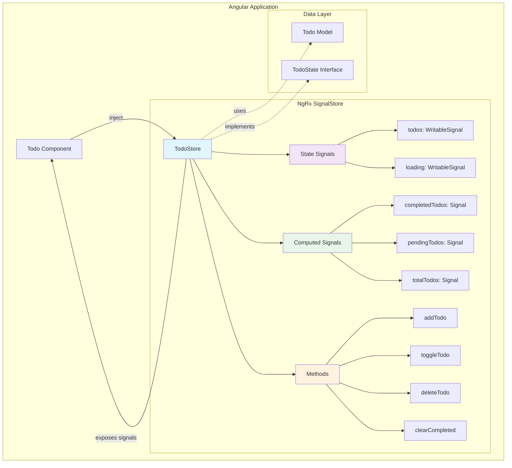
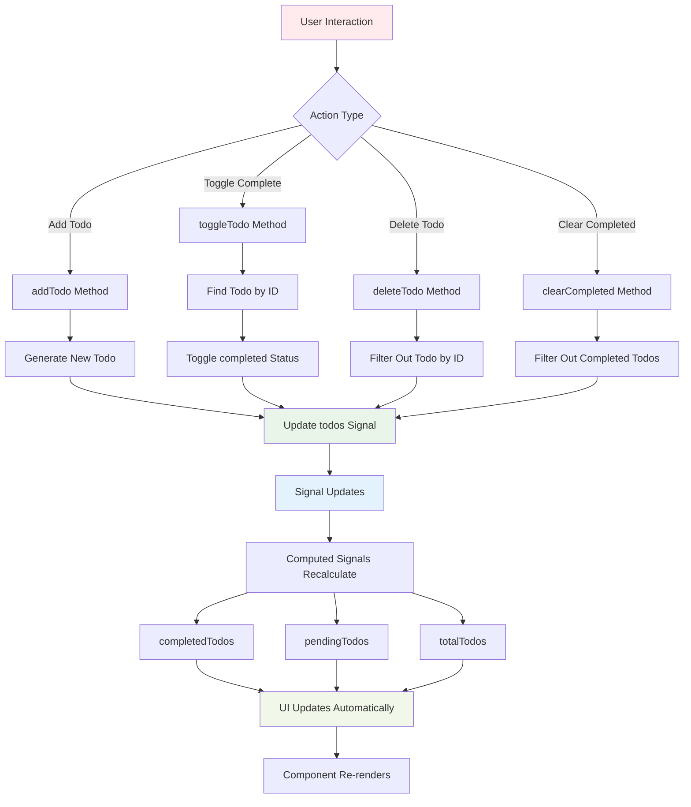
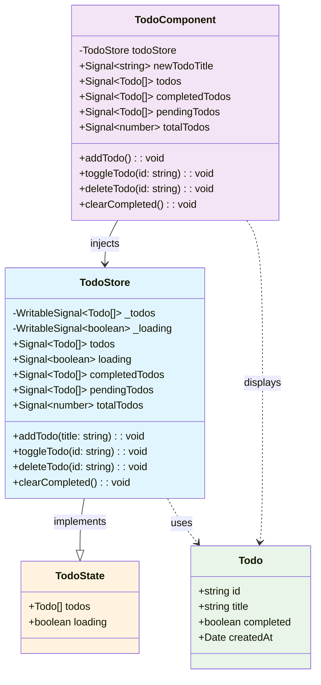

# NgRx SignalStore for Angular Todo App

## Complete Guide with Architecture and Code Flow Diagrams

### Table of Contents

1. [Introduction](#introduction)
2. [Architecture Overview](#architecture-overview)
3. [Content Flow Diagram](#content-flow-diagram)
4. [Todo App Structure](#todo-app-structure)
5. [Code Implementation](#code-implementation)
6. [Line-by-Line Code Explanation](#line-by-line-code-explanation)
7. [Key Benefits](#key-benefits)
8. [Best Practices](#best-practices)

---

## Introduction

NgRx SignalStore represents the next evolution in state management for Angular applications. It combines the power of NgRx with Angular's modern signals API to provide a reactive, type-safe, and performant solution for managing application state.

This guide demonstrates NgRx SignalStore using a practical Todo application example, showcasing the architecture, data flow, and implementation details.

---

## Architecture Overview

The following diagram illustrates the high-level architecture of a Todo application using NgRx SignalStore:



---

## Content Flow Diagram

This diagram shows the data flow when user interactions occur in the Todo application:



---

## Todo App Structure

Our Todo application follows a clean architecture pattern with the following structure:



---

## Code Implementation

### Todo Model (`todo.model.ts`)

```typescript
// Todo interfaces
export interface Todo {
  id: string;
  title: string;
  completed: boolean;
  createdAt: Date;
}

export interface TodoState {
  todos: Todo[];
  loading: boolean;
}
```

### Todo Store (`todo.store.ts`)

```typescript
import { signalStore, withState, withMethods, patchState, withComputed } from '@ngrx/signals';
import { computed } from '@angular/core';
import { Todo, TodoState } from '../models/todo.model';

// Initial state
const initialState: TodoState = {
  todos: [],
  loading: false,
};

// Create the Todo Store using NgRx Signal Store
export const TodoStore = signalStore(
  { providedIn: 'root' },
  withState(initialState),
  withComputed((store) => ({
    completedTodos: computed(() => store.todos().filter((todo) => todo.completed)),
    pendingTodos: computed(() => store.todos().filter((todo) => !todo.completed)),
    totalTodos: computed(() => store.todos().length),
  })),
  withMethods((store) => ({
    addTodo: (title: string) => {
      const newTodo: Todo = {
        id: crypto.randomUUID(),
        title: title.trim(),
        completed: false,
        createdAt: new Date(),
      };
      patchState(store, (state) => ({
        todos: [...state.todos, newTodo],
      }));
    },

    toggleTodo: (id: string) => {
      patchState(store, (state) => ({
        todos: state.todos.map((todo) => (todo.id === id ? { ...todo, completed: !todo.completed } : todo)),
      }));
    },

    deleteTodo: (id: string) => {
      patchState(store, (state) => ({
        todos: state.todos.filter((todo) => todo.id !== id),
      }));
    },

    clearCompleted: () => {
      patchState(store, (state) => ({
        todos: state.todos.filter((todo) => !todo.completed),
      }));
    },
  }))
);
```

### Todo Component (`todo.component.ts`)

```typescript
import { Component, inject, signal } from '@angular/core';
import { CommonModule } from '@angular/common';
import { FormsModule } from '@angular/forms';
import { TodoStore } from '../store/todo.store';

@Component({
  selector: 'app-todo',
  standalone: true,
  imports: [CommonModule, FormsModule],
  templateUrl: './todo.component.html',
  styleUrls: ['./todo.component.css'],
})
export class TodoComponent {
  private todoStore = inject(TodoStore);

  newTodoTitle = signal('');

  // Expose store signals
  todos = this.todoStore.todos;
  completedTodos = this.todoStore.completedTodos;
  pendingTodos = this.todoStore.pendingTodos;
  totalTodos = this.todoStore.totalTodos;

  addTodo() {
    const title = this.newTodoTitle().trim();
    if (title) {
      this.todoStore.addTodo(title);
      this.newTodoTitle.set('');
    }
  }

  toggleTodo(id: string) {
    this.todoStore.toggleTodo(id);
  }

  deleteTodo(id: string) {
    this.todoStore.deleteTodo(id);
  }

  clearCompleted() {
    this.todoStore.clearCompleted();
  }
}
```

---

## Line-by-Line Code Explanation

### Todo Store Deep Dive

Let's examine the Todo Store implementation in detail:

#### Imports and Setup

```typescript
import { signalStore, withState, withMethods, patchState, withComputed } from '@ngrx/signals';
```

**Line Explanation:**

- `signalStore`: The main factory function for creating a signal-based store
- `withState`: Feature for adding state to the store
- `withMethods`: Feature for adding methods/actions to the store
- `patchState`: Utility function for updating state immutably
- `withComputed`: Feature for adding computed/derived state

```typescript
import { computed } from '@angular/core';
```

**Line Explanation:** Angular's `computed` function for creating derived signals that automatically recalculate when dependencies change.

#### Initial State Definition

```typescript
const initialState: TodoState = {
  todos: [],
  loading: false,
};
```

**Line Explanation:**

- Defines the initial state of our store with an empty todos array and loading set to false
- This state shape matches our `TodoState` interface for type safety

#### Store Creation

```typescript
export const TodoStore = signalStore(
  { providedIn: 'root' },
```

**Line Explanation:**

- Creates a new signal store instance using the `signalStore` factory
- `providedIn: 'root'` makes this store available as a singleton throughout the application
- This is Angular's dependency injection configuration

#### State Feature

```typescript
withState(initialState),
```

**Line Explanation:**

- Adds state management capability to the store
- Initializes the store with our predefined `initialState`
- Creates reactive signals for each property in the state

#### Computed Feature

```typescript
withComputed((store) => ({
  completedTodos: computed(() => store.todos().filter(todo => todo.completed)),
  pendingTodos: computed(() => store.todos().filter(todo => !todo.completed)),
  totalTodos: computed(() => store.todos().length),
})),
```

**Line Explanation:**

- **Line 1**: `withComputed` adds computed properties to the store that automatically recalculate
- **Line 2**: `completedTodos` - Creates a computed signal that filters only completed todos
- **Line 3**: `pendingTodos` - Creates a computed signal that filters only incomplete todos
- **Line 4**: `totalTodos` - Creates a computed signal that returns the total count of todos
- All computed signals automatically update when the underlying `todos` signal changes

#### Methods Feature - addTodo

```typescript
withMethods((store) => ({
  addTodo: (title: string) => {
    const newTodo: Todo = {
      id: crypto.randomUUID(),
      title: title.trim(),
      completed: false,
      createdAt: new Date(),
    };
    patchState(store, (state) => ({
      todos: [...state.todos, newTodo],
    }));
  },
```

**Line Explanation:**

- **Line 1**: `withMethods` adds action methods to the store
- **Line 2**: `addTodo` method accepts a title string parameter
- **Line 3-8**: Creates a new Todo object with:
  - Unique ID using `crypto.randomUUID()`
  - Trimmed title to remove whitespace
  - Default completed status as false
  - Current timestamp for creation date
- **Line 9-11**: `patchState` immutably updates the state by spreading existing todos and adding the new one

#### Methods Feature - toggleTodo

```typescript
toggleTodo: (id: string) => {
  patchState(store, (state) => ({
    todos: state.todos.map(todo =>
      todo.id === id ? { ...todo, completed: !todo.completed } : todo
    ),
  }));
},
```

**Line Explanation:**

- **Line 1**: Method to toggle a todo's completion status
- **Line 2-6**: Uses `patchState` with map to:
  - Find the todo with matching ID
  - Spread the todo object and flip the `completed` boolean
  - Return unchanged todos for non-matching IDs
  - Maintains immutability while updating specific item

#### Methods Feature - deleteTodo

```typescript
deleteTodo: (id: string) => {
  patchState(store, (state) => ({
    todos: state.todos.filter(todo => todo.id !== id),
  }));
},
```

**Line Explanation:**

- **Line 1**: Method to remove a todo by ID
- **Line 2-4**: Uses `patchState` with filter to:
  - Create new array excluding the todo with matching ID
  - Maintains immutability by creating new filtered array

#### Methods Feature - clearCompleted

```typescript
clearCompleted: () => {
  patchState(store, (state) => ({
    todos: state.todos.filter(todo => !todo.completed),
  }));
},
```

**Line Explanation:**

- **Line 1**: Method to remove all completed todos
- **Line 2-4**: Uses `patchState` with filter to:
  - Keep only todos where `completed` is false
  - Removes all completed todos in one operation

### Component Deep Dive

#### Component Setup

```typescript
@Component({
  selector: 'app-todo',
  standalone: true,
  imports: [CommonModule, FormsModule],
  templateUrl: './todo.component.html',
  styleUrls: ['./todo.component.css']
})
```

**Line Explanation:**

- Standard Angular component decorator with standalone configuration
- Imports necessary modules for common directives and form handling

#### Dependency Injection and Store Access

```typescript
private todoStore = inject(TodoStore);
```

**Line Explanation:**

- Injects the TodoStore using Angular's `inject()` function
- Private access modifier since it's only used internally

#### Local Component State

```typescript
newTodoTitle = signal('');
```

**Line Explanation:**

- Creates a local signal for managing the new todo input field
- Demonstrates mixing local component state with global store state

#### Store Signal Exposure

```typescript
todos = this.todoStore.todos;
completedTodos = this.todoStore.completedTodos;
pendingTodos = this.todoStore.pendingTodos;
totalTodos = this.todoStore.totalTodos;
```

**Line Explanation:**

- Exposes store signals as component properties for template access
- Direct signal references maintain reactivity
- No manual subscriptions needed - signals handle change detection automatically

#### Component Methods

```typescript
addTodo() {
  const title = this.newTodoTitle().trim();
  if (title) {
    this.todoStore.addTodo(title);
    this.newTodoTitle.set('');
  }
}
```

**Line Explanation:**

- **Line 1**: Component method triggered by user action
- **Line 2**: Reads current value from `newTodoTitle` signal and trims whitespace
- **Line 3**: Validates title is not empty
- **Line 4**: Calls store method to add the todo
- **Line 5**: Resets the input field by updating the signal

---

## Key Benefits

### 1. **Reactive by Design**

- Automatic UI updates when state changes
- No manual subscription management required
- Signals provide fine-grained reactivity

### 2. **Type Safety**

- Full TypeScript integration
- Compile-time error checking
- IntelliSense support for better DX

### 3. **Performance Optimized**

- Signals only update when values actually change
- Computed values are memoized and cached
- Minimal re-renders in the UI

### 4. **Simple API**

- Less boilerplate than traditional NgRx
- Intuitive method-based actions
- Direct state access through signals

### 5. **Testable**

- Easy to unit test store methods
- Predictable state changes
- Isolated business logic

---

## Best Practices

### 1. **State Structure**

- Keep state flat and normalized
- Separate concerns with multiple stores if needed
- Use interfaces for type safety

### 2. **Method Design**

- Make methods pure and focused
- Use descriptive names for actions
- Handle edge cases appropriately

### 3. **Component Integration**

- Expose only needed signals to templates
- Keep business logic in the store
- Use local signals for UI-specific state

### 4. **Error Handling**

- Implement proper validation in methods
- Consider adding error state to your store
- Handle async operations appropriately

### 5. **Testing Strategy**

- Test store methods in isolation
- Mock store in component tests
- Use integration tests for full flows

---

## Conclusion

NgRx SignalStore represents a modern approach to state management in Angular applications. By combining the power of signals with proven state management patterns, it provides a reactive, type-safe, and performant solution that's both powerful and easy to use.

The Todo application example demonstrates how SignalStore can handle common CRUD operations while maintaining clean architecture and excellent developer experience. The reactive nature of signals ensures your UI stays in sync with your application state automatically, making your code more predictable and maintainable.
