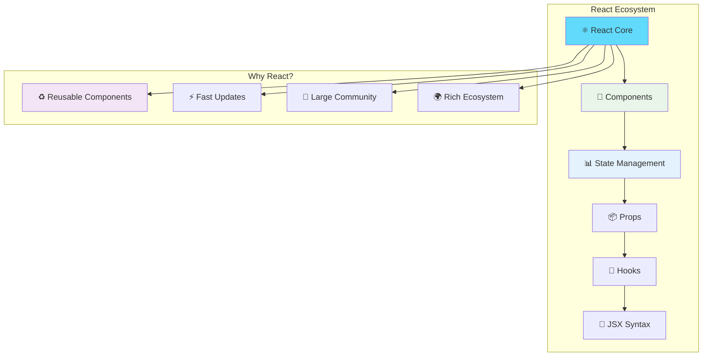
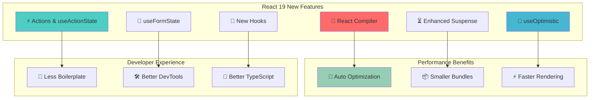
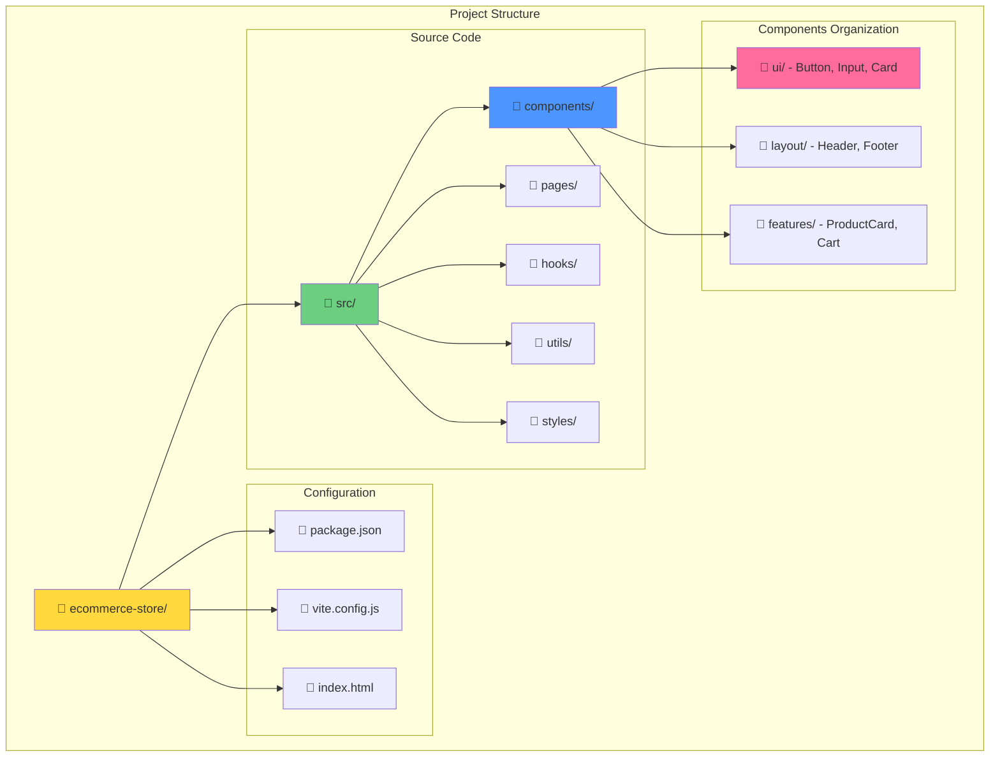
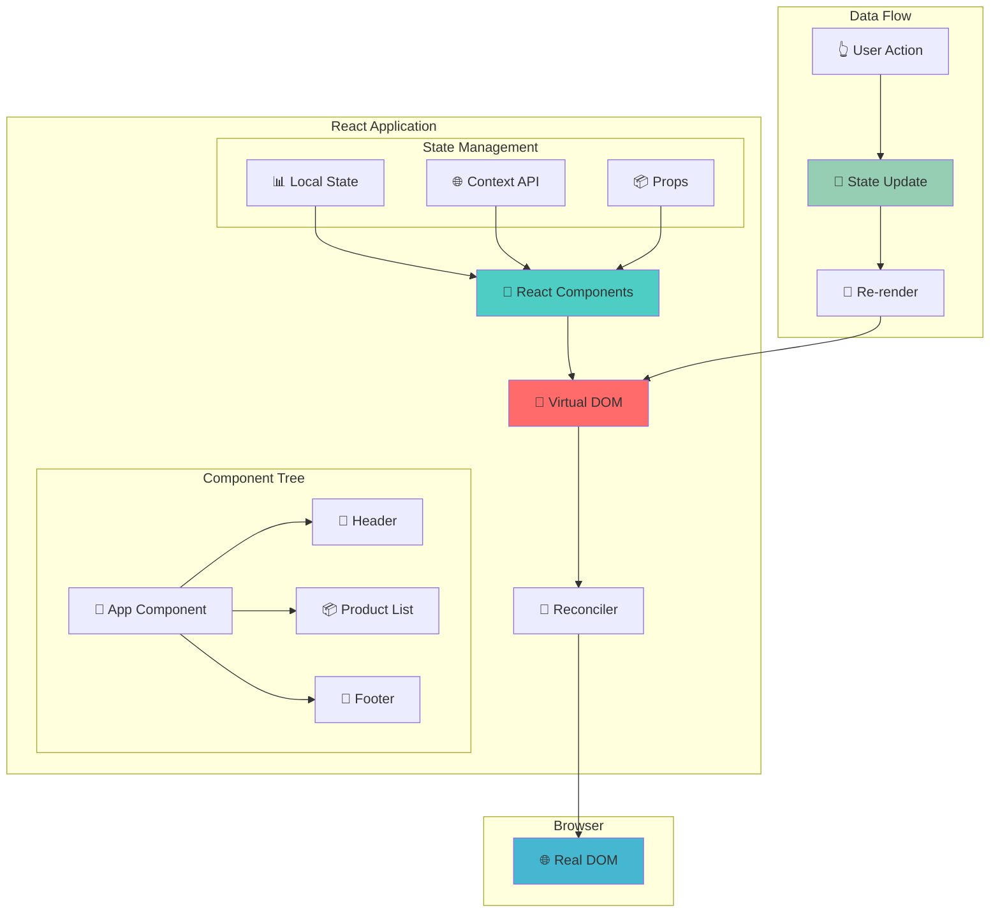
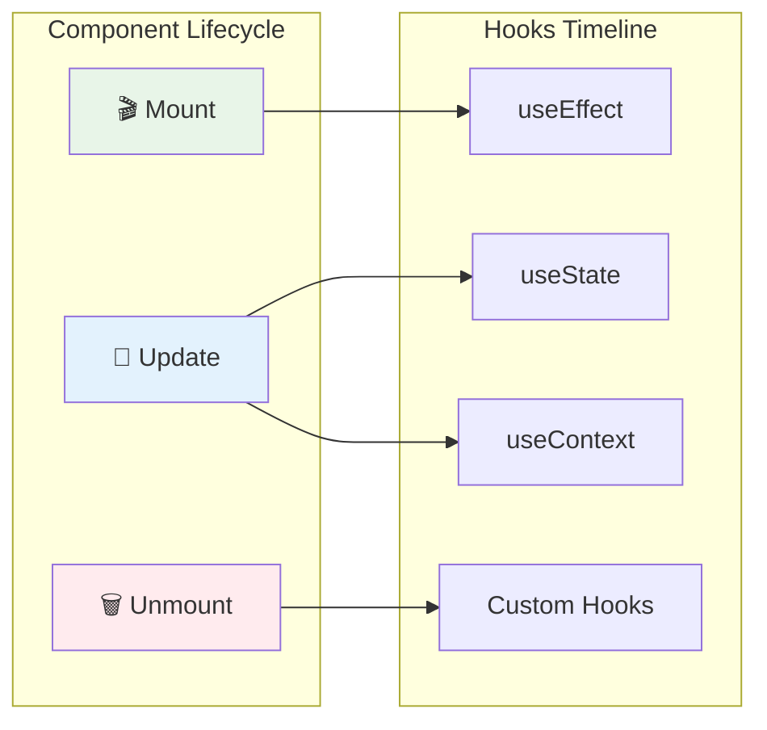
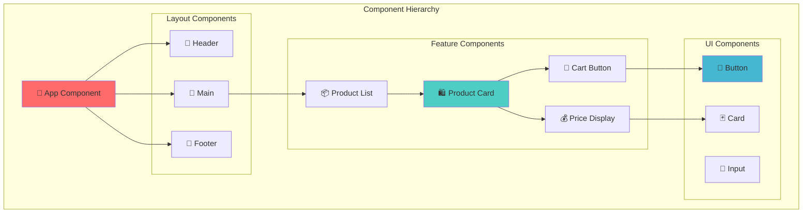
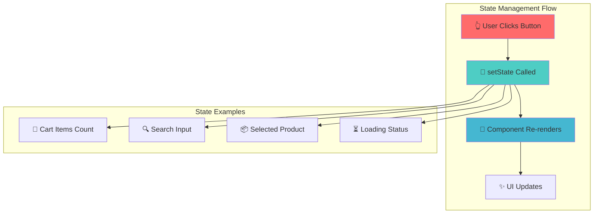
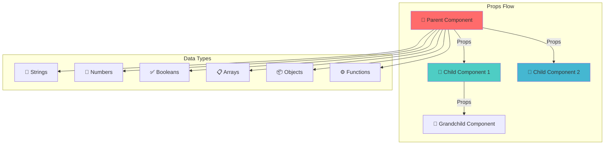
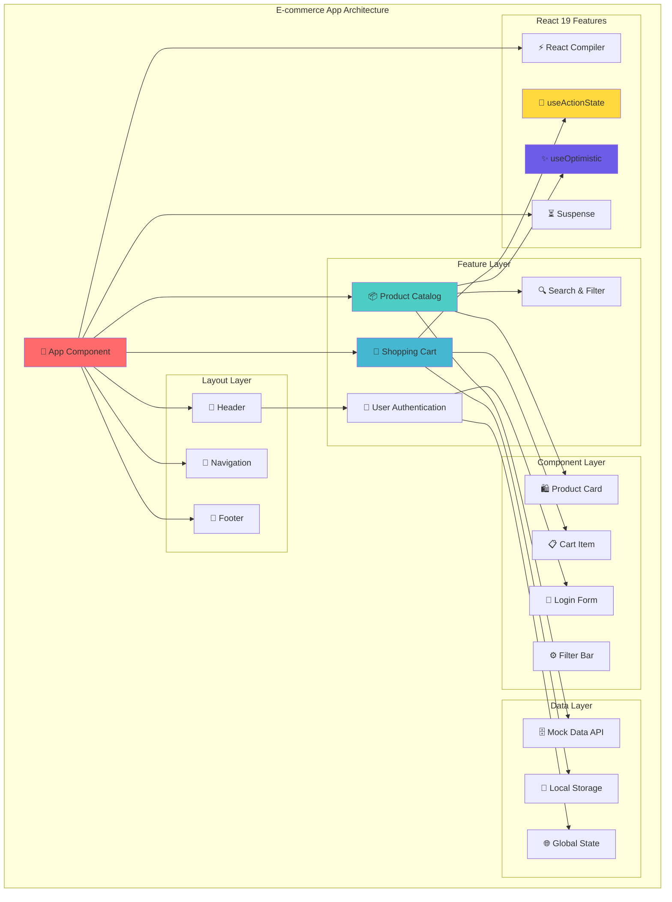
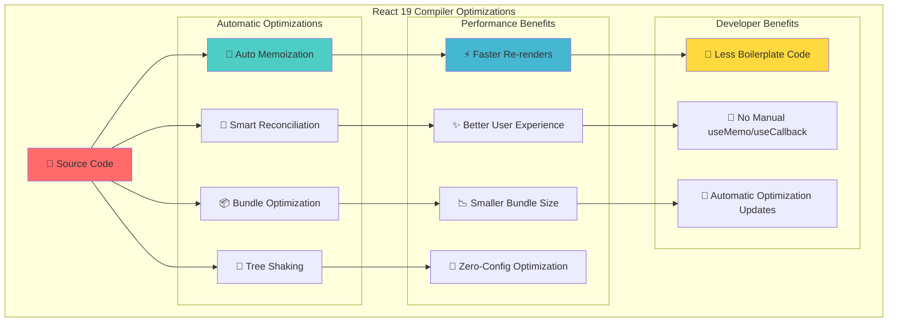

# 🚀 React 19 Complete Guide - Building an E-commerce Website

## 📋 Table of Contents

1. [What is React?](#what-is-react)
2. [React 19 New Features](#react-19-features)
3. [Project Setup](#project-setup)
4. [React Architecture Overview](#react-architecture)
5. [Core Concepts with E-commerce Examples](#core-concepts)
6. [Building the E-commerce Application](#building-ecommerce)
7. [Advanced React Patterns](#advanced-patterns)
8. [Performance Optimization](#performance-optimization)
9. [Testing in React](#testing)
10. [Interview Questions Coverage](#interview-questions)

---

## 🤔 What is React? {#what-is-react}

**React** is a **JavaScript library** for building user interfaces, particularly web applications. Think of it as a tool that helps you create interactive websites more easily and efficiently.

### **Why React? - Real World Analogy**

Imagine you're building a house (website):

- **Traditional JavaScript** = Building everything from scratch with raw materials
- **React** = Using pre-built, reusable components (like LEGO blocks) that you can assemble

### **Key Concepts Explained Simply**



### **What Makes React Special?**

1. **Component-Based Architecture**: Build encapsulated components that manage their own state
2. **Virtual DOM**: React creates a virtual representation of the DOM for faster updates
3. **Declarative**: You describe what the UI should look like, React handles the how
4. **Learn Once, Write Anywhere**: Use React for web, mobile (React Native), and desktop

---

## 🆕 React 19 New Features {#react-19-features}

React 19 introduces several groundbreaking features that make development easier and applications faster.

### **React 19 Feature Overview**



### **Key React 19 Features Explained**

#### **1. React Compiler (Forget Memo!)**

**Before React 19** (Manual Optimization):

```javascript
// You had to manually optimize with React.memo, useMemo, useCallback
const ExpensiveComponent = React.memo(({ data }) => {
  const expensiveValue = useMemo(() => {
    return data.map((item) => item.price * 1.2);
  }, [data]);

  const handleClick = useCallback(() => {
    console.log("Clicked");
  }, []);

  return <div>{/* Component JSX */}</div>;
});
```

**React 19** (Automatic Optimization):

```javascript
// React Compiler automatically optimizes this!
function ExpensiveComponent({ data }) {
  // No need for useMemo - compiler handles it
  const expensiveValue = data.map((item) => item.price * 1.2);

  // No need for useCallback - compiler handles it
  const handleClick = () => {
    console.log("Clicked");
  };

  return <div>{/* Component JSX */}</div>;
}
```

**Why**: React Compiler automatically optimizes your components, reducing re-renders without manual optimization.

#### **2. Actions and useActionState**

**What**: Actions are functions that handle async operations with built-in loading states.

```javascript
import { useActionState } from "react";

function AddToCartButton({ productId }) {
  // useActionState handles loading, error, and success states automatically
  const [state, action, isPending] = useActionState(
    async (prevState, formData) => {
      try {
        const response = await fetch("/api/cart", {
          method: "POST",
          body: JSON.stringify({ productId, quantity: 1 }),
          headers: { "Content-Type": "application/json" },
        });

        if (!response.ok) throw new Error("Failed to add to cart");

        return { success: true, message: "Added to cart!" };
      } catch (error) {
        return { success: false, error: error.message };
      }
    },
    null
  );

  return (
    <form action={action}>
      <button type="submit" disabled={isPending}>
        {isPending ? "Adding..." : "Add to Cart"}
      </button>

      {state?.success && (
        <span style={{ color: "green" }}>{state.message}</span>
      )}
      {state?.error && <span style={{ color: "red" }}>{state.error}</span>}
    </form>
  );
}
```

**Why**: Eliminates boilerplate code for handling loading states, errors, and form submissions.

#### **3. useOptimistic Hook**

**What**: Provides optimistic updates - show changes immediately while waiting for server confirmation.

```javascript
import { useOptimistic } from "react";

function ProductReviews({ productId, reviews }) {
  const [optimisticReviews, addOptimisticReview] = useOptimistic(
    reviews,
    (currentReviews, newReview) => [...currentReviews, newReview]
  );

  const submitReview = async (reviewData) => {
    // Immediately show the review (optimistic update)
    addOptimisticReview({
      id: "temp-" + Date.now(),
      ...reviewData,
      isPending: true,
    });

    try {
      // Send to server
      const response = await fetch("/api/reviews", {
        method: "POST",
        body: JSON.stringify({ productId, ...reviewData }),
      });

      // Server will update the real reviews list
    } catch (error) {
      // If it fails, React automatically reverts the optimistic update
      console.error("Failed to submit review:", error);
    }
  };

  return (
    <div>
      {optimisticReviews.map((review) => (
        <div key={review.id} style={{ opacity: review.isPending ? 0.5 : 1 }}>
          <h4>{review.author}</h4>
          <p>{review.comment}</p>
          <div>Rating: {review.rating}/5</div>
        </div>
      ))}
    </div>
  );
}
```

**Why**: Makes your app feel instantly responsive by showing changes immediately, even before server confirmation.

---

## 🛠️ Project Setup {#project-setup}

Let's create our React 19 e-commerce application step by step.

### **Step 1: Create React App with Vite (Recommended)**

```bash
# Create new React project with Vite (faster than Create React App)
npm create vite@latest ecommerce-store -- --template react

# Navigate to project folder
cd ecommerce-store

# Install dependencies
npm install

# Install additional packages for our e-commerce app
npm install axios react-router-dom @heroicons/react tailwindcss

# Start development server
npm run dev
```

### **Step 2: Project Structure Overview**



### **Step 3: Initial Project Setup**

**src/main.jsx** (Entry Point):

```javascript
import React from "react";
import ReactDOM from "react-dom/client";
import App from "./App.jsx";
import "./index.css";

// React 19 uses createRoot for better performance
ReactDOM.createRoot(document.getElementById("root")).render(
  <React.StrictMode>
    <App />
  </React.StrictMode>
);
```

**Why StrictMode?**:

- Helps identify unsafe lifecycles
- Warns about legacy string ref API usage
- Detects unexpected side effects
- Only runs in development mode

---

## 🏗️ React Architecture Overview {#react-architecture}

Understanding React's architecture is crucial for building scalable applications.

### **React Application Architecture**



### **Component Lifecycle in React 19**



---

## 🧩 Core Concepts with E-commerce Examples {#core-concepts}

### **1. Components - The Building Blocks**

**What**: Components are like LEGO blocks - reusable pieces of UI that you can combine to build your application.

**Why**: Instead of writing the same code multiple times, you create a component once and use it everywhere.

**How**: Let's build a ProductCard component for our e-commerce store.



#### **Basic Component Example**

```javascript
// src/components/ProductCard.jsx
import React from "react";

// This is a FUNCTIONAL COMPONENT (modern React way)
function ProductCard() {
  return (
    <div className="product-card">
      
      <h3>Sample Product</h3>
      <p>$99.99</p>
      <button>Add to Cart</button>
    </div>
  );
}

export default ProductCard;
```

**What's happening here?**

- `function ProductCard()` - Creates a component (like a function that returns HTML)
- `return (...)` - Returns JSX (HTML-like syntax in JavaScript)
- `export default` - Makes this component available to other files

#### **Component with Props (Making it Dynamic)**

```javascript
// src/components/ProductCard.jsx
import React from "react";

// Props are like function parameters - they make components reusable
function ProductCard({ product }) {
  // Destructuring: { product } extracts 'product' from props

  return (
    <div className="product-card">
      {/* Using props to display dynamic data */}
      
      <h3>{product.name}</h3>
      <p className="price">${product.price}</p>
      <p className="description">{product.description}</p>

      {/* Conditional rendering - only show if in stock */}
      {product.inStock ? (
        <button className="add-to-cart-btn">Add to Cart</button>
      ) : (
        <button className="out-of-stock-btn" disabled>
          Out of Stock
        </button>
      )}

      {/* Show discount badge if product is on sale */}
      {product.discount > 0 && (
        <span className="discount-badge">{product.discount}% OFF</span>
      )}
    </div>
  );
}

export default ProductCard;
```

**Key Concepts Explained:**

- **Props**: Data passed from parent to child component
- **Destructuring**: `{ product }` extracts product from props object
- **JSX**: HTML-like syntax in JavaScript
- **Conditional Rendering**: Show different content based on conditions
- **Template Literals**: `${}` to embed JavaScript in JSX

### **2. JSX - HTML in JavaScript**

**What**: JSX allows you to write HTML-like syntax directly in JavaScript.

**Why**: Makes it easier to visualize and write UI components.

**JSX Rules**:

```javascript
function JSXExample() {
  const isLoggedIn = true;
  const user = { name: "John", age: 25 };
  const products = ["iPhone", "iPad", "MacBook"];

  return (
    <div>
      {/* 1. Must have one parent element */}

      {/* 2. Use {} for JavaScript expressions */}
      <h1>Welcome, {user.name}!</h1>

      {/* 3. Use className instead of class */}
      <div className="user-info">
        <p>Age: {user.age}</p>
      </div>

      {/* 4. Conditional rendering */}
      {isLoggedIn ? <p>You are logged in!</p> : <p>Please log in</p>}

      {/* 5. Loop through arrays with map() */}
      <ul>
        {products.map((product, index) => (
          <li key={index}>{product}</li>
        ))}
      </ul>

      {/* 6. Self-closing tags must end with /> */}
      
      <br />

      {/* 7. Use camelCase for attributes */}
      <input
        type="text"
        onChange={(e) => console.log(e.target.value)}
        maxLength={50}
      />
    </div>
  );
}
```

### **3. State - Component Memory**

**What**: State is like a component's memory - it remembers values that can change over time.

**Why**: Without state, components would be static and couldn't respond to user interactions.

**How**: Use the `useState` hook to add state to functional components.



#### **useState Hook Example**

```javascript
import React, { useState } from "react";

function ShoppingCart() {
  // useState returns [currentValue, functionToUpdateValue]
  const [cartItems, setCartItems] = useState([]); // Start with empty array
  const [itemCount, setItemCount] = useState(0); // Start with 0
  const [isLoading, setIsLoading] = useState(false); // Start with false

  // Function to add item to cart
  const addToCart = (product) => {
    setIsLoading(true); // Show loading

    // Simulate API call delay
    setTimeout(() => {
      // Update cart items (always create new array, don't mutate existing)
      setCartItems((prevItems) => [...prevItems, product]);

      // Update item count
      setItemCount((prevCount) => prevCount + 1);

      setIsLoading(false); // Hide loading
    }, 1000);
  };

  // Function to remove item from cart
  const removeFromCart = (productId) => {
    setCartItems((prevItems) =>
      prevItems.filter((item) => item.id !== productId)
    );
    setItemCount((prevCount) => prevCount - 1);
  };

  return (
    <div className="shopping-cart">
      <h2>Shopping Cart ({itemCount} items)</h2>

      {isLoading && <p>Adding item to cart...</p>}

      {cartItems.length === 0 ? (
        <p>Your cart is empty</p>
      ) : (
        <ul>
          {cartItems.map((item) => (
            <li key={item.id}>
              {item.name} - ${item.price}
              <button onClick={() => removeFromCart(item.id)}>Remove</button>
            </li>
          ))}
        </ul>
      )}

      <button
        onClick={() =>
          addToCart({ id: Date.now(), name: "Sample Product", price: 99.99 })
        }
        disabled={isLoading}
      >
        Add Sample Product
      </button>
    </div>
  );
}
```

**Key State Concepts:**

- **useState(initialValue)**: Creates state variable with initial value
- **Immutability**: Always create new state, never modify existing state directly
- **Asynchronous**: State updates are asynchronous and may be batched
- **Re-rendering**: Component re-renders when state changes

### **4. Props - Passing Data Between Components**

**What**: Props (properties) are how you pass data from parent components to child components.

**Why**: Allows components to be reusable with different data.

**Data Flow Diagram**:



#### **Props Example - E-commerce Product List**

```javascript
// Parent Component - ProductList
import React, { useState } from "react";
import ProductCard from "./ProductCard";

function ProductList() {
  const [products] = useState([
    {
      id: 1,
      name: "iPhone 15 Pro",
      price: 999,
      image: "https://picsum.photos/300/200?random=1",
      description: "Latest iPhone with advanced features",
      inStock: true,
      discount: 10,
      category: "Electronics",
    },
    {
      id: 2,
      name: "Samsung Galaxy S24",
      price: 899,
      image: "https://picsum.photos/300/200?random=2",
      description: "Powerful Android smartphone",
      inStock: false,
      discount: 0,
      category: "Electronics",
    },
  ]);

  // Function to handle adding to cart
  const handleAddToCart = (product) => {
    console.log("Adding to cart:", product);
    alert(`Added ${product.name} to cart!`);
  };

  return (
    <div className="product-list">
      <h2>Our Products</h2>
      <div className="products-grid">
        {products.map((product) => (
          <ProductCard
            key={product.id} // Special prop for React's reconciliation
            product={product} // Object prop
            onAddToCart={handleAddToCart} // Function prop
            showDiscount={true} // Boolean prop
            currencySymbol="$" // String prop
          />
        ))}
      </div>
    </div>
  );
}
```

```javascript
// Child Component - ProductCard
import React from "react";

function ProductCard({
  product, // Object destructured from props
  onAddToCart, // Function destructured from props
  showDiscount, // Boolean destructured from props
  currencySymbol, // String destructured from props
}) {
  // Handle add to cart click
  const handleAddToCart = () => {
    onAddToCart(product); // Call parent function with product data
  };

  return (
    <div className="product-card">
      <div className="product-image">
        

        {/* Conditionally show discount badge */}
        {showDiscount && product.discount > 0 && (
          <span className="discount-badge">{product.discount}% OFF</span>
        )}
      </div>

      <div className="product-info">
        <h3>{product.name}</h3>
        <p className="description">{product.description}</p>
        <p className="category">Category: {product.category}</p>

        <div className="price-section">
          {product.discount > 0 ? (
            <>
              <span className="original-price">
                {currencySymbol}
                {product.price}
              </span>
              <span className="discounted-price">
                {currencySymbol}
                {(product.price * (1 - product.discount / 100)).toFixed(2)}
              </span>
            </>
          ) : (
            <span className="price">
              {currencySymbol}
              {product.price}
            </span>
          )}
        </div>

        {product.inStock ? (
          <button className="add-to-cart-btn" onClick={handleAddToCart}>
            Add to Cart
          </button>
        ) : (
          <button className="out-of-stock-btn" disabled>
            Out of Stock
          </button>
        )}
      </div>
    </div>
  );
}

export default ProductCard;
```

**Props Best Practices:**

1. **Always use key prop** when rendering lists
2. **Destructure props** for cleaner code
3. **Pass functions** to handle events in child components
4. **Validate props** with PropTypes or TypeScript
5. **Don't mutate props** - they are read-only

### **5. Event Handling - User Interactions**

**What**: Event handling allows your components to respond to user actions like clicks, form submissions, and keyboard input.

**Why**: Makes your application interactive and responsive to user behavior.

```javascript
import React, { useState } from "react";

function SearchBar() {
  const [searchTerm, setSearchTerm] = useState("");
  const [searchResults, setSearchResults] = useState([]);
  const [isSearching, setIsSearching] = useState(false);

  // Handle input change
  const handleInputChange = (event) => {
    const value = event.target.value;
    setSearchTerm(value);

    // Auto-search as user types (debounced in real app)
    if (value.length > 2) {
      performSearch(value);
    } else {
      setSearchResults([]);
    }
  };

  // Handle form submission
  const handleSubmit = (event) => {
    event.preventDefault(); // Prevent page refresh

    if (searchTerm.trim()) {
      performSearch(searchTerm);
    }
  };

  // Handle key press
  const handleKeyPress = (event) => {
    if (event.key === "Enter") {
      handleSubmit(event);
    }

    if (event.key === "Escape") {
      setSearchTerm("");
      setSearchResults([]);
    }
  };

  // Simulate search functionality
  const performSearch = async (term) => {
    setIsSearching(true);

    // Simulate API call
    setTimeout(() => {
      const mockResults = [
        { id: 1, name: `${term} - iPhone Case`, price: 29.99 },
        { id: 2, name: `${term} - Wireless Charger`, price: 49.99 },
        { id: 3, name: `${term} - Screen Protector`, price: 19.99 },
      ];
      setSearchResults(mockResults);
      setIsSearching(false);
    }, 500);
  };

  return (
    <div className="search-container">
      <form onSubmit={handleSubmit}>
        <div className="search-input-container">
          <input
            type="text"
            value={searchTerm}
            onChange={handleInputChange}
            onKeyDown={handleKeyPress}
            placeholder="Search products..."
            className="search-input"
          />
          <button type="submit" disabled={isSearching}>
            {isSearching ? "Searching..." : "Search"}
          </button>
        </div>
      </form>

      {/* Search Results */}
      {searchResults.length > 0 && (
        <div className="search-results">
          <h3>Search Results for "{searchTerm}":</h3>
          <ul>
            {searchResults.map((result) => (
              <li key={result.id} className="search-result-item">
                <span>{result.name}</span>
                <span>${result.price}</span>
              </li>
            ))}
          </ul>
        </div>
      )}

      {/* No results message */}
      {searchTerm.length > 2 && searchResults.length === 0 && !isSearching && (
        <div className="no-results">
          <p>No products found for "{searchTerm}"</p>
        </div>
      )}
    </div>
  );
}
```

**Event Handling Key Points:**

- **event.preventDefault()**: Stops default browser behavior
- **event.target.value**: Gets the current value of input
- **Controlled Components**: React controls the input value through state
- **Event Object**: Contains information about the event that occurred

---

## 🛒 Building the E-commerce Application {#building-ecommerce}

Now let's build a complete e-commerce application using React 19 features. We'll create a functional online store with product listing, shopping cart, and user authentication.

### **Application Architecture Overview**



### **1. Project Structure Setup**

Let's organize our e-commerce project with a scalable folder structure:

```
src/
├── components/
│   ├── ui/                    # Reusable UI components
│   │   ├── Button.jsx
│   │   ├── Input.jsx
│   │   ├── Card.jsx
│   │   └── Modal.jsx
│   ├── layout/                # Layout components
│   │   ├── Header.jsx
│   │   ├── Navigation.jsx
│   │   ├── Footer.jsx
│   │   └── Sidebar.jsx
│   └── features/              # Feature-specific components
│       ├── products/
│       │   ├── ProductCard.jsx
│       │   ├── ProductList.jsx
│       │   ├── ProductDetails.jsx
│       │   └── ProductFilter.jsx
│       ├── cart/
│       │   ├── CartItem.jsx
│       │   ├── CartSummary.jsx
│       │   └── CartDrawer.jsx
│       └── auth/
│           ├── LoginForm.jsx
│           ├── RegisterForm.jsx
│           └── UserProfile.jsx
├── hooks/                     # Custom React hooks
│   ├── useCart.js
│   ├── useProducts.js
│   └── useAuth.js
├── context/                   # React Context for global state
│   ├── CartContext.jsx
│   ├── AuthContext.jsx
│   └── AppContext.jsx
├── data/                      # Mock data and API
│   ├── products.js
│   ├── users.js
│   └── mockApi.js
├── utils/                     # Utility functions
│   ├── helpers.js
│   ├── constants.js
│   └── validators.js
├── styles/                    # CSS and styling
│   ├── globals.css
│   ├── components.css
│   └── utilities.css
└── App.jsx                    # Main App component
```

### **2. Mock Data Setup**

First, let's create our mock data for products and users:

```javascript
// src/data/products.js
export const mockProducts = [
  {
    id: 1,
    name: "iPhone 15 Pro Max",
    price: 1199,
    originalPrice: 1299,
    discount: 8,
    image: "https://picsum.photos/400/400?random=1",
    images: [
      "https://picsum.photos/400/400?random=1",
      "https://picsum.photos/400/400?random=11",
      "https://picsum.photos/400/400?random=21",
    ],
    description:
      "The most advanced iPhone with titanium design and A17 Pro chip.",
    category: "smartphones",
    brand: "Apple",
    inStock: true,
    stockQuantity: 15,
    rating: 4.8,
    reviews: 1247,
    features: [
      "A17 Pro chip with 6-core GPU",
      "ProRAW and ProRes recording",
      "Titanium design",
      "48MP Main camera",
    ],
    specifications: {
      display: "6.7-inch Super Retina XDR",
      storage: "256GB",
      camera: "48MP Triple camera system",
      battery: "Up to 29 hours video playback",
    },
  },
  {
    id: 2,
    name: "Samsung Galaxy S24 Ultra",
    price: 1099,
    originalPrice: 1199,
    discount: 8,
    image: "https://picsum.photos/400/400?random=2",
    images: [
      "https://picsum.photos/400/400?random=2",
      "https://picsum.photos/400/400?random=12",
      "https://picsum.photos/400/400?random=22",
    ],
    description: "Ultimate Samsung flagship with S Pen and AI features.",
    category: "smartphones",
    brand: "Samsung",
    inStock: true,
    stockQuantity: 8,
    rating: 4.7,
    reviews: 892,
    features: [
      "200MP main camera",
      "S Pen included",
      "Snapdragon 8 Gen 3",
      "Galaxy AI features",
    ],
    specifications: {
      display: "6.8-inch Dynamic AMOLED 2X",
      storage: "512GB",
      camera: "200MP Quad camera system",
      battery: "5000mAh with fast charging",
    },
  },
  {
    id: 3,
    name: "MacBook Pro 14-inch M3",
    price: 1999,
    originalPrice: 2199,
    discount: 9,
    image: "https://picsum.photos/400/400?random=3",
    images: [
      "https://picsum.photos/400/400?random=3",
      "https://picsum.photos/400/400?random=13",
      "https://picsum.photos/400/400?random=23",
    ],
    description:
      "Powerful MacBook Pro with M3 chip for professional workflows.",
    category: "laptops",
    brand: "Apple",
    inStock: true,
    stockQuantity: 5,
    rating: 4.9,
    reviews: 634,
    features: [
      "M3 chip with 8-core CPU",
      "14-inch Liquid Retina XDR display",
      "Up to 22 hours battery life",
      "Three Thunderbolt 4 ports",
    ],
    specifications: {
      processor: "Apple M3 chip",
      memory: "16GB unified memory",
      storage: "512GB SSD",
      display: "14.2-inch Liquid Retina XDR",
    },
  },
  {
    id: 4,
    name: "Sony WH-1000XM5",
    price: 349,
    originalPrice: 399,
    discount: 13,
    image: "https://picsum.photos/400/400?random=4",
    images: [
      "https://picsum.photos/400/400?random=4",
      "https://picsum.photos/400/400?random=14",
      "https://picsum.photos/400/400?random=24",
    ],
    description: "Industry-leading noise canceling wireless headphones.",
    category: "headphones",
    brand: "Sony",
    inStock: false,
    stockQuantity: 0,
    rating: 4.6,
    reviews: 2156,
    features: [
      "Industry-leading noise canceling",
      "30-hour battery life",
      "Quick charge: 3 min = 3 hours",
      "Multipoint connection",
    ],
    specifications: {
      type: "Over-ear wireless",
      battery: "30 hours with ANC",
      charging: "USB-C quick charge",
      weight: "250g",
    },
  },
  {
    id: 5,
    name: "iPad Pro 11-inch M4",
    price: 899,
    originalPrice: 999,
    discount: 10,
    image: "https://picsum.photos/400/400?random=5",
    images: [
      "https://picsum.photos/400/400?random=5",
      "https://picsum.photos/400/400?random=15",
      "https://picsum.photos/400/400?random=25",
    ],
    description: "Most advanced iPad Pro with M4 chip and stunning display.",
    category: "tablets",
    brand: "Apple",
    inStock: true,
    stockQuantity: 12,
    rating: 4.8,
    reviews: 743,
    features: [
      "M4 chip with Neural Engine",
      "11-inch Ultra Retina XDR display",
      "Apple Pencil Pro support",
      "Magic Keyboard compatible",
    ],
    specifications: {
      processor: "Apple M4 chip",
      display: "11-inch Ultra Retina XDR",
      storage: "256GB",
      connectivity: "Wi-Fi 6E",
    },
  },
];

export const categories = [
  { id: "all", name: "All Products", count: mockProducts.length },
  {
    id: "smartphones",
    name: "Smartphones",
    count: mockProducts.filter((p) => p.category === "smartphones").length,
  },
  {
    id: "laptops",
    name: "Laptops",
    count: mockProducts.filter((p) => p.category === "laptops").length,
  },
  {
    id: "tablets",
    name: "Tablets",
    count: mockProducts.filter((p) => p.category === "tablets").length,
  },
  {
    id: "headphones",
    name: "Headphones",
    count: mockProducts.filter((p) => p.category === "headphones").length,
  },
];

export const brands = ["Apple", "Samsung", "Sony", "Microsoft", "Google"];

export const priceRanges = [
  { id: "under-500", label: "Under $500", min: 0, max: 500 },
  { id: "500-1000", label: "$500 - $1000", min: 500, max: 1000 },
  { id: "1000-1500", label: "$1000 - $1500", min: 1000, max: 1500 },
  { id: "over-1500", label: "Over $1500", min: 1500, max: Infinity },
];
```

### **3. Global State Management with Context**

Let's create a context for managing cart state across the application:

```javascript
// src/context/CartContext.jsx
import React, { createContext, useContext, useReducer, useEffect } from "react";

// Create Context
const CartContext = createContext();

// Cart Actions
const CART_ACTIONS = {
  ADD_ITEM: "ADD_ITEM",
  REMOVE_ITEM: "REMOVE_ITEM",
  UPDATE_QUANTITY: "UPDATE_QUANTITY",
  CLEAR_CART: "CLEAR_CART",
  LOAD_CART: "LOAD_CART",
};

// Cart Reducer
function cartReducer(state, action) {
  switch (action.type) {
    case CART_ACTIONS.ADD_ITEM: {
      const { product, quantity = 1 } = action.payload;
      const existingItem = state.items.find((item) => item.id === product.id);

      if (existingItem) {
        // Update quantity if item already exists
        return {
          ...state,
          items: state.items.map((item) =>
            item.id === product.id
              ? { ...item, quantity: item.quantity + quantity }
              : item
          ),
        };
      } else {
        // Add new item
        return {
          ...state,
          items: [...state.items, { ...product, quantity }],
        };
      }
    }

    case CART_ACTIONS.REMOVE_ITEM: {
      return {
        ...state,
        items: state.items.filter(
          (item) => item.id !== action.payload.productId
        ),
      };
    }

    case CART_ACTIONS.UPDATE_QUANTITY: {
      const { productId, quantity } = action.payload;

      if (quantity <= 0) {
        return {
          ...state,
          items: state.items.filter((item) => item.id !== productId),
        };
      }

      return {
        ...state,
        items: state.items.map((item) =>
          item.id === productId ? { ...item, quantity } : item
        ),
      };
    }

    case CART_ACTIONS.CLEAR_CART: {
      return {
        ...state,
        items: [],
      };
    }

    case CART_ACTIONS.LOAD_CART: {
      return {
        ...state,
        items: action.payload.items || [],
      };
    }

    default:
      return state;
  }
}

// Initial state
const initialState = {
  items: [],
  isOpen: false,
};

// Cart Provider Component
export function CartProvider({ children }) {
  const [state, dispatch] = useReducer(cartReducer, initialState);

  // Load cart from localStorage on mount
  useEffect(() => {
    const savedCart = localStorage.getItem("ecommerce-cart");
    if (savedCart) {
      try {
        const cartData = JSON.parse(savedCart);
        dispatch({ type: CART_ACTIONS.LOAD_CART, payload: cartData });
      } catch (error) {
        console.error("Failed to load cart from localStorage:", error);
      }
    }
  }, []);

  // Save cart to localStorage whenever it changes
  useEffect(() => {
    localStorage.setItem("ecommerce-cart", JSON.stringify(state));
  }, [state]);

  // Cart calculations
  const cartCalculations = {
    totalItems: state.items.reduce((total, item) => total + item.quantity, 0),
    totalPrice: state.items.reduce(
      (total, item) => total + item.price * item.quantity,
      0
    ),
    totalDiscount: state.items.reduce((total, item) => {
      const originalPrice = item.originalPrice || item.price;
      const discount = originalPrice - item.price;
      return total + discount * item.quantity;
    }, 0),
  };

  // Action creators
  const addToCart = (product, quantity = 1) => {
    dispatch({
      type: CART_ACTIONS.ADD_ITEM,
      payload: { product, quantity },
    });
  };

  const removeFromCart = (productId) => {
    dispatch({
      type: CART_ACTIONS.REMOVE_ITEM,
      payload: { productId },
    });
  };

  const updateQuantity = (productId, quantity) => {
    dispatch({
      type: CART_ACTIONS.UPDATE_QUANTITY,
      payload: { productId, quantity },
    });
  };

  const clearCart = () => {
    dispatch({ type: CART_ACTIONS.CLEAR_CART });
  };

  const value = {
    // State
    ...state,
    ...cartCalculations,

    // Actions
    addToCart,
    removeFromCart,
    updateQuantity,
    clearCart,
  };

  return <CartContext.Provider value={value}>{children}</CartContext.Provider>;
}

// Custom hook to use cart context
export function useCart() {
  const context = useContext(CartContext);
  if (!context) {
    throw new Error("useCart must be used within a CartProvider");
  }
  return context;
}

export { CART_ACTIONS };
```

### **4. React 19 useActionState Hook in Shopping Cart**

Let's implement the new React 19 `useActionState` hook for handling cart actions:

```javascript
// src/components/features/cart/CartActions.jsx
import React from "react";
import { useActionState } from "react";
import { useCart } from "../../../context/CartContext";

// Async action for adding to cart with validation
async function addToCartAction(prevState, formData) {
  const productId = formData.get("productId");
  const quantity = parseInt(formData.get("quantity")) || 1;

  // Simulate API call and validation
  return new Promise((resolve) => {
    setTimeout(() => {
      if (quantity > 10) {
        resolve({
          success: false,
          message: "Maximum quantity is 10 items",
          isLoading: false,
        });
      } else if (quantity < 1) {
        resolve({
          success: false,
          message: "Minimum quantity is 1 item",
          isLoading: false,
        });
      } else {
        resolve({
          success: true,
          message: `Added ${quantity} item(s) to cart successfully!`,
          isLoading: false,
          productId,
          quantity,
        });
      }
    }, 1000);
  });
}

function AddToCartForm({ product }) {
  const { addToCart } = useCart();

  // React 19 useActionState hook
  const [state, formAction, isPending] = useActionState(addToCartAction, {
    success: null,
    message: "",
    isLoading: false,
  });

  // Handle successful cart addition
  React.useEffect(() => {
    if (state.success && state.productId) {
      addToCart(product, state.quantity);
    }
  }, [state.success, state.productId, state.quantity, addToCart, product]);

  return (
    <form action={formAction} className="add-to-cart-form">
      <input type="hidden" name="productId" value={product.id} />

      <div className="quantity-selector">
        <label htmlFor="quantity">Quantity:</label>
        <input
          type="number"
          name="quantity"
          id="quantity"
          defaultValue={1}
          min={1}
          max={10}
          disabled={isPending || !product.inStock}
        />
      </div>

      <button
        type="submit"
        disabled={isPending || !product.inStock}
        className={`add-to-cart-btn ${isPending ? "loading" : ""}`}
      >
        {isPending ? (
          <>
            <span className="spinner"></span>
            Adding to Cart...
          </>
        ) : !product.inStock ? (
          "Out of Stock"
        ) : (
          "Add to Cart"
        )}
      </button>

      {/* Show feedback messages */}
      {state.message && (
        <div className={`message ${state.success ? "success" : "error"}`}>
          {state.message}
        </div>
      )}
    </form>
  );
}

export default AddToCartForm;
```

### **5. React 19 useOptimistic Hook for Reviews**

Let's implement optimistic updates for product reviews:

```javascript
// src/components/features/products/ProductReviews.jsx
import React, { useState, useOptimistic } from "react";

function ProductReviews({ productId, initialReviews = [] }) {
  const [reviews, setReviews] = useState(initialReviews);

  // React 19 useOptimistic hook for immediate UI updates
  const [optimisticReviews, addOptimisticReview] = useOptimistic(
    reviews,
    (currentReviews, newReview) => [
      {
        id: `temp-${Date.now()}`,
        ...newReview,
        isPending: true, // Mark as pending
        createdAt: new Date().toISOString(),
      },
      ...currentReviews,
    ]
  );

  const [reviewForm, setReviewForm] = useState({
    rating: 5,
    title: "",
    comment: "",
    userName: "Anonymous User",
  });

  // Submit review with optimistic update
  const handleSubmitReview = async (e) => {
    e.preventDefault();

    const newReview = {
      rating: reviewForm.rating,
      title: reviewForm.title,
      comment: reviewForm.comment,
      userName: reviewForm.userName,
      productId,
    };

    // Optimistically add the review immediately
    addOptimisticReview(newReview);

    try {
      // Simulate API call
      const response = await fetch("/api/reviews", {
        method: "POST",
        headers: { "Content-Type": "application/json" },
        body: JSON.stringify(newReview),
      });

      if (response.ok) {
        const savedReview = await response.json();

        // Update with real data from server
        setReviews((prev) => [savedReview, ...prev]);

        // Reset form
        setReviewForm({
          rating: 5,
          title: "",
          comment: "",
          userName: "Anonymous User",
        });
      } else {
        throw new Error("Failed to submit review");
      }
    } catch (error) {
      console.error("Review submission failed:", error);

      // Revert optimistic update on error
      // The optimistic state will automatically revert since we didn't update the base state
      alert("Failed to submit review. Please try again.");
    }
  };

  const handleInputChange = (e) => {
    const { name, value } = e.target;
    setReviewForm((prev) => ({
      ...prev,
      [name]: value,
    }));
  };

  return (
    <div className="product-reviews">
      <h3>Customer Reviews ({optimisticReviews.length})</h3>

      {/* Review Form */}
      <form onSubmit={handleSubmitReview} className="review-form">
        <h4>Write a Review</h4>

        <div className="rating-input">
          <label>Rating:</label>
          <select
            name="rating"
            value={reviewForm.rating}
            onChange={handleInputChange}
          >
            {[5, 4, 3, 2, 1].map((rating) => (
              <option key={rating} value={rating}>
                {rating} Star{rating !== 1 ? "s" : ""}
              </option>
            ))}
          </select>
        </div>

        <div className="form-group">
          <label htmlFor="title">Review Title:</label>
          <input
            type="text"
            id="title"
            name="title"
            value={reviewForm.title}
            onChange={handleInputChange}
            placeholder="Summarize your review..."
            required
          />
        </div>

        <div className="form-group">
          <label htmlFor="comment">Your Review:</label>
          <textarea
            id="comment"
            name="comment"
            value={reviewForm.comment}
            onChange={handleInputChange}
            placeholder="Share your experience with this product..."
            rows={4}
            required
          />
        </div>

        <div className="form-group">
          <label htmlFor="userName">Your Name:</label>
          <input
            type="text"
            id="userName"
            name="userName"
            value={reviewForm.userName}
            onChange={handleInputChange}
            placeholder="Enter your name..."
          />
        </div>

        <button type="submit" className="submit-review-btn">
          Submit Review
        </button>
      </form>

      {/* Reviews List */}
      <div className="reviews-list">
        {optimisticReviews.map((review) => (
          <div
            key={review.id}
            className={`review-item ${review.isPending ? "pending" : ""}`}
          >
            {review.isPending && (
              <div className="pending-indicator">
                <span className="spinner-small"></span>
                Submitting...
              </div>
            )}

            <div className="review-header">
              <div className="rating">
                {"★".repeat(review.rating)}
                {"☆".repeat(5 - review.rating)}
              </div>
              <span className="reviewer-name">{review.userName}</span>
              <span className="review-date">
                {new Date(review.createdAt).toLocaleDateString()}
              </span>
            </div>

            <h5 className="review-title">{review.title}</h5>
            <p className="review-comment">{review.comment}</p>
          </div>
        ))}

        {optimisticReviews.length === 0 && (
          <p className="no-reviews">No reviews yet. Be the first to review!</p>
        )}
      </div>
    </div>
  );
}

export default ProductReviews;
```

---

## 🚀 Advanced Features and Complete Implementation {#advanced-patterns}

### **1. Complete Product Listing with Search and Filter**

Let's build a comprehensive product catalog with advanced filtering capabilities:

```javascript
// src/components/features/products/ProductCatalog.jsx
import React, { useState, useMemo, useTransition } from "react";
import {
  mockProducts,
  categories,
  brands,
  priceRanges,
} from "../../../data/products";
import ProductCard from "./ProductCard";
import ProductFilter from "./ProductFilter";

function ProductCatalog() {
  const [isPending, startTransition] = useTransition();

  // Filter states
  const [filters, setFilters] = useState({
    searchQuery: "",
    category: "all",
    brand: "all",
    priceRange: "all",
    inStockOnly: false,
    sortBy: "name",
    sortOrder: "asc",
  });

  // Filtered and sorted products using useMemo for performance
  const filteredProducts = useMemo(() => {
    let result = [...mockProducts];

    // Apply search filter
    if (filters.searchQuery) {
      const query = filters.searchQuery.toLowerCase();
      result = result.filter(
        (product) =>
          product.name.toLowerCase().includes(query) ||
          product.description.toLowerCase().includes(query) ||
          product.brand.toLowerCase().includes(query) ||
          product.category.toLowerCase().includes(query)
      );
    }

    // Apply category filter
    if (filters.category !== "all") {
      result = result.filter(
        (product) => product.category === filters.category
      );
    }

    // Apply brand filter
    if (filters.brand !== "all") {
      result = result.filter((product) => product.brand === filters.brand);
    }

    // Apply price range filter
    if (filters.priceRange !== "all") {
      const range = priceRanges.find((r) => r.id === filters.priceRange);
      if (range) {
        result = result.filter(
          (product) => product.price >= range.min && product.price <= range.max
        );
      }
    }

    // Apply stock filter
    if (filters.inStockOnly) {
      result = result.filter((product) => product.inStock);
    }

    // Apply sorting
    result.sort((a, b) => {
      let aValue, bValue;

      switch (filters.sortBy) {
        case "price":
          aValue = a.price;
          bValue = b.price;
          break;
        case "rating":
          aValue = a.rating;
          bValue = b.rating;
          break;
        case "name":
        default:
          aValue = a.name.toLowerCase();
          bValue = b.name.toLowerCase();
          break;
      }

      if (filters.sortOrder === "desc") {
        return aValue < bValue ? 1 : -1;
      }
      return aValue > bValue ? 1 : -1;
    });

    return result;
  }, [filters]);

  // Handle filter changes with transition
  const handleFilterChange = (newFilters) => {
    startTransition(() => {
      setFilters((prev) => ({ ...prev, ...newFilters }));
    });
  };

  // Reset all filters
  const resetFilters = () => {
    startTransition(() => {
      setFilters({
        searchQuery: "",
        category: "all",
        brand: "all",
        priceRange: "all",
        inStockOnly: false,
        sortBy: "name",
        sortOrder: "asc",
      });
    });
  };

  return (
    <div className="product-catalog">
      <div className="catalog-header">
        <h2>Our Products</h2>
        <p className="results-count">
          {isPending
            ? "Filtering..."
            : `${filteredProducts.length} products found`}
        </p>
      </div>

      <div className="catalog-layout">
        {/* Filter Sidebar */}
        <aside className="filter-sidebar">
          <ProductFilter
            filters={filters}
            onFilterChange={handleFilterChange}
            onReset={resetFilters}
            categories={categories}
            brands={brands}
            priceRanges={priceRanges}
          />
        </aside>

        {/* Product Grid */}
        <main className="products-section">
          {/* Search and Sort Controls */}
          <div className="search-sort-controls">
            <div className="search-box">
              <input
                type="text"
                placeholder="Search products..."
                value={filters.searchQuery}
                onChange={(e) =>
                  handleFilterChange({ searchQuery: e.target.value })
                }
                className="search-input"
              />
            </div>

            <div className="sort-controls">
              <select
                value={filters.sortBy}
                onChange={(e) => handleFilterChange({ sortBy: e.target.value })}
                className="sort-select"
              >
                <option value="name">Sort by Name</option>
                <option value="price">Sort by Price</option>
                <option value="rating">Sort by Rating</option>
              </select>

              <button
                onClick={() =>
                  handleFilterChange({
                    sortOrder: filters.sortOrder === "asc" ? "desc" : "asc",
                  })
                }
                className="sort-order-btn"
              >
                {filters.sortOrder === "asc" ? "↑" : "↓"}
              </button>
            </div>
          </div>

          {/* Products Grid */}
          <div className={`products-grid ${isPending ? "loading" : ""}`}>
            {filteredProducts.length > 0 ? (
              filteredProducts.map((product) => (
                <ProductCard key={product.id} product={product} />
              ))
            ) : (
              <div className="no-products">
                <h3>No products found</h3>
                <p>Try adjusting your filters or search terms</p>
                <button onClick={resetFilters} className="reset-btn">
                  Clear all filters
                </button>
              </div>
            )}
          </div>
        </main>
      </div>
    </div>
  );
}

export default ProductCatalog;
```

### **2. Advanced Product Card with React 19 Features**

```javascript
// src/components/features/products/ProductCard.jsx
import React, { useState, useOptimistic } from "react";
import { useCart } from "../../../context/CartContext";
import AddToCartForm from "../cart/AddToCartForm";

function ProductCard({ product }) {
  const { addToCart } = useCart();
  const [isWishlisted, setIsWishlisted] = useState(false);

  // Optimistic wishlist updates
  const [optimisticWishlist, toggleOptimisticWishlist] = useOptimistic(
    isWishlisted,
    (currentState) => !currentState
  );

  // Calculate discount percentage and savings
  const discountPercentage = product.originalPrice
    ? Math.round(
        ((product.originalPrice - product.price) / product.originalPrice) * 100
      )
    : 0;

  const savings = product.originalPrice
    ? (product.originalPrice - product.price).toFixed(2)
    : 0;

  // Handle wishlist toggle with optimistic update
  const handleWishlistToggle = async () => {
    toggleOptimisticWishlist();

    try {
      // Simulate API call
      await new Promise((resolve) => setTimeout(resolve, 500));
      setIsWishlisted((prev) => !prev);
    } catch (error) {
      console.error("Failed to update wishlist:", error);
      // Optimistic state will revert automatically
    }
  };

  // Quick add to cart
  const handleQuickAdd = () => {
    if (product.inStock) {
      addToCart(product, 1);
    }
  };

  return (
    <div className="product-card">
      {/* Product Image */}
      <div className="product-image-container">
        

        {/* Badges */}
        <div className="product-badges">
          {discountPercentage > 0 && (
            <span className="discount-badge">-{discountPercentage}%</span>
          )}
          {!product.inStock && (
            <span className="out-of-stock-badge">Out of Stock</span>
          )}
          {product.rating >= 4.5 && (
            <span className="bestseller-badge">⭐ Bestseller</span>
          )}
        </div>

        {/* Wishlist Button */}
        <button
          onClick={handleWishlistToggle}
          className={`wishlist-btn ${optimisticWishlist ? "active" : ""}`}
          aria-label="Add to wishlist"
        >
          {optimisticWishlist ? "❤️" : "🤍"}
        </button>

        {/* Quick Actions on Hover */}
        <div className="quick-actions">
          <button
            onClick={handleQuickAdd}
            disabled={!product.inStock}
            className="quick-add-btn"
          >
            Quick Add
          </button>
        </div>
      </div>

      {/* Product Info */}
      <div className="product-info">
        {/* Brand and Category */}
        <div className="product-meta">
          <span className="brand">{product.brand}</span>
          <span className="category">{product.category}</span>
        </div>

        {/* Product Name */}
        <h3 className="product-name">{product.name}</h3>

        {/* Rating and Reviews */}
        <div className="product-rating">
          <div className="stars">
            {"★".repeat(Math.floor(product.rating))}
            {"☆".repeat(5 - Math.floor(product.rating))}
          </div>
          <span className="rating-value">({product.rating})</span>
          <span className="review-count">{product.reviews} reviews</span>
        </div>

        {/* Price Section */}
        <div className="price-section">
          <div className="price-display">
            <span className="current-price">${product.price}</span>
            {product.originalPrice && (
              <>
                <span className="original-price">${product.originalPrice}</span>
                <span className="savings">Save ${savings}</span>
              </>
            )}
          </div>
        </div>

        {/* Product Features */}
        <div className="product-features">
          {product.features?.slice(0, 2).map((feature, index) => (
            <div key={index} className="feature-tag">
              {feature}
            </div>
          ))}
          {product.features?.length > 2 && (
            <span className="more-features">
              +{product.features.length - 2} more
            </span>
          )}
        </div>

        {/* Stock Information */}
        <div className="stock-info">
          {product.inStock ? (
            <span className="in-stock">
              ✅ In Stock ({product.stockQuantity} available)
            </span>
          ) : (
            <span className="out-of-stock">❌ Currently Unavailable</span>
          )}
        </div>

        {/* Add to Cart Form */}
        <AddToCartForm product={product} />
      </div>
    </div>
  );
}

export default ProductCard;
```

### **3. Advanced Shopping Cart with React 19 useActionState**

```javascript
// src/components/features/cart/CartDrawer.jsx
import React from "react";
import { useActionState } from "react";
import { useCart } from "../../../context/CartContext";

// Checkout action with validation
async function checkoutAction(prevState, formData) {
  const email = formData.get("email");
  const phone = formData.get("phone");

  // Validate form data
  if (!email || !email.includes("@")) {
    return {
      success: false,
      message: "Please enter a valid email address",
      isLoading: false,
    };
  }

  if (!phone || phone.length < 10) {
    return {
      success: false,
      message: "Please enter a valid phone number",
      isLoading: false,
    };
  }

  // Simulate checkout API call
  return new Promise((resolve) => {
    setTimeout(() => {
      resolve({
        success: true,
        message:
          "Order placed successfully! Check your email for confirmation.",
        orderId: `ORD-${Date.now()}`,
        isLoading: false,
      });
    }, 2000);
  });
}

function CartDrawer({ isOpen, onClose }) {
  const {
    items,
    totalItems,
    totalPrice,
    totalDiscount,
    updateQuantity,
    removeFromCart,
    clearCart,
  } = useCart();

  // React 19 useActionState for checkout
  const [checkoutState, checkoutFormAction, isCheckingOut] = useActionState(
    checkoutAction,
    {
      success: null,
      message: "",
      isLoading: false,
    }
  );

  // Handle successful checkout
  React.useEffect(() => {
    if (checkoutState.success) {
      // Clear cart after successful checkout
      clearCart();
      // Show success message and close drawer
      setTimeout(() => {
        onClose();
      }, 3000);
    }
  }, [checkoutState.success, clearCart, onClose]);

  const subtotal = totalPrice + totalDiscount;
  const tax = totalPrice * 0.08; // 8% tax
  const shipping = totalPrice > 100 ? 0 : 10; // Free shipping over $100
  const finalTotal = totalPrice + tax + shipping;

  if (!isOpen) return null;

  return (
    <div className="cart-drawer-overlay">
      <div className="cart-drawer">
        {/* Header */}
        <div className="cart-header">
          <h2>Shopping Cart ({totalItems} items)</h2>
          <button onClick={onClose} className="close-btn">
            ×
          </button>
        </div>

        {/* Cart Items */}
        <div className="cart-items">
          {items.length === 0 ? (
            <div className="empty-cart">
              <p>Your cart is empty</p>
              <button onClick={onClose} className="continue-shopping-btn">
                Continue Shopping
              </button>
            </div>
          ) : (
            <>
              {items.map((item) => (
                <div key={item.id} className="cart-item">
                  

                  <div className="item-details">
                    <h4>{item.name}</h4>
                    <p className="item-brand">{item.brand}</p>
                    <p className="item-price">${item.price}</p>
                  </div>

                  <div className="quantity-controls">
                    <button
                      onClick={() => updateQuantity(item.id, item.quantity - 1)}
                      className="quantity-btn"
                      disabled={item.quantity <= 1}
                    >
                      -
                    </button>
                    <span className="quantity">{item.quantity}</span>
                    <button
                      onClick={() => updateQuantity(item.id, item.quantity + 1)}
                      className="quantity-btn"
                      disabled={item.quantity >= 10}
                    >
                      +
                    </button>
                  </div>

                  <div className="item-total">
                    ${(item.price * item.quantity).toFixed(2)}
                  </div>

                  <button
                    onClick={() => removeFromCart(item.id)}
                    className="remove-btn"
                    aria-label="Remove item"
                  >
                    🗑️
                  </button>
                </div>
              ))}

              {/* Cart Summary */}
              <div className="cart-summary">
                <div className="summary-line">
                  <span>Subtotal:</span>
                  <span>${subtotal.toFixed(2)}</span>
                </div>

                {totalDiscount > 0 && (
                  <div className="summary-line discount">
                    <span>Discount:</span>
                    <span>-${totalDiscount.toFixed(2)}</span>
                  </div>
                )}

                <div className="summary-line">
                  <span>Tax:</span>
                  <span>${tax.toFixed(2)}</span>
                </div>

                <div className="summary-line">
                  <span>Shipping:</span>
                  <span>
                    {shipping === 0 ? "FREE" : `$${shipping.toFixed(2)}`}
                  </span>
                </div>

                <div className="summary-line total">
                  <span>Total:</span>
                  <span>${finalTotal.toFixed(2)}</span>
                </div>
              </div>

              {/* Checkout Form */}
              <form action={checkoutFormAction} className="checkout-form">
                <h3>Checkout Information</h3>

                <div className="form-group">
                  <input
                    type="email"
                    name="email"
                    placeholder="Email address"
                    required
                    disabled={isCheckingOut}
                  />
                </div>

                <div className="form-group">
                  <input
                    type="tel"
                    name="phone"
                    placeholder="Phone number"
                    required
                    disabled={isCheckingOut}
                  />
                </div>

                <button
                  type="submit"
                  disabled={isCheckingOut}
                  className={`checkout-btn ${isCheckingOut ? "loading" : ""}`}
                >
                  {isCheckingOut ? (
                    <>
                      <span className="spinner"></span>
                      Processing...
                    </>
                  ) : (
                    `Checkout - $${finalTotal.toFixed(2)}`
                  )}
                </button>

                {/* Checkout feedback */}
                {checkoutState.message && (
                  <div
                    className={`checkout-message ${
                      checkoutState.success ? "success" : "error"
                    }`}
                  >
                    {checkoutState.message}
                    {checkoutState.orderId && (
                      <p>Order ID: {checkoutState.orderId}</p>
                    )}
                  </div>
                )}
              </form>
            </>
          )}
        </div>

        {/* Cart Actions */}
        {items.length > 0 && (
          <div className="cart-actions">
            <button onClick={clearCart} className="clear-cart-btn">
              Clear Cart
            </button>
            <button onClick={onClose} className="continue-shopping-btn">
              Continue Shopping
            </button>
          </div>
        )}
      </div>
    </div>
  );
}

export default CartDrawer;
```

### **4. React 19 Performance Optimization with Compiler**

```javascript
// src/components/features/products/ProductList.jsx
import React, { useMemo, useCallback, useTransition } from "react";
import { memo } from "react";

// Memoized Product Card for performance
const MemoizedProductCard = memo(function ProductCard({
  product,
  onAddToCart,
  onWishlistToggle,
}) {
  // React 19 Compiler will automatically optimize this component
  return <div className="product-card">{/* Component implementation */}</div>;
});

function ProductList({ products, filters }) {
  const [isPending, startTransition] = useTransition();

  // Memoized filtering logic
  const filteredProducts = useMemo(() => {
    // React 19 Compiler automatically optimizes these calculations
    return products
      .filter((product) => {
        if (
          filters.category !== "all" &&
          product.category !== filters.category
        ) {
          return false;
        }
        if (
          filters.search &&
          !product.name.toLowerCase().includes(filters.search.toLowerCase())
        ) {
          return false;
        }
        return true;
      })
      .sort((a, b) => {
        switch (filters.sortBy) {
          case "price":
            return filters.sortOrder === "asc"
              ? a.price - b.price
              : b.price - a.price;
          case "rating":
            return filters.sortOrder === "asc"
              ? a.rating - b.rating
              : b.rating - a.rating;
          default:
            return filters.sortOrder === "asc"
              ? a.name.localeCompare(b.name)
              : b.name.localeCompare(a.name);
        }
      });
  }, [products, filters]);

  // Memoized callbacks
  const handleAddToCart = useCallback((product) => {
    startTransition(() => {
      // Add to cart logic
    });
  }, []);

  const handleWishlistToggle = useCallback((productId) => {
    startTransition(() => {
      // Wishlist toggle logic
    });
  }, []);

  return (
    <div className="product-list">
      {isPending && <div className="loading-overlay">Updating products...</div>}

      <div className="products-grid">
        {filteredProducts.map((product) => (
          <MemoizedProductCard
            key={product.id}
            product={product}
            onAddToCart={handleAddToCart}
            onWishlistToggle={handleWishlistToggle}
          />
        ))}
      </div>
    </div>
  );
}

export default ProductList;
```

---

## ⚡ Performance Optimization and Testing {#performance-optimization}

### **1. React 19 Performance Features**

#### **Automatic Compiler Optimizations**

React 19 includes a built-in compiler that automatically optimizes your components. Here's what it does:



#### **Before React 19 (Manual Optimization)**

```javascript
// ❌ Manual optimization needed in React 18
import React, { useMemo, useCallback, memo } from "react";

const ExpensiveComponent = memo(function ExpensiveComponent({
  products,
  onProductClick,
  filters,
}) {
  // Manual memoization
  const filteredProducts = useMemo(() => {
    return products.filter((product) => product.category === filters.category);
  }, [products, filters.category]);

  // Manual callback memoization
  const handleClick = useCallback(
    (product) => {
      onProductClick(product);
    },
    [onProductClick]
  );

  const expensiveCalculation = useMemo(() => {
    return filteredProducts.reduce(
      (total, product) => total + product.price,
      0
    );
  }, [filteredProducts]);

  return (
    <div>
      <p>Total Value: ${expensiveCalculation}</p>
      {filteredProducts.map((product) => (
        <div key={product.id} onClick={() => handleClick(product)}>
          {product.name}
        </div>
      ))}
    </div>
  );
});
```

#### **With React 19 (Automatic Optimization)**

```javascript
// ✅ React 19 Compiler automatically optimizes this
function ExpensiveComponent({ products, onProductClick, filters }) {
  // No need for useMemo - compiler handles it automatically
  const filteredProducts = products.filter(
    (product) => product.category === filters.category
  );

  // No need for useCallback - compiler optimizes automatically
  const handleClick = (product) => {
    onProductClick(product);
  };

  // Compiler automatically memoizes expensive calculations
  const expensiveCalculation = filteredProducts.reduce(
    (total, product) => total + product.price,
    0
  );

  return (
    <div>
      <p>Total Value: ${expensiveCalculation}</p>
      {filteredProducts.map((product) => (
        <div key={product.id} onClick={() => handleClick(product)}>
          {product.name}
        </div>
      ))}
    </div>
  );
}

// No need for memo() - compiler optimizes component automatically
export default ExpensiveComponent;
```

### **2. Performance Monitoring and Optimization**

#### **React DevTools Profiler Integration**

```javascript
// src/utils/performance.js
export const performanceMonitor = {
  // Measure component render times
  measureRender: (componentName, renderFn) => {
    const startTime = performance.now();
    const result = renderFn();
    const endTime = performance.now();

    console.log(`${componentName} rendered in ${endTime - startTime}ms`);
    return result;
  },

  // Track user interactions
  trackInteraction: (interactionName, callback) => {
    const startTime = performance.now();

    callback();

    const endTime = performance.now();
    console.log(`${interactionName} completed in ${endTime - startTime}ms`);
  },

  // Monitor bundle size
  reportBundleMetrics: () => {
    if ("connection" in navigator) {
      console.log("Network type:", navigator.connection.effectiveType);
      console.log("Downlink speed:", navigator.connection.downlink);
    }

    console.log("Performance metrics:", {
      domContentLoaded:
        performance.getEntriesByType("navigation")[0]?.domContentLoadedEventEnd,
      loadComplete: performance.getEntriesByType("navigation")[0]?.loadEventEnd,
      firstPaint: performance.getEntriesByName("first-paint")[0]?.startTime,
      firstContentfulPaint: performance.getEntriesByName(
        "first-contentful-paint"
      )[0]?.startTime,
    });
  },
};
```

#### **Optimized Image Loading Component**

```javascript
// src/components/ui/OptimizedImage.jsx
import React, { useState, useRef, useEffect } from "react";

function OptimizedImage({
  src,
  alt,
  className,
  fallbackSrc = "https://via.placeholder.com/400x400?text=Loading...",
  ...props
}) {
  const [imageSrc, setImageSrc] = useState(fallbackSrc);
  const [isLoading, setIsLoading] = useState(true);
  const [error, setError] = useState(false);
  const imgRef = useRef();

  useEffect(() => {
    // Intersection Observer for lazy loading
    const observer = new IntersectionObserver(
      (entries) => {
        entries.forEach((entry) => {
          if (entry.isIntersecting) {
            // Start loading the actual image
            const img = new Image();

            img.onload = () => {
              setImageSrc(src);
              setIsLoading(false);
              setError(false);
            };

            img.onerror = () => {
              setError(true);
              setIsLoading(false);
            };

            img.src = src;
            observer.unobserve(entry.target);
          }
        });
      },
      {
        threshold: 0.1,
        rootMargin: "50px", // Start loading 50px before entering viewport
      }
    );

    if (imgRef.current) {
      observer.observe(imgRef.current);
    }

    return () => {
      if (imgRef.current) {
        observer.unobserve(imgRef.current);
      }
    };
  }, [src]);

  return (
    <div className={`optimized-image-container ${className || ""}`}>
      

      {isLoading && (
        <div className="image-loading-placeholder">
          <div className="loading-spinner"></div>
        </div>
      )}

      {error && (
        <div className="image-error-placeholder">
          <span>Failed to load image</span>
        </div>
      )}
    </div>
  );
}

export default OptimizedImage;
```

### **3. Testing React 19 Components**

#### **Unit Testing with Jest and React Testing Library**

```javascript
// src/components/features/cart/__tests__/CartActions.test.jsx
import React from "react";
import { render, screen, fireEvent, waitFor } from "@testing-library/react";
import userEvent from "@testing-library/user-event";
import { CartProvider } from "../../../../context/CartContext";
import AddToCartForm from "../AddToCartForm";

// Mock product data
const mockProduct = {
  id: 1,
  name: "Test Product",
  price: 99.99,
  inStock: true,
  stockQuantity: 10,
};

// Test wrapper with providers
function TestWrapper({ children }) {
  return <CartProvider>{children}</CartProvider>;
}

describe("AddToCartForm with useActionState", () => {
  beforeEach(() => {
    // Reset any mocks
    jest.clearAllMocks();
  });

  test("renders add to cart form correctly", () => {
    render(<AddToCartForm product={mockProduct} />, { wrapper: TestWrapper });

    expect(screen.getByLabelText(/quantity/i)).toBeInTheDocument();
    expect(
      screen.getByRole("button", { name: /add to cart/i })
    ).toBeInTheDocument();
  });

  test("handles form submission with valid data", async () => {
    const user = userEvent.setup();

    render(<AddToCartForm product={mockProduct} />, { wrapper: TestWrapper });

    const quantityInput = screen.getByLabelText(/quantity/i);
    const submitButton = screen.getByRole("button", { name: /add to cart/i });

    // Change quantity
    await user.clear(quantityInput);
    await user.type(quantityInput, "2");

    // Submit form
    await user.click(submitButton);

    // Check loading state
    expect(screen.getByText(/adding to cart/i)).toBeInTheDocument();

    // Wait for success message
    await waitFor(
      () => {
        expect(
          screen.getByText(/added .* to cart successfully/i)
        ).toBeInTheDocument();
      },
      { timeout: 2000 }
    );
  });

  test("shows error for invalid quantity", async () => {
    const user = userEvent.setup();

    render(<AddToCartForm product={mockProduct} />, { wrapper: TestWrapper });

    const quantityInput = screen.getByLabelText(/quantity/i);
    const submitButton = screen.getByRole("button", { name: /add to cart/i });

    // Enter invalid quantity
    await user.clear(quantityInput);
    await user.type(quantityInput, "15"); // Above max limit

    await user.click(submitButton);

    await waitFor(() => {
      expect(screen.getByText(/maximum quantity is 10/i)).toBeInTheDocument();
    });
  });

  test("disables form when product is out of stock", () => {
    const outOfStockProduct = { ...mockProduct, inStock: false };

    render(<AddToCartForm product={outOfStockProduct} />, {
      wrapper: TestWrapper,
    });

    expect(
      screen.getByRole("button", { name: /out of stock/i })
    ).toBeDisabled();
    expect(screen.getByLabelText(/quantity/i)).toBeDisabled();
  });
});
```

#### **Integration Testing for useOptimistic Hook**

```javascript
// src/components/features/products/__tests__/ProductReviews.test.jsx
import React from "react";
import { render, screen, fireEvent, waitFor } from "@testing-library/react";
import userEvent from "@testing-library/user-event";
import ProductReviews from "../ProductReviews";

// Mock fetch for API calls
global.fetch = jest.fn();

describe("ProductReviews with useOptimistic", () => {
  beforeEach(() => {
    fetch.mockClear();
  });

  const mockReviews = [
    {
      id: 1,
      rating: 5,
      title: "Great product!",
      comment: "Love this product",
      userName: "John Doe",
      createdAt: "2024-01-01T00:00:00Z",
    },
  ];

  test("shows optimistic review immediately", async () => {
    // Mock successful API response
    fetch.mockResolvedValueOnce({
      ok: true,
      json: async () => ({
        id: 2,
        rating: 4,
        title: "Good product",
        comment: "Pretty good overall",
        userName: "Jane Smith",
        createdAt: "2024-01-02T00:00:00Z",
      }),
    });

    const user = userEvent.setup();

    render(<ProductReviews productId={1} initialReviews={mockReviews} />);

    // Fill out review form
    await user.type(screen.getByLabelText(/review title/i), "Good product");
    await user.type(
      screen.getByLabelText(/your review/i),
      "Pretty good overall"
    );
    await user.type(screen.getByLabelText(/your name/i), "Jane Smith");

    // Submit review
    await user.click(screen.getByRole("button", { name: /submit review/i }));

    // Check that optimistic review appears immediately
    expect(screen.getByText("Good product")).toBeInTheDocument();
    expect(screen.getByText("Pretty good overall")).toBeInTheDocument();
    expect(screen.getByText("Jane Smith")).toBeInTheDocument();
    expect(screen.getByText(/submitting/i)).toBeInTheDocument();

    // Wait for API call to complete
    await waitFor(() => {
      expect(screen.queryByText(/submitting/i)).not.toBeInTheDocument();
    });

    // Verify API was called
    expect(fetch).toHaveBeenCalledWith("/api/reviews", {
      method: "POST",
      headers: { "Content-Type": "application/json" },
      body: JSON.stringify({
        rating: 4,
        title: "Good product",
        comment: "Pretty good overall",
        userName: "Jane Smith",
        productId: 1,
      }),
    });
  });

  test("reverts optimistic update on API failure", async () => {
    // Mock failed API response
    fetch.mockRejectedValueOnce(new Error("API Error"));

    // Mock alert to prevent actual alert in tests
    window.alert = jest.fn();

    const user = userEvent.setup();

    render(<ProductReviews productId={1} initialReviews={mockReviews} />);

    // Submit review
    await user.type(screen.getByLabelText(/review title/i), "Failed review");
    await user.type(screen.getByLabelText(/your review/i), "This will fail");
    await user.click(screen.getByRole("button", { name: /submit review/i }));

    // Optimistic review should appear
    expect(screen.getByText("Failed review")).toBeInTheDocument();

    // Wait for API failure and reversion
    await waitFor(() => {
      expect(screen.queryByText("Failed review")).not.toBeInTheDocument();
    });

    // Error alert should be shown
    expect(window.alert).toHaveBeenCalledWith(
      "Failed to submit review. Please try again."
    );
  });
});
```

#### **E2E Testing with Cypress**

```javascript
// cypress/e2e/ecommerce-flow.cy.js
describe("E-commerce Application Flow", () => {
  beforeEach(() => {
    cy.visit("/");
  });

  it("completes full shopping flow", () => {
    // Browse products
    cy.get('[data-testid="product-card"]').should("have.length.at.least", 1);

    // Add product to cart
    cy.get('[data-testid="product-card"]')
      .first()
      .within(() => {
        cy.get('[data-testid="add-to-cart-btn"]').click();
      });

    // Verify cart updates
    cy.get('[data-testid="cart-icon"]').should("contain", "1");

    // Open cart
    cy.get('[data-testid="cart-icon"]').click();
    cy.get('[data-testid="cart-drawer"]').should("be.visible");

    // Update quantity
    cy.get('[data-testid="quantity-increase"]').click();
    cy.get('[data-testid="cart-icon"]').should("contain", "2");

    // Proceed to checkout
    cy.get('[data-testid="checkout-btn"]').click();

    // Fill checkout form
    cy.get('input[name="email"]').type("test@example.com");
    cy.get('input[name="phone"]').type("1234567890");

    // Submit checkout
    cy.get('[data-testid="submit-checkout"]').click();

    // Verify success
    cy.get('[data-testid="success-message"]').should(
      "contain",
      "Order placed successfully"
    );

    // Verify cart is cleared
    cy.get('[data-testid="cart-icon"]').should("contain", "0");
  });

  it("filters products correctly", () => {
    // Test category filter
    cy.get('[data-testid="category-filter"]').select("smartphones");
    cy.get('[data-testid="product-card"]').each(($card) => {
      cy.wrap($card).should("contain", "smartphones");
    });

    // Test search
    cy.get('[data-testid="search-input"]').type("iPhone");
    cy.get('[data-testid="product-card"]').should("have.length.at.least", 1);
    cy.get('[data-testid="product-card"]').first().should("contain", "iPhone");
  });

  it("handles optimistic updates in reviews", () => {
    // Go to product details
    cy.get('[data-testid="product-card"]').first().click();

    // Submit review
    cy.get('[data-testid="review-title"]').type("Great product!");
    cy.get('[data-testid="review-comment"]').type("Really love this product");
    cy.get('[data-testid="submit-review"]').click();

    // Verify optimistic update
    cy.get('[data-testid="review-item"]').should("contain", "Great product!");
    cy.get('[data-testid="pending-indicator"]').should("be.visible");

    // Wait for API completion
    cy.get('[data-testid="pending-indicator"]', { timeout: 3000 }).should(
      "not.exist"
    );
  });
});
```

---

## 🎯 Comprehensive Interview Questions - Fresher to Architect Level {#interview-questions}

### **📚 Fresher Level (0-1 Years Experience)**

#### **Basic React Concepts**

**Q1: What is React and why is it used?**

```
Answer: React is a JavaScript library for building user interfaces, particularly web applications.

Key benefits:
- Component-based architecture for reusability
- Virtual DOM for efficient updates
- Unidirectional data flow for predictable state management
- Large ecosystem and community support
- Excellent developer tools and debugging capabilities

Real-world analogy: React is like LEGO blocks - you create reusable components (blocks) that you can combine to build complex UIs (structures).
```

**Q2: What is JSX? Show an example.**

```javascript
// JSX Example
function WelcomeMessage({ userName, isLoggedIn }) {
  return (
    <div className="welcome-container">
      {isLoggedIn ? <h1>Welcome back, {userName}!</h1> : <h1>Please log in</h1>}
      <button onClick={() => console.log("Button clicked")}>
        {isLoggedIn ? "Logout" : "Login"}
      </button>
    </div>
  );
}

// JSX Rules:
// 1. Must return single parent element
// 2. Use className instead of class
// 3. Use {} for JavaScript expressions
// 4. Self-closing tags must end with />
// 5. Use camelCase for attributes
```

**Q3: What is the difference between props and state?**

```javascript
// Props - Data passed from parent to child (read-only)
function ProductCard({ product, onAddToCart }) {
  return (
    <div>
      <h3>{product.name}</h3> {/* Using props */}
      <p>${product.price}</p>
      <button onClick={() => onAddToCart(product)}>Add to Cart</button>
    </div>
  );
}

// State - Component's internal data that can change
function ShoppingCart() {
  const [items, setItems] = useState([]); // State
  const [total, setTotal] = useState(0); // State

  const addItem = (product) => {
    setItems((prev) => [...prev, product]); // Updating state
    setTotal((prev) => prev + product.price);
  };

  return (
    <div>
      <p>Items: {items.length}</p>
      <p>Total: ${total}</p>
    </div>
  );
}
```

**Q4: Explain the useState hook with an example.**

```javascript
import React, { useState } from "react";

function Counter() {
  // useState returns [currentValue, setterFunction]
  const [count, setCount] = useState(0); // Initial value is 0
  const [name, setName] = useState(""); // Initial value is empty string

  const increment = () => {
    setCount(count + 1); // Update state
  };

  const handleNameChange = (event) => {
    setName(event.target.value);
  };

  return (
    <div>
      <p>Count: {count}</p>
      <button onClick={increment}>Increment</button>

      <input
        type="text"
        value={name}
        onChange={handleNameChange}
        placeholder="Enter your name"
      />
      <p>Hello, {name}!</p>
    </div>
  );
}
```

**Q5: How do you handle events in React?**

```javascript
function EventExamples() {
  const [message, setMessage] = useState("");

  // Event handlers
  const handleClick = () => {
    alert("Button clicked!");
  };

  const handleInputChange = (event) => {
    setMessage(event.target.value);
  };

  const handleSubmit = (event) => {
    event.preventDefault(); // Prevent page refresh
    console.log("Form submitted with message:", message);
  };

  const handleKeyPress = (event) => {
    if (event.key === "Enter") {
      console.log("Enter key pressed");
    }
  };

  return (
    <form onSubmit={handleSubmit}>
      <input
        type="text"
        value={message}
        onChange={handleInputChange}
        onKeyDown={handleKeyPress}
        placeholder="Type a message"
      />
      <button type="submit" onClick={handleClick}>
        Submit
      </button>
    </form>
  );
}
```

### **🛠️ Intermediate Level (1-3 Years Experience)**

#### **Advanced React Concepts**

**Q6: What is useEffect and when do you use it?**

```javascript
import React, { useState, useEffect } from "react";

function UserProfile({ userId }) {
  const [user, setUser] = useState(null);
  const [loading, setLoading] = useState(true);

  // Effect runs after component mounts and when userId changes
  useEffect(() => {
    const fetchUser = async () => {
      setLoading(true);
      try {
        const response = await fetch(`/api/users/${userId}`);
        const userData = await response.json();
        setUser(userData);
      } catch (error) {
        console.error("Failed to fetch user:", error);
      } finally {
        setLoading(false);
      }
    };

    fetchUser();
  }, [userId]); // Dependency array - effect runs when userId changes

  // Cleanup effect (componentWillUnmount equivalent)
  useEffect(() => {
    const timer = setInterval(() => {
      console.log("Timer tick");
    }, 1000);

    // Cleanup function
    return () => {
      clearInterval(timer);
    };
  }, []); // Empty dependency array - runs once on mount

  if (loading) return <div>Loading...</div>;
  if (!user) return <div>User not found</div>;

  return (
    <div>
      <h2>{user.name}</h2>
      <p>{user.email}</p>
    </div>
  );
}
```

**Q7: Explain React Context and when to use it.**

```javascript
// Creating Context
const ThemeContext = createContext();
const UserContext = createContext();

// Provider Component
function AppProvider({ children }) {
  const [theme, setTheme] = useState("light");
  const [user, setUser] = useState(null);

  const toggleTheme = () => {
    setTheme((prev) => (prev === "light" ? "dark" : "light"));
  };

  return (
    <ThemeContext.Provider value={{ theme, toggleTheme }}>
      <UserContext.Provider value={{ user, setUser }}>
        {children}
      </UserContext.Provider>
    </ThemeContext.Provider>
  );
}

// Custom hooks for using context
function useTheme() {
  const context = useContext(ThemeContext);
  if (!context) {
    throw new Error("useTheme must be used within AppProvider");
  }
  return context;
}

function useUser() {
  const context = useContext(UserContext);
  if (!context) {
    throw new Error("useUser must be used within AppProvider");
  }
  return context;
}

// Using Context in Components
function Header() {
  const { theme, toggleTheme } = useTheme();
  const { user } = useUser();

  return (
    <header className={`header ${theme}`}>
      <h1>My App</h1>
      <p>Welcome, {user?.name || "Guest"}</p>
      <button onClick={toggleTheme}>
        Switch to {theme === "light" ? "dark" : "light"} mode
      </button>
    </header>
  );
}
```

**Q8: What are React 19's new features? Explain useActionState and useOptimistic.**

```javascript
// useActionState - For handling async form actions
import { useActionState } from "react";

async function updateProfileAction(prevState, formData) {
  const name = formData.get("name");
  const email = formData.get("email");

  try {
    const response = await fetch("/api/profile", {
      method: "PUT",
      body: JSON.stringify({ name, email }),
      headers: { "Content-Type": "application/json" },
    });

    if (!response.ok) throw new Error("Update failed");

    return {
      success: true,
      message: "Profile updated successfully!",
      data: await response.json(),
    };
  } catch (error) {
    return {
      success: false,
      message: error.message,
    };
  }
}

function ProfileForm() {
  const [state, formAction, isPending] = useActionState(updateProfileAction, {
    success: null,
    message: "",
  });

  return (
    <form action={formAction}>
      <input name="name" placeholder="Name" required />
      <input name="email" type="email" placeholder="Email" required />

      <button type="submit" disabled={isPending}>
        {isPending ? "Updating..." : "Update Profile"}
      </button>

      {state.message && (
        <div className={state.success ? "success" : "error"}>
          {state.message}
        </div>
      )}
    </form>
  );
}

// useOptimistic - For optimistic UI updates
function CommentSection({ postId, initialComments }) {
  const [comments, setComments] = useState(initialComments);
  const [optimisticComments, addOptimisticComment] = useOptimistic(
    comments,
    (currentComments, newComment) => [
      ...currentComments,
      {
        id: `temp-${Date.now()}`,
        ...newComment,
        isPending: true,
      },
    ]
  );

  const submitComment = async (commentText) => {
    const newComment = {
      text: commentText,
      author: "Current User",
      timestamp: new Date().toISOString(),
    };

    // Add optimistically
    addOptimisticComment(newComment);

    try {
      const response = await fetch(`/api/posts/${postId}/comments`, {
        method: "POST",
        body: JSON.stringify(newComment),
      });

      const savedComment = await response.json();
      setComments((prev) => [...prev, savedComment]);
    } catch (error) {
      console.error("Failed to save comment:", error);
      // Optimistic update automatically reverts
    }
  };

  return (
    <div>
      {optimisticComments.map((comment) => (
        <div key={comment.id} className={comment.isPending ? "pending" : ""}>
          <p>{comment.text}</p>
          <small>
            {comment.author} - {comment.timestamp}
          </small>
          {comment.isPending && <span>Saving...</span>}
        </div>
      ))}
    </div>
  );
}
```

### **🏗️ Senior Level (3-5 Years Experience)**

#### **Advanced Patterns and Architecture**

**Q9: Design a scalable state management solution for a large e-commerce application.**

```javascript
// Advanced state management with Context + useReducer
const StoreContext = createContext();

// Action types
const ACTIONS = {
  SET_PRODUCTS: "SET_PRODUCTS",
  ADD_TO_CART: "ADD_TO_CART",
  REMOVE_FROM_CART: "REMOVE_FROM_CART",
  UPDATE_QUANTITY: "UPDATE_QUANTITY",
  SET_USER: "SET_USER",
  SET_LOADING: "SET_LOADING",
  SET_ERROR: "SET_ERROR",
};

// Reducer with immutable updates
function storeReducer(state, action) {
  switch (action.type) {
    case ACTIONS.SET_PRODUCTS:
      return {
        ...state,
        products: action.payload,
        loading: false,
      };

    case ACTIONS.ADD_TO_CART:
      const existingItem = state.cart.find(
        (item) => item.id === action.payload.id
      );

      if (existingItem) {
        return {
          ...state,
          cart: state.cart.map((item) =>
            item.id === action.payload.id
              ? { ...item, quantity: item.quantity + 1 }
              : item
          ),
        };
      }

      return {
        ...state,
        cart: [...state.cart, { ...action.payload, quantity: 1 }],
      };

    case ACTIONS.SET_ERROR:
      return {
        ...state,
        error: action.payload,
        loading: false,
      };

    default:
      return state;
  }
}

// Store Provider with middleware
function StoreProvider({ children }) {
  const [state, dispatch] = useReducer(storeReducer, {
    products: [],
    cart: [],
    user: null,
    loading: false,
    error: null,
  });

  // Middleware for logging actions
  const enhancedDispatch = (action) => {
    console.log("Action dispatched:", action);
    dispatch(action);
  };

  // Async action creators
  const actions = {
    loadProducts: async () => {
      enhancedDispatch({ type: ACTIONS.SET_LOADING, payload: true });

      try {
        const response = await fetch("/api/products");
        const products = await response.json();
        enhancedDispatch({ type: ACTIONS.SET_PRODUCTS, payload: products });
      } catch (error) {
        enhancedDispatch({ type: ACTIONS.SET_ERROR, payload: error.message });
      }
    },

    addToCart: (product) => {
      enhancedDispatch({ type: ACTIONS.ADD_TO_CART, payload: product });

      // Persist to localStorage
      localStorage.setItem("cart", JSON.stringify([...state.cart, product]));
    },
  };

  return (
    <StoreContext.Provider value={{ state, actions }}>
      {children}
    </StoreContext.Provider>
  );
}
```

**Q10: How would you optimize a React application for performance?**

```javascript
// Performance optimization strategies

// 1. Component memoization
const ExpensiveComponent = memo(function ExpensiveComponent({
  data,
  onUpdate,
}) {
  const expensiveValue = useMemo(() => {
    return data.reduce((sum, item) => sum + item.value, 0);
  }, [data]);

  const memoizedCallback = useCallback(
    (id) => {
      onUpdate(id);
    },
    [onUpdate]
  );

  return (
    <div>
      <p>Total: {expensiveValue}</p>
      <button onClick={() => memoizedCallback(data.id)}>Update</button>
    </div>
  );
});

// 2. Virtual scrolling for large lists
function VirtualizedList({ items, itemHeight = 50 }) {
  const [scrollTop, setScrollTop] = useState(0);
  const containerHeight = 400;

  const visibleStart = Math.floor(scrollTop / itemHeight);
  const visibleEnd = Math.min(
    visibleStart + Math.ceil(containerHeight / itemHeight) + 1,
    items.length
  );

  const visibleItems = items.slice(visibleStart, visibleEnd);

  return (
    <div
      style={{ height: containerHeight, overflowY: "scroll" }}
      onScroll={(e) => setScrollTop(e.target.scrollTop)}
    >
      <div style={{ height: items.length * itemHeight, position: "relative" }}>
        {visibleItems.map((item, index) => (
          <div
            key={visibleStart + index}
            style={{
              position: "absolute",
              top: (visibleStart + index) * itemHeight,
              height: itemHeight,
              width: "100%",
            }}
          >
            {item.name}
          </div>
        ))}
      </div>
    </div>
  );
}

// 3. Code splitting with React.lazy
const ProductDetails = lazy(() => import("./ProductDetails"));
const UserProfile = lazy(() => import("./UserProfile"));

function App() {
  return (
    <Router>
      <Suspense fallback={<div>Loading...</div>}>
        <Routes>
          <Route path="/product/:id" element={<ProductDetails />} />
          <Route path="/profile" element={<UserProfile />} />
        </Routes>
      </Suspense>
    </Router>
  );
}

// 4. Image optimization
function OptimizedImage({ src, alt, ...props }) {
  const [imageSrc, setImageSrc] = useState(
    "data:image/svg+xml;base64,PHN2ZyB3aWR0aD0iMzIwIiBoZWlnaHQ9IjMyMCIgeG1sbnM9Imh0dHA6Ly93d3cudzMub3JnLzIwMDAvc3ZnIj4KCTxyZWN0IHdpZHRoPSIzMjAiIGhlaWdodD0iMzIwIiBmaWxsPSIjZGRkIiAvPgoJPHRleHQgeD0iNTAlIiB5PSI1MCUiIGZvbnQtc2l6ZT0iMTgiIGZpbGw9IiM5OTkiIGR5PSIuM2VtIiBzdHlsZT0idGV4dC1hbmNob3I6IG1pZGRsZSI+TG9hZGluZy4uLjwvdGV4dD4KPC9zdmc+"
  );

  useEffect(() => {
    const img = new Image();
    img.onload = () => setImageSrc(src);
    img.src = src;
  }, [src]);

  return ;
}
```

### **🎖️ Architect Level (5+ Years Experience)**

#### **System Design and Architecture**

**Q11: Design the architecture for a micro-frontend e-commerce application using React.**

```javascript
// Micro-frontend architecture design

// 1. Shell Application (Main container)
class MicroFrontendLoader {
  static loadMicroFrontend(name, host) {
    return new Promise((resolve, reject) => {
      const script = document.createElement("script");
      script.src = `${host}/remoteEntry.js`;
      script.onload = () => {
        const container = window[name];
        container.init({
          react: {
            singleton: true,
            requiredVersion: "^18.0.0",
          },
          "react-dom": {
            singleton: true,
            requiredVersion: "^18.0.0",
          },
        });
        resolve(container);
      };
      script.onerror = reject;
      document.head.appendChild(script);
    });
  }
}

// 2. Shared State Management
class GlobalStateManager {
  constructor() {
    this.subscribers = new Map();
    this.state = {
      user: null,
      cart: [],
      theme: "light",
    };
  }

  subscribe(key, callback) {
    if (!this.subscribers.has(key)) {
      this.subscribers.set(key, []);
    }
    this.subscribers.get(key).push(callback);

    return () => {
      const callbacks = this.subscribers.get(key);
      const index = callbacks.indexOf(callback);
      if (index > -1) {
        callbacks.splice(index, 1);
      }
    };
  }

  setState(key, value) {
    this.state[key] = value;
    const callbacks = this.subscribers.get(key) || [];
    callbacks.forEach((callback) => callback(value));
  }

  getState(key) {
    return this.state[key];
  }
}

// 3. Communication Bus
class EventBus {
  constructor() {
    this.events = {};
  }

  emit(event, data) {
    if (this.events[event]) {
      this.events[event].forEach((callback) => callback(data));
    }
  }

  on(event, callback) {
    if (!this.events[event]) {
      this.events[event] = [];
    }
    this.events[event].push(callback);

    return () => {
      const index = this.events[event].indexOf(callback);
      if (index > -1) {
        this.events[event].splice(index, 1);
      }
    };
  }
}

// 4. Shell App Implementation
function ShellApp() {
  const [microfrontends, setMicrofrontends] = useState({});
  const globalState = useRef(new GlobalStateManager());
  const eventBus = useRef(new EventBus());

  useEffect(() => {
    const loadMicrofrontends = async () => {
      try {
        const [productCatalog, userProfile, checkout] = await Promise.all([
          MicroFrontendLoader.loadMicroFrontend(
            "productCatalog",
            "http://localhost:3001"
          ),
          MicroFrontendLoader.loadMicroFrontend(
            "userProfile",
            "http://localhost:3002"
          ),
          MicroFrontendLoader.loadMicroFrontend(
            "checkout",
            "http://localhost:3003"
          ),
        ]);

        setMicrofrontends({
          productCatalog,
          userProfile,
          checkout,
        });
      } catch (error) {
        console.error("Failed to load microfrontends:", error);
      }
    };

    loadMicrofrontends();
  }, []);

  return (
    <div className="shell-app">
      <Header />
      <Routes>
        <Route
          path="/products/*"
          element={
            <MicrofrontendWrapper
              microfrontend={microfrontends.productCatalog}
              globalState={globalState.current}
              eventBus={eventBus.current}
            />
          }
        />
        <Route
          path="/profile/*"
          element={
            <MicrofrontendWrapper
              microfrontend={microfrontends.userProfile}
              globalState={globalState.current}
              eventBus={eventBus.current}
            />
          }
        />
        <Route
          path="/checkout/*"
          element={
            <MicrofrontendWrapper
              microfrontend={microfrontends.checkout}
              globalState={globalState.current}
              eventBus={eventBus.current}
            />
          }
        />
      </Routes>
    </div>
  );
}
```

**Q12: How would you implement a comprehensive error handling and monitoring system?**

```javascript
// Comprehensive error handling system

// 1. Error Boundary with detailed logging
class ErrorBoundary extends Component {
  constructor(props) {
    super(props);
    this.state = { hasError: false, error: null, errorInfo: null };
  }

  static getDerivedStateFromError(error) {
    return { hasError: true };
  }

  componentDidCatch(error, errorInfo) {
    this.setState({
      error,
      errorInfo,
    });

    // Send error to monitoring service
    this.logErrorToService(error, errorInfo);
  }

  logErrorToService = (error, errorInfo) => {
    const errorData = {
      message: error.message,
      stack: error.stack,
      componentStack: errorInfo.componentStack,
      timestamp: new Date().toISOString(),
      userAgent: navigator.userAgent,
      url: window.location.href,
      userId: this.props.userId,
    };

    // Send to monitoring service (e.g., Sentry, LogRocket)
    fetch("/api/errors", {
      method: "POST",
      headers: { "Content-Type": "application/json" },
      body: JSON.stringify(errorData),
    }).catch((err) => {
      console.error("Failed to log error:", err);
    });
  };

  render() {
    if (this.state.hasError) {
      return (
        <div className="error-fallback">
          <h2>Oops! Something went wrong</h2>
          <p>
            We're sorry for the inconvenience. Please try refreshing the page.
          </p>
          <button onClick={() => window.location.reload()}>Refresh Page</button>
          {process.env.NODE_ENV === "development" && (
            <details>
              <summary>Error Details (Development Only)</summary>
              <pre>{this.state.error && this.state.error.toString()}</pre>
              <pre>{this.state.errorInfo.componentStack}</pre>
            </details>
          )}
        </div>
      );
    }

    return this.props.children;
  }
}

// 2. Global error handler
window.addEventListener("error", (event) => {
  console.error("Global error:", event.error);

  fetch("/api/errors", {
    method: "POST",
    headers: { "Content-Type": "application/json" },
    body: JSON.stringify({
      type: "javascript",
      message: event.message,
      filename: event.filename,
      lineno: event.lineno,
      colno: event.colno,
      stack: event.error?.stack,
      timestamp: new Date().toISOString(),
    }),
  });
});

// 3. Async error handling hook
function useAsyncError() {
  const [error, setError] = useState(null);

  const throwError = useCallback((error) => {
    setError(() => {
      throw error;
    });
  }, []);

  const resetError = useCallback(() => {
    setError(null);
  }, []);

  return { throwError, resetError };
}

// 4. Performance monitoring
class PerformanceMonitor {
  static measureUserInteraction(name, fn) {
    return async (...args) => {
      const startTime = performance.now();

      try {
        const result = await fn(...args);
        const endTime = performance.now();

        this.sendMetric({
          type: "user_interaction",
          name,
          duration: endTime - startTime,
          success: true,
        });

        return result;
      } catch (error) {
        const endTime = performance.now();

        this.sendMetric({
          type: "user_interaction",
          name,
          duration: endTime - startTime,
          success: false,
          error: error.message,
        });

        throw error;
      }
    };
  }

  static sendMetric(data) {
    // Send to analytics service
    fetch("/api/metrics", {
      method: "POST",
      headers: { "Content-Type": "application/json" },
      body: JSON.stringify({
        ...data,
        timestamp: new Date().toISOString(),
        sessionId: this.getSessionId(),
      }),
    });
  }

  static getSessionId() {
    let sessionId = sessionStorage.getItem("sessionId");
    if (!sessionId) {
      sessionId = crypto.randomUUID();
      sessionStorage.setItem("sessionId", sessionId);
    }
    return sessionId;
  }
}
```

---

## 🎉 Summary and Next Steps

### **What You've Learned**

1. **🏗️ Foundation**: React basics, JSX, components, props, and state
2. **⚡ React 19 Features**: useActionState, useOptimistic, and compiler optimizations
3. **🛒 Real-world Application**: Complete e-commerce implementation
4. **🚀 Advanced Patterns**: Context, custom hooks, and performance optimization
5. **🧪 Testing**: Unit, integration, and E2E testing strategies
6. **🎯 Interview Preparation**: Questions from fresher to architect level

### **Technologies Covered**

- React 19 with latest features
- Vite for development
- Context API for state management
- React Testing Library & Jest
- Cypress for E2E testing
- Performance optimization techniques
- Error handling and monitoring

### **Next Learning Steps**

1. **Practice Building**: Create your own e-commerce variations
2. **Explore Advanced Topics**: Server-side rendering (Next.js), GraphQL integration
3. **Learn Testing**: Dive deeper into testing patterns and TDD
4. **Study Performance**: Profile real applications and optimize bottlenecks
5. **Contribute to Open Source**: Apply your knowledge to real projects

### **Interview Preparation Checklist**

- ✅ Understand all React fundamentals
- ✅ Practice explaining concepts with real examples
- ✅ Build and deploy a portfolio project
- ✅ Practice coding problems on platforms like LeetCode
- ✅ Study system design patterns
- ✅ Review recent React updates and industry trends

**Remember**: The key to success in React interviews is not just knowing the syntax, but understanding the **why** behind each concept and being able to apply them to solve real-world problems.

Good luck with your React journey! 🚀
