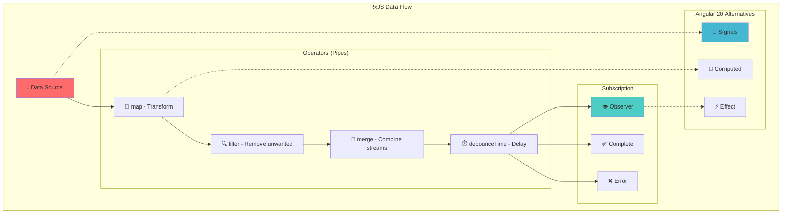
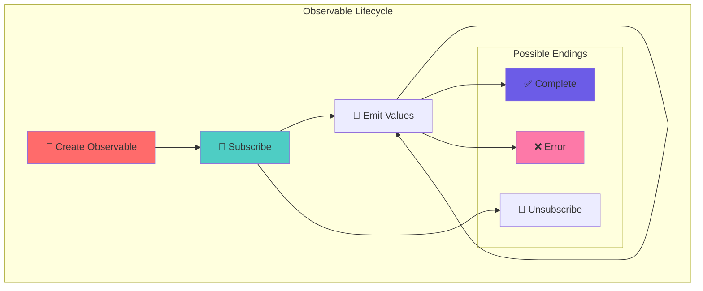
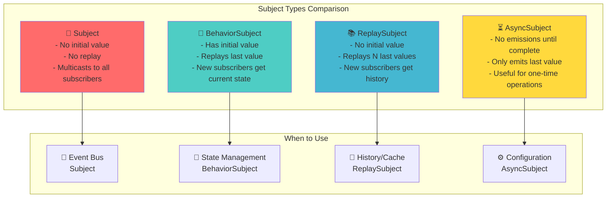

# 🌊 RxJS Complete Guide for Angular 20 - Observables, Operators & Signals Migration

## 📋 Table of Contents

1. [What is RxJS?](#what-is-rxjs)
2. [Observables Fundamentals](#observables-fundamentals)
3. [Subjects Deep Dive](#subjects-deep-dive)
4. [Creation Operators](#creation-operators)
5. [Transformation Operators](#transformation-operators)
6. [Filtering Operators](#filtering-operators)
7. [Combination Operators](#combination-operators)
8. [Error Handling Operators](#error-handling-operators)
9. [Utility Operators](#utility-operators)
10. [Conditional & Boolean Operators](#conditional-operators)
11. [Mathematical & Aggregate Operators](#mathematical-operators)
12. [Nested Observables](#nested-observables)
13. [RxJS vs Angular Signals](#rxjs-vs-signals)
14. [Real-World Scenarios](#real-world-scenarios)
15. [Interview Questions](#interview-questions)

---

## 🤔 What is RxJS? {#what-is-rxjs}

**RxJS** (Reactive Extensions for JavaScript) is a library for reactive programming using **Observables**. It's like having a **stream of water** where data flows through pipes (operators) that can transform, filter, combine, and manipulate the data.

### **Real-World Analogy**

Think of RxJS as a **water treatment plant**:

- **Observable** = Water source (river, well)
- **Operators** = Treatment filters (remove impurities, add chemicals)
- **Subscribe** = Turning on the tap to receive clean water
- **Unsubscribe** = Turning off the tap



### **Why RxJS in Angular?**

```typescript
// ❌ Without RxJS (Callback Hell)
function getUserData(userId: string, callback: Function) {
  getUser(userId, (user) => {
    getPosts(user.id, (posts) => {
      getComments(posts[0].id, (comments) => {
        callback({ user, posts, comments });
        // Nested callbacks become unmanageable
      });
    });
  });
}

// ✅ With RxJS (Clean & Reactive)
function getUserData(userId: string): Observable<UserData> {
  return getUser(userId).pipe(
    // Transform user data
    switchMap((user) =>
      // Get user posts and combine with user
      getPosts(user.id).pipe(map((posts) => ({ user, posts })))
    ),
    // Get comments for first post
    switchMap(({ user, posts }) =>
      getComments(posts[0].id).pipe(
        map((comments) => ({ user, posts, comments }))
      )
    ),
    // Handle errors gracefully
    catchError((error) => {
      console.error("Failed to load user data:", error);
      return of(null); // Return fallback data
    })
  );
}
```

---

## 🌊 Observables Fundamentals {#observables-fundamentals}

### **What is an Observable?**

An Observable is like a **lazy Promise** that can emit multiple values over time. Think of it as a **Netflix stream** - it only starts playing when you press play (subscribe).

```typescript
import { Observable, Observer } from "rxjs"; // 📦 Import RxJS core types

// 🏗️ CREATING AN OBSERVABLE FROM SCRATCH - Manual observable construction
const customObservable = new Observable<string>(
  (observer: Observer<string>) => { // 👁️ Observer parameter receives subscription callbacks
    console.log("🚀 Observable started!"); // 🎬 Only executes when someone subscribes

    // 📡 EMIT VALUES OVER TIME - Immediate data emission
    observer.next("First value");  // 📨 Send first data point to subscribers
    observer.next("Second value"); // 📨 Send second data point immediately after

    // ⏱️ SIMULATE ASYNC OPERATION - Demonstrate time-based data flow
    setTimeout(() => {
      observer.next("Delayed value"); // 📨 Emit value after 2-second delay
      observer.complete(); // ✅ Signal that observable has finished emitting
    }, 2000); // ⏱️ 2-second delay to simulate network request or processing

    // 🧹 CLEANUP FUNCTION - Return teardown logic for resource management
    return () => {
      console.log("🧹 Cleanup: Observable unsubscribed"); // 🗑️ Cleanup logs
      // 💡 Production usage: Clear intervals, cancel HTTP requests, remove event listeners
    };
  }
);

// 🎯 SUBSCRIBE TO RECEIVE VALUES - Start the observable stream
const subscription = customObservable.subscribe({
  // 📨 NEXT HANDLER - Called for each emitted value
  next: (value) => {
    console.log("📨 Received:", value); // 📝 Process each incoming data point
  },
  // ❌ ERROR HANDLER - Called when an error occurs in the stream
  error: (error) => {
    console.error("❌ Error:", error); // 🚨 Handle any stream errors gracefully
  },
  // ✅ COMPLETE HANDLER - Called when observable finishes successfully
  complete: () => {
    console.log("✅ Observable completed"); // 🎉 Stream ended without errors
  },
});

// 🛑 UNSUBSCRIBE AFTER DELAY - Demonstrate manual subscription cleanup
setTimeout(() => {
  subscription.unsubscribe(); // 🧹 Stop receiving values and trigger cleanup
  console.log("🛑 Unsubscribed"); // 📝 Log unsubscription event
}, 3000); // ⏱️ Wait 3 seconds before unsubscribing

/* 📋 EXECUTION TIMELINE AND OUTPUT:
0ms:   🚀 Observable started!     // Observer function starts
0ms:   📨 Received: First value    // First next() emitted
0ms:   📨 Received: Second value   // Second next() emitted
2000ms: 📨 Received: Delayed value // setTimeout next() after 2s
2000ms: ✅ Observable completed    // complete() called after 2s
3000ms: 🛑 Unsubscribed           // Manual unsubscribe after 3s
3000ms: 🧹 Cleanup: Observable unsubscribed // Cleanup function runs
*/
*/
```

### **Observable Lifecycle**



### **Hot vs Cold Observables**

```typescript
import { Observable, Subject, interval } from "rxjs";
import { share } from "rxjs/operators";

// 🧊 COLD OBSERVABLE - Each subscription creates a new independent execution
const coldObservable = new Observable((observer) => {
  console.log("🧊 Cold Observable started"); // 🎬 Runs for EACH subscriber

  // 🕐 CREATE INTERVAL - Each subscriber gets their own timer
  const intervalId = setInterval(() => {
    observer.next(Date.now()); // 📅 Each subscriber gets different timestamps
  }, 1000); // ⏱️ Emit timestamp every second

  // 🧹 CLEANUP FUNCTION - Clear interval when subscription ends
  return () => clearInterval(intervalId);
});

console.log("=== 🧊 Cold Observable Example ===");

// 👤 FIRST SUBSCRIBER - Starts its own execution timeline
coldObservable.subscribe((value) =>
  console.log("👤 Subscriber 1:", new Date(value).toLocaleTimeString())
);

// 👤 SECOND SUBSCRIBER - Starts 2 seconds later with its own execution
setTimeout(() => {
  coldObservable.subscribe((value) =>
    console.log("👤 Subscriber 2:", new Date(value).toLocaleTimeString())
  );
}, 2000); // ⏱️ Delayed subscription to demonstrate independence

// 🔥 HOT OBSERVABLE - All subscribers share the same execution
const hotObservable = coldObservable.pipe(share()); // 🔄 Convert cold to hot using share operator

console.log("=== 🔥 Hot Observable Example ===");

// 🔥 FIRST HOT SUBSCRIBER - Starts the shared execution
hotObservable.subscribe((value) =>
  console.log("🔥 Subscriber A:", new Date(value).toLocaleTimeString())
);

// 🔥 SECOND HOT SUBSCRIBER - Joins existing execution (same timestamps)
setTimeout(() => {
  hotObservable.subscribe((value) =>
    console.log("🔥 Subscriber B:", new Date(value).toLocaleTimeString())
  );
}, 2000); // ⏱️ Joins 2 seconds later but receives same stream

/* 📋 COLD vs HOT COMPARISON:

🧊 COLD OBSERVABLE OUTPUT:
=== Cold Observable Example ===
🧊 Cold Observable started        // First subscriber triggers execution
👤 Subscriber 1: 10:00:01        // Subscriber 1 gets its own timestamps
🧊 Cold Observable started        // Second subscriber triggers NEW execution  
👤 Subscriber 1: 10:00:02        // Subscriber 1 continues its timeline
👤 Subscriber 2: 10:00:03        // Subscriber 2 starts its own timeline
👤 Subscriber 1: 10:00:03        // Different timestamps for each subscriber
👤 Subscriber 2: 10:00:04

🔥 HOT OBSERVABLE OUTPUT:
=== Hot Observable Example ===
🔥 Subscriber A: 10:00:01        // First subscriber starts shared execution
🔥 Subscriber A: 10:00:02        // Shared timeline continues
🔥 Subscriber A: 10:00:03        // Second subscriber joins existing stream
🔥 Subscriber B: 10:00:03        // Same timestamp! Shared execution
🔥 Subscriber A: 10:00:04        // Both get same values
🔥 Subscriber B: 10:00:04
*/
```

### **Observable vs Promise Comparison**

```typescript
// 📦 Promise - Single value, eager execution
const promiseExample = new Promise((resolve, reject) => {
  console.log("🚀 Promise started immediately"); // Executes right away
  setTimeout(() => {
    resolve("Promise resolved");
  }, 1000);
});

// Promise executes even without .then()
console.log("Promise created");

promiseExample.then((value) => {
  console.log("📦 Promise result:", value);
});

// 🌊 Observable - Multiple values, lazy execution
const observableExample = new Observable((observer) => {
  console.log("🌊 Observable started only when subscribed"); // Only when subscribed

  let count = 0;
  const intervalId = setInterval(() => {
    observer.next(`Value ${++count}`);
    if (count === 3) {
      observer.complete();
      clearInterval(intervalId);
    }
  }, 500);

  return () => clearInterval(intervalId);
});

// Observable doesn't execute until subscribed
console.log("Observable created");

setTimeout(() => {
  console.log("Subscribing to observable...");
  observableExample.subscribe({
    next: (value) => console.log("🌊 Observable value:", value),
    complete: () => console.log("🌊 Observable completed"),
  });
}, 2000);
```

---

## 📡 Subjects Deep Dive {#subjects-deep-dive}

Subjects are **special types of Observables** that can multicast to multiple observers. Think of them as **radio stations** - they broadcast the same content to all listeners.

### **1. Subject - Basic Multicast**

```typescript
import { Subject } from "rxjs";

// Subject acts as both Observable and Observer
const subject = new Subject<string>();

// Multiple subscribers
const subscription1 = subject.subscribe({
  next: (value) => console.log("👤 Observer A:", value),
});

const subscription2 = subject.subscribe({
  next: (value) => console.log("👤 Observer B:", value),
});

// Subject can emit values manually
console.log("📡 Broadcasting messages...");
subject.next("Hello World"); // Both observers receive this
subject.next("Second message"); // Both observers receive this

// New subscriber joins late
setTimeout(() => {
  console.log("👤 Late subscriber joining...");
  const subscription3 = subject.subscribe({
    next: (value) => console.log("👤 Observer C (late):", value),
  });

  subject.next("Third message"); // All three observers receive this

  // Clean up
  subscription1.unsubscribe();
  subscription2.unsubscribe();
  subscription3.unsubscribe();
}, 1000);

/* Output:
📡 Broadcasting messages...
👤 Observer A: Hello World
👤 Observer B: Hello World
👤 Observer A: Second message
👤 Observer B: Second message
👤 Late subscriber joining...
👤 Observer A: Third message
👤 Observer B: Third message
👤 Observer C (late): Third message
*/
```

### **2. BehaviorSubject - Stores Latest Value**

````typescript
import { BehaviorSubject } from "rxjs";

// 💾 BEHAVIORSUBJECT CREATION - Requires an initial value to store
const behaviorSubject = new BehaviorSubject<string>("Initial Value"); // 🏁 Always starts with a value

console.log("=== 💾 BehaviorSubject Example ===");

// 👤 FIRST SUBSCRIBER - Gets initial value immediately upon subscription
behaviorSubject.subscribe({
  next: (value) => console.log("👤 Early subscriber:", value), // 📨 Receives "Initial Value" instantly
});

// 📡 EMIT NEW VALUES - Update the stored value and notify all subscribers
behaviorSubject.next("First update");  // 🔄 Store "First update" and broadcast
behaviorSubject.next("Second update"); // 🔄 Store "Second update" and broadcast

// 👤 LATE SUBSCRIBER - Gets the latest stored value immediately
setTimeout(() => {
  console.log("👤 Late subscriber joining...");
  behaviorSubject.subscribe({
    next: (value) => console.log("👤 Late subscriber:", value), // 📨 Receives "Second update" instantly
  });

  // 🔍 ACCESS CURRENT VALUE DIRECTLY - Synchronous value access
  console.log("📋 Current value:", behaviorSubject.value); // 💾 Direct access to stored value
}, 1000); // ⏱️ 1-second delay to demonstrate late subscription

/* 📋 EXECUTION TIMELINE AND OUTPUT:
0ms:   👤 Early subscriber: Initial Value   // Immediate emission of initial value
0ms:   👤 Early subscriber: First update    // First next() emission
0ms:   👤 Early subscriber: Second update   // Second next() emission
1000ms: 👤 Late subscriber joining...        // Late subscriber message
1000ms: 👤 Late subscriber: Second update   // Late subscriber gets LATEST value
1000ms: 📋 Current value: Second update     // Direct synchronous access
*/

**🔧 Real-world use case:**

```typescript
// 🔐 USER AUTHENTICATION STATE MANAGEMENT - Practical BehaviorSubject usage
class AuthService {
  // 💾 PRIVATE SUBJECT - Internal state management with initial false state
  private isAuthenticatedSubject = new BehaviorSubject<boolean>(false);

  // 📡 PUBLIC OBSERVABLE - Expose read-only stream to consumers
  public isAuthenticated$ = this.isAuthenticatedSubject.asObservable();

  /**
   * 🔑 LOGIN METHOD - Handle user authentication with state updates
   * @param {LoginCredentials} credentials - User login data
   * @returns {Observable<User>} User data stream
   */
  login(credentials: LoginCredentials): Observable<User> {
    return this.http.post<User>("/api/login", credentials).pipe(
      // ✅ SUCCESS HANDLER - Update authentication state on successful login
      tap((user) => {
        this.currentUser = user; // 💾 Store user data locally
        this.isAuthenticatedSubject.next(true); // 📡 Notify all subscribers: user is authenticated
      }),
      // ❌ ERROR HANDLER - Update authentication state on login failure
      catchError((error) => {
        this.isAuthenticatedSubject.next(false); // 📡 Notify all subscribers: authentication failed
        return throwError(error); // 🔄 Re-throw error for component handling
      })
    );
  }

  /**
   * 🚪 LOGOUT METHOD - Clear authentication state
   */
  logout(): void {
    this.currentUser = null; // 🧹 Clear stored user data
    this.isAuthenticatedSubject.next(false); // 📡 Notify all subscribers: user logged out
  }

  // 🔍 SYNCHRONOUS AUTH CHECK - Components can check current state immediately
  get isCurrentlyAuthenticated(): boolean {
    return this.isAuthenticatedSubject.value; // 💾 Direct access to current authentication state
  }
}

  logout(): void {
    this.currentUser = null;
    this.isAuthenticatedSubject.next(false); // All subscribers notified
  }

  // Components can check current authentication state immediately
  get isCurrentlyAuthenticated(): boolean {
    return this.isAuthenticatedSubject.value;
  }
}
````

### **3. ReplaySubject - Stores Multiple Past Values**

````typescript
import { ReplaySubject } from "rxjs";

// 🎬 REPLAYSUBJECT CREATION - Stores multiple past values for late subscribers
const replaySubject = new ReplaySubject<string>(3); // 💾 Buffer size: store last 3 values
// Alternative: new ReplaySubject<string>(3, 5000); // 💾 Store 3 values for 5 seconds

console.log("=== 🎬 ReplaySubject Example ===");

// 📡 EMIT VALUES BEFORE ANY SUBSCRIPTION - Values are stored in buffer
replaySubject.next("Value 1"); // 💾 Stored in buffer (position 1)
replaySubject.next("Value 2"); // 💾 Stored in buffer (position 2)
replaySubject.next("Value 3"); // 💾 Stored in buffer (position 3)
replaySubject.next("Value 4"); // 💾 Overwrites oldest value (Value 1 is lost)

// 👤 LATE SUBSCRIBER - Gets replayed values from buffer
console.log("👤 Late subscriber joining...");
replaySubject.subscribe({
  next: (value) => console.log("👤 Late subscriber receives:", value), // 🎬 Replays last 3 values
});

// 📡 EMIT MORE VALUES - New emissions go to all current subscribers
replaySubject.next("Value 5"); // 📨 Sent to current subscribers + stored in buffer

/* 📋 BUFFER MANAGEMENT AND OUTPUT:
Buffer state before subscription: ["Value 2", "Value 3", "Value 4"] (last 3)
👤 Late subscriber joining...
👤 Late subscriber receives: Value 2    // Replayed from buffer
👤 Late subscriber receives: Value 3    // Replayed from buffer
👤 Late subscriber receives: Value 4    // Replayed from buffer
👤 Late subscriber receives: Value 5    // New emission
*/

**🔧 Real-world use case:**

```typescript
// 💬 CHAT MESSAGE HISTORY SERVICE - Practical ReplaySubject usage
class ChatService {
  // 🎬 STORE LAST 50 MESSAGES - New users see recent conversation history
  private messagesSubject = new ReplaySubject<ChatMessage>(50);
  public messages$ = this.messagesSubject.asObservable();

  /**
   * 📨 SEND MESSAGE METHOD - Add message to chat and update history
   * @param {ChatMessage} message - Message to send
   */
  sendMessage(message: ChatMessage): void {
    // 🔒 Add timestamp and user info
    const enrichedMessage = {
      ...message,
      timestamp: new Date(),
      id: this.generateMessageId()
    };

    // 📡 Broadcast to all current subscribers + store in history buffer
    this.messagesSubject.next(enrichedMessage);

    // 🌐 Send to server (optional)
    this.http.post('/api/messages', enrichedMessage).subscribe();
  }

  /**
   * 👤 USER JOINS CHAT - Late subscribers get message history
   * When a user opens chat, they automatically see last 50 messages
   */
  joinChat(): Observable<ChatMessage> {
    return this.messages$; // 🎬 Immediately replays last 50 messages
  }

  /**
   * 🧹 CLEAR CHAT HISTORY - Reset message buffer
   */
  clearHistory(): void {
    // 🔄 Create new ReplaySubject to clear buffer
    this.messagesSubject = new ReplaySubject<ChatMessage>(50);
    this.messages$ = this.messagesSubject.asObservable();
  }

  private generateMessageId(): string {
    return Date.now().toString(36) + Math.random().toString(36).substr(2);
  }
}

// 🎮 USAGE EXAMPLE - Multiple users joining chat at different times
const chatService = new ChatService();

// 📨 Send some messages before anyone joins
chatService.sendMessage({ text: "Hello everyone!", userId: "user1" });
chatService.sendMessage({ text: "How's everyone doing?", userId: "user2" });
chatService.sendMessage({ text: "Great to be here!", userId: "user3" });

// 👤 USER A JOINS - Gets message history immediately
console.log("👤 User A joining chat...");
chatService.joinChat().subscribe(message => {
  console.log("👤 User A sees:", message.text, `(${message.userId})`);
});

// ⏱️ More messages sent while User A is in chat
setTimeout(() => {
  chatService.sendMessage({ text: "Welcome User A!", userId: "user2" });

  // 👤 USER B JOINS LATER - Gets full history including new messages
  console.log("👤 User B joining chat...");
  chatService.joinChat().subscribe(message => {
    console.log("👤 User B sees:", message.text, `(${message.userId})`);
  });
}, 2000);

/* 📋 CHAT TIMELINE OUTPUT:
👤 User A joining chat...
👤 User A sees: Hello everyone! (user1)        // From history buffer
👤 User A sees: How's everyone doing? (user2)  // From history buffer
👤 User A sees: Great to be here! (user3)      // From history buffer
👤 User A sees: Welcome User A! (user2)        // Live message
👤 User B joining chat...
👤 User B sees: Hello everyone! (user1)        // Full history replay
👤 User B sees: How's everyone doing? (user2)  // Full history replay
👤 User B sees: Great to be here! (user3)      // Full history replay
👤 User B sees: Welcome User A! (user2)        // Full history replay
*/
class ChatService {
  private messagesSubject = new ReplaySubject<ChatMessage>(50); // Last 50 messages
  public messages$ = this.messagesSubject.asObservable();

  sendMessage(message: string): void {
    const chatMessage: ChatMessage = {
      id: Date.now().toString(),
      text: message,
      timestamp: new Date(),
      userId: this.currentUserId,
    };

    // All existing subscribers get new message
    // New subscribers get last 50 messages + this one
    this.messagesSubject.next(chatMessage);

    // Also send to server
    this.http.post("/api/chat/messages", chatMessage).subscribe();
  }

  // When user joins chat, they automatically get message history
  joinChat(chatId: string): void {
    this.loadRecentMessages(chatId).subscribe((messages) => {
      messages.forEach((msg) => this.messagesSubject.next(msg));
    });
  }
}
````

### **4. AsyncSubject - Only Last Value on Complete**

```typescript
import { AsyncSubject } from "rxjs";

// AsyncSubject only emits the last value when completed
const asyncSubject = new AsyncSubject<string>();

console.log("=== AsyncSubject Example ===");

// Subscribe before any values
asyncSubject.subscribe({
  next: (value) => console.log("👤 Observer 1:", value),
  complete: () => console.log("👤 Observer 1: Completed"),
});

// Emit multiple values
asyncSubject.next("First value");
asyncSubject.next("Second value");
asyncSubject.next("Last value"); // Only this will be emitted

// Subscribe after values but before complete
asyncSubject.subscribe({
  next: (value) => console.log("👤 Observer 2:", value),
  complete: () => console.log("👤 Observer 2: Completed"),
});

// Complete the subject (triggers emission)
setTimeout(() => {
  asyncSubject.complete();
}, 1000);

/* Output:
👤 Observer 1: Last value
👤 Observer 1: Completed
👤 Observer 2: Last value
👤 Observer 2: Completed
*/
```

**Real-world use case:**

```typescript
// Configuration loading service
class ConfigService {
  private configSubject = new AsyncSubject<AppConfig>();
  public config$ = this.configSubject.asObservable();

  loadConfiguration(): void {
    this.http.get<AppConfig>("/api/config").subscribe({
      next: (config) => {
        // Validate and process config
        const processedConfig = this.processConfig(config);
        this.configSubject.next(processedConfig);
        this.configSubject.complete(); // Now all subscribers get the final config
      },
      error: (error) => this.configSubject.error(error),
    });
  }

  // Components subscribe and only get config when it's fully loaded
  getFeatureFlag(flagName: string): Observable<boolean> {
    return this.config$.pipe(
      map((config) => config.featureFlags[flagName] || false)
    );
  }
}
```

### **Subject Types Comparison**



---

## 🏗️ Creation Operators {#creation-operators}

Creation operators are **factory functions** that create Observables from various sources. Think of them as **different ways to turn on a water faucet**.

### **1. of - Create from Known Values**

````typescript
import { of } from "rxjs";
import { delay, map } from "rxjs/operators";

// 🏗️ CREATE OBSERVABLE FROM KNOWN VALUES - Synchronous emission of predefined data
const numbersObservable = of(1, 2, 3, 4, 5); // 📊 Creates observable that emits each number sequentially

console.log("=== 🔢 of() Operator ===");
numbersObservable.subscribe({
  next: (value) => console.log("📨 Received number:", value), // 📊 Each number emitted individually
  complete: () => console.log("✅ Numbers completed"), // 🎉 Completes after all values emitted
});

// 🏗️ CREATE OBSERVABLE FROM OBJECTS - Complex data structures
const usersObservable = of(
  { id: 1, name: "John", email: "john@email.com" },   // 👤 First user object
  { id: 2, name: "Jane", email: "jane@email.com" },   // 👤 Second user object
  { id: 3, name: "Bob", email: "bob@email.com" }      // 👤 Third user object
);

console.log("=== 👥 of() with Objects ===");
usersObservable
  .pipe(
    // 🔄 TRANSFORM EACH USER OBJECT - Map operator modifies emitted data
    map((user) => `👤 ${user.name} (${user.email})`), // 📝 Format user info as string
    // ⏱️ ADD DELAY TO SIMULATE ASYNC - Make synchronous data appear asynchronous
    delay(500) // 📡 500ms delay between each user emission (simulates API call)
  )
  .subscribe({
    next: (userInfo) => console.log(userInfo), // 📝 Display formatted user info
    complete: () => console.log("✅ Users completed"), // 🎉 All users processed
  });

/* 📋 EXECUTION TIMELINE AND OUTPUT:
=== of() Operator ===
0ms:   📨 Received number: 1      // Immediate synchronous emission
0ms:   📨 Received number: 2      // All values emitted at once
0ms:   📨 Received number: 3
0ms:   📨 Received number: 4
0ms:   📨 Received number: 5
0ms:   ✅ Numbers completed       // Completes immediately

=== of() with Objects ===
500ms:  👤 John (john@email.com)   // First user after delay
1000ms: 👤 Jane (jane@email.com)   // Second user after additional delay
1500ms: 👤 Bob (bob@email.com)     // Third user after additional delay
1500ms: ✅ Users completed         // Completes after all emissions
*/

**🔧 Real-world Angular use case:**

```typescript
// 📚 MOCK DATA SERVICE FOR DEVELOPMENT - Practical of() operator usage
@Injectable()
export class UserService {
  // 💾 MOCK USER DATA - Development/testing data
  private mockUsers = [
    { id: 1, name: "John Doe", role: "admin" },      // 👑 Admin user
    { id: 2, name: "Jane Smith", role: "user" },     // 👤 Regular user
    { id: 3, name: "Bob Johnson", role: "moderator" }, // 🛡️ Moderator user
  ];

  /**
   * 👥 GET USERS METHOD - Environment-aware data source
   * Returns real API data in production, mock data in development
   * @returns {Observable<User[]>} Stream of user data
   */
  getUsers(): Observable<User[]> {
    // 🌐 PRODUCTION MODE - Use real API endpoint
    if (environment.production) {
      return this.http.get<User[]>("/api/users"); // 📡 HTTP request to server
    } else {
      // 🛠️ DEVELOPMENT MODE - Use mock data with of() operator
      return of(this.mockUsers).pipe(
        delay(1000) // ⏱️ Simulate network latency for realistic testing
      );
    }
  }

  /**
   * 🔍 GET USER BY ID METHOD - Find specific user
   * @param {number} id - User identifier
   * @returns {Observable<User | null>} Single user or null if not found
   */
  getUserById(id: number): Observable<User | null> {
    // 🔍 FIND USER IN MOCK DATA - Synchronous search
    const user = this.mockUsers.find((u) => u.id === id);

    // 🏗️ CREATE OBSERVABLE - Return found user or null using of()
    return of(user || null); // 📦 Wraps result in Observable for consistent API
  }

  /**
   * ✅ VALIDATE USER PERMISSIONS - Quick permission check
   * @param {number} userId - User to check
   * @param {string} permission - Required permission
   * @returns {Observable<boolean>} Permission validation result
   */
  hasPermission(userId: number, permission: string): Observable<boolean> {
    const user = this.mockUsers.find(u => u.id === userId);

    // 🔒 PERMISSION LOGIC - Admin has all permissions
    const hasPermission = user?.role === 'admin' ||
                         (user?.role === 'moderator' && permission !== 'admin');

    // 🏗️ RETURN OBSERVABLE BOOLEAN - Consistent async API
    return of(hasPermission).pipe(
      delay(100) // ⏱️ Small delay to simulate permission check
    );
  }
}
````

### **2. from - Create from Iterables/Promises**

````typescript
import { from, fromEvent } from "rxjs";
import { map, take } from "rxjs/operators";

// 🔄 CONVERT ARRAY TO OBSERVABLE - Transform iterable into reactive stream
const arrayObservable = from([10, 20, 30, 40, 50]); // 📊 Each array element becomes separate emission

console.log("=== 📊 from() with Array ===");
arrayObservable.subscribe({
  next: (value) => console.log("📨 Array value:", value), // 📊 Each element emitted individually
  complete: () => console.log("✅ Array completed"), // 🎉 Completes after all elements processed
});

// 🔄 CONVERT PROMISE TO OBSERVABLE - Handle async operations reactively
const promiseObservable = from(
  fetch('https://jsonplaceholder.typicode.com/users/1') // 🌐 HTTP request returning Promise
    .then(response => response.json()) // 🔄 Parse JSON response
);

console.log("=== 🌐 from() with Promise ===");
promiseObservable.subscribe({
  next: (user) => console.log("👤 User from Promise:", user.name), // 👤 Handle resolved Promise value
  error: (error) => console.error("❌ Promise error:", error), // 🚨 Handle Promise rejection
  complete: () => console.log("✅ Promise completed") // 🎉 Promise resolved successfully
});

// 🔄 CONVERT STRING TO OBSERVABLE - Each character as separate emission
const stringObservable = from("Hello"); // 📝 Each character becomes an emission

console.log("=== 📝 from() with String ===");
stringObservable
  .pipe(
    map(char => char.toUpperCase()), // 🔄 Transform each character to uppercase
    map(char => `📝 Letter: ${char}`) // 📝 Format each character for display
  )
  .subscribe({
    next: (letter) => console.log(letter), // 📝 Display each formatted character
    complete: () => console.log("✅ String completed") // 🎉 All characters processed
  });

// 🖱️ CONVERT DOM EVENTS TO OBSERVABLE - Reactive event handling
const buttonClickObservable = fromEvent(document.getElementById('myButton'), 'click');

console.log("=== 🖱️ fromEvent() with DOM Events ===");
buttonClickObservable
  .pipe(
    take(5), // 🔢 Only take first 5 clicks
    map((event: Event) => ({
      timestamp: Date.now(), // ⏱️ When click occurred
      target: (event.target as HTMLElement)?.tagName, // 🎯 What was clicked
      coordinates: { // 📍 Where click occurred
        x: (event as MouseEvent).clientX,
        y: (event as MouseEvent).clientY
      }
    }))
  )
  .subscribe({
    next: (clickData) => console.log("🖱️ Click:", clickData), // 🖱️ Handle each click
    complete: () => console.log("✅ 5 clicks completed") // 🎉 After 5 clicks
  });

/* 📋 EXECUTION TIMELINE AND OUTPUT:
=== from() with Array ===
0ms: 📨 Array value: 10           // Immediate synchronous emissions
0ms: 📨 Array value: 20
0ms: 📨 Array value: 30
0ms: 📨 Array value: 40
0ms: 📨 Array value: 50
0ms: ✅ Array completed

=== from() with String ===
0ms: 📝 Letter: H                 // Each character emitted separately
0ms: 📝 Letter: E
0ms: 📝 Letter: L
0ms: 📝 Letter: L
0ms: 📝 Letter: O
0ms: ✅ String completed

=== from() with Promise ===
~200ms: 👤 User from Promise: Leanne Graham  // When Promise resolves
~200ms: ✅ Promise completed

=== fromEvent() with DOM Events ===
// Output depends on user clicks:
Click 1: 🖱️ Click: {timestamp: 1699123456789, target: 'BUTTON', coordinates: {x: 150, y: 200}}
Click 2: 🖱️ Click: {timestamp: 1699123457123, target: 'BUTTON', coordinates: {x: 152, y: 198}}
... (up to 5 clicks)
✅ 5 clicks completed
*/

**🔧 Real-world Angular use cases:**

```typescript
// 📱 FILE UPLOAD SERVICE - Practical from() operator usage
@Injectable()
export class FileUploadService {

  /**
   * 📁 UPLOAD MULTIPLE FILES - Convert FileList to Observable stream
   * @param {FileList} files - Files selected by user
   * @returns {Observable<UploadResult>} Stream of upload results
   */
  uploadFiles(files: FileList): Observable<UploadResult> {
    // 🔄 CONVERT FILELIST TO ARRAY - FileList is iterable but not array
    const fileArray = Array.from(files); // 📊 Convert to proper array

    // 🔄 CREATE OBSERVABLE FROM ARRAY - Each file becomes separate emission
    return from(fileArray).pipe(
      // 🔄 TRANSFORM EACH FILE - Process individual file uploads
      mergeMap(file => this.uploadSingleFile(file)), // 📤 Upload each file individually
      // 📊 TRACK PROGRESS - Add upload progress information
      scan((acc, result) => ({
        completed: acc.completed + 1,
        total: fileArray.length,
        results: [...acc.results, result]
      }), { completed: 0, total: fileArray.length, results: [] })
    );
  }

  /**
   * 📤 SINGLE FILE UPLOAD - Handle individual file upload
   * @param {File} file - File to upload
   * @returns {Observable<UploadResult>} Upload result
   */
  private uploadSingleFile(file: File): Observable<UploadResult> {
    const formData = new FormData();
    formData.append('file', file);

    return this.http.post<UploadResult>('/api/upload', formData, {
      reportProgress: true, // 📊 Enable progress tracking
      observe: 'events' // 🎯 Observe HTTP events
    }).pipe(
      // 🔄 FILTER FOR COMPLETION - Only emit when upload completes
      filter(event => event.type === HttpEventType.Response),
      // 📊 EXTRACT RESPONSE BODY - Get actual upload result
      map(event => (event as HttpResponse<UploadResult>).body)
    );
  }
}

// 🎮 FORM VALIDATION SERVICE - Reactive form handling
@Injectable()
export class ValidationService {

  /**
   * 🔍 VALIDATE MULTIPLE FIELDS - Process array of validation rules
   * @param {ValidationRule[]} rules - Validation rules to check
   * @returns {Observable<ValidationResult>} Validation results stream
   */
  validateFields(rules: ValidationRule[]): Observable<ValidationResult> {
    // 🔄 CONVERT RULES ARRAY TO OBSERVABLE - Each rule becomes emission
    return from(rules).pipe(
      // 🔄 PROCESS EACH RULE - Transform to validation result
      mergeMap(rule => this.validateSingleRule(rule)),
      // 📊 COLLECT ALL RESULTS - Gather validation outcomes
      toArray(), // 📋 Wait for all validations to complete
      // 🔄 TRANSFORM TO FINAL RESULT - Combine individual results
      map(results => ({
        isValid: results.every(r => r.isValid), // ✅ All rules must pass
        errors: results.filter(r => !r.isValid).map(r => r.error) // ❌ Collect errors
      }))
    );
  }

  private validateSingleRule(rule: ValidationRule): Observable<{isValid: boolean, error?: string}> {
    // 🔍 Validation logic implementation
    return of({ isValid: true }); // Simplified for example
  }
}

// 🎬 ANIMATION SERVICE - Sequential animations using from()
@Injectable()
export class AnimationService {

  /**
   * 🎭 PLAY ANIMATION SEQUENCE - Execute animations in order
   * @param {AnimationStep[]} steps - Animation steps to execute
   * @returns {Observable<AnimationResult>} Animation completion stream
   */
  playSequence(steps: AnimationStep[]): Observable<AnimationResult> {
    // 🔄 CONVERT STEPS TO OBSERVABLE - Each step becomes emission
    return from(steps).pipe(
      // 🎬 EXECUTE STEPS SEQUENTIALLY - Wait for each animation to complete
      concatMap(step => this.executeAnimationStep(step)),
      // 📊 TRACK PROGRESS - Monitor animation progress
      scan((progress, result) => ({
        completed: progress.completed + 1,
        total: steps.length,
        currentStep: result.step,
        duration: progress.duration + result.duration
      }), { completed: 0, total: steps.length, currentStep: '', duration: 0 })
    );
  }

  private executeAnimationStep(step: AnimationStep): Observable<AnimationResult> {
    // 🎬 Animation execution implementation
    return of({ step: step.name, duration: step.duration });
  }
}

// Convert Promise to Observable
const promiseObservable = from(
  fetch("https://jsonplaceholder.typicode.com/users/1").then((response) =>
    response.json()
  )
);

console.log("=== from() with Promise ===");
promiseObservable.subscribe({
  next: (user) => console.log("👤 User from Promise:", user.name),
  error: (error) => console.error("❌ Promise error:", error),
  complete: () => console.log("✅ Promise completed"),
});

// Convert string to Observable (each character)
const stringObservable = from("Hello");

console.log("=== from() with String ===");
stringObservable.subscribe({
  next: (char) => console.log("📝 Character:", char),
  complete: () => console.log("✅ String completed"),
});

// Convert Set to Observable
const setObservable = from(new Set([1, 2, 3, 2, 1])); // Duplicates removed

console.log("=== from() with Set ===");
setObservable.subscribe({
  next: (value) => console.log("🔢 Set value:", value),
  complete: () => console.log("✅ Set completed"),
});

/* Output:
=== from() with Array ===
📨 Array value: 10
📨 Array value: 20
📨 Array value: 30
📨 Array value: 40
📨 Array value: 50
✅ Array completed

=== from() with String ===
📝 Character: H
📝 Character: e
📝 Character: l
📝 Character: l
📝 Character: o
✅ String completed

=== from() with Set ===
🔢 Set value: 1
🔢 Set value: 2
🔢 Set value: 3
✅ Set completed
*/
````

**Real-world Angular use case:**

```typescript
// File upload service
@Injectable()
export class FileUploadService {
  // Convert FileList to Observable for processing
  uploadMultipleFiles(fileList: FileList): Observable<UploadResult[]> {
    // Convert FileList to array, then to Observable
    return from(Array.from(fileList)).pipe(
      // Process each file individually
      mergeMap((file) => this.uploadSingleFile(file)),
      // Collect all results
      toArray(),
      // Handle errors gracefully
      catchError((error) => {
        console.error("Upload failed:", error);
        return of([]);
      })
    );
  }

  private uploadSingleFile(file: File): Observable<UploadResult> {
    const formData = new FormData();
    formData.append("file", file);

    // Convert Promise-based fetch to Observable
    return from(
      fetch("/api/upload", {
        method: "POST",
        body: formData,
      }).then((response) => response.json())
    ).pipe(
      map((response) => ({
        fileName: file.name,
        success: response.success,
        url: response.url,
      }))
    );
  }
}
```

### **3. interval - Create Timed Sequence**

```typescript
import { interval, timer } from "rxjs";
import { take, map, takeUntil } from "rxjs/operators";

// Emit values every second
const intervalObservable = interval(1000);

console.log("=== interval() Example ===");
const subscription = intervalObservable
  .pipe(
    take(5), // Only take first 5 values
    map((value) => `⏰ Tick ${value + 1}`)
  )
  .subscribe({
    next: (value) => console.log(value),
    complete: () => console.log("✅ Interval completed"),
  });

// Timer - starts after delay, then emits every period
const timerObservable = timer(2000, 1000); // Start after 2s, then every 1s

console.log("=== timer() Example ===");
const timerSubscription = timerObservable
  .pipe(
    take(3),
    map((value) => `⏲️ Timer tick ${value + 1}`)
  )
  .subscribe({
    next: (value) => console.log(value),
    complete: () => console.log("✅ Timer completed"),
  });

/* Output:
=== interval() Example ===
⏰ Tick 1
⏰ Tick 2
⏰ Tick 3
⏰ Tick 4
⏰ Tick 5
✅ Interval completed

=== timer() Example ===
(after 2 seconds)
⏲️ Timer tick 1
⏲️ Timer tick 2
⏲️ Timer tick 3
✅ Timer completed
*/
```

**Real-world Angular use case:**

```typescript
// Real-time dashboard component
@Component({
  selector: "app-dashboard",
  template: `
    <div class="dashboard">
      <h2>Real-time Dashboard</h2>
      <div class="metrics">
        <div class="metric">
          <span>Active Users:</span>
          <span>{{ activeUsers }}</span>
        </div>
        <div class="metric">
          <span>Sales Today:</span>
          <span>{{ salesToday | currency }}</span>
        </div>
        <div class="metric">
          <span>Last Updated:</span>
          <span>{{ lastUpdated | date : "short" }}</span>
        </div>
      </div>
    </div>
  `,
})
export class DashboardComponent implements OnInit, OnDestroy {
  activeUsers = 0;
  salesToday = 0;
  lastUpdated = new Date();

  private destroy$ = new Subject<void>();

  constructor(private dashboardService: DashboardService) {}

  ngOnInit() {
    // Update dashboard every 30 seconds
    interval(30000)
      .pipe(
        startWith(0), // Trigger immediately
        switchMap(() => this.dashboardService.getDashboardData()),
        takeUntil(this.destroy$), // Clean up on destroy
        catchError((error) => {
          console.error("Dashboard update failed:", error);
          return of(null); // Continue with empty data
        })
      )
      .subscribe((data) => {
        if (data) {
          this.activeUsers = data.activeUsers;
          this.salesToday = data.salesToday;
          this.lastUpdated = new Date();
        }
      });
  }

  ngOnDestroy() {
    this.destroy$.next();
    this.destroy$.complete();
  }
}
```

### **4. range - Create Sequence of Numbers**

```typescript
import { range } from "rxjs";
import { map, filter } from "rxjs/operators";

// Create sequence from 1 to 10
const rangeObservable = range(1, 10);

console.log("=== range() Basic Example ===");
rangeObservable.subscribe({
  next: (value) => console.log("📈 Range value:", value),
  complete: () => console.log("✅ Range completed"),
});

// Practical example: Generate page numbers
const pageNumbers = range(1, 5).pipe(
  map((pageNum) => ({
    page: pageNum,
    label: `Page ${pageNum}`,
    active: pageNum === 1,
  }))
);

console.log("=== range() Pagination Example ===");
pageNumbers.subscribe({
  next: (pageInfo) => console.log("📄", pageInfo),
  complete: () => console.log("✅ Pagination completed"),
});

// Generate test data
const testUsers = range(1, 100).pipe(
  map((id) => ({
    id,
    name: `User ${id}`,
    email: `user${id}@example.com`,
    active: Math.random() > 0.3, // 70% chance of being active
  })),
  filter((user) => user.active), // Only include active users
  take(10) // Limit to first 10 active users
);

console.log("=== range() Test Data Example ===");
testUsers.subscribe({
  next: (user) => console.log("👤 Active user:", user.name),
  complete: () => console.log("✅ Test data completed"),
});

/* Output:
=== range() Basic Example ===
📈 Range value: 1
📈 Range value: 2
📈 Range value: 3
... (continues to 10)
✅ Range completed

=== range() Pagination Example ===
📄 { page: 1, label: 'Page 1', active: true }
📄 { page: 2, label: 'Page 2', active: false }
📄 { page: 3, label: 'Page 3', active: false }
📄 { page: 4, label: 'Page 4', active: false }
📄 { page: 5, label: 'Page 5', active: false }
✅ Pagination completed
*/
```

### **5. fromEvent - Create from DOM Events**

```typescript
import { fromEvent } from "rxjs";
import { map, debounceTime, distinctUntilChanged } from "rxjs/operators";

// Mouse clicks
const clickObservable = fromEvent(document, "click");

console.log("=== fromEvent() Click Example ===");
clickObservable
  .pipe(
    map((event: MouseEvent) => ({
      x: event.clientX,
      y: event.clientY,
      timestamp: new Date().toISOString(),
    })),
    take(3) // Only take first 3 clicks
  )
  .subscribe({
    next: (clickInfo) => console.log("🖱️ Click at:", clickInfo),
    complete: () => console.log("✅ Click tracking completed"),
  });

// Keyboard events
const keyboardObservable = fromEvent(document, "keydown");

console.log("=== fromEvent() Keyboard Example ===");
keyboardObservable
  .pipe(
    map((event: KeyboardEvent) => ({
      key: event.key,
      code: event.code,
      ctrlKey: event.ctrlKey,
      shiftKey: event.shiftKey,
    })),
    filter((keyInfo) => keyInfo.key.length === 1), // Only single characters
    take(5)
  )
  .subscribe({
    next: (keyInfo) => console.log("⌨️ Key pressed:", keyInfo),
    complete: () => console.log("✅ Keyboard tracking completed"),
  });

// Window resize with debouncing
const resizeObservable = fromEvent(window, "resize");

console.log("=== fromEvent() Resize Example ===");
resizeObservable
  .pipe(
    debounceTime(300), // Wait for 300ms of no more events
    map(() => ({
      width: window.innerWidth,
      height: window.innerHeight,
    })),
    distinctUntilChanged(
      (prev, curr) => prev.width === curr.width && prev.height === curr.height
    ),
    take(3)
  )
  .subscribe({
    next: (size) => console.log("📐 Window resized to:", size),
    complete: () => console.log("✅ Resize tracking completed"),
  });
```

**Real-world Angular use case:**

```typescript
// Responsive navigation component
@Component({
  selector: "app-navigation",
  template: `
    <nav class="navigation" [class.mobile]="isMobile">
      <button class="menu-toggle" *ngIf="isMobile" (click)="toggleMenu()">
        ☰
      </button>

      <ul class="nav-menu" [class.open]="menuOpen">
        <li><a href="/home">Home</a></li>
        <li><a href="/about">About</a></li>
        <li><a href="/contact">Contact</a></li>
      </ul>
    </nav>
  `,
})
export class NavigationComponent implements OnInit, OnDestroy {
  isMobile = false;
  menuOpen = false;

  private destroy$ = new Subject<void>();

  ngOnInit() {
    // Detect mobile viewport changes
    fromEvent(window, "resize")
      .pipe(
        startWith(null), // Trigger immediately
        debounceTime(100), // Debounce resize events
        map(() => window.innerWidth < 768),
        distinctUntilChanged(), // Only emit when mobile state changes
        takeUntil(this.destroy$)
      )
      .subscribe((isMobile) => {
        this.isMobile = isMobile;
        if (!isMobile) {
          this.menuOpen = false; // Close mobile menu on desktop
        }
      });

    // Close mobile menu when clicking outside
    fromEvent(document, "click")
      .pipe(
        filter(() => this.isMobile && this.menuOpen),
        map((event) => event.target as HTMLElement),
        filter((target) => !target.closest(".navigation")),
        takeUntil(this.destroy$)
      )
      .subscribe(() => {
        this.menuOpen = false;
      });
  }

  toggleMenu() {
    this.menuOpen = !this.menuOpen;
  }

  ngOnDestroy() {
    this.destroy$.next();
    this.destroy$.complete();
  }
}
```

---

## 🔄 Transformation Operators {#transformation-operators}

Transformation operators **transform values** emitted by Observables. Think of them as **assembly line workers** that modify each item as it passes through.

### **1. map - Transform Each Value**

````typescript
import { of, interval } from "rxjs";
import { map, take } from "rxjs/operators";

// 🔢 BASIC MAP TRANSFORMATION - Transform each emitted value
const numbers = of(1, 2, 3, 4, 5); // 📊 Source observable with numbers

console.log("=== 🔢 map() Basic Example ===");
numbers
  .pipe(
    // 🔄 TRANSFORM EACH VALUE - Apply function to every emission
    map((value) => value * 2) // 📈 Multiply each number by 2
  )
  .subscribe({
    next: (value) => console.log("🔢 Doubled:", value), // 📊 Display transformed value
    complete: () => console.log("✅ Doubling completed"), // 🎉 All values processed
  });

// 👤 TRANSFORM OBJECTS - Complex data structure transformation
const users = of(
  { id: 1, firstName: "John", lastName: "Doe", age: 30 },      // 👤 User 1 data
  { id: 2, firstName: "Jane", lastName: "Smith", age: 25 },    // 👤 User 2 data
  { id: 3, firstName: "Bob", lastName: "Johnson", age: 35 }    // 👤 User 3 data
);

console.log("=== 👤 map() Object Transformation ===");
users
  .pipe(
    // 🔄 COMPLEX OBJECT TRANSFORMATION - Reshape and enhance data structure
    map((user) => ({
      id: user.id, // 🆔 Keep original ID
      fullName: `${user.firstName} ${user.lastName}`, // 📝 Combine first and last name
      isAdult: user.age >= 18, // ✅ Add computed boolean property
      initials: `${user.firstName[0]}${user.lastName[0]}`.toUpperCase(), // 🔤 Extract and format initials
      ageCategory: user.age < 30 ? 'Young' : user.age < 50 ? 'Middle-aged' : 'Senior' // 📊 Categorize by age
    }))
  )
  .subscribe({
    next: (transformedUser) =>
      console.log("👤 Transformed user:", transformedUser), // 📊 Display enhanced user object
    complete: () => console.log("✅ User transformation completed"), // 🎉 All users processed
  });

// 🔗 CHAIN MULTIPLE MAPS - Sequential transformations in pipeline
const timestamps = interval(1000); // ⏱️ Emit incrementing numbers every second

console.log("=== ⏰ map() Chaining Example ===");
timestamps
  .pipe(
    take(5), // 🔢 Only take first 5 emissions
    // 🔄 FIRST TRANSFORMATION - Convert counter to Date object
    map((value) => new Date()), // 📅 Create Date from current timestamp
    // 🔄 SECOND TRANSFORMATION - Extract time information
    map((date) => ({
      timestamp: date.getTime(), // 📊 Unix timestamp
      readable: date.toLocaleTimeString(), // 📝 Human-readable time
      hour: date.getHours(), // 🕐 Extract hour
      minute: date.getMinutes(), // 🕐 Extract minute
      isWorkingHours: date.getHours() >= 9 && date.getHours() <= 17, // 💼 Business hours check
      dayPeriod: date.getHours() < 12 ? 'Morning' : date.getHours() < 18 ? 'Afternoon' : 'Evening' // 🌅 Time period
    }))
  )
  .subscribe({
    next: (timeInfo) => console.log("⏰ Time info:", timeInfo), // 📊 Display time analysis
    complete: () => console.log("✅ Time tracking completed"), // 🎉 Completed after 5 emissions
  });

/* 📋 EXECUTION TIMELINE AND OUTPUT:
=== map() Basic Example ===
0ms: 🔢 Doubled: 2               // 1 * 2 = 2
0ms: 🔢 Doubled: 4               // 2 * 2 = 4
0ms: 🔢 Doubled: 6               // 3 * 2 = 6
0ms: 🔢 Doubled: 8               // 4 * 2 = 8
0ms: 🔢 Doubled: 10              // 5 * 2 = 10
0ms: ✅ Doubling completed

=== map() Object Transformation ===
0ms: 👤 Transformed user: {id: 1, fullName: 'John Doe', isAdult: true, initials: 'JD', ageCategory: 'Young'}
0ms: 👤 Transformed user: {id: 2, fullName: 'Jane Smith', isAdult: true, initials: 'JS', ageCategory: 'Young'}
0ms: 👤 Transformed user: {id: 3, fullName: 'Bob Johnson', isAdult: true, initials: 'BJ', ageCategory: 'Middle-aged'}
0ms: ✅ User transformation completed

=== map() Chaining Example ===
1000ms: ⏰ Time info: {timestamp: 1699..., readable: '2:30:15 PM', hour: 14, minute: 30, isWorkingHours: true, dayPeriod: 'Afternoon'}
2000ms: ⏰ Time info: {timestamp: 1699..., readable: '2:30:16 PM', hour: 14, minute: 30, isWorkingHours: true, dayPeriod: 'Afternoon'}
... (continues for 5 emissions)
*/

**🔧 Real-world Angular use case:**

```typescript
// 📦 PRODUCT SERVICE WITH DATA TRANSFORMATION - Practical map() usage
@Injectable()
export class ProductService {
  constructor(private http: HttpClient) {} // 🌐 HTTP client for API calls

  /**
   * 📊 GET PRODUCTS WITH TRANSFORMATION - Fetch and enhance product data
   * @returns {Observable<Product[]>} Stream of enhanced product objects
   */
  getProducts(): Observable<Product[]> {
    return this.http.get<ProductDTO[]>("/api/products").pipe(
      // 🔄 FIRST MAP - Transform API response to domain model
      map((productDTOs) =>
        productDTOs.map((dto) => this.transformProductDTO(dto)) // 🔄 Convert each DTO to domain object
      ),
      // 🔄 SECOND MAP - Add computed properties for UI
      map((products) =>
        products.map((product) => ({
          ...product, // 📋 Spread existing properties
          // 💰 CALCULATE DISPLAY PRICE - Handle discounts
          displayPrice: product.discount > 0
            ? product.price * (1 - product.discount / 100) // 📊 Apply discount
            : product.price, // 💰 Original price if no discount
          // 🏷️ PRICE DISPLAY FORMAT - User-friendly price strings
          formattedPrice: this.formatPrice(product.price), // 💲 Format as currency
          discountText: product.discount > 0
            ? `${product.discount}% OFF` // 🏷️ Discount label
            : null, // 🚫 No discount text
          // 📊 STOCK STATUS - Inventory level categorization
          stockStatus: this.getStockStatus(product.quantity), // 📦 Calculate stock level
          // 🎯 UI DISPLAY FLAGS - Frontend rendering helpers
          isOnSale: product.discount > 0, // 🔥 Sale indicator
          isLowStock: product.quantity < 10, // ⚠️ Low stock warning
          isNewProduct: this.isProductNew(product.createdDate), // ✨ New product badge
          // 🔍 SEARCH OPTIMIZATION - Enhanced searchable text
          searchText: `${product.name} ${product.category} ${product.brand}`.toLowerCase() // 📝 Searchable string
        }))
      ),
      // 🔄 THIRD MAP - Sort and categorize for display
      map((products) =>
        products.sort((a, b) => {
          // 🎯 CUSTOM SORTING LOGIC - Featured products first
          if (a.featured !== b.featured) return a.featured ? -1 : 1;
          if (a.isOnSale !== b.isOnSale) return a.isOnSale ? -1 : 1;
          return a.name.localeCompare(b.name); // 📝 Alphabetical fallback
        })
      )
    );
  }

  /**
   * 🔄 TRANSFORM PRODUCT DTO - Convert API response to domain model
   * @param {ProductDTO} dto - Raw API response object
   * @returns {Product} Domain model object
   */
  private transformProductDTO(dto: ProductDTO): Product {
    return {
      id: dto.product_id, // 🆔 Map API field to domain field
      name: dto.product_name, // 📝 Product title
      price: dto.price_cents / 100, // 💰 Convert cents to dollars
      quantity: dto.stock_count, // 📦 Available inventory
      category: dto.category_name, // 🏷️ Product category
      brand: dto.brand_name, // 🏢 Product brand
      description: dto.product_description, // 📝 Product details
      imageUrl: dto.image_urls?.[0] || '/assets/no-image.png', // 🖼️ Primary image with fallback
      rating: dto.average_rating || 0, // ⭐ Customer rating
      reviewCount: dto.review_count || 0, // 📊 Number of reviews
      discount: dto.discount_percentage || 0, // 💸 Discount amount
      featured: dto.is_featured || false, // 🌟 Featured product flag
      createdDate: new Date(dto.created_at), // 📅 Parse creation date
      tags: dto.tags ? dto.tags.split(',') : [] // 🏷️ Convert tag string to array
    };
  }

  /**
   * 💲 FORMAT PRICE - Convert number to currency string
   * @param {number} price - Price value
   * @returns {string} Formatted price string
   */
  private formatPrice(price: number): string {
    return new Intl.NumberFormat('en-US', {
      style: 'currency',
      currency: 'USD'
    }).format(price);
  }

  /**
   * 📦 GET STOCK STATUS - Categorize inventory levels
   * @param {number} quantity - Available quantity
   * @returns {string} Stock status category
   */
  private getStockStatus(quantity: number): string {
    if (quantity === 0) return 'out-of-stock';
    if (quantity < 5) return 'very-low';
    if (quantity < 10) return 'low';
    if (quantity < 50) return 'medium';
    return 'high';
  }

  /**
   * ✨ CHECK IF PRODUCT IS NEW - Determine if product is recently added
   * @param {Date} createdDate - Product creation date
   * @returns {boolean} True if product is new (within 30 days)
   */
  private isProductNew(createdDate: Date): boolean {
    const thirtyDaysAgo = new Date();
    thirtyDaysAgo.setDate(thirtyDaysAgo.getDate() - 30);
    return createdDate > thirtyDaysAgo;
  }
}
              ? product.price * (1 - product.discount / 100)
              : product.price,
          // Determine availability status
          availabilityStatus: this.getAvailabilityStatus(product),
          // Format currency
          formattedPrice: new Intl.NumberFormat("en-US", {
            style: "currency",
            currency: "USD",
          }).format(product.price),
        }))
      )
    );
  }

  private transformProductDTO(dto: ProductDTO): Product {
    return {
      id: dto.product_id, // Map snake_case to camelCase
      name: dto.product_name,
      price: dto.unit_price,
      discount: dto.discount_percentage || 0,
      category: dto.category_name,
      inStock: dto.inventory_count > 0,
      stockCount: dto.inventory_count,
      // Transform nested objects
      manufacturer: {
        id: dto.manufacturer_id,
        name: dto.manufacturer_name,
        country: dto.manufacturer_country,
      },
    };
  }

  private getAvailabilityStatus(product: Product): string {
    if (!product.inStock) return "Out of Stock";
    if (product.stockCount < 5) return "Low Stock";
    if (product.stockCount < 20) return "Limited Stock";
    return "In Stock";
  }
}
````

### **2. switchMap - Switch to New Observable**

```typescript
import { of, interval, fromEvent } from "rxjs";
import { switchMap, map, take, delay } from "rxjs/operators";

// 🔄 SWITCHMAP CANCELLATION BEHAVIOR - Switches to new inner observable, cancelling previous
console.log("=== 🔄 switchMap() Basic Example ===");

const sourceObservable = of("A", "B", "C"); // 📊 Source emits three letters

sourceObservable
  .pipe(
    // 🔄 SWITCH TO NEW OBSERVABLE - For each source emission, create new inner observable
    switchMap((letter) => {
      console.log(`🔄 Starting inner observable for: ${letter}`); // 🚀 Log new inner observable start
      return interval(1000).pipe(
        // ⏱️ Create timer that emits every second
        take(3), // 🔢 Only take 3 values from interval
        map((value) => `${letter}${value + 1}`) // 📝 Combine letter with counter (A1, A2, A3)
      );
    })
  )
  .subscribe({
    next: (value) => console.log("📨 Received:", value), // 📊 Display final combined values
    complete: () => console.log("✅ switchMap completed"), // 🎉 All processing complete
  });

/* 📋 SWITCHMAP BEHAVIOR ANALYSIS:
Since of() emits synchronously and immediately:
- "A" triggers inner observable, but is immediately cancelled by "B"
- "B" triggers inner observable, but is immediately cancelled by "C" 
- Only "C" inner observable completes, emitting C1, C2, C3
This demonstrates switchMap's CANCELLATION behavior!
*/

// 🔍 REAL-WORLD EXAMPLE - Search with automatic cancellation to prevent race conditions
const searchInput = document.createElement("input"); // 🎮 Create search input element
searchInput.placeholder = "Search users..."; // 📝 Add placeholder text
searchInput.style.padding = "10px"; // 🎨 Basic styling
searchInput.style.margin = "10px"; // 🎨 Add margin
document.body.appendChild(searchInput); // 📋 Add to DOM

console.log("=== 🔍 switchMap() Search Example ===");

// 🎮 REACTIVE SEARCH IMPLEMENTATION - Cancel previous searches when user types
fromEvent(searchInput, "input") // 👂 Listen to input events
  .pipe(
    // 🔄 EXTRACT SEARCH TERM - Get current input value
    map((event: any) => event.target.value), // 📝 Extract typed text

    // 🔄 SWITCH TO SEARCH OBSERVABLE - Cancel previous search when new input arrives
    switchMap((searchTerm) => {
      // 🚫 EMPTY SEARCH HANDLING - Return empty results for empty input
      if (!searchTerm.trim()) {
        return of([]); // 📋 Empty array for empty search
      }

      console.log(`🔍 Searching for: ${searchTerm}`); // 📝 Log search initiation

      // 🌐 SIMULATE API CALL - Mock HTTP request with realistic delay
      return of([
        {
          id: 1, // 🆔 User identifier
          name: `${searchTerm} User 1`, // 👤 Dynamic name based on search
          email: `${searchTerm.toLowerCase()}1@example.com`, // 📧 Generated email
          avatar: `https://ui-avatars.com/api/?name=${searchTerm}+User+1`, // 🖼️ Avatar URL
        },
        {
          id: 2,
          name: `${searchTerm} User 2`,
          email: `${searchTerm.toLowerCase()}2@example.com`,
          avatar: `https://ui-avatars.com/api/?name=${searchTerm}+User+2`,
        },
        {
          id: 3,
          name: `${searchTerm} User 3`,
          email: `${searchTerm.toLowerCase()}3@example.com`,
          avatar: `https://ui-avatars.com/api/?name=${searchTerm}+User+3`,
        },
      ]).pipe(
        delay(500), // ⏱️ 500ms delay to simulate network latency
        // 📊 LOG COMPLETION - Track when search finishes
        map((users) => {
          console.log(`✅ Search completed for: ${searchTerm}`); // 🎉 Search finished
          return users;
        })
      );
    })
  )
  .subscribe({
    next: (results) => {
      console.log("📋 Search results:", results); // 📊 Display search results
      // 🎨 In real app: update UI with results
    },
    error: (error) => {
      console.error("❌ Search error:", error); // 🚨 Handle search errors
    },
  });

/* 📋 SEARCH BEHAVIOR DEMONSTRATION:
If user types "john" quickly then "jane":
🔍 Searching for: j           // First search starts
🔍 Searching for: jo          // Previous search CANCELLED, new search starts  
🔍 Searching for: joh         // Previous search CANCELLED, new search starts
🔍 Searching for: john        // Previous search CANCELLED, new search starts
🔍 Searching for: jane        // Previous search CANCELLED, new search starts
✅ Search completed for: jane // Only the final search completes
📋 Search results: [...jane results...] // Only latest results displayed

This prevents:
- Race conditions (older search completing after newer one)
- Unnecessary API calls (cancelled searches stop network requests)
- UI flicker (results from wrong search overwriting correct ones)
*/

// 🎯 ADVANCED EXAMPLE - Dependent API calls with cancellation
console.log("=== 🎯 switchMap() Dependent Calls Example ===");

const userIds = of(1, 2, 3); // � User IDs to fetch

userIds
  .pipe(
    // 🔄 FETCH USER PROFILE - First API call
    switchMap((userId) => {
      console.log(`👤 Fetching user ${userId} profile...`);

      // 🌐 SIMULATE USER API CALL
      return of({
        id: userId,
        name: `User ${userId}`,
        email: `user${userId}@example.com`,
        departmentId: userId * 10, // 🏢 Department reference
      }).pipe(
        delay(300), // ⏱️ Simulate API delay
        // 🔄 CHAIN SECOND API CALL - Fetch department info
        switchMap((user) => {
          console.log(
            `🏢 Fetching department ${user.departmentId} for user ${user.id}...`
          );

          // 🌐 SIMULATE DEPARTMENT API CALL
          return of({
            id: user.departmentId,
            name: `Department ${user.departmentId}`,
            manager: `Manager ${user.departmentId}`,
            location: `Building ${user.departmentId}`,
          }).pipe(
            delay(200), // ⏱️ Simulate second API delay
            // 🔗 COMBINE USER AND DEPARTMENT DATA
            map((department) => ({
              user: user, // 👤 User information
              department: department, // 🏢 Department information
              fullProfile: `${user.name} works in ${department.name} managed by ${department.manager}`, // 📝 Combined info
            }))
          );
        })
      );
    })
  )
  .subscribe({
    next: (profile) => {
      console.log("👥 Complete profile:", profile); // 📊 Display combined data
    },
    complete: () => console.log("✅ All profiles loaded"), // 🎉 All processing done
  });

/* 📋 DEPENDENT CALLS OUTPUT:
Since of() emits synchronously, only the last user (3) completes:
👤 Fetching user 1 profile...  // Started and cancelled
👤 Fetching user 2 profile...  // Started and cancelled  
👤 Fetching user 3 profile...  // Completed
🏢 Fetching department 30 for user 3...
👥 Complete profile: {user: {id: 3, name: 'User 3'...}, department: {id: 30, name: 'Department 30'...}, fullProfile: 'User 3 works in Department 30 managed by Manager 30'}
✅ All profiles loaded

This demonstrates how switchMap prevents cascading API calls when source emits rapidly!
*/
```

// 🎯 ANGULAR SERVICE IMPLEMENTATION - Real-world switchMap usage patterns

// 🔍 USER SEARCH SERVICE - Demonstrates search with automatic cancellation
@Injectable({
providedIn: 'root' // 🌐 Available application-wide
})
export class UserSearchService {
private readonly API_BASE_URL = 'https://api.example.com'; // 🌐 API endpoint base

constructor(private http: HttpClient) {} // 🌐 Inject HTTP client

// 🔍 SEARCH USERS METHOD - Returns observable with cancellation capability
searchUsers(query: string): Observable<User[]> {
// 🚫 VALIDATION - Handle empty search gracefully
if (!query || query.trim().length < 2) {
return of([]); // 📋 Return empty results for invalid queries
}

    console.log(`🔍 API call: Searching for users with query: "${query}"`); // 📝 Log API call

    // 🌐 HTTP REQUEST - Real API call with query parameters
    return this.http.get<User[]>(`${this.API_BASE_URL}/users/search`, {
      params: {
        q: query.trim(), // 📝 Clean query parameter
        limit: '10', // 🔢 Limit results for performance
        fields: 'id,name,email,avatar,department' // 📊 Specify required fields
      }
    }).pipe(
      // 📊 TRANSFORM RESPONSE - Add computed properties
      map((users: User[]) => {
        console.log(`✅ API response: Found ${users.length} users for "${query}"`); // 📈 Log results
        return users.map(user => ({
          ...user,
          searchQuery: query, // 🏷️ Track which query found this user
          timestamp: new Date() // ⏰ When this result was obtained
        }));
      }),
      // ❌ ERROR HANDLING - Graceful error recovery
      catchError((error) => {
        console.error(`❌ Search error for query "${query}":`, error); // 🚨 Log error details
        // 🔄 Return empty results instead of breaking the stream
        return of([]);
      })
    );

}

// 🎯 ADVANCED SEARCH - Multi-criteria with dependent calls
searchUsersWithDetails(query: string): Observable<UserWithDetails[]> {
return this.searchUsers(query).pipe(
// 🔄 CHAIN DEPENDENT CALLS - Get additional details for each user
switchMap((users: User[]) => {
// 🚫 EMPTY RESULTS HANDLING
if (users.length === 0) {
return of([]); // 📋 No users to enhance
}

        console.log(`🔄 Fetching details for ${users.length} users...`); // 📝 Log enhancement start

        // 🎯 PARALLEL DETAIL FETCHING - Get department info for all users
        const userDetailsRequests = users.map(user =>
          this.http.get<Department>(`${this.API_BASE_URL}/departments/${user.departmentId}`).pipe(
            // 🔗 COMBINE USER AND DEPARTMENT
            map((department: Department) => ({
              ...user, // 👤 Original user data
              department: department, // 🏢 Department details
              fullTitle: `${user.name} - ${user.role} at ${department.name}` // 📝 Computed display title
            })),
            // ❌ INDIVIDUAL ERROR HANDLING - Don't fail entire search for one bad department
            catchError((error) => {
              console.warn(`⚠️ Failed to fetch department for user ${user.id}:`, error);
              return of({
                ...user,
                department: { id: user.departmentId, name: 'Unknown Department' }, // 🏢 Fallback department
                fullTitle: `${user.name} - ${user.role}` // 📝 Fallback title without department
              });
            })
          )
        );

        // 🎯 COMBINE ALL REQUESTS - Wait for all department details
        return forkJoin(userDetailsRequests);
      })
    );

}
}

// 🎮 COMPONENT IMPLEMENTATION - Uses search service with switchMap for reactive search
@Component({
selector: 'app-user-search', // 🏷️ Component selector
template: `
<div class="search-container">
<!-- 🔍 SEARCH INPUT - Reactive input field -->
<input
#searchInput
type="text"
placeholder="Search users... (minimum 2 characters)"
class="search-input"
[class.searching]="isLoading$ | async"
/>

      <!-- 🎨 SEARCH RESULTS DISPLAY -->
      <div class="search-results">
        <!-- ⏳ LOADING INDICATOR -->
        <div *ngIf="isLoading$ | async" class="loading">
          🔄 Searching... <span class="query-display">{{ currentQuery$ | async }}</span>
        </div>

        <!-- 📋 RESULTS LIST -->
        <div *ngFor="let user of searchResults$ | async; trackBy: trackByUserId"
             class="user-item"
             [class.highlighted]="user.id === selectedUserId">
           <!-- 🖼️ Avatar with error handling -->

          <div class="user-info">
            <h4 [innerHTML]="highlightMatch(user.name, currentQuery$ | async)"></h4> <!-- 🎨 Highlight search term -->
            <p class="email">{{ user.email }}</p>
            <span class="department" *ngIf="user.department">
              🏢 {{ user.department.name }}
            </span>
            <small class="search-meta">
              Found via: "{{ user.searchQuery }}" at {{ user.timestamp | date:'short' }}
            </small> <!-- 📊 Search metadata -->
          </div>

          <!-- 🎯 ACTION BUTTONS -->
          <div class="user-actions">
            <button (click)="selectUser(user)" class="btn-select">Select</button>
            <button (click)="viewUserProfile(user.id)" class="btn-view">View Profile</button>
          </div>
        </div>

        <!-- 🚫 NO RESULTS MESSAGE -->
        <div *ngIf="(searchResults$ | async)?.length === 0 && (currentQuery$ | async) && !(isLoading$ | async)"
             class="no-results">
          <p>No users found for "<strong>{{ currentQuery$ | async }}</strong>"</p>
          <small>Try a different search term or check spelling</small>
        </div>

        <!-- ⚠️ ERROR MESSAGE -->
        <div *ngIf="searchError$ | async as error" class="error-message">
          <p>❌ Search failed: {{ error.message }}</p>
          <button (click)="retrySearch()" class="btn-retry">Retry Search</button>
        </div>
      </div>
    </div>

`,
styleUrls: ['./user-search.component.scss'] // 🎨 Component styles
})
export class UserSearchComponent implements OnInit, OnDestroy {
@ViewChild('searchInput') searchInput!: ElementRef; // 🔗 Reference to search input

// 🎮 COMPONENT STATE - Reactive observables for UI state management
searchResults$!: Observable<User[]>; // 📋 Search results stream
  isLoading$!: Observable<boolean>; // ⏳ Loading state stream
currentQuery$!: Observable<string>; // 📝 Current search query stream
  searchError$!: Observable<any>; // ❌ Error state stream

selectedUserId: number | null = null; // 🎯 Currently selected user
defaultAvatar = 'assets/default-avatar.png'; // 🖼️ Fallback avatar image

private destroy$ = new Subject<void>(); // 🧹 Cleanup subject for subscriptions

constructor(
private userSearchService: UserSearchService, // 🔍 Inject search service
private cdr: ChangeDetectorRef // 🔄 Change detection control
) {}

ngOnInit(): void {
this.setupReactiveSearch(); // 🎮 Initialize reactive search functionality
}

ngOnDestroy(): void {
// 🧹 CLEANUP - Prevent memory leaks
this.destroy$.next();
    this.destroy$.complete();
}

// 🎮 REACTIVE SEARCH SETUP - Core functionality using switchMap
private setupReactiveSearch(): void {
// 🎮 CREATE SEARCH STREAM - Listen to input changes
const searchInput$ = fromEvent(this.searchInput.nativeElement, 'input').pipe(
map((event: any) => event.target.value.trim()), // 📝 Extract search term
startWith(''), // 🚀 Start with empty string
debounceTime(300), // ⏱️ Wait 300ms after user stops typing
distinctUntilChanged(), // 🔄 Only emit when value actually changes
takeUntil(this.destroy$) // 🧹 Auto-unsubscribe on component destroy
);

    // 📝 CURRENT QUERY STREAM - Track what user is searching for
    this.currentQuery$ = searchInput$;

    // ⏳ LOADING STATE MANAGEMENT - Track when search is in progress
    const loadingSubject = new BehaviorSubject<boolean>(false);
    this.isLoading$ = loadingSubject.asObservable();

    // ❌ ERROR STATE MANAGEMENT - Track search errors
    const errorSubject = new BehaviorSubject<any>(null);
    this.searchError$ = errorSubject.asObservable();

    // 🔍 MAIN SEARCH LOGIC - switchMap cancels previous searches automatically
    this.searchResults$ = searchInput$.pipe(
      // 📊 LOG SEARCH ATTEMPTS - Debug search behavior
      tap((query) => {
        console.log(`🎮 User search input: "${query}"`); // 📝 Log user input
        if (query.length >= 2) {
          loadingSubject.next(true); // ⏳ Start loading
          errorSubject.next(null); // 🧹 Clear previous errors
        }
      }),

      // 🔄 SWITCHMAP MAGIC - Cancel previous search when new input arrives
      switchMap((query: string) => {
        // 🚫 HANDLE EMPTY/SHORT QUERIES - Don't search for short terms
        if (!query || query.length < 2) {
          loadingSubject.next(false); // ⏳ Stop loading
          return of([]); // 📋 Return empty results
        }

        console.log(`🔄 switchMap: Starting search for "${query}"`); // 📝 Log search start

        // 🔍 EXECUTE SEARCH - Call service method
        return this.userSearchService.searchUsers(query).pipe(
          // ✅ SUCCESS HANDLING - Process successful results
          tap((results) => {
            console.log(`✅ switchMap: Search completed for "${query}" with ${results.length} results`);
            loadingSubject.next(false); // ⏳ Stop loading
          }),

          // ❌ ERROR HANDLING - Handle search failures gracefully
          catchError((error) => {
            console.error(`❌ switchMap: Search failed for "${query}":`, error);
            loadingSubject.next(false); // ⏳ Stop loading
            errorSubject.next(error); // ❌ Set error state
            return of([]); // 📋 Return empty results to keep stream alive
          })
        );
      }),

      // 🎨 RESULT ENHANCEMENT - Add UI-specific properties
      map((results: User[]) => {
        return results.map(user => ({
          ...user,
          displayName: this.formatUserDisplayName(user), // 🎨 Formatted display name
          searchRelevance: this.calculateSearchRelevance(user, this.searchInput.nativeElement.value) // 📊 Relevance score
        }));
      }),

      // 🔄 SHARE RESULTS - Prevent duplicate API calls for multiple subscribers
      shareReplay(1),

      // 🧹 AUTO CLEANUP - Clean up when component destroys
      takeUntil(this.destroy$)
    );

    /* 📋 SEARCH BEHAVIOR WITH SWITCHMAP:

    When user types "john" quickly then "jane":

    🎮 User search input: "j"           // Too short, no search
    🎮 User search input: "jo"          // Starts search
    🔄 switchMap: Starting search for "jo"
    🎮 User search input: "joh"         // Cancels "jo" search, starts "joh"
    🔄 switchMap: Starting search for "joh"
    🎮 User search input: "john"        // Cancels "joh" search, starts "john"
    🔄 switchMap: Starting search for "john"
    🎮 User search input: "jane"        // Cancels "john" search, starts "jane"
    🔄 switchMap: Starting search for "jane"
    ✅ switchMap: Search completed for "jane" with 3 results // Only "jane" completes

    Benefits:
    - 🚫 Prevents race conditions (older results overwriting newer ones)
    - 💰 Saves API calls (cancelled requests don't hit server)
    - ⚡ Improves performance (only process latest search)
    - 🎨 Better UX (no flickering results)
    */

}

// 🎯 USER INTERACTION METHODS - Handle user actions

selectUser(user: User): void {
this.selectedUserId = user.id; // 🎯 Set selected user
console.log(`👤 User selected:`, user); // 📝 Log selection
// 🔄 Emit selection event or update parent component
}

viewUserProfile(userId: number): void {
console.log(`👀 Viewing profile for user ${userId}`); // 📝 Log profile view
// 🔄 Navigate to user profile page or open modal
}

retrySearch(): void {
const currentValue = this.searchInput.nativeElement.value; // 📝 Get current search term
this.searchInput.nativeElement.dispatchEvent(new Event('input')); // 🔄 Trigger search retry
}

onImageError(event: any): void {
event.target.src = this.defaultAvatar; // 🖼️ Fallback to default avatar
}

// 🎨 UI HELPER METHODS - Format and enhance display

trackByUserId(index: number, user: User): number {
return user.id; // 🔄 Track users by ID for efficient Angular change detection
}

highlightMatch(text: string, query: string): string {
if (!query) return text; // 🚫 No highlighting for empty query

    const regex = new RegExp(`(${query})`, 'gi'); // 📝 Case-insensitive match
    return text.replace(regex, '<strong>$1</strong>'); // 🎨 Wrap matches in strong tags

}

formatUserDisplayName(user: User): string {
return `${user.name} (${user.email})`; // 📝 Formatted name with email
}

calculateSearchRelevance(user: User, query: string): number {
// 📊 Simple relevance scoring based on match position and exactness
if (!query) return 0;

    let score = 0;
    const lowerQuery = query.toLowerCase();
    const lowerName = user.name.toLowerCase();

    if (lowerName.startsWith(lowerQuery)) score += 10; // 🎯 Name starts with query
    if (lowerName.includes(lowerQuery)) score += 5; // 🎯 Name contains query
    if (user.email.toLowerCase().includes(lowerQuery)) score += 3; // 🎯 Email contains query

    return score;

}
}

searchResults: User[] = [];
isLoading = false;
searchTerm = "";

private destroy$ = new Subject<void>();

constructor(private userService: UserService) {}

ngOnInit() {
// Set up reactive search
fromEvent(this.searchInput.nativeElement, "input")
.pipe(
map((event: any) => event.target.value),
debounceTime(300), // Wait 300ms after user stops typing
distinctUntilChanged(), // Only search if term actually changed
tap((term) => {
this.searchTerm = term;
this.isLoading = !!term; // Show loading for non-empty searches
}),
switchMap((term) => {
// Cancel previous search when new one starts
if (!term.trim()) {
return of([]); // Return empty array for empty search
}

          return this.userService.searchUsers(term).pipe(
            catchError((error) => {
              console.error("Search failed:", error);
              return of([]); // Return empty array on error
            }),
            finalize(() => {
              this.isLoading = false; // Hide loading when search completes
            })
          );
        }),
        takeUntil(this.destroy$)
      )
      .subscribe((results) => {
        this.searchResults = results;
      });

}

ngOnDestroy() {
this.destroy$.next();
    this.destroy$.complete();
}
}

````

### **3. mergeMap - Merge All Inner Observables**

```typescript
import { of, interval, from } from "rxjs";
import { mergeMap, map, take, delay, catchError, toArray } from "rxjs/operators";

// 🔄 MERGEMAP PARALLEL EXECUTION - Doesn't cancel previous inner observables
console.log("=== 🔄 mergeMap() Basic Example ===");

const letters = of("A", "B", "C"); // 📊 Source emits three letters synchronously

letters
  .pipe(
    // 🔄 MERGE ALL INNER OBSERVABLES - Run all simultaneously without cancellation
    mergeMap((letter) => {
      console.log(`🚀 Starting inner observable for: ${letter}`); // 🎯 Each letter starts its own timer
      return interval(1000).pipe( // ⏱️ Create timer that emits every second
        take(3), // 🔢 Only take 3 values from interval (1, 2, 3)
        map((value) => `${letter}${value + 1}`) // 📝 Combine letter with counter (A1, A2, A3)
      );
    })
  )
  .subscribe({
    next: (value) => console.log("📨 Received:", value), // 📊 Display results as they arrive
    complete: () => console.log("✅ mergeMap completed"), // 🎉 All inner observables completed
  });

/* 📋 MERGEMAP PARALLEL OUTPUT:
🚀 Starting inner observable for: A  // All three start immediately
🚀 Starting inner observable for: B  // No cancellation like switchMap
🚀 Starting inner observable for: C  // All run in parallel
📨 Received: A1                      // Results arrive interleaved
📨 Received: B1                      // Based on their individual timing
📨 Received: C1                      // All complete independently
📨 Received: A2
📨 Received: B2
📨 Received: C2
📨 Received: A3
📨 Received: B3
📨 Received: C3
✅ mergeMap completed                // Only completes when ALL inner observables complete
*/

// 🌐 PRACTICAL EXAMPLE - Parallel API calls with realistic delays
const userIds = of(1, 2, 3, 4, 5); // 👥 Multiple user IDs to fetch

console.log("=== 🌐 mergeMap() Parallel API Calls ===");

userIds
  .pipe(
    // 🔄 FETCH ALL USERS IN PARALLEL - No waiting for previous calls
    mergeMap((userId) => {
      console.log(`🌐 Fetching user ${userId}...`); // 📝 Log API call start

      // 🌐 SIMULATE API CALL - Mock HTTP request with varying delays
      return of({
        id: userId, // 🆔 User identifier
        name: `User ${userId}`, // 👤 User display name
        email: `user${userId}@example.com`, // 📧 User email address
        department: `Dept ${userId * 10}`, // 🏢 User department
        role: userId === 1 ? 'Admin' : userId === 2 ? 'Manager' : 'Employee', // 👔 User role
        lastLogin: new Date(Date.now() - Math.random() * 30 * 24 * 60 * 60 * 1000) // 📅 Random last login
      }).pipe(
        delay(Math.random() * 2000), // ⏱️ Random delay 0-2 seconds to simulate network variance
        // 📊 LOG SUCCESSFUL FETCH - Track completion
        map((user) => {
          console.log(`✅ Loaded user ${user.id} after ${Math.random() * 2000}ms`);
          return user;
        })
      );
    })
  )
  .subscribe({
    next: (user) => {
      console.log(`👤 User received: ${user.name} (${user.role}) - ${user.email}`); // 📊 Display user info
    },
    complete: () => console.log("✅ All users loaded in parallel"), // 🎉 All API calls complete
  });

/* 📋 PARALLEL API BEHAVIOR:
🌐 Fetching user 1...     // All API calls start simultaneously
🌐 Fetching user 2...     // No waiting for previous calls
🌐 Fetching user 3...     // Maximum parallelism
🌐 Fetching user 4...     // Network requests concurrent
🌐 Fetching user 5...     // All in flight at once
✅ Loaded user 3 after 456ms  // Results arrive in completion order
👤 User received: User 3 (Employee) - user3@example.com
✅ Loaded user 1 after 723ms  // Not source order
👤 User received: User 1 (Admin) - user1@example.com
✅ Loaded user 5 after 891ms  // Fastest completes first
👤 User received: User 5 (Employee) - user5@example.com
✅ Loaded user 2 after 1245ms
👤 User received: User 2 (Manager) - user2@example.com
✅ Loaded user 4 after 1678ms
👤 User received: User 4 (Employee) - user4@example.com
✅ All users loaded in parallel
*/

// 🎯 CONCURRENCY CONTROL - Limit parallel operations to prevent overwhelming
console.log("=== 🎯 mergeMap() Concurrency Control ===");

const manyTasks = from(Array.from({length: 10}, (_, i) => i + 1)); // 📊 Create 10 tasks

manyTasks
  .pipe(
    // 🔄 CONTROLLED PARALLELISM - Maximum 3 concurrent operations
    mergeMap((taskId) => {
      console.log(`🚀 Starting task ${taskId}...`); // 📝 Log task start

      // 🎯 SIMULATE HEAVY OPERATION - CPU or I/O intensive task
      return of(`Task ${taskId} completed`).pipe(
        delay(1000 + Math.random() * 1000), // ⏱️ 1-2 second processing time
        map((result) => {
          console.log(`✅ ${result}`); // 📊 Log task completion
          return result;
        })
      );
    }, 3) // 🔢 CONCURRENCY LIMIT - Only 3 tasks run simultaneously
  )
  .subscribe({
    next: (result) => console.log(`📋 Received: ${result}`), // 📊 Display completed tasks
    complete: () => console.log("🎉 All tasks completed with controlled concurrency"), // 🎯 Final completion
  });

/* 📋 CONCURRENCY CONTROL OUTPUT:
🚀 Starting task 1...     // First 3 tasks start immediately
🚀 Starting task 2...     // Up to concurrency limit
🚀 Starting task 3...     // No more until one completes
✅ Task 2 completed       // Task 2 finishes first
📋 Received: Task 2 completed
🚀 Starting task 4...     // New task starts when slot opens
✅ Task 1 completed       // Task 1 finishes
📋 Received: Task 1 completed
🚀 Starting task 5...     // Another slot opens
...                       // Pattern continues until all complete
🎉 All tasks completed with controlled concurrency

This prevents:
- 💥 System overload (too many concurrent operations)
- 🌐 Server rate limiting (API call limits)
- 💾 Memory exhaustion (resource management)
- 📊 Better performance (optimal resource usage)
*/
````

**🎯 Real-world Angular Service Implementation:**

```typescript
// 🚀 BULK FILE UPLOAD SERVICE - Production-ready implementation with mergeMap
@Injectable({
  providedIn: 'root' // 🌐 Available application-wide
})
export class BulkFileUploadService {
  private readonly MAX_CONCURRENT_UPLOADS = 3; // 🔢 Prevent server overload
  private readonly CHUNK_SIZE = 1024 * 1024; // 📊 1MB chunks for large files

  constructor(
    private http: HttpClient, // 🌐 HTTP client for API calls
    private notificationService: NotificationService // 📢 User notifications
  ) {}

  // 🎯 MAIN UPLOAD METHOD - Handles multiple files with progress tracking
  uploadFiles(files: File[]): Observable<BulkUploadResult> {
    console.log(`🚀 Starting bulk upload of ${files.length} files...`); // 📝 Log upload start

    const startTime = Date.now(); // ⏰ Track total upload time

    return from(files).pipe( // 📊 Convert file array to observable stream

      // 🔄 PARALLEL UPLOAD WITH CONCURRENCY CONTROL
      mergeMap((file) => this.uploadSingleFile(file), this.MAX_CONCURRENT_UPLOADS),

      // 📊 COLLECT ALL RESULTS - Wait for all uploads to complete
      toArray(),

      // 📈 CALCULATE SUMMARY STATISTICS
      map((results: UploadResult[]) => {
        const endTime = Date.now();
        const totalTime = endTime - startTime;

        const successful = results.filter(r => r.success); // ✅ Successful uploads
        const failed = results.filter(r => !r.success); // ❌ Failed uploads
        const totalSize = files.reduce((sum, file) => sum + file.size, 0); // 📊 Total bytes uploaded

        // 📋 CREATE SUMMARY REPORT
        const summary: BulkUploadResult = {
          totalFiles: files.length,
          successfulUploads: successful.length,
          failedUploads: failed.length,
          totalSizeBytes: totalSize,
          totalTimeMs: totalTime,
          averageSpeedBytesPerSecond: totalSize / (totalTime / 1000),
          results: results,
          uploadRate: (successful.length / files.length) * 100 // 📊 Success percentage
        };

        console.log(`📊 Upload Summary:`, summary); // 📝 Log final summary

        // 📢 NOTIFY USER OF COMPLETION
        if (failed.length === 0) {
          this.notificationService.showSuccess(
            `🎉 All ${successful.length} files uploaded successfully!`
          );
        } else {
          this.notificationService.showWarning(
            `⚠️ ${successful.length} files uploaded, ${failed.length} failed`
          );
        }

        return summary;
      }),

      // ❌ GLOBAL ERROR HANDLING - Handle service-level failures
      catchError((error) => {
        console.error('❌ Bulk upload service error:', error);
        this.notificationService.showError('❌ Upload service failed');

        // 🔄 Return error summary instead of breaking the stream
        return of({
          totalFiles: files.length,
          successfulUploads: 0,
          failedUploads: files.length,
          totalSizeBytes: 0,
          totalTimeMs: 0,
          averageSpeedBytesPerSecond: 0,
          results: files.map(file => ({
            fileName: file.name,
            fileSize: file.size,
            success: false,
            error: error.message
          })),
          uploadRate: 0
        } as BulkUploadResult);
      })
    );
  }

  // 🎯 SINGLE FILE UPLOAD - Individual file processing with chunking
  private uploadSingleFile(file: File): Observable<UploadResult> {
    console.log(`📤 Starting upload: ${file.name} (${this.formatFileSize(file.size)})`);

    const startTime = Date.now(); // ⏰ Track individual file upload time

    // 🔍 PRE-UPLOAD VALIDATION
    const validationError = this.validateFile(file);
    if (validationError) {
      console.warn(`⚠️ File validation failed: ${file.name} - ${validationError}`);
      return of({
        fileName: file.name,
        fileSize: file.size,
        success: false,
        error: validationError,
        uploadTimeMs: 0
      });
    }

    // 📋 PREPARE UPLOAD DATA
    const formData = new FormData();
    formData.append('file', file); // 📎 Attach file
    formData.append('fileName', file.name); // 📝 Original filename
    formData.append('fileSize', file.size.toString()); // 📊 File size for validation
    formData.append('uploadTimestamp', new Date().toISOString()); // ⏰ Upload timestamp

    // 🌐 EXECUTE HTTP UPLOAD
    return this.http.post<UploadApiResponse>('/api/files/upload', formData, {
      reportProgress: true, // 📊 Enable progress tracking
      observe: 'events' // 🎯 Listen to HTTP events
    }).pipe(

      // 📊 PROCESS UPLOAD EVENTS - Track progress and completion
      map((event: HttpEvent<UploadApiResponse>) => {
        switch (event.type) {

          case HttpEventType.UploadProgress:
            // 📈 PROGRESS TRACKING - Calculate upload percentage
            if (event.total) {
              const progress = Math.round((100 * event.loaded) / event.total);
              console.log(`📊 Upload progress: ${file.name} - ${progress}%`);

              // 🔄 Return progress state (will be filtered out)
              return {
                fileName: file.name,
                fileSize: file.size,
                progress: progress,
                success: false,
                uploading: true,
                uploadTimeMs: Date.now() - startTime
              } as UploadResult;
            }
            break;

          case HttpEventType.Response:
            // ✅ UPLOAD COMPLETION - Process successful response
            const endTime = Date.now();
            const uploadTime = endTime - startTime;

            console.log(`✅ Upload completed: ${file.name} in ${uploadTime}ms`);

            return {
              fileName: file.name,
              fileSize: file.size,
              success: true,
              uploading: false,
              uploadTimeMs: uploadTime,
              fileUrl: event.body?.fileUrl, // 🔗 Uploaded file URL
              fileId: event.body?.fileId, // 🆔 Server file identifier
              uploadSpeed: file.size / (uploadTime / 1000) // 📊 Bytes per second
            } as UploadResult;
        }

        // 🔄 DEFAULT STATE - Initial upload state
        return {
          fileName: file.name,
          fileSize: file.size,
          progress: 0,
          success: false,
          uploading: true,
          uploadTimeMs: Date.now() - startTime
        } as UploadResult;
      }),

      // 🎯 FILTER PROGRESS EVENTS - Only emit final result
      filter((result: UploadResult) => !result.uploading),

      // ❌ INDIVIDUAL FILE ERROR HANDLING - Don't fail entire batch
      catchError((error) => {
        const endTime = Date.now();
        const uploadTime = endTime - startTime;

        console.error(`❌ Upload failed: ${file.name}`, error);

        // 📊 RETURN ERROR RESULT - Keep the stream alive
        return of({
          fileName: file.name,
          fileSize: file.size,
          success: false,
          uploading: false,
          uploadTimeMs: uploadTime,
          error: this.getErrorMessage(error), // 📝 Human-readable error
          httpStatusCode: error.status // 🔢 HTTP error code
        } as UploadResult);
      })
    );
  }

  // 🔍 FILE VALIDATION - Pre-upload checks
  private validateFile(file: File): string | null {
    const MAX_FILE_SIZE = 100 * 1024 * 1024; // 📊 100MB limit
    const ALLOWED_TYPES = ['image/jpeg', 'image/png', 'image/gif', 'application/pdf', 'text/plain'];

    if (file.size > MAX_FILE_SIZE) {
      return `File too large: ${this.formatFileSize(file.size)}. Maximum: ${this.formatFileSize(MAX_FILE_SIZE)}`;
    }

    if (!ALLOWED_TYPES.includes(file.type)) {
      return `File type not allowed: ${file.type}. Allowed: ${ALLOWED_TYPES.join(', ')}`;
    }

    if (file.name.length > 255) {
      return `Filename too long: ${file.name.length} characters. Maximum: 255`;
    }

    return null; // ✅ Validation passed
  }

  // 🔧 UTILITY METHODS - Helper functions

  private formatFileSize(bytes: number): string {
    const units = ['B', 'KB', 'MB', 'GB'];
    let size = bytes;
    let unitIndex = 0;

    while (size >= 1024 && unitIndex < units.length - 1) {
      size /= 1024;
      unitIndex++;
    }

    return `${size.toFixed(1)} ${units[unitIndex]}`;
  }

  private getErrorMessage(error: any): string {
    if (error.error?.message) return error.error.message;
    if (error.message) return error.message;
    return `HTTP ${error.status}: ${error.statusText || 'Unknown error'}`;
  }
}

// 📋 TYPE DEFINITIONS - Strong typing for upload results

interface UploadResult {
  fileName: string; // 📝 Original filename
  fileSize: number; // 📊 File size in bytes
  success: boolean; // ✅ Upload success status
  uploading?: boolean; // 🔄 Currently uploading flag
  progress?: number; // 📊 Upload progress percentage
  uploadTimeMs?: number; // ⏱️ Time taken to upload
  uploadSpeed?: number; // 📈 Upload speed in bytes/second
  fileUrl?: string; // 🔗 URL of uploaded file
  fileId?: string; // 🆔 Server file identifier
  error?: string; // ❌ Error message if failed
  httpStatusCode?: number; // 🔢 HTTP response status code
}

interface BulkUploadResult {
  totalFiles: number; // 📊 Total files attempted
  successfulUploads: number; // ✅ Successfully uploaded count
  failedUploads: number; // ❌ Failed upload count
  totalSizeBytes: number; // 📊 Total data transferred
  totalTimeMs: number; // ⏱️ Total operation time
  averageSpeedBytesPerSecond: number; // 📈 Average upload speed
  uploadRate: number; // 📊 Success percentage
  results: UploadResult[]; // 📋 Individual file results
}

interface UploadApiResponse {
  fileUrl: string; // 🔗 Uploaded file URL
  fileId: string; // 🆔 Server file identifier
  message?: string; // 📝 Server message
}

/* 📋 MERGEMAP BENEFITS IN FILE UPLOAD:

✅ PARALLEL PROCESSING:
- Multiple files upload simultaneously (up to concurrency limit)
- Faster overall completion time vs sequential processing
- Better resource utilization (network, CPU)

✅ CONCURRENCY CONTROL:
- Prevents overwhelming server with too many simultaneous requests
- Respects API rate limits and server capacity
- Configurable based on server capabilities

✅ ERROR ISOLATION:
- One failed upload doesn't stop others
- Individual error handling per file
- Partial success scenarios handled gracefully

✅ PROGRESS TRACKING:
- Real-time progress updates for each file
- Overall batch progress calculation
- User feedback during long operations

❌ CONSIDERATIONS:
- Results arrive in completion order, not source order
- Memory usage proportional to concurrent uploads
- May overwhelm slower networks or devices
- Server must handle concurrent requests efficiently
*/
}
```

### **4. concatMap - Sequential Processing**

```typescript
import { of, interval } from "rxjs";
import { concatMap, map, take, delay } from "rxjs/operators";

// concatMap processes observables sequentially (waits for completion)
console.log("=== concatMap() Sequential Example ===");

const tasks = of("Task A", "Task B", "Task C");

tasks
  .pipe(
    concatMap((task) => {
      console.log(`🔄 Starting: ${task}`);
      return of(`${task} completed`).pipe(
        delay(1000), // Each task takes 1 second
        map((result) => {
          console.log(`✅ Finished: ${result}`);
          return result;
        })
      );
    })
  )
  .subscribe({
    next: (result) => console.log("📨 Received:", result),
    complete: () => console.log("✅ All tasks completed sequentially"),
  });

/* Output:
🔄 Starting: Task A
✅ Finished: Task A completed
📨 Received: Task A completed
🔄 Starting: Task B
✅ Finished: Task B completed
📨 Received: Task B completed
🔄 Starting: Task C
✅ Finished: Task C completed
📨 Received: Task C completed
✅ All tasks completed sequentially
*/

// Practical example: Sequential API calls with dependencies
const orderSteps = of(
  { step: "validate", data: { orderId: 123, items: [1, 2, 3] } },
  { step: "payment", data: { amount: 299.99, method: "credit" } },
  { step: "inventory", data: { items: [1, 2, 3] } },
  { step: "shipping", data: { address: "123 Main St" } }
);

console.log("=== concatMap() Order Processing ===");

orderSteps
  .pipe(
    concatMap((step) => {
      console.log(`🔄 Processing: ${step.step}`);

      // Simulate API call for each step
      return of({
        step: step.step,
        success: Math.random() > 0.1, // 90% success rate
        timestamp: new Date().toISOString(),
        data: step.data,
      }).pipe(
        delay(500), // Each step takes 500ms
        map((result) => {
          const status = result.success ? "✅" : "❌";
          console.log(
            `${status} ${result.step} ${
              result.success ? "completed" : "failed"
            }`
          );

          if (!result.success) {
            throw new Error(`${result.step} failed`);
          }

          return result;
        })
      );
    })
  )
  .subscribe({
    next: (result) => console.log("📋 Step completed:", result.step),
    error: (error) =>
      console.error("💥 Order processing failed:", error.message),
    complete: () => console.log("🎉 Order processing completed successfully"),
  });
```

**Real-world Angular use case:**

```typescript
// Sequential data migration service
@Injectable()
export class DataMigrationService {
  constructor(private http: HttpClient) {}

  runMigration(migrationSteps: MigrationStep[]): Observable<MigrationResult[]> {
    return from(migrationSteps).pipe(
      concatMap((step) => this.executeStep(step)), // Execute steps sequentially
      scan((acc, result) => [...acc, result], [] as MigrationResult[]), // Accumulate results
      tap((results) => {
        const currentStep = results[results.length - 1];
        console.log(
          `Migration step ${currentStep.stepNumber} of ${migrationSteps.length} completed`
        );
      })
    );
  }

  private executeStep(step: MigrationStep): Observable<MigrationResult> {
    console.log(`🔄 Executing migration step: ${step.name}`);

    return this.http
      .post<MigrationResult>("/api/migration/execute", {
        stepId: step.id,
        config: step.config,
      })
      .pipe(
        map((result) => ({
          ...result,
          stepName: step.name,
          startTime: new Date().toISOString(),
        })),
        timeout(300000), // 5 minute timeout per step
        catchError((error) => {
          console.error(`❌ Migration step failed: ${step.name}`, error);

          // Return failure result instead of throwing
          return of({
            stepId: step.id,
            stepName: step.name,
            success: false,
            error: error.message,
            startTime: new Date().toISOString(),
          } as MigrationResult);
        }),
        tap((result) => {
          if (result.success) {
            console.log(`✅ Migration step completed: ${step.name}`);
          } else {
            console.error(`❌ Migration step failed: ${step.name}`);
            // Could implement rollback logic here
          }
        })
      );
  }
}
```

### **5. exhaustMap - Ignore New Values While Processing**

```typescript
import { interval, fromEvent } from "rxjs";
import { exhaustMap, map, take, delay } from "rxjs/operators";

// exhaustMap ignores new source values while inner observable is active
console.log("=== exhaustMap() Basic Example ===");

const clicks = interval(500); // Simulate rapid clicks every 500ms

clicks
  .pipe(
    take(10), // Limit to 10 clicks
    exhaustMap((clickCount) => {
      console.log(`🖱️ Processing click ${clickCount + 1}...`);

      return of(`Click ${clickCount + 1} processed`).pipe(
        delay(2000), // Each click takes 2 seconds to process
        map((result) => {
          console.log(`✅ ${result}`);
          return result;
        })
      );
    })
  )
  .subscribe({
    next: (result) => console.log("📨 Received:", result),
    complete: () => console.log("✅ Click processing completed"),
  });

/* Output:
🖱️ Processing click 1...
(clicks 2, 3, 4 ignored because click 1 still processing)
✅ Click 1 processed
📨 Received: Click 1 processed
🖱️ Processing click 5...
(clicks 6, 7, 8 ignored because click 5 still processing)
✅ Click 5 processed
📨 Received: Click 5 processed
🖱️ Processing click 9...
*/

// Practical example: Prevent double-submit
const submitButton = document.createElement("button");
submitButton.textContent = "Submit Form";
document.body.appendChild(submitButton);

console.log("=== exhaustMap() Form Submit Example ===");

fromEvent(submitButton, "click")
  .pipe(
    exhaustMap(() => {
      console.log("📤 Submitting form...");
      submitButton.disabled = true;
      submitButton.textContent = "Submitting...";

      // Simulate form submission
      return of("Form submitted successfully").pipe(
        delay(3000), // 3 second submission process
        tap((result) => {
          console.log("✅", result);
          submitButton.disabled = false;
          submitButton.textContent = "Submit Form";
        }),
        catchError((error) => {
          console.error("❌ Form submission failed:", error);
          submitButton.disabled = false;
          submitButton.textContent = "Submit Failed - Retry";
          return of("Submission failed");
        })
      );
    })
  )
  .subscribe({
    next: (result) => console.log("📋 Form result:", result),
  });
```

**Real-world Angular use case:**

```typescript
// Login component with double-click prevention
@Component({
  selector: "app-login",
  template: `
    <form class="login-form" [formGroup]="loginForm">
      <div class="form-group">
        <input
          type="email"
          formControlName="email"
          placeholder="Email"
          class="form-control"
        />
      </div>

      <div class="form-group">
        <input
          type="password"
          formControlName="password"
          placeholder="Password"
          class="form-control"
        />
      </div>

      <button
        #loginButton
        type="button"
        class="btn btn-primary"
        [disabled]="isSubmitting || loginForm.invalid"
      >
        {{ isSubmitting ? "Logging in..." : "Login" }}
      </button>

      <div *ngIf="errorMessage" class="error-message">
        {{ errorMessage }}
      </div>
    </form>
  `,
})
export class LoginComponent implements OnInit, OnDestroy {
  @ViewChild("loginButton") loginButton!: ElementRef;

  loginForm = this.fb.group({
    email: ["", [Validators.required, Validators.email]],
    password: ["", [Validators.required, Validators.minLength(6)]],
  });

  isSubmitting = false;
  errorMessage = "";

  private destroy$ = new Subject<void>();

  constructor(
    private fb: FormBuilder,
    private authService: AuthService,
    private router: Router
  ) {}

  ngOnInit() {
    // Prevent double-submission with exhaustMap
    fromEvent(this.loginButton.nativeElement, "click")
      .pipe(
        exhaustMap(() => {
          if (this.loginForm.invalid) {
            return EMPTY; // Don't proceed if form is invalid
          }

          this.isSubmitting = true;
          this.errorMessage = "";

          const { email, password } = this.loginForm.value;

          return this.authService.login(email!, password!).pipe(
            tap((user) => {
              console.log("✅ Login successful:", user.email);
              this.router.navigate(["/dashboard"]);
            }),
            catchError((error) => {
              console.error("❌ Login failed:", error);
              this.errorMessage =
                error.message || "Login failed. Please try again.";
              return EMPTY; // Don't emit anything on error
            }),
            finalize(() => {
              this.isSubmitting = false; // Always reset loading state
            })
          );
        }),
        takeUntil(this.destroy$)
      )
      .subscribe();
  }

  ngOnDestroy() {
    this.destroy$.next();
    this.destroy$.complete();
  }
}
```

---

## 🔍 Filtering Operators {#filtering-operators}

Filtering operators **selectively emit values** based on specific criteria. Think of them as **security guards** that only let certain values pass through.

### **1. filter - Conditional Filtering**

```typescript
import { of, interval, fromEvent } from "rxjs";
import { filter, map, take } from "rxjs/operators";

// Basic filtering with numbers
const numbers = of(1, 2, 3, 4, 5, 6, 7, 8, 9, 10);

console.log("=== filter() Basic Example ===");
numbers
  .pipe(
    filter((num) => num % 2 === 0) // Only even numbers
  )
  .subscribe({
    next: (value) => console.log("🔢 Even number:", value),
    complete: () => console.log("✅ Even numbers completed"),
  });

// Filtering objects
const users = of(
  { id: 1, name: "John", age: 25, isActive: true, role: "admin" },
  { id: 2, name: "Jane", age: 17, isActive: false, role: "user" },
  { id: 3, name: "Bob", age: 30, isActive: true, role: "user" },
  { id: 4, name: "Alice", age: 22, isActive: true, role: "moderator" },
  { id: 5, name: "Charlie", age: 16, isActive: false, role: "user" }
);

console.log("=== filter() Object Filtering ===");

// Multiple filter conditions
users
  .pipe(
    filter((user) => user.age >= 18), // Adults only
    filter((user) => user.isActive), // Active users only
    filter((user) => user.role !== "admin") // Non-admin users only
  )
  .subscribe({
    next: (user) =>
      console.log("👤 Filtered user:", user.name, user.age, user.role),
    complete: () => console.log("✅ User filtering completed"),
  });

// Complex filtering with type guards
interface Product {
  id: number;
  name: string;
  price: number;
  category: string;
  discount?: number;
  inStock: boolean;
}

const products = of<Product>(
  {
    id: 1,
    name: "Laptop",
    price: 999,
    category: "electronics",
    discount: 10,
    inStock: true,
  },
  { id: 2, name: "Book", price: 20, category: "books", inStock: false },
  {
    id: 3,
    name: "Phone",
    price: 599,
    category: "electronics",
    discount: 5,
    inStock: true,
  },
  { id: 4, name: "Shirt", price: 30, category: "clothing", inStock: true }
);

console.log("=== filter() Complex Filtering ===");

products
  .pipe(
    // Custom filter function with type safety
    filter((product): product is Product & { discount: number } => {
      return (
        product.inStock &&
        product.category === "electronics" &&
        product.discount !== undefined &&
        product.discount > 0
      );
    })
  )
  .subscribe({
    next: (product) => {
      // TypeScript knows discount is defined here
      const discountedPrice = product.price * (1 - product.discount / 100);
      console.log(
        `💰 ${product.name}: $${discountedPrice.toFixed(2)} (${
          product.discount
        }% off)`
      );
    },
    complete: () => console.log("✅ Discounted electronics completed"),
  });

/* Output:
=== filter() Basic Example ===
🔢 Even number: 2
🔢 Even number: 4
🔢 Even number: 6
🔢 Even number: 8
🔢 Even number: 10
✅ Even numbers completed

=== filter() Object Filtering ===
👤 Filtered user: Bob 30 user
👤 Filtered user: Alice 22 moderator
✅ User filtering completed

=== filter() Complex Filtering ===
💰 Laptop: $899.10 (10% off)
💰 Phone: $569.05 (5% off)
✅ Discounted electronics completed
*/
```

**Real-world Angular use case:**

```typescript
// Product catalog component with advanced filtering
@Component({
  selector: 'app-product-catalog',
  template: `
    <div class="catalog-container">
      <!-- Filter Controls -->
      <div class="filter-panel">
        <div class="filter-group">
          <label>Category:</label>
          <select [(ngModel)]="selectedCategory">
            <option value="">All Categories</option>
            <option *ngFor="let category of categories" [value]="category">
              {{ category }}
            </option>
          </select>
        </div>

        <div class="filter-group">
          <label>Price Range:</label>
          <input type="range" min="0" max="2000"
                 [(ngModel)]="maxPrice"
                 (input)="onPriceChange($event)">
          <span>Up to ${{ maxPrice }}</span>
        </div>

        <div class="filter-group">
          <label>
            <input type="checkbox" [(ngModel)]="inStockOnly">
            In Stock Only
          </label>
        </div>

        <div class="filter-group">
          <label>
            <input type="checkbox" [(ngModel)]="onSaleOnly">
            On Sale Only
          </label>
        </div>
      </div>

      <!-- Product Grid -->
      <div class="product-grid">
        <div *ngFor="let product of filteredProducts$ | async" class="product-card">
          
          <h3>{{ product.name }}</h3>
          <div class="price">
            <span *ngIf="product.discount" class="original-price">
              ${{ product.price }}
            </span>
            <span class="current-price">
              ${{ product.discountedPrice || product.price }}
            </span>
          </div>
          <span class="category">{{ product.category }}</span>
          <span [class]="'stock-status ' + (product.inStock ? 'in-stock' : 'out-of-stock')">
            {{ product.inStock ? 'In Stock' : 'Out of Stock' }}
          </span>
        </div>
      </div>
    </div>
  `
})
export class ProductCatalogComponent implements OnInit {
  selectedCategory = '';
  maxPrice = 2000;
  inStockOnly = false;
  onSaleOnly = false;

  categories = ['electronics', 'clothing', 'books', 'home'];
  filteredProducts$!: Observable<Product[]>;

  // Reactive filter streams
  private categoryFilter$ = new BehaviorSubject<string>('');
  private priceFilter$ = new BehaviorSubject<number>(2000);
  private stockFilter$ = new BehaviorSubject<boolean>(false);
  private saleFilter$ = new BehaviorSubject<boolean>(false);

  constructor(private productService: ProductService) {}

  ngOnInit() {
    // Combine all filters reactively
    this.filteredProducts$ = combineLatest([
      this.productService.getProducts(),
      this.categoryFilter$,
      this.priceFilter$,
      this.stockFilter$,
      this.saleFilter$
    ]).pipe(
      map(([products, category, maxPrice, inStockOnly, onSaleOnly]) => {
        return products.filter(product => {
          // Category filter
          if (category && product.category !== category) {
            return false;
          }

          // Price filter
          const price = product.discountedPrice || product.price;
          if (price > maxPrice) {
            return false;
          }

          // Stock filter
          if (inStockOnly && !product.inStock) {
            return false;
          }

          // Sale filter
          if (onSaleOnly && !product.discount) {
            return false;
          }

          return true;
        });
      }),
      // Add sorting
      map(products => products.sort((a, b) => a.name.localeCompare(b.name)))
    );

    // Initialize filters
    this.updateFilters();
  }

  onPriceChange(event: any) {
    this.maxPrice = event.target.value;
    this.updateFilters();
  }

  private updateFilters() {
    this.categoryFilter$.next(this.selectedCategory);
    this.priceFilter$.next(this.maxPrice);
    this.stockFilter$.next(this.inStockOnly);
    this.saleFilter$.next(this.onSaleOnly);
  }
}
```

### **2. take - Take First N Values**

```typescript
import { interval, of } from "rxjs";
import { take, map } from "rxjs/operators";

// Take first N values from stream
console.log("=== take() Basic Example ===");

const infiniteCounter = interval(500); // Emits every 500ms forever

infiniteCounter
  .pipe(
    take(5), // Only take first 5 values
    map((value) => `⏰ Count: ${value + 1}`)
  )
  .subscribe({
    next: (value) => console.log(value),
    complete: () => console.log("✅ Took 5 values, completed"),
  });

// Practical example: Loading first page of data
const userPages = of(
  { page: 1, users: ["User1", "User2", "User3"] },
  { page: 2, users: ["User4", "User5", "User6"] },
  { page: 3, users: ["User7", "User8", "User9"] },
  { page: 4, users: ["User10", "User11", "User12"] }
);

console.log("=== take() Pagination Example ===");

userPages
  .pipe(
    take(2), // Only load first 2 pages
    map((pageData) => ({
      ...pageData,
      totalUsers: pageData.users.length,
      userSummary: `Page ${pageData.page}: ${pageData.users.join(", ")}`,
    }))
  )
  .subscribe({
    next: (page) => console.log("📄 Loaded page:", page.userSummary),
    complete: () => console.log("✅ Initial pages loaded"),
  });

/* Output:
=== take() Basic Example ===
⏰ Count: 1
⏰ Count: 2
⏰ Count: 3
⏰ Count: 4
⏰ Count: 5
✅ Took 5 values, completed

=== take() Pagination Example ===
📄 Loaded page: Page 1: User1, User2, User3
📄 Loaded page: Page 2: User4, User5, User6
✅ Initial pages loaded
*/
```

### **3. takeWhile - Take While Condition is True**

```typescript
import { of, interval } from "rxjs";
import { takeWhile, map } from "rxjs/operators";

// Take while condition is true
console.log("=== takeWhile() Basic Example ===");

const numbers = of(1, 2, 3, 4, 5, 6, 7, 8, 9, 10);

numbers
  .pipe(
    takeWhile((num) => num <= 5) // Take while number is <= 5
  )
  .subscribe({
    next: (value) => console.log("🔢 Number:", value),
    complete: () => console.log("✅ takeWhile completed (stopped at 6)"),
  });

// Practical example: Process data until error threshold
const apiResponses = of(
  { status: 200, data: "Success 1", errorCount: 0 },
  { status: 200, data: "Success 2", errorCount: 0 },
  { status: 500, data: null, errorCount: 1 },
  { status: 200, data: "Success 3", errorCount: 1 },
  { status: 500, data: null, errorCount: 2 },
  { status: 500, data: null, errorCount: 3 }, // This will stop the stream
  { status: 200, data: "Success 4", errorCount: 3 } // This won't be processed
);

console.log("=== takeWhile() Error Threshold Example ===");

let errorCount = 0;

apiResponses
  .pipe(
    map((response) => {
      if (response.status !== 200) {
        errorCount++;
      }
      return { ...response, totalErrors: errorCount };
    }),
    takeWhile((response) => response.totalErrors < 3) // Stop if 3+ errors
  )
  .subscribe({
    next: (response) => {
      if (response.status === 200) {
        console.log("✅ Success:", response.data);
      } else {
        console.log(`❌ Error ${response.totalErrors}:`, response.status);
      }
    },
    complete: () => console.log("🛑 Stopped due to error threshold"),
  });

/* Output:
=== takeWhile() Basic Example ===
🔢 Number: 1
🔢 Number: 2
🔢 Number: 3
🔢 Number: 4
🔢 Number: 5
✅ takeWhile completed (stopped at 6)

=== takeWhile() Error Threshold Example ===
✅ Success: Success 1
✅ Success: Success 2
❌ Error 1: 500
✅ Success: Success 3
❌ Error 2: 500
🛑 Stopped due to error threshold
*/
```

**Real-world Angular use case:**

```typescript
// Data sync service with health monitoring
@Injectable()
export class DataSyncService {
  private syncErrors = 0;
  private maxErrors = 5;

  constructor(private http: HttpClient) {}

  startDataSync(): Observable<SyncResult> {
    return interval(30000).pipe(
      // Sync every 30 seconds
      startWith(0), // Start immediately
      switchMap(() => this.performSync()),
      takeWhile((result) => {
        if (!result.success) {
          this.syncErrors++;
          console.log(`❌ Sync error ${this.syncErrors}/${this.maxErrors}`);
        } else {
          this.syncErrors = 0; // Reset on success
          console.log("✅ Sync successful");
        }

        // Continue while error count is below threshold
        return this.syncErrors < this.maxErrors;
      }),
      tap({
        complete: () => {
          console.log("🛑 Data sync stopped due to too many errors");
          this.notifyAdministrators();
        },
      })
    );
  }

  private performSync(): Observable<SyncResult> {
    return this.http.post<SyncResult>("/api/sync", {}).pipe(
      map((result) => ({
        ...result,
        timestamp: new Date().toISOString(),
        errorCount: this.syncErrors,
      })),
      catchError((error) => {
        return of({
          success: false,
          error: error.message,
          timestamp: new Date().toISOString(),
          errorCount: this.syncErrors + 1,
        } as SyncResult);
      }),
      timeout(10000), // 10 second timeout
      catchError(() =>
        of({
          success: false,
          error: "Sync timeout",
          timestamp: new Date().toISOString(),
          errorCount: this.syncErrors + 1,
        } as SyncResult)
      )
    );
  }

  private notifyAdministrators() {
    // Send notification to administrators
    this.http
      .post("/api/notifications/sync-failure", {
        errorCount: this.syncErrors,
        timestamp: new Date().toISOString(),
      })
      .subscribe();
  }
}
```

### **4. skip - Skip First N Values**

```typescript
import { of, interval } from "rxjs";
import { skip, take, map } from "rxjs/operators";

// Skip first N values
console.log("=== skip() Basic Example ===");

const numbers = of(1, 2, 3, 4, 5, 6, 7, 8, 9, 10);

numbers
  .pipe(
    skip(3) // Skip first 3 values
  )
  .subscribe({
    next: (value) => console.log("🔢 After skip:", value),
    complete: () => console.log("✅ Skip completed"),
  });

// Practical example: Skip initial loading states
const appStates = of(
  { status: "initializing", data: null },
  { status: "loading", data: null },
  { status: "loading", data: null },
  { status: "ready", data: { users: ["John", "Jane"] } },
  { status: "ready", data: { users: ["John", "Jane", "Bob"] } }
);

console.log("=== skip() App States Example ===");

appStates
  .pipe(
    skip(3) // Skip initialization and loading states
  )
  .subscribe({
    next: (state) => console.log("🚀 App ready:", state),
    complete: () => console.log("✅ App state monitoring completed"),
  });

/* Output:
=== skip() Basic Example ===
🔢 After skip: 4
🔢 After skip: 5
🔢 After skip: 6
🔢 After skip: 7
🔢 After skip: 8
🔢 After skip: 9
🔢 After skip: 10
✅ Skip completed

=== skip() App States Example ===
🚀 App ready: { status: 'ready', data: { users: ['John', 'Jane'] } }
🚀 App ready: { status: 'ready', data: { users: ['John', 'Jane', 'Bob'] } }
✅ App state monitoring completed
*/
```

### **5. debounceTime - Delay Emissions**

```typescript
import { fromEvent, of, interval } from "rxjs";
import { debounceTime, map, take } from "rxjs/operators";

// Create search input for demonstration
const searchInput = document.createElement("input");
searchInput.placeholder = "Search... (debounced)";
document.body.appendChild(searchInput);

console.log("=== debounceTime() Search Example ===");

fromEvent(searchInput, "input")
  .pipe(
    map((event: any) => event.target.value),
    debounceTime(300), // Wait 300ms after user stops typing
    filter((text) => text.length > 2) // Only search for 3+ characters
  )
  .subscribe({
    next: (searchTerm) => {
      console.log("🔍 Searching for:", searchTerm);
      // Perform actual search here
    },
  });

// Practical example: Button click protection
const rapidClicks = document.createElement("button");
rapidClicks.textContent = "Click me rapidly (debounced)";
document.body.appendChild(rapidClicks);

console.log("=== debounceTime() Click Protection ===");

fromEvent(rapidClicks, "click")
  .pipe(
    debounceTime(1000), // Only process click if no more clicks for 1 second
    map(() => new Date().toLocaleTimeString())
  )
  .subscribe({
    next: (timestamp) => {
      console.log("🖱️ Click processed at:", timestamp);
      // Perform expensive operation here
    },
  });

// Window resize handling
console.log("=== debounceTime() Resize Example ===");

fromEvent(window, "resize")
  .pipe(
    debounceTime(250), // Wait for resize to finish
    map(() => ({
      width: window.innerWidth,
      height: window.innerHeight,
      timestamp: new Date().toLocaleTimeString(),
    })),
    take(3) // Limit for demo
  )
  .subscribe({
    next: (size) => console.log("📐 Window resized to:", size),
    complete: () => console.log("✅ Resize monitoring completed"),
  });
```

**Real-world Angular use case:**

```typescript
// Smart search component with debouncing
@Component({
  selector: "app-smart-search",
  template: `
    <div class="search-container">
      <div class="search-input-wrapper">
        <input
          #searchInput
          type="text"
          placeholder="Search products, users, orders..."
          class="search-input"
          [class.searching]="isSearching"
        />
        <div *ngIf="isSearching" class="search-spinner">🔄</div>
      </div>

      <div class="search-results" *ngIf="searchResults.length > 0">
        <div class="result-section" *ngFor="let section of searchResults">
          <h4>{{ section.category }}</h4>
          <div
            *ngFor="let item of section.items"
            class="search-result-item"
            (click)="selectItem(item)"
          >
            
            <div class="result-content">
              <h5>{{ item.title }}</h5>
              <p>{{ item.description }}</p>
              <span class="result-type">{{ item.type }}</span>
            </div>
          </div>
        </div>
      </div>

      <div
        *ngIf="!isSearching && searchTerm && searchResults.length === 0"
        class="no-results"
      >
        No results found for "{{ searchTerm }}"
      </div>
    </div>
  `,
})
export class SmartSearchComponent implements OnInit, OnDestroy {
  @ViewChild("searchInput") searchInput!: ElementRef;

  searchResults: SearchResultSection[] = [];
  isSearching = false;
  searchTerm = "";

  private destroy$ = new Subject<void>();

  constructor(private searchService: SearchService) {}

  ngOnInit() {
    fromEvent(this.searchInput.nativeElement, "input")
      .pipe(
        map((event: any) => event.target.value),
        tap((term) => (this.searchTerm = term)),

        // Debounce user input
        debounceTime(300),

        // Don't search for empty or short terms
        filter((term) => term.length === 0 || term.length >= 2),

        // Don't search if term hasn't changed
        distinctUntilChanged(),

        tap((term) => {
          this.isSearching = !!term;
          if (!term) {
            this.searchResults = [];
          }
        }),

        // Cancel previous search if new one starts
        switchMap((term) => {
          if (!term) {
            return of([]);
          }

          // Parallel search across different data types
          return forkJoin({
            products: this.searchService.searchProducts(term),
            users: this.searchService.searchUsers(term),
            orders: this.searchService.searchOrders(term),
          }).pipe(
            map((results) => this.formatSearchResults(results)),
            catchError((error) => {
              console.error("Search failed:", error);
              return of([]);
            }),
            finalize(() => {
              this.isSearching = false;
            })
          );
        }),

        takeUntil(this.destroy$)
      )
      .subscribe((results) => {
        this.searchResults = results;
      });
  }

  private formatSearchResults(results: any): SearchResultSection[] {
    const sections: SearchResultSection[] = [];

    if (results.products.length > 0) {
      sections.push({
        category: "Products",
        items: results.products.map((p: any) => ({
          id: p.id,
          title: p.name,
          description: p.description,
          type: "product",
          image: p.thumbnail,
        })),
      });
    }

    if (results.users.length > 0) {
      sections.push({
        category: "Users",
        items: results.users.map((u: any) => ({
          id: u.id,
          title: u.name,
          description: u.email,
          type: "user",
          image: u.avatar,
        })),
      });
    }

    if (results.orders.length > 0) {
      sections.push({
        category: "Orders",
        items: results.orders.map((o: any) => ({
          id: o.id,
          title: `Order #${o.orderNumber}`,
          description: `${o.customerName} - ${o.status}`,
          type: "order",
          image: "/assets/icons/order.png",
        })),
      });
    }

    return sections;
  }

  selectItem(item: any) {
    console.log("Selected item:", item);
    // Navigate or emit selection event
  }

  ngOnDestroy() {
    this.destroy$.next();
    this.destroy$.complete();
  }
}
```

### **6. distinctUntilChanged - Emit Only When Changed**

```typescript
import { of, BehaviorSubject } from "rxjs";
import { distinctUntilChanged, map } from "rxjs/operators";

// Basic distinct until changed
console.log("=== distinctUntilChanged() Basic Example ===");

const duplicateNumbers = of(1, 1, 2, 2, 2, 3, 1, 1, 4, 4, 5);

duplicateNumbers
  .pipe(
    distinctUntilChanged() // Only emit when value changes
  )
  .subscribe({
    next: (value) => console.log("🔢 Unique value:", value),
    complete: () => console.log("✅ Distinct numbers completed"),
  });

// Distinct with custom comparison
const users = of(
  { id: 1, name: "John", status: "online" },
  { id: 1, name: "John", status: "online" }, // Duplicate
  { id: 1, name: "John", status: "away" }, // Status changed
  { id: 1, name: "John", status: "away" }, // Duplicate
  { id: 2, name: "Jane", status: "online" },
  { id: 2, name: "Jane", status: "online" } // Duplicate
);

console.log("=== distinctUntilChanged() Custom Comparison ===");

users
  .pipe(
    distinctUntilChanged(
      (prev, curr) => prev.id === curr.id && prev.status === curr.status
    )
  )
  .subscribe({
    next: (user) => console.log("👤 Status changed:", user),
    complete: () => console.log("✅ Status changes completed"),
  });

// Real-world example: Form validation
const formSubject = new BehaviorSubject({
  email: "",
  password: "",
  isValid: false,
});

console.log("=== distinctUntilChanged() Form Validation ===");

formSubject
  .pipe(
    map((form) => ({
      ...form,
      isValid: form.email.includes("@") && form.password.length >= 6,
    })),
    distinctUntilChanged((prev, curr) => prev.isValid === curr.isValid)
  )
  .subscribe({
    next: (form) => {
      console.log(
        "📝 Form validity changed:",
        form.isValid ? "Valid" : "Invalid"
      );
    },
  });

// Simulate form changes
setTimeout(
  () => formSubject.next({ email: "user", password: "", isValid: false }),
  500
);
setTimeout(
  () => formSubject.next({ email: "user@", password: "", isValid: false }),
  1000
);
setTimeout(
  () =>
    formSubject.next({
      email: "user@email.com",
      password: "12345",
      isValid: false,
    }),
  1500
);
setTimeout(
  () =>
    formSubject.next({
      email: "user@email.com",
      password: "123456",
      isValid: true,
    }),
  2000
);
setTimeout(
  () =>
    formSubject.next({
      email: "user@email.com",
      password: "123456789",
      isValid: true,
    }),
  2500
);

/* Output:
=== distinctUntilChanged() Basic Example ===
🔢 Unique value: 1
🔢 Unique value: 2
🔢 Unique value: 3
🔢 Unique value: 1
🔢 Unique value: 4
🔢 Unique value: 5
✅ Distinct numbers completed

=== distinctUntilChanged() Custom Comparison ===
👤 Status changed: { id: 1, name: 'John', status: 'online' }
👤 Status changed: { id: 1, name: 'John', status: 'away' }
👤 Status changed: { id: 2, name: 'Jane', status: 'online' }
✅ Status changes completed

=== distinctUntilChanged() Form Validation ===
📝 Form validity changed: Invalid
📝 Form validity changed: Valid
*/
```

---

## 🔗 Combination Operators {#combination-operators}

Combination operators **merge multiple Observables** into a single stream. Think of them as **orchestra conductors** that coordinate multiple musicians (streams) to create harmony.

### **1. combineLatest - Combine Latest Values**

```typescript
import { combineLatest, of, interval, BehaviorSubject } from "rxjs";
import { map, take, startWith } from "rxjs/operators";

// Basic combineLatest example
console.log("=== combineLatest() Basic Example ===");

const temperature$ = of(20, 22, 25, 18);
const humidity$ = of(60, 65, 55, 70);

combineLatest([temperature$, humidity$])
  .pipe(
    map(([temp, humidity]) => ({
      temperature: temp,
      humidity: humidity,
      comfort:
        temp > 20 && temp < 26 && humidity > 50 && humidity < 70
          ? "Comfortable"
          : "Uncomfortable",
      heatIndex: Math.round(temp + (humidity / 100) * 5), // Simplified heat index
    }))
  )
  .subscribe({
    next: (weather) => console.log("🌡️ Weather:", weather),
    complete: () => console.log("✅ Weather monitoring completed"),
  });

// Real-world example: Form validation with multiple fields
const emailSubject = new BehaviorSubject("");
const passwordSubject = new BehaviorSubject("");
const confirmPasswordSubject = new BehaviorSubject("");

console.log("=== combineLatest() Form Validation ===");

const formValidation$ = combineLatest([
  emailSubject,
  passwordSubject,
  confirmPasswordSubject,
]).pipe(
  map(([email, password, confirmPassword]) => {
    const emailValid = /^[^\s@]+@[^\s@]+\.[^\s@]+$/.test(email);
    const passwordValid = password.length >= 8;
    const passwordsMatch = password === confirmPassword && password.length > 0;

    return {
      email: {
        value: email,
        valid: emailValid,
        error: !emailValid && email ? "Invalid email format" : "",
      },
      password: {
        value: password,
        valid: passwordValid,
        error:
          !passwordValid && password ? "Password must be 8+ characters" : "",
      },
      confirmPassword: {
        value: confirmPassword,
        valid: passwordsMatch,
        error:
          !passwordsMatch && confirmPassword ? "Passwords do not match" : "",
      },
      formValid: emailValid && passwordValid && passwordsMatch,
      canSubmit: emailValid && passwordValid && passwordsMatch,
    };
  })
);

const subscription = formValidation$.subscribe((form) => {
  console.log("📝 Form state:", {
    valid: form.formValid,
    errors: [
      form.email.error,
      form.password.error,
      form.confirmPassword.error,
    ].filter((e) => e),
  });
});

// Simulate user input
setTimeout(() => emailSubject.next("user"), 500);
setTimeout(() => emailSubject.next("user@email.com"), 1000);
setTimeout(() => passwordSubject.next("123"), 1500);
setTimeout(() => passwordSubject.next("12345678"), 2000);
setTimeout(() => confirmPasswordSubject.next("123456"), 2500);
setTimeout(() => confirmPasswordSubject.next("12345678"), 3000);
setTimeout(() => subscription.unsubscribe(), 3500);

// Shopping cart calculation example
const cartItems$ = new BehaviorSubject([
  { id: 1, name: "Laptop", price: 999, quantity: 1 },
  { id: 2, name: "Mouse", price: 29, quantity: 2 },
]);

const discountCode$ = new BehaviorSubject("");
const taxRate$ = new BehaviorSubject(0.08); // 8% tax
const shippingCost$ = new BehaviorSubject(10);

console.log("=== combineLatest() Shopping Cart ===");

const cartTotal$ = combineLatest([
  cartItems$,
  discountCode$,
  taxRate$,
  shippingCost$,
]).pipe(
  map(([items, discountCode, taxRate, shipping]) => {
    // Calculate subtotal
    const subtotal = items.reduce(
      (sum, item) => sum + item.price * item.quantity,
      0
    );

    // Apply discount
    const discountPercent =
      discountCode === "SAVE10" ? 0.1 : discountCode === "SAVE20" ? 0.2 : 0;
    const discountAmount = subtotal * discountPercent;
    const afterDiscount = subtotal - discountAmount;

    // Calculate tax
    const taxAmount = afterDiscount * taxRate;

    // Free shipping on orders over $50
    const finalShipping = afterDiscount > 50 ? 0 : shipping;

    // Final total
    const total = afterDiscount + taxAmount + finalShipping;

    return {
      subtotal: subtotal.toFixed(2),
      discount: discountAmount.toFixed(2),
      tax: taxAmount.toFixed(2),
      shipping: finalShipping.toFixed(2),
      total: total.toFixed(2),
      itemCount: items.reduce((sum, item) => sum + item.quantity, 0),
      freeShipping: afterDiscount > 50,
    };
  })
);

const cartSubscription = cartTotal$.subscribe((cart) => {
  console.log("🛒 Cart total:", cart);
});

// Simulate cart changes
setTimeout(() => discountCode$.next("SAVE10"), 1000);
setTimeout(
  () =>
    cartItems$.next([
      { id: 1, name: "Laptop", price: 999, quantity: 1 },
      { id: 2, name: "Mouse", price: 29, quantity: 3 }, // Increased quantity
      { id: 3, name: "Keyboard", price: 79, quantity: 1 }, // Added item
    ]),
  2000
);
setTimeout(() => cartSubscription.unsubscribe(), 3000);

/* Output will show real-time updates as form fields and cart change */
```

**Real-world Angular use case:**

```typescript
// Dashboard component with real-time data combination
@Component({
  selector: "app-analytics-dashboard",
  template: `
    <div class="dashboard">
      <div class="filters">
        <select [(ngModel)]="selectedPeriod" (change)="updatePeriod()">
          <option value="today">Today</option>
          <option value="week">This Week</option>
          <option value="month">This Month</option>
        </select>

        <select [(ngModel)]="selectedRegion" (change)="updateRegion()">
          <option value="all">All Regions</option>
          <option value="us">United States</option>
          <option value="eu">Europe</option>
          <option value="asia">Asia</option>
        </select>
      </div>

      <div class="metrics" *ngIf="dashboardData$ | async as data">
        <div class="metric-card">
          <h3>Total Sales</h3>
          <div class="value">{{ data.sales | currency }}</div>
          <div
            class="change"
            [class]="data.salesChange > 0 ? 'positive' : 'negative'"
          >
            {{ data.salesChange > 0 ? "+" : "" }}{{ data.salesChange }}%
          </div>
        </div>

        <div class="metric-card">
          <h3>Active Users</h3>
          <div class="value">{{ data.users | number }}</div>
          <div
            class="change"
            [class]="data.usersChange > 0 ? 'positive' : 'negative'"
          >
            {{ data.usersChange > 0 ? "+" : "" }}{{ data.usersChange }}%
          </div>
        </div>

        <div class="metric-card">
          <h3>Conversion Rate</h3>
          <div class="value">{{ data.conversionRate }}%</div>
          <div class="status" [class]="data.conversionStatus">
            {{ data.conversionStatus }}
          </div>
        </div>

        <div class="metric-card">
          <h3>Revenue per User</h3>
          <div class="value">{{ data.revenuePerUser | currency }}</div>
          <div class="trend">{{ data.trend }}</div>
        </div>
      </div>

      <div class="charts">
        <!-- Chart components would go here -->
      </div>
    </div>
  `,
})
export class AnalyticsDashboardComponent implements OnInit, OnDestroy {
  selectedPeriod = "today";
  selectedRegion = "all";

  dashboardData$!: Observable<DashboardData>;

  private periodSubject = new BehaviorSubject("today");
  private regionSubject = new BehaviorSubject("all");
  private refreshTrigger$ = new BehaviorSubject(0);
  private destroy$ = new Subject<void>();

  constructor(private analyticsService: AnalyticsService) {}

  ngOnInit() {
    // Combine filters and refresh trigger for reactive dashboard
    this.dashboardData$ = combineLatest([
      this.periodSubject,
      this.regionSubject,
      this.refreshTrigger$,
      interval(30000).pipe(startWith(0)), // Auto-refresh every 30 seconds
    ]).pipe(
      debounceTime(100), // Debounce rapid filter changes
      switchMap(([period, region]) =>
        forkJoin({
          sales: this.analyticsService.getSalesData(period, region),
          users: this.analyticsService.getUserData(period, region),
          conversions: this.analyticsService.getConversionData(period, region),
          revenue: this.analyticsService.getRevenueData(period, region),
        })
      ),
      map((data) => this.calculateDashboardMetrics(data)),
      catchError((error) => {
        console.error("Dashboard data loading failed:", error);
        return of(this.getEmptyDashboardData());
      }),
      takeUntil(this.destroy$)
    );
  }

  updatePeriod() {
    this.periodSubject.next(this.selectedPeriod);
  }

  updateRegion() {
    this.regionSubject.next(this.selectedRegion);
  }

  refreshData() {
    this.refreshTrigger$.next(Date.now());
  }

  private calculateDashboardMetrics(data: any): DashboardData {
    const sales = data.sales.current;
    const salesPrevious = data.sales.previous;
    const users = data.users.current;
    const usersPrevious = data.users.previous;
    const conversions = data.conversions.current;
    const revenue = data.revenue.current;

    return {
      sales,
      salesChange: (((sales - salesPrevious) / salesPrevious) * 100).toFixed(1),
      users,
      usersChange: (((users - usersPrevious) / usersPrevious) * 100).toFixed(1),
      conversionRate: conversions.rate.toFixed(2),
      conversionStatus:
        conversions.rate > 3
          ? "excellent"
          : conversions.rate > 2
          ? "good"
          : "needs-improvement",
      revenuePerUser: users > 0 ? sales / users : 0,
      trend: sales > salesPrevious ? "trending-up" : "trending-down",
    };
  }

  private getEmptyDashboardData(): DashboardData {
    return {
      sales: 0,
      salesChange: 0,
      users: 0,
      usersChange: 0,
      conversionRate: 0,
      conversionStatus: "loading",
      revenuePerUser: 0,
      trend: "stable",
    };
  }

  ngOnDestroy() {
    this.destroy$.next();
    this.destroy$.complete();
  }
}
```

### **2. merge - Merge Multiple Streams**

```typescript
import { merge, interval, of, timer } from "rxjs";
import { map, take } from "rxjs/operators";

// Basic merge example
console.log("=== merge() Basic Example ===");

const numbers$ = of(1, 2, 3);
const letters$ = of("A", "B", "C");
const symbols$ = of("!", "@", "#");

merge(numbers$, letters$, symbols$).subscribe({
  next: (value) => console.log("📨 Merged value:", value),
  complete: () => console.log("✅ Merge completed"),
});

// Time-based merge example
console.log("=== merge() Time-based Example ===");

const fast$ = interval(500).pipe(
  take(5),
  map((value) => `🏃 Fast: ${value}`)
);

const slow$ = interval(1000).pipe(
  take(3),
  map((value) => `🚶 Slow: ${value}`)
);

const delayed$ = timer(2000).pipe(map(() => "⏰ Delayed message"));

merge(fast$, slow$, delayed$).subscribe({
  next: (value) => console.log("⚡ Merged:", value),
  complete: () => console.log("✅ Time-based merge completed"),
});

/* Output shows interleaved values as they arrive */
```

**Real-world Angular use case:**

```typescript
// Notification service that merges different notification types
@Injectable()
export class NotificationService {
  private userNotifications$ = new Subject<Notification>();
  private systemNotifications$ = new Subject<Notification>();
  private errorNotifications$ = new Subject<Notification>();

  // Merged stream of all notifications
  public allNotifications$ = merge(
    this.userNotifications$.pipe(
      map((notification) => ({ ...notification, type: "user" }))
    ),
    this.systemNotifications$.pipe(
      map((notification) => ({
        ...notification,
        type: "system",
        priority: "high",
      }))
    ),
    this.errorNotifications$.pipe(
      map((notification) => ({
        ...notification,
        type: "error",
        priority: "urgent",
      }))
    )
  ).pipe(
    // Add timestamp and ID to all notifications
    map((notification) => ({
      ...notification,
      id: this.generateId(),
      timestamp: new Date().toISOString(),
      read: false,
    })),
    // Store in array for display
    scan((acc, notification) => [notification, ...acc], [] as Notification[])
  );

  showUserNotification(message: string, title?: string) {
    this.userNotifications$.next({
      title: title || "Notification",
      message,
      icon: "👤",
    });
  }

  showSystemNotification(message: string, title?: string) {
    this.systemNotifications$.next({
      title: title || "System Update",
      message,
      icon: "⚙️",
    });
  }

  showError(message: string, title?: string) {
    this.errorNotifications$.next({
      title: title || "Error",
      message,
      icon: "❌",
    });
  }

  private generateId(): string {
    return Math.random().toString(36).substring(2) + Date.now().toString(36);
  }
}
```

### **3. forkJoin - Wait for All to Complete**

```typescript
import { forkJoin, of, timer } from "rxjs";
import { map, delay } from "rxjs/operators";

// Basic forkJoin example
console.log("=== forkJoin() Basic Example ===");

const getUserProfile$ = of({
  id: 1,
  name: "John Doe",
  email: "john@email.com",
}).pipe(
  delay(1000),
  map((user) => ({ ...user, loaded: "profile" }))
);

const getUserPosts$ = of([
  { id: 1, title: "First Post", content: "Hello World" },
  { id: 2, title: "Second Post", content: "RxJS is awesome" },
]).pipe(
  delay(1500),
  map((posts) => ({ posts, loaded: "posts" }))
);

const getUserFollowers$ = of(["Jane", "Bob", "Alice", "Charlie"]).pipe(
  delay(800),
  map((followers) => ({ followers, loaded: "followers" }))
);

forkJoin({
  profile: getUserProfile$,
  posts: getUserPosts$,
  followers: getUserFollowers$,
}).subscribe({
  next: (result) => {
    console.log("👤 User data loaded:", {
      name: result.profile.name,
      postsCount: result.posts.posts.length,
      followersCount: result.followers.followers.length,
    });
  },
  complete: () => console.log("✅ All user data loaded"),
});

// Practical example: Parallel API calls for dashboard
console.log("=== forkJoin() Dashboard Loading ===");

const salesData$ = timer(1000).pipe(
  map(() => ({ total: 15420, growth: 12.5, currency: "USD" }))
);

const userStats$ = timer(800).pipe(
  map(() => ({ active: 1250, new: 45, retention: 89.2 }))
);

const systemHealth$ = timer(600).pipe(
  map(() => ({ cpu: 68, memory: 72, storage: 45, status: "healthy" }))
);

const recentOrders$ = timer(1200).pipe(
  map(() => [
    { id: 1001, customer: "John Doe", amount: 299.99, status: "completed" },
    { id: 1002, customer: "Jane Smith", amount: 159.5, status: "pending" },
    { id: 1003, customer: "Bob Johnson", amount: 89.99, status: "shipped" },
  ])
);

forkJoin({
  sales: salesData$,
  users: userStats$,
  system: systemHealth$,
  orders: recentOrders$,
})
  .pipe(
    map((data) => ({
      summary: {
        totalRevenue: data.sales.total,
        activeUsers: data.users.active,
        systemStatus: data.system.status,
        pendingOrders: data.orders.filter((order) => order.status === "pending")
          .length,
      },
      details: data,
    }))
  )
  .subscribe({
    next: (dashboard) => {
      console.log("📊 Dashboard loaded:", dashboard.summary);
      console.log("📈 Sales growth:", `${dashboard.details.sales.growth}%`);
      console.log("💾 Memory usage:", `${dashboard.details.system.memory}%`);
    },
    error: (error) => console.error("❌ Dashboard loading failed:", error),
    complete: () => console.log("✅ Dashboard data loaded"),
  });

/* Output:
👤 User data loaded: { name: 'John Doe', postsCount: 2, followersCount: 4 }
✅ All user data loaded
📊 Dashboard loaded: { totalRevenue: 15420, activeUsers: 1250, systemStatus: 'healthy', pendingOrders: 1 }
📈 Sales growth: 12.5%
💾 Memory usage: 72%
✅ Dashboard data loaded
*/
```

**Real-world Angular use case:**

```typescript
// Product details component loading multiple data sources
@Component({
  selector: "app-product-details",
  template: `
    <div
      class="product-details"
      *ngIf="productData$ | async as data; else loading"
    >
      <!-- Product Info -->
      <div class="product-header">
        
        <div class="product-info">
          <h1>{{ data.product.name }}</h1>
          <div class="price">
            <span class="current-price">{{
              data.product.price | currency
            }}</span>
            <span *ngIf="data.product.originalPrice" class="original-price">
              {{ data.product.originalPrice | currency }}
            </span>
          </div>
          <div class="rating">
            <span class="stars">{{
              getStars(data.reviews.averageRating)
            }}</span>
            <span class="rating-text"
              >{{ data.reviews.averageRating }} ({{
                data.reviews.total
              }}
              reviews)</span
            >
          </div>
          <p class="description">{{ data.product.description }}</p>
        </div>
      </div>

      <!-- Related Products -->
      <div class="related-products">
        <h3>Related Products</h3>
        <div class="product-grid">
          <div
            *ngFor="let product of data.relatedProducts"
            class="related-product"
          >
            
            <h4>{{ product.name }}</h4>
            <span class="price">{{ product.price | currency }}</span>
          </div>
        </div>
      </div>

      <!-- Reviews -->
      <div class="reviews-section">
        <h3>Customer Reviews</h3>
        <div *ngFor="let review of data.reviews.list" class="review">
          <div class="review-header">
            <span class="reviewer">{{ review.customerName }}</span>
            <span class="rating">{{ getStars(review.rating) }}</span>
            <span class="date">{{ review.date | date }}</span>
          </div>
          <p>{{ review.comment }}</p>
        </div>
      </div>

      <!-- Inventory -->
      <div class="inventory-info">
        <div class="stock-level" [class]="data.inventory.status">
          {{ data.inventory.message }}
        </div>
        <div *ngIf="data.inventory.locations" class="store-locations">
          <h4>Available in stores:</h4>
          <ul>
            <li *ngFor="let location of data.inventory.locations">
              {{ location.name }} - {{ location.quantity }} in stock
            </li>
          </ul>
        </div>
      </div>
    </div>

    <ng-template #loading>
      <div class="loading-container">
        <div class="spinner"></div>
        <p>Loading product details...</p>
      </div>
    </ng-template>
  `,
})
export class ProductDetailsComponent implements OnInit {
  @Input() productId!: string;

  productData$!: Observable<ProductDetailsData>;

  constructor(
    private productService: ProductService,
    private reviewService: ReviewService,
    private inventoryService: InventoryService
  ) {}

  ngOnInit() {
    this.productData$ = forkJoin({
      // Load product details
      product: this.productService.getProductDetails(this.productId),

      // Load related products
      relatedProducts: this.productService.getRelatedProducts(this.productId),

      // Load reviews and ratings
      reviews: this.reviewService.getProductReviews(this.productId),

      // Load inventory information
      inventory: this.inventoryService.getProductInventory(this.productId),
    }).pipe(
      map((data) => ({
        ...data,
        // Add computed properties
        reviews: {
          ...data.reviews,
          averageRating: this.calculateAverageRating(data.reviews.list),
        },
        inventory: {
          ...data.inventory,
          status: this.getInventoryStatus(data.inventory),
          message: this.getInventoryMessage(data.inventory),
        },
      })),
      catchError((error) => {
        console.error("Failed to load product details:", error);
        // Return partial data or navigate to error page
        throw error;
      })
    );
  }

  private calculateAverageRating(reviews: Review[]): number {
    if (reviews.length === 0) return 0;
    const sum = reviews.reduce((total, review) => total + review.rating, 0);
    return Math.round((sum / reviews.length) * 10) / 10;
  }

  private getInventoryStatus(inventory: any): string {
    if (inventory.quantity === 0) return "out-of-stock";
    if (inventory.quantity < 5) return "low-stock";
    return "in-stock";
  }

  private getInventoryMessage(inventory: any): string {
    if (inventory.quantity === 0) return "Out of Stock";
    if (inventory.quantity < 5)
      return `Only ${inventory.quantity} left in stock`;
    return "In Stock";
  }

  getStars(rating: number): string {
    const fullStars = Math.floor(rating);
    const hasHalfStar = rating % 1 >= 0.5;
    return (
      "★".repeat(fullStars) +
      (hasHalfStar ? "☆" : "") +
      "☆".repeat(5 - fullStars - (hasHalfStar ? 1 : 0))
    );
  }
}
```

### **4. zip - Combine Values by Index**

```typescript
import { zip, of, interval } from "rxjs";
import { take, map } from "rxjs/operators";

// Basic zip example
console.log("=== zip() Basic Example ===");

const numbers$ = of(1, 2, 3, 4, 5);
const letters$ = of("A", "B", "C", "D");
const symbols$ = of("!", "@", "#", "$", "%", "^");

zip(numbers$, letters$, symbols$).subscribe({
  next: ([num, letter, symbol]) => {
    console.log("🔗 Zipped:", `${num}${letter}${symbol}`);
  },
  complete: () => console.log("✅ Zip completed"),
});

// Practical example: Pairing user data with permissions
console.log("=== zip() User-Permission Pairing ===");

const users$ = of(
  { id: 1, name: "John", role: "admin" },
  { id: 2, name: "Jane", role: "user" },
  { id: 3, name: "Bob", role: "moderator" }
);

const permissions$ = of(
  ["read", "write", "delete", "admin"],
  ["read"],
  ["read", "moderate"]
);

const departments$ = of("IT", "Sales", "Support");

zip(users$, permissions$, departments$)
  .pipe(
    map(([user, permissions, department]) => ({
      ...user,
      permissions,
      department,
      canAdmin: permissions.includes("admin"),
      access: `${department} department with ${permissions.join(
        ", "
      )} permissions`,
    }))
  )
  .subscribe({
    next: (userProfile) => console.log("👤 User profile:", userProfile),
    complete: () => console.log("✅ User profiles completed"),
  });

// Form step validation example
console.log("=== zip() Form Steps Validation ===");

const step1Data$ = of({
  personalInfo: "John Doe",
  email: "john@email.com",
}).pipe(delay(500));
const step2Data$ = of({ address: "123 Main St", city: "New York" }).pipe(
  delay(1000)
);
const step3Data$ = of({
  paymentMethod: "credit",
  cardNumber: "**** 1234",
}).pipe(delay(800));

zip(step1Data$, step2Data$, step3Data$)
  .pipe(
    map(([step1, step2, step3]) => ({
      formComplete: true,
      data: { ...step1, ...step2, ...step3 },
      timestamp: new Date().toISOString(),
      stepCount: 3,
    }))
  )
  .subscribe({
    next: (formData) => console.log("📋 Complete form:", formData),
    complete: () => console.log("✅ Form completion processed"),
  });

/* Output:
🔗 Zipped: 1A!
🔗 Zipped: 2B@
🔗 Zipped: 3C#
🔗 Zipped: 4D$
✅ Zip completed (Note: only 4 combinations because letters$ has only 4 values)

👤 User profile: { id: 1, name: 'John', role: 'admin', permissions: ['read', 'write', 'delete', 'admin'], department: 'IT', canAdmin: true, access: 'IT department with read, write, delete, admin permissions' }
... (continues for other users)
*/
```

---

## ⚠️ Error Handling Operators {#error-handling-operators}

Error handling operators help you **gracefully manage errors** in Observable streams. Think of them as **safety nets** that catch falling circus performers.

### **1. catchError - Handle Errors Gracefully**

```typescript
import { of, throwError, timer, interval } from "rxjs";
import { catchError, map, retry, switchMap, take } from "rxjs/operators";

// Basic catchError example
console.log("=== catchError() Basic Example ===");

const faultyObservable = of(1, 2, 3).pipe(
  map((value) => {
    if (value === 2) {
      throw new Error(`Error at value: ${value}`);
    }
    return value * 10;
  }),
  catchError((error) => {
    console.log("🛡️ Caught error:", error.message);
    return of(-1); // Return fallback value
  })
);

faultyObservable.subscribe({
  next: (value) => console.log("📨 Received:", value),
  complete: () => console.log("✅ Completed with error handling"),
});

// Advanced catchError with different strategies
console.log("=== catchError() Advanced Strategies ===");

interface ApiResponse {
  data?: any;
  error?: string;
  status: number;
}

// Simulate different API responses
const simulateApiCall = (endpoint: string): Observable<ApiResponse> => {
  const responses = {
    "/users": { data: ["John", "Jane"], status: 200 },
    "/posts": { error: "Server Error", status: 500 },
    "/comments": { error: "Not Found", status: 404 },
    "/profile": { error: "Timeout", status: 408 },
  };

  const response = responses[endpoint as keyof typeof responses];

  return timer(500).pipe(
    switchMap(() => {
      if (response.status === 200) {
        return of(response);
      } else {
        return throwError(
          () => new Error(`${response.status}: ${response.error}`)
        );
      }
    })
  );
};

const apiEndpoints = ["/users", "/posts", "/comments", "/profile"];

// Handle different error types with specific strategies
apiEndpoints.forEach((endpoint) => {
  simulateApiCall(endpoint)
    .pipe(
      catchError((error) => {
        const statusMatch = error.message.match(/^(\d+):/);
        const statusCode = statusMatch ? parseInt(statusMatch[1]) : 0;

        console.log(`🌐 API call to ${endpoint} failed:`, error.message);

        switch (statusCode) {
          case 404:
            console.log("📭 Returning empty data for 404");
            return of({ data: [], status: 404, recovered: true });

          case 408:
            console.log("⏰ Implementing retry for timeout");
            return simulateApiCall(endpoint).pipe(
              retry(2), // Retry 2 times
              catchError(() =>
                of({ data: null, status: 408, retryFailed: true })
              )
            );

          case 500:
            console.log("🔄 Switching to backup service");
            return of({ data: "cached-data", status: 200, fromCache: true });

          default:
            console.log("❌ Unknown error, returning error state");
            return of({ error: error.message, status: 0, unknown: true });
        }
      })
    )
    .subscribe({
      next: (result) => console.log(`✅ ${endpoint} result:`, result),
      error: (err) => console.error(`💥 Unhandled error for ${endpoint}:`, err),
    });
});

/* Output will show different error handling strategies for each endpoint */
```

**Real-world Angular use case:**

```typescript
// HTTP interceptor with comprehensive error handling
@Injectable()
export class ErrorHandlingInterceptor implements HttpInterceptor {
  constructor(
    private notificationService: NotificationService,
    private authService: AuthService,
    private router: Router
  ) {}

  intercept(
    req: HttpRequest<any>,
    next: HttpHandler
  ): Observable<HttpEvent<any>> {
    return next.handle(req).pipe(
      catchError((error: HttpErrorResponse) => {
        // Log error for monitoring
        console.error("HTTP Error:", {
          url: req.url,
          method: req.method,
          status: error.status,
          message: error.message,
        });

        // Handle different error types
        switch (error.status) {
          case 401:
            return this.handle401Error(req, next);

          case 403:
            return this.handle403Error(error);

          case 404:
            return this.handle404Error(error);

          case 408:
            return this.handle408Error(req, next);

          case 500:
          case 502:
          case 503:
            return this.handle5xxError(error);

          case 0:
            return this.handleNetworkError(error);

          default:
            return this.handleUnknownError(error);
        }
      })
    );
  }

  private handle401Error(
    req: HttpRequest<any>,
    next: HttpHandler
  ): Observable<HttpEvent<any>> {
    // Try to refresh token
    return this.authService.refreshToken().pipe(
      switchMap((newToken) => {
        // Retry original request with new token
        const newReq = req.clone({
          headers: req.headers.set("Authorization", `Bearer ${newToken}`),
        });
        return next.handle(newReq);
      }),
      catchError(() => {
        // Refresh failed, redirect to login
        this.authService.logout();
        this.router.navigate(["/login"]);
        this.notificationService.showError(
          "Session expired. Please log in again."
        );
        return throwError(() => new Error("Authentication failed"));
      })
    );
  }

  private handle403Error(error: HttpErrorResponse): Observable<never> {
    this.notificationService.showError(
      "Access denied. You don't have permission for this action."
    );
    return throwError(() => error);
  }

  private handle404Error(error: HttpErrorResponse): Observable<never> {
    this.notificationService.showWarning(
      "The requested resource was not found."
    );
    return throwError(() => error);
  }

  private handle408Error(
    req: HttpRequest<any>,
    next: HttpHandler
  ): Observable<HttpEvent<any>> {
    // Implement retry with exponential backoff
    return next.handle(req).pipe(
      retry({
        count: 3,
        delay: (error, retryCount) => {
          console.log(`Retry attempt ${retryCount} for timeout`);
          return timer(Math.pow(2, retryCount) * 1000); // Exponential backoff
        },
      }),
      catchError(() => {
        this.notificationService.showError(
          "Request timed out. Please try again later."
        );
        return throwError(() => new Error("Request timeout"));
      })
    );
  }

  private handle5xxError(error: HttpErrorResponse): Observable<never> {
    this.notificationService.showError(
      "Server error. Our team has been notified."
    );

    // Could implement fallback to cached data here
    return throwError(() => error);
  }

  private handleNetworkError(error: HttpErrorResponse): Observable<never> {
    this.notificationService.showError(
      "Network error. Please check your connection."
    );
    return throwError(() => error);
  }

  private handleUnknownError(error: HttpErrorResponse): Observable<never> {
    this.notificationService.showError("An unexpected error occurred.");
    return throwError(() => error);
  }
}
```

### **2. retry - Retry Failed Operations**

```typescript
import { of, throwError, interval } from "rxjs";
import { retry, retryWhen, delay, take, mergeMap, tap } from "rxjs/operators";

// Basic retry example
console.log("=== retry() Basic Example ===");

let attemptCount = 0;

const unreliableOperation = of(null).pipe(
  tap(() => {
    attemptCount++;
    console.log(`🔄 Attempt ${attemptCount}`);
  }),
  mergeMap(() => {
    // Simulate 70% failure rate
    if (Math.random() < 0.7) {
      throw new Error("Operation failed");
    }
    return of("Success!");
  }),
  retry(3) // Retry up to 3 times
);

unreliableOperation.subscribe({
  next: (value) => console.log("✅ Result:", value),
  error: (error) => console.log("❌ Final error:", error.message),
  complete: () => console.log("✅ Operation completed"),
});

// Advanced retry with conditional logic
console.log("=== retry() with Conditions ===");

interface ApiError {
  status: number;
  message: string;
}

const conditionalRetry = of(null).pipe(
  mergeMap(() => {
    // Simulate different error types
    const errorTypes = [
      { status: 500, message: "Internal Server Error" },
      { status: 503, message: "Service Unavailable" },
      { status: 400, message: "Bad Request" },
      { status: 429, message: "Too Many Requests" },
    ];

    const randomError =
      errorTypes[Math.floor(Math.random() * errorTypes.length)];

    if (randomError.status === 400) {
      // Don't retry client errors
      return of("Success without retry needed");
    }

    throw randomError;
  }),
  retry({
    count: 5,
    delay: (error: ApiError, retryCount) => {
      console.log(`🔄 Retry attempt ${retryCount} for error ${error.status}`);

      // Don't retry client errors (4xx)
      if (error.status >= 400 && error.status < 500) {
        throw error;
      }

      // Exponential backoff for server errors
      const delayMs = Math.min(1000 * Math.pow(2, retryCount - 1), 10000);
      console.log(`⏱️ Waiting ${delayMs}ms before retry`);

      return timer(delayMs);
    },
  })
);

conditionalRetry.subscribe({
  next: (value) => console.log("✅ Conditional retry result:", value),
  error: (error) => console.log("❌ Conditional retry failed:", error),
  complete: () => console.log("✅ Conditional retry completed"),
});
```

**Real-world Angular use case:**

```typescript
// Resilient data service with smart retry logic
@Injectable()
export class ResilientDataService {
  private retryCount = new Map<string, number>();
  private readonly maxRetries = 3;
  private readonly baseDelay = 1000;

  constructor(private http: HttpClient) {}

  fetchCriticalData<T>(url: string): Observable<T> {
    const requestKey = `${Date.now()}-${url}`;
    this.retryCount.set(requestKey, 0);

    return this.http.get<T>(url).pipe(
      retry({
        count: this.maxRetries,
        delay: (error, retryIndex) => {
          const currentRetry = this.retryCount.get(requestKey) || 0;
          this.retryCount.set(requestKey, currentRetry + 1);

          console.log(
            `🔄 Retrying ${url} (attempt ${currentRetry + 1}/${
              this.maxRetries
            })`
          );

          // Don't retry on client errors
          if (error.status >= 400 && error.status < 500) {
            console.log("❌ Client error - not retrying");
            throw error;
          }

          // Implement jittered exponential backoff
          const exponentialDelay = this.baseDelay * Math.pow(2, retryIndex - 1);
          const jitter = Math.random() * 0.1 * exponentialDelay;
          const finalDelay = exponentialDelay + jitter;

          console.log(`⏱️ Waiting ${Math.round(finalDelay)}ms before retry`);
          return timer(finalDelay);
        },
      }),
      catchError((error) => {
        console.error(`💥 All retries failed for ${url}:`, error);

        // Try to return cached data as fallback
        const cachedData = this.getCachedData<T>(url);
        if (cachedData) {
          console.log("📦 Returning cached data as fallback");
          return of(cachedData);
        }

        // If no cache, return user-friendly error
        throw new Error(`Unable to load data. Please try again later.`);
      }),
      tap(() => {
        // Clear retry count on success
        this.retryCount.delete(requestKey);
      }),
      finalize(() => {
        // Clean up retry tracking
        this.retryCount.delete(requestKey);
      })
    );
  }

  private getCachedData<T>(url: string): T | null {
    // Implement your caching logic here
    const cached = localStorage.getItem(`cache_${url}`);
    if (cached) {
      try {
        const parsed = JSON.parse(cached);
        // Check if cache is still fresh (e.g., less than 5 minutes old)
        if (Date.now() - parsed.timestamp < 5 * 60 * 1000) {
          return parsed.data;
        }
      } catch (e) {
        console.warn("Failed to parse cached data");
      }
    }
    return null;
  }
}
```

### **3. retryWhen - Custom Retry Logic**

```typescript
import { throwError, timer, of, interval } from "rxjs";
import { retryWhen, tap, delayWhen, take, concatMap } from "rxjs/operators";

// Custom retry with increasing delay
console.log("=== retryWhen() Custom Logic ===");

let callCount = 0;

const customRetryOperation = of(null).pipe(
  tap(() => {
    callCount++;
    console.log(`📞 API call attempt ${callCount}`);
  }),
  concatMap(() => {
    if (callCount < 4) {
      return throwError(() => new Error(`Attempt ${callCount} failed`));
    }
    return of("Finally succeeded!");
  }),
  retryWhen((errors$) =>
    errors$.pipe(
      tap((error) => console.log("🔄 Error caught:", error.message)),
      delayWhen((error, index) => {
        // Increase delay with each retry: 1s, 2s, 4s, 8s...
        const delay = Math.pow(2, index) * 1000;
        console.log(`⏱️ Waiting ${delay}ms before retry ${index + 1}`);
        return timer(delay);
      }),
      take(5) // Maximum 5 retries
    )
  )
);

customRetryOperation.subscribe({
  next: (value) => console.log("✅ Success:", value),
  error: (error) => console.log("❌ All retries exhausted:", error.message),
  complete: () => console.log("✅ Custom retry completed"),
});

// Circuit breaker pattern with retryWhen
console.log("=== retryWhen() Circuit Breaker ===");

class CircuitBreaker {
  private failureCount = 0;
  private readonly failureThreshold = 3;
  private readonly timeout = 5000; // 5 seconds
  private lastFailureTime = 0;
  private state: "CLOSED" | "OPEN" | "HALF_OPEN" = "CLOSED";

  canExecute(): boolean {
    const now = Date.now();

    switch (this.state) {
      case "CLOSED":
        return true;

      case "OPEN":
        if (now - this.lastFailureTime > this.timeout) {
          console.log("🔄 Circuit breaker: OPEN -> HALF_OPEN");
          this.state = "HALF_OPEN";
          return true;
        }
        return false;

      case "HALF_OPEN":
        return true;

      default:
        return false;
    }
  }

  onSuccess(): void {
    this.failureCount = 0;
    this.state = "CLOSED";
    console.log("✅ Circuit breaker: -> CLOSED (success)");
  }

  onFailure(): void {
    this.failureCount++;
    this.lastFailureTime = Date.now();

    if (this.failureCount >= this.failureThreshold) {
      this.state = "OPEN";
      console.log("💥 Circuit breaker: -> OPEN (threshold exceeded)");
    }
  }

  getState(): string {
    return this.state;
  }
}

const circuitBreaker = new CircuitBreaker();

const circuitBreakerOperation = of(null).pipe(
  concatMap(() => {
    if (!circuitBreaker.canExecute()) {
      console.log("🚫 Circuit breaker OPEN - request blocked");
      return throwError(() => new Error("Circuit breaker OPEN"));
    }

    // Simulate random failures
    if (Math.random() < 0.8) {
      circuitBreaker.onFailure();
      return throwError(() => new Error("Service unavailable"));
    }

    circuitBreaker.onSuccess();
    return of("Service working fine");
  }),
  retryWhen((errors$) =>
    errors$.pipe(
      tap((error) => console.log(`❌ Error: ${error.message}`)),
      delayWhen(() => timer(2000)), // Wait 2 seconds between attempts
      take(10) // Limit total attempts
    )
  )
);

circuitBreakerOperation.subscribe({
  next: (value) => console.log("✅ Circuit breaker success:", value),
  error: (error) => console.log("❌ Circuit breaker failed:", error.message),
  complete: () => console.log("✅ Circuit breaker test completed"),
});
```

---

## 🛠️ Utility Operators {#utility-operators}

Utility operators provide **helpful functionality** for debugging, side effects, and stream management. Think of them as **developer tools** in your RxJS toolbox.

### **1. tap - Perform Side Effects**

```typescript
import { of, interval } from "rxjs";
import { tap, map, filter, take } from "rxjs/operators";

// Basic tap for debugging
console.log("=== tap() Debugging Example ===");

const numbers = of(1, 2, 3, 4, 5);

numbers
  .pipe(
    tap((value) => console.log("🔍 Before filter:", value)),
    filter((n) => n % 2 === 0),
    tap((value) => console.log("🔍 After filter:", value)),
    map((n) => n * 10),
    tap((value) => console.log("🔍 After map:", value))
  )
  .subscribe({
    next: (value) => console.log("📨 Final result:", value),
    complete: () => console.log("✅ Debug pipeline completed"),
  });

// tap for logging and analytics
console.log("=== tap() Analytics Example ===");

interface UserAction {
  type: string;
  userId: string;
  timestamp: Date;
  data?: any;
}

const userActions = of<UserAction>(
  { type: "login", userId: "user1", timestamp: new Date() },
  {
    type: "view_product",
    userId: "user1",
    timestamp: new Date(),
    data: { productId: "p123" },
  },
  {
    type: "add_to_cart",
    userId: "user1",
    timestamp: new Date(),
    data: { productId: "p123", quantity: 2 },
  },
  {
    type: "checkout",
    userId: "user1",
    timestamp: new Date(),
    data: { total: 299.99 },
  }
);

// Analytics pipeline with side effects
userActions
  .pipe(
    tap((action) => {
      // Log all actions for debugging
      console.log("📊 User action:", action.type, action.userId);
    }),
    tap((action) => {
      // Send to analytics service
      if (action.type === "checkout") {
        console.log("💰 Revenue tracked:", action.data?.total);
      }
    }),
    tap((action) => {
      // Update user session
      console.log(`👤 User ${action.userId} activity updated`);
    }),
    filter((action) => action.type === "add_to_cart"),
    tap((action) => {
      // Special handling for cart additions
      console.log("🛒 Cart event for recommendations engine");
    })
  )
  .subscribe({
    next: (cartAction) => console.log("🎯 Cart action processed:", cartAction),
    complete: () => console.log("✅ Analytics pipeline completed"),
  });

/* Output:
🔍 Before filter: 1
🔍 Before filter: 2
🔍 After filter: 2
🔍 After map: 20
📨 Final result: 20
🔍 Before filter: 3
🔍 Before filter: 4
🔍 After filter: 4
🔍 After map: 40
📨 Final result: 40
🔍 Before filter: 5
✅ Debug pipeline completed

📊 User action: login user1
👤 User user1 activity updated
📊 User action: view_product user1
👤 User user1 activity updated
📊 User action: add_to_cart user1
👤 User user1 activity updated
🛒 Cart event for recommendations engine
🎯 Cart action processed: { type: 'add_to_cart', userId: 'user1', ... }
📊 User action: checkout user1
💰 Revenue tracked: 299.99
👤 User user1 activity updated
✅ Analytics pipeline completed
*/
```

### **2. finalize - Cleanup Logic**

```typescript
import { interval, of, throwError } from "rxjs";
import { take, finalize, catchError } from "rxjs/operators";

// Basic finalize example
console.log("=== finalize() Basic Example ===");

const shortInterval = interval(500).pipe(
  take(3),
  finalize(() => console.log("🧹 Cleanup: interval completed"))
);

shortInterval.subscribe({
  next: (value) => console.log("⏰ Interval value:", value),
  complete: () => console.log("✅ Interval finished"),
});

// finalize with error handling
console.log("=== finalize() with Error Handling ===");

const errorOperation = of(1, 2, 3).pipe(
  map((value) => {
    if (value === 2) {
      throw new Error("Something went wrong");
    }
    return value * 10;
  }),
  catchError((error) => {
    console.log("❌ Error caught:", error.message);
    return of(-1);
  }),
  finalize(() => console.log("🧹 Cleanup: error operation finished"))
);

errorOperation.subscribe({
  next: (value) => console.log("📨 Error operation value:", value),
  complete: () => console.log("✅ Error operation completed"),
});

// Real-world cleanup example
console.log("=== finalize() Resource Cleanup ===");

class ResourceManager {
  private connections = new Set<string>();
  private timers = new Map<string, number>();

  createConnection(id: string): Observable<string> {
    return new Observable((observer) => {
      console.log(`🔌 Opening connection: ${id}`);
      this.connections.add(id);

      // Simulate connection data
      const timer = setInterval(() => {
        observer.next(`Data from ${id}`);
      }, 1000);

      this.timers.set(id, timer);

      // Cleanup function
      return () => {
        console.log(`🔌 Closing connection: ${id}`);
        this.connections.delete(id);
        const timerRef = this.timers.get(id);
        if (timerRef) {
          clearInterval(timerRef);
          this.timers.delete(id);
        }
      };
    }).pipe(
      take(3),
      finalize(() => {
        console.log(`🧹 Final cleanup for connection: ${id}`);
        // Additional cleanup logic here
      })
    );
  }

  getActiveConnections(): string[] {
    return Array.from(this.connections);
  }
}

const resourceManager = new ResourceManager();

resourceManager.createConnection("conn-1").subscribe({
  next: (data) => console.log("📡 Received:", data),
  complete: () => console.log("✅ Connection completed"),
  error: (error) => console.log("❌ Connection error:", error),
});

setTimeout(() => {
  console.log("🔍 Active connections:", resourceManager.getActiveConnections());
}, 4000);

/* Output:
🔌 Opening connection: conn-1
📡 Received: Data from conn-1
📡 Received: Data from conn-1
📡 Received: Data from conn-1
🔌 Closing connection: conn-1
🧹 Final cleanup for connection: conn-1
✅ Connection completed
🔍 Active connections: [] (after cleanup)
*/
```

### **3. delay & delayWhen - Add Delays**

````typescript
import { of, interval, timer } from 'rxjs';
import { delay, delayWhen, map, take } from 'rxjs/operators';

// Basic delay
console.log('=== delay() Basic Example ===');

const messages = of('First', 'Second', 'Third');

messages.pipe(
  delay(1000) // Delay all emissions by 1 second
).subscribe({
  next: message => console.log(`📨 Delayed message: ${message} at ${new Date().toLocaleTimeString()}`),
  complete: () => console.log('✅ Delayed messages completed')
});

// delayWhen with dynamic delays
console.log('=== delayWhen() Dynamic Delays ===');

const notifications = of(
  { type: 'info', message: 'Welcome!', priority: 'low' },
  { type: 'warning', message: 'Please verify email', priority: 'medium' },
  { type: 'error', message: 'Payment failed', priority: 'high' },
  { type: 'success', message: 'Order confirmed', priority: 'low' }
);

notifications.pipe(
  delayWhen(notification => {
    // Different delays based on priority
    const delays = {
      'high': 100,    // Show immediately
      'medium': 1000, // 1 second delay
      'low': 2000     // 2 second delay
    };

    const delayMs = delays[notification.priority as keyof typeof delays] || 1000;
    console.log(`⏱️ Delaying ${notification.type} notification by ${delayMs}ms`);

    return timer(delayMs);
  }),
  map(notification => ({
    ...notification,
    timestamp: new Date().toLocaleTimeString()
  }))
).subscribe({
  next: notification => console.log(`🔔 ${notification.type.toUpperCase()}: ${notification.message} (${notification.timestamp})`),
  complete: () => console.log('✅ All notifications shown')
});

// Practical example: Staggered loading animation
console.log('=== delayWhen() Staggered Animation ===');

const uiElements = of(
  { id: 'header', name: 'Header' },
  { id: 'nav', name: 'Navigation' },
  { id: 'sidebar', name: 'Sidebar' },
  { id: 'content', name: 'Main Content' },
  { id: 'footer', name: 'Footer' }
);

uiElements.pipe(
  delayWhen((element, index) => {
    // Stagger each element by 300ms
    const staggerDelay = index * 300;
    console.log(`🎨 Animating ${element.name} in ${staggerDelay}ms`);
    return timer(staggerDelay);
  })
).subscribe({
  next: element => {
    console.log(`✨ ${element.name} animated in at ${new Date().toLocaleTimeString()}`);
  },
  complete: () => console.log('🎭 Page animation completed')
});

**Real-world Angular use case:**
```typescript
// Performance monitoring service with utility operators
@Injectable()
export class PerformanceMonitoringService {
  private performanceMetrics = new Subject<PerformanceMetric>();

  constructor(private analyticsService: AnalyticsService) {
    this.initializeMonitoring();
  }

  private initializeMonitoring(): void {
    this.performanceMetrics.pipe(
      // Debug logging in development
      tap(metric => {
        if (!environment.production) {
          console.log('📊 Performance metric:', metric);
        }
      }),
      // Add timestamp to metrics
      map(metric => ({
        ...metric,
        timestamp: Date.now(),
        sessionId: this.getSessionId()
      })),
      // Batch metrics for efficient sending
      buffer(timer(0, 5000)), // Collect metrics for 5 seconds
      filter(batch => batch.length > 0),
      // Add delay to avoid overwhelming analytics service
      delayWhen(batch => {
        const hasHighPriorityMetrics = batch.some(m => m.priority === 'critical');
        return timer(hasHighPriorityMetrics ? 100 : 1000);
      }),
      // Send to analytics with cleanup
      tap(batch => this.analyticsService.sendBatch(batch)),
      finalize(() => console.log('🧹 Performance monitoring stopped'))
    ).subscribe({
      error: (error) => console.error('Performance monitoring error:', error)
    });
  }

  recordMetric(metric: PerformanceMetric): void {
    this.performanceMetrics.next(metric);
  }

  private getSessionId(): string {
    return sessionStorage.getItem('sessionId') || 'unknown';
  }
}

interface PerformanceMetric {
  type: string;
  value: number;
  priority: 'low' | 'medium' | 'critical';
  component?: string;
  route?: string;
}
````

---

## 🎯 Conditional Operators {#conditional-operators}

Conditional operators help you **make decisions** in Observable streams based on conditions. Think of them as **if-else statements** for reactive programming.

### **1. defaultIfEmpty - Provide Default Values**

```typescript
import { EMPTY, of } from "rxjs";
import { defaultIfEmpty, filter } from "rxjs/operators";

// Basic defaultIfEmpty example
console.log("=== defaultIfEmpty() Basic Example ===");

// Empty observable
EMPTY.pipe(defaultIfEmpty("🎭 Default value for empty stream")).subscribe({
  next: (value) => console.log("📨 Received:", value),
  complete: () => console.log("✅ Empty stream completed"),
});

// Observable with no matching values
of(1, 2, 3, 4, 5)
  .pipe(
    filter((n) => n > 10), // No numbers > 10
    defaultIfEmpty("🎯 No values found matching criteria")
  )
  .subscribe({
    next: (value) => console.log("📨 Filtered result:", value),
    complete: () => console.log("✅ Filtered stream completed"),
  });

// Practical example: Search results with fallback
console.log("=== defaultIfEmpty() Search Results ===");

interface Product {
  id: string;
  name: string;
  category: string;
  price: number;
}

const products: Product[] = [
  { id: "1", name: "Laptop", category: "electronics", price: 999 },
  { id: "2", name: "Phone", category: "electronics", price: 699 },
  { id: "3", name: "Book", category: "education", price: 29 },
];

const searchProducts = (
  query: string,
  category?: string
): Observable<Product[]> => {
  return of(products).pipe(
    map((products) =>
      products.filter(
        (p) =>
          p.name.toLowerCase().includes(query.toLowerCase()) &&
          (!category || p.category === category)
      )
    ),
    defaultIfEmpty([]), // Return empty array if no matches
    map((results) =>
      results.length === 0
        ? [
            {
              id: "no-results",
              name: `No products found for "${query}"`,
              category: "system",
              price: 0,
            },
          ]
        : results
    )
  );
};

// Test different search scenarios
const searchQueries = [
  { query: "laptop", category: "electronics" },
  { query: "tablet", category: "electronics" }, // No match
  { query: "book" }, // No category filter
];

searchQueries.forEach(({ query, category }) => {
  console.log(`🔍 Searching for "${query}" in ${category || "all categories"}`);

  searchProducts(query, category).subscribe({
    next: (products) => {
      products.forEach((p) => console.log(`  📦 ${p.name} - $${p.price}`));
    },
    complete: () => console.log("  ✅ Search completed\n"),
  });
});
```

### **2. iif - Conditional Observable Creation**

```typescript
import { iif, of, throwError, timer } from "rxjs";
import { map, switchMap } from "rxjs/operators";

// Basic iif example
console.log("=== iif() Basic Example ===");

const userIsAdmin = true;
const userPermissions = iif(
  () => userIsAdmin,
  of(["read", "write", "delete", "admin"]), // True case
  of(["read"]) // False case
);

userPermissions.subscribe({
  next: (permissions) => console.log("👤 User permissions:", permissions),
  complete: () => console.log("✅ Permissions loaded"),
});

// Dynamic condition with iif
console.log("=== iif() Dynamic Conditions ===");

interface User {
  id: string;
  role: "admin" | "user" | "guest";
  subscription: "free" | "premium" | "enterprise";
}

const currentUser: User = {
  id: "user123",
  role: "user",
  subscription: "premium",
};

const getFeatures = (user: User): Observable<string[]> => {
  return iif(
    () => user.subscription === "enterprise",
    of(["basic", "advanced", "enterprise", "custom-branding", "api-access"]),

    iif(
      () => user.subscription === "premium",
      of(["basic", "advanced", "priority-support"]),

      iif(
        () => user.subscription === "free",
        of(["basic"]),
        throwError(() => new Error("Unknown subscription type"))
      )
    )
  );
};

getFeatures(currentUser).subscribe({
  next: (features) => console.log("🎯 Available features:", features),
  error: (error) => console.log("❌ Feature error:", error.message),
  complete: () => console.log("✅ Features loaded"),
});

// Real-world API endpoint selection
console.log("=== iif() API Endpoint Selection ===");

const apiConfig = {
  development: "https://dev-api.example.com",
  staging: "https://staging-api.example.com",
  production: "https://api.example.com",
};

const environment = "development"; // This would come from your config
const isOffline = false; // This would come from a connectivity service

const getApiCall = (endpoint: string): Observable<any> => {
  return iif(
    () => isOffline,
    of({ data: "cached-data", source: "cache" }), // Offline fallback

    iif(
      () => environment === "production",
      timer(100).pipe(
        switchMap(() => of({ data: "prod-data", source: "production" }))
      ),

      iif(
        () => environment === "staging",
        timer(200).pipe(
          switchMap(() => of({ data: "staging-data", source: "staging" }))
        ),
        timer(500).pipe(
          switchMap(() => of({ data: "dev-data", source: "development" }))
        )
      )
    )
  );
};

getApiCall("/users").subscribe({
  next: (result) => console.log("🌐 API result:", result),
  complete: () => console.log("✅ API call completed"),
});

/* Output:
👤 User permissions: ['read', 'write', 'delete', 'admin']
✅ Permissions loaded
🎯 Available features: ['basic', 'advanced', 'priority-support']
✅ Features loaded
🌐 API result: { data: 'dev-data', source: 'development' }
✅ API call completed
*/
```

---

## 🧮 Mathematical Operators {#mathematical-operators}

Mathematical operators perform **calculations** on numeric Observable values. Think of them as **calculators** for your data streams.

### **1. count - Count Emissions**

```typescript
import { of, interval } from "rxjs";
import { count, take, filter } from "rxjs/operators";

// Basic count example
console.log("=== count() Basic Example ===");

of(1, 2, 3, 4, 5)
  .pipe(count())
  .subscribe({
    next: (totalCount) => console.log("📊 Total emissions:", totalCount),
    complete: () => console.log("✅ Count completed"),
  });

// Count with predicate
console.log("=== count() with Predicate ===");

of(1, 2, 3, 4, 5, 6, 7, 8, 9, 10)
  .pipe(
    count((n) => n % 2 === 0) // Count only even numbers
  )
  .subscribe({
    next: (evenCount) => console.log("📊 Even numbers count:", evenCount),
    complete: () => console.log("✅ Even count completed"),
  });

// Real-world example: Analytics counting
console.log("=== count() Analytics Example ===");

interface UserEvent {
  userId: string;
  event: string;
  timestamp: Date;
  value?: number;
}

const userEvents: UserEvent[] = [
  { userId: "user1", event: "page_view", timestamp: new Date() },
  { userId: "user1", event: "click", timestamp: new Date() },
  { userId: "user2", event: "page_view", timestamp: new Date() },
  { userId: "user1", event: "purchase", timestamp: new Date(), value: 99.99 },
  { userId: "user3", event: "page_view", timestamp: new Date() },
  { userId: "user2", event: "click", timestamp: new Date() },
  { userId: "user1", event: "click", timestamp: new Date() },
];

// Count different types of events
of(...userEvents)
  .pipe(count((event) => event.event === "page_view"))
  .subscribe({
    next: (pageViews) => console.log("📈 Total page views:", pageViews),
  });

of(...userEvents)
  .pipe(count((event) => event.event === "purchase"))
  .subscribe({
    next: (purchases) => console.log("💰 Total purchases:", purchases),
  });

of(...userEvents)
  .pipe(count((event) => event.userId === "user1"))
  .subscribe({
    next: (user1Events) => console.log("👤 User1 events:", user1Events),
  });
```

### **2. reduce - Accumulate Values**

```typescript
import { of } from "rxjs";
import { reduce, map } from "rxjs/operators";

// Basic reduce example
console.log("=== reduce() Basic Example ===");

of(1, 2, 3, 4, 5)
  .pipe(reduce((acc, value) => acc + value, 0))
  .subscribe({
    next: (sum) => console.log("➕ Sum:", sum),
    complete: () => console.log("✅ Sum completed"),
  });

// Complex reduce with objects
console.log("=== reduce() Complex Example ===");

interface SaleItem {
  product: string;
  quantity: number;
  price: number;
  category: string;
}

const salesData: SaleItem[] = [
  { product: "Laptop", quantity: 2, price: 999, category: "electronics" },
  { product: "Mouse", quantity: 5, price: 25, category: "electronics" },
  { product: "Book", quantity: 3, price: 15, category: "education" },
  { product: "Headphones", quantity: 1, price: 150, category: "electronics" },
  { product: "Notebook", quantity: 10, price: 5, category: "education" },
];

interface SalesAnalysis {
  totalRevenue: number;
  totalItems: number;
  categoryTotals: Record<string, number>;
  averageOrderValue: number;
  topCategory: string;
}

of(...salesData)
  .pipe(
    reduce(
      (analysis: SalesAnalysis, item: SaleItem) => {
        const itemTotal = item.quantity * item.price;

        return {
          totalRevenue: analysis.totalRevenue + itemTotal,
          totalItems: analysis.totalItems + item.quantity,
          categoryTotals: {
            ...analysis.categoryTotals,
            [item.category]:
              (analysis.categoryTotals[item.category] || 0) + itemTotal,
          },
          averageOrderValue: 0, // Will calculate after
          topCategory: "", // Will calculate after
        };
      },
      {
        totalRevenue: 0,
        totalItems: 0,
        categoryTotals: {},
        averageOrderValue: 0,
        topCategory: "",
      }
    ),
    map((analysis) => {
      // Calculate derived values
      analysis.averageOrderValue = analysis.totalRevenue / salesData.length;

      // Find top category
      const categories = Object.entries(analysis.categoryTotals);
      analysis.topCategory = categories.reduce(
        (top, current) => (current[1] > top[1] ? current : top),
        categories[0]
      )[0];

      return analysis;
    })
  )
  .subscribe({
    next: (analysis) => {
      console.log("💰 Sales Analysis:");
      console.log("  Total Revenue:", `$${analysis.totalRevenue}`);
      console.log("  Total Items:", analysis.totalItems);
      console.log(
        "  Average Order:",
        `$${analysis.averageOrderValue.toFixed(2)}`
      );
      console.log("  Top Category:", analysis.topCategory);
      console.log("  Category Breakdown:", analysis.categoryTotals);
    },
    complete: () => console.log("✅ Sales analysis completed"),
  });
```

### **3. min & max - Find Extremes**

````typescript
import { of, timer } from 'rxjs';
import { min, max, map, switchMap } from 'rxjs/operators';

// Basic min/max examples
console.log('=== min() & max() Basic Examples ===');

const temperatures = of(22.5, 18.3, 31.7, 15.2, 28.9, 19.8);

temperatures.pipe(min()).subscribe({
  next: minTemp => console.log('🌡️ Minimum temperature:', minTemp),
  complete: () => console.log('✅ Min temperature found')
});

temperatures.pipe(max()).subscribe({
  next: maxTemp => console.log('🌡️ Maximum temperature:', maxTemp),
  complete: () => console.log('✅ Max temperature found')
});

// min/max with custom comparison
console.log('=== min() & max() Custom Comparison ===');

interface StockPrice {
  symbol: string;
  price: number;
  change: number;
  volume: number;
}

const stocks: StockPrice[] = [
  { symbol: 'AAPL', price: 150.25, change: 2.15, volume: 1000000 },
  { symbol: 'GOOGL', price: 2750.80, change: -15.30, volume: 500000 },
  { symbol: 'MSFT', price: 310.45, change: 5.25, volume: 750000 },
  { symbol: 'TSLA', price: 890.70, change: -25.40, volume: 2000000 },
  { symbol: 'AMZN', price: 3200.15, change: 8.90, volume: 600000 }
];

// Find stock with highest price
of(...stocks).pipe(
  max((a, b) => a.price < b.price ? -1 : a.price > b.price ? 1 : 0)
).subscribe({
  next: highestStock => console.log('📈 Highest priced stock:', highestStock.symbol, `$${highestStock.price}`),
  complete: () => console.log('✅ Highest price found')
});

// Find stock with biggest loss
of(...stocks).pipe(
  min((a, b) => a.change < b.change ? -1 : a.change > b.change ? 1 : 0)
).subscribe({
  next: biggestLoser => console.log('📉 Biggest loser:', biggestLoser.symbol, `${biggestLoser.change}`),
  complete: () => console.log('✅ Biggest loser found')
});

// Find stock with highest volume
of(...stocks).pipe(
  max((a, b) => a.volume - b.volume)
).subscribe({
  next: highestVolume => console.log('📊 Highest volume:', highestVolume.symbol, highestVolume.volume.toLocaleString()),
  complete: () => console.log('✅ Highest volume found')
});

/* Output:
🌡️ Minimum temperature: 15.2
✅ Min temperature found
🌡️ Maximum temperature: 31.7
✅ Max temperature found
📈 Highest priced stock: AMZN $3200.15
✅ Highest price found
📉 Biggest loser: TSLA -25.4
✅ Biggest loser found
---

## 🪆 Nested Observables & Advanced Patterns {#nested-observables}

Nested observables occur when an Observable **emits other Observables**. This is common in **async operations** that depend on other async operations. Think of it like **Russian dolls** where each doll contains another doll.

### **Understanding the Problem**

```typescript
// ❌ WRONG: This creates nested observables (Observable<Observable<T>>)
const nestedProblem = of(1, 2, 3).pipe(
  map(value => of(value * 10)) // Returns Observable<Observable<number>>
);

nestedProblem.subscribe(innerObservable => {
  console.log('Got an Observable, not a value:', innerObservable);
  // You'd need to subscribe again - this is messy!
  innerObservable.subscribe(actualValue => {
    console.log('Finally got the value:', actualValue);
  });
});

// ✅ CORRECT: Use flattening operators
const flattenedSolution = of(1, 2, 3).pipe(
  switchMap(value => of(value * 10)) // Returns Observable<number>
);

flattenedSolution.subscribe(value => {
  console.log('Got the value directly:', value); // Much cleaner!
});
````

### **Flattening Strategies Comparison**

```typescript
import { of, interval, timer, concat } from "rxjs";
import {
  switchMap,
  mergeMap,
  concatMap,
  exhaustMap,
  take,
  delay,
} from "rxjs/operators";

// Setup: Create observables that emit with delays to see the differences
const createDelayedValue = (
  value: number,
  delayMs: number
): Observable<string> => {
  return timer(delayMs).pipe(map(() => `Value: ${value} (after ${delayMs}ms)`));
};

const sourceNumbers = of(1, 2, 3);

console.log("=== Flattening Strategies Comparison ===");

// 1. switchMap - Cancels previous, switches to new
console.log("🔄 switchMap: Cancels previous when new arrives");
sourceNumbers
  .pipe(
    switchMap((num) => createDelayedValue(num, 1000)),
    tap((result) => console.log("switchMap:", result))
  )
  .subscribe();

// 2. mergeMap - Runs all concurrently
console.log("🚀 mergeMap: Runs all concurrently");
sourceNumbers
  .pipe(
    mergeMap((num) => createDelayedValue(num, 1000)),
    tap((result) => console.log("mergeMap:", result))
  )
  .subscribe();

// 3. concatMap - Waits for previous to complete
console.log("📝 concatMap: Sequential execution, waits for previous");
sourceNumbers
  .pipe(
    concatMap((num) => createDelayedValue(num, 1000)),
    tap((result) => console.log("concatMap:", result))
  )
  .subscribe();

// 4. exhaustMap - Ignores new while current is active
const rapidSource = interval(500).pipe(take(5));
console.log("⏰ exhaustMap: Ignores new emissions while busy");
rapidSource
  .pipe(
    exhaustMap((num) => createDelayedValue(num, 1200)),
    tap((result) => console.log("exhaustMap:", result))
  )
  .subscribe();
```

### **Real-World Complex Nested Observable Patterns**

```typescript
// Complex e-commerce checkout flow with multiple async dependencies
interface User {
  id: string;
  email: string;
}
interface Product {
  id: string;
  name: string;
  price: number;
}
interface PaymentMethod {
  id: string;
  type: string;
}
interface ShippingOption {
  id: string;
  name: string;
  cost: number;
}
interface Order {
  id: string;
  total: number;
  status: string;
}

@Injectable()
export class CheckoutService {
  constructor(
    private userService: UserService,
    private productService: ProductService,
    private paymentService: PaymentService,
    private shippingService: ShippingService,
    private orderService: OrderService
  ) {}

  // Complex checkout flow with multiple dependent API calls
  processCheckout(userId: string, productIds: string[]): Observable<Order> {
    return this.userService.getUser(userId).pipe(
      // Get user first
      tap((user) => console.log("👤 User loaded:", user.email)),

      // Then get user's payment methods concurrently with products
      switchMap((user) =>
        forkJoin({
          user: of(user),
          products: this.loadProducts(productIds),
          paymentMethods: this.paymentService.getUserPaymentMethods(user.id),
          shippingOptions: this.shippingService.getShippingOptions(user.id),
        })
      ),

      // Process the loaded data
      switchMap(({ user, products, paymentMethods, shippingOptions }) => {
        const total = products.reduce((sum, product) => sum + product.price, 0);
        const defaultPayment = paymentMethods[0];
        const defaultShipping = shippingOptions[0];

        console.log("💰 Calculated total:", total);
        console.log("💳 Using payment method:", defaultPayment.type);
        console.log("🚚 Using shipping:", defaultShipping.name);

        // Create order with payment processing
        return this.createOrderWithPayment({
          user,
          products,
          paymentMethod: defaultPayment,
          shippingOption: defaultShipping,
          total: total + defaultShipping.cost,
        });
      }),

      // Handle errors at each stage
      catchError((error) => {
        console.error("💥 Checkout failed:", error);
        throw new Error(`Checkout failed: ${error.message}`);
      })
    );
  }

  private loadProducts(productIds: string[]): Observable<Product[]> {
    // Load products with concurrency limit
    return of(...productIds).pipe(
      mergeMap(
        (productId) =>
          this.productService.getProduct(productId).pipe(
            catchError((error) => {
              console.warn(`⚠️ Failed to load product ${productId}:`, error);
              return EMPTY; // Skip failed products
            })
          ),
        3 // Limit concurrent requests to 3
      ),
      toArray(), // Collect all successful product loads
      tap((products) => console.log(`📦 Loaded ${products.length} products`))
    );
  }

  private createOrderWithPayment(orderData: any): Observable<Order> {
    // First create the order, then process payment
    return this.orderService.createOrder(orderData).pipe(
      tap((order) => console.log("📋 Order created:", order.id)),

      // Process payment for the created order
      switchMap((order) =>
        this.paymentService
          .processPayment(order.id, orderData.paymentMethod)
          .pipe(map((paymentResult) => ({ order, paymentResult })))
      ),

      // Update order status based on payment result
      switchMap(({ order, paymentResult }) => {
        if (paymentResult.success) {
          console.log("✅ Payment successful");
          return this.orderService.updateOrderStatus(order.id, "paid");
        } else {
          console.log("❌ Payment failed");
          return this.orderService.updateOrderStatus(
            order.id,
            "payment-failed"
          );
        }
      }),

      // Send confirmation email asynchronously (don't wait for it)
      tap((order) => {
        if (order.status === "paid") {
          this.sendConfirmationEmail(order).subscribe({
            next: () => console.log("📧 Confirmation email sent"),
            error: (error) => console.warn("📧 Email failed:", error),
          });
        }
      })
    );
  }

  private sendConfirmationEmail(order: Order): Observable<void> {
    // This runs independently and doesn't block the main flow
    return timer(1000).pipe(
      switchMap(() => this.emailService.sendOrderConfirmation(order)),
      catchError((error) => {
        // Log email errors but don't fail the checkout
        console.error("Email service error:", error);
        return EMPTY;
      })
    );
  }
}
```

### **Advanced Pattern: Polling with Nested Observables**

```typescript
// Sophisticated polling pattern with exponential backoff and error handling
@Injectable()
export class PollingService {
  private pollingSubscription?: Subscription;

  // Poll an endpoint with smart retry and backoff
  pollWithBackoff<T>(
    operation: () => Observable<T>,
    options: {
      interval: number;
      maxRetries: number;
      backoffMultiplier: number;
      maxBackoffDelay: number;
    } = {
      interval: 5000,
      maxRetries: 5,
      backoffMultiplier: 2,
      maxBackoffDelay: 30000,
    }
  ): Observable<T> {
    return interval(options.interval).pipe(
      startWith(0), // Start immediately

      // For each interval tick, perform the operation
      switchMap(() =>
        operation().pipe(
          tap(() => console.log("✅ Poll successful")),

          // Retry with exponential backoff on failure
          retryWhen((errors$) =>
            errors$.pipe(
              tap((error) => console.log("❌ Poll failed:", error.message)),

              // Add exponential backoff delay
              scan((retryCount, error) => {
                if (retryCount >= options.maxRetries) {
                  throw error; // Give up after max retries
                }
                return retryCount + 1;
              }, 0),

              delayWhen((retryCount) => {
                const delay = Math.min(
                  options.interval *
                    Math.pow(options.backoffMultiplier, retryCount),
                  options.maxBackoffDelay
                );
                console.log(
                  `⏱️ Backing off for ${delay}ms (attempt ${retryCount + 1})`
                );
                return timer(delay);
              })
            )
          ),

          // If retries are exhausted, switch to longer polling interval
          catchError((error) => {
            console.log("🔄 Switching to slower polling due to errors");
            return timer(options.maxBackoffDelay).pipe(
              switchMap(() => operation()),
              retry(1)
            );
          })
        )
      ),

      // Share the polling stream to avoid multiple concurrent polls
      share()
    );
  }

  // Real-time order status tracking
  trackOrderStatus(orderId: string): Observable<OrderStatus> {
    return this.pollWithBackoff(
      () =>
        this.orderService.getOrderStatus(orderId).pipe(
          tap((status) =>
            console.log(`📋 Order ${orderId} status: ${status.status}`)
          ),

          // Stop polling when order reaches final state
          takeWhile(
            (status) =>
              !["delivered", "cancelled", "failed"].includes(status.status),
            true
          )
        ),
      {
        interval: 2000, // Check every 2 seconds
        maxRetries: 3,
        backoffMultiplier: 2,
        maxBackoffDelay: 15000,
      }
    ).pipe(
      // Automatically stop polling when order reaches final state
      takeWhile(
        (status) =>
          !["delivered", "cancelled", "failed"].includes(status.status),
        true
      ),

      // Add final completion message
      finalize(() => console.log(`🎯 Stopped tracking order ${orderId}`))
    );
  }

  startPolling(): void {
    this.pollingSubscription = this.trackOrderStatus("order-123").subscribe({
      next: (status) => console.log("📦 Order update:", status),
      error: (error) => console.error("💥 Polling error:", error),
      complete: () => console.log("✅ Order tracking completed"),
    });
  }

  stopPolling(): void {
    this.pollingSubscription?.unsubscribe();
    console.log("🛑 Polling stopped");
  }
}

interface OrderStatus {
  orderId: string;
  status:
    | "pending"
    | "processing"
    | "shipped"
    | "delivered"
    | "cancelled"
    | "failed";
  lastUpdated: Date;
  trackingNumber?: string;
}
```

---

## 🚦 RxJS vs Angular Signals: When to Use What? {#rxjs-vs-signals}

Angular 20 introduces **Signals** as a new reactive primitive. Understanding **when to use RxJS vs Signals** is crucial for modern Angular development.

### **🔍 Quick Comparison**

| Aspect               | RxJS Observables           | Angular Signals                |
| -------------------- | -------------------------- | ------------------------------ |
| **Learning Curve**   | Steep - many operators     | Gentle - simple API            |
| **Performance**      | Good with proper usage     | Optimized for change detection |
| **Async Operations** | Excellent (HTTP, events)   | Limited support                |
| **Complex Streams**  | Perfect (transformations)  | Not designed for this          |
| **State Management** | Good with subjects         | Excellent for simple state     |
| **Change Detection** | Manual OnPush optimization | Automatic optimization         |
| **Debugging**        | Can be complex             | Straightforward                |
| **Bundle Size**      | Larger (tree-shakable)     | Smaller footprint              |

### **🎯 When to Use Signals**

```typescript
// ✅ GOOD: Simple state management
@Component({
  selector: "app-counter",
  template: `
    <div>Count: {{ count() }}</div>
    <div>Double: {{ doubled() }}</div>
    <div>Message: {{ message() }}</div>

    <button (click)="increment()">+</button>
    <button (click)="decrement()">-</button>
    <button (click)="reset()">Reset</button>
  `,
})
export class CounterComponent {
  // Simple reactive state
  count = signal(0);

  // Computed values (like getters but reactive)
  doubled = computed(() => this.count() * 2);
  message = computed(() =>
    this.count() > 10 ? "High!" : this.count() < 0 ? "Negative!" : "Normal"
  );

  // Simple state mutations
  increment() {
    this.count.update((count) => count + 1);
  }

  decrement() {
    this.count.update((count) => count - 1);
  }

  reset() {
    this.count.set(0);
  }
}

// ✅ GOOD: Form state management
@Component({
  selector: "app-user-form",
  template: `
    <form>
      <input [value]="user().name" (input)="updateName($event.target.value)" />

      <input
        [value]="user().email"
        (input)="updateEmail($event.target.value)"
      />

      <div>Valid: {{ isValid() ? "✅" : "❌" }}</div>
      <div>{{ validationMessage() }}</div>

      <button [disabled]="!isValid()" (click)="save()">Save</button>
    </form>
  `,
})
export class UserFormComponent {
  user = signal({
    name: "",
    email: "",
  });

  // Computed validation
  isValid = computed(() => {
    const u = this.user();
    return u.name.length > 0 && u.email.includes("@") && u.email.length > 5;
  });

  validationMessage = computed(() => {
    if (!this.isValid()) {
      const u = this.user();
      if (u.name.length === 0) return "Name is required";
      if (!u.email.includes("@")) return "Invalid email format";
      if (u.email.length <= 5) return "Email too short";
    }
    return "All good!";
  });

  updateName(name: string) {
    this.user.update((u) => ({ ...u, name }));
  }

  updateEmail(email: string) {
    this.user.update((u) => ({ ...u, email }));
  }

  save() {
    if (this.isValid()) {
      console.log("Saving user:", this.user());
    }
  }
}
```

### **🌊 When to Use RxJS**

```typescript
// ✅ GOOD: Complex async operations
@Injectable()
export class SearchService {
  private searchQuery$ = new BehaviorSubject<string>("");
  private selectedFilters$ = new BehaviorSubject<Filter[]>([]);

  // Complex search with debouncing, filtering, and caching
  searchResults$ = combineLatest([
    this.searchQuery$.pipe(
      debounceTime(300), // Wait for user to stop typing
      distinctUntilChanged(),
      filter((query) => query.length >= 2) // Only search with 2+ characters
    ),
    this.selectedFilters$,
  ]).pipe(
    // Cancel previous searches when new ones start
    switchMap(([query, filters]) =>
      this.http
        .get<SearchResult[]>("/api/search", {
          params: { q: query, filters: JSON.stringify(filters) },
        })
        .pipe(
          // Cache results for 5 minutes
          shareReplay({ bufferSize: 1, refCount: true }),

          // Handle errors gracefully
          catchError((error) => {
            console.error("Search failed:", error);
            return of([]);
          })
        )
    )
  );

  // Loading state
  isLoading$ = this.searchQuery$.pipe(
    debounceTime(300),
    distinctUntilChanged(),
    switchMap((query) =>
      query.length >= 2
        ? merge(of(true), this.searchResults$.pipe(map(() => false)))
        : of(false)
    )
  );

  updateQuery(query: string): void {
    this.searchQuery$.next(query);
  }

  updateFilters(filters: Filter[]): void {
    this.selectedFilters$.next(filters);
  }
}
```

**🎯 Key Takeaway**: Use **Signals** for simple state and **RxJS** for complex async operations. They complement each other perfectly in modern Angular applications!

---

## 📝 Real-World Scenarios & Interview Questions {#interview-questions}

### **🎯 Common Interview Questions with Detailed Answers**

#### **Q1: What's the difference between hot and cold observables? Give examples.**

**Answer:**

```typescript
// ❄️ COLD Observable - Creates new data producer for each subscription
const coldObservable = new Observable((observer) => {
  console.log("🔧 Creating new data producer");
  const data = Math.random(); // New random number for each subscriber
  observer.next(data);
  observer.complete();
});

console.log("=== Cold Observable Demo ===");
coldObservable.subscribe((value) => console.log("Subscriber 1:", value));
coldObservable.subscribe((value) => console.log("Subscriber 2:", value));
// Output: Different random numbers for each subscriber

// 🔥 HOT Observable - Shares same data producer
const hotObservable = coldObservable.pipe(share());
// OR use a Subject which is hot by nature
const subject = new Subject();

// Hot observables share the execution
setTimeout(() => subject.next("shared data"), 1000);
subject.subscribe((value) => console.log("Hot Subscriber 1:", value));
subject.subscribe((value) => console.log("Hot Subscriber 2:", value));
// Both subscribers get the same value
```

#### **Q2: Explain the difference between switchMap, mergeMap, concatMap, and exhaustMap.**

**Answer:**

```typescript
// 🔄 switchMap - Cancels previous, switches to new (Netflix search)
const searchInput$ = new Subject<string>();

searchInput$
  .pipe(switchMap((query) => this.searchService.search(query)))
  .subscribe((results) => console.log("Search results:", results));

// User types "ang", then quickly "angular"
// Only "angular" search executes, "ang" is cancelled

// 🚀 mergeMap - Runs all concurrently (File uploads)
const fileUploads$ = new Subject<File>();

fileUploads$
  .pipe(mergeMap((file) => this.uploadService.upload(file)))
  .subscribe((result) => console.log("Upload complete:", result));

// All files upload simultaneously

// 📝 concatMap - Sequential, waits for previous (Order processing)
const orders$ = new Subject<Order>();

orders$
  .pipe(concatMap((order) => this.orderService.process(order)))
  .subscribe((result) => console.log("Order processed:", result));

// Orders processed one by one in sequence

// ⏰ exhaustMap - Ignores new while busy (Button clicks)
const buttonClicks$ = fromEvent(button, "click");

buttonClicks$
  .pipe(exhaustMap(() => this.apiService.saveData()))
  .subscribe((result) => console.log("Save complete:", result));

// Rapid clicks ignored until save completes
```

#### **Q3: How do you handle errors in RxJS streams?**

**Answer:**

```typescript
// 🛡️ Multiple error handling strategies
@Injectable()
export class ErrorHandlingService {
  // Strategy 1: catchError with fallback
  getUserData(userId: string): Observable<User> {
    return this.http.get<User>(`/api/users/${userId}`).pipe(
      catchError((error) => {
        if (error.status === 404) {
          // Return default user for 404
          return of({ id: userId, name: "Guest User", email: "" });
        }

        // Re-throw for other errors
        return throwError(() => error);
      })
    );
  }

  // Strategy 2: retry with exponential backoff
  fetchCriticalData(): Observable<any> {
    return this.http.get("/api/critical-data").pipe(
      retry({
        count: 3,
        delay: (error, retryCount) => {
          if (error.status >= 400 && error.status < 500) {
            // Don't retry client errors
            throw error;
          }

          // Exponential backoff: 1s, 2s, 4s
          return timer(1000 * Math.pow(2, retryCount - 1));
        },
      }),
      catchError((error) => {
        console.error("All retries failed:", error);
        return of(null); // Graceful degradation
      })
    );
  }

  // Strategy 3: Error recovery with alternative sources
  getDataWithFallback(): Observable<any> {
    return this.http.get("/api/primary-data").pipe(
      catchError((primaryError) => {
        console.warn("Primary source failed, trying backup");

        return this.http.get("/api/backup-data").pipe(
          catchError((backupError) => {
            console.warn("Backup failed, trying cache");

            return this.cacheService.getCachedData().pipe(
              catchError(() => {
                // Final fallback
                return of({ error: "All data sources failed" });
              })
            );
          })
        );
      })
    );
  }
}
```

#### **Q4: How do you prevent memory leaks in Angular with RxJS?**

**Answer:**

```typescript
// 💡 Multiple strategies to prevent memory leaks

// Strategy 1: takeUntil with destroy subject
@Component({...})
export class ComponentWithSubscriptions implements OnInit, OnDestroy {
  private destroy$ = new Subject<void>();

  ngOnInit(): void {
    // All subscriptions automatically unsubscribe on component destroy
    this.userService.getCurrentUser().pipe(
      takeUntil(this.destroy$)
    ).subscribe(user => this.user = user);

    interval(1000).pipe(
      takeUntil(this.destroy$)
    ).subscribe(count => this.count = count);
  }

  ngOnDestroy(): void {
    this.destroy$.next();
    this.destroy$.complete();
  }
}

// Strategy 2: async pipe (automatic subscription management)
@Component({
  template: `
    <div>User: {{ user$ | async | json }}</div>
    <div>Count: {{ count$ | async }}</div>
  `
})
export class AsyncPipeComponent {
  user$ = this.userService.getCurrentUser();
  count$ = interval(1000);

  // No manual subscription management needed!
}

// Strategy 3: takeWhile for conditional subscriptions
@Component({...})
export class ConditionalSubscriptionComponent {
  isActive = true;

  ngOnInit(): void {
    interval(1000).pipe(
      takeWhile(() => this.isActive, true) // Include last emission
    ).subscribe(count => {
      console.log('Count:', count);
      if (count > 10) this.isActive = false;
    });
  }
}

// Strategy 4: Subscription tracking for complex cases
@Component({...})
export class ManualSubscriptionComponent implements OnDestroy {
  private subscriptions = new Subscription();

  ngOnInit(): void {
    const sub1 = this.dataService.getData().subscribe(/* ... */);
    const sub2 = this.eventService.getEvents().subscribe(/* ... */);

    this.subscriptions.add(sub1);
    this.subscriptions.add(sub2);
  }

  ngOnDestroy(): void {
    this.subscriptions.unsubscribe(); // Unsubscribes all added subscriptions
  }
}
```

### **🏗️ Architecture Patterns**

#### **State Management with RxJS**

```typescript
// Redux-style state management with RxJS
interface AppState {
  user: User | null;
  loading: boolean;
  error: string | null;
}

@Injectable()
export class StateService {
  private state$ = new BehaviorSubject<AppState>({
    user: null,
    loading: false,
    error: null,
  });

  // Selectors
  getUser$ = this.state$.pipe(
    map((state) => state.user),
    distinctUntilChanged()
  );

  getLoading$ = this.state$.pipe(
    map((state) => state.loading),
    distinctUntilChanged()
  );

  getError$ = this.state$.pipe(
    map((state) => state.error),
    distinctUntilChanged()
  );

  // Actions
  setLoading(loading: boolean): void {
    this.updateState({ loading });
  }

  setUser(user: User): void {
    this.updateState({ user, loading: false, error: null });
  }

  setError(error: string): void {
    this.updateState({ error, loading: false });
  }

  private updateState(partial: Partial<AppState>): void {
    const currentState = this.state$.value;
    this.state$.next({ ...currentState, ...partial });
  }
}
```

This comprehensive RxJS guide covers everything from basics to advanced patterns, comparing with Angular Signals, and includes real-world scenarios that commonly appear in technical interviews.
