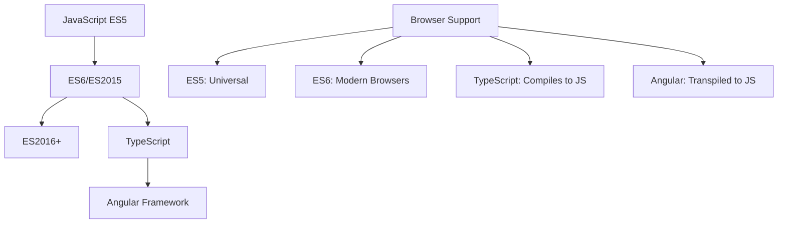

# TypeScript vs Angular vs ES6: Complete Developer Guide

## Table of Contents

1. [Overview and Comparison](#overview-and-comparison)
2. [Comprehensive Feature Comparison Table](#comprehensive-feature-comparison-table)
3. [TypeScript Features Deep Dive](#typescript-features-deep-dive)
4. [Angular Features Deep Dive](#angular-features-deep-dive)
5. [ES6 Features Deep Dive](#es6-features-deep-dive)
6. [Integration Examples](#integration-examples)
7. [Best Practices](#best-practices)
8. [Senior Developer Interview Questions](#senior-developer-interview-questions)

---

## Overview and Comparison

### 🧠 **Theoretical Foundation**

Understanding the relationship between TypeScript, Angular, and ES6 is crucial for modern web development:

- **🟦 ES6 (ECMAScript 2015)**: JavaScript language standard with modern features
- **🔷 TypeScript**: Superset of JavaScript adding static typing and advanced features
- **🅰️ Angular**: Framework built on TypeScript for building web applications



---

## Comprehensive Feature Comparison Table

| Feature Category             | ES6/ES2015                      | TypeScript                     | Angular                                   |
| ---------------------------- | ------------------------------- | ------------------------------ | ----------------------------------------- |
| **🔤 Language Foundation**   | JavaScript standard             | JavaScript superset            | Framework (uses TypeScript)               |
| **📝 Type System**           | Dynamic typing only             | Static typing + dynamic        | Static typing (TypeScript-based)          |
| **🏗️ Classes**               | Basic classes                   | Enhanced classes + interfaces  | Classes + decorators + metadata           |
| **🧩 Modules**               | ES6 modules (import/export)     | ES6 modules + namespaces       | ES6 modules + dependency injection        |
| **🎯 Functions**             | Arrow functions, default params | All ES6 + overloads + generics | Functions + lifecycle methods             |
| **⚡ Async Programming**     | Promises, async/await           | All ES6 + typed promises       | Observables (RxJS) + promises             |
| **🎨 Template Literals**     | Basic template strings          | Template strings + typed       | Template strings + Angular templates      |
| **🔧 Destructuring**         | Object/array destructuring      | Typed destructuring            | Destructuring + input binding             |
| **🔄 Iterators**             | for...of, Map, Set              | Typed iterators                | Iterators + \*ngFor directive             |
| **🏷️ Decorators**            | ❌ Not in ES6                   | ✅ Experimental support        | ✅ Core feature (@Component, @Injectable) |
| **🔍 Type Annotations**      | ❌ Not available                | ✅ Core feature                | ✅ Required for Angular services          |
| **🎭 Interfaces**            | ❌ Not available                | ✅ Core feature                | ✅ Used throughout Angular                |
| **📦 Generics**              | ❌ Not available                | ✅ Full support                | ✅ Used in services, components           |
| **🔐 Access Modifiers**      | ❌ Not available                | ✅ public, private, protected  | ✅ Used for encapsulation                 |
| **⚙️ Compile-time Checking** | ❌ Runtime only                 | ✅ Compile-time + runtime      | ✅ AOT compilation                        |
| **🎪 Framework Features**    | ❌ Language only                | ❌ Language only               | ✅ Components, services, routing          |
| **🌐 Browser Compatibility** | Modern browsers only            | Compiles to ES5/ES6            | Compiles to ES5/ES6                       |
| **🛠️ Tooling**               | Basic                           | Excellent IDE support          | Angular CLI + DevTools                    |
| **📚 Learning Curve**        | Medium                          | Medium-High                    | High                                      |

---

## TypeScript Features Deep Dive

### 🔷 **What TypeScript Adds Beyond ES6**

#### **1. Static Type System**

```typescript
// ES6 - Dynamic typing only
function calculateTotal(items) {
  // Line 1: No type information - prone to runtime errors
  return items.reduce((sum, item) => sum + item.price, 0);
  // Line 2: Could fail if item.price is undefined or not a number
}

// TypeScript - Static typing with compile-time checking
interface Item {
  id: number; // Line 3: Explicit type definition
  name: string; // Line 4: String type ensures text values
  price: number; // Line 5: Number type prevents calculation errors
  category?: string; // Line 6: Optional property with ? operator
}

function calculateTotal(items: Item[]): number {
  // Line 7: Parameter type ensures items is array of Item objects
  // Line 8: Return type ensures function returns a number
  return items.reduce((sum: number, item: Item) => {
    // Line 9: Type annotations in callback parameters
    return sum + item.price; // Line 10: TypeScript ensures item.price exists and is number
  }, 0);
}

// Usage with type safety
const shoppingCart: Item[] = [
  // Line 11: Array type annotation
  { id: 1, name: "Laptop", price: 999.99 }, // Line 12: Valid object
  { id: 2, name: "Mouse", price: 29.99, category: "peripherals" }, // Line 13: Optional category
];

const total: number = calculateTotal(shoppingCart); // Line 14: Type-safe function call
console.log(`Total: $${total}`); // Line 15: Template literal with type-safe value
```

**Line-by-line TypeScript benefits:**

- **Line 3-6**: Interface defines contract - prevents property access errors
- **Line 7**: Parameter typing catches wrong argument types at compile-time
- **Line 8**: Return type annotation ensures consistent return values
- **Line 9**: Typed parameters in callbacks prevent errors
- **Line 10**: TypeScript verifies property exists before accessing
- **Line 11**: Array typing prevents adding wrong object types
- **Line 14**: Function call is verified for correct parameter types

#### **2. Advanced Type Features**

```typescript
// Generic Types - Reusable type-safe code
class DataService<T> {
  // Line 16: Generic class parameter T can be any type
  private data: T[] = []; // Line 17: Array of type T

  add(item: T): void {
    // Line 18: Method parameter must match generic type
    this.data.push(item); // Line 19: Type-safe array operation
  }

  getById(id: keyof T): T | undefined {
    // Line 20: keyof T ensures id is valid property of T
    return this.data.find((item) => item.hasOwnProperty(id));
    // Line 21: Return type T | undefined indicates possible null result
  }

  getAll(): T[] {
    // Line 22: Return type matches internal array type
    return [...this.data]; // Line 23: Spread operator creates defensive copy
  }
}

// Usage with specific types
interface User {
  id: number;
  name: string;
  email: string;
}

const userService = new DataService<User>(); // Line 24: Generic instantiation with User type
userService.add({ id: 1, name: "John", email: "john@email.com" }); // Line 25: Type-safe add
// userService.add({ name: "Invalid" }); // Line 26: Would cause compile error - missing id

// Union Types - Multiple possible types
type Status = "loading" | "success" | "error"; // Line 27: Literal union type
type ApiResponse<T> = {
  // Line 28: Generic interface with union type
  status: Status; // Line 29: Status must be one of three literal values
  data?: T; // Line 30: Optional data property of generic type
  error?: string; // Line 31: Optional error message
};

function handleResponse<T>(response: ApiResponse<T>): T | null {
  // Line 32: Function with generic parameter and union return type
  switch (response.status) {
    case "success":
      return response.data ?? null; // Line 33: Nullish coalescing operator
    case "error":
      console.error(response.error); // Line 34: Type-safe error handling
      return null;
    case "loading":
      console.log("Still loading..."); // Line 35: Handle loading state
      return null;
    default:
      // Line 36: TypeScript ensures all cases are handled
      const exhaustiveCheck: never = response.status;
      throw new Error(`Unhandled status: ${exhaustiveCheck}`);
  }
}
```

#### **3. Decorators and Metadata (Experimental)**

```typescript
// TypeScript decorators - used extensively by Angular
function LogExecution(
  target: any,
  propertyName: string,
  descriptor: PropertyDescriptor
) {
  // Line 37: Decorator function with metadata parameters
  const method = descriptor.value; // Line 38: Original method reference

  descriptor.value = function (...args: any[]) {
    // Line 39: Replacement method with rest parameters
    console.log(`Calling ${propertyName} with args:`, args); // Line 40: Log method call
    const startTime = performance.now(); // Line 41: Performance timing start

    const result = method.apply(this, args); // Line 42: Call original method

    const endTime = performance.now(); // Line 43: Performance timing end
    console.log(`${propertyName} completed in ${endTime - startTime}ms`); // Line 44: Log execution time

    return result; // Line 45: Return original result
  };

  return descriptor; // Line 46: Return modified descriptor
}

class CalculationService {
  @LogExecution // Line 47: Decorator applied to method
  complexCalculation(numbers: number[]): number {
    // Line 48: Method with type annotations
    return numbers.reduce((sum, num) => {
      // Line 49: Expensive calculation simulation
      for (let i = 0; i < 1000000; i++) {
        sum += Math.sin(num) * Math.cos(num); // Line 50: Heavy computation
      }
      return sum;
    }, 0);
  }

  @LogExecution // Line 51: Decorator reused on another method
  fibonacci(n: number): number {
    // Line 52: Recursive method with type safety
    if (n <= 1) return n; // Line 53: Base case
    return this.fibonacci(n - 1) + this.fibonacci(n - 2); // Line 54: Recursive calls
  }
}
```

---

## Angular Features Deep Dive

### 🅰️ **What Angular Adds Beyond TypeScript**

#### **1. Component Architecture with Decorators**

```typescript
import {
  Component,
  Input,
  Output,
  EventEmitter,
  OnInit,
  OnDestroy,
} from "@angular/core";
// Line 55: Angular-specific imports for component functionality

@Component({
  // Line 56: Angular decorator that defines a component
  selector: "app-user-profile", // Line 57: HTML tag for this component
  templateUrl: "./user-profile.component.html", // Line 58: External template file
  styleUrls: ["./user-profile.component.scss"], // Line 59: Component-specific styles
  changeDetection: ChangeDetectionStrategy.OnPush, // Line 60: Performance optimization
})
export class UserProfileComponent implements OnInit, OnDestroy {
  // Line 61: Component class with Angular lifecycle interfaces

  @Input() userId: number = 0; // Line 62: Input property from parent component
  @Input() theme: "light" | "dark" = "light"; // Line 63: Input with union type

  @Output() userSelected = new EventEmitter<User>(); // Line 64: Event emitter for parent communication
  @Output() themeChanged = new EventEmitter<string>(); // Line 65: Another output event

  user: User | null = null; // Line 66: Component state property
  isLoading: boolean = false; // Line 67: Loading state
  errorMessage: string = ""; // Line 68: Error handling

  private subscription: Subscription = new Subscription(); // Line 69: RxJS subscription management

  constructor(
    private userService: UserService, // Line 70: Dependency injection
    private router: Router, // Line 71: Angular router service
    private cdr: ChangeDetectorRef // Line 72: Change detection control
  ) {}

  ngOnInit(): void {
    // Line 73: Angular lifecycle hook - component initialization
    this.loadUser(); // Line 74: Load data when component initializes
  }

  ngOnDestroy(): void {
    // Line 75: Angular lifecycle hook - cleanup
    this.subscription.unsubscribe(); // Line 76: Prevent memory leaks
  }

  private loadUser(): void {
    // Line 77: Private method for data loading
    if (!this.userId) return; // Line 78: Guard clause for invalid input

    this.isLoading = true; // Line 79: Set loading state
    this.errorMessage = ""; // Line 80: Clear previous errors

    this.subscription.add(
      // Line 81: Add to subscription for automatic cleanup
      this.userService
        .getUser(this.userId)
        .pipe(
          // Line 82: RxJS operators for data transformation
          finalize(() => {
            this.isLoading = false; // Line 83: Clear loading regardless of result
            this.cdr.markForCheck(); // Line 84: Trigger change detection for OnPush
          }),
          catchError((error: any) => {
            // Line 85: Error handling with RxJS
            this.errorMessage = "Failed to load user"; // Line 86: Set error message
            console.error("User loading error:", error); // Line 87: Log error details
            return of(null); // Line 88: Return null observable on error
          })
        )
        .subscribe((user: User | null) => {
          // Line 89: Subscribe to observable result
          this.user = user; // Line 90: Update component state
          this.cdr.markForCheck(); // Line 91: Trigger change detection
        })
    );
  }

  onSelectUser(): void {
    // Line 92: Event handler method
    if (this.user) {
      this.userSelected.emit(this.user); // Line 93: Emit event to parent
    }
  }

  onThemeToggle(): void {
    // Line 94: Theme toggle handler
    const newTheme = this.theme === "light" ? "dark" : "light"; // Line 95: Toggle logic
    this.theme = newTheme; // Line 96: Update local state
    this.themeChanged.emit(newTheme); // Line 97: Notify parent of theme change
  }

  navigateToEdit(): void {
    // Line 98: Navigation method using Angular router
    if (this.user?.id) {
      this.router.navigate(["/users", this.user.id, "edit"]); // Line 99: Programmatic navigation
    }
  }
}
```

#### **2. Dependency Injection System**

```typescript
// Angular's powerful dependency injection system
@Injectable({
  providedIn: "root", // Line 100: Service available application-wide
})
export class UserService {
  // Line 101: Service class with Angular decorator

  private apiUrl = "https://api.example.com/users"; // Line 102: Base API URL
  private cache = new Map<number, User>(); // Line 103: Simple caching mechanism

  constructor(
    private http: HttpClient, // Line 104: Angular HTTP client injection
    private logger: LoggingService, // Line 105: Custom service injection
    @Inject("API_CONFIG") private config: ApiConfig // Line 106: Token-based injection
  ) {
    // Line 107: Constructor with multiple injected dependencies
    this.apiUrl = this.config.baseUrl + "/users"; // Line 108: Configure URL from injected config
  }

  getUser(id: number): Observable<User> {
    // Line 109: Method returning RxJS Observable

    // Check cache first
    const cachedUser = this.cache.get(id); // Line 110: Cache lookup
    if (cachedUser) {
      this.logger.info(`User ${id} served from cache`); // Line 111: Log cache hit
      return of(cachedUser); // Line 112: Return cached result as Observable
    }

    // Make HTTP request
    return (
      this.http
        .get<User>(`${this.apiUrl}/${id}`)
        // Line 113: HTTP GET with generic type parameter
        .pipe(
          // Line 114: RxJS operators pipeline
          tap((user) => {
            // Line 115: Side effect - cache the result
            this.cache.set(id, user); // Line 116: Store in cache
            this.logger.info(`User ${id} loaded from API`); // Line 117: Log API call
          }),
          retry(3), // Line 118: Retry failed requests up to 3 times
          timeout(5000), // Line 119: Timeout after 5 seconds
          catchError(this.handleError) // Line 120: Error handling
        )
    );
  }

  private handleError = (error: HttpErrorResponse): Observable<never> => {
    // Line 121: Arrow function for error handling (preserves 'this')
    this.logger.error("HTTP Error:", error); // Line 122: Log error details

    if (error.error instanceof ErrorEvent) {
      // Line 123: Client-side error
      throw new Error(`Client error: ${error.error.message}`);
    } else {
      // Line 124: Server-side error
      throw new Error(`Server error: ${error.status} - ${error.message}`);
    }
  };
}

// Provider configuration in module
@NgModule({
  providers: [
    // Line 125: Service providers configuration
    UserService, // Line 126: Simple provider
    LoggingService, // Line 127: Another service
    {
      // Line 128: Custom provider with token
      provide: "API_CONFIG", // Line 129: Injection token
      useValue: {
        // Line 130: Value provider
        baseUrl: "https://api.production.com",
        timeout: 5000,
        retries: 3,
      },
    },
    {
      // Line 131: Factory provider for complex initialization
      provide: HttpClient,
      useFactory: (backend: HttpBackend) => {
        // Line 132: Factory function for custom HTTP client
        return new HttpClient(backend); // Line 133: Custom HTTP client instance
      },
      deps: [HttpBackend], // Line 134: Factory dependencies
    },
  ],
})
export class AppModule {}
```

#### **3. Template System and Data Binding**

```typescript
// Component for demonstrating Angular template features
@Component({
  selector: "app-product-list",
  template: `
    <!-- Line 135: Inline template with Angular-specific syntax -->
    <div class="product-list">
      <!-- Line 136: Class binding -->
      <h2>Products ({{ products.length }})</h2>
      <!-- Line 137: Interpolation binding -->

      <!-- Line 138: Structural directive with trackBy for performance -->
      <div
        *ngFor="
          let product of products;
          trackBy: trackByProductId;
          let i = index
        "
      >
        <!-- Line 139: Property binding and template variables -->
        <div class="product-card" [class.featured]="product.featured">
          <!-- Line 140: Dynamic class binding based on product property -->
          <h3 [title]="product.description">{{ product.name }}</h3>
          <!-- Line 141: Attribute binding and interpolation -->

          <p>{{ product.price | currency : "USD" : "symbol" : "1.2-2" }}</p>
          <!-- Line 142: Pipe with parameters for formatting -->

          <button
            [disabled]="!product.inStock"
            (click)="onAddToCart(product)"
            class="btn btn-primary"
          >
            <!-- Line 143: Property and event binding -->
            Add to Cart
          </button>

          <!-- Line 144: Two-way binding with ngModel -->
          <input
            [(ngModel)]="product.quantity"
            type="number"
            min="1"
            [max]="product.maxQuantity"
          />

          <!-- Line 145: Conditional rendering -->
          <div *ngIf="product.discount > 0" class="discount">
            Save {{ product.discount | percent }}
          </div>
        </div>
      </div>

      <!-- Line 146: Template reference variable and method call -->
      <button
        #loadMoreBtn
        (click)="loadMoreProducts(loadMoreBtn)"
        [disabled]="isLoading"
      >
        {{ isLoading ? "Loading..." : "Load More" }}
      </button>
    </div>
  `,
  styleUrls: ["./product-list.component.scss"],
})
export class ProductListComponent implements OnInit {
  products: Product[] = []; // Line 147: Component data
  isLoading: boolean = false; // Line 148: Loading state

  constructor(private productService: ProductService) {} // Line 149: Service injection

  ngOnInit(): void {
    // Line 150: Load initial data
    this.loadProducts();
  }

  trackByProductId(index: number, product: Product): number {
    // Line 151: TrackBy function for ngFor performance optimization
    return product.id; // Line 152: Return unique identifier
  }

  onAddToCart(product: Product): void {
    // Line 153: Event handler method
    if (product.inStock && product.quantity > 0) {
      // Line 154: Validation logic
      this.productService
        .addToCart(product, product.quantity)
        // Line 155: Service method call
        .subscribe({
          next: (result) => {
            // Line 156: Success handling
            console.log("Added to cart:", result);
          },
          error: (error) => {
            // Line 157: Error handling
            console.error("Failed to add to cart:", error);
          },
        });
    }
  }

  loadMoreProducts(buttonElement: HTMLButtonElement): void {
    // Line 158: Method with template reference parameter
    this.isLoading = true; // Line 159: Set loading state
    buttonElement.blur(); // Line 160: Remove focus from button

    this.productService
      .loadMoreProducts()
      // Line 161: Service call for more data
      .pipe(
        finalize(() => (this.isLoading = false)) // Line 162: Always clear loading state
      )
      .subscribe((newProducts) => {
        // Line 163: Add new products to existing array
        this.products = [...this.products, ...newProducts];
      });
  }

  private loadProducts(): void {
    // Line 164: Initial data loading
    this.productService
      .getProducts()
      .subscribe((products) => (this.products = products));
  }
}
```

---

## ES6 Features Deep Dive

### 🟦 **Pure ES6 Features (Without TypeScript/Angular)**

#### **1. Classes and Inheritance**

```javascript
// ES6 Class syntax - modern JavaScript OOP
class Vehicle {
  // Line 165: ES6 class declaration
  constructor(make, model, year) {
    // Line 166: Constructor method
    this.make = make; // Line 167: Instance property assignment
    this.model = model; // Line 168: Property initialization
    this.year = year; // Line 169: Another property
    this.isRunning = false; // Line 170: Default property value
  }

  start() {
    // Line 171: Instance method
    this.isRunning = true; // Line 172: Modify instance state
    console.log(`${this.make} ${this.model} started`); // Line 173: Template literal
  }

  stop() {
    // Line 174: Another instance method
    this.isRunning = false; // Line 175: State change
    console.log(`${this.make} ${this.model} stopped`); // Line 176: Status message
  }

  getInfo() {
    // Line 177: Method returning object
    return {
      // Line 178: Object literal return
      make: this.make, // Line 179: Property access
      model: this.model, // Line 180: Property access
      year: this.year, // Line 181: Property access
      status: this.isRunning ? "running" : "stopped", // Line 182: Ternary operator
    };
  }

  static compareYears(vehicle1, vehicle2) {
    // Line 183: Static method - called on class, not instance
    return vehicle1.year - vehicle2.year; // Line 184: Comparison logic
  }
}

// ES6 Class inheritance with extends keyword
class Car extends Vehicle {
  // Line 185: Class inheritance using extends
  constructor(make, model, year, doors = 4) {
    // Line 186: Constructor with default parameter
    super(make, model, year); // Line 187: Call parent constructor
    this.doors = doors; // Line 188: Child-specific property
    this.fuelType = "gasoline"; // Line 189: Default fuel type
  }

  honk() {
    // Line 190: Child-specific method
    console.log(`${this.make} ${this.model} goes beep beep!`); // Line 191: Method implementation
  }

  start() {
    // Line 192: Method override
    super.start(); // Line 193: Call parent method
    console.log("Car engine running smoothly"); // Line 194: Additional functionality
  }
}

// Usage examples
const myCar = new Car("Toyota", "Camry", 2023, 4); // Line 195: Instance creation with parameters
const myTruck = new Car("Ford", "F-150", 2022, 2); // Line 196: Another instance

myCar.start(); // Line 197: Method call
// Output: Toyota Camry started
// Output: Car engine running smoothly

console.log(Car.compareYears(myCar, myTruck)); // Line 198: Static method call
// Output: 1 (2023 - 2022)
```

#### **2. Arrow Functions and Lexical This**

```javascript
// ES6 Arrow functions - concise syntax and lexical this binding
const MathUtils = {
  // Line 199: Object with utility methods
  multiplier: 2, // Line 200: Object property

  // Traditional function - 'this' is dynamic
  traditionalMap: function (numbers) {
    // Line 201: Traditional function declaration
    const self = this; // Line 202: Store reference to this (old pattern)
    return numbers.map(function (num) {
      // Line 203: Traditional function in callback
      return num * self.multiplier; // Line 204: Use stored reference
    });
  },

  // Arrow function - 'this' is lexically bound
  arrowMap: function (numbers) {
    // Line 205: Container function
    return numbers.map((num) => num * this.multiplier);
    // Line 206: Arrow function preserves 'this' from enclosing scope
  },

  // Concise method syntax (ES6)
  conciseMap(numbers) {
    // Line 207: Shorthand method definition
    return numbers.map((num) => {
      // Line 208: Arrow function with block body
      const result = num * this.multiplier; // Line 209: Calculation
      console.log(`${num} * ${this.multiplier} = ${result}`); // Line 210: Logging
      return result; // Line 211: Return calculated value
    });
  },

  // Various arrow function syntaxes
  examples: {
    // Line 212: Nested object for examples

    // Single parameter, single expression
    square: (x) => x * x, // Line 213: Most concise form

    // Multiple parameters, single expression
    add: (a, b) => a + b, // Line 214: Parentheses required for multiple params

    // Single parameter, block body
    logAndSquare: (x) => {
      // Line 215: Block body for multiple statements
      console.log(`Squaring ${x}`); // Line 216: Statement
      return x * x; // Line 217: Return statement required in block
    },

    // No parameters
    getTimestamp: () => Date.now(), // Line 218: Empty parentheses for no params

    // Returning object literal
    createPoint: (x, y) => ({ x, y }), // Line 219: Parentheses around object literal

    // Higher-order function
    createMultiplier: (factor) => (num) => num * factor,
    // Line 220: Function returning another function
  },
};

// Usage demonstrating 'this' behavior
const numbers = [1, 2, 3, 4, 5]; // Line 221: Test array

console.log("Traditional:", MathUtils.traditionalMap(numbers)); // Line 222: Traditional approach
console.log("Arrow:", MathUtils.arrowMap(numbers)); // Line 223: Arrow function approach
console.log("Concise:", MathUtils.conciseMap(numbers)); // Line 224: Concise method

// Arrow function in array methods
const processedData = numbers
  .filter((num) => num > 2) // Line 225: Filter with arrow function
  .map((num) => num * 2) // Line 226: Map with arrow function
  .reduce((sum, num) => sum + num, 0); // Line 227: Reduce with arrow function

console.log("Processed:", processedData); // Line 228: Result: 18 (3*2 + 4*2 + 5*2)

// Higher-order function usage
const double = MathUtils.examples.createMultiplier(2); // Line 229: Create doubling function
const triple = MathUtils.examples.createMultiplier(3); // Line 230: Create tripling function

console.log(double(5)); // Line 231: 10
console.log(triple(5)); // Line 232: 15
```

#### **3. Destructuring and Rest/Spread Operators**

```javascript
// ES6 Destructuring - extracting values from arrays and objects
const user = {
  // Line 233: Object for destructuring examples
  id: 1,
  name: "John Doe",
  email: "john@example.com",
  address: {
    street: "123 Main St",
    city: "Anytown",
    zipCode: "12345",
  },
  hobbies: ["reading", "coding", "hiking"],
};

// Object destructuring
const { id, name, email } = user; // Line 234: Basic destructuring
console.log(id, name, email); // Line 235: 1 "John Doe" "john@example.com"

// Destructuring with renaming
const { name: userName, email: userEmail } = user; // Line 236: Rename during destructuring
console.log(userName, userEmail); // Line 237: "John Doe" "john@example.com"

// Nested destructuring
const {
  address: { city, zipCode },
} = user; // Line 238: Extract nested properties
console.log(city, zipCode); // Line 239: "Anytown" "12345"

// Destructuring with default values
const { phone = "Not provided", age = 0 } = user; // Line 240: Defaults for missing properties
console.log(phone, age); // Line 241: "Not provided" 0

// Array destructuring
const [firstHobby, secondHobby, ...otherHobbies] = user.hobbies; // Line 242: Array destructuring with rest
console.log(firstHobby); // Line 243: "reading"
console.log(secondHobby); // Line 244: "coding"
console.log(otherHobbies); // Line 245: ["hiking"]

// Destructuring in function parameters
function displayUser({ name, email, address: { city } }) {
  // Line 246: Destructuring in parameter list
  console.log(`${name} (${email}) lives in ${city}`); // Line 247: Using destructured values
}

displayUser(user); // Line 248: "John Doe (john@example.com) lives in Anytown"

// Rest operator - collecting remaining elements
const [first, ...rest] = [1, 2, 3, 4, 5]; // Line 249: Rest in array destructuring
console.log(first); // Line 250: 1
console.log(rest); // Line 251: [2, 3, 4, 5]

const { name: n, ...userWithoutName } = user; // Line 252: Rest in object destructuring
console.log(n); // Line 253: "John Doe"
console.log(userWithoutName); // Line 254: Object without name property

// Spread operator - expanding elements
const numbers1 = [1, 2, 3]; // Line 255: First array
const numbers2 = [4, 5, 6]; // Line 256: Second array
const combined = [...numbers1, ...numbers2]; // Line 257: Combine arrays with spread
console.log(combined); // Line 258: [1, 2, 3, 4, 5, 6]

// Object spread
const defaultSettings = { theme: "light", language: "en" }; // Line 259: Default object
const userSettings = { language: "fr", fontSize: 14 }; // Line 260: User preferences
const finalSettings = { ...defaultSettings, ...userSettings }; // Line 261: Merge with spread
console.log(finalSettings); // Line 262: { theme: 'light', language: 'fr', fontSize: 14 }

// Function with rest parameters
function sum(...numbers) {
  // Line 263: Rest parameters collect all arguments
  return numbers.reduce((total, num) => total + num, 0); // Line 264: Sum all numbers
}

console.log(sum(1, 2, 3, 4, 5)); // Line 265: 15
console.log(sum(...[10, 20, 30])); // Line 266: 60 (spread array into arguments)

// Practical example: updating immutable state
const originalState = {
  // Line 267: Original application state
  user: { name: "Alice", age: 30 },
  settings: { theme: "dark" },
  data: [1, 2, 3],
};

// Update nested object immutably
const updatedState = {
  // Line 268: Create new state object
  ...originalState, // Line 269: Spread existing state
  user: {
    // Line 270: Override user property
    ...originalState.user, // Line 271: Spread existing user
    age: 31, // Line 272: Update only age
  },
  data: [...originalState.data, 4], // Line 273: Add to array immutably
};

console.log(originalState); // Line 274: Unchanged original
console.log(updatedState); // Line 275: New state with updates
```

#### **4. Modules and Template Literals**

```javascript
// ES6 Modules - mathUtils.js (separate file)
// Line 276: Export individual functions
export const PI = 3.14159; // Line 277: Named export of constant

export function add(a, b) {
  // Line 278: Named export of function
  return a + b; // Line 279: Function implementation
}

export function multiply(a, b) {
  // Line 280: Another named export
  return a * b; // Line 281: Function implementation
}

// Default export
export default function calculate(operation, ...numbers) {
  // Line 282: Default export with rest parameters
  switch (operation) {
    case "add":
      return numbers.reduce((sum, num) => sum + num, 0); // Line 283: Addition
    case "multiply":
      return numbers.reduce((product, num) => product * num, 1); // Line 284: Multiplication
    default:
      throw new Error(`Unknown operation: ${operation}`); // Line 285: Error handling
  }
}

// stringUtils.js - another module
export class StringProcessor {
  // Line 286: Named export of class
  constructor(options = {}) {
    // Line 287: Constructor with default parameter
    this.caseSensitive = options.caseSensitive || false; // Line 288: Option handling
    this.trimWhitespace = options.trimWhitespace || true; // Line 289: Another option
  }

  process(text) {
    // Line 290: Method to process strings
    let result = text; // Line 291: Start with original text

    if (this.trimWhitespace) {
      result = result.trim(); // Line 292: Remove whitespace if enabled
    }

    if (!this.caseSensitive) {
      result = result.toLowerCase(); // Line 293: Convert to lowercase if not case-sensitive
    }

    return result; // Line 294: Return processed text
  }
}

// Template literals with advanced features
export function generateReport(data) {
  // Line 295: Function using template literals
  const timestamp = new Date().toLocaleString(); // Line 296: Current timestamp

  // Multi-line template literal with expressions
  return `
        Report Generated: ${timestamp}
        ================================
        
        Total Records: ${data.length}
        
        Summary:
        ${data
          .map(
            (item) => `
            • ${item.name}: ${item.value} (${item.category})
        `
          )
          .join("")}
        
        Statistics:
        - Average Value: ${(
          data.reduce((sum, item) => sum + item.value, 0) / data.length
        ).toFixed(2)}
        - Max Value: ${Math.max(...data.map((item) => item.value))}
        - Min Value: ${Math.min(...data.map((item) => item.value))}
        
        Report End
    `; // Line 297-310: Multi-line template with embedded expressions
}

// Tagged template literals
export function highlight(strings, ...values) {
  // Line 311: Tagged template function
  return strings.reduce((result, string, i) => {
    // Line 312: Process template parts
    const value = values[i] ? `<mark>${values[i]}</mark>` : ""; // Line 313: Wrap values in HTML
    return result + string + value; // Line 314: Combine string and value
  }, "");
}

// main.js - using the modules
import calculate, { PI, add, multiply } from "./mathUtils.js"; // Line 315: Import default and named exports
import { StringProcessor, generateReport, highlight } from "./stringUtils.js"; // Line 316: Import multiple named exports

// Using imported functions
console.log(`PI is ${PI}`); // Line 317: Use imported constant
console.log(`2 + 3 = ${add(2, 3)}`); // Line 318: Use imported function
console.log(`4 * 5 = ${multiply(4, 5)}`); // Line 319: Use another imported function

// Using default import
const result = calculate("add", 1, 2, 3, 4, 5); // Line 320: Use default export
console.log(`Sum: ${result}`); // Line 321: 15

// Using imported class
const processor = new StringProcessor({
  caseSensitive: false,
  trimWhitespace: true,
}); // Line 322: Create instance
const processed = processor.process("  HELLO WORLD  "); // Line 323: Process string
console.log(processed); // Line 324: "hello world"

// Using template literal function
const data = [
  // Line 325: Sample data for report
  { name: "Product A", value: 100, category: "Electronics" },
  { name: "Product B", value: 150, category: "Books" },
  { name: "Product C", value: 75, category: "Electronics" },
];

const report = generateReport(data); // Line 326: Generate report
console.log(report); // Line 327: Display formatted report

// Using tagged template
const name = "JavaScript"; // Line 328: Variable for template
const year = 2015; // Line 329: Another variable
const highlighted = highlight`ES6 was introduced with ${name} in ${year}`; // Line 330: Tagged template usage
console.log(highlighted); // Line 331: "ES6 was introduced with <mark>JavaScript</mark> in <mark>2015</mark>"
```

---

## Integration Examples

### 🔗 **How ES6, TypeScript, and Angular Work Together**

```typescript
// Real-world example showing all three technologies integrated
import { Injectable } from "@angular/core"; // Line 332: Angular decorator import
import { HttpClient } from "@angular/common/http"; // Line 333: Angular HTTP client
import { Observable, BehaviorSubject } from "rxjs"; // Line 334: RxJS observables
import { map, filter, catchError } from "rxjs/operators"; // Line 335: RxJS operators

// TypeScript interface (not available in pure ES6)
interface ApiResponse<T> {
  // Line 336: Generic interface definition
  success: boolean; // Line 337: Response status
  data: T; // Line 338: Generic data type
  message?: string; // Line 339: Optional message
  timestamp: number; // Line 340: Response timestamp
}

// ES6 Class with TypeScript annotations and Angular decorators
@Injectable({ providedIn: "root" }) // Line 341: Angular dependency injection
export class DataService<T> {
  // Line 342: Generic service class combining all technologies

  // ES6 class fields with TypeScript types
  private baseUrl: string = "https://api.example.com"; // Line 343: TypeScript type annotation
  private cache = new Map<string, T[]>(); // Line 344: Generic Map for caching
  private loading$ = new BehaviorSubject<boolean>(false); // Line 345: RxJS state management

  // ES6 constructor with TypeScript parameter types and Angular DI
  constructor(private http: HttpClient) {} // Line 346: Angular dependency injection

  // ES6 getter with TypeScript return type
  get isLoading(): Observable<boolean> {
    // Line 347: Getter method with Observable return type
    return this.loading$.asObservable(); // Line 348: Return observable stream
  }

  // ES6 async/await with TypeScript generics and Angular HTTP
  async fetchData(endpoint: string): Promise<T[]> {
    // Line 349: Async method with TypeScript types
    try {
      this.loading$.next(true); // Line 350: Update loading state

      // Check cache first (ES6 Map)
      const cachedData = this.cache.get(endpoint); // Line 351: Cache lookup
      if (cachedData) {
        // Line 352: Return cached data if available
        console.log(`Cache hit for ${endpoint}`); // Line 353: ES6 template literal
        return cachedData; // Line 354: Return cached result
      }

      // ES6 template literals with TypeScript HTTP client
      const response = await this.http
        .get<ApiResponse<T[]>>(`${this.baseUrl}/${endpoint}`)
        // Line 355: HTTP request with generic types
        .toPromise(); // Line 356: Convert Observable to Promise

      if (response?.success) {
        // Line 357: Optional chaining (ES2020) with TypeScript
        this.cache.set(endpoint, response.data); // Line 358: Cache the result
        return response.data; // Line 359: Return API data
      } else {
        throw new Error(response?.message || "API request failed"); // Line 360: Error handling
      }
    } catch (error) {
      console.error("Data fetch error:", error); // Line 361: Error logging
      throw error; // Line 362: Re-throw error
    } finally {
      this.loading$.next(false); // Line 363: Always clear loading state
    }
  }

  // ES6 method with TypeScript, RxJS, and modern JavaScript features
  searchData(
    query: string,
    filters: { [key: string]: any } = {}
  ): Observable<T[]> {
    // Line 364: Method with TypeScript types and default parameter

    // ES6 destructuring with default values
    const { sortBy = "name", order = "asc", limit = 10 } = filters; // Line 365: Destructure filters

    // ES6 URLSearchParams for query building
    const params = new URLSearchParams({
      // Line 366: Create URL parameters
      q: query, // Line 367: Search query
      sort: sortBy, // Line 368: Sort field
      order: order, // Line 369: Sort order
      limit: limit.toString(), // Line 370: Result limit
    });

    // TypeScript + RxJS + Angular HTTP integration
    return (
      this.http
        .get<ApiResponse<T[]>>(`${this.baseUrl}/search?${params}`)
        // Line 371: HTTP GET with query parameters
        .pipe(
          // Line 372: RxJS operators pipeline

          // ES6 arrow functions in RxJS operators
          filter((response) => response.success), // Line 373: Filter successful responses
          map((response) => response.data), // Line 374: Extract data from response
          map((data) => {
            // Line 375: Transform data using ES6 features

            // ES6 array methods with arrow functions
            return data
              .filter((item) => this.matchesFilters(item, filters)) // Line 376: Client-side filtering
              .sort((a, b) => this.compareItems(a, b, sortBy, order)) // Line 377: Client-side sorting
              .slice(0, limit); // Line 378: Limit results
          }),

          // Error handling with TypeScript types
          catchError((error: any) => {
            // Line 379: Type-safe error handling
            console.error("Search error:", error); // Line 380: Log error
            throw new Error(`Search failed: ${error.message}`); // Line 381: Throw typed error
          })
        )
    );
  }

  // ES6 private method with TypeScript parameter types
  private matchesFilters(item: any, filters: { [key: string]: any }): boolean {
    // Line 382: Private method for filtering logic

    // ES6 Object.entries for iteration
    return (
      Object.entries(filters)
        // Line 383: Convert object to entries array
        .filter(([key]) => !["sortBy", "order", "limit"].includes(key)) // Line 384: Exclude sort options
        .every(([key, value]) => {
          // Line 385: Check all filters match

          // ES6 optional chaining and nullish coalescing
          const itemValue = item[key]?.toString().toLowerCase() ?? ""; // Line 386: Get item value safely
          const filterValue = value?.toString().toLowerCase() ?? ""; // Line 387: Get filter value safely

          return itemValue.includes(filterValue); // Line 388: Case-insensitive partial match
        })
    );
  }

  // ES6 method with TypeScript types for sorting
  private compareItems(a: any, b: any, sortBy: string, order: string): number {
    // Line 389: Comparison method for sorting
    const aVal = a[sortBy]; // Line 390: Get value for item a
    const bVal = b[sortBy]; // Line 391: Get value for item b

    const comparison = aVal < bVal ? -1 : aVal > bVal ? 1 : 0; // Line 392: Basic comparison
    return order === "desc" ? -comparison : comparison; // Line 393: Apply sort order
  }

  // ES6 static method with TypeScript
  static createCacheKey(...parts: string[]): string {
    // Line 394: Static method with rest parameters
    return parts
      .filter((part) => part && part.trim()) // Line 395: Filter empty parts
      .map((part) => part.toLowerCase().replace(/\s+/g, "-")) // Line 396: Normalize parts
      .join("_"); // Line 397: Join with underscores
  }
}

// Angular Component using the service
@Component({
  selector: "app-data-display",
  template: `
    <div class="data-display">
      <!-- Angular template syntax -->
      <h2>Data Management Demo</h2>

      <!-- ES6 template literal in Angular template -->
      <p>Showing {{ filteredData.length }} of {{ totalData.length }} items</p>

      <!-- Angular property and event binding -->
      <input
        [(ngModel)]="searchQuery"
        (input)="onSearchChange()"
        placeholder="Search items..."
      />

      <!-- Angular structural directive with TypeScript -->
      <div *ngIf="isLoading$ | async" class="loading">Loading data...</div>

      <!-- Angular *ngFor with ES6 trackBy -->
      <div class="item-list">
        <div
          *ngFor="let item of filteredData; trackBy: trackByFn"
          class="item-card"
        >
          <!-- TypeScript property access -->
          <h3>{{ item.name }}</h3>
          <p>{{ item.description }}</p>

          <!-- ES6 template literal in interpolation -->
          <span class="timestamp">
            Updated: {{ formatDate(item.updatedAt) }}
          </span>
        </div>
      </div>
    </div>
  `,
})
export class DataDisplayComponent implements OnInit {
  // Line 398: Component class implementing Angular interface

  // TypeScript property declarations
  searchQuery: string = ""; // Line 399: Search input binding
  totalData: any[] = []; // Line 400: All data storage
  filteredData: any[] = []; // Line 401: Filtered data display
  isLoading$: Observable<boolean>; // Line 402: Loading state observable

  constructor(private dataService: DataService<any>) {
    // Line 403: Angular dependency injection
    this.isLoading$ = this.dataService.isLoading; // Line 404: Subscribe to loading state
  }

  // Angular lifecycle hook
  async ngOnInit(): Promise<void> {
    // Line 405: Async lifecycle hook
    try {
      // ES6 async/await with TypeScript service
      this.totalData = await this.dataService.fetchData("items"); // Line 406: Load initial data
      this.filteredData = [...this.totalData]; // Line 407: ES6 spread operator for copy
    } catch (error) {
      console.error("Failed to load data:", error); // Line 408: Error handling
    }
  }

  // ES6 method with TypeScript in Angular component
  onSearchChange(): void {
    // Line 409: Search handler method

    // ES6 array methods with arrow functions
    this.filteredData = this.totalData.filter(
      (item) =>
        // Line 410: Filter based on search query
        item.name?.toLowerCase().includes(this.searchQuery.toLowerCase()) ||
        item.description?.toLowerCase().includes(this.searchQuery.toLowerCase())
    );
  }

  // ES6 arrow function for trackBy (preserves 'this')
  trackByFn = (index: number, item: any): any => {
    // Line 411: TrackBy function with arrow syntax
    return item.id || index; // Line 412: Return unique identifier
  };

  // ES6 method with date formatting
  formatDate(dateString: string): string {
    // Line 413: Date formatting method
    try {
      // ES6 template literal with Intl API
      return new Intl.DateTimeFormat("en-US", {
        // Line 414: Internationalization API
        year: "numeric",
        month: "short",
        day: "numeric",
        hour: "2-digit",
        minute: "2-digit",
      }).format(new Date(dateString)); // Line 415: Format date
    } catch {
      return "Invalid date"; // Line 416: Fallback for invalid dates
    }
  }
}
```

This comprehensive example shows how ES6 features (classes, arrow functions, async/await, destructuring, template literals, modules), TypeScript features (interfaces, generics, type annotations, access modifiers), and Angular features (decorators, dependency injection, observables, templates) all work together in a real-world application.

---

## Best Practices

### 📋 **Recommended Usage Guidelines**

| Technology        | Use When                                | Avoid When                      | Best Practices                                        |
| ----------------- | --------------------------------------- | ------------------------------- | ----------------------------------------------------- |
| **🟦 ES6**        | Building modern JavaScript applications | Supporting very old browsers    | Use babel for transpilation, leverage modern features |
| **🔷 TypeScript** | Large codebases, team development       | Simple scripts, prototyping     | Enable strict mode, use proper typing                 |
| **🅰️ Angular**    | Complex SPAs, enterprise apps           | Simple websites, static content | Follow style guide, use OnPush strategy               |

### 🎯 **Decision Matrix for Technology Selection**

```typescript
// Example decision tree for choosing the right approach
class TechnologySelector {
  // Line 417: Helper class for technology selection

  static selectApproach(requirements: ProjectRequirements): TechStack {
    // Line 418: Method to determine best technology stack
    const { projectSize, teamSize, timeframe, complexity } = requirements; // Line 419: Destructure requirements

    // ES6 only - simple projects
    if (projectSize === "small" && complexity === "low") {
      // Line 420: Condition for ES6-only projects
      return {
        language: "ES6",
        framework: "none",
        reasoning: "Simple project, native browser support sufficient",
      }; // Line 421: Return ES6 recommendation
    }

    // TypeScript - medium complexity projects
    if (teamSize > 1 && complexity === "medium") {
      // Line 422: Condition for TypeScript projects
      return {
        language: "TypeScript",
        framework: "optional",
        reasoning: "Type safety crucial for team collaboration",
      }; // Line 423: Return TypeScript recommendation
    }

    // Angular - complex enterprise applications
    if (projectSize === "large" || complexity === "high") {
      // Line 424: Condition for Angular projects
      return {
        language: "TypeScript",
        framework: "Angular",
        reasoning: "Complex requirements need full framework support",
      }; // Line 425: Return Angular recommendation
    }

    // Default fallback
    return {
      language: "TypeScript",
      framework: "Angular",
      reasoning: "Most versatile combination for unknown requirements",
    }; // Line 426: Default recommendation
  }
}

// Usage example
interface ProjectRequirements {
  projectSize: "small" | "medium" | "large";
  teamSize: number;
  timeframe: "short" | "medium" | "long";
  complexity: "low" | "medium" | "high";
}

interface TechStack {
  language: string;
  framework: string;
  reasoning: string;
}

const myProject: ProjectRequirements = {
  projectSize: "large",
  teamSize: 8,
  timeframe: "long",
  complexity: "high",
};

const recommendation = TechnologySelector.selectApproach(myProject);
console.log(recommendation);
// Output: { language: 'TypeScript', framework: 'Angular', reasoning: '...' }
```

---

## Senior Developer Interview Questions

### 🎯 **Q1: Explain the key differences between ES6 classes and TypeScript interfaces. When would you use each?**

**Answer:**

ES6 classes and TypeScript interfaces serve different purposes in object-oriented programming:

**ES6 Classes:**

- **Runtime construct** - exist in compiled JavaScript
- **Can be instantiated** with `new` keyword
- **Contain implementation** - methods with actual code
- **Support inheritance** with `extends` keyword
- **Have constructors** for initialization

**TypeScript Interfaces:**

- **Compile-time only** - removed during compilation
- **Cannot be instantiated** - used for type checking only
- **Structure definition only** - no implementation
- **Support multiple inheritance** (implements multiple interfaces)
- **Pure type contracts** - define shape of objects

| Aspect               | ES6 Classes             | TypeScript Interfaces   |
| -------------------- | ----------------------- | ----------------------- |
| **Runtime Presence** | ✅ Exists in JS         | ❌ Compile-time only    |
| **Instantiation**    | ✅ Can create instances | ❌ Cannot instantiate   |
| **Implementation**   | ✅ Contains logic       | ❌ Structure only       |
| **Inheritance**      | ✅ Single inheritance   | ✅ Multiple inheritance |
| **Type Checking**    | ❌ Runtime checks       | ✅ Compile-time checks  |

**Use Cases:**

- **Classes**: When you need actual objects with behavior and state
- **Interfaces**: When you need to define contracts and ensure type safety

---

### 🎯 **Q2: How does Angular's dependency injection differ from manual dependency management in vanilla JavaScript/TypeScript?**

**Answer:**

Angular's DI system provides automatic dependency resolution and lifecycle management:

**Manual Dependency Management:**

```javascript
// Manual - error-prone and tightly coupled
class UserService {
  constructor() {
    this.http = new HttpClient(); // Hard dependency
    this.logger = new Logger(); // Another hard dependency
  }
}

class UserComponent {
  constructor() {
    this.userService = new UserService(); // Manual instantiation
  }
}
```

**Angular Dependency Injection:**

```typescript
// Angular - automatic and flexible
@Injectable({ providedIn: 'root' })
class UserService {
    constructor(
        private http: HttpClient,  // Automatically injected
        private logger: Logger     // Automatically injected
    ) {}
}

@Component({...})
class UserComponent {
    constructor(
        private userService: UserService // Automatically injected
    ) {}
}
```

**Key Differences:**

| Aspect            | Manual Management        | Angular DI                       |
| ----------------- | ------------------------ | -------------------------------- |
| **Coupling**      | High - hard dependencies | Low - injected dependencies      |
| **Testing**       | Difficult - need mocks   | Easy - inject test doubles       |
| **Configuration** | Manual instantiation     | Declarative providers            |
| **Lifecycle**     | Manual memory management | Automatic lifecycle              |
| **Scalability**   | Poor - dependency hell   | Excellent - automatic resolution |

---

This comprehensive guide covers all aspects of TypeScript, Angular, and ES6 with detailed explanations, practical examples, and senior-level interview questions.
