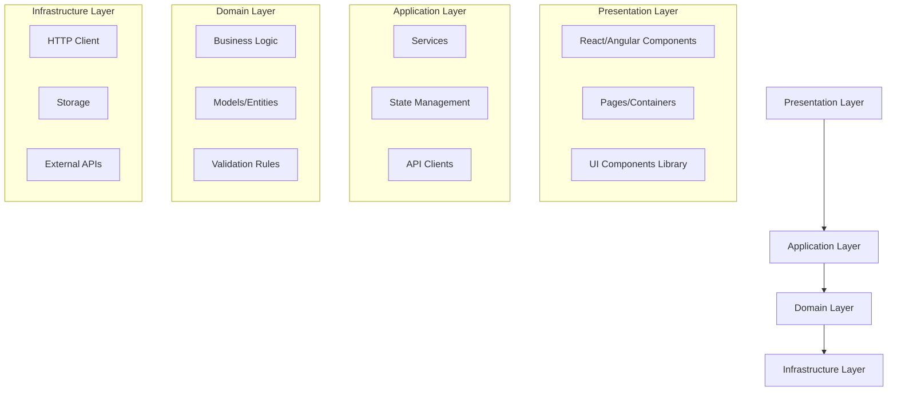
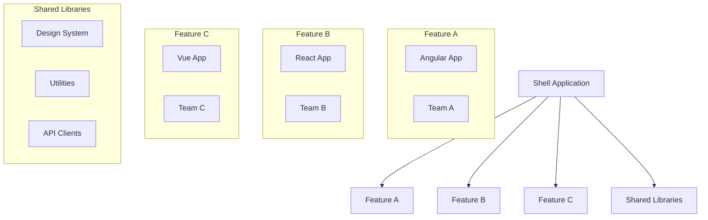
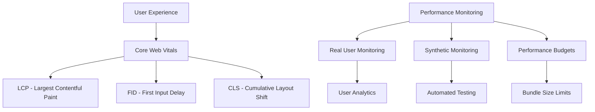
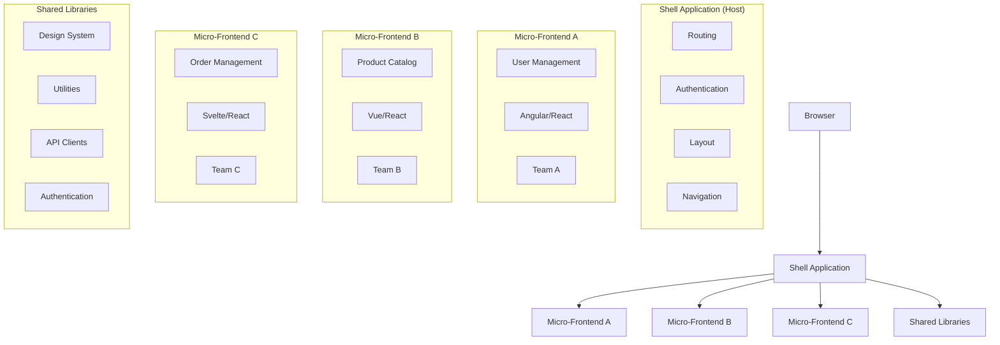
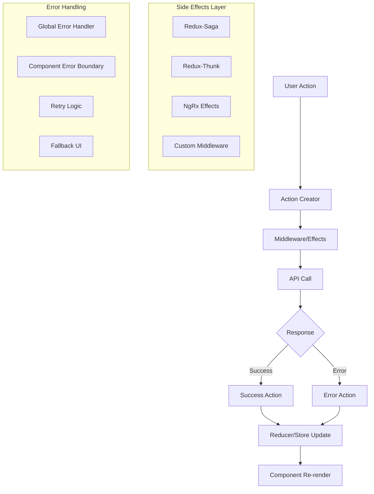
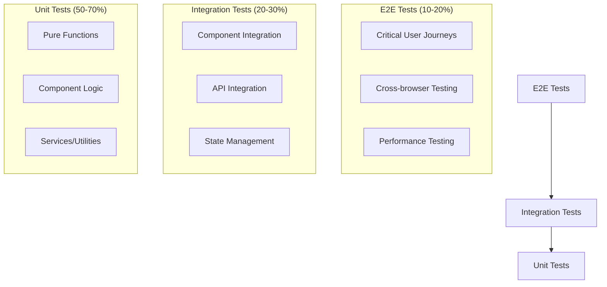

# UI Architect Interview Questions & Detailed Answers

## Table of Contents

1. [System Design](#system-design)
2. [State Management](#state-management)
3. [Testing](#testing)
4. [Accessibility & Internationalization](#accessibility--internationalization)

---

## System Design

### 1. How would you design the architecture for a large-scale enterprise UI application?

#### Key Terminology and Concepts

**Enterprise UI Application**: A complex, multi-feature web application designed for business use, typically serving hundreds to thousands of users with multiple roles, complex workflows, and integration requirements.

**Architecture**: The high-level structure and organization of software components, their relationships, and principles governing their design and evolution.

**Scalability**: The application's ability to handle increased load (users, data, features) without performance degradation.

**Maintainability**: How easily the codebase can be understood, modified, and extended by developers over time.

#### Architectural Approach

**Why Layered Architecture?**

- **Separation of Concerns**: Each layer has a specific responsibility, making code more organized and maintainable
- **Testability**: Layers can be tested independently with proper mocking
- **Flexibility**: Changes in one layer don't necessarily affect others
- **Team Organization**: Different teams can work on different layers simultaneously

**Layered Architecture Pattern:**



#### Layer Explanations

**1. Presentation Layer**

- **Purpose**: Handles user interface and user interactions
- **Components**: React/Angular components, pages, layouts, UI component libraries
- **Responsibilities**: Rendering UI, handling user input, displaying data
- **Implementation Logic**: Uses component-based architecture where each component has a single responsibility

**2. Application Layer**

- **Purpose**: Orchestrates business operations and manages application flow
- **Components**: Services, state management, API clients, middleware
- **Responsibilities**: Coordinating between UI and business logic, handling application state
- **Implementation Logic**: Acts as a mediator between presentation and domain layers

**3. Domain Layer**

- **Purpose**: Contains core business logic and rules
- **Components**: Business models, entities, validation rules, domain services
- **Responsibilities**: Enforcing business rules, data validation, core application logic
- **Implementation Logic**: Framework-independent, contains the "heart" of the application

**4. Infrastructure Layer**

- **Purpose**: Handles external dependencies and technical concerns
- **Components**: HTTP clients, databases, external APIs, caching, logging
- **Responsibilities**: Data persistence, external communication, technical utilities
- **Implementation Logic**: Provides concrete implementations for abstract interfaces defined in domain layer

#### Core Architecture Principles

**1. Modular Architecture**

**What is Modular Architecture?**

- **Definition**: Organizing code into discrete, self-contained modules with specific responsibilities
- **Benefits**: Better code organization, easier testing, improved maintainability, team scalability
- **Implementation Strategy**: Group related functionality together, minimize dependencies between modules

**Module Structure Explanation:**

```typescript
// Feature-based module structure
src/
├── core/                    // Core functionality - shared across entire app
│   ├── services/           // Global services (auth, http, logging)
│   ├── guards/            // Route guards and access control
│   ├── interceptors/      // HTTP interceptors for requests/responses
│   └── models/            // Shared data models and interfaces
├── shared/                 // Shared components - reusable across features
│   ├── components/        // Generic UI components (buttons, modals, forms)
│   ├── directives/        // Custom directives/hooks
│   ├── pipes/            // Data transformation utilities
│   └── utils/            // Helper functions and utilities
├── features/              // Feature modules - specific business functionality
│   ├── user-management/   // Self-contained feature with its own components, services
│   ├── dashboard/         // Independent feature module
│   ├── reports/          // Another independent feature module
│   └── settings/         // Settings feature module
└── assets/               // Static assets (images, fonts, etc.)
```

**Why This Structure Works:**

- **Core Module**: Contains application-wide functionality that every feature might need
- **Shared Module**: Prevents code duplication by providing reusable components
- **Feature Modules**: Encapsulate specific business functionality, can be developed independently
- **Lazy Loading**: Feature modules can be loaded on-demand for better performance

**2. Component-Based Architecture**

**What is Component-Based Architecture?**

- **Definition**: Building applications using self-contained, reusable components that encapsulate both UI and logic
- **Key Principles**: Single Responsibility, Reusability, Composability, Encapsulation
- **Benefits**: Code reuse, easier testing, better maintainability, parallel development

**Component Design Patterns Explained:**

**Props/Input Pattern:**

- **Purpose**: Pass data from parent to child components
- **Implementation Logic**: Parent components own and manage data, children receive it as props
- **Why It Works**: Creates a clear data flow, makes components predictable and testable

**Event/Output Pattern:**

- **Purpose**: Child components communicate back to parents
- **Implementation Logic**: Children emit events, parents handle them
- **Why It Works**: Maintains loose coupling, allows parent to control application flow

```typescript
// Angular Example with detailed explanations
@Component({
  selector: "app-data-table",
  template: `
    <div class="data-table">
      <!-- Header component handles column definitions and sorting -->
      <app-table-header [columns]="columns" (sort)="onSort($event)"> </app-table-header>

      <!-- Body component renders data rows -->
      <app-table-body [data]="data" [columns]="columns"> </app-table-body>

      <!-- Pagination component handles page navigation -->
      <app-pagination [totalItems]="totalItems" (pageChange)="onPageChange($event)"> </app-pagination>
    </div>
  `,
})
export class DataTableComponent implements OnInit {
  // Input properties - data flows down from parent
  @Input() data: any[]; // Raw data to display
  @Input() columns: TableColumn[]; // Column configuration
  @Input() totalItems: number; // Total count for pagination

  // Output events - events bubble up to parent
  @Output() sort = new EventEmitter<SortEvent>(); // When user clicks sort
  @Output() pageChange = new EventEmitter<number>(); // When user changes page

  /**
   * Implementation Logic:
   * 1. Component receives data and configuration via @Input
   * 2. Renders child components with specific responsibilities
   * 3. Child components emit events that parent handles
   * 4. Parent can update data/configuration, triggering re-render
   */
}

// React Example with detailed explanations
interface DataTableProps {
  data: any[]; // Data to display
  columns: TableColumn[]; // Column configuration
  totalItems: number; // Total items for pagination
  onSort: (sortEvent: SortEvent) => void; // Sort handler
  onPageChange: (page: number) => void; // Page change handler
}

const DataTable: React.FC<DataTableProps> = ({ data, columns, totalItems, onSort, onPageChange }) => {
  /**
   * Implementation Logic:
   * 1. Component receives props from parent
   * 2. Passes specific props to child components
   * 3. Child components call callback functions to communicate changes
   * 4. Parent component handles state changes and re-renders with new props
   */

  return (
    <div className="data-table">
      <TableHeader columns={columns} onSort={onSort} />
      <TableBody data={data} columns={columns} />
      <Pagination totalItems={totalItems} onPageChange={onPageChange} />
    </div>
  );
};
```

**Component Composition Strategy:**

- **Atomic Design**: Build components from small, reusable atoms to larger organisms
- **Single Responsibility**: Each component should have one clear purpose
- **Prop Interface**: Well-defined interfaces make components predictable and testable

**3. Service Layer Architecture**

**What is Service Layer?**

- **Definition**: An abstraction layer that provides business operations and handles data access
- **Purpose**: Encapsulate business logic, manage data operations, provide reusable functionality
- **Benefits**: Separation of concerns, testability, reusability across components

**Service Layer Patterns Explained:**

**Dependency Injection Pattern:**

- **How It Works**: Framework provides dependencies to classes rather than classes creating them
- **Benefits**: Easier testing (can inject mocks), loose coupling, configuration flexibility
- **Implementation**: Services are registered in a container and injected where needed

**Caching Strategy:**

- **Purpose**: Store frequently accessed data to improve performance
- **Implementation Logic**: Check cache first, fetch from API if not found, store result in cache
- **Cache Invalidation**: Remove or update cached data when underlying data changes

**Error Handling Strategy:**

- **Centralized Approach**: Handle errors in one place rather than scattered throughout components
- **User-Friendly Messages**: Transform technical errors into user-understandable messages
- **Retry Logic**: Automatically retry failed operations with exponential backoff

```typescript
// Angular Service Example with detailed explanations
@Injectable({
  providedIn: "root", // Singleton service available throughout the app
})
export class UserService {
  private baseUrl = environment.apiUrl;

  constructor(
    private http: HttpClient, // HTTP client for API calls
    private cacheService: CacheService, // Custom caching service
    private errorHandler: ErrorHandlerService // Centralized error handling
  ) {}

  /**
   * Implementation Logic for getUsers:
   * 1. Generate unique cache key based on parameters
   * 2. Check if data exists in cache and is still valid
   * 3. If cached data exists, return it immediately
   * 4. If not cached, make HTTP request
   * 5. Store successful response in cache with timestamp
   * 6. Handle errors through centralized error handler
   * 7. Return observable that components can subscribe to
   */
  getUsers(params: UserSearchParams): Observable<PaginatedResponse<User>> {
    // Create unique cache key based on search parameters
    const cacheKey = `users_${JSON.stringify(params)}`;

    // Check cache first - improves performance for repeated requests
    return (
      this.cacheService.get(cacheKey) ||
      this.http.get<PaginatedResponse<User>>(`${this.baseUrl}/users`, { params }).pipe(
        // Store successful response in cache for 5 minutes
        tap((response) => this.cacheService.set(cacheKey, response, 300)),
        // Handle errors in a centralized way
        catchError(this.errorHandler.handleError)
      )
    );
  }
}

// React Hook Example with detailed explanations
export const useUserService = () => {
  // Local state for caching responses
  const [cache, setCache] = useState<Map<string, any>>(new Map());

  /**
   * Implementation Logic for getUsers:
   * 1. Create cache key from parameters
   * 2. Check if data exists in local cache
   * 3. Return cached data if available
   * 4. Make API call if not cached
   * 5. Update cache with new data
   * 6. Handle errors appropriately
   * 7. Return data to calling component
   */
  const getUsers = useCallback(
    async (params: UserSearchParams) => {
      const cacheKey = `users_${JSON.stringify(params)}`;

      // Return cached data immediately if available
      if (cache.has(cacheKey)) {
        return cache.get(cacheKey);
      }

      try {
        const response = await apiClient.get("/users", { params });

        // Update cache with new data
        setCache((prev) => new Map(prev).set(cacheKey, response.data));
        return response.data;
      } catch (error) {
        // Centralized error handling
        errorHandler.handleError(error);
        throw error; // Re-throw so component can handle if needed
      }
    },
    [cache]
  );

  return { getUsers };
};
```

**Service Design Principles:**

- **Single Responsibility**: Each service should have one clear purpose
- **Stateless Operations**: Services shouldn't maintain internal state (except for caching)
- **Observable Pattern**: Use observables/promises for asynchronous operations
- **Error Boundaries**: Handle errors gracefully and provide meaningful feedback

#### Enterprise-Specific Considerations

**1. Multi-Tenant Architecture**

```typescript
// Tenant-aware service
@Injectable()
export class TenantAwareService {
  constructor(private tenantService: TenantService, private http: HttpClient) {}

  private getApiUrl(endpoint: string): string {
    const tenant = this.tenantService.getCurrentTenant();
    return `${environment.apiUrl}/${tenant.id}/${endpoint}`;
  }

  getData(endpoint: string): Observable<any> {
    return this.http.get(this.getApiUrl(endpoint));
  }
}
```

**2. Security Architecture**

```typescript
// JWT Interceptor
@Injectable()
export class AuthInterceptor implements HttpInterceptor {
  constructor(private authService: AuthService) {}

  intercept(req: HttpRequest<any>, next: HttpHandler): Observable<HttpEvent<any>> {
    const token = this.authService.getToken();

    if (token) {
      const authReq = req.clone({
        setHeaders: {
          Authorization: `Bearer ${token}`,
          "X-Tenant-ID": this.authService.getTenantId(),
        },
      });
      return next.handle(authReq);
    }

    return next.handle(req);
  }
}
```

---

### 2. Discuss strategies for achieving scalability, maintainability, and reusability in UI components.

#### Scalability Strategies

**1. Micro-Frontend Architecture**



**2. Module Federation Implementation**

```typescript
// webpack.config.js for Shell Application
const ModuleFederationPlugin = require("@module-federation/webpack");

module.exports = {
  plugins: [
    new ModuleFederationPlugin({
      name: "shell",
      remotes: {
        userManagement: "userManagement@http://localhost:4201/remoteEntry.js",
        dashboard: "dashboard@http://localhost:4202/remoteEntry.js",
        reports: "reports@http://localhost:4203/remoteEntry.js",
      },
      shared: {
        "@angular/core": { singleton: true, strictVersion: true },
        "@angular/common": { singleton: true, strictVersion: true },
        rxjs: { singleton: true, strictVersion: true },
      },
    }),
  ],
};

// Dynamic module loading
const loadRemoteModule = (remoteUrl: string, moduleName: string) => {
  return import(/* webpackIgnore: true */ `${remoteUrl}/${moduleName}`).then((module) => module.default || module);
};
```

**3. Lazy Loading Strategy**

```typescript
// Angular Route-based Lazy Loading
const routes: Routes = [
  {
    path: "users",
    loadChildren: () => import("./features/user-management/user-management.module").then((m) => m.UserManagementModule),
  },
  {
    path: "dashboard",
    loadChildren: () => import("./features/dashboard/dashboard.module").then((m) => m.DashboardModule),
  },
];

// React Route-based Lazy Loading with Suspense
const UserManagement = lazy(() => import("./features/UserManagement"));
const Dashboard = lazy(() => import("./features/Dashboard"));

function App() {
  return (
    <Router>
      <Suspense fallback={<LoadingSpinner />}>
        <Routes>
          <Route path="/users/*" element={<UserManagement />} />
          <Route path="/dashboard/*" element={<Dashboard />} />
        </Routes>
      </Suspense>
    </Router>
  );
}
```

#### Maintainability Strategies

**What is Maintainability?**

- **Definition**: The ease with which software can be modified, updated, extended, and debugged over time
- **Key Principles**: Code clarity, consistent patterns, comprehensive documentation, modular architecture
- **Impact**: Reduces development time, minimizes bugs, enables team scalability, lowers long-term costs

**Maintainability Core Concepts:**

- **Readability**: Code should be self-documenting and easily understood by other developers
- **Modularity**: Components should be loosely coupled and highly cohesive
- **Consistency**: Following established patterns and conventions throughout the codebase
- **Documentation**: Comprehensive guides, API documentation, and inline comments

**1. Design System Implementation**

**What is a Design System?**

- **Definition**: A comprehensive collection of reusable components, guided by clear standards and principles
- **Purpose**: Ensures visual consistency, accelerates development, improves user experience
- **Components**: Design tokens, UI components, patterns, guidelines, and documentation

**Design Token Strategy Explained:**

- **Color Tokens**: Centralized color palette with semantic naming (primary, success, warning)
- **Spacing Tokens**: Consistent spacing scale for margins, padding, and layout
- **Typography Tokens**: Font sizes, weights, and line heights for text hierarchy
- **Benefits**: Easy theme switching, consistent spacing, maintainable styles

```typescript
// Design tokens
export const designTokens = {
  colors: {
    primary: {
      50: "#f0f9ff",
      100: "#e0f2fe",
      500: "#0ea5e9",
      900: "#0c4a6e",
    },
    semantic: {
      success: "#10b981",
      warning: "#f59e0b",
      error: "#ef4444",
      info: "#3b82f6",
    },
  },
  spacing: {
    xs: "0.25rem",
    sm: "0.5rem",
    md: "1rem",
    lg: "1.5rem",
    xl: "2rem",
  },
  typography: {
    fontSizes: {
      xs: "0.75rem",
      sm: "0.875rem",
      base: "1rem",
      lg: "1.125rem",
      xl: "1.25rem",
    },
  },
};

// Button component using design tokens
@Component({
  selector: "app-button",
  template: `
    <button [class]="buttonClasses" [disabled]="disabled" (click)="onClick.emit($event)">
      <ng-content></ng-content>
    </button>
  `,
  styles: [
    `
      .btn {
        padding: var(--spacing-sm) var(--spacing-md);
        border-radius: var(--border-radius);
        font-size: var(--font-size-base);
        font-weight: 500;
        transition: all 0.2s ease;
      }

      .btn-primary {
        background-color: var(--color-primary-500);
        color: white;
      }

      .btn-primary:hover {
        background-color: var(--color-primary-600);
      }
    `,
  ],
})
export class ButtonComponent {
  @Input() variant: "primary" | "secondary" | "outline" = "primary";
  @Input() size: "sm" | "md" | "lg" = "md";
  @Input() disabled = false;
  @Output() onClick = new EventEmitter<Event>();

  get buttonClasses(): string {
    return `btn btn-${this.variant} btn-${this.size}`;
  }
}
```

**Design System Implementation Logic:**

**Why Design Tokens Work:**

1. **Single Source of Truth**: All design decisions centralized in one location
2. **Platform Agnostic**: Tokens can be exported to CSS, SCSS, JavaScript, or mobile platforms
3. **Scalable Theming**: Easy to create dark mode, high contrast, or brand variations
4. **Design-Development Bridge**: Designers and developers use the same vocabulary

**Component Architecture Strategy:**

- **Atomic Design**: Build from atoms (buttons) to molecules (forms) to organisms (navigation)
- **Prop Interface**: Well-defined props make components predictable and testable
- **Style Encapsulation**: CSS-in-JS or scoped styles prevent style leakage
- **Accessibility Built-in**: ARIA attributes and keyboard navigation included by default

**2. Component Documentation with Storybook**

**What is Storybook?**

- **Definition**: A development environment for UI components that enables isolated component development
- **Purpose**: Document components, test different states, share design system across teams
- **Benefits**: Visual regression testing, accessibility testing, design token validation

**Storybook Implementation Strategy:**

- **Story-Driven Development**: Write stories first, then implement components
- **Interactive Documentation**: Live examples with controllable props
- **Visual Testing**: Automated screenshot comparison for UI consistency
- **Accessibility Testing**: Built-in a11y addon for WCAG compliance checking

```typescript
// Button.stories.ts
export default {
  title: "Components/Button",
  component: ButtonComponent,
  argTypes: {
    variant: {
      control: { type: "select" },
      options: ["primary", "secondary", "outline"],
    },
    size: {
      control: { type: "select" },
      options: ["sm", "md", "lg"],
    },
  },
};

export const Primary = {
  args: {
    variant: "primary",
    children: "Primary Button",
  },
};

export const AllVariants = () => ({
  template: `
    <div style="display: flex; gap: 1rem;">
      <app-button variant="primary">Primary</app-button>
      <app-button variant="secondary">Secondary</app-button>
      <app-button variant="outline">Outline</app-button>
    </div>
  `,
});
```

**3. Code Organization and Architecture Patterns**

**What is Code Organization?**

- **Definition**: Structuring codebase in a logical, scalable, and maintainable way
- **Key Principles**: Feature-based organization, clear separation of concerns, consistent naming conventions
- **Benefits**: Easier navigation, faster onboarding, reduced cognitive load for developers

**Feature-Based Organization Strategy:**

```typescript
// Feature-based folder structure
src/
├── core/                    // Core application functionality
│   ├── auth/               // Authentication services and guards
│   ├── http/              // HTTP interceptors and error handling
│   ├── logging/           // Logging service and configuration
│   └── utils/             // Shared utility functions
├── shared/                 // Shared components and services
│   ├── components/        // Reusable UI components
│   │   ├── button/        // Each component in its own folder
│   │   ├── modal/         // With tests, styles, and documentation
│   │   └── form-controls/ // Related components grouped together
│   ├── services/          // Shared business services
│   ├── pipes/            // Data transformation pipes/filters
│   └── validators/       // Custom form validators
├── features/              // Business feature modules
│   ├── user-management/   // Complete feature with all dependencies
│   │   ├── components/    // Feature-specific components
│   │   ├── services/      // Feature-specific services
│   │   ├── models/        // Feature-specific interfaces/types
│   │   ├── guards/        // Feature-specific route guards
│   │   └── pages/         // Feature page components
│   └── product-catalog/   // Another independent feature
└── assets/               // Static resources

// Why This Structure Works:
// 1. Clear boundaries between features
// 2. Easy to locate related code
// 3. Supports team ownership of features
// 4. Enables lazy loading of feature modules
// 5. Prevents circular dependencies
```

**Naming Convention Strategy:**

```typescript
// Consistent naming patterns for maintainability

// File naming conventions
user.service.ts           // Service files
user.component.ts         // Component files
user.component.spec.ts    // Test files
user.component.scss       // Style files
user.model.ts            // Model/interface files
user.guard.ts            // Guard files

// Component naming conventions
export class UserManagementComponent { }  // PascalCase for classes
export interface UserProfile { }          // PascalCase for interfaces
export type UserRole = 'admin' | 'user';  // PascalCase for types

// Function and variable naming
const getUserById = (id: string) => { };   // camelCase for functions
const currentUser = ref<User | null>(null); // camelCase for variables
const MAX_RETRY_ATTEMPTS = 3;             // UPPER_CASE for constants

// CSS class naming (BEM methodology)
.user-card { }                    // Block
.user-card__header { }            // Element
.user-card--featured { }          // Modifier
.user-card__title--large { }      // Element with modifier
```

**4. Testing Strategy for Maintainability**

**What is Testing for Maintainability?**

- **Definition**: Writing tests that not only verify functionality but also serve as documentation and enable safe refactoring
- **Principles**: Clear test names, descriptive assertions, testing behavior over implementation
- **Benefits**: Confident refactoring, living documentation, regression prevention

**Testing Pyramid Implementation:**

```typescript
// Unit Tests - Test individual components in isolation
describe("UserService", () => {
  let service: UserService;
  let httpMock: jasmine.SpyObj<HttpClient>;

  beforeEach(() => {
    const spy = jasmine.createSpyObj("HttpClient", ["get", "post", "put", "delete"]);

    TestBed.configureTestingModule({
      providers: [UserService, { provide: HttpClient, useValue: spy }],
    });

    service = TestBed.inject(UserService);
    httpMock = TestBed.inject(HttpClient) as jasmine.SpyObj<HttpClient>;
  });

  describe("getUser", () => {
    it("should return user data when API call succeeds", () => {
      // Arrange
      const mockUser: User = { id: "1", name: "John Doe", email: "john@example.com" };
      httpMock.get.and.returnValue(of(mockUser));

      // Act
      const result$ = service.getUser("1");

      // Assert
      result$.subscribe((user) => {
        expect(user).toEqual(mockUser);
        expect(httpMock.get).toHaveBeenCalledWith("/api/users/1");
      });
    });

    it("should handle error when user not found", () => {
      // Arrange
      const errorResponse = new HttpErrorResponse({
        error: "User not found",
        status: 404,
        statusText: "Not Found",
      });
      httpMock.get.and.returnValue(throwError(errorResponse));

      // Act & Assert
      service.getUser("999").subscribe({
        next: () => fail("Expected error, but got success"),
        error: (error) => {
          expect(error.status).toBe(404);
          expect(error.error).toBe("User not found");
        },
      });
    });
  });
});

// Integration Tests - Test component interactions
describe("UserManagementComponent Integration", () => {
  let component: UserManagementComponent;
  let fixture: ComponentFixture<UserManagementComponent>;
  let userService: jasmine.SpyObj<UserService>;

  beforeEach(() => {
    const userServiceSpy = jasmine.createSpyObj("UserService", ["getUsers", "createUser", "updateUser"]);

    TestBed.configureTestingModule({
      declarations: [UserManagementComponent, UserListComponent, UserFormComponent],
      providers: [{ provide: UserService, useValue: userServiceSpy }],
      imports: [ReactiveFormsModule, MatTableModule],
    });

    fixture = TestBed.createComponent(UserManagementComponent);
    component = fixture.componentInstance;
    userService = TestBed.inject(UserService) as jasmine.SpyObj<UserService>;
  });

  it("should display users when loaded successfully", fakeAsync(() => {
    // Arrange
    const mockUsers: User[] = [
      { id: "1", name: "John Doe", email: "john@example.com" },
      { id: "2", name: "Jane Smith", email: "jane@example.com" },
    ];
    userService.getUsers.and.returnValue(of(mockUsers));

    // Act
    component.ngOnInit();
    tick();
    fixture.detectChanges();

    // Assert
    const userRows = fixture.debugElement.queryAll(By.css(".user-row"));
    expect(userRows.length).toBe(2);
    expect(userRows[0].nativeElement.textContent).toContain("John Doe");
    expect(userRows[1].nativeElement.textContent).toContain("Jane Smith");
  }));
});
```

**5. Documentation Strategy**

**What is Documentation Strategy?**

- **Definition**: Systematic approach to creating and maintaining project documentation
- **Types**: API documentation, component documentation, architectural decisions, setup guides
- **Benefits**: Faster onboarding, knowledge preservation, reduced support burden

**Comprehensive Documentation Approach:**

````typescript
// JSDoc for functions and classes
/**
 * UserService handles all user-related operations
 *
 * @example
 * ```typescript
 * const userService = new UserService(httpClient);
 * const user = await userService.getUser('123');
 * ```
 */
export class UserService {
  /**
   * Retrieves a user by their unique identifier
   *
   * @param id - The unique user identifier
   * @returns Promise that resolves to the user data
   * @throws {UserNotFoundError} When user doesn't exist
   * @throws {ValidationError} When id format is invalid
   *
   * @example
   * ```typescript
   * try {
   *   const user = await userService.getUser('user-123');
   *   console.log(user.name);
   * } catch (error) {
   *   if (error instanceof UserNotFoundError) {
   *     console.log('User not found');
   *   }
   * }
   * ```
   */
  async getUser(id: string): Promise<User> {
    if (!id || typeof id !== "string") {
      throw new ValidationError("User ID must be a non-empty string");
    }

    try {
      const response = await this.http.get<User>(`/api/users/${id}`);
      return response.data;
    } catch (error) {
      if (error.status === 404) {
        throw new UserNotFoundError(`User with ID ${id} not found`);
      }
      throw error;
    }
  }
}

// README.md structure for maintainability
/*
# Project Name

## Quick Start
- Installation instructions
- Basic setup commands
- Environment configuration

## Architecture Overview
- High-level system diagram
- Key design decisions
- Technology stack rationale

## Development Guide
- Code organization principles
- Naming conventions
- Testing strategy
- Performance guidelines

## API Documentation
- Authentication
- Endpoint descriptions
- Request/response examples
- Error handling

## Deployment
- Environment setup
- CI/CD pipeline
- Monitoring and logging

## Contributing
- Code review process
- Branch naming conventions
- Commit message format
*/
````

**6. Error Handling and Logging Strategy**

**What is Systematic Error Handling?**

- **Definition**: Consistent approach to detecting, handling, and reporting errors across the application
- **Benefits**: Better debugging, improved user experience, easier monitoring and maintenance
- **Components**: Error boundaries, global error handlers, structured logging, user-friendly error messages

```typescript
// Centralized error handling service
export enum ErrorSeverity {
  LOW = "low",
  MEDIUM = "medium",
  HIGH = "high",
  CRITICAL = "critical",
}

export interface ErrorContext {
  userId?: string;
  feature: string;
  action: string;
  timestamp: Date;
  userAgent: string;
  url: string;
}

@Injectable({
  providedIn: "root",
})
export class ErrorHandlerService {
  constructor(private logger: LoggerService, private notification: NotificationService, private analytics: AnalyticsService) {}

  /**
   * Centralized error handling with context and severity
   *
   * @param error - The error object
   * @param context - Additional context about where/when error occurred
   * @param severity - How critical this error is
   */
  handleError(error: Error, context: ErrorContext, severity: ErrorSeverity = ErrorSeverity.MEDIUM): void {
    // 1. Log the error with full context
    this.logger.error("Application Error", {
      message: error.message,
      stack: error.stack,
      context,
      severity,
      timestamp: new Date().toISOString(),
    });

    // 2. Send to analytics/monitoring service
    this.analytics.trackError({
      error: error.message,
      feature: context.feature,
      severity,
      userId: context.userId,
    });

    // 3. Show user-friendly notification
    this.showUserNotification(error, severity);

    // 4. For critical errors, additional actions
    if (severity === ErrorSeverity.CRITICAL) {
      this.handleCriticalError(error, context);
    }
  }

  private showUserNotification(error: Error, severity: ErrorSeverity): void {
    const userMessage = this.getUserFriendlyMessage(error, severity);

    switch (severity) {
      case ErrorSeverity.CRITICAL:
        this.notification.showError(userMessage, { persistent: true });
        break;
      case ErrorSeverity.HIGH:
        this.notification.showError(userMessage);
        break;
      case ErrorSeverity.MEDIUM:
        this.notification.showWarning(userMessage);
        break;
      case ErrorSeverity.LOW:
        this.notification.showInfo(userMessage);
        break;
    }
  }

  private getUserFriendlyMessage(error: Error, severity: ErrorSeverity): string {
    // Transform technical errors into user-friendly messages
    if (error.message.includes("Network Error")) {
      return "Unable to connect to our servers. Please check your internet connection.";
    }

    if (error.message.includes("Unauthorized")) {
      return "Your session has expired. Please log in again.";
    }

    if (severity === ErrorSeverity.CRITICAL) {
      return "A critical error has occurred. Our team has been notified and will investigate immediately.";
    }

    return "Something went wrong. Please try again, and contact support if the problem persists.";
  }

  private handleCriticalError(error: Error, context: ErrorContext): void {
    // For critical errors, take immediate action
    // - Send real-time alert to development team
    // - Create incident in monitoring system
    // - Potentially trigger automatic rollback

    this.logger.critical("CRITICAL ERROR DETECTED", {
      error: error.message,
      context,
      stackTrace: error.stack,
      requiresImmediateAttention: true,
    });
  }
}
```

#### Reusability Strategies

**What is Component Reusability?**

- **Definition**: The ability to use components in multiple contexts without modification
- **Key Principles**: Single responsibility, configurable behavior, minimal dependencies, clear interfaces
- **Benefits**: Faster development, consistent UI, reduced bugs, easier maintenance

**Reusability Design Principles:**

- **Composition over Inheritance**: Build complex components by combining simpler ones
- **Props/Configuration**: Make components flexible through well-designed APIs
- **Context Independence**: Components should work regardless of where they're used
- **Accessibility First**: Reusable components should be accessible by default

**1. Compound Component Pattern**

**What is Compound Component Pattern?**

- **Definition**: A design pattern where multiple components work together to form a cohesive interface
- **Benefits**: Flexible composition, clear component relationships, encapsulated logic
- **Use Cases**: Complex UI controls (modals, dropdowns, accordions), data display components

**How Compound Components Work:**

- **Parent Component**: Provides shared context and manages overall state
- **Child Components**: Handle specific parts of the UI and access shared context
- **Implicit Communication**: Children automatically receive data through context
- **Flexible Composition**: Users can arrange children in any order or combination

```typescript
// Advanced Angular Compound Component Example
@Component({
  selector: "app-accordion",
  template: `
    <div class="accordion" [attr.aria-multiselectable]="allowMultiple">
      <ng-content></ng-content>
    </div>
  `,
  providers: [AccordionService], // Provide shared service to children
})
export class AccordionComponent implements OnInit {
  @Input() allowMultiple = false;
  @Input() defaultOpenItems: string[] = [];

  constructor(private accordionService: AccordionService) {}

  ngOnInit() {
    this.accordionService.configure({
      allowMultiple: this.allowMultiple,
      defaultOpenItems: this.defaultOpenItems,
    });
  }
}

@Component({
  selector: "app-accordion-item",
  template: `
    <div class="accordion-item" [class.is-open]="isOpen">
      <ng-content></ng-content>
    </div>
  `,
})
export class AccordionItemComponent implements OnInit, OnDestroy {
  @Input() id!: string;
  @Input() disabled = false;
  isOpen = false;

  constructor(private accordionService: AccordionService) {}

  ngOnInit() {
    // Register with parent accordion
    this.accordionService.registerItem(this.id, this);
    this.isOpen = this.accordionService.isItemOpen(this.id);
  }

  ngOnDestroy() {
    this.accordionService.unregisterItem(this.id);
  }

  toggle() {
    if (!this.disabled) {
      this.accordionService.toggleItem(this.id);
    }
  }
}

@Component({
  selector: "app-accordion-header",
  template: `
    <button class="accordion-header" [attr.aria-expanded]="isOpen" [attr.aria-controls]="contentId" [attr.id]="headerId" [disabled]="disabled" (click)="toggle()">
      <ng-content></ng-content>
      <span class="accordion-icon" [class.rotated]="isOpen">▼</span>
    </button>
  `,
})
export class AccordionHeaderComponent {
  get isOpen() {
    return this.accordionItem.isOpen;
  }
  get disabled() {
    return this.accordionItem.disabled;
  }
  get contentId() {
    return `accordion-content-${this.accordionItem.id}`;
  }
  get headerId() {
    return `accordion-header-${this.accordionItem.id}`;
  }

  constructor(private accordionItem: AccordionItemComponent) {}

  toggle() {
    this.accordionItem.toggle();
  }
}

@Component({
  selector: "app-accordion-content",
  template: `
    <div class="accordion-content" [attr.id]="contentId" [attr.aria-labelledby]="headerId" [attr.hidden]="!isOpen">
      <div class="accordion-content-inner">
        <ng-content></ng-content>
      </div>
    </div>
  `,
})
export class AccordionContentComponent {
  get isOpen() {
    return this.accordionItem.isOpen;
  }
  get contentId() {
    return `accordion-content-${this.accordionItem.id}`;
  }
  get headerId() {
    return `accordion-header-${this.accordionItem.id}`;
  }

  constructor(private accordionItem: AccordionItemComponent) {}
}

// Usage - Flexible and Accessible
/*
<app-accordion [allowMultiple]="true" [defaultOpenItems]="['item1']">
  <app-accordion-item id="item1">
    <app-accordion-header>
      <h3>Section 1</h3>
    </app-accordion-header>
    <app-accordion-content>
      <p>Content for section 1</p>
    </app-accordion-content>
  </app-accordion-item>
  
  <app-accordion-item id="item2" [disabled]="true">
    <app-accordion-header>
      <h3>Section 2 (Disabled)</h3>
    </app-accordion-header>
    <app-accordion-content>
      <p>This content is not accessible</p>
    </app-accordion-content>
  </app-accordion-item>
</app-accordion>
*/

// React Compound Component with Context
interface AccordionContextType {
  openItems: Set<string>;
  toggleItem: (id: string) => void;
  allowMultiple: boolean;
}

const AccordionContext = createContext<AccordionContextType | null>(null);

// Custom hook for accessing accordion context
const useAccordion = () => {
  const context = useContext(AccordionContext);
  if (!context) {
    throw new Error("Accordion components must be used within Accordion");
  }
  return context;
};

// Main Accordion component with state management
interface AccordionProps {
  children: React.ReactNode;
  allowMultiple?: boolean;
  defaultOpenItems?: string[];
}

const Accordion: React.FC<AccordionProps> & {
  Item: React.FC<AccordionItemProps>;
  Header: React.FC<AccordionHeaderProps>;
  Content: React.FC<AccordionContentProps>;
} = ({ children, allowMultiple = false, defaultOpenItems = [] }) => {
  const [openItems, setOpenItems] = useState<Set<string>>(new Set(defaultOpenItems));

  const toggleItem = useCallback(
    (id: string) => {
      setOpenItems((prev) => {
        const newSet = new Set(prev);

        if (newSet.has(id)) {
          newSet.delete(id);
        } else {
          if (!allowMultiple) {
            newSet.clear();
          }
          newSet.add(id);
        }

        return newSet;
      });
    },
    [allowMultiple]
  );

  const contextValue = useMemo(
    () => ({
      openItems,
      toggleItem,
      allowMultiple,
    }),
    [openItems, toggleItem, allowMultiple]
  );

  return (
    <AccordionContext.Provider value={contextValue}>
      <div className="accordion" aria-multiselectable={allowMultiple}>
        {children}
      </div>
    </AccordionContext.Provider>
  );
};

// Accordion Item component
interface AccordionItemProps {
  id: string;
  children: React.ReactNode;
  disabled?: boolean;
}

const AccordionItem: React.FC<AccordionItemProps> = ({ id, children, disabled = false }) => {
  const { openItems } = useAccordion();
  const isOpen = openItems.has(id);

  return (
    <AccordionItemContext.Provider value={{ id, isOpen, disabled }}>
      <div className={`accordion-item ${isOpen ? "is-open" : ""}`}>{children}</div>
    </AccordionItemContext.Provider>
  );
};

// Accordion Header component
interface AccordionHeaderProps {
  children: React.ReactNode;
}

const AccordionHeader: React.FC<AccordionHeaderProps> = ({ children }) => {
  const { toggleItem } = useAccordion();
  const { id, isOpen, disabled } = useAccordionItem();

  const handleClick = () => {
    if (!disabled) {
      toggleItem(id);
    }
  };

  return (
    <button className="accordion-header" aria-expanded={isOpen} aria-controls={`accordion-content-${id}`} id={`accordion-header-${id}`} disabled={disabled} onClick={handleClick}>
      {children}
      <span className={`accordion-icon ${isOpen ? "rotated" : ""}`}>▼</span>
    </button>
  );
};

// Accordion Content component
interface AccordionContentProps {
  children: React.ReactNode;
}

const AccordionContent: React.FC<AccordionContentProps> = ({ children }) => {
  const { id, isOpen } = useAccordionItem();

  return (
    <div className="accordion-content" id={`accordion-content-${id}`} aria-labelledby={`accordion-header-${id}`} hidden={!isOpen}>
      <div className="accordion-content-inner">{children}</div>
    </div>
  );
};

// Attach sub-components to main component
Accordion.Item = AccordionItem;
Accordion.Header = AccordionHeader;
Accordion.Content = AccordionContent;

// Usage Example
/*
<Accordion allowMultiple={true} defaultOpenItems={['section1']}>
  <Accordion.Item id="section1">
    <Accordion.Header>
      <h3>Getting Started</h3>
    </Accordion.Header>
    <Accordion.Content>
      <p>Welcome to our documentation...</p>
    </Accordion.Content>
  </Accordion.Item>
  
  <Accordion.Item id="section2" disabled={true}>
    <Accordion.Header>
      <h3>Advanced Topics (Coming Soon)</h3>
    </Accordion.Header>
    <Accordion.Content>
      <p>This section will be available soon...</p>
    </Accordion.Content>
  </Accordion.Item>
</Accordion>
*/
```

**Why Compound Components Work:**

1. **Semantic HTML**: Natural nesting structure that mirrors HTML semantics
2. **Flexible Composition**: Users can arrange components in any order
3. **Shared State**: Automatic state sharing between related components
4. **Type Safety**: TypeScript ensures proper component relationships
5. **Accessibility**: ARIA attributes and keyboard navigation built-in

**2. Higher-Order Components / Custom Hooks**

**What are Higher-Order Components (HOCs)?**

- **Definition**: Functions that take a component and return a new component with additional functionality
- **Purpose**: Share logic between components, enhance components with common behavior
- **Benefits**: Code reuse, separation of concerns, easier testing

```typescript
// Angular Compound Component
@Component({
  selector: "app-card",
  template: "<ng-content></ng-content>",
  styleUrls: ["./card.component.scss"],
})
export class CardComponent {}

@Component({
  selector: "app-card-header",
  template: "<ng-content></ng-content>",
  styleUrls: ["./card-header.component.scss"],
})
export class CardHeaderComponent {}

@Component({
  selector: "app-card-body",
  template: "<ng-content></ng-content>",
  styleUrls: ["./card-body.component.scss"],
})
export class CardBodyComponent {}

// Usage
/*
<app-card>
  <app-card-header>
    <h3>User Profile</h3>
  </app-card-header>
  <app-card-body>
    <p>User information content</p>
  </app-card-body>
</app-card>
*/

// React Compound Component
interface CardComponents {
  Header: React.FC<{ children: React.ReactNode }>;
  Body: React.FC<{ children: React.ReactNode }>;
  Footer: React.FC<{ children: React.ReactNode }>;
}

const Card: React.FC<{ children: React.ReactNode }> & CardComponents = ({ children }) => {
  return <div className="card">{children}</div>;
};

Card.Header = ({ children }) => <div className="card-header">{children}</div>;
Card.Body = ({ children }) => <div className="card-body">{children}</div>;
Card.Footer = ({ children }) => <div className="card-footer">{children}</div>;

// Usage
/*
<Card>
  <Card.Header>
    <h3>User Profile</h3>
  </Card.Header>
  <Card.Body>
    <p>User information content</p>
  </Card.Body>
</Card>
*/
```

**2. Higher-Order Components / Custom Hooks**

**What are Higher-Order Components (HOCs)?**

- **Definition**: Functions that take a component and return a new component with additional functionality
- **Purpose**: Share logic between components, enhance components with common behavior
- **Benefits**: Code reuse, separation of concerns, easier testing

**What are Custom Hooks?**

- **Definition**: JavaScript functions that use React hooks and can be shared between components
- **Purpose**: Extract and reuse stateful logic across multiple components
- **Benefits**: Better testability, composition over inheritance, cleaner component code

**HOC vs Custom Hooks Comparison:**

- **HOCs**: Good for enhancing component props, wrapping components with providers
- **Hooks**: Better for sharing stateful logic, more composable, easier to test
- **Modern Preference**: Custom hooks are generally preferred in modern React development

```typescript
// Advanced Angular Mixin Pattern for Cross-Cutting Concerns
export interface LoadingCapable {
  loading: boolean;
  startLoading(): void;
  stopLoading(): void;
  executeWithLoading<T>(operation: () => Promise<T>): Promise<T>;
}

export interface ErrorHandlingCapable {
  error: string | null;
  clearError(): void;
  handleError(error: Error): void;
}

// Composable mixin for loading functionality
export function WithLoading<T extends Constructor>(Base: T) {
  return class extends Base implements LoadingCapable {
    loading = false;

    startLoading() {
      this.loading = true;
      // Emit loading state change for reactive forms
      if ('cdr' in this && this.cdr) {
        (this.cdr as ChangeDetectorRef).detectChanges();
      }
    }

    stopLoading() {
      this.loading = false;
      if ('cdr' in this && this.cdr) {
        (this.cdr as ChangeDetectorRef).detectChanges();
      }
    }

    async executeWithLoading<R>(operation: () => Promise<R>): Promise<R> {
      this.startLoading();
      try {
        const result = await operation();
        return result;
      } catch (error) {
        // Handle error if component has error handling capability
        if ('handleError' in this && typeof this.handleError === 'function') {
          this.handleError(error as Error);
        }
        throw error;
      } finally {
        this.stopLoading();
      }
    }
  };
}

// Composable mixin for error handling
export function WithErrorHandling<T extends Constructor>(Base: T) {
  return class extends Base implements ErrorHandlingCapable {
    error: string | null = null;

    clearError() {
      this.error = null;
    }

    handleError(error: Error) {
      this.error = error.message;
      console.error('Component error:', error);

      // Integrate with global error handling service
      if ('errorHandler' in this && this.errorHandler) {
        (this.errorHandler as any).handleError(error, {
          component: this.constructor.name,
          timestamp: new Date()
        });
      }
    }
  };
}

// Component using multiple mixins
@Component({
  selector: 'app-user-management',
  template: `
    <div class="user-management">
      <div *ngIf="loading" class="loading-spinner">Loading...</div>
      <div *ngIf="error" class="error-message">
        {{ error }}
        <button (click)="clearError()">Dismiss</button>
      </div>

      <div *ngIf="!loading && !error">
        <button (click)="loadUsers()">Refresh Users</button>
        <app-user-list [users]="users"></app-user-list>
      </div>
    </div>
  `
})
export class UserManagementComponent extends WithErrorHandling(WithLoading(class {})) implements OnInit {
  users: User[] = [];

  constructor(
    private userService: UserService,
    private cdr: ChangeDetectorRef,
    private errorHandler: ErrorHandlerService
  ) {
    super();
  }

  ngOnInit() {
    this.loadUsers();
  }

  async loadUsers() {
    await this.executeWithLoading(async () => {
      this.users = await this.userService.getUsers();
    });
  }
}

// React Custom Hooks with Advanced Patterns

// Generic async operation hook with caching and retry logic
interface UseAsyncOperationOptions<T> {
  initialData?: T;
  cacheKey?: string;
  retryAttempts?: number;
  retryDelay?: number;
  onSuccess?: (data: T) => void;
  onError?: (error: Error) => void;
}

export const useAsyncOperation = <T>(options: UseAsyncOperationOptions<T> = {}) => {
  const {
    initialData = null,
    cacheKey,
    retryAttempts = 0,
    retryDelay = 1000,
    onSuccess,
    onError
  } = options;

  const [loading, setLoading] = useState(false);
  const [error, setError] = useState<Error | null>(null);
  const [data, setData] = useState<T | null>(initialData);
  const [lastFetchTime, setLastFetchTime] = useState<Date | null>(null);

  // Simple cache implementation
  const cache = useMemo(() => new Map<string, { data: T; timestamp: Date }>(), []);

  const execute = useCallback(async (
    operation: () => Promise<T>,
    useCache = false,
    cacheMaxAge = 5 * 60 * 1000 // 5 minutes
  ) => {
    // Check cache first if enabled
    if (useCache && cacheKey) {
      const cached = cache.get(cacheKey);
      if (cached && Date.now() - cached.timestamp.getTime() < cacheMaxAge) {
        setData(cached.data);
        return cached.data;
      }
    }

    setLoading(true);
    setError(null);

    let lastError: Error;

    // Retry logic
    for (let attempt = 0; attempt <= retryAttempts; attempt++) {
      try {
        const result = await operation();

        // Cache successful result
        if (useCache && cacheKey) {
          cache.set(cacheKey, { data: result, timestamp: new Date() });
        }

        setData(result);
        setLastFetchTime(new Date());
        onSuccess?.(result);
        return result;
      } catch (err) {
        lastError = err as Error;

        // Don't retry on the last attempt
        if (attempt < retryAttempts) {
          await new Promise(resolve => setTimeout(resolve, retryDelay * Math.pow(2, attempt)));
        }
      }
    }

    // All attempts failed
    setError(lastError!);
    onError?.(lastError!);
    throw lastError!;
  }, [cache, cacheKey, retryAttempts, retryDelay, onSuccess, onError]);

  const reset = useCallback(() => {
    setLoading(false);
    setError(null);
    setData(initialData);
    setLastFetchTime(null);
  }, [initialData]);

  const invalidateCache = useCallback(() => {
    if (cacheKey) {
      cache.delete(cacheKey);
    }
  }, [cache, cacheKey]);

  return {
    loading,
    error,
    data,
    lastFetchTime,
    execute,
    reset,
    invalidateCache
  };
};

// Specialized hook for API operations
export const useApiOperation = <T>(apiCall: () => Promise<T>, dependencies: any[] = []) => {
  const { loading, error, data, execute } = useAsyncOperation<T>({
    retryAttempts: 2,
    retryDelay: 1000
  });

  useEffect(() => {
    execute(apiCall, true); // Use cache for API calls
  }, dependencies);

  return { loading, error, data, refetch: () => execute(apiCall) };
};

// Form validation hook
interface ValidationRule<T> {
  validate: (value: T) => boolean;
  message: string;
}

export const useFormValidation = <T extends Record<string, any>>(
  initialValues: T,
  validationRules: Partial<Record<keyof T, ValidationRule<any>[]>>
) => {
  const [values, setValues] = useState<T>(initialValues);
  const [errors, setErrors] = useState<Partial<Record<keyof T, string>>>({});
  const [touched, setTouched] = useState<Partial<Record<keyof T, boolean>>>({});

  const validateField = useCallback((fieldName: keyof T, value: any) => {
    const rules = validationRules[fieldName];
    if (!rules) return null;

    for (const rule of rules) {
      if (!rule.validate(value)) {
        return rule.message;
      }
    }
    return null;
  }, [validationRules]);

  const setValue = useCallback((fieldName: keyof T, value: any) => {
    setValues(prev => ({ ...prev, [fieldName]: value }));

    // Validate on change if field has been touched
    if (touched[fieldName]) {
      const error = validateField(fieldName, value);
      setErrors(prev => ({ ...prev, [fieldName]: error }));
    }
  }, [touched, validateField]);

  const setTouched = useCallback((fieldName: keyof T) => {
    setTouched(prev => ({ ...prev, [fieldName]: true }));

    // Validate when field is touched
    const error = validateField(fieldName, values[fieldName]);
    setErrors(prev => ({ ...prev, [fieldName]: error }));
  }, [validateField, values]);

  const validateAll = useCallback(() => {
    const newErrors: Partial<Record<keyof T, string>> = {};
    let isValid = true;

    for (const fieldName in validationRules) {
      const error = validateField(fieldName as keyof T, values[fieldName]);
      if (error) {
        newErrors[fieldName as keyof T] = error;
        isValid = false;
      }
    }

    setErrors(newErrors);
    return isValid;
  }, [validationRules, validateField, values]);

  const reset = useCallback(() => {
    setValues(initialValues);
    setErrors({});
    setTouched({});
  }, [initialValues]);

  return {
    values,
    errors,
    touched,
    setValue,
    setTouched,
    validateAll,
    reset,
    isValid: Object.keys(errors).length === 0
  };
};

// Usage Examples
const UserManagement: React.FC = () => {
  // Using the advanced async operation hook
  const { loading, error, data: users, execute, reset } = useAsyncOperation<User[]>({
    cacheKey: 'users',
    retryAttempts: 2,
    onSuccess: (users) => console.log(`Loaded ${users.length} users`),
    onError: (error) => console.error('Failed to load users:', error)
  });

  // Using the form validation hook
  const { values, errors, setValue, setTouched, validateAll, isValid } = useFormValidation(
    { name: '', email: '', age: 0 },
    {
      name: [
        { validate: (value) => value.length > 0, message: 'Name is required' },
        { validate: (value) => value.length >= 2, message: 'Name must be at least 2 characters' }
      ],
      email: [
        { validate: (value) => /\S+@\S+\.\S+/.test(value), message: 'Valid email is required' }
      ],
      age: [
        { validate: (value) => value >= 18, message: 'Must be 18 or older' }
      ]
    }
  );

  const handleSubmit = async () => {
    if (validateAll()) {
      await execute(() => userService.createUser(values));
    }
  };

  useEffect(() => {
    execute(() => userService.getUsers(), true); // Use cache
  }, [execute]);

  if (loading) return <LoadingSpinner />;
  if (error) return <ErrorMessage error={error} onRetry={reset} />;

  return (
    <div>
      <form onSubmit={handleSubmit}>
        <input
          value={values.name}
          onChange={(e) => setValue('name', e.target.value)}
          onBlur={() => setTouched('name')}
          placeholder="Name"
        />
        {errors.name && <span className="error">{errors.name}</span>}

        <input
          type="email"
          value={values.email}
          onChange={(e) => setValue('email', e.target.value)}
          onBlur={() => setTouched('email')}
          placeholder="Email"
        />
        {errors.email && <span className="error">{errors.email}</span>}

        <button type="submit" disabled={!isValid}>
          Create User
        </button>
      </form>

      <div>
        {users?.map(user => (
          <UserCard key={user.id} user={user} />
        ))}
      </div>
    </div>
  );
};
```

**Why HOCs and Custom Hooks Work:**

1. **Separation of Concerns**: UI logic separated from business logic
2. **Reusability**: Same logic can be used across multiple components
3. **Testability**: Hooks can be tested independently of components
4. **Composition**: Multiple hooks can be combined for complex functionality
5. **Type Safety**: TypeScript ensures type safety across shared logic

**3. Configuration-Driven Components**

**What are Configuration-Driven Components?**

- **Definition**: Components that accept configuration objects to define their behavior and appearance
- **Purpose**: Create highly flexible, reusable components that can handle multiple use cases
- **Benefits**: Reduced component duplication, data-driven UIs, easier maintenance

**Configuration Design Principles:**

- **Sensible Defaults**: Provide good defaults so components work with minimal configuration
- **Progressive Enhancement**: Allow basic usage first, then add complexity through configuration
- **Type Safety**: Use TypeScript interfaces to ensure configuration validity
- **Validation**: Validate configuration at runtime to prevent errors

```typescript
// Generic Data Table Configuration
interface TableConfig<T> {
  columns: ColumnConfig<T>[];
  actions?: ActionConfig<T>[];
  pagination?: PaginationConfig;
  sorting?: SortingConfig;
  filtering?: FilterConfig;
}

interface ColumnConfig<T> {
  key: keyof T;
  label: string;
  type: "text" | "number" | "date" | "boolean" | "custom";
  sortable?: boolean;
  filterable?: boolean;
  width?: string;
  render?: (value: any, row: T) => string | TemplateRef<any>;
}

// Usage
const userTableConfig: TableConfig<User> = {
  columns: [
    { key: "name", label: "Name", type: "text", sortable: true },
    { key: "email", label: "Email", type: "text", filterable: true },
    { key: "createdAt", label: "Created", type: "date", sortable: true },
    { key: "active", label: "Status", type: "boolean" },
  ],
  actions: [
    { label: "Edit", icon: "edit", handler: (user) => editUser(user) },
    { label: "Delete", icon: "delete", handler: (user) => deleteUser(user) },
  ],
  pagination: { pageSize: 20, showSizeOptions: true },
  sorting: { defaultSort: { column: "createdAt", direction: "desc" } },
};
```

---

### 3. How do you approach performance optimization for web applications?

#### Performance Optimization Fundamentals

**What is Performance Optimization?**

- **Definition**: The process of improving application speed, responsiveness, and resource efficiency
- **Key Metrics**: Load time, time to interactive, first contentful paint, largest contentful paint
- **Impact**: Better user experience, improved SEO rankings, reduced bounce rates, lower infrastructure costs

**Core Web Vitals Explained:**

- **LCP (Largest Contentful Paint)**: Time to render the largest visible content element
- **FID (First Input Delay)**: Time between user interaction and browser response
- **CLS (Cumulative Layout Shift)**: Measure of visual stability during page load

**Performance Optimization Strategy Framework:**

1. **Measure**: Identify performance bottlenecks using tools and metrics
2. **Analyze**: Understand root causes of performance issues
3. **Optimize**: Apply targeted optimizations based on analysis
4. **Monitor**: Continuously track performance in production

#### Performance Optimization Strategy

**Performance Monitoring Architecture**



#### 1. Code Splitting and Lazy Loading

**What is Code Splitting?**

- **Definition**: Breaking down your application bundle into smaller chunks that can be loaded on demand
- **Purpose**: Reduces initial bundle size, improves application startup time
- **Types**: Route-based splitting, component-based splitting, vendor splitting

**What is Lazy Loading?**

- **Definition**: Deferring the loading of resources until they are actually needed
- **Implementation**: Load components, routes, or images only when user requests them
- **Benefits**: Faster initial page load, reduced bandwidth usage, better user experience

**Implementation Strategies Explained:**

**Route-Based Code Splitting Logic:**

1. **Bundler Analysis**: Build tool analyzes import statements
2. **Dynamic Imports**: `import()` creates separate chunks for each route
3. **On-Demand Loading**: When user navigates, chunk is fetched and executed
4. **Caching**: Browser caches chunks for subsequent visits

**Route-Based Code Splitting**

```typescript
// Angular Route-based Lazy Loading
const routes: Routes = [
  {
    path: "",
    loadChildren: () => import("./features/home/home.module").then((m) => m.HomeModule),
  },
  {
    path: "users",
    loadChildren: () => import("./features/users/users.module").then((m) => m.UsersModule),
    data: { preload: true }, // Preload high-priority routes
  },
  {
    path: "reports",
    loadChildren: () => import("./features/reports/reports.module").then((m) => m.ReportsModule),
  },
];

// Custom Preloading Strategy
@Injectable()
export class CustomPreloadingStrategy implements PreloadingStrategy {
  preload(route: Route, load: () => Observable<any>): Observable<any> {
    if (route.data && route.data["preload"]) {
      return load();
    }
    return of(null);
  }
}

// React Code Splitting with React.lazy
const HomePage = lazy(() => import("./pages/HomePage"));
const UsersPage = lazy(() =>
  import("./pages/UsersPage").then((module) => ({
    default: module.UsersPage,
  }))
);
const ReportsPage = lazy(() => import("./pages/ReportsPage"));

// Route configuration with Suspense
function App() {
  return (
    <Router>
      <Suspense fallback={<PageLoader />}>
        <Routes>
          <Route path="/" element={<HomePage />} />
          <Route path="/users" element={<UsersPage />} />
          <Route path="/reports" element={<ReportsPage />} />
        </Routes>
      </Suspense>
    </Router>
  );
}
```

**Component-Level Lazy Loading**

```typescript
// Angular Dynamic Component Loading
@Component({
  template: `
    <div *ngIf="!showChart; else chartTemplate">
      <button (click)="loadChart()">Load Chart</button>
    </div>
    <ng-template #chartTemplate>
      <ng-container *ngComponentOutlet="chartComponent"></ng-container>
    </ng-template>
  `,
})
export class DashboardComponent {
  chartComponent: Type<any> | null = null;
  showChart = false;

  async loadChart() {
    const { ChartComponent } = await import("./chart/chart.component");
    this.chartComponent = ChartComponent;
    this.showChart = true;
  }
}

// React Dynamic Import with Intersection Observer
const LazyChart = () => {
  const [ChartComponent, setChartComponent] = useState<React.ComponentType | null>(null);
  const [isVisible, setIsVisible] = useState(false);
  const ref = useRef<HTMLDivElement>(null);

  useEffect(() => {
    const observer = new IntersectionObserver(
      ([entry]) => {
        if (entry.isIntersecting) {
          setIsVisible(true);
          observer.disconnect();
        }
      },
      { threshold: 0.1 }
    );

    if (ref.current) {
      observer.observe(ref.current);
    }

    return () => observer.disconnect();
  }, []);

  useEffect(() => {
    if (isVisible && !ChartComponent) {
      import("./Chart").then((module) => {
        setChartComponent(() => module.default);
      });
    }
  }, [isVisible, ChartComponent]);

  return <div ref={ref}>{ChartComponent ? <ChartComponent /> : <ChartSkeleton />}</div>;
};
```

#### 2. Bundle Optimization

**Webpack Configuration for Optimization**

```javascript
// webpack.config.js
const path = require("path");
const BundleAnalyzerPlugin = require("webpack-bundle-analyzer").BundleAnalyzerPlugin;

module.exports = {
  optimization: {
    splitChunks: {
      chunks: "all",
      cacheGroups: {
        vendor: {
          test: /[\\/]node_modules[\\/]/,
          name: "vendors",
          chunks: "all",
          enforce: true,
        },
        common: {
          name: "common",
          minChunks: 2,
          chunks: "all",
          enforce: true,
        },
      },
    },
    runtimeChunk: "single",
    usedExports: true,
    sideEffects: false,
  },
  plugins: [
    new BundleAnalyzerPlugin({
      analyzerMode: "static",
      openAnalyzer: false,
      reportFilename: "bundle-report.html",
    }),
  ],
};
```

**Tree Shaking Implementation**

```typescript
// Proper export/import for tree shaking
// utils/index.ts - Bad (imports everything)
export * from "./date-utils";
export * from "./string-utils";
export * from "./array-utils";

// utils/index.ts - Good (selective exports)
export { formatDate, parseDate } from "./date-utils";
export { capitalize, truncate } from "./string-utils";
export { chunk, unique } from "./array-utils";

// Component usage - Tree shaking friendly
import { formatDate, capitalize } from "./utils";

// Library imports - Tree shaking friendly
import { debounce } from "lodash-es"; // ✅ Good
import debounce from "lodash/debounce"; // ✅ Good
import _ from "lodash"; // ❌ Bad - imports entire library
```

#### 3. Image Optimization

**Responsive Images Implementation**

```typescript
// Angular Responsive Image Directive
@Directive({
  selector: "img[responsive]",
})
export class ResponsiveImageDirective implements OnInit {
  @Input() src!: string;
  @Input() alt!: string;
  @Input() sizes?: string;

  constructor(private el: ElementRef<HTMLImageElement>) {}

  ngOnInit() {
    const img = this.el.nativeElement;
    const baseUrl = this.src.split(".").slice(0, -1).join(".");
    const extension = this.src.split(".").pop();

    // Generate srcset for different sizes
    const srcset = [400, 800, 1200, 1600].map((width) => `${baseUrl}-${width}w.${extension} ${width}w`).join(", ");

    img.srcset = srcset;
    img.sizes = this.sizes || "(max-width: 768px) 100vw, (max-width: 1200px) 50vw, 33vw";

    // Lazy loading
    img.loading = "lazy";

    // WebP fallback
    this.setupWebPSupport(img);
  }

  private setupWebPSupport(img: HTMLImageElement) {
    const picture = document.createElement("picture");
    const webpSource = document.createElement("source");
    const baseUrl = this.src.split(".").slice(0, -1).join(".");

    webpSource.srcset = [400, 800, 1200, 1600].map((width) => `${baseUrl}-${width}w.webp ${width}w`).join(", ");
    webpSource.type = "image/webp";

    img.parentNode?.insertBefore(picture, img);
    picture.appendChild(webpSource);
    picture.appendChild(img);
  }
}

// React Image Component with Optimization
interface OptimizedImageProps {
  src: string;
  alt: string;
  width?: number;
  height?: number;
  sizes?: string;
  priority?: boolean;
}

const OptimizedImage: React.FC<OptimizedImageProps> = ({ src, alt, width, height, sizes = "100vw", priority = false }) => {
  const [imageSrc, setImageSrc] = useState<string>("");
  const [isLoaded, setIsLoaded] = useState(false);
  const imgRef = useRef<HTMLImageElement>(null);

  useEffect(() => {
    // Generate responsive image URLs
    const baseUrl = src.split(".").slice(0, -1).join(".");
    const extension = src.split(".").pop();

    const sizes = [400, 800, 1200, 1600];
    const srcset = sizes.map((size) => `${baseUrl}-${size}w.${extension} ${size}w`).join(", ");

    // WebP support detection
    const supportsWebP = () => {
      const canvas = document.createElement("canvas");
      return canvas.toDataURL("image/webp").indexOf("data:image/webp") === 0;
    };

    if (supportsWebP()) {
      const webpSrcset = sizes.map((size) => `${baseUrl}-${size}w.webp ${size}w`).join(", ");
      setImageSrc(webpSrcset);
    } else {
      setImageSrc(srcset);
    }
  }, [src]);

  return (
    <picture>
      <source srcSet={imageSrc} type="image/webp" />
       setIsLoaded(true)}
        style={{
          opacity: isLoaded ? 1 : 0,
          transition: "opacity 0.3s ease",
        }}
      />
    </picture>
  );
};
```

#### 4. Virtual Scrolling for Large Lists

**Angular CDK Virtual Scrolling**

```typescript
@Component({
  template: `
    <cdk-virtual-scroll-viewport itemSize="50" class="viewport">
      <div *cdkVirtualFor="let item of items; trackBy: trackByFn" class="item">
        <app-list-item [item]="item"></app-list-item>
      </div>
    </cdk-virtual-scroll-viewport>
  `,
  styles: [
    `
      .viewport {
        height: 400px;
        width: 100%;
      }
      .item {
        height: 50px;
        display: flex;
        align-items: center;
      }
    `,
  ],
})
export class VirtualListComponent {
  items = Array.from({ length: 10000 }, (_, i) => ({ id: i, name: `Item ${i}` }));

  trackByFn(index: number, item: any) {
    return item.id;
  }
}

// React Virtual Scrolling with react-window
import { FixedSizeList as List } from "react-window";

interface VirtualListProps {
  items: any[];
  itemHeight: number;
  height: number;
}

const VirtualList: React.FC<VirtualListProps> = ({ items, itemHeight, height }) => {
  const Row = ({ index, style }: { index: number; style: CSSProperties }) => (
    <div style={style}>
      <ListItem item={items[index]} />
    </div>
  );

  return (
    <List height={height} itemCount={items.length} itemSize={itemHeight} width="100%">
      {Row}
    </List>
  );
};
```

#### 5. Caching Strategies

**Service Worker Implementation**

```typescript
// service-worker.js
const CACHE_NAME = "app-cache-v1";
const STATIC_CACHE_URLS = ["/", "/static/css/main.css", "/static/js/main.js", "/manifest.json"];

// Cache-first strategy for static assets
self.addEventListener("fetch", (event) => {
  const { request } = event;

  if (request.method !== "GET") return;

  // API requests - Network first, cache fallback
  if (request.url.includes("/api/")) {
    event.respondWith(
      fetch(request)
        .then((response) => {
          const responseClone = response.clone();
          caches.open(CACHE_NAME).then((cache) => {
            cache.put(request, responseClone);
          });
          return response;
        })
        .catch(() => caches.match(request))
    );
    return;
  }

  // Static assets - Cache first, network fallback
  event.respondWith(caches.match(request).then((response) => response || fetch(request)));
});

// Angular HTTP Interceptor for Caching
@Injectable()
export class CacheInterceptor implements HttpInterceptor {
  private cache = new Map<string, { data: any; timestamp: number; ttl: number }>();

  intercept(req: HttpRequest<any>, next: HttpHandler): Observable<HttpEvent<any>> {
    if (req.method === "GET" && this.isCacheable(req.url)) {
      const cachedResponse = this.getFromCache(req.url);

      if (cachedResponse) {
        return of(
          new HttpResponse({
            body: cachedResponse.data,
            status: 200,
          })
        );
      }

      return next.handle(req).pipe(
        tap((event) => {
          if (event instanceof HttpResponse) {
            this.setCache(req.url, event.body, 300000); // 5 minutes TTL
          }
        })
      );
    }

    return next.handle(req);
  }

  private isCacheable(url: string): boolean {
    return url.includes("/api/users") || url.includes("/api/lookup");
  }

  private getFromCache(url: string) {
    const cached = this.cache.get(url);
    if (cached && Date.now() - cached.timestamp < cached.ttl) {
      return cached;
    }
    this.cache.delete(url);
    return null;
  }

  private setCache(url: string, data: any, ttl: number) {
    this.cache.set(url, {
      data,
      timestamp: Date.now(),
      ttl,
    });
  }
}
```

#### 6. Performance Monitoring

**Performance Metrics Collection**

```typescript
// Performance monitoring service
@Injectable({
  providedIn: "root",
})
export class PerformanceService {
  private performanceObserver?: PerformanceObserver;

  constructor() {
    this.initializePerformanceObserver();
    this.measureCoreWebVitals();
  }

  private initializePerformanceObserver() {
    if ("PerformanceObserver" in window) {
      this.performanceObserver = new PerformanceObserver((list) => {
        list.getEntries().forEach((entry) => {
          this.sendMetric(entry.name, entry.duration);
        });
      });

      this.performanceObserver.observe({ entryTypes: ["navigation", "paint", "largest-contentful-paint"] });
    }
  }

  private measureCoreWebVitals() {
    // Largest Contentful Paint
    if ("PerformanceObserver" in window) {
      const lcpObserver = new PerformanceObserver((list) => {
        const entries = list.getEntries();
        const lastEntry = entries[entries.length - 1];
        this.sendMetric("LCP", lastEntry.startTime);
      });
      lcpObserver.observe({ type: "largest-contentful-paint", buffered: true });
    }

    // First Input Delay
    if ("PerformanceObserver" in window) {
      const fidObserver = new PerformanceObserver((list) => {
        list.getEntries().forEach((entry: any) => {
          this.sendMetric("FID", entry.processingStart - entry.startTime);
        });
      });
      fidObserver.observe({ type: "first-input", buffered: true });
    }

    // Cumulative Layout Shift
    let clsValue = 0;
    if ("PerformanceObserver" in window) {
      const clsObserver = new PerformanceObserver((list) => {
        list.getEntries().forEach((entry: any) => {
          if (!entry.hadRecentInput) {
            clsValue += entry.value;
          }
        });
        this.sendMetric("CLS", clsValue);
      });
      clsObserver.observe({ type: "layout-shift", buffered: true });
    }
  }

  measureCustomMetric(name: string, startTime: number) {
    const duration = performance.now() - startTime;
    this.sendMetric(name, duration);
  }

  private sendMetric(name: string, value: number) {
    // Send to analytics service
    console.log(`Performance Metric: ${name} = ${value}ms`);

    // You can send to services like Google Analytics, DataDog, etc.
    if ((window as any).gtag) {
      (window as any).gtag("event", "timing_complete", {
        name: name,
        value: Math.round(value),
      });
    }
  }
}

// React Performance Hook
export const usePerformanceMonitoring = () => {
  const measureRender = useCallback((componentName: string) => {
    const startTime = performance.now();

    return () => {
      const endTime = performance.now();
      const duration = endTime - startTime;

      console.log(`${componentName} render time: ${duration}ms`);

      if (duration > 16) {
        // > 1 frame at 60fps
        console.warn(`Slow render detected for ${componentName}: ${duration}ms`);
      }
    };
  }, []);
};
```

---

### 4. Explain your experience with module federation or micro-frontends.

#### Micro-Frontend Architecture Overview

**Micro-Frontend Architecture Pattern**



#### Module Federation Implementation

**1. Webpack Module Federation Setup**

**Host Application Configuration**

```javascript
// webpack.config.js (Shell Application)
const ModuleFederationPlugin = require("@module-federation/webpack");

module.exports = {
  mode: "development",
  devServer: {
    port: 3000,
  },
  plugins: [
    new ModuleFederationPlugin({
      name: "shell",
      remotes: {
        userManagement: "userManagement@http://localhost:3001/remoteEntry.js",
        productCatalog: "productCatalog@http://localhost:3002/remoteEntry.js",
        orderManagement: "orderManagement@http://localhost:3003/remoteEntry.js",
      },
      shared: {
        react: { singleton: true, requiredVersion: "^18.0.0" },
        "react-dom": { singleton: true, requiredVersion: "^18.0.0" },
        "react-router-dom": { singleton: true, requiredVersion: "^6.0.0" },
        "@emotion/react": { singleton: true },
        "@mui/material": { singleton: true },
      },
    }),
  ],
};

// Remote Application Configuration
// webpack.config.js (User Management Micro-Frontend)
module.exports = {
  mode: "development",
  devServer: {
    port: 3001,
  },
  plugins: [
    new ModuleFederationPlugin({
      name: "userManagement",
      filename: "remoteEntry.js",
      exposes: {
        "./UserApp": "./src/UserApp",
        "./UserList": "./src/components/UserList",
        "./UserProfile": "./src/components/UserProfile",
      },
      shared: {
        react: { singleton: true, requiredVersion: "^18.0.0" },
        "react-dom": { singleton: true, requiredVersion: "^18.0.0" },
        "react-router-dom": { singleton: true, requiredVersion: "^6.0.0" },
      },
    }),
  ],
};
```

**2. Dynamic Remote Loading**

```typescript
// Shell Application - Dynamic Remote Loading
interface RemoteConfig {
  name: string;
  url: string;
  scope: string;
  module: string;
}

class RemoteModuleLoader {
  private loadedRemotes = new Map<string, any>();

  async loadRemote(config: RemoteConfig): Promise<any> {
    const { name, url, scope, module } = config;

    if (this.loadedRemotes.has(name)) {
      return this.loadedRemotes.get(name);
    }

    try {
      // Load the remote container
      await this.loadScript(url);

      // Get the container
      const container = (window as any)[scope];
      await container.init(__webpack_share_scopes__.default);

      // Load the module
      const factory = await container.get(module);
      const Module = factory();

      this.loadedRemotes.set(name, Module);
      return Module;
    } catch (error) {
      console.error(`Failed to load remote ${name}:`, error);
      throw error;
    }
  }

  private loadScript(url: string): Promise<void> {
    return new Promise((resolve, reject) => {
      const script = document.createElement("script");
      script.type = "text/javascript";
      script.async = true;
      script.src = url;

      script.onload = () => resolve();
      script.onerror = () => reject(new Error(`Failed to load script: ${url}`));

      document.head.appendChild(script);
    });
  }
}

// Usage in React Router
const RemoteComponent: React.FC<{ remoteName: string; fallback?: React.ComponentType }> = ({ remoteName, fallback: Fallback }) => {
  const [Component, setComponent] = useState<React.ComponentType | null>(null);
  const [error, setError] = useState<string | null>(null);
  const loader = useMemo(() => new RemoteModuleLoader(), []);

  useEffect(() => {
    const remoteConfigs: Record<string, RemoteConfig> = {
      userManagement: {
        name: "userManagement",
        url: "http://localhost:3001/remoteEntry.js",
        scope: "userManagement",
        module: "./UserApp",
      },
      productCatalog: {
        name: "productCatalog",
        url: "http://localhost:3002/remoteEntry.js",
        scope: "productCatalog",
        module: "./ProductApp",
      },
    };

    const config = remoteConfigs[remoteName];
    if (!config) {
      setError(`Unknown remote: ${remoteName}`);
      return;
    }

    loader
      .loadRemote(config)
      .then((module) => {
        setComponent(() => module.default || module);
      })
      .catch((err) => {
        setError(err.message);
      });
  }, [remoteName, loader]);

  if (error) {
    return Fallback ? (
      <Fallback />
    ) : (
      <div>
        Error loading {remoteName}: {error}
      </div>
    );
  }

  if (!Component) {
    return <div>Loading {remoteName}...</div>;
  }

  return <Component />;
};
```

**3. Cross-Application Communication**

**Event-Driven Communication**

```typescript
// Shared Event Bus
class EventBus {
  private events = new Map<string, Set<Function>>();

  emit(event: string, data?: any) {
    const handlers = this.events.get(event);
    if (handlers) {
      handlers.forEach((handler) => {
        try {
          handler(data);
        } catch (error) {
          console.error(`Error in event handler for ${event}:`, error);
        }
      });
    }
  }

  on(event: string, handler: Function) {
    if (!this.events.has(event)) {
      this.events.set(event, new Set());
    }
    this.events.get(event)!.add(handler);

    // Return unsubscribe function
    return () => {
      this.events.get(event)?.delete(handler);
    };
  }

  off(event: string, handler: Function) {
    this.events.get(event)?.delete(handler);
  }
}

// Global event bus instance
const eventBus = new EventBus();
(window as any).__GLOBAL_EVENT_BUS__ = eventBus;

// Hook for React applications
export const useEventBus = () => {
  const eventBus = (window as any).__GLOBAL_EVENT_BUS__;

  const emit = useCallback(
    (event: string, data?: any) => {
      eventBus?.emit(event, data);
    },
    [eventBus]
  );

  const on = useCallback(
    (event: string, handler: Function) => {
      return eventBus?.on(event, handler);
    },
    [eventBus]
  );

  return { emit, on };
};

// Usage in micro-frontend
const UserManagement: React.FC = () => {
  const { emit, on } = useEventBus();

  useEffect(() => {
    const unsubscribe = on("user-selected", (userData: any) => {
      console.log("User selected:", userData);
    });

    return unsubscribe;
  }, [on]);

  const handleUserClick = (user: User) => {
    emit("user-selected", user);
  };

  return <div>{/* User management UI */}</div>;
};
```

**Shared State Management**

```typescript
// Shared State using RxJS
import { BehaviorSubject, Observable } from "rxjs";

interface AppState {
  user: User | null;
  theme: "light" | "dark";
  language: string;
}

class SharedStateManager {
  private state$ = new BehaviorSubject<AppState>({
    user: null,
    theme: "light",
    language: "en",
  });

  getState(): Observable<AppState> {
    return this.state$.asObservable();
  }

  getCurrentState(): AppState {
    return this.state$.value;
  }

  updateState(partialState: Partial<AppState>) {
    this.state$.next({
      ...this.state$.value,
      ...partialState,
    });
  }

  updateUser(user: User | null) {
    this.updateState({ user });
  }

  updateTheme(theme: "light" | "dark") {
    this.updateState({ theme });
  }
}

// Global state manager
const sharedState = new SharedStateManager();
(window as any).__SHARED_STATE__ = sharedState;

// React hook for shared state
export const useSharedState = () => {
  const [state, setState] = useState<AppState | null>(null);
  const stateManager = (window as any).__SHARED_STATE__;

  useEffect(() => {
    if (!stateManager) return;

    const subscription = stateManager.getState().subscribe(setState);
    return () => subscription.unsubscribe();
  }, [stateManager]);

  const updateSharedState = useCallback(
    (partialState: Partial<AppState>) => {
      stateManager?.updateState(partialState);
    },
    [stateManager]
  );

  return { state, updateSharedState };
};
```

#### 4. Micro-Frontend Deployment Strategies

**CI/CD Pipeline for Micro-Frontends**

```yaml
# .github/workflows/deploy-microfrontend.yml
name: Deploy Micro-Frontend

on:
  push:
    branches: [main]
    paths: ["apps/user-management/**"]

jobs:
  build-and-deploy:
    runs-on: ubuntu-latest

    steps:
      - uses: actions/checkout@v3

      - name: Setup Node.js
        uses: actions/setup-node@v3
        with:
          node-version: "18"
          cache: "npm"

      - name: Install dependencies
        run: npm ci
        working-directory: apps/user-management

      - name: Run tests
        run: npm test
        working-directory: apps/user-management

      - name: Build application
        run: npm run build
        working-directory: apps/user-management
        env:
          NODE_ENV: production

      - name: Deploy to CDN
        run: |
          aws s3 sync dist/ s3://${{ secrets.S3_BUCKET }}/user-management/ --delete
          aws cloudfront create-invalidation --distribution-id ${{ secrets.CLOUDFRONT_ID }} --paths "/user-management/*"
        env:
          AWS_ACCESS_KEY_ID: ${{ secrets.AWS_ACCESS_KEY_ID }}
          AWS_SECRET_ACCESS_KEY: ${{ secrets.AWS_SECRET_ACCESS_KEY }}

      - name: Update service registry
        run: |
          curl -X POST ${{ secrets.SERVICE_REGISTRY_URL }}/register \
            -H "Content-Type: application/json" \
            -d '{
              "name": "user-management",
              "version": "${{ github.sha }}",
              "url": "https://cdn.example.com/user-management/remoteEntry.js"
            }'
```

**Dynamic Configuration Management**

```typescript
// Configuration service for micro-frontends
interface MicroFrontendConfig {
  name: string;
  url: string;
  version: string;
  healthCheckUrl: string;
  routes: string[];
}

class ConfigurationService {
  private config: Map<string, MicroFrontendConfig> = new Map();
  private updateInterval: number;

  constructor(configUrl: string, updateInterval = 30000) {
    this.updateInterval = updateInterval;
    this.loadConfiguration(configUrl);
    this.startPeriodicUpdate(configUrl);
  }

  private async loadConfiguration(configUrl: string) {
    try {
      const response = await fetch(configUrl);
      const configs: MicroFrontendConfig[] = await response.json();

      configs.forEach((config) => {
        this.config.set(config.name, config);
      });

      this.notifyConfigurationChange();
    } catch (error) {
      console.error("Failed to load configuration:", error);
    }
  }

  private startPeriodicUpdate(configUrl: string) {
    setInterval(() => {
      this.loadConfiguration(configUrl);
    }, this.updateInterval);
  }

  getMicroFrontendConfig(name: string): MicroFrontendConfig | undefined {
    return this.config.get(name);
  }

  getAllConfigs(): MicroFrontendConfig[] {
    return Array.from(this.config.values());
  }

  private notifyConfigurationChange() {
    window.dispatchEvent(
      new CustomEvent("microfrontend-config-updated", {
        detail: this.getAllConfigs(),
      })
    );
  }
}

// Usage in shell application
const configService = new ConfigurationService("/api/microfrontend-config");

const DynamicRouting: React.FC = () => {
  const [configs, setConfigs] = useState<MicroFrontendConfig[]>([]);

  useEffect(() => {
    const handleConfigUpdate = (event: CustomEvent) => {
      setConfigs(event.detail);
    };

    window.addEventListener("microfrontend-config-updated", handleConfigUpdate);
    setConfigs(configService.getAllConfigs());

    return () => {
      window.removeEventListener("microfrontend-config-updated", handleConfigUpdate);
    };
  }, []);

  return <Routes>{configs.map((config) => config.routes.map((route) => <Route key={`${config.name}-${route}`} path={route} element={<RemoteComponent remoteName={config.name} fallback={ErrorBoundary} />} />))}</Routes>;
};
```

#### 5. Benefits and Challenges

**Benefits of Micro-Frontends:**

- **Team Autonomy**: Independent development and deployment
- **Technology Diversity**: Different teams can use different frameworks
- **Scalability**: Horizontal scaling of development teams
- **Fault Isolation**: Failures in one micro-frontend don't affect others
- **Incremental Migration**: Gradual migration from monolithic applications

**Challenges and Solutions:**

**1. Shared Dependencies Management**

```typescript
// Dependency version management
const sharedDependencies = {
  react: {
    singleton: true,
    strictVersion: false,
    requiredVersion: "^18.0.0",
    version: "18.2.0",
  },
  "react-dom": {
    singleton: true,
    strictVersion: false,
    requiredVersion: "^18.0.0",
  },
  // Allow multiple versions for non-critical libraries
  lodash: {
    singleton: false,
    strictVersion: false,
  },
};
```

**2. Consistent UX with Design System**

```typescript
// Shared design system package
export const DesignSystemProvider: React.FC<{ children: React.ReactNode }> = ({ children }) => {
  return (
    <ThemeProvider theme={globalTheme}>
      <CssBaseline />
      <GlobalStyles styles={globalStyles} />
      {children}
    </ThemeProvider>
  );
};

// Usage in each micro-frontend
const UserManagementApp: React.FC = () => {
  return (
    <DesignSystemProvider>
      <UserManagementRoutes />
    </DesignSystemProvider>
  );
};
```

**3. Error Boundary Implementation**

````typescript
interface ErrorBoundaryState {
  hasError: boolean;
  error: Error | null;
}

class MicroFrontendErrorBoundary extends React.Component<
  { children: React.ReactNode; fallback?: React.ComponentType },
  ErrorBoundaryState
> {
  constructor(props: any) {
    super(props);
    this.state = { hasError: false, error: null };
  }

  static getDerivedStateFromError(error: Error): ErrorBoundaryState {
    return { hasError: true, error };
  }

  componentDidCatch(error: Error, errorInfo: React.ErrorInfo) {
    console.error('Micro-frontend error:', error, errorInfo);

    // Send error to monitoring service
    if ((window as any).errorReporting) {
      (window as any).errorReporting.captureException(error, {
        context: 'micro-frontend',
        errorInfo
      });
    }
  }

  render() {
    if (this.state.hasError) {
      const Fallback = this.props.fallback || DefaultErrorFallback;
      return <Fallback />;
    }

    return this.props.children;
  }
}

const DefaultErrorFallback: React.FC = () => (
  <div className="error-boundary">
    <h2>Something went wrong</h2>
    <p>This section is temporarily unavailable. Please try refreshing the page.</p>
    <button onClick={() => window.location.reload()}>
      Refresh Page
    </button>
  </div>
---

## State Management

### Key State Management Concepts

**What is State Management?**
- **Definition**: The practice of managing and organizing application data (state) that can change over time
- **Why Important**: Ensures consistent data across components, enables complex user interactions, maintains application integrity
- **Types of State**: Local state (component-specific), shared state (cross-component), global state (application-wide)

**State Management Challenges:**
- **Data Synchronization**: Keeping multiple components in sync when shared data changes
- **Data Flow**: Understanding how data moves through the application
- **Side Effects**: Managing asynchronous operations and their impact on state
- **Performance**: Preventing unnecessary re-renders and optimizing state updates

### 1. Discuss different state management patterns and libraries (e.g., Redux, NgRx, Context API, Zustand). When would you choose one over another?

#### State Management Decision Matrix

**State Management Selection Criteria**
```mermaid
graph TD
    A[Application State Needs] --> B{Application Size}
    B -->|Small/Medium| C[Local State + Context API]
    B -->|Large/Enterprise| D{Complexity Level}

    D -->|High Complexity| E[Redux/NgRx]
    D -->|Medium Complexity| F[Zustand/Valtio]

    C --> G{State Sharing Needs}
    G -->|Minimal| H[Component State]
    G -->|Moderate| I[Context API]

    E --> J[Time Travel Debugging]
    E --> K[Predictable State Updates]
    F --> L[Simple API]
    F --> M[TypeScript Support]
````

#### 1. Redux (React) - Comprehensive State Management

**Redux Core Concepts Explained:**

**What is Redux?**

- **Definition**: A predictable state container for JavaScript applications
- **Core Principle**: Single source of truth - all application state lives in one store
- **Philosophy**: State is read-only and can only be changed by dispatching actions

**Key Terms and Implementation Logic:**

**Store:**

- **What**: The single object that holds the entire application state
- **How**: Created using `configureStore()` and contains the current state tree
- **Why**: Centralized state makes debugging easier and enables powerful dev tools

**Actions:**

- **What**: Plain JavaScript objects that describe what happened
- **How**: Must have a `type` property, optionally include payload data
- **Why**: Provide a clear history of what changes occurred in the application

**Reducers:**

- **What**: Pure functions that specify how state changes in response to actions
- **How**: Take current state and action, return new state (never mutate)
- **Why**: Predictable state updates, easy to test, enable time-travel debugging

**Middleware:**

- **What**: Functions that intercept actions before they reach reducers
- **How**: Sits between dispatching an action and the reducer receiving it
- **Why**: Handles side effects like API calls, logging, crash reporting

**Implementation Logic Deep Dive:**

**Redux Implementation with Toolkit**

```typescript
// store/store.ts
import { configureStore } from "@reduxjs/toolkit";
import { userSlice } from "./slices/userSlice";
import { productSlice } from "./slices/productSlice";
import { apiSlice } from "./slices/apiSlice";

export const store = configureStore({
  reducer: {
    user: userSlice.reducer,
    product: productSlice.reducer,
    api: apiSlice.reducer,
  },
  middleware: (getDefaultMiddleware) =>
    getDefaultMiddleware({
      serializableCheck: {
        ignoredActions: ["persist/PERSIST", "persist/REHYDRATE"],
      },
    }).concat(apiSlice.middleware),
  devTools: process.env.NODE_ENV !== "production",
});

export type RootState = ReturnType<typeof store.getState>;
export type AppDispatch = typeof store.dispatch;

// hooks/redux.ts
import { useDispatch, useSelector, TypedUseSelectorHook } from "react-redux";
import type { RootState, AppDispatch } from "../store/store";

export const useAppDispatch = () => useDispatch<AppDispatch>();
export const useAppSelector: TypedUseSelectorHook<RootState> = useSelector;

// slices/userSlice.ts
import { createSlice, createAsyncThunk, PayloadAction } from "@reduxjs/toolkit";

interface User {
  id: string;
  name: string;
  email: string;
  role: string;
}

interface UserState {
  users: User[];
  currentUser: User | null;
  loading: boolean;
  error: string | null;
  filters: {
    search: string;
    role: string;
  };
}

const initialState: UserState = {
  users: [],
  currentUser: null,
  loading: false,
  error: null,
  filters: {
    search: "",
    role: "",
  },
};

// Async thunk for fetching users
export const fetchUsers = createAsyncThunk("user/fetchUsers", async (params: { search?: string; role?: string }, { rejectWithValue }) => {
  try {
    const response = await userAPI.getUsers(params);
    return response.data;
  } catch (error) {
    return rejectWithValue((error as any).message);
  }
});

export const userSlice = createSlice({
  name: "user",
  initialState,
  reducers: {
    setCurrentUser: (state, action: PayloadAction<User>) => {
      state.currentUser = action.payload;
    },
    updateFilters: (state, action: PayloadAction<Partial<UserState["filters"]>>) => {
      state.filters = { ...state.filters, ...action.payload };
    },
    clearError: (state) => {
      state.error = null;
    },
  },
  extraReducers: (builder) => {
    builder
      .addCase(fetchUsers.pending, (state) => {
        state.loading = true;
        state.error = null;
      })
      .addCase(fetchUsers.fulfilled, (state, action) => {
        state.loading = false;
        state.users = action.payload;
      })
      .addCase(fetchUsers.rejected, (state, action) => {
        state.loading = false;
        state.error = action.payload as string;
      });
  },
});

export const { setCurrentUser, updateFilters, clearError } = userSlice.actions;

// Component usage
const UserManagement: React.FC = () => {
  const dispatch = useAppDispatch();
  const { users, loading, error, filters } = useAppSelector((state) => state.user);

  useEffect(() => {
    dispatch(fetchUsers(filters));
  }, [dispatch, filters]);

  const handleFilterChange = (newFilters: Partial<UserState["filters"]>) => {
    dispatch(updateFilters(newFilters));
  };

  if (loading) return <LoadingSpinner />;
  if (error) return <ErrorMessage message={error} />;

  return (
    <div>
      <UserFilters filters={filters} onFilterChange={handleFilterChange} />
      <UserList users={users} />
    </div>
  );
};
```

#### 2. NgRx (Angular) - Reactive State Management

**When to Use NgRx:**

- Angular applications with complex state management needs
- Need for reactive programming patterns
- Entity management requirements
- Developer tools and debugging support

**NgRx Implementation**

```typescript
// state/user.state.ts
export interface User {
  id: string;
  name: string;
  email: string;
  role: string;
}

export interface UserState {
  users: User[];
  selectedUser: User | null;
  loading: boolean;
  error: string | null;
}

export const initialUserState: UserState = {
  users: [],
  selectedUser: null,
  loading: false,
  error: null,
};

// actions/user.actions.ts
import { createAction, props } from "@ngrx/store";

export const loadUsers = createAction("[User] Load Users");
export const loadUsersSuccess = createAction("[User] Load Users Success", props<{ users: User[] }>());
export const loadUsersFailure = createAction("[User] Load Users Failure", props<{ error: string }>());
export const selectUser = createAction("[User] Select User", props<{ user: User }>());

// reducers/user.reducer.ts
import { createReducer, on } from "@ngrx/store";
import * as UserActions from "../actions/user.actions";

export const userReducer = createReducer(
  initialUserState,
  on(UserActions.loadUsers, (state) => ({
    ...state,
    loading: true,
    error: null,
  })),
  on(UserActions.loadUsersSuccess, (state, { users }) => ({
    ...state,
    loading: false,
    users,
  })),
  on(UserActions.loadUsersFailure, (state, { error }) => ({
    ...state,
    loading: false,
    error,
  })),
  on(UserActions.selectUser, (state, { user }) => ({
    ...state,
    selectedUser: user,
  }))
);

// effects/user.effects.ts
import { Injectable } from "@angular/core";
import { Actions, createEffect, ofType } from "@ngrx/effects";
import { of } from "rxjs";
import { map, catchError, switchMap } from "rxjs/operators";
import * as UserActions from "../actions/user.actions";

@Injectable()
export class UserEffects {
  loadUsers$ = createEffect(() =>
    this.actions$.pipe(
      ofType(UserActions.loadUsers),
      switchMap(() =>
        this.userService.getUsers().pipe(
          map((users) => UserActions.loadUsersSuccess({ users })),
          catchError((error) => of(UserActions.loadUsersFailure({ error: error.message })))
        )
      )
    )
  );

  constructor(private actions$: Actions, private userService: UserService) {}
}

// selectors/user.selectors.ts
import { createSelector, createFeatureSelector } from "@ngrx/store";

export const selectUserState = createFeatureSelector<UserState>("user");

export const selectAllUsers = createSelector(selectUserState, (state) => state.users);

export const selectUserLoading = createSelector(selectUserState, (state) => state.loading);

export const selectSelectedUser = createSelector(selectUserState, (state) => state.selectedUser);

export const selectActiveUsers = createSelector(selectAllUsers, (users) => users.filter((user) => user.role === "active"));

// Component usage
@Component({
  selector: "app-user-management",
  template: `
    <div *ngIf="loading$ | async">Loading...</div>
    <div *ngIf="error$ | async as error">{{ error }}</div>
    <app-user-list [users]="users$ | async" (userSelected)="onUserSelected($event)"> </app-user-list>
  `,
})
export class UserManagementComponent implements OnInit {
  users$ = this.store.select(selectAllUsers);
  loading$ = this.store.select(selectUserLoading);
  error$ = this.store.select(selectUserState).pipe(map((state) => state.error));

  constructor(private store: Store) {}

  ngOnInit() {
    this.store.dispatch(UserActions.loadUsers());
  }

  onUserSelected(user: User) {
    this.store.dispatch(UserActions.selectUser({ user }));
  }
}
```

#### 3. Context API (React) - Built-in State Management

**When to Use Context API:**

- Small to medium applications
- Component tree state sharing
- Theme or authentication state
- Avoiding prop drilling

**Context API Implementation**

```typescript
// contexts/AppContext.tsx
interface AppState {
  user: User | null;
  theme: "light" | "dark";
  language: string;
  notifications: Notification[];
}

interface AppContextType {
  state: AppState;
  dispatch: React.Dispatch<AppAction>;
}

type AppAction = { type: "SET_USER"; payload: User | null } | { type: "SET_THEME"; payload: "light" | "dark" } | { type: "SET_LANGUAGE"; payload: string } | { type: "ADD_NOTIFICATION"; payload: Notification } | { type: "REMOVE_NOTIFICATION"; payload: string };

const initialState: AppState = {
  user: null,
  theme: "light",
  language: "en",
  notifications: [],
};

const appReducer = (state: AppState, action: AppAction): AppState => {
  switch (action.type) {
    case "SET_USER":
      return { ...state, user: action.payload };
    case "SET_THEME":
      return { ...state, theme: action.payload };
    case "SET_LANGUAGE":
      return { ...state, language: action.payload };
    case "ADD_NOTIFICATION":
      return {
        ...state,
        notifications: [...state.notifications, action.payload],
      };
    case "REMOVE_NOTIFICATION":
      return {
        ...state,
        notifications: state.notifications.filter((n) => n.id !== action.payload),
      };
    default:
      return state;
  }
};

const AppContext = createContext<AppContextType | undefined>(undefined);

export const AppProvider: React.FC<{ children: React.ReactNode }> = ({ children }) => {
  const [state, dispatch] = useReducer(appReducer, initialState);

  const value = useMemo(() => ({ state, dispatch }), [state]);

  return <AppContext.Provider value={value}>{children}</AppContext.Provider>;
};

export const useAppContext = () => {
  const context = useContext(AppContext);
  if (!context) {
    throw new Error("useAppContext must be used within an AppProvider");
  }
  return context;
};

// Custom hooks for specific state slices
export const useAuth = () => {
  const { state, dispatch } = useAppContext();

  const login = useCallback(
    (user: User) => {
      dispatch({ type: "SET_USER", payload: user });
    },
    [dispatch]
  );

  const logout = useCallback(() => {
    dispatch({ type: "SET_USER", payload: null });
  }, [dispatch]);

  return {
    user: state.user,
    isAuthenticated: !!state.user,
    login,
    logout,
  };
};

export const useTheme = () => {
  const { state, dispatch } = useAppContext();

  const setTheme = useCallback(
    (theme: "light" | "dark") => {
      dispatch({ type: "SET_THEME", payload: theme });
    },
    [dispatch]
  );

  return {
    theme: state.theme,
    setTheme,
  };
};

// Component usage
const UserProfile: React.FC = () => {
  const { user, logout } = useAuth();
  const { theme, setTheme } = useTheme();

  if (!user) {
    return <LoginForm />;
  }

  return (
    <div className={`profile ${theme}`}>
      <h1>Welcome, {user.name}</h1>
      <button onClick={() => setTheme(theme === "light" ? "dark" : "light")}>Switch Theme</button>
      <button onClick={logout}>Logout</button>
    </div>
  );
};
```

#### 4. Zustand - Lightweight State Management

**When to Use Zustand:**

- Simple API requirements
- TypeScript-first approach
- No boilerplate preference
- Flexible store creation

**Zustand Implementation**

```typescript
// stores/userStore.ts
import { create } from "zustand";
import { devtools, persist } from "zustand/middleware";
import { immer } from "zustand/middleware/immer";

interface User {
  id: string;
  name: string;
  email: string;
}

interface UserStore {
  // State
  users: User[];
  currentUser: User | null;
  loading: boolean;
  error: string | null;

  // Actions
  setUsers: (users: User[]) => void;
  addUser: (user: User) => void;
  updateUser: (id: string, updates: Partial<User>) => void;
  deleteUser: (id: string) => void;
  setCurrentUser: (user: User | null) => void;
  setLoading: (loading: boolean) => void;
  setError: (error: string | null) => void;

  // Async actions
  fetchUsers: () => Promise<void>;
  createUser: (userData: Omit<User, "id">) => Promise<void>;
}

export const useUserStore = create<UserStore>()(
  devtools(
    persist(
      immer((set, get) => ({
        // Initial state
        users: [],
        currentUser: null,
        loading: false,
        error: null,

        // Sync actions
        setUsers: (users) =>
          set((state) => {
            state.users = users;
          }),

        addUser: (user) =>
          set((state) => {
            state.users.push(user);
          }),

        updateUser: (id, updates) =>
          set((state) => {
            const userIndex = state.users.findIndex((u) => u.id === id);
            if (userIndex !== -1) {
              Object.assign(state.users[userIndex], updates);
            }
          }),

        deleteUser: (id) =>
          set((state) => {
            state.users = state.users.filter((u) => u.id !== id);
          }),

        setCurrentUser: (user) =>
          set((state) => {
            state.currentUser = user;
          }),

        setLoading: (loading) =>
          set((state) => {
            state.loading = loading;
          }),

        setError: (error) =>
          set((state) => {
            state.error = error;
          }),

        // Async actions
        fetchUsers: async () => {
          const { setLoading, setError, setUsers } = get();
          setLoading(true);
          setError(null);

          try {
            const response = await userAPI.getUsers();
            setUsers(response.data);
          } catch (error) {
            setError((error as Error).message);
          } finally {
            setLoading(false);
          }
        },

        createUser: async (userData) => {
          const { setLoading, setError, addUser } = get();
          setLoading(true);
          setError(null);

          try {
            const response = await userAPI.createUser(userData);
            addUser(response.data);
          } catch (error) {
            setError((error as Error).message);
            throw error;
          } finally {
            setLoading(false);
          }
        },
      })),
      {
        name: "user-store",
        partialize: (state) => ({ currentUser: state.currentUser }), // Only persist current user
      }
    ),
    { name: "user-store" }
  )
);

// Selectors for computed values
export const useUserSelectors = () => {
  const users = useUserStore((state) => state.users);
  const currentUser = useUserStore((state) => state.currentUser);

  const activeUsers = useMemo(() => users.filter((user) => user.status === "active"), [users]);

  const userCount = users.length;
  const isCurrentUserAdmin = currentUser?.role === "admin";

  return {
    users,
    currentUser,
    activeUsers,
    userCount,
    isCurrentUserAdmin,
  };
};

// Component usage
const UserManagement: React.FC = () => {
  const { loading, error, fetchUsers, createUser, setError } = useUserStore();

  const { users, activeUsers, userCount } = useUserSelectors();

  useEffect(() => {
    fetchUsers();
  }, [fetchUsers]);

  const handleCreateUser = async (userData: Omit<User, "id">) => {
    try {
      await createUser(userData);
      // Success handled by store
    } catch (error) {
      // Error already set by store
      console.error("Failed to create user:", error);
    }
  };

  if (loading) return <LoadingSpinner />;

  return (
    <div>
      {error && <ErrorAlert message={error} onDismiss={() => setError(null)} />}

      <div className="stats">
        <span>Total Users: {userCount}</span>
        <span>Active Users: {activeUsers.length}</span>
      </div>

      <UserForm onSubmit={handleCreateUser} />
      <UserList users={users} />
    </div>
  );
};
```

#### State Management Comparison Matrix

| Feature                | Redux      | NgRx      | Context API | Zustand         |
| ---------------------- | ---------- | --------- | ----------- | --------------- |
| **Learning Curve**     | High       | High      | Medium      | Low             |
| **Boilerplate**        | High       | High      | Low         | Very Low        |
| **TypeScript Support** | Good       | Excellent | Good        | Excellent       |
| **DevTools**           | Excellent  | Excellent | Basic       | Good            |
| **Performance**        | Excellent  | Excellent | Good        | Excellent       |
| **Ecosystem**          | Large      | Large     | Built-in    | Growing         |
| **Bundle Size**        | Medium     | Large     | None        | Small           |
| **Time Travel**        | Yes        | Yes       | No          | With middleware |
| **Async Handling**     | Middleware | Effects   | Manual      | Built-in        |

### 2. How do you handle complex data flows and asynchronous operations?

#### Async Operations Architecture

**Data Flow Architecture**



#### 1. Redux-Saga for Complex Async Flows

**Advanced Saga Implementation**

```typescript
// sagas/userSaga.ts
import { call, put, takeEvery, takeLatest, select, fork, cancel, delay } from "redux-saga/effects";
import { PayloadAction } from "@reduxjs/toolkit";
import { userAPI } from "../services/userAPI";

// Watcher sagas
export function* userSagaWatcher() {
  yield takeLatest("user/fetchUsersRequest", fetchUsersSaga);
  yield takeEvery("user/syncUserRequest", syncUserSaga);
  yield fork(watchUserUpdates); // Background task
}

// Fetch users with caching and error handling
function* fetchUsersSaga(action: PayloadAction<{ forceRefresh?: boolean }>) {
  const { forceRefresh = false } = action.payload || {};

  try {
    // Check cache first
    if (!forceRefresh) {
      const cachedUsers: User[] = yield select(getCachedUsers);
      const cacheTimestamp: number = yield select(getCacheTimestamp);
      const isCacheValid = Date.now() - cacheTimestamp < 5 * 60 * 1000; // 5 minutes

      if (cachedUsers.length > 0 && isCacheValid) {
        yield put({ type: "user/fetchUsersSuccess", payload: cachedUsers });
        return;
      }
    }

    yield put({ type: "user/setLoading", payload: true });

    // Race between API call and timeout
    const { response, timeout } = yield race({
      response: call(userAPI.getUsers),
      timeout: delay(10000), // 10 second timeout
    });

    if (timeout) {
      throw new Error("Request timeout");
    }

    yield put({
      type: "user/fetchUsersSuccess",
      payload: response.data,
      meta: { timestamp: Date.now() },
    });
  } catch (error) {
    yield put({
      type: "user/fetchUsersFailure",
      payload: (error as Error).message,
    });

    // Retry logic
    const retryCount: number = yield select(getRetryCount);
    if (retryCount < 3) {
      yield put({ type: "user/incrementRetryCount" });
      yield delay(1000 * Math.pow(2, retryCount)); // Exponential backoff
      yield put({ type: "user/fetchUsersRequest", payload: action.payload });
    }
  } finally {
    yield put({ type: "user/setLoading", payload: false });
  }
}

// Background sync saga
function* watchUserUpdates() {
  while (true) {
    try {
      const isOnline: boolean = yield select(getOnlineStatus);

      if (isOnline) {
        const pendingUpdates: UserUpdate[] = yield select(getPendingUpdates);

        for (const update of pendingUpdates) {
          yield fork(syncUserUpdate, update);
        }
      }

      yield delay(30000); // Check every 30 seconds
    } catch (error) {
      console.error("Background sync error:", error);
      yield delay(60000); // Wait longer on error
    }
  }
}

function* syncUserUpdate(update: UserUpdate) {
  try {
    const response: ApiResponse<User> = yield call(userAPI.updateUser, update.id, update.data);

    yield put({
      type: "user/syncSuccess",
      payload: { id: update.id, user: response.data },
    });
  } catch (error) {
    yield put({
      type: "user/syncFailure",
      payload: { id: update.id, error: (error as Error).message },
    });
  }
}

// Optimistic updates saga
function* optimisticUpdateSaga(action: PayloadAction<UserUpdate>) {
  const { id, data } = action.payload;

  // Apply optimistic update
  yield put({ type: "user/applyOptimisticUpdate", payload: { id, data } });

  try {
    const response: ApiResponse<User> = yield call(userAPI.updateUser, id, data);

    // Confirm the update
    yield put({
      type: "user/confirmOptimisticUpdate",
      payload: { id, user: response.data },
    });
  } catch (error) {
    // Revert optimistic update
    yield put({
      type: "user/revertOptimisticUpdate",
      payload: { id, error: (error as Error).message },
    });
  }
}
```

#### 2. NgRx Effects for Angular Applications

**Complex NgRx Effects Implementation**

```typescript
// effects/user.effects.ts
import { Injectable } from "@angular/core";
import { Actions, createEffect, ofType } from "@ngrx/effects";
import { Store } from "@ngrx/store";
import { of, timer, EMPTY } from "rxjs";
import { map, catchError, switchMap, mergeMap, concatMap, debounceTime, distinctUntilChanged, withLatestFrom, retryWhen, delayWhen, take, takeUntil } from "rxjs/operators";

@Injectable()
export class UserEffects {
  // Search with debouncing and cancellation
  searchUsers$ = createEffect(() =>
    this.actions$.pipe(
      ofType(UserActions.searchUsers),
      debounceTime(300),
      distinctUntilChanged(),
      switchMap(({ query }) => {
        if (!query.trim()) {
          return of(UserActions.searchUsersSuccess({ users: [] }));
        }

        return this.userService.searchUsers(query).pipe(
          map((users) => UserActions.searchUsersSuccess({ users })),
          catchError((error) => of(UserActions.searchUsersFailure({ error: error.message }))),
          takeUntil(this.actions$.pipe(ofType(UserActions.searchUsers)))
        );
      })
    )
  );

  // Load users with retry logic
  loadUsers$ = createEffect(() =>
    this.actions$.pipe(
      ofType(UserActions.loadUsers),
      switchMap(() =>
        this.userService.getUsers().pipe(
          map((users) => UserActions.loadUsersSuccess({ users })),
          retryWhen((errors) =>
            errors.pipe(
              delayWhen((error, index) => {
                const retryAttempt = index + 1;
                const delay = Math.min(1000 * Math.pow(2, retryAttempt), 30000);
                return timer(delay);
              }),
              take(3)
            )
          ),
          catchError((error) => of(UserActions.loadUsersFailure({ error: error.message })))
        )
      )
    )
  );

  // Batch operations
  batchUpdateUsers$ = createEffect(() =>
    this.actions$.pipe(
      ofType(UserActions.batchUpdateUsers),
      concatMap(({ updates }) =>
        of(...updates).pipe(
          mergeMap((update) =>
            this.userService.updateUser(update.id, update.data).pipe(
              map((user) => UserActions.updateUserSuccess({ user })),
              catchError((error) =>
                of(
                  UserActions.updateUserFailure({
                    id: update.id,
                    error: error.message,
                  })
                )
              )
            )
          )
        )
      )
    )
  );

  // WebSocket integration
  connectWebSocket$ = createEffect(() =>
    this.actions$.pipe(
      ofType(UserActions.connectWebSocket),
      switchMap(() =>
        this.webSocketService.connect().pipe(
          map((message) => {
            switch (message.type) {
              case "USER_UPDATED":
                return UserActions.userUpdatedFromSocket({ user: message.data });
              case "USER_DELETED":
                return UserActions.userDeletedFromSocket({ id: message.data.id });
              default:
                return { type: "NO_ACTION" };
            }
          }),
          takeUntil(this.actions$.pipe(ofType(UserActions.disconnectWebSocket)))
        )
      )
    )
  );

  constructor(private actions$: Actions, private store: Store, private userService: UserService, private webSocketService: WebSocketService) {}
}
```

#### 3. Custom Async Hooks for React

**Advanced React Hooks for Data Management**

```typescript
// hooks/useAsyncData.ts
interface AsyncState<T> {
  data: T | null;
  loading: boolean;
  error: Error | null;
  retryCount: number;
}

interface UseAsyncDataOptions<T> {
  immediate?: boolean;
  retryOnError?: boolean;
  maxRetries?: number;
  retryDelay?: number;
  cacheKey?: string;
  cacheTTL?: number;
  onSuccess?: (data: T) => void;
  onError?: (error: Error) => void;
}

export function useAsyncData<T>(asyncFunction: () => Promise<T>, dependencies: React.DependencyList = [], options: UseAsyncDataOptions<T> = {}) {
  const {
    immediate = true,
    retryOnError = true,
    maxRetries = 3,
    retryDelay = 1000,
    cacheKey,
    cacheTTL = 300000, // 5 minutes
    onSuccess,
    onError,
  } = options;

  const [state, setState] = useState<AsyncState<T>>({
    data: null,
    loading: false,
    error: null,
    retryCount: 0,
  });

  const cacheRef = useRef<Map<string, { data: T; timestamp: number }>>(new Map());
  const abortControllerRef = useRef<AbortController | null>(null);

  const execute = useCallback(
    async (forceRefresh = false) => {
      // Check cache first
      if (cacheKey && !forceRefresh) {
        const cached = cacheRef.current.get(cacheKey);
        if (cached && Date.now() - cached.timestamp < cacheTTL) {
          setState((prev) => ({ ...prev, data: cached.data, loading: false }));
          return cached.data;
        }
      }

      // Cancel previous request
      if (abortControllerRef.current) {
        abortControllerRef.current.abort();
      }

      abortControllerRef.current = new AbortController();

      setState((prev) => ({ ...prev, loading: true, error: null }));

      try {
        const data = await asyncFunction();

        // Cache the result
        if (cacheKey) {
          cacheRef.current.set(cacheKey, { data, timestamp: Date.now() });
        }

        setState((prev) => ({ ...prev, data, loading: false, retryCount: 0 }));
        onSuccess?.(data);
        return data;
      } catch (error) {
        const errorObj = error instanceof Error ? error : new Error(String(error));

        setState((prev) => ({
          ...prev,
          error: errorObj,
          loading: false,
          retryCount: prev.retryCount + 1,
        }));

        onError?.(errorObj);

        // Auto-retry logic
        if (retryOnError && state.retryCount < maxRetries) {
          const delay = retryDelay * Math.pow(2, state.retryCount); // Exponential backoff
          setTimeout(() => execute(forceRefresh), delay);
        }

        throw errorObj;
      }
    },
    [asyncFunction, ...dependencies]
  );

  useEffect(() => {
    if (immediate) {
      execute();
    }

    return () => {
      if (abortControllerRef.current) {
        abortControllerRef.current.abort();
      }
    };
  }, [execute, immediate]);

  const refresh = useCallback(() => execute(true), [execute]);

  return {
    ...state,
    execute,
    refresh,
  };
}

// hooks/useRealTimeData.ts
export function useRealTimeData<T>(
  endpoint: string,
  options: {
    pollInterval?: number;
    enableWebSocket?: boolean;
    onUpdate?: (data: T) => void;
  } = {}
) {
  const { pollInterval = 30000, enableWebSocket = false, onUpdate } = options;
  const [data, setData] = useState<T | null>(null);
  const [connected, setConnected] = useState(false);

  // WebSocket connection
  useEffect(() => {
    if (!enableWebSocket) return;

    const ws = new WebSocket(`ws://localhost:8080${endpoint}`);

    ws.onopen = () => {
      setConnected(true);
    };

    ws.onmessage = (event) => {
      try {
        const newData = JSON.parse(event.data);
        setData(newData);
        onUpdate?.(newData);
      } catch (error) {
        console.error("Failed to parse WebSocket message:", error);
      }
    };

    ws.onclose = () => {
      setConnected(false);
    };

    ws.onerror = (error) => {
      console.error("WebSocket error:", error);
      setConnected(false);
    };

    return () => {
      ws.close();
    };
  }, [endpoint, enableWebSocket, onUpdate]);

  // Polling fallback
  useEffect(() => {
    if (enableWebSocket && connected) return;

    const interval = setInterval(async () => {
      try {
        const response = await fetch(`/api${endpoint}`);
        const newData = await response.json();
        setData(newData);
        onUpdate?.(newData);
      } catch (error) {
        console.error("Polling error:", error);
      }
    }, pollInterval);

    return () => clearInterval(interval);
  }, [endpoint, pollInterval, enableWebSocket, connected, onUpdate]);

  return { data, connected };
}

// Component usage
const UserDashboard: React.FC = () => {
  const {
    data: users,
    loading,
    error,
    refresh,
  } = useAsyncData(
    () => userAPI.getUsers(),
    [], // dependencies
    {
      cacheKey: "users-list",
      cacheTTL: 300000, // 5 minutes
      retryOnError: true,
      maxRetries: 3,
      onError: (error) => {
        console.error("Failed to load users:", error);
        // Could show toast notification here
      },
    }
  );

  const { data: notifications } = useRealTimeData<Notification[]>("/notifications", {
    enableWebSocket: true,
    pollInterval: 60000, // Fallback to polling every minute
    onUpdate: (notifications) => {
      // Handle new notifications
      const unread = notifications.filter((n) => !n.read);
      if (unread.length > 0) {
        // Update notification badge
      }
    },
  });

  if (loading) return <LoadingSpinner />;
  if (error) return <ErrorBoundary error={error} onRetry={refresh} />;

  return (
    <div>
      <UserList users={users || []} />
      <NotificationCenter notifications={notifications || []} />
    </div>
  );
};
```

#### 4. Error Handling and Recovery Strategies

**Comprehensive Error Handling**

```typescript
// utils/errorHandler.ts
export class ErrorHandler {
  private static retryQueue = new Map<string, RetryConfig>();

  static async handleAsyncOperation<T>(
    operation: () => Promise<T>,
    config: {
      retries?: number;
      retryDelay?: number;
      retryCondition?: (error: Error) => boolean;
      fallback?: () => T;
      onError?: (error: Error, attempt: number) => void;
    } = {}
  ): Promise<T> {
    const { retries = 3, retryDelay = 1000, retryCondition = () => true, fallback, onError } = config;

    let lastError: Error;

    for (let attempt = 1; attempt <= retries + 1; attempt++) {
      try {
        return await operation();
      } catch (error) {
        lastError = error instanceof Error ? error : new Error(String(error));

        onError?.(lastError, attempt);

        if (attempt <= retries && retryCondition(lastError)) {
          const delay = retryDelay * Math.pow(2, attempt - 1); // Exponential backoff
          await new Promise((resolve) => setTimeout(resolve, delay));
          continue;
        }

        break;
      }
    }

    // If fallback is provided, use it
    if (fallback) {
      try {
        return fallback();
      } catch (fallbackError) {
        console.error("Fallback also failed:", fallbackError);
      }
    }

    throw lastError!;
  }

  static createCircuitBreaker<T>(
    operation: () => Promise<T>,
    config: {
      failureThreshold: number;
      recoveryTimeout: number;
      onStateChange?: (state: "CLOSED" | "OPEN" | "HALF_OPEN") => void;
    }
  ) {
    let state: "CLOSED" | "OPEN" | "HALF_OPEN" = "CLOSED";
    let failureCount = 0;
    let lastFailureTime = 0;

    return async (): Promise<T> => {
      if (state === "OPEN") {
        if (Date.now() - lastFailureTime >= config.recoveryTimeout) {
          state = "HALF_OPEN";
          config.onStateChange?.(state);
        } else {
          throw new Error("Circuit breaker is OPEN");
        }
      }

      try {
        const result = await operation();

        if (state === "HALF_OPEN") {
          state = "CLOSED";
          failureCount = 0;
          config.onStateChange?.(state);
        }

        return result;
      } catch (error) {
        failureCount++;
        lastFailureTime = Date.now();

        if (failureCount >= config.failureThreshold) {
          state = "OPEN";
          config.onStateChange?.(state);
        }

        throw error;
      }
    };
  }
}

// Usage example
const userService = {
  getUsers: ErrorHandler.createCircuitBreaker(() => userAPI.getUsers(), {
    failureThreshold: 5,
    recoveryTimeout: 60000, // 1 minute
    onStateChange: (state) => {
      console.log(`Circuit breaker state changed to: ${state}`);
    },
  }),

  getUserWithRetry: (id: string) =>
    ErrorHandler.handleAsyncOperation(() => userAPI.getUser(id), {
      retries: 3,
      retryDelay: 1000,
      retryCondition: (error) => error.message.includes("timeout"),
      fallback: () => ({ id, name: "Unknown User", email: "" }),
      onError: (error, attempt) => {
        console.warn(`Attempt ${attempt} failed:`, error.message);
      },
    }),
};
```

---

## Testing

### Testing Fundamentals and Philosophy

**What is Software Testing?**

- **Definition**: The process of evaluating software to ensure it works as expected and meets requirements
- **Purpose**: Find bugs early, ensure quality, provide confidence in deployments, document expected behavior
- **Types**: Functional testing (what the app does), Non-functional testing (how well it performs)

**Testing Philosophy - The Testing Pyramid:**

- **Foundation**: Many fast unit tests that test individual functions/components
- **Middle Layer**: Fewer integration tests that test component interactions
- **Top Layer**: Few end-to-end tests that test complete user journeys

**Key Testing Principles:**

- **Test Early and Often**: Catch bugs when they're cheap to fix
- **Test-Driven Development (TDD)**: Write tests before implementation
- **Behavior-Driven Development (BDD)**: Focus on user behavior and requirements
- **Test Automation**: Automate repetitive tests for consistency and speed

### 1. Describe your approach to testing UI applications (unit, integration, end-to-end).

#### Testing Strategy Explanation

**Unit Testing:**

- **What**: Testing individual components or functions in isolation
- **Scope**: Single component, function, or class
- **Purpose**: Verify that small pieces of code work correctly
- **Benefits**: Fast execution, easy to debug, good code coverage
- **Tools**: Jest, Vitest, Jasmine, Mocha

**Integration Testing:**

- **What**: Testing how multiple components work together
- **Scope**: Multiple components, services, or modules interacting
- **Purpose**: Verify that integrated parts function correctly as a group
- **Benefits**: Catches interface issues, validates data flow
- **Tools**: React Testing Library, Angular Testing Utilities

**End-to-End (E2E) Testing:**

- **What**: Testing complete user workflows in a browser environment
- **Scope**: Entire application from user perspective
- **Purpose**: Verify that the application works correctly for real users
- **Benefits**: High confidence, tests real user scenarios
- **Tools**: Playwright, Cypress, Selenium

#### Testing Strategy Overview

**Testing Pyramid for Frontend Applications**



#### 1. Unit Testing Approach

**Unit Testing Strategy Explained:**

**What Makes a Good Unit Test?**

- **Isolated**: Tests one thing at a time, doesn't depend on external systems
- **Fast**: Executes quickly (milliseconds), can run hundreds in seconds
- **Reliable**: Consistent results, not flaky or dependent on timing
- **Readable**: Clear test names and structure, easy to understand intent
- **Maintainable**: Easy to update when requirements change

**Testing Philosophy - AAA Pattern:**

- **Arrange**: Set up test data and conditions
- **Act**: Execute the code being tested
- **Assert**: Verify the expected outcome

**Key Testing Concepts:**

**Mocking:**

- **What**: Replacing dependencies with fake implementations
- **Why**: Isolate the unit being tested, control external dependencies
- **How**: Use jest.fn(), jest.mock(), or testing library mocks

**Test Doubles:**

- **Dummy**: Objects passed but never used (fulfill parameter requirements)
- **Fake**: Working implementations with shortcuts (in-memory database)
- **Stub**: Provides canned responses to calls
- **Mock**: Records calls and allows verification of behavior
- **Spy**: Records information about calls while calling real methods

**React Component Unit Testing with Jest & React Testing Library**

```typescript
// components/UserCard.tsx
import React from "react";

interface UserCardProps {
  user: {
    id: string;
    name: string;
    email: string;
    role: "admin" | "user";
    active: boolean;
  };
  onEdit: (id: string) => void;
  onDelete: (id: string) => void;
  onToggleStatus: (id: string, active: boolean) => void;
}

export const UserCard: React.FC<UserCardProps> = ({ user, onEdit, onDelete, onToggleStatus }) => {
  return (
    <div className="user-card" data-testid={`user-card-${user.id}`}>
      <div className="user-info">
        <h3>{user.name}</h3>
        <p>{user.email}</p>
        <span className={`role ${user.role}`}>{user.role}</span>
        <span className={`status ${user.active ? "active" : "inactive"}`}>{user.active ? "Active" : "Inactive"}</span>
      </div>

      <div className="actions">
        <button onClick={() => onEdit(user.id)} data-testid="edit-button">
          Edit
        </button>
        <button onClick={() => onDelete(user.id)} data-testid="delete-button">
          Delete
        </button>
        <button onClick={() => onToggleStatus(user.id, !user.active)} data-testid="toggle-status-button">
          {user.active ? "Deactivate" : "Activate"}
        </button>
      </div>
    </div>
  );
};

// __tests__/UserCard.test.tsx
import React from "react";
import { render, screen, fireEvent } from "@testing-library/react";
import userEvent from "@testing-library/user-event";
import { UserCard } from "../UserCard";

const mockUser = {
  id: "1",
  name: "John Doe",
  email: "john@example.com",
  role: "user" as const,
  active: true,
};

const mockHandlers = {
  onEdit: jest.fn(),
  onDelete: jest.fn(),
  onToggleStatus: jest.fn(),
};

describe("UserCard", () => {
  beforeEach(() => {
    jest.clearAllMocks();
  });

  it("renders user information correctly", () => {
    render(<UserCard user={mockUser} {...mockHandlers} />);

    expect(screen.getByText("John Doe")).toBeInTheDocument();
    expect(screen.getByText("john@example.com")).toBeInTheDocument();
    expect(screen.getByText("user")).toBeInTheDocument();
    expect(screen.getByText("Active")).toBeInTheDocument();
  });

  it("calls onEdit when edit button is clicked", async () => {
    const user = userEvent.setup();
    render(<UserCard user={mockUser} {...mockHandlers} />);

    const editButton = screen.getByTestId("edit-button");
    await user.click(editButton);

    expect(mockHandlers.onEdit).toHaveBeenCalledWith("1");
    expect(mockHandlers.onEdit).toHaveBeenCalledTimes(1);
  });

  it("calls onDelete when delete button is clicked", async () => {
    const user = userEvent.setup();
    render(<UserCard user={mockUser} {...mockHandlers} />);

    const deleteButton = screen.getByTestId("delete-button");
    await user.click(deleteButton);

    expect(mockHandlers.onDelete).toHaveBeenCalledWith("1");
  });

  it("calls onToggleStatus with correct parameters", async () => {
    const user = userEvent.setup();
    render(<UserCard user={mockUser} {...mockHandlers} />);

    const toggleButton = screen.getByTestId("toggle-status-button");
    await user.click(toggleButton);

    expect(mockHandlers.onToggleStatus).toHaveBeenCalledWith("1", false);
  });

  it("shows correct button text based on user status", () => {
    const inactiveUser = { ...mockUser, active: false };
    render(<UserCard user={inactiveUser} {...mockHandlers} />);

    expect(screen.getByText("Activate")).toBeInTheDocument();
    expect(screen.getByText("Inactive")).toBeInTheDocument();
  });

  it("applies correct CSS classes based on user role and status", () => {
    render(<UserCard user={mockUser} {...mockHandlers} />);

    const roleElement = screen.getByText("user");
    const statusElement = screen.getByText("Active");

    expect(roleElement).toHaveClass("role", "user");
    expect(statusElement).toHaveClass("status", "active");
  });
});

// Testing custom hooks
// hooks/__tests__/useAsyncData.test.ts
import { renderHook, waitFor } from "@testing-library/react";
import { useAsyncData } from "../useAsyncData";

describe("useAsyncData", () => {
  const mockAsyncFunction = jest.fn();

  beforeEach(() => {
    jest.clearAllMocks();
  });

  it("should fetch data immediately by default", async () => {
    const testData = { id: 1, name: "Test" };
    mockAsyncFunction.mockResolvedValue(testData);

    const { result } = renderHook(() => useAsyncData(mockAsyncFunction));

    expect(result.current.loading).toBe(true);
    expect(result.current.data).toBe(null);

    await waitFor(() => {
      expect(result.current.loading).toBe(false);
    });

    expect(result.current.data).toEqual(testData);
    expect(result.current.error).toBe(null);
    expect(mockAsyncFunction).toHaveBeenCalledTimes(1);
  });

  it("should handle errors correctly", async () => {
    const error = new Error("Test error");
    mockAsyncFunction.mockRejectedValue(error);

    const { result } = renderHook(() => useAsyncData(mockAsyncFunction));

    await waitFor(() => {
      expect(result.current.loading).toBe(false);
    });

    expect(result.current.error).toEqual(error);
    expect(result.current.data).toBe(null);
  });

  it("should refresh data when refresh is called", async () => {
    const testData = { id: 1, name: "Test" };
    mockAsyncFunction.mockResolvedValue(testData);

    const { result } = renderHook(() => useAsyncData(mockAsyncFunction, [], { immediate: false }));

    expect(mockAsyncFunction).not.toHaveBeenCalled();

    await waitFor(() => {
      result.current.refresh();
    });

    await waitFor(() => {
      expect(result.current.loading).toBe(false);
    });

    expect(mockAsyncFunction).toHaveBeenCalledTimes(1);
    expect(result.current.data).toEqual(testData);
  });
});
```

**Angular Component Unit Testing with Jasmine & Karma**

````typescript
// user-card.component.ts
import { Component, Input, Output, EventEmitter } from '@angular/core';

export interface User {
  id: string;
  name: string;
  email: string;
  role: 'admin' | 'user';
  active: boolean;
}

@Component({
  selector: 'app-user-card',
  template: `
    <div class="user-card" [attr.data-testid]="'user-card-' + user.id">
      <div class="user-info">
        <h3>{{ user.name }}</h3>
        <p>{{ user.email }}</p>
        <span class="role {{ user.role }}">{{ user.role }}</span>
        <span class="status {{ user.active ? 'active' : 'inactive' }}">
          {{ user.active ? 'Active' : 'Inactive' }}
        </span>
      </div>

      <div class="actions">
        <button (click)="onEdit.emit(user.id)" data-testid="edit-button">
          Edit
        </button>
        <button (click)="onDelete.emit(user.id)" data-testid="delete-button">
          Delete
        </button>
        <button (click)="onToggleStatus.emit({id: user.id, active: !user.active})"
                data-testid="toggle-status-button">
          {{ user.active ? 'Deactivate' : 'Activate' }}
        </button>
      </div>
    </div>
  `
})
export class UserCardComponent {
  @Input() user!: User;
  @Output() onEdit = new EventEmitter<string>();
  @Output() onDelete = new EventEmitter<string>();
  @Output() onToggleStatus = new EventEmitter<{id: string, active: boolean}>();
}

// user-card.component.spec.ts
import { ComponentFixture, TestBed } from '@angular/core/testing';
import { By } from '@angular/platform-browser';
import { UserCardComponent, User } from './user-card.component';

describe('UserCardComponent', () => {
  let component: UserCardComponent;
  let fixture: ComponentFixture<UserCardComponent>;

  const mockUser: User = {
    id: '1',
    name: 'John Doe',
    email: 'john@example.com',
    role: 'user',
    active: true
  };

  beforeEach(async () => {
    await TestBed.configureTestingModule({
      declarations: [UserCardComponent]
    }).compileComponents();

    fixture = TestBed.createComponent(UserCardComponent);
    component = fixture.componentInstance;
    component.user = mockUser;
    fixture.detectChanges();
  });

  it('should create', () => {
    expect(component).toBeTruthy();
  });

  it('should display user information', () => {
    const compiled = fixture.nativeElement;

    expect(compiled.querySelector('h3')?.textContent).toContain('John Doe');
    expect(compiled.querySelector('p')?.textContent).toContain('john@example.com');
    expect(compiled.querySelector('.role')?.textContent).toContain('user');
    expect(compiled.querySelector('.status')?.textContent).toContain('Active');
  });

  it('should emit onEdit when edit button is clicked', () => {
    spyOn(component.onEdit, 'emit');

    const editButton = fixture.debugElement.query(
      By.css('[data-testid="edit-button"]')
    );
    editButton.nativeElement.click();

    expect(component.onEdit.emit).toHaveBeenCalledWith('1');
  });

  it('should emit onDelete when delete button is clicked', () => {
    spyOn(component.onDelete, 'emit');

    const deleteButton = fixture.debugElement.query(
      By.css('[data-testid="delete-button"]')
    );
    deleteButton.nativeElement.click();

    expect(component.onDelete.emit).toHaveBeenCalledWith('1');
  });

  it('should emit onToggleStatus with correct parameters', () => {
    spyOn(component.onToggleStatus, 'emit');

    const toggleButton = fixture.debugElement.query(
      By.css('[data-testid="toggle-status-button"]')
    );
    toggleButton.nativeElement.click();

    expect(component.onToggleStatus.emit).toHaveBeenCalledWith({
      id: '1',
      active: false
    });
  });

  it('should show "Activate" button for inactive users', () => {
    component.user = { ...mockUser, active: false };
    fixture.detectChanges();

    const toggleButton = fixture.debugElement.query(
      By.css('[data-testid="toggle-status-button"]')
    );

    expect(toggleButton.nativeElement.textContent.trim()).toBe('Activate');
  });
});

// Testing services
describe('UserService', () => {
  let service: UserService;
  let httpMock: HttpTestingController;

  beforeEach(() => {
    TestBed.configureTestingModule({
      imports: [HttpClientTestingModule],
      providers: [UserService]
    });

    service = TestBed.inject(UserService);
    httpMock = TestBed.inject(HttpTestingController);
  });

  afterEach(() => {
    httpMock.verify();
  });

  it('should fetch users', () => {
    const mockUsers: User[] = [mockUser];

    service.getUsers().subscribe(users => {
      expect(users).toEqual(mockUsers);
    });

    const req = httpMock.expectOne('/api/users');
    expect(req.request.method).toBe('GET');
    req.flush(mockUsers);
  });

  it('should handle errors', () => {
    service.getUsers().subscribe({
      next: () => fail('should have failed'),
      error: (error) => {
        expect(error.message).toContain('500');
      }
    });

    const req = httpMock.expectOne('/api/users');
    req.flush('Server Error', { status: 500, statusText: 'Internal Server Error' });
  });
---

## Accessibility & Internationalization

### Accessibility (A11y) Fundamentals

**What is Web Accessibility?**
- **Definition**: The practice of making websites usable by people with disabilities
- **Legal Requirement**: Required by laws like ADA (Americans with Disabilities Act), AODA (Accessibility for Ontarians with Disabilities Act)
- **Business Case**: Expands user base, improves SEO, enhances overall user experience
- **Moral Imperative**: Ensures equal access to information and functionality

**Types of Disabilities to Consider:**
- **Visual**: Blindness, low vision, color blindness
- **Auditory**: Deafness, hearing impairments
- **Motor**: Limited fine motor control, paralysis
- **Cognitive**: Dyslexia, memory issues, attention disorders

**WCAG (Web Content Accessibility Guidelines) Principles:**
- **Perceivable**: Information must be presentable in ways users can perceive
- **Operable**: Interface components must be operable by all users
- **Understandable**: Information and UI operation must be understandable
- **Robust**: Content must be robust enough for various assistive technologies

**WCAG Compliance Levels:**
- **Level A**: Basic accessibility features (minimum level)
- **Level AA**: Standard level (recommended for most websites)
- **Level AAA**: Enhanced level (required for specialized applications)

### 1. How do you ensure accessibility (A11y) in your UI designs and implementations?

#### Accessibility Implementation Strategy

**Accessibility-First Development Approach:**
1. **Design Phase**: Consider accessibility in wireframes and mockups
2. **Development Phase**: Implement semantic HTML and ARIA attributes
3. **Testing Phase**: Use automated tools and manual testing
4. **Maintenance Phase**: Regular audits and user feedback incorporation

#### Accessibility Implementation Strategy

**Accessibility Architecture Overview**
```mermaid
graph TB
    A[Accessibility Strategy] --> B[Semantic HTML]
    A --> C[ARIA Implementation]
    A --> D[Keyboard Navigation]
    A --> E[Color & Contrast]
    A --> F[Screen Reader Support]

    subgraph "WCAG 2.1 Compliance"
        B1[Level A - Basic]
        B2[Level AA - Standard]
        B3[Level AAA - Enhanced]
    end

    subgraph "Testing Strategy"
        C1[Automated Testing]
        C2[Manual Testing]
        C3[User Testing]
    end

    subgraph "Tools & Libraries"
        D1[ESLint a11y]
        D2[Axe DevTools]
        D3[React A11y]
        D4[NVDA/JAWS]
    end
````

#### 1. Semantic HTML and ARIA Implementation

**Accessible Form Components**

```typescript
// React Accessible Form Component
interface AccessibleFormProps {
  onSubmit: (data: FormData) => void;
  errors?: Record<string, string>;
  isSubmitting?: boolean;
}

const AccessibleForm: React.FC<AccessibleFormProps> = ({ onSubmit, errors = {}, isSubmitting = false }) => {
  const [formData, setFormData] = useState({
    firstName: "",
    lastName: "",
    email: "",
    phone: "",
    role: "",
    agreeToTerms: false,
  });

  const errorIds = {
    firstName: "firstName-error",
    lastName: "lastName-error",
    email: "email-error",
    phone: "phone-error",
    role: "role-error",
    agreeToTerms: "terms-error",
  };

  const handleSubmit = (e: React.FormEvent) => {
    e.preventDefault();
    onSubmit(formData);
  };

  return (
    <form onSubmit={handleSubmit} aria-label="User Registration Form" noValidate>
      <fieldset>
        <legend>Personal Information</legend>

        {/* First Name Field */}
        <div className="form-field">
          <label htmlFor="firstName" className="required">
            First Name *
          </label>
          <input id="firstName" type="text" value={formData.firstName} onChange={(e) => setFormData((prev) => ({ ...prev, firstName: e.target.value }))} aria-required="true" aria-invalid={!!errors.firstName} aria-describedby={errors.firstName ? errorIds.firstName : undefined} autoComplete="given-name" />
          {errors.firstName && (
            <div id={errorIds.firstName} className="error-message" role="alert" aria-live="polite">
              {errors.firstName}
            </div>
          )}
        </div>

        {/* Email Field with Custom Validation */}
        <div className="form-field">
          <label htmlFor="email" className="required">
            Email Address *
          </label>
          <input id="email" type="email" value={formData.email} onChange={(e) => setFormData((prev) => ({ ...prev, email: e.target.value }))} aria-required="true" aria-invalid={!!errors.email} aria-describedby={`email-help ${errors.email ? errorIds.email : ""}`} autoComplete="email" />
          <div id="email-help" className="help-text">
            We'll use this to send you important updates
          </div>
          {errors.email && (
            <div id={errorIds.email} className="error-message" role="alert" aria-live="polite">
              {errors.email}
            </div>
          )}
        </div>

        {/* Role Selection */}
        <div className="form-field">
          <label htmlFor="role" className="required">
            Role *
          </label>
          <select id="role" value={formData.role} onChange={(e) => setFormData((prev) => ({ ...prev, role: e.target.value }))} aria-required="true" aria-invalid={!!errors.role} aria-describedby={errors.role ? errorIds.role : undefined}>
            <option value="">Select a role</option>
            <option value="admin">Administrator</option>
            <option value="user">Standard User</option>
            <option value="viewer">Viewer</option>
          </select>
          {errors.role && (
            <div id={errorIds.role} className="error-message" role="alert" aria-live="polite">
              {errors.role}
            </div>
          )}
        </div>
      </fieldset>

      {/* Terms and Conditions */}
      <div className="form-field">
        <div className="checkbox-group">
          <input id="agreeToTerms" type="checkbox" checked={formData.agreeToTerms} onChange={(e) => setFormData((prev) => ({ ...prev, agreeToTerms: e.target.checked }))} aria-required="true" aria-invalid={!!errors.agreeToTerms} aria-describedby={errors.agreeToTerms ? errorIds.agreeToTerms : undefined} />
          <label htmlFor="agreeToTerms">
            I agree to the{" "}
            <a href="/terms" target="_blank" rel="noopener noreferrer">
              Terms and Conditions
              <span className="sr-only">(opens in new tab)</span>
            </a>
          </label>
        </div>
        {errors.agreeToTerms && (
          <div id={errorIds.agreeToTerms} className="error-message" role="alert" aria-live="polite">
            {errors.agreeToTerms}
          </div>
        )}
      </div>

      {/* Submit Button */}
      <button type="submit" disabled={isSubmitting} aria-describedby="submit-status">
        {isSubmitting ? "Creating Account..." : "Create Account"}
      </button>

      {/* Status Messages */}
      <div id="submit-status" className="sr-only" aria-live="polite" aria-atomic="true">
        {isSubmitting && "Form is being submitted, please wait."}
      </div>
    </form>
  );
};

// CSS for accessibility
const styles = `
  .sr-only {
    position: absolute;
    width: 1px;
    height: 1px;
    padding: 0;
    margin: -1px;
    overflow: hidden;
    clip: rect(0, 0, 0, 0);
    white-space: nowrap;
    border: 0;
  }
  
  .form-field {
    margin-bottom: 1rem;
  }
  
  .required::after {
    content: " *";
    color: #d32f2f;
  }
  
  .error-message {
    color: #d32f2f;
    font-size: 0.875rem;
    margin-top: 0.25rem;
  }
  
  input:focus,
  select:focus,
  button:focus {
    outline: 2px solid #2196f3;
    outline-offset: 2px;
  }
  
  button:disabled {
    opacity: 0.6;
    cursor: not-allowed;
  }
`;
```

**Key Accessibility Implementation Techniques:**

**1. Semantic HTML**

- **Purpose**: Provides meaning and structure to assistive technologies
- **Implementation**: Use proper HTML elements (button, nav, main, section, article)
- **Benefits**: Screen readers can understand content hierarchy and functionality

**2. ARIA (Accessible Rich Internet Applications) Attributes**

- **aria-label**: Provides accessible name when visible text is insufficient
- **aria-describedby**: Links to descriptive text for additional context
- **aria-live**: Announces dynamic content changes to screen readers
- **aria-expanded**: Indicates if collapsible content is open or closed
- **role**: Defines what an element is or does when semantic HTML isn't sufficient

**3. Focus Management**

- **Tab Order**: Logical keyboard navigation sequence
- **Focus Indicators**: Visible outline when elements receive focus
- **Focus Trapping**: Keeping focus within modal dialogs
- **Skip Links**: Allow users to bypass repetitive navigation

**4. Color and Contrast**

- **Contrast Ratios**: Minimum 4.5:1 for normal text, 3:1 for large text
- **Color Independence**: Don't rely solely on color to convey information
- **Color Blindness**: Use patterns, icons, or text in addition to color

**5. Responsive Design for Accessibility**

- **Touch Targets**: Minimum 44px for mobile interactions
- **Text Scaling**: Support up to 200% zoom without horizontal scrolling
- **Flexible Layouts**: Adapt to different screen sizes and orientations

### HTML5 Semantic Accessibility Foundation

**HTML5 Semantic Elements for Accessibility:**

HTML5 introduced semantic elements that provide inherent accessibility benefits by giving meaning to content structure that assistive technologies can understand.

```html
<!-- semantic-structure.html - Complete HTML5 semantic structure -->
<!DOCTYPE html>
<html lang="en">
  <head>
    <meta charset="UTF-8" />
    <meta name="viewport" content="width=device-width, initial-scale=1.0" />
    <title>Accessible Web Application</title>

    <!-- Accessibility meta tags -->
    <meta name="description" content="Comprehensive accessible web application example" />
    <meta name="theme-color" content="#1976d2" />

    <!-- Skip link styles -->
    <style>
      .skip-link {
        position: absolute;
        top: -40px;
        left: 6px;
        background: #1976d2;
        color: white;
        padding: 8px;
        text-decoration: none;
        border-radius: 0 0 4px 4px;
        transition: top 0.3s;
      }

      .skip-link:focus {
        top: 0;
      }

      /* High contrast mode support */
      @media (prefers-contrast: high) {
        body {
          background: white;
          color: black;
        }

        button,
        input {
          border: 2px solid black;
        }
      }

      /* Reduced motion support */
      @media (prefers-reduced-motion: reduce) {
        * {
          animation-duration: 0.01ms !important;
          animation-iteration-count: 1 !important;
          transition-duration: 0.01ms !important;
          scroll-behavior: auto !important;
        }
      }

      /* Focus indicators */
      :focus {
        outline: 2px solid #1976d2;
        outline-offset: 2px;
      }

      /* Screen reader only content */
      .sr-only {
        position: absolute;
        width: 1px;
        height: 1px;
        padding: 0;
        margin: -1px;
        overflow: hidden;
        clip: rect(0, 0, 0, 0);
        white-space: nowrap;
        border: 0;
      }
    </style>
  </head>
  <body>
    <!-- Skip navigation for keyboard users -->
    <a href="#main-content" class="skip-link">Skip to main content</a>

    <!-- Banner landmark -->
    <header role="banner">
      <nav role="navigation" aria-label="Main navigation">
        <ul>
          <li><a href="#home" aria-current="page">Home</a></li>
          <li><a href="#about">About</a></li>
          <li><a href="#services">Services</a></li>
          <li><a href="#contact">Contact</a></li>
        </ul>
      </nav>

      <!-- Breadcrumb navigation -->
      <nav aria-label="Breadcrumb">
        <ol>
          <li><a href="/">Home</a></li>
          <li><a href="/products">Products</a></li>
          <li aria-current="page">Current Product</li>
        </ol>
      </nav>
    </header>

    <!-- Main content landmark -->
    <main id="main-content" role="main">
      <!-- Page heading structure -->
      <h1>Main Page Title</h1>

      <!-- Article with proper heading hierarchy -->
      <article>
        <header>
          <h2>Article Title</h2>
          <p>Published on <time datetime="2025-11-04">November 4, 2025</time></p>
        </header>

        <section>
          <h3>Section Title</h3>
          <p>Article content with proper semantic markup.</p>

          <!-- Accessible form -->
          <form novalidate>
            <fieldset>
              <legend>Contact Information</legend>

              <!-- Required field with proper labeling -->
              <div class="form-group">
                <label for="name">
                  Full Name
                  <span aria-label="required" class="required">*</span>
                </label>
                <input type="text" id="name" name="name" required aria-describedby="name-help name-error" autocomplete="name" />
                <div id="name-help" class="help-text">Enter your first and last name</div>
                <div id="name-error" class="error-text" aria-live="polite" hidden>Name is required</div>
              </div>

              <!-- Email with validation -->
              <div class="form-group">
                <label for="email">
                  Email Address
                  <span aria-label="required" class="required">*</span>
                </label>
                <input type="email" id="email" name="email" required aria-describedby="email-help email-error" autocomplete="email" />
                <div id="email-help" class="help-text">We'll use this to contact you</div>
                <div id="email-error" class="error-text" aria-live="polite" hidden>Please enter a valid email address</div>
              </div>

              <!-- Radio button group -->
              <fieldset>
                <legend>Preferred Contact Method</legend>
                <div class="radio-group">
                  <input type="radio" id="contact-email" name="contact-method" value="email" />
                  <label for="contact-email">Email</label>
                </div>
                <div class="radio-group">
                  <input type="radio" id="contact-phone" name="contact-method" value="phone" />
                  <label for="contact-phone">Phone</label>
                </div>
              </fieldset>

              <!-- Checkbox with description -->
              <div class="checkbox-group">
                <input type="checkbox" id="newsletter" name="newsletter" aria-describedby="newsletter-desc" />
                <label for="newsletter">Subscribe to newsletter</label>
                <div id="newsletter-desc" class="help-text">Receive monthly updates about our products and services</div>
              </div>
            </fieldset>

            <!-- Submit button -->
            <button type="submit" aria-describedby="submit-help">Submit Form</button>
            <div id="submit-help" class="help-text">Click to send your information</div>
          </form>
        </section>
      </article>

      <!-- Complementary content -->
      <aside role="complementary" aria-labelledby="sidebar-title">
        <h2 id="sidebar-title">Related Information</h2>
        <nav aria-label="Related links">
          <ul>
            <li><a href="/related-1">Related Article 1</a></li>
            <li><a href="/related-2">Related Article 2</a></li>
          </ul>
        </nav>
      </aside>

      <!-- Data table with accessibility features -->
      <section>
        <h2>Product Comparison</h2>
        <table role="table" aria-label="Product feature comparison">
          <caption>
            Comparison of features across different product tiers
          </caption>
          <thead>
            <tr>
              <th scope="col" id="feature">Feature</th>
              <th scope="col" id="basic">Basic Plan</th>
              <th scope="col" id="premium">Premium Plan</th>
              <th scope="col" id="enterprise">Enterprise Plan</th>
            </tr>
          </thead>
          <tbody>
            <tr>
              <th scope="row" headers="feature">Storage Space</th>
              <td headers="basic feature">10 GB</td>
              <td headers="premium feature">100 GB</td>
              <td headers="enterprise feature">Unlimited</td>
            </tr>
            <tr>
              <th scope="row" headers="feature">Support Level</th>
              <td headers="basic feature">Email only</td>
              <td headers="premium feature">Email + Chat</td>
              <td headers="enterprise feature">24/7 Phone + Dedicated Rep</td>
            </tr>
          </tbody>
        </table>
      </section>

      <!-- Interactive elements with ARIA -->
      <section>
        <h2>Interactive Components</h2>

        <!-- Accordion -->
        <div class="accordion">
          <h3>
            <button type="button" aria-expanded="false" aria-controls="accordion-content-1" id="accordion-button-1">Frequently Asked Questions</button>
          </h3>
          <div id="accordion-content-1" role="region" aria-labelledby="accordion-button-1" hidden>
            <p>Content for the FAQ section...</p>
          </div>
        </div>

        <!-- Tab interface -->
        <div class="tabs" role="tablist" aria-label="Content tabs">
          <button role="tab" aria-selected="true" aria-controls="tab-panel-1" id="tab-1" tabindex="0">Tab 1</button>
          <button role="tab" aria-selected="false" aria-controls="tab-panel-2" id="tab-2" tabindex="-1">Tab 2</button>

          <div role="tabpanel" id="tab-panel-1" aria-labelledby="tab-1">
            <h3>Tab 1 Content</h3>
            <p>Content for the first tab...</p>
          </div>

          <div role="tabpanel" id="tab-panel-2" aria-labelledby="tab-2" hidden>
            <h3>Tab 2 Content</h3>
            <p>Content for the second tab...</p>
          </div>
        </div>

        <!-- Modal trigger -->
        <button type="button" data-modal-trigger="example-modal" aria-haspopup="dialog">Open Modal</button>
      </section>
    </main>

    <!-- Footer landmark -->
    <footer role="contentinfo">
      <nav aria-label="Footer navigation">
        <ul>
          <li><a href="/privacy">Privacy Policy</a></li>
          <li><a href="/terms">Terms of Service</a></li>
          <li><a href="/contact">Contact Us</a></li>
        </ul>
      </nav>
      <p>&copy; 2025 Company Name. All rights reserved.</p>
    </footer>

    <!-- Modal dialog -->
    <div id="example-modal" role="dialog" aria-modal="true" aria-labelledby="modal-title" aria-describedby="modal-description" hidden>
      <div class="modal-content">
        <header>
          <h2 id="modal-title">Modal Title</h2>
          <button type="button" data-modal-close aria-label="Close modal">×</button>
        </header>
        <div id="modal-description">
          <p>Modal content goes here...</p>
        </div>
        <footer>
          <button type="button" data-modal-close>Cancel</button>
          <button type="button">Confirm</button>
        </footer>
      </div>
    </div>

    <!-- Live region for announcements -->
    <div id="live-region" aria-live="polite" aria-atomic="true" class="sr-only"></div>

    <script>
      // Basic accessibility JavaScript
      document.addEventListener("DOMContentLoaded", function () {
        // Tab interface functionality
        const tabs = document.querySelectorAll('[role="tab"]');
        const tabPanels = document.querySelectorAll('[role="tabpanel"]');

        tabs.forEach((tab, index) => {
          tab.addEventListener("click", function () {
            // Remove selected state from all tabs
            tabs.forEach((t) => {
              t.setAttribute("aria-selected", "false");
              t.setAttribute("tabindex", "-1");
            });

            // Hide all panels
            tabPanels.forEach((panel) => (panel.hidden = true));

            // Activate clicked tab
            tab.setAttribute("aria-selected", "true");
            tab.setAttribute("tabindex", "0");
            tab.focus();

            // Show corresponding panel
            const panelId = tab.getAttribute("aria-controls");
            document.getElementById(panelId).hidden = false;
          });

          // Keyboard navigation for tabs
          tab.addEventListener("keydown", function (e) {
            let newIndex;

            switch (e.key) {
              case "ArrowRight":
                newIndex = (index + 1) % tabs.length;
                break;
              case "ArrowLeft":
                newIndex = (index - 1 + tabs.length) % tabs.length;
                break;
              case "Home":
                newIndex = 0;
                break;
              case "End":
                newIndex = tabs.length - 1;
                break;
              default:
                return;
            }

            e.preventDefault();
            tabs[newIndex].click();
          });
        });

        // Accordion functionality
        const accordionButtons = document.querySelectorAll(".accordion button");
        accordionButtons.forEach((button) => {
          button.addEventListener("click", function () {
            const expanded = button.getAttribute("aria-expanded") === "true";
            const content = document.getElementById(button.getAttribute("aria-controls"));

            button.setAttribute("aria-expanded", !expanded);
            content.hidden = expanded;
          });
        });

        // Modal functionality
        const modalTriggers = document.querySelectorAll("[data-modal-trigger]");
        const modalCloses = document.querySelectorAll("[data-modal-close]");

        modalTriggers.forEach((trigger) => {
          trigger.addEventListener("click", function () {
            const modalId = trigger.getAttribute("data-modal-trigger");
            const modal = document.getElementById(modalId);

            modal.hidden = false;

            // Focus first focusable element in modal
            const firstFocusable = modal.querySelector('button, [href], input, select, textarea, [tabindex]:not([tabindex="-1"])');
            if (firstFocusable) {
              firstFocusable.focus();
            }

            // Trap focus in modal
            trapFocus(modal);
          });
        });

        modalCloses.forEach((close) => {
          close.addEventListener("click", function () {
            const modal = close.closest('[role="dialog"]');
            modal.hidden = true;

            // Return focus to trigger
            const trigger = document.querySelector(`[data-modal-trigger="${modal.id}"]`);
            if (trigger) {
              trigger.focus();
            }
          });
        });

        // Form validation with accessibility
        const forms = document.querySelectorAll("form");
        forms.forEach((form) => {
          form.addEventListener("submit", function (e) {
            e.preventDefault();

            const inputs = form.querySelectorAll("input[required]");
            let hasErrors = false;

            inputs.forEach((input) => {
              const errorElement = document.getElementById(
                input
                  .getAttribute("aria-describedby")
                  .split(" ")
                  .find((id) => id.includes("error"))
              );

              if (!input.value.trim()) {
                input.setAttribute("aria-invalid", "true");
                errorElement.hidden = false;
                hasErrors = true;
              } else {
                input.setAttribute("aria-invalid", "false");
                errorElement.hidden = true;
              }
            });

            if (hasErrors) {
              // Announce error to screen readers
              announceToScreenReader("Form contains errors. Please review and correct.");

              // Focus first field with error
              const firstError = form.querySelector('[aria-invalid="true"]');
              if (firstError) {
                firstError.focus();
              }
            } else {
              announceToScreenReader("Form submitted successfully.");
            }
          });
        });

        // Utility functions
        function trapFocus(container) {
          const focusableElements = container.querySelectorAll('button, [href], input, select, textarea, [tabindex]:not([tabindex="-1"])');

          const firstElement = focusableElements[0];
          const lastElement = focusableElements[focusableElements.length - 1];

          container.addEventListener("keydown", function (e) {
            if (e.key === "Tab") {
              if (e.shiftKey) {
                if (document.activeElement === firstElement) {
                  e.preventDefault();
                  lastElement.focus();
                }
              } else {
                if (document.activeElement === lastElement) {
                  e.preventDefault();
                  firstElement.focus();
                }
              }
            }

            if (e.key === "Escape") {
              const closeButton = container.querySelector("[data-modal-close]");
              if (closeButton) {
                closeButton.click();
              }
            }
          });
        }

        function announceToScreenReader(message) {
          const liveRegion = document.getElementById("live-region");
          liveRegion.textContent = message;

          // Clear after announcement
          setTimeout(() => {
            liveRegion.textContent = "";
          }, 1000);
        }
      });
    </script>
  </body>
</html>
```

**Key HTML5 Accessibility Features Explained:**

1. **Semantic Landmarks**: `<header>`, `<nav>`, `<main>`, `<aside>`, `<footer>` provide page structure
2. **Heading Hierarchy**: Proper `h1-h6` structure for content organization
3. **Form Accessibility**: Labels, fieldsets, legends, and ARIA attributes
4. **ARIA Attributes**: Enhanced semantics for complex interactions
5. **Focus Management**: Logical tab order and visible focus indicators
6. **Live Regions**: Dynamic content announcements for screen readers

```typescript
// accessibility.service.ts - Utility service for accessibility features
import { Injectable } from "@angular/core";

@Injectable({
  providedIn: "root",
})
export class AccessibilityService {
  /**
   * Announces messages to screen readers
   * How it works: Creates temporary DOM element with aria-live
   */
  announceToScreenReader(message: string, priority: "polite" | "assertive" = "polite"): void {
    const announcement = document.createElement("div");
    announcement.setAttribute("aria-live", priority);
    announcement.setAttribute("aria-atomic", "true");
    announcement.className = "sr-only"; // Screen reader only class
    announcement.textContent = message;

    document.body.appendChild(announcement);

    // Remove after announcement
    setTimeout(() => {
      if (announcement.parentNode) {
        document.body.removeChild(announcement);
      }
    }, 1000);
  }

  /**
   * Manages focus for modal dialogs
   * Implementation Logic: Traps focus within specified container
   */
  trapFocus(container: HTMLElement): () => void {
    const focusableElements = container.querySelectorAll('button, [href], input, select, textarea, [tabindex]:not([tabindex="-1"])');

    const firstElement = focusableElements[0] as HTMLElement;
    const lastElement = focusableElements[focusableElements.length - 1] as HTMLElement;

    const handleKeyDown = (e: KeyboardEvent) => {
      if (e.key === "Tab") {
        if (e.shiftKey) {
          // Shift + Tab: going backwards
          if (document.activeElement === firstElement) {
            e.preventDefault();
            lastElement.focus();
          }
        } else {
          // Tab: going forwards
          if (document.activeElement === lastElement) {
            e.preventDefault();
            firstElement.focus();
          }
        }
      }

      // Escape key to close modal
      if (e.key === "Escape") {
        const closeButton = container.querySelector("[data-modal-close]") as HTMLElement;
        if (closeButton) {
          closeButton.click();
        }
      }
    };

    container.addEventListener("keydown", handleKeyDown);

    // Focus first element when modal opens
    if (firstElement) {
      firstElement.focus();
    }

    // Return cleanup function
    return () => {
      container.removeEventListener("keydown", handleKeyDown);
    };
  }

  /**
   * Checks if user prefers reduced motion
   * Usage: Disable animations for users with vestibular disorders
   */
  prefersReducedMotion(): boolean {
    return window.matchMedia("(prefers-reduced-motion: reduce)").matches;
  }

  /**
   * Checks if user prefers high contrast
   * Implementation: Adjusts visual elements for better visibility
   */
  prefersHighContrast(): boolean {
    return window.matchMedia("(prefers-contrast: high)").matches;
  }

  /**
   * Validates color contrast ratio
   * Logic: Uses relative luminance calculation per WCAG guidelines
   */
  getContrastRatio(color1: string, color2: string): number {
    const getLuminance = (color: string): number => {
      // Convert color to RGB values and calculate relative luminance
      // Implementation would include color parsing and luminance calculation
      return 0; // Placeholder - full implementation would calculate actual luminance
    };

    const lum1 = getLuminance(color1);
    const lum2 = getLuminance(color2);
    const brightest = Math.max(lum1, lum2);
    const darkest = Math.min(lum1, lum2);

    return (brightest + 0.05) / (darkest + 0.05);
  }
}
```

**Angular Accessible Components**

**Angular CDK Accessibility (a11y) Module:**

Angular provides the CDK (Component Dev Kit) a11y module with utilities for building accessible components.

```typescript
// app.module.ts - Import CDK a11y module
import { A11yModule } from "@angular/cdk/a11y";
import { OverlayModule } from "@angular/cdk/overlay";

@NgModule({
  imports: [
    A11yModule,
    OverlayModule,
    // other modules
  ],
})
export class AppModule {}

// accessible-modal.component.ts - Comprehensive Angular modal with accessibility
import { Component, ElementRef, ViewChild, AfterViewInit, OnDestroy } from "@angular/core";
import { FocusTrap, FocusTrapFactory } from "@angular/cdk/a11y";
import { ESCAPE } from "@angular/cdk/keycodes";

@Component({
  selector: "app-accessible-modal",
  template: `
    <div class="modal-overlay" *ngIf="isOpen" (click)="onOverlayClick($event)" [@modalAnimation]>
      <div #modalContent class="modal-content" role="dialog" [attr.aria-modal]="true" [attr.aria-labelledby]="titleId" [attr.aria-describedby]="descriptionId" (keydown)="onKeyDown($event)" cdkTrapFocus [cdkTrapFocusAutoCapture]="true">
        <!-- Modal Header -->
        <header class="modal-header">
          <h2 [id]="titleId" class="modal-title">
            {{ title }}
          </h2>
          <button type="button" class="close-button" (click)="close()" [attr.aria-label]="'Close ' + title" cdkMonitorElementFocus>
            <span aria-hidden="true">&times;</span>
          </button>
        </header>

        <!-- Modal Body -->
        <div [id]="descriptionId" class="modal-body">
          <ng-content></ng-content>
        </div>

        <!-- Modal Footer -->
        <footer class="modal-footer">
          <button type="button" class="btn btn-secondary" (click)="close()">Cancel</button>
          <button type="button" class="btn btn-primary" (click)="onConfirm()" [disabled]="!canConfirm">
            {{ confirmText }}
          </button>
        </footer>
      </div>
    </div>

    <!-- Live region for announcements -->
    <div #liveRegion aria-live="polite" aria-atomic="true" class="sr-only"></div>
  `,
  styles: [
    `
      .modal-overlay {
        position: fixed;
        top: 0;
        left: 0;
        right: 0;
        bottom: 0;
        background: rgba(0, 0, 0, 0.5);
        display: flex;
        align-items: center;
        justify-content: center;
        z-index: 1000;
      }

      .modal-content {
        background: white;
        border-radius: 8px;
        box-shadow: 0 4px 6px rgba(0, 0, 0, 0.1);
        max-width: 500px;
        max-height: 90vh;
        overflow-y: auto;
        margin: 20px;
      }

      .modal-header {
        display: flex;
        justify-content: space-between;
        align-items: center;
        padding: 20px;
        border-bottom: 1px solid #eee;
      }

      .modal-title {
        margin: 0;
        font-size: 1.5rem;
      }

      .close-button {
        background: none;
        border: none;
        font-size: 1.5rem;
        cursor: pointer;
        padding: 4px;
        border-radius: 4px;
      }

      .close-button:focus {
        outline: 2px solid #1976d2;
        outline-offset: 2px;
      }

      .modal-body {
        padding: 20px;
      }

      .modal-footer {
        display: flex;
        justify-content: flex-end;
        gap: 10px;
        padding: 20px;
        border-top: 1px solid #eee;
      }

      .btn {
        padding: 8px 16px;
        border: none;
        border-radius: 4px;
        cursor: pointer;
        font-size: 14px;
      }

      .btn:focus {
        outline: 2px solid #1976d2;
        outline-offset: 2px;
      }

      .btn-secondary {
        background: #6c757d;
        color: white;
      }

      .btn-primary {
        background: #1976d2;
        color: white;
      }

      .btn:disabled {
        opacity: 0.6;
        cursor: not-allowed;
      }

      .sr-only {
        position: absolute;
        width: 1px;
        height: 1px;
        padding: 0;
        margin: -1px;
        overflow: hidden;
        clip: rect(0, 0, 0, 0);
        white-space: nowrap;
        border: 0;
      }
    `,
  ],
  animations: [trigger("modalAnimation", [transition(":enter", [style({ opacity: 0, transform: "scale(0.8)" }), animate("200ms ease-in", style({ opacity: 1, transform: "scale(1)" }))]), transition(":leave", [animate("200ms ease-out", style({ opacity: 0, transform: "scale(0.8)" }))])])],
})
export class AccessibleModalComponent implements AfterViewInit, OnDestroy {
  @Input() title: string = "Dialog";
  @Input() confirmText: string = "Confirm";
  @Input() canConfirm: boolean = true;
  @Input() isOpen: boolean = false;

  @Output() opened = new EventEmitter<void>();
  @Output() closed = new EventEmitter<void>();
  @Output() confirmed = new EventEmitter<void>();

  @ViewChild("modalContent") modalContent!: ElementRef;
  @ViewChild("liveRegion") liveRegion!: ElementRef;

  titleId: string;
  descriptionId: string;
  private focusTrap?: FocusTrap;
  private previouslyFocusedElement?: HTMLElement;

  constructor(private focusTrapFactory: FocusTrapFactory, private elementRef: ElementRef) {
    // Generate unique IDs for ARIA relationships
    const uniqueId = Math.random().toString(36).substr(2, 9);
    this.titleId = `modal-title-${uniqueId}`;
    this.descriptionId = `modal-description-${uniqueId}`;
  }

  ngAfterViewInit() {
    if (this.isOpen) {
      this.setupModal();
    }
  }

  ngOnDestroy() {
    this.cleanup();
  }

  @HostListener("document:keydown", ["$event"])
  onKeyDown(event: KeyboardEvent) {
    if (event.keyCode === ESCAPE && this.isOpen) {
      this.close();
    }
  }

  open() {
    // Store currently focused element
    this.previouslyFocusedElement = document.activeElement as HTMLElement;

    this.isOpen = true;
    this.opened.emit();

    // Announce modal opening
    this.announceToScreenReader(`${this.title} dialog opened`);

    // Setup focus trap after view updates
    setTimeout(() => this.setupModal(), 0);
  }

  close() {
    this.isOpen = false;
    this.closed.emit();

    // Announce modal closing
    this.announceToScreenReader(`${this.title} dialog closed`);

    this.cleanup();

    // Restore focus to previously focused element
    if (this.previouslyFocusedElement) {
      this.previouslyFocusedElement.focus();
    }
  }

  onConfirm() {
    this.confirmed.emit();
    this.close();
  }

  onOverlayClick(event: MouseEvent) {
    // Close modal only if clicking on overlay, not content
    if (event.target === event.currentTarget) {
      this.close();
    }
  }

  private setupModal() {
    if (this.modalContent) {
      // Create focus trap
      this.focusTrap = this.focusTrapFactory.create(this.modalContent.nativeElement);
      this.focusTrap.focusInitialElementWhenReady();
    }
  }

  private cleanup() {
    if (this.focusTrap) {
      this.focusTrap.destroy();
      this.focusTrap = undefined;
    }
  }

  private announceToScreenReader(message: string) {
    if (this.liveRegion) {
      this.liveRegion.nativeElement.textContent = message;

      // Clear message after announcement
      setTimeout(() => {
        if (this.liveRegion) {
          this.liveRegion.nativeElement.textContent = "";
        }
      }, 1000);
    }
  }
}

// accessible-data-table.component.ts - Complete accessible data table
@Component({
  selector: "app-accessible-data-table",
  template: `
    <div class="table-container">
      <!-- Table controls -->
      <div class="table-controls" role="group" aria-label="Table controls">
        <div class="search-container">
          <label for="table-search" class="search-label">Search table:</label>
          <input id="table-search" type="text" [(ngModel)]="searchTerm" (input)="onSearch()" placeholder="Search..." aria-describedby="search-help search-results" class="search-input" />
          <div id="search-help" class="help-text">Type to filter table results</div>
        </div>

        <div class="pagination-info" id="search-results" aria-live="polite">Showing {{ filteredData.length }} of {{ data.length }} items</div>
      </div>

      <!-- Main table -->
      <table class="data-table" role="table" [attr.aria-label]="tableCaption" [attr.aria-describedby]="tableId + '-summary'">
        <caption class="table-caption">
          {{
            tableCaption
          }}
        </caption>

        <thead>
          <tr role="row">
            <th *ngFor="let column of columns; trackBy: trackByColumn" scope="col" [class.sortable]="column.sortable" [attr.aria-sort]="getSortDirection(column.key)">
              <button *ngIf="column.sortable; else nonSortableHeader" type="button" (click)="onSort(column.key)" [attr.aria-label]="getSortButtonLabel(column)" class="sort-button">
                {{ column.label }}
                <span class="sort-icon" [attr.aria-hidden]="true" [innerHTML]="getSortIcon(column.key)"></span>
              </button>

              <ng-template #nonSortableHeader>
                {{ column.label }}
              </ng-template>
            </th>
            <th scope="col">Actions</th>
          </tr>
        </thead>

        <tbody>
          <tr *ngFor="let item of paginatedData; trackBy: trackByItem; let i = index" role="row" [attr.aria-rowindex]="(currentPage - 1) * pageSize + i + 2">
            <td *ngFor="let column of columns; trackBy: trackByColumn" [attr.data-label]="column.label">
              <span [innerHTML]="formatCellValue(item, column)"></span>
            </td>
            <td data-label="Actions">
              <div class="action-buttons" role="group" [attr.aria-label]="'Actions for ' + getItemLabel(item)">
                <button type="button" (click)="onEdit(item)" [attr.aria-label]="'Edit ' + getItemLabel(item)" class="action-btn edit-btn" [disabled]="!canEdit(item)">
                  <span class="icon" aria-hidden="true">✏️</span>
                  <span class="action-text">Edit</span>
                </button>
                <button type="button" (click)="onDelete(item)" [attr.aria-label]="'Delete ' + getItemLabel(item)" class="action-btn delete-btn" [disabled]="!canDelete(item)">
                  <span class="icon" aria-hidden="true">🗑️</span>
                  <span class="action-text">Delete</span>
                </button>
              </div>
            </td>
          </tr>

          <!-- Empty state -->
          <tr *ngIf="filteredData.length === 0">
            <td [attr.colspan]="columns.length + 1" class="empty-state">
              <div class="empty-content">
                <span class="empty-icon" aria-hidden="true">📋</span>
                <p>{{ getEmptyMessage() }}</p>
              </div>
            </td>
          </tr>
        </tbody>
      </table>

      <!-- Table summary -->
      <div [id]="tableId + '-summary'" class="table-summary sr-only" aria-live="polite">
        {{ getTableSummary() }}
      </div>

      <!-- Pagination -->
      <nav *ngIf="totalPages > 1" class="pagination-nav" aria-label="Table pagination">
        <button type="button" (click)="goToPage(1)" [disabled]="currentPage === 1" aria-label="Go to first page" class="pagination-btn">⏮️ First</button>

        <button type="button" (click)="goToPage(currentPage - 1)" [disabled]="currentPage === 1" aria-label="Go to previous page" class="pagination-btn">⬅️ Previous</button>

        <span class="page-info" aria-live="polite"> Page {{ currentPage }} of {{ totalPages }} </span>

        <button type="button" (click)="goToPage(currentPage + 1)" [disabled]="currentPage === totalPages" aria-label="Go to next page" class="pagination-btn">Next ➡️</button>

        <button type="button" (click)="goToPage(totalPages)" [disabled]="currentPage === totalPages" aria-label="Go to last page" class="pagination-btn">Last ⏭️</button>
      </nav>
    </div>
  `,
  styles: [
    `
      .table-container {
        border: 1px solid #ddd;
        border-radius: 8px;
        overflow: hidden;
      }

      .table-controls {
        display: flex;
        justify-content: space-between;
        align-items: center;
        padding: 16px;
        background: #f8f9fa;
        border-bottom: 1px solid #ddd;
      }

      .search-container {
        display: flex;
        flex-direction: column;
        gap: 4px;
      }

      .search-label {
        font-weight: bold;
        font-size: 14px;
      }

      .search-input {
        padding: 8px 12px;
        border: 1px solid #ccc;
        border-radius: 4px;
        min-width: 200px;
      }

      .search-input:focus {
        outline: 2px solid #1976d2;
        outline-offset: 2px;
        border-color: #1976d2;
      }

      .help-text {
        font-size: 12px;
        color: #666;
      }

      .pagination-info {
        font-size: 14px;
        color: #666;
      }

      .data-table {
        width: 100%;
        border-collapse: collapse;
      }

      .table-caption {
        text-align: left;
        font-weight: bold;
        padding: 12px 16px;
        background: #f8f9fa;
        border-bottom: 1px solid #ddd;
      }

      th,
      td {
        padding: 12px 16px;
        text-align: left;
        border-bottom: 1px solid #eee;
      }

      th {
        background: #f8f9fa;
        font-weight: bold;
      }

      .sortable {
        position: relative;
      }

      .sort-button {
        background: none;
        border: none;
        cursor: pointer;
        display: flex;
        align-items: center;
        gap: 8px;
        font-weight: bold;
        width: 100%;
        text-align: left;
      }

      .sort-button:focus {
        outline: 2px solid #1976d2;
        outline-offset: 2px;
      }

      .sort-icon {
        font-size: 12px;
      }

      .action-buttons {
        display: flex;
        gap: 8px;
      }

      .action-btn {
        display: flex;
        align-items: center;
        gap: 4px;
        padding: 6px 12px;
        border: 1px solid #ccc;
        border-radius: 4px;
        background: white;
        cursor: pointer;
        font-size: 12px;
      }

      .action-btn:focus {
        outline: 2px solid #1976d2;
        outline-offset: 2px;
      }

      .action-btn:disabled {
        opacity: 0.6;
        cursor: not-allowed;
      }

      .edit-btn:hover:not(:disabled) {
        background: #e3f2fd;
        border-color: #1976d2;
      }

      .delete-btn:hover:not(:disabled) {
        background: #ffebee;
        border-color: #d32f2f;
      }

      .empty-state {
        text-align: center;
        padding: 40px 20px;
      }

      .empty-content {
        display: flex;
        flex-direction: column;
        align-items: center;
        gap: 16px;
      }

      .empty-icon {
        font-size: 48px;
        opacity: 0.5;
      }

      .pagination-nav {
        display: flex;
        justify-content: center;
        align-items: center;
        gap: 16px;
        padding: 16px;
        background: #f8f9fa;
      }

      .pagination-btn {
        padding: 8px 16px;
        border: 1px solid #ccc;
        border-radius: 4px;
        background: white;
        cursor: pointer;
      }

      .pagination-btn:focus {
        outline: 2px solid #1976d2;
        outline-offset: 2px;
      }

      .pagination-btn:disabled {
        opacity: 0.6;
        cursor: not-allowed;
      }

      .page-info {
        font-weight: bold;
        margin: 0 16px;
      }

      .sr-only {
        position: absolute;
        width: 1px;
        height: 1px;
        padding: 0;
        margin: -1px;
        overflow: hidden;
        clip: rect(0, 0, 0, 0);
        white-space: nowrap;
        border: 0;
      }

      /* Responsive design */
      @media (max-width: 768px) {
        .table-controls {
          flex-direction: column;
          gap: 16px;
          align-items: stretch;
        }

        .data-table {
          font-size: 14px;
        }

        th,
        td {
          padding: 8px 12px;
        }

        .action-buttons {
          flex-direction: column;
        }

        .pagination-nav {
          flex-wrap: wrap;
          gap: 8px;
        }
      }
    `,
  ],
})
export class AccessibleDataTableComponent implements OnInit {
  @Input() data: any[] = [];
  @Input() columns: TableColumn[] = [];
  @Input() tableCaption: string = "Data table";
  @Input() pageSize: number = 10;

  @Output() edit = new EventEmitter<any>();
  @Output() delete = new EventEmitter<any>();

  tableId: string;
  searchTerm: string = "";
  sortColumn: string = "";
  sortDirection: "asc" | "desc" | null = null;
  currentPage: number = 1;

  filteredData: any[] = [];
  paginatedData: any[] = [];

  constructor() {
    this.tableId = `table-${Math.random().toString(36).substr(2, 9)}`;
  }

  ngOnInit() {
    this.updateFilteredData();
  }

  @Input()
  set tableData(data: any[]) {
    this.data = data;
    this.updateFilteredData();
  }

  get totalPages(): number {
    return Math.ceil(this.filteredData.length / this.pageSize);
  }

  onSearch() {
    this.currentPage = 1;
    this.updateFilteredData();
  }

  onSort(columnKey: string) {
    if (this.sortColumn === columnKey) {
      // Toggle direction
      this.sortDirection = this.sortDirection === "asc" ? "desc" : "asc";
    } else {
      this.sortColumn = columnKey;
      this.sortDirection = "asc";
    }

    this.updateFilteredData();
  }

  goToPage(page: number) {
    if (page >= 1 && page <= this.totalPages) {
      this.currentPage = page;
      this.updatePaginatedData();
    }
  }

  onEdit(item: any) {
    this.edit.emit(item);
  }

  onDelete(item: any) {
    this.delete.emit(item);
  }

  canEdit(item: any): boolean {
    return true; // Implement your business logic
  }

  canDelete(item: any): boolean {
    return true; // Implement your business logic
  }

  // Helper methods
  trackByColumn(index: number, column: TableColumn): string {
    return column.key;
  }

  trackByItem(index: number, item: any): any {
    return item.id || index;
  }

  getSortDirection(columnKey: string): string | null {
    if (this.sortColumn === columnKey) {
      return this.sortDirection;
    }
    return null;
  }

  getSortButtonLabel(column: TableColumn): string {
    const direction = this.getSortDirection(column.key);
    if (direction === "asc") {
      return `Sort ${column.label} descending`;
    } else if (direction === "desc") {
      return `Sort ${column.label} ascending`;
    }
    return `Sort by ${column.label}`;
  }

  getSortIcon(columnKey: string): string {
    const direction = this.getSortDirection(columnKey);
    if (direction === "asc") {
      return "▲";
    } else if (direction === "desc") {
      return "▼";
    }
    return "↕️";
  }

  formatCellValue(item: any, column: TableColumn): string {
    const value = this.getNestedValue(item, column.key);

    if (column.formatter) {
      return column.formatter(value, item);
    }

    return value?.toString() || "";
  }

  getItemLabel(item: any): string {
    return item.name || item.title || item.id || "item";
  }

  getEmptyMessage(): string {
    if (this.searchTerm) {
      return `No items found matching "${this.searchTerm}"`;
    }
    return "No data available";
  }

  getTableSummary(): string {
    const total = this.data.length;
    const filtered = this.filteredData.length;
    const showing = this.paginatedData.length;

    if (this.searchTerm) {
      return `Table showing ${showing} of ${filtered} filtered items (${total} total items)`;
    }

    return `Table showing ${showing} of ${total} items`;
  }

  private updateFilteredData() {
    let filtered = [...this.data];

    // Apply search filter
    if (this.searchTerm) {
      const term = this.searchTerm.toLowerCase();
      filtered = filtered.filter((item) =>
        this.columns.some((column) => {
          const value = this.getNestedValue(item, column.key);
          return value?.toString().toLowerCase().includes(term);
        })
      );
    }

    // Apply sorting
    if (this.sortColumn && this.sortDirection) {
      filtered.sort((a, b) => {
        const aValue = this.getNestedValue(a, this.sortColumn);
        const bValue = this.getNestedValue(b, this.sortColumn);

        let comparison = 0;
        if (aValue < bValue) comparison = -1;
        if (aValue > bValue) comparison = 1;

        return this.sortDirection === "desc" ? -comparison : comparison;
      });
    }

    this.filteredData = filtered;
    this.updatePaginatedData();
  }

  private updatePaginatedData() {
    const startIndex = (this.currentPage - 1) * this.pageSize;
    const endIndex = startIndex + this.pageSize;
    this.paginatedData = this.filteredData.slice(startIndex, endIndex);
  }

  private getNestedValue(obj: any, path: string): any {
    return path.split(".").reduce((current, key) => current?.[key], obj);
  }
}

// table-column.interface.ts
export interface TableColumn {
  key: string;
  label: string;
  sortable?: boolean;
  formatter?: (value: any, item: any) => string;
}
```

**React Accessibility Implementation with Hooks:**

```typescript
// Angular Accessible Data Table
@Component({
  selector: "app-accessible-table",
  template: `
    <div class="table-container">
      <div class="table-header">
        <h2 id="table-caption">{{ title }}</h2>
        <div class="table-controls">
          <label for="search-input" class="sr-only">Search table</label>
          <input id="search-input" type="text" [(ngModel)]="searchTerm" (input)="onSearch($event)" placeholder="Search users..." aria-describedby="search-help" />
          <div id="search-help" class="sr-only">Type to filter table results</div>
        </div>
      </div>

      <table role="table" [attr.aria-label]="title" [attr.aria-describedby]="'table-summary-' + tableId">
        <caption class="sr-only">
          {{
            caption
          }}
        </caption>

        <thead>
          <tr role="row">
            <th *ngFor="let column of columns; trackBy: trackByColumn" [attr.aria-sort]="getSortDirection(column.key)" [class.sortable]="column.sortable" scope="col">
              <button *ngIf="column.sortable; else nonSortableHeader" (click)="onSort(column.key)" [attr.aria-label]="'Sort by ' + column.label" class="sort-button">
                {{ column.label }}
                <span class="sort-icon" [attr.aria-hidden]="true">
                  {{ getSortIcon(column.key) }}
                </span>
              </button>

              <ng-template #nonSortableHeader>
                {{ column.label }}
              </ng-template>
            </th>
            <th scope="col">Actions</th>
          </tr>
        </thead>

        <tbody>
          <tr *ngFor="let item of filteredData; trackBy: trackByItem; let i = index" role="row" [attr.aria-rowindex]="i + 2">
            <td *ngFor="let column of columns; trackBy: trackByColumn" [attr.data-label]="column.label">
              {{ getColumnValue(item, column.key) }}
            </td>
            <td data-label="Actions">
              <div class="action-buttons" role="group" [attr.aria-label]="'Actions for ' + item.name">
                <button (click)="onEdit(item)" [attr.aria-label]="'Edit ' + item.name" class="action-btn edit-btn">
                  <span aria-hidden="true">✏️</span>
                  <span class="sr-only">Edit</span>
                </button>
                <button (click)="onDelete(item)" [attr.aria-label]="'Delete ' + item.name" class="action-btn delete-btn">
                  <span aria-hidden="true">🗑️</span>
                  <span class="sr-only">Delete</span>
                </button>
              </div>
            </td>
          </tr>

          <tr *ngIf="filteredData.length === 0">
            <td [attr.colspan]="columns.length + 1" class="no-data">No data available</td>
          </tr>
        </tbody>
      </table>

      <div [id]="'table-summary-' + tableId" class="table-summary sr-only" aria-live="polite">Showing {{ filteredData.length }} of {{ data.length }} items</div>
    </div>
  `,
})
export class AccessibleTableComponent implements OnInit {
  @Input() title!: string;
  @Input() caption!: string;
  @Input() data: any[] = [];
  @Input() columns: TableColumn[] = [];

  @Output() edit = new EventEmitter<any>();
  @Output() delete = new EventEmitter<any>();

  tableId = `table-${Math.random().toString(36).substr(2, 9)}`;
  searchTerm = "";
  sortColumn = "";
  sortDirection: "asc" | "desc" | null = null;
  filteredData: any[] = [];

  ngOnInit() {
    this.filteredData = [...this.data];
  }

  onSearch(event: Event) {
    const target = event.target as HTMLInputElement;
    const term = target.value.toLowerCase();

    this.filteredData = this.data.filter((item) => this.columns.some((column) => String(this.getColumnValue(item, column.key)).toLowerCase().includes(term)));
  }

  onSort(columnKey: string) {
    if (this.sortColumn === columnKey) {
      this.sortDirection = this.sortDirection === "asc" ? "desc" : "asc";
    } else {
      this.sortColumn = columnKey;
      this.sortDirection = "asc";
    }

    this.filteredData.sort((a, b) => {
      const aValue = this.getColumnValue(a, columnKey);
      const bValue = this.getColumnValue(b, columnKey);

      if (this.sortDirection === "asc") {
        return aValue > bValue ? 1 : -1;
      } else {
        return aValue < bValue ? 1 : -1;
      }
    });
  }

  getSortDirection(columnKey: string): string | null {
    if (this.sortColumn !== columnKey) return null;
    return this.sortDirection;
  }

  getSortIcon(columnKey: string): string {
    if (this.sortColumn !== columnKey) return "↕️";
    return this.sortDirection === "asc" ? "↑" : "↓";
  }

  getColumnValue(item: any, key: string): any {
    return key.split(".").reduce((obj, prop) => obj?.[prop], item);
  }

  trackByColumn(index: number, column: TableColumn): string {
    return column.key;
  }

  trackByItem(index: number, item: any): any {
    return item.id || index;
  }

  onEdit(item: any) {
    this.edit.emit(item);
  }

  onDelete(item: any) {
    this.delete.emit(item);
  }
}

interface TableColumn {
  key: string;
  label: string;
  sortable?: boolean;
}
```

#### 2. Keyboard Navigation Implementation

**Accessible Modal Component**

```typescript
// React Accessible Modal
interface AccessibleModalProps {
  isOpen: boolean;
  onClose: () => void;
  title: string;
  children: React.ReactNode;
  size?: "small" | "medium" | "large";
}

const AccessibleModal: React.FC<AccessibleModalProps> = ({ isOpen, onClose, title, children, size = "medium" }) => {
  const modalRef = useRef<HTMLDivElement>(null);
  const previousFocusRef = useRef<HTMLElement | null>(null);

  // Focus management
  useEffect(() => {
    if (isOpen) {
      previousFocusRef.current = document.activeElement as HTMLElement;

      // Focus the modal after a brief delay to ensure it's rendered
      setTimeout(() => {
        modalRef.current?.focus();
      }, 100);
    } else {
      // Return focus to the element that opened the modal
      previousFocusRef.current?.focus();
    }
  }, [isOpen]);

  // Keyboard event handling
  useEffect(() => {
    const handleKeyDown = (event: KeyboardEvent) => {
      if (!isOpen) return;

      switch (event.key) {
        case "Escape":
          onClose();
          break;

        case "Tab":
          handleTabNavigation(event);
          break;
      }
    };

    document.addEventListener("keydown", handleKeyDown);
    return () => document.removeEventListener("keydown", handleKeyDown);
  }, [isOpen, onClose]);

  const handleTabNavigation = (event: KeyboardEvent) => {
    if (!modalRef.current) return;

    const focusableElements = modalRef.current.querySelectorAll('button, [href], input, select, textarea, [tabindex]:not([tabindex="-1"])');

    const firstElement = focusableElements[0] as HTMLElement;
    const lastElement = focusableElements[focusableElements.length - 1] as HTMLElement;

    if (event.shiftKey) {
      // Shift + Tab
      if (document.activeElement === firstElement) {
        event.preventDefault();
        lastElement.focus();
      }
    } else {
      // Tab
      if (document.activeElement === lastElement) {
        event.preventDefault();
        firstElement.focus();
      }
    }
  };

  // Click outside to close
  const handleBackdropClick = (event: React.MouseEvent) => {
    if (event.target === event.currentTarget) {
      onClose();
    }
  };

  if (!isOpen) return null;

  return (
    <Portal>
      <div className="modal-backdrop" onClick={handleBackdropClick} aria-hidden="true">
        <div ref={modalRef} className={`modal modal-${size}`} role="dialog" aria-modal="true" aria-labelledby="modal-title" tabIndex={-1}>
          <div className="modal-header">
            <h2 id="modal-title" className="modal-title">
              {title}
            </h2>
            <button className="modal-close" onClick={onClose} aria-label="Close modal" type="button">
              <span aria-hidden="true">&times;</span>
            </button>
          </div>

          <div className="modal-content">{children}</div>
        </div>
      </div>
    </Portal>
  );
};

// Portal component for rendering modal outside of component tree
const Portal: React.FC<{ children: React.ReactNode }> = ({ children }) => {
  const [mounted, setMounted] = useState(false);

  useEffect(() => {
    setMounted(true);
    return () => setMounted(false);
  }, []);

  if (!mounted) return null;

  return ReactDOM.createPortal(children, document.getElementById("modal-root") || document.body);
};
```

#### 3. Color Contrast and Visual Accessibility

**Accessible Design System**

```typescript
// Design tokens with accessibility in mind
export const accessibleColors = {
  // WCAG AA compliant color combinations
  primary: {
    50: "#e3f2fd", // Light backgrounds
    100: "#bbdefb", // Light accents
    500: "#2196f3", // Primary brand color (4.5:1 contrast on white)
    700: "#1976d2", // Darker variant (7:1 contrast on white)
    900: "#0d47a1", // High contrast variant
  },

  // Status colors with accessibility considerations
  success: {
    light: "#4caf50", // 4.5:1 contrast ratio
    dark: "#2e7d32", // 7:1 contrast ratio
    background: "#e8f5e8", // Light background for success states
  },

  error: {
    light: "#f44336", // 4.5:1 contrast ratio
    dark: "#c62828", // 7:1 contrast ratio
    background: "#ffebee", // Light background for error states
  },

  warning: {
    light: "#ff9800", // 4.5:1 contrast ratio
    dark: "#e65100", // 7:1 contrast ratio
    background: "#fff3e0", // Light background for warning states
  },

  // Neutral colors
  text: {
    primary: "#212121", // 16:1 contrast on white
    secondary: "#757575", // 4.5:1 contrast on white
    disabled: "#bdbdbd", // Used only with proper alternative indicators
  },

  background: {
    paper: "#ffffff",
    default: "#fafafa",
    disabled: "#f5f5f5",
  },
};

// Accessible component styling
const AccessibleButton = styled.button<{
  variant: "primary" | "secondary" | "error";
  size: "small" | "medium" | "large";
}>`
  /* Base styles */
  border: none;
  border-radius: 4px;
  cursor: pointer;
  font-family: inherit;
  font-weight: 500;
  transition: all 0.2s ease-in-out;

  /* Ensure minimum touch target size (44x44px) */
  min-height: 44px;
  min-width: 44px;

  /* Size variants */
  ${({ size }) => {
    switch (size) {
      case "small":
        return `
          padding: 8px 16px;
          font-size: 14px;
        `;
      case "large":
        return `
          padding: 16px 32px;
          font-size: 18px;
        `;
      default:
        return `
          padding: 12px 24px;
          font-size: 16px;
        `;
    }
  }}

  /* Color variants */
  ${({ variant }) => {
    switch (variant) {
      case "primary":
        return `
          background-color: ${accessibleColors.primary[500]};
          color: white;
          
          &:hover:not(:disabled) {
            background-color: ${accessibleColors.primary[700]};
          }
          
          &:focus {
            outline: 2px solid ${accessibleColors.primary[500]};
            outline-offset: 2px;
          }
        `;
      case "error":
        return `
          background-color: ${accessibleColors.error.light};
          color: white;
          
          &:hover:not(:disabled) {
            background-color: ${accessibleColors.error.dark};
          }
          
          &:focus {
            outline: 2px solid ${accessibleColors.error.light};
            outline-offset: 2px;
          }
        `;
      default:
        return `
          background-color: ${accessibleColors.background.paper};
          color: ${accessibleColors.text.primary};
          border: 1px solid ${accessibleColors.text.secondary};
          
          &:hover:not(:disabled) {
            background-color: ${accessibleColors.background.default};
          }
          
          &:focus {
            outline: 2px solid ${accessibleColors.primary[500]};
            outline-offset: 2px;
          }
        `;
    }
  }}
  
  /* Disabled state */
  &:disabled {
    opacity: 0.6;
    cursor: not-allowed;
    background-color: ${accessibleColors.background.disabled};
    color: ${accessibleColors.text.disabled};
  }

  /* High contrast mode support */
  @media (prefers-contrast: high) {
    border: 2px solid currentColor;
  }

  /* Reduced motion support */
  @media (prefers-reduced-motion: reduce) {
    transition: none;
  }
`;
```

#### 4. Screen Reader and Assistive Technology Support

**ARIA Live Regions and Announcements**

```typescript
// React Hook for Screen Reader Announcements
export const useScreenReaderAnnouncement = () => {
  const [announcement, setAnnouncement] = useState("");
  const timeoutRef = useRef<NodeJS.Timeout>();

  const announce = useCallback((message: string, priority: "polite" | "assertive" = "polite") => {
    // Clear any existing timeout
    if (timeoutRef.current) {
      clearTimeout(timeoutRef.current);
    }

    // Set the announcement
    setAnnouncement(message);

    // Clear the announcement after a delay to allow re-announcement of the same message
    timeoutRef.current = setTimeout(() => {
      setAnnouncement("");
    }, 1000);
  }, []);

  // Cleanup timeout on unmount
  useEffect(() => {
    return () => {
      if (timeoutRef.current) {
        clearTimeout(timeoutRef.current);
      }
    };
  }, []);

  const AnnouncementRegion: React.FC<{ priority?: "polite" | "assertive" }> = ({ priority = "polite" }) => (
    <div className="sr-only" aria-live={priority} aria-atomic="true" role="status">
      {announcement}
    </div>
  );

  return { announce, AnnouncementRegion };
};

// Usage in a data loading component
const UserList: React.FC = () => {
  const { announce, AnnouncementRegion } = useScreenReaderAnnouncement();
  const [users, setUsers] = useState<User[]>([]);
  const [loading, setLoading] = useState(false);
  const [error, setError] = useState<string | null>(null);

  const loadUsers = async () => {
    setLoading(true);
    setError(null);
    announce("Loading users");

    try {
      const response = await userAPI.getUsers();
      setUsers(response.data);
      announce(`Loaded ${response.data.length} users`);
    } catch (err) {
      const errorMessage = "Failed to load users";
      setError(errorMessage);
      announce(errorMessage, "assertive");
    } finally {
      setLoading(false);
    }
  };

  const handleUserAction = (action: string, userName: string) => {
    announce(`${action} ${userName}`, "assertive");
  };

  return (
    <div>
      <AnnouncementRegion priority="polite" />

      {/* Rest of component */}
      {loading && (
        <div role="status" aria-label="Loading users">
          <span className="sr-only">Loading users, please wait</span>
          <LoadingSpinner />
        </div>
      )}

      {error && (
        <div role="alert" className="error-message">
          {error}
        </div>
      )}

      <ul role="list" aria-label="User list">
        {users.map((user) => (
          <li key={user.id} role="listitem">
            <UserCard user={user} onAction={(action) => handleUserAction(action, user.name)} />
          </li>
        ))}
      </ul>
    </div>
  );
};
```

#### 5. Accessibility Testing and Validation

**Automated Accessibility Testing**

```typescript
// Jest + axe-core integration
import { axe, toHaveNoViolations } from "jest-axe";
import { render } from "@testing-library/react";

expect.extend(toHaveNoViolations);

describe("Accessibility Tests", () => {
  it("should not have accessibility violations", async () => {
    const { container } = render(<UserForm />);
    const results = await axe(container);
    expect(results).toHaveNoViolations();
  });

  it("should support keyboard navigation", () => {
    const { getByRole } = render(<UserForm />);

    const firstInput = getByRole("textbox", { name: /first name/i });
    const submitButton = getByRole("button", { name: /submit/i });

    firstInput.focus();
    expect(document.activeElement).toBe(firstInput);

    // Simulate tab navigation
    fireEvent.keyDown(firstInput, { key: "Tab" });
    // Test would continue to verify focus moves correctly
  });

  it("should announce changes to screen readers", async () => {
    const { getByRole, getByText } = render(<UserForm />);

    const submitButton = getByRole("button", { name: /submit/i });
    fireEvent.click(submitButton);

    // Wait for error message to appear
    await waitFor(() => {
      const errorMessage = getByText(/name is required/i);
      expect(errorMessage).toHaveAttribute("role", "alert");
    });
  });
});

// ESLint accessibility rules configuration
// .eslintrc.js
module.exports = {
  extends: ["plugin:jsx-a11y/recommended"],
  plugins: ["jsx-a11y"],
  rules: {
    // Enforce accessibility rules
    "jsx-a11y/alt-text": "error",
    "jsx-a11y/anchor-has-content": "error",
    "jsx-a11y/aria-props": "error",
    "jsx-a11y/aria-proptypes": "error",
    "jsx-a11y/aria-role": "error",
    "jsx-a11y/aria-unsupported-elements": "error",
    "jsx-a11y/click-events-have-key-events": "error",
    "jsx-a11y/heading-has-content": "error",
    "jsx-a11y/interactive-supports-focus": "error",
    "jsx-a11y/label-has-associated-control": "error",
    "jsx-a11y/no-noninteractive-element-interactions": "error",
    "jsx-a11y/no-static-element-interactions": "error",
    "jsx-a11y/role-has-required-aria-props": "error",
    "jsx-a11y/role-supports-aria-props": "error",
    "jsx-a11y/tabindex-no-positive": "error",

    // Custom rules for better accessibility
    "jsx-a11y/anchor-is-valid": [
      "error",
      {
        components: ["Link"],
        specialLink: ["to"],
      },
    ],
    "jsx-a11y/no-autofocus": ["error", { ignoreNonDOM: true }],
  },
};
```

---

### 2. How do you implement internationalization (i18n) and localization (l10n) in modern web applications?

#### Internationalization (i18n) vs Localization (l10n) Concepts

**Understanding the Terminology:**

- **Internationalization (i18n)**: The process of designing software to support multiple languages/locales
  - _Why "i18n"?_ 18 letters between 'i' and 'n' in "internationalization"
  - _Implementation Focus_: Code structure, text extraction, locale-aware formatting
- **Localization (l10n)**: The process of adapting software for specific regions/cultures
  - _Why "l10n"?_ 10 letters between 'l' and 'n' in "localization"
  - _Implementation Focus_: Translation, cultural adaptation, local requirements

**Key Implementation Challenges:**

1. **Text Expansion/Contraction**: German text can be 30% longer than English
2. **Right-to-Left (RTL) Languages**: Arabic, Hebrew require layout mirroring
3. **Date/Time Formats**: MM/DD/YYYY vs DD/MM/YYYY vs YYYY-MM-DD
4. **Number Formats**: 1,234.56 vs 1.234,56 vs 1 234,56
5. **Cultural Considerations**: Colors, icons, imagery meaning differences

#### Angular i18n Implementation

**Angular's Built-in i18n Approach:**

- **Extraction-Based**: Uses Angular CLI to extract translatable text
- **Build-Time Translation**: Creates separate bundles for each locale
- **ICU Message Format**: Supports pluralization and gender-specific messages

```typescript
// app.module.ts - Setting up Angular i18n
import { NgModule, LOCALE_ID } from "@angular/core";
import { BrowserModule } from "@angular/platform-browser";
import { registerLocaleData } from "@angular/common";

// Import locale data
import localeEn from "@angular/common/locales/en";
import localeEs from "@angular/common/locales/es";
import localeFr from "@angular/common/locales/fr";
import localeAr from "@angular/common/locales/ar";

// Register locales
registerLocaleData(localeEn);
registerLocaleData(localeEs);
registerLocaleData(localeFr);
registerLocaleData(localeAr);

@NgModule({
  imports: [BrowserModule],
  providers: [
    // Determine locale at runtime based on user preference or browser
    {
      provide: LOCALE_ID,
      useFactory: () => {
        // Implementation logic: Check user preference first, then browser
        return localStorage.getItem("preferred-locale") || navigator.language.split("-")[0] || "en";
      },
    },
  ],
})
export class AppModule {}

// locale.service.ts - Locale management service
@Injectable({
  providedIn: "root",
})
export class LocaleService {
  private currentLocale$ = new BehaviorSubject<string>("en");
  private availableLocales = [
    { code: "en", name: "English", flag: "🇺🇸", dir: "ltr" },
    { code: "es", name: "Español", flag: "🇪🇸", dir: "ltr" },
    { code: "fr", name: "Français", flag: "🇫🇷", dir: "ltr" },
    { code: "ar", name: "العربية", flag: "🇸🇦", dir: "rtl" },
    { code: "zh", name: "中文", flag: "🇨🇳", dir: "ltr" },
  ];

  constructor(@Inject(LOCALE_ID) private locale: string) {
    this.currentLocale$.next(locale);
    this.applyDirectionality();
  }

  getCurrentLocale(): Observable<string> {
    return this.currentLocale$.asObservable();
  }

  getAvailableLocales() {
    return this.availableLocales;
  }

  switchLocale(localeCode: string): void {
    // Implementation Logic:
    // 1. Validate locale is available
    // 2. Store user preference
    // 3. Reload app with new locale (for Angular's build-time approach)

    const locale = this.availableLocales.find((l) => l.code === localeCode);
    if (!locale) {
      throw new Error(`Locale ${localeCode} is not available`);
    }

    // Store preference
    localStorage.setItem("preferred-locale", localeCode);

    // Apply directional changes immediately
    this.applyDirectionality(locale.dir);

    // For Angular i18n, need to reload with correct bundle
    window.location.href = `/${localeCode}${window.location.pathname}`;
  }

  private applyDirectionality(direction?: "ltr" | "rtl"): void {
    const locale = this.availableLocales.find((l) => l.code === this.locale);
    const dir = direction || locale?.dir || "ltr";

    document.documentElement.dir = dir;
    document.documentElement.lang = this.locale;

    // Apply RTL-specific styles
    if (dir === "rtl") {
      document.body.classList.add("rtl");
    } else {
      document.body.classList.remove("rtl");
    }
  }

  /**
   * Format numbers according to locale
   * Implementation: Uses Intl.NumberFormat for locale-aware formatting
   */
  formatNumber(value: number, options?: Intl.NumberFormatOptions): string {
    return new Intl.NumberFormat(this.locale, options).format(value);
  }

  /**
   * Format currency according to locale
   * Implementation: Handles currency symbols and decimal places
   */
  formatCurrency(value: number, currency: string = "USD"): string {
    return new Intl.NumberFormat(this.locale, {
      style: "currency",
      currency: currency,
    }).format(value);
  }

  /**
   * Format dates according to locale
   * Implementation: Uses Intl.DateTimeFormat for cultural date formatting
   */
  formatDate(date: Date, options?: Intl.DateTimeFormatOptions): string {
    const defaultOptions: Intl.DateTimeFormatOptions = {
      year: "numeric",
      month: "long",
      day: "numeric",
    };

    return new Intl.DateTimeFormat(this.locale, { ...defaultOptions, ...options }).format(date);
  }

  /**
   * Format relative time (e.g., "2 days ago")
   * Implementation: Uses Intl.RelativeTimeFormat for locale-aware relative dates
   */
  formatRelativeTime(value: number, unit: Intl.RelativeTimeFormatUnit): string {
    const rtf = new Intl.RelativeTimeFormat(this.locale, { numeric: "auto" });
    return rtf.format(value, unit);
  }
}

// multilingual.component.ts - Example component with translations
@Component({
  selector: "app-multilingual-form",
  template: `
    <div class="form-container" [class.rtl]="isRTL">
      <h2 i18n="@@form.title">Contact Form</h2>

      <form [formGroup]="contactForm" (ngSubmit)="onSubmit()">
        <!-- Text input with i18n placeholder and label -->
        <div class="form-group">
          <label for="name" i18n="@@form.name.label">Full Name</label>
          <input id="name" type="text" formControlName="name" i18n-placeholder="@@form.name.placeholder" placeholder="Enter your full name" [class.error]="nameInvalid" />
          <div *ngIf="nameInvalid" class="error-message" i18n="@@form.name.required">Name is required</div>
        </div>

        <!-- Email with validation message -->
        <div class="form-group">
          <label for="email" i18n="@@form.email.label">Email Address</label>
          <input id="email" type="email" formControlName="email" i18n-placeholder="@@form.email.placeholder" placeholder="Enter your email" [class.error]="emailInvalid" />
          <div *ngIf="emailInvalid" class="error-message" i18n="@@form.email.invalid">Please enter a valid email address</div>
        </div>

        <!-- Select with localized options -->
        <div class="form-group">
          <label for="country" i18n="@@form.country.label">Country</label>
          <select id="country" formControlName="country">
            <option value="" i18n="@@form.country.select">Select your country</option>
            <option *ngFor="let country of countries" [value]="country.code">
              {{ country.name }}
            </option>
          </select>
        </div>

        <!-- Pluralization example -->
        <div class="message-count" *ngIf="messageCount > 0">
          <span i18n="@@messages.count">{messageCount, plural, =0 {no messages} =1 {one message} other {{{messageCount}} messages}}</span>
        </div>

        <!-- ICU expression for gender-specific messages -->
        <div class="greeting" *ngIf="userGender">
          <span i18n="@@greeting.user">{userGender, select, male {Dear Mr.} female {Dear Ms.} other {Dear}}</span>
          {{ userName }}
        </div>

        <!-- Submit button -->
        <button type="submit" [disabled]="contactForm.invalid || isSubmitting" i18n="@@form.submit">Submit Form</button>
      </form>

      <!-- Language switcher -->
      <div class="language-switcher">
        <label i18n="@@language.select">Select Language:</label>
        <select (change)="onLanguageChange($event)">
          <option *ngFor="let locale of availableLocales" [value]="locale.code">{{ locale.flag }} {{ locale.name }}</option>
        </select>
      </div>

      <!-- Formatted examples -->
      <div class="format-examples">
        <h3 i18n="@@examples.title">Localization Examples</h3>
        <p i18n="@@examples.date">Today's date: {{ currentDate | date : "full" }}</p>
        <p i18n="@@examples.currency">Price: {{ samplePrice | currency }}</p>
        <p i18n="@@examples.number">Large number: {{ largeNumber | number }}</p>
        <p i18n="@@examples.relative">Last updated: {{ getRelativeTime() }}</p>
      </div>
    </div>
  `,
  styles: [
    `
      .form-container {
        max-width: 600px;
        margin: 0 auto;
        padding: 20px;
      }

      /* RTL support */
      .rtl {
        direction: rtl;
        text-align: right;
      }

      .rtl .form-group {
        text-align: right;
      }

      .rtl input,
      .rtl select {
        text-align: right;
      }

      .form-group {
        margin-bottom: 1rem;
      }

      label {
        display: block;
        margin-bottom: 0.25rem;
        font-weight: bold;
      }

      input,
      select {
        width: 100%;
        padding: 0.5rem;
        border: 1px solid #ccc;
        border-radius: 4px;
      }

      .error-message {
        color: #d32f2f;
        font-size: 0.875rem;
        margin-top: 0.25rem;
      }

      .language-switcher {
        margin-top: 2rem;
        padding-top: 1rem;
        border-top: 1px solid #eee;
      }

      .format-examples {
        margin-top: 2rem;
        padding: 1rem;
        background-color: #f5f5f5;
        border-radius: 4px;
      }

      /* Language-specific font adjustments */
      :host-context([lang="ar"]) {
        font-family: "Noto Sans Arabic", sans-serif;
      }

      :host-context([lang="zh"]) {
        font-family: "Noto Sans CJK", sans-serif;
      }

      :host-context([lang="ja"]) {
        font-family: "Noto Sans CJK", sans-serif;
      }
    `,
  ],
})
export class MultilingualFormComponent implements OnInit {
  contactForm: FormGroup;
  availableLocales: any[];
  countries: any[] = [];
  messageCount = 3;
  userGender = "female";
  userName = "Jane Smith";
  currentDate = new Date();
  samplePrice = 1234.56;
  largeNumber = 1234567.89;
  isSubmitting = false;

  constructor(private fb: FormBuilder, private localeService: LocaleService) {
    this.contactForm = this.fb.group({
      name: ["", Validators.required],
      email: ["", [Validators.required, Validators.email]],
      country: [""],
    });
  }

  ngOnInit() {
    this.availableLocales = this.localeService.getAvailableLocales();
    this.loadCountries();
  }

  get isRTL(): boolean {
    return document.documentElement.dir === "rtl";
  }

  get nameInvalid(): boolean {
    const nameControl = this.contactForm.get("name");
    return !!(nameControl && nameControl.invalid && nameControl.touched);
  }

  get emailInvalid(): boolean {
    const emailControl = this.contactForm.get("email");
    return !!(emailControl && emailControl.invalid && emailControl.touched);
  }

  onLanguageChange(event: Event): void {
    const target = event.target as HTMLSelectElement;
    this.localeService.switchLocale(target.value);
  }

  loadCountries(): void {
    // Implementation would load localized country names
    this.countries = [
      { code: "US", name: "United States" },
      { code: "CA", name: "Canada" },
      { code: "MX", name: "Mexico" },
      // Would be loaded from a localized data source
    ];
  }

  getRelativeTime(): string {
    const hourAgo = new Date(Date.now() - 60 * 60 * 1000);
    const diffHours = Math.floor((Date.now() - hourAgo.getTime()) / (1000 * 60 * 60));
    return this.localeService.formatRelativeTime(-diffHours, "hour");
  }

  onSubmit(): void {
    if (this.contactForm.valid) {
      this.isSubmitting = true;
      // Form submission logic
      console.log("Form submitted:", this.contactForm.value);
    }
  }
}
```

**React Accessibility Implementation with Hooks:**

React provides excellent accessibility support through proper DOM structure, ARIA attributes, and custom hooks for complex interactions.

```typescript
// useAccessibility.ts - Custom hooks for accessibility features
import { useEffect, useRef, useCallback, useState } from "react";

/**
 * Hook for managing focus trap in modals/dialogs
 * Implementation: Creates a focus boundary within specified element
 */
export const useFocusTrap = (isActive: boolean) => {
  const containerRef = useRef<HTMLDivElement>(null);
  const previouslyFocusedElement = useRef<HTMLElement | null>(null);

  useEffect(() => {
    if (!isActive || !containerRef.current) return;

    // Store previously focused element
    previouslyFocusedElement.current = document.activeElement as HTMLElement;

    const container = containerRef.current;
    const focusableElements = container.querySelectorAll('button, [href], input, select, textarea, [tabindex]:not([tabindex="-1"])');

    const firstElement = focusableElements[0] as HTMLElement;
    const lastElement = focusableElements[focusableElements.length - 1] as HTMLElement;

    // Focus first element
    if (firstElement) {
      firstElement.focus();
    }

    const handleKeyDown = (e: KeyboardEvent) => {
      if (e.key === "Tab") {
        if (e.shiftKey) {
          // Shift + Tab: going backwards
          if (document.activeElement === firstElement) {
            e.preventDefault();
            lastElement?.focus();
          }
        } else {
          // Tab: going forwards
          if (document.activeElement === lastElement) {
            e.preventDefault();
            firstElement?.focus();
          }
        }
      }

      // Escape key
      if (e.key === "Escape") {
        const closeButton = container.querySelector("[data-close]") as HTMLElement;
        closeButton?.click();
      }
    };

    container.addEventListener("keydown", handleKeyDown);

    // Cleanup
    return () => {
      container.removeEventListener("keydown", handleKeyDown);

      // Restore focus
      if (previouslyFocusedElement.current) {
        previouslyFocusedElement.current.focus();
      }
    };
  }, [isActive]);

  return containerRef;
};

/**
 * Hook for screen reader announcements
 * Implementation: Creates temporary live region for announcements
 */
export const useScreenReaderAnnouncement = () => {
  const [announcement, setAnnouncement] = useState("");

  const announce = useCallback((message: string, priority: "polite" | "assertive" = "polite") => {
    setAnnouncement(message);

    // Clear after announcement
    setTimeout(() => {
      setAnnouncement("");
    }, 1000);
  }, []);

  const AnnouncementRegion: React.FC = () => (
    <div aria-live="polite" aria-atomic="true" className="sr-only">
      {announcement}
    </div>
  );

  return { announce, AnnouncementRegion };
};

/**
 * Hook for keyboard navigation in lists/grids
 * Implementation: Handles arrow key navigation between items
 */
export const useKeyboardNavigation = (itemCount: number, orientation: "horizontal" | "vertical" | "grid" = "vertical", columnsPerRow: number = 1) => {
  const [focusedIndex, setFocusedIndex] = useState(0);
  const containerRef = useRef<HTMLDivElement>(null);

  const handleKeyDown = useCallback(
    (e: KeyboardEvent) => {
      let newIndex = focusedIndex;

      switch (e.key) {
        case "ArrowDown":
          if (orientation === "vertical" || orientation === "grid") {
            e.preventDefault();
            newIndex = orientation === "grid" ? Math.min(focusedIndex + columnsPerRow, itemCount - 1) : Math.min(focusedIndex + 1, itemCount - 1);
          }
          break;

        case "ArrowUp":
          if (orientation === "vertical" || orientation === "grid") {
            e.preventDefault();
            newIndex = orientation === "grid" ? Math.max(focusedIndex - columnsPerRow, 0) : Math.max(focusedIndex - 1, 0);
          }
          break;

        case "ArrowRight":
          if (orientation === "horizontal" || orientation === "grid") {
            e.preventDefault();
            newIndex = Math.min(focusedIndex + 1, itemCount - 1);
          }
          break;

        case "ArrowLeft":
          if (orientation === "horizontal" || orientation === "grid") {
            e.preventDefault();
            newIndex = Math.max(focusedIndex - 1, 0);
          }
          break;

        case "Home":
          e.preventDefault();
          newIndex = 0;
          break;

        case "End":
          e.preventDefault();
          newIndex = itemCount - 1;
          break;

        default:
          return;
      }

      setFocusedIndex(newIndex);

      // Focus the element
      const items = containerRef.current?.querySelectorAll('[role="option"], [role="gridcell"], button, [tabindex="0"]');
      if (items && items[newIndex]) {
        (items[newIndex] as HTMLElement).focus();
      }
    },
    [focusedIndex, itemCount, orientation, columnsPerRow]
  );

  useEffect(() => {
    const container = containerRef.current;
    if (container) {
      container.addEventListener("keydown", handleKeyDown);
      return () => container.removeEventListener("keydown", handleKeyDown);
    }
  }, [handleKeyDown]);

  return { containerRef, focusedIndex, setFocusedIndex };
};

/**
 * Hook for managing ARIA expanded state
 * Implementation: Handles collapsible content accessibility
 */
export const useAriaExpanded = (initialExpanded: boolean = false) => {
  const [isExpanded, setIsExpanded] = useState(initialExpanded);
  const triggerId = useRef(`trigger-${Math.random().toString(36).substr(2, 9)}`);
  const contentId = useRef(`content-${Math.random().toString(36).substr(2, 9)}`);

  const toggle = useCallback(() => {
    setIsExpanded((prev) => !prev);
  }, []);

  const triggerProps = {
    "aria-expanded": isExpanded,
    "aria-controls": contentId.current,
    id: triggerId.current,
    onClick: toggle,
  };

  const contentProps = {
    "aria-labelledby": triggerId.current,
    id: contentId.current,
    hidden: !isExpanded,
  };

  return { isExpanded, setIsExpanded, triggerProps, contentProps, toggle };
};

// AccessibleModal.tsx - React modal component with full accessibility
interface AccessibleModalProps {
  isOpen: boolean;
  onClose: () => void;
  onConfirm?: () => void;
  title: string;
  confirmText?: string;
  children: React.ReactNode;
  size?: "small" | "medium" | "large";
}

const AccessibleModal: React.FC<AccessibleModalProps> = ({ isOpen, onClose, onConfirm, title, confirmText = "Confirm", children, size = "medium" }) => {
  const focusTrapRef = useFocusTrap(isOpen);
  const { announce, AnnouncementRegion } = useScreenReaderAnnouncement();

  const titleId = useRef(`modal-title-${Math.random().toString(36).substr(2, 9)}`);
  const descId = useRef(`modal-desc-${Math.random().toString(36).substr(2, 9)}`);

  // Announce modal state changes
  useEffect(() => {
    if (isOpen) {
      announce(`${title} dialog opened`);

      // Prevent body scroll
      document.body.style.overflow = "hidden";
    } else {
      announce(`${title} dialog closed`);
      document.body.style.overflow = "";
    }

    return () => {
      document.body.style.overflow = "";
    };
  }, [isOpen, title, announce]);

  const handleOverlayClick = (e: React.MouseEvent) => {
    if (e.target === e.currentTarget) {
      onClose();
    }
  };

  const handleConfirm = () => {
    onConfirm?.();
    onClose();
  };

  if (!isOpen) return null;

  return (
    <>
      <div className={`modal-overlay modal-overlay--${size}`} onClick={handleOverlayClick}>
        <div ref={focusTrapRef} className={`modal-content modal-content--${size}`} role="dialog" aria-modal="true" aria-labelledby={titleId.current} aria-describedby={descId.current}>
          {/* Modal Header */}
          <header className="modal-header">
            <h2 id={titleId.current} className="modal-title">
              {title}
            </h2>
            <button type="button" onClick={onClose} aria-label={`Close ${title}`} className="modal-close" data-close>
              <span aria-hidden="true">&times;</span>
            </button>
          </header>

          {/* Modal Body */}
          <div id={descId.current} className="modal-body">
            {children}
          </div>

          {/* Modal Footer */}
          {onConfirm && (
            <footer className="modal-footer">
              <button type="button" onClick={onClose} className="btn btn--secondary">
                Cancel
              </button>
              <button type="button" onClick={handleConfirm} className="btn btn--primary">
                {confirmText}
              </button>
            </footer>
          )}
        </div>
      </div>

      <AnnouncementRegion />
    </>
  );
};

// AccessibleForm.tsx - Comprehensive form with validation and accessibility
interface FormField {
  name: string;
  label: string;
  type: string;
  required?: boolean;
  validation?: (value: string) => string | null;
  helpText?: string;
  options?: { value: string; label: string }[];
}

interface AccessibleFormProps {
  fields: FormField[];
  onSubmit: (data: Record<string, string>) => void;
  submitText?: string;
}

const AccessibleForm: React.FC<AccessibleFormProps> = ({ fields, onSubmit, submitText = "Submit" }) => {
  const [formData, setFormData] = useState<Record<string, string>>({});
  const [errors, setErrors] = useState<Record<string, string>>({});
  const [touched, setTouched] = useState<Record<string, boolean>>({});
  const { announce, AnnouncementRegion } = useScreenReaderAnnouncement();

  const validateField = (field: FormField, value: string): string | null => {
    if (field.required && !value.trim()) {
      return `${field.label} is required`;
    }

    if (field.validation) {
      return field.validation(value);
    }

    // Built-in validations
    if (field.type === "email" && value) {
      const emailRegex = /^[^\s@]+@[^\s@]+\.[^\s@]+$/;
      if (!emailRegex.test(value)) {
        return "Please enter a valid email address";
      }
    }

    return null;
  };

  const handleChange = (fieldName: string, value: string) => {
    setFormData((prev) => ({ ...prev, [fieldName]: value }));

    // Clear error when user starts typing
    if (errors[fieldName]) {
      setErrors((prev) => ({ ...prev, [fieldName]: "" }));
    }
  };

  const handleBlur = (field: FormField) => {
    setTouched((prev) => ({ ...prev, [field.name]: true }));

    const value = formData[field.name] || "";
    const error = validateField(field, value);

    if (error) {
      setErrors((prev) => ({ ...prev, [field.name]: error }));
    }
  };

  const handleSubmit = (e: React.FormEvent) => {
    e.preventDefault();

    const newErrors: Record<string, string> = {};
    let hasErrors = false;

    fields.forEach((field) => {
      const value = formData[field.name] || "";
      const error = validateField(field, value);

      if (error) {
        newErrors[field.name] = error;
        hasErrors = true;
      }
    });

    setErrors(newErrors);
    setTouched(fields.reduce((acc, field) => ({ ...acc, [field.name]: true }), {}));

    if (hasErrors) {
      const errorCount = Object.keys(newErrors).length;
      announce(`Form contains ${errorCount} error${errorCount === 1 ? "" : "s"}. Please review and correct.`);

      // Focus first field with error
      const firstErrorField = fields.find((field) => newErrors[field.name]);
      if (firstErrorField) {
        const errorElement = document.getElementById(firstErrorField.name);
        errorElement?.focus();
      }
    } else {
      announce("Form submitted successfully");
      onSubmit(formData);
    }
  };

  const renderField = (field: FormField) => {
    const value = formData[field.name] || "";
    const error = touched[field.name] ? errors[field.name] : "";
    const hasError = !!error;

    const fieldId = field.name;
    const helpId = field.helpText ? `${fieldId}-help` : undefined;
    const errorId = hasError ? `${fieldId}-error` : undefined;
    const describedBy = [helpId, errorId].filter(Boolean).join(" ");

    const commonProps = {
      id: fieldId,
      name: field.name,
      value,
      onChange: (e: React.ChangeEvent<HTMLInputElement | HTMLSelectElement | HTMLTextAreaElement>) => handleChange(field.name, e.target.value),
      onBlur: () => handleBlur(field),
      "aria-describedby": describedBy || undefined,
      "aria-invalid": hasError,
      required: field.required,
      className: `form-input ${hasError ? "form-input--error" : ""}`,
    };

    let inputElement;

    switch (field.type) {
      case "select":
        inputElement = (
          <select {...commonProps}>
            <option value="">Choose an option</option>
            {field.options?.map((option) => (
              <option key={option.value} value={option.value}>
                {option.label}
              </option>
            ))}
          </select>
        );
        break;

      case "textarea":
        inputElement = <textarea {...commonProps} rows={4} />;
        break;

      case "radio":
        inputElement = (
          <fieldset className="radio-fieldset">
            <legend className="radio-legend">{field.label}</legend>
            {field.options?.map((option) => (
              <div key={option.value} className="radio-group">
                <input type="radio" id={`${fieldId}-${option.value}`} name={field.name} value={option.value} checked={value === option.value} onChange={(e) => handleChange(field.name, e.target.value)} aria-describedby={describedBy || undefined} />
                <label htmlFor={`${fieldId}-${option.value}`}>{option.label}</label>
              </div>
            ))}
          </fieldset>
        );
        break;

      case "checkbox":
        inputElement = (
          <div className="checkbox-group">
            <input type="checkbox" {...commonProps} checked={value === "true"} onChange={(e) => handleChange(field.name, e.target.checked.toString())} />
            <label htmlFor={fieldId}>{field.label}</label>
          </div>
        );
        break;

      default:
        inputElement = <input type={field.type} {...commonProps} autoComplete={getAutoComplete(field.type, field.name)} />;
    }

    if (field.type === "radio" || field.type === "checkbox") {
      return (
        <div key={field.name} className="form-group">
          {inputElement}
          {field.helpText && (
            <div id={helpId} className="help-text">
              {field.helpText}
            </div>
          )}
          {hasError && (
            <div id={errorId} className="error-text" role="alert">
              {error}
            </div>
          )}
        </div>
      );
    }

    return (
      <div key={field.name} className="form-group">
        <label htmlFor={fieldId} className={`form-label ${hasError ? "form-label--error" : ""}`}>
          {field.label}
          {field.required && (
            <span aria-label="required" className="required-indicator">
              *
            </span>
          )}
        </label>

        {inputElement}

        {field.helpText && (
          <div id={helpId} className="help-text">
            {field.helpText}
          </div>
        )}

        {hasError && (
          <div id={errorId} className="error-text" role="alert">
            {error}
          </div>
        )}
      </div>
    );
  };

  const getAutoComplete = (type: string, name: string): string => {
    const autoCompleteMap: Record<string, string> = {
      email: "email",
      password: "current-password",
      name: "name",
      "first-name": "given-name",
      "last-name": "family-name",
      phone: "tel",
      address: "street-address",
      city: "address-level2",
      state: "address-level1",
      zip: "postal-code",
      country: "country",
    };

    return autoCompleteMap[type] || autoCompleteMap[name] || "off";
  };

  return (
    <>
      <form onSubmit={handleSubmit} noValidate className="accessible-form">
        {fields.map(renderField)}

        <div className="form-actions">
          <button type="submit" className="btn btn--primary" aria-describedby="submit-help">
            {submitText}
          </button>
          <div id="submit-help" className="help-text">
            Click to submit the form
          </div>
        </div>
      </form>

      <AnnouncementRegion />
    </>
  );
};

// AccessibleDataGrid.tsx - Data grid with full keyboard navigation
interface DataGridColumn {
  key: string;
  label: string;
  sortable?: boolean;
  width?: string;
  formatter?: (value: any, row: any) => React.ReactNode;
}

interface AccessibleDataGridProps {
  data: any[];
  columns: DataGridColumn[];
  caption: string;
  onSort?: (column: string, direction: "asc" | "desc") => void;
  onRowAction?: (action: string, row: any) => void;
}

const AccessibleDataGrid: React.FC<AccessibleDataGridProps> = ({ data, columns, caption, onSort, onRowAction }) => {
  const [sortColumn, setSortColumn] = useState<string>("");
  const [sortDirection, setSortDirection] = useState<"asc" | "desc">("asc");
  const { announce, AnnouncementRegion } = useScreenReaderAnnouncement();

  const tableId = useRef(`grid-${Math.random().toString(36).substr(2, 9)}`);

  const handleSort = (columnKey: string) => {
    let newDirection: "asc" | "desc" = "asc";

    if (sortColumn === columnKey && sortDirection === "asc") {
      newDirection = "desc";
    }

    setSortColumn(columnKey);
    setSortDirection(newDirection);

    const column = columns.find((col) => col.key === columnKey);
    announce(`Table sorted by ${column?.label} ${newDirection}ending`);

    onSort?.(columnKey, newDirection);
  };

  const getSortProps = (column: DataGridColumn) => {
    if (!column.sortable) return {};

    const isSorted = sortColumn === column.key;
    const direction = isSorted ? sortDirection : undefined;

    return {
      "aria-sort": direction || "none",
      className: `sortable ${isSorted ? `sorted sorted--${direction}` : ""}`,
    };
  };

  const getSortButtonLabel = (column: DataGridColumn) => {
    const isSorted = sortColumn === column.key;

    if (isSorted) {
      return `Sort ${column.label} ${sortDirection === "asc" ? "descending" : "ascending"}`;
    }

    return `Sort by ${column.label}`;
  };

  return (
    <>
      <div className="data-grid-container">
        <table id={tableId.current} className="data-grid" role="grid" aria-label={caption}>
          <caption className="data-grid-caption">{caption}</caption>

          <thead>
            <tr role="row">
              {columns.map((column, index) => (
                <th key={column.key} scope="col" style={{ width: column.width }} {...getSortProps(column)}>
                  {column.sortable ? (
                    <button type="button" onClick={() => handleSort(column.key)} aria-label={getSortButtonLabel(column)} className="sort-button">
                      {column.label}
                      <span aria-hidden="true" className="sort-indicator">
                        {sortColumn === column.key ? (sortDirection === "asc" ? " ▲" : " ▼") : " ↕"}
                      </span>
                    </button>
                  ) : (
                    column.label
                  )}
                </th>
              ))}
              <th scope="col">Actions</th>
            </tr>
          </thead>

          <tbody>
            {data.map((row, rowIndex) => (
              <tr key={row.id || rowIndex} role="row">
                {columns.map((column) => (
                  <td key={column.key} role="gridcell">
                    {column.formatter ? column.formatter(row[column.key], row) : row[column.key]}
                  </td>
                ))}
                <td role="gridcell">
                  <div className="action-buttons" role="group" aria-label={`Actions for ${row.name || "row"}`}>
                    <button type="button" onClick={() => onRowAction?.("edit", row)} aria-label={`Edit ${row.name || "row"}`} className="action-btn action-btn--edit">
                      Edit
                    </button>
                    <button type="button" onClick={() => onRowAction?.("delete", row)} aria-label={`Delete ${row.name || "row"}`} className="action-btn action-btn--delete">
                      Delete
                    </button>
                  </div>
                </td>
              </tr>
            ))}

            {data.length === 0 && (
              <tr>
                <td colSpan={columns.length + 1} className="empty-state">
                  No data available
                </td>
              </tr>
            )}
          </tbody>
        </table>
      </div>

      <AnnouncementRegion />
    </>
  );
};

export { AccessibleModal, AccessibleForm, AccessibleDataGrid, useFocusTrap, useScreenReaderAnnouncement, useKeyboardNavigation, useAriaExpanded };
```

**Accessibility Testing and Validation:**

```typescript
// i18n.ts - Configuration setup
import i18n from "i18next";
import { initReactI18next } from "react-i18next";
import Backend from "i18next-http-backend";
import LanguageDetector from "i18next-browser-languagedetector";

// Translation resources
const resources = {
  en: {
    translation: {
      welcome: "Welcome to our application",
      form: {
        name: {
          label: "Full Name",
          placeholder: "Enter your full name",
          required: "Name is required",
        },
        email: {
          label: "Email Address",
          placeholder: "Enter your email",
          invalid: "Please enter a valid email address",
        },
        submit: "Submit Form",
      },
      messages: {
        count_zero: "no messages",
        count_one: "one message",
        count_other: "{{count}} messages",
      },
    },
  },
  es: {
    translation: {
      welcome: "Bienvenido a nuestra aplicación",
      form: {
        name: {
          label: "Nombre Completo",
          placeholder: "Ingrese su nombre completo",
          required: "El nombre es requerido",
        },
        email: {
          label: "Dirección de Correo",
          placeholder: "Ingrese su correo",
          invalid: "Por favor ingrese un correo válido",
        },
        submit: "Enviar Formulario",
      },
      messages: {
        count_zero: "sin mensajes",
        count_one: "un mensaje",
        count_other: "{{count}} mensajes",
      },
    },
  },
  ar: {
    translation: {
      welcome: "مرحباً بكم في تطبيقنا",
      form: {
        name: {
          label: "الاسم الكامل",
          placeholder: "أدخل اسمك الكامل",
          required: "الاسم مطلوب",
        },
        email: {
          label: "عنوان البريد الإلكتروني",
          placeholder: "أدخل بريدك الإلكتروني",
          invalid: "يرجى إدخال عنوان بريد إلكتروني صحيح",
        },
        submit: "إرسال النموذج",
      },
      messages: {
        count_zero: "لا توجد رسائل",
        count_one: "رسالة واحدة",
        count_other: "{{count}} رسائل",
      },
    },
  },
};

// Initialize i18next
i18n
  .use(Backend) // Loads translations from backend
  .use(LanguageDetector) // Detects user language
  .use(initReactI18next) // Passes i18n instance to react-i18next
  .init({
    resources,
    fallbackLng: "en", // Default language when detection fails
    debug: process.env.NODE_ENV === "development",

    interpolation: {
      escapeValue: false, // React already does escaping
    },

    detection: {
      // Detection options
      order: ["localStorage", "navigator", "htmlTag"],
      caches: ["localStorage"],
    },
  });

export default i18n;

// useLocalization.ts - Custom hook for locale management
import { useTranslation } from "react-i18next";
import { useEffect, useCallback } from "react";

interface LocaleInfo {
  code: string;
  name: string;
  flag: string;
  dir: "ltr" | "rtl";
}

const availableLocales: LocaleInfo[] = [
  { code: "en", name: "English", flag: "🇺🇸", dir: "ltr" },
  { code: "es", name: "Español", flag: "🇪🇸", dir: "ltr" },
  { code: "ar", name: "العربية", flag: "🇸🇦", dir: "rtl" },
];

export const useLocalization = () => {
  const { t, i18n } = useTranslation();
  const currentLocale = i18n.language;

  /**
   * Switch language implementation
   * Logic: Changes language and applies directional styling
   */
  const switchLanguage = useCallback(
    (languageCode: string) => {
      const locale = availableLocales.find((l) => l.code === languageCode);
      if (!locale) {
        console.warn(`Language ${languageCode} not available`);
        return;
      }

      // Change language
      i18n.changeLanguage(languageCode);

      // Apply directional changes
      document.documentElement.dir = locale.dir;
      document.documentElement.lang = languageCode;

      // Add/remove RTL class for styling
      if (locale.dir === "rtl") {
        document.body.classList.add("rtl");
      } else {
        document.body.classList.remove("rtl");
      }
    },
    [i18n]
  );

  /**
   * Format numbers using Intl API
   */
  const formatNumber = useCallback(
    (value: number, options?: Intl.NumberFormatOptions): string => {
      return new Intl.NumberFormat(currentLocale, options).format(value);
    },
    [currentLocale]
  );

  /**
   * Format currency using Intl API
   */
  const formatCurrency = useCallback(
    (value: number, currency: string = "USD"): string => {
      return new Intl.NumberFormat(currentLocale, {
        style: "currency",
        currency,
      }).format(value);
    },
    [currentLocale]
  );

  /**
   * Format dates using Intl API
   */
  const formatDate = useCallback(
    (date: Date, options?: Intl.DateTimeFormatOptions): string => {
      const defaultOptions: Intl.DateTimeFormatOptions = {
        year: "numeric",
        month: "long",
        day: "numeric",
      };

      return new Intl.DateTimeFormat(currentLocale, {
        ...defaultOptions,
        ...options,
      }).format(date);
    },
    [currentLocale]
  );

  /**
   * Format relative time
   */
  const formatRelativeTime = useCallback(
    (value: number, unit: Intl.RelativeTimeFormatUnit): string => {
      const rtf = new Intl.RelativeTimeFormat(currentLocale, { numeric: "auto" });
      return rtf.format(value, unit);
    },
    [currentLocale]
  );

  /**
   * Get current locale info
   */
  const getCurrentLocaleInfo = useCallback((): LocaleInfo | undefined => {
    return availableLocales.find((l) => l.code === currentLocale);
  }, [currentLocale]);

  /**
   * Check if current locale is RTL
   */
  const isRTL = useCallback((): boolean => {
    const locale = getCurrentLocaleInfo();
    return locale?.dir === "rtl";
  }, [getCurrentLocaleInfo]);

  // Apply initial direction on mount
  useEffect(() => {
    const locale = getCurrentLocaleInfo();
    if (locale) {
      document.documentElement.dir = locale.dir;
      document.documentElement.lang = currentLocale;
    }
  }, [currentLocale, getCurrentLocaleInfo]);

  return {
    t,
    currentLocale,
    availableLocales,
    switchLanguage,
    formatNumber,
    formatCurrency,
    formatDate,
    formatRelativeTime,
    getCurrentLocaleInfo,
    isRTL,
  };
};

// MultilingualForm.tsx - React component example
interface FormData {
  name: string;
  email: string;
  country: string;
}

const MultilingualForm: React.FC = () => {
  const { t, currentLocale, availableLocales, switchLanguage, formatDate, formatCurrency, formatNumber, isRTL } = useLocalization();

  const [formData, setFormData] = useState<FormData>({
    name: "",
    email: "",
    country: "",
  });

  const [errors, setErrors] = useState<Partial<FormData>>({});
  const [messageCount] = useState(3);

  const validateForm = (): boolean => {
    const newErrors: Partial<FormData> = {};

    if (!formData.name.trim()) {
      newErrors.name = t("form.name.required");
    }

    if (!formData.email.trim()) {
      newErrors.email = t("form.email.required");
    } else if (!/\S+@\S+\.\S+/.test(formData.email)) {
      newErrors.email = t("form.email.invalid");
    }

    setErrors(newErrors);
    return Object.keys(newErrors).length === 0;
  };

  const handleSubmit = (e: React.FormEvent) => {
    e.preventDefault();
    if (validateForm()) {
      console.log("Form submitted:", formData);
    }
  };

  const handleInputChange = (field: keyof FormData) => (e: React.ChangeEvent<HTMLInputElement | HTMLSelectElement>) => {
    setFormData((prev) => ({
      ...prev,
      [field]: e.target.value,
    }));

    // Clear error when user starts typing
    if (errors[field]) {
      setErrors((prev) => ({
        ...prev,
        [field]: undefined,
      }));
    }
  };

  return (
    <div className={`form-container ${isRTL() ? "rtl" : "ltr"}`}>
      <h2>{t("welcome")}</h2>

      <form onSubmit={handleSubmit}>
        {/* Name field */}
        <div className="form-group">
          <label htmlFor="name">{t("form.name.label")}</label>
          <input id="name" type="text" value={formData.name} onChange={handleInputChange("name")} placeholder={t("form.name.placeholder")} className={errors.name ? "error" : ""} />
          {errors.name && <span className="error-message">{errors.name}</span>}
        </div>

        {/* Email field */}
        <div className="form-group">
          <label htmlFor="email">{t("form.email.label")}</label>
          <input id="email" type="email" value={formData.email} onChange={handleInputChange("email")} placeholder={t("form.email.placeholder")} className={errors.email ? "error" : ""} />
          {errors.email && <span className="error-message">{errors.email}</span>}
        </div>

        {/* Submit button */}
        <button type="submit">{t("form.submit")}</button>
      </form>

      {/* Pluralization example */}
      <div className="message-count">{t("messages.count", { count: messageCount })}</div>

      {/* Language switcher */}
      <div className="language-switcher">
        <label>{t("language.select", "Select Language:")}</label>
        <select value={currentLocale} onChange={(e) => switchLanguage(e.target.value)}>
          {availableLocales.map((locale) => (
            <option key={locale.code} value={locale.code}>
              {locale.flag} {locale.name}
            </option>
          ))}
        </select>
      </div>

      {/* Format examples */}
      <div className="format-examples">
        <h3>{t("examples.title", "Localization Examples")}</h3>
        <p>Date: {formatDate(new Date())}</p>
        <p>Currency: {formatCurrency(1234.56)}</p>
        <p>Number: {formatNumber(1234567.89)}</p>
      </div>
    </div>
  );
};

export default MultilingualForm;
```

**Key Implementation Considerations:**

1. **Text Extraction Strategy**

   - Angular: Use Angular CLI extraction tools (`ng extract-i18n`)
   - React: Use i18next-parser or manual key management
   - **Best Practice**: Establish naming conventions for translation keys

2. **Bundle Size Optimization**

   - **Lazy Loading**: Load only required language bundles
   - **Tree Shaking**: Remove unused translations
   - **Compression**: Use efficient translation file formats

3. **Testing Multilingual Applications**

   - **Pseudo-localization**: Test with elongated text to check layout
   - **RTL Testing**: Verify right-to-left language support
   - **Cultural Testing**: Validate date/number formats and cultural appropriateness

4. **Performance Considerations**
   - **Caching**: Cache translation bundles effectively
   - **CDN**: Serve locale-specific assets from geographically distributed servers
   - **Fallback Strategy**: Graceful degradation when translations are missing

### Advanced Internationalization Patterns

#### Angular Advanced i18n Implementation

```typescript
// advanced-i18n.service.ts - Enterprise-level i18n service
@Injectable({
  providedIn: "root",
})
export class AdvancedI18nService {
  private currentLocale$ = new BehaviorSubject<string>("en");
  private loadedTranslations = new Map<string, any>();
  private pendingLoads = new Map<string, Promise<any>>();

  constructor(@Inject(LOCALE_ID) private locale: string, private http: HttpClient) {
    this.currentLocale$.next(locale);
  }

  /**
   * Dynamic translation loading
   * Implementation: Loads translations on-demand to reduce initial bundle size
   */
  async loadTranslations(locale: string, namespace?: string): Promise<void> {
    const key = `${locale}${namespace ? `-${namespace}` : ""}`;

    if (this.loadedTranslations.has(key)) {
      return; // Already loaded
    }

    if (this.pendingLoads.has(key)) {
      return this.pendingLoads.get(key)!; // Loading in progress
    }

    const loadPromise = this.fetchTranslations(locale, namespace);
    this.pendingLoads.set(key, loadPromise);

    try {
      const translations = await loadPromise;
      this.loadedTranslations.set(key, translations);
    } finally {
      this.pendingLoads.delete(key);
    }
  }

  private async fetchTranslations(locale: string, namespace?: string): Promise<any> {
    const url = namespace ? `/assets/i18n/${locale}/${namespace}.json` : `/assets/i18n/${locale}.json`;

    return this.http
      .get(url)
      .pipe(
        retry(3),
        catchError((error) => {
          console.warn(`Failed to load translations for ${locale}${namespace ? `/${namespace}` : ""}:`, error);
          return of({}); // Return empty object as fallback
        })
      )
      .toPromise();
  }

  /**
   * Advanced pluralization with ICU expressions
   * Implementation: Handles complex plural rules for different languages
   */
  getPlural(count: number, key: string, interpolations?: Record<string, any>): string {
    const locale = this.currentLocale$.value;
    const pluralRules = new Intl.PluralRule(locale);
    const rule = pluralRules.select(count);

    // ICU message format: {count, plural, =0 {no items} one {# item} other {# items}}
    const translations = this.loadedTranslations.get(locale) || {};
    const template = translations[key] || key;

    return this.interpolateMessage(template, { count, ...interpolations });
  }

  /**
   * Gender-specific translations
   * Implementation: Uses ICU select expressions for gender-aware content
   */
  getGenderSpecific(gender: "male" | "female" | "other", key: string, interpolations?: Record<string, any>): string {
    const locale = this.currentLocale$.value;
    const translations = this.loadedTranslations.get(locale) || {};
    const template = translations[key] || key;

    return this.interpolateMessage(template, { gender, ...interpolations });
  }

  /**
   * Context-aware translations
   * Implementation: Provides different translations based on context
   */
  getContextual(key: string, context: string, interpolations?: Record<string, any>): string {
    const contextKey = `${key}_${context}`;
    const locale = this.currentLocale$.value;
    const translations = this.loadedTranslations.get(locale) || {};

    // Try context-specific key first, fallback to base key
    const template = translations[contextKey] || translations[key] || key;

    return this.interpolateMessage(template, interpolations);
  }

  /**
   * Lazy loading pipe for templates
   * Implementation: Automatically loads namespace when pipe is used
   */
  createLazyTranslatePipe(namespace: string) {
    return new LazyTranslatePipe(this, namespace);
  }

  private interpolateMessage(template: string, values?: Record<string, any>): string {
    if (!values) return template;

    return template.replace(/\{\{(\w+)\}\}/g, (match, key) => {
      return values[key]?.toString() || match;
    });
  }

  /**
   * Direction-aware component styling
   * Implementation: Applies RTL/LTR specific styles dynamically
   */
  getDirectionalStyles(styles: { ltr: any; rtl: any }): any {
    const locale = this.currentLocale$.value;
    const rtlLocales = ["ar", "he", "fa", "ur"];
    const isRTL = rtlLocales.includes(locale);

    return isRTL ? { ...styles.ltr, ...styles.rtl } : styles.ltr;
  }
}

// lazy-translate.pipe.ts - Pipe for namespace-based lazy loading
@Pipe({ name: "lazyTranslate", pure: false })
export class LazyTranslatePipe implements PipeTransform {
  private lastKey: string = "";
  private lastValue: string = "";
  private isLoading = false;

  constructor(private i18nService: AdvancedI18nService, private namespace: string) {}

  transform(key: string, interpolations?: Record<string, any>): string {
    if (key !== this.lastKey || this.isLoading) {
      this.lastKey = key;
      this.loadAndTranslate(key, interpolations);
    }

    return this.lastValue || key;
  }

  private async loadAndTranslate(key: string, interpolations?: Record<string, any>) {
    if (this.isLoading) return;

    this.isLoading = true;

    try {
      await this.i18nService.loadTranslations(this.i18nService.currentLocale$.value, this.namespace);

      // Get translation after loading
      this.lastValue = this.i18nService.getContextual(key, this.namespace, interpolations);
    } finally {
      this.isLoading = false;
    }
  }
}

// multilingual-component.ts - Component with advanced i18n features
@Component({
  selector: "app-multilingual-advanced",
  template: `
    <div [class]="getContainerClass()" [dir]="getTextDirection()">
      <!-- Dynamic font loading based on locale -->
      <link *ngIf="getCurrentLocale() === 'ar'" href="https://fonts.googleapis.com/css2?family=Noto+Sans+Arabic&display=swap" rel="stylesheet" />

      <!-- Context-aware navigation -->
      <nav [attr.aria-label]="'main-navigation' | lazyTranslate : 'navigation'">
        <ul class="nav-list">
          <li>
            <a [routerLink]="'/'" [innerHTML]="'home' | lazyTranslate : 'navigation'"></a>
          </li>
          <li>
            <a [routerLink]="'/about'" [innerHTML]="'about' | lazyTranslate : 'navigation'"></a>
          </li>
        </ul>
      </nav>

      <!-- Advanced form with contextual translations -->
      <form [formGroup]="userForm" (ngSubmit)="onSubmit()">
        <!-- Gender-specific greeting -->
        <div class="greeting" *ngIf="userGender">
          <p [innerHTML]="getGenderGreeting()"></p>
        </div>

        <!-- Dynamic validation messages -->
        <div class="form-group">
          <label [for]="'email'" [innerHTML]="getFieldLabel('email', isRequired('email'))"></label>
          <input id="email" type="email" formControlName="email" [placeholder]="getFieldPlaceholder('email')" [class.error]="hasFieldError('email')" [attr.aria-describedby]="getFieldDescribedBy('email')" />

          <!-- Context-aware error messages -->
          <div *ngIf="hasFieldError('email')" [id]="'email-error'" class="error-message" [innerHTML]="getFieldError('email')" role="alert"></div>
        </div>

        <!-- Pluralized item counter -->
        <div class="item-counter">
          <span [innerHTML]="getItemCountMessage()"></span>
        </div>

        <!-- Culturally appropriate date display -->
        <div class="date-display">
          <span [innerHTML]="'current-date' | lazyTranslate : 'common'"></span>
          {{ formatDate(currentDate) }}
        </div>

        <!-- Locale-specific number formatting -->
        <div class="price-display">
          <span [innerHTML]="'price-label' | lazyTranslate : 'commerce'"></span>
          {{ formatCurrency(productPrice) }}
        </div>

        <button type="submit" [disabled]="userForm.invalid" [innerHTML]="'submit-form' | lazyTranslate : 'forms'"></button>
      </form>

      <!-- RTL/LTR specific layout -->
      <div class="content-grid" [ngStyle]="getGridStyles()">
        <div class="main-content">
          <h2 [innerHTML]="'main-content-title' | lazyTranslate : 'content'"></h2>
          <!-- Main content -->
        </div>

        <aside class="sidebar" [ngStyle]="getSidebarStyles()">
          <h3 [innerHTML]="'sidebar-title' | lazyTranslate : 'content'"></h3>
          <!-- Sidebar content -->
        </aside>
      </div>
    </div>
  `,
  styles: [
    `
      .container {
        max-width: 1200px;
        margin: 0 auto;
        padding: 20px;
      }

      .container--rtl {
        direction: rtl;
        text-align: right;
      }

      .content-grid {
        display: grid;
        grid-template-columns: 2fr 1fr;
        gap: 20px;
        margin-top: 20px;
      }

      .content-grid--rtl {
        grid-template-columns: 1fr 2fr;
      }

      .sidebar--rtl {
        order: -1;
      }

      /* Locale-specific typography */
      .container[lang="ar"] {
        font-family: "Noto Sans Arabic", sans-serif;
        line-height: 1.8;
      }

      .container[lang="zh"] {
        font-family: "Noto Sans CJK SC", sans-serif;
      }

      .container[lang="ja"] {
        font-family: "Noto Sans CJK JP", sans-serif;
      }

      /* Cultural color adaptations */
      .container[lang="zh"] .success {
        color: #d32f2f; /* Red is lucky in Chinese culture */
      }

      .container[lang="ar"] .error {
        border-right: 3px solid #d32f2f; /* Right border for RTL */
        border-left: none;
      }
    `,
  ],
})
export class MultilingualAdvancedComponent implements OnInit {
  userForm: FormGroup;
  currentDate = new Date();
  productPrice = 1299.99;
  itemCount = 3;
  userGender: "male" | "female" | "other" = "female";

  constructor(private fb: FormBuilder, private i18nService: AdvancedI18nService, private cdr: ChangeDetectorRef) {
    this.userForm = this.fb.group({
      email: ["", [Validators.required, Validators.email]],
    });
  }

  ngOnInit() {
    // Load additional translation namespaces
    this.loadTranslationNamespaces();
  }

  private async loadTranslationNamespaces() {
    const locale = this.getCurrentLocale();

    await Promise.all([this.i18nService.loadTranslations(locale, "navigation"), this.i18nService.loadTranslations(locale, "forms"), this.i18nService.loadTranslations(locale, "commerce"), this.i18nService.loadTranslations(locale, "content")]);

    this.cdr.detectChanges();
  }

  getCurrentLocale(): string {
    return this.i18nService.currentLocale$.value;
  }

  getTextDirection(): "ltr" | "rtl" {
    const rtlLocales = ["ar", "he", "fa", "ur"];
    return rtlLocales.includes(this.getCurrentLocale()) ? "rtl" : "ltr";
  }

  getContainerClass(): string {
    const baseClass = "container";
    const direction = this.getTextDirection();
    return `${baseClass} ${baseClass}--${direction}`;
  }

  getGenderGreeting(): string {
    return this.i18nService.getGenderSpecific(this.userGender, "greeting-user", { name: "John Doe" });
  }

  getFieldLabel(fieldName: string, required: boolean): string {
    const baseKey = `field-${fieldName}-label`;
    return this.i18nService.getContextual(baseKey, required ? "required" : "optional");
  }

  getFieldPlaceholder(fieldName: string): string {
    return this.i18nService.getContextual(`field-${fieldName}-placeholder`, "forms");
  }

  getFieldError(fieldName: string): string {
    const control = this.userForm.get(fieldName);
    if (!control?.errors) return "";

    const errorType = Object.keys(control.errors)[0];
    return this.i18nService.getContextual(`field-${fieldName}-error-${errorType}`, "validation");
  }

  getItemCountMessage(): string {
    return this.i18nService.getPlural(this.itemCount, "item-count-message", { count: this.itemCount });
  }

  formatDate(date: Date): string {
    return this.i18nService.formatDate(date, {
      year: "numeric",
      month: "long",
      day: "numeric",
    });
  }

  formatCurrency(amount: number): string {
    const currencyMap: Record<string, string> = {
      en: "USD",
      es: "EUR",
      ja: "JPY",
      ar: "SAR",
    };

    const currency = currencyMap[this.getCurrentLocale()] || "USD";
    return this.i18nService.formatCurrency(amount, currency);
  }

  getGridStyles(): any {
    return this.i18nService.getDirectionalStyles({
      ltr: { gridTemplateColumns: "2fr 1fr" },
      rtl: { gridTemplateColumns: "1fr 2fr" },
    });
  }

  getSidebarStyles(): any {
    return this.i18nService.getDirectionalStyles({
      ltr: { order: 0 },
      rtl: { order: -1 },
    });
  }

  hasFieldError(fieldName: string): boolean {
    const control = this.userForm.get(fieldName);
    return !!(control?.errors && control.touched);
  }

  isRequired(fieldName: string): boolean {
    const control = this.userForm.get(fieldName);
    return control?.hasError("required") || false;
  }

  getFieldDescribedBy(fieldName: string): string | null {
    const parts: string[] = [];

    if (this.hasFieldError(fieldName)) {
      parts.push(`${fieldName}-error`);
    }

    return parts.length > 0 ? parts.join(" ") : null;
  }

  onSubmit() {
    if (this.userForm.valid) {
      console.log("Form submitted:", this.userForm.value);
    }
  }
}
```

#### React Advanced i18n Implementation

```typescript
// advancedI18n.ts - Advanced React i18n context and hooks
import React, { createContext, useContext, useEffect, useState, useCallback } from "react";
import i18n from "i18next";

interface AdvancedI18nContextType {
  currentLocale: string;
  isRTL: boolean;
  loadNamespace: (namespace: string) => Promise<void>;
  formatPlural: (count: number, key: string, options?: any) => string;
  formatGender: (gender: string, key: string, options?: any) => string;
  formatContextual: (key: string, context: string, options?: any) => string;
  getCulturalStyles: (styles: { ltr: any; rtl: any }) => any;
}

const AdvancedI18nContext = createContext<AdvancedI18nContextType | null>(null);

export const AdvancedI18nProvider: React.FC<{ children: React.ReactNode }> = ({ children }) => {
  const [currentLocale, setCurrentLocale] = useState(i18n.language);
  const [loadedNamespaces, setLoadedNamespaces] = useState<Set<string>>(new Set());

  const isRTL = ["ar", "he", "fa", "ur"].includes(currentLocale);

  useEffect(() => {
    const handleLanguageChange = (lng: string) => {
      setCurrentLocale(lng);

      // Apply direction changes
      document.documentElement.dir = ["ar", "he", "fa", "ur"].includes(lng) ? "rtl" : "ltr";
      document.documentElement.lang = lng;
    };

    i18n.on("languageChanged", handleLanguageChange);

    return () => {
      i18n.off("languageChanged", handleLanguageChange);
    };
  }, []);

  const loadNamespace = useCallback(
    async (namespace: string) => {
      if (loadedNamespaces.has(namespace)) return;

      try {
        await i18n.loadNamespaces(namespace);
        setLoadedNamespaces((prev) => new Set([...prev, namespace]));
      } catch (error) {
        console.warn(`Failed to load namespace ${namespace}:`, error);
      }
    },
    [loadedNamespaces]
  );

  const formatPlural = useCallback((count: number, key: string, options: any = {}) => {
    return i18n.t(key, { count, ...options });
  }, []);

  const formatGender = useCallback((gender: string, key: string, options: any = {}) => {
    return i18n.t(key, { context: gender, ...options });
  }, []);

  const formatContextual = useCallback((key: string, context: string, options: any = {}) => {
    return i18n.t(key, { context, ...options });
  }, []);

  const getCulturalStyles = useCallback(
    (styles: { ltr: any; rtl: any }) => {
      return isRTL ? { ...styles.ltr, ...styles.rtl } : styles.ltr;
    },
    [isRTL]
  );

  const value: AdvancedI18nContextType = {
    currentLocale,
    isRTL,
    loadNamespace,
    formatPlural,
    formatGender,
    formatContextual,
    getCulturalStyles,
  };

  return <AdvancedI18nContext.Provider value={value}>{children}</AdvancedI18nContext.Provider>;
};

export const useAdvancedI18n = () => {
  const context = useContext(AdvancedI18nContext);
  if (!context) {
    throw new Error("useAdvancedI18n must be used within AdvancedI18nProvider");
  }
  return context;
};

// LazyTranslation.tsx - Component for lazy-loaded translations
interface LazyTranslationProps {
  i18nKey: string;
  namespace: string;
  values?: Record<string, any>;
  fallback?: string;
  as?: keyof JSX.IntrinsicElements;
}

const LazyTranslation: React.FC<LazyTranslationProps> = ({ i18nKey, namespace, values, fallback = i18nKey, as: Component = "span" }) => {
  const { loadNamespace } = useAdvancedI18n();
  const [isLoaded, setIsLoaded] = useState(false);
  const [translation, setTranslation] = useState(fallback);

  useEffect(() => {
    const loadTranslation = async () => {
      await loadNamespace(namespace);
      const translated = i18n.t(`${namespace}:${i18nKey}`, values);
      setTranslation(translated);
      setIsLoaded(true);
    };

    loadTranslation();
  }, [i18nKey, namespace, values, loadNamespace]);

  return <Component>{translation}</Component>;
};

// AdvancedMultilingualApp.tsx - Complete application example
const AdvancedMultilingualApp: React.FC = () => {
  const { currentLocale, isRTL, formatPlural, formatGender, getCulturalStyles } = useAdvancedI18n();

  const [itemCount, setItemCount] = useState(3);
  const [userGender, setUserGender] = useState<"male" | "female" | "other">("female");
  const [currentPrice, setCurrentPrice] = useState(1299.99);

  // Cultural number formatting
  const formatCurrency = useCallback(
    (amount: number) => {
      const currencyMap: Record<string, string> = {
        en: "USD",
        es: "EUR",
        ja: "JPY",
        ar: "SAR",
      };

      const currency = currencyMap[currentLocale] || "USD";
      return new Intl.NumberFormat(currentLocale, {
        style: "currency",
        currency,
      }).format(amount);
    },
    [currentLocale]
  );

  // Cultural date formatting
  const formatDate = useCallback(
    (date: Date) => {
      return new Intl.DateTimeFormat(currentLocale, {
        year: "numeric",
        month: "long",
        day: "numeric",
        weekday: "long",
      }).format(date);
    },
    [currentLocale]
  );

  // Dynamic styles based on locale and cultural preferences
  const containerStyles = getCulturalStyles({
    ltr: {
      display: "grid",
      gridTemplateColumns: "2fr 1fr",
      gap: "20px",
      padding: "20px",
    },
    rtl: {
      gridTemplateColumns: "1fr 2fr",
      textAlign: "right",
    },
  });

  const getLocaleSpecificFont = () => {
    const fontMap: Record<string, string> = {
      ar: "'Noto Sans Arabic', sans-serif",
      zh: "'Noto Sans CJK SC', sans-serif",
      ja: "'Noto Sans CJK JP', sans-serif",
      ko: "'Noto Sans CJK KR', sans-serif",
    };

    return fontMap[currentLocale] || "system-ui, sans-serif";
  };

  return (
    <div
      style={{
        ...containerStyles,
        fontFamily: getLocaleSpecificFont(),
        direction: isRTL ? "rtl" : "ltr",
      }}
      lang={currentLocale}
    >
      {/* Dynamic font loading */}
      {currentLocale === "ar" && <link href="https://fonts.googleapis.com/css2?family=Noto+Sans+Arabic&display=swap" rel="stylesheet" />}

      <main>
        <header>
          <h1>
            <LazyTranslation i18nKey="welcome-title" namespace="common" as="span" />
          </h1>
        </header>

        {/* Gender-specific greeting */}
        <section>
          <p>{formatGender(userGender, "greeting", { name: "Alex" })}</p>
        </section>

        {/* Pluralization example */}
        <section>
          <p>{formatPlural(itemCount, "cart-items", { count: itemCount })}</p>
          <button onClick={() => setItemCount((prev) => prev + 1)}>
            <LazyTranslation i18nKey="add-item" namespace="actions" />
          </button>
        </section>

        {/* Cultural formatting examples */}
        <section>
          <div>
            <strong>
              <LazyTranslation i18nKey="current-date" namespace="common" />:
            </strong>{" "}
            {formatDate(new Date())}
          </div>

          <div>
            <strong>
              <LazyTranslation i18nKey="price" namespace="commerce" />:
            </strong>{" "}
            {formatCurrency(currentPrice)}
          </div>
        </section>

        {/* Context-aware form */}
        <form>
          <fieldset>
            <legend>
              <LazyTranslation i18nKey="contact-form" namespace="forms" />
            </legend>

            <div>
              <label htmlFor="email">
                <LazyTranslation i18nKey="email-label" namespace="forms" values={{ required: true }} />
              </label>
              <input
                id="email"
                type="email"
                placeholder={i18n.t("forms:email-placeholder")}
                dir="ltr" // Email is always LTR
              />
            </div>

            <div>
              <label htmlFor="message">
                <LazyTranslation i18nKey="message-label" namespace="forms" />
              </label>
              <textarea id="message" placeholder={i18n.t("forms:message-placeholder")} style={{ textAlign: isRTL ? "right" : "left" }} />
            </div>
          </fieldset>

          <button type="submit">
            <LazyTranslation i18nKey="submit" namespace="actions" />
          </button>
        </form>
      </main>

      <aside style={{ order: isRTL ? -1 : 0 }}>
        <h2>
          <LazyTranslation i18nKey="sidebar-title" namespace="common" />
        </h2>

        {/* Language switcher */}
        <div>
          <label htmlFor="language-select">
            <LazyTranslation i18nKey="select-language" namespace="common" />
          </label>
          <select id="language-select" value={currentLocale} onChange={(e) => i18n.changeLanguage(e.target.value)}>
            <option value="en">🇺🇸 English</option>
            <option value="es">🇪🇸 Español</option>
            <option value="fr">🇫🇷 Français</option>
            <option value="ar">🇸🇦 العربية</option>
            <option value="zh">🇨🇳 中文</option>
            <option value="ja">🇯🇵 日本語</option>
          </select>
        </div>
      </aside>
    </div>
  );
};

export { AdvancedMultilingualApp, LazyTranslation };
```

**Testing and Quality Assurance for i18n:**

```typescript
// i18n-testing.spec.ts - Comprehensive i18n testing strategies
describe("Internationalization Testing", () => {
  // Pseudo-localization testing
  describe("Pseudo-localization", () => {
    it("should handle text expansion without breaking layout", () => {
      // Test with expanded text (German-like expansion)
      const expandedText = "Ţĥĩś ĩś ä ṽëŕẏ ḷöńġ ṫëẋṫ śṫŕĩńġ ṫĥäṫ śĥöüḷḋ ḟĩṫ ĩń ṫĥë ḷäẏöüṫ";

      // Render component with expanded text
      // Assert layout doesn't break
    });

    it("should display RTL text correctly", () => {
      // Test with RTL text
      const rtlText = "هذا نص تجريبي باللغة العربية";

      // Assert text direction and alignment
    });
  });

  // Translation completeness testing
  describe("Translation Completeness", () => {
    it("should have translations for all required keys", () => {
      const requiredKeys = ["common.welcome", "forms.email-label", "errors.required-field"];

      const locales = ["en", "es", "fr", "ar"];

      locales.forEach((locale) => {
        requiredKeys.forEach((key) => {
          const translation = i18n.t(key, { lng: locale });
          expect(translation).not.toBe(key); // Should be translated
        });
      });
    });
  });

  // Cultural formatting testing
  describe("Cultural Formatting", () => {
    it("should format dates according to locale", () => {
      const date = new Date("2025-01-15");

      expect(formatDate(date, "en")).toBe("January 15, 2025");
      expect(formatDate(date, "es")).toBe("15 de enero de 2025");
      expect(formatDate(date, "ar")).toContain("يناير"); // Arabic January
    });

    it("should format numbers according to locale", () => {
      const number = 1234567.89;

      expect(formatNumber(number, "en")).toBe("1,234,567.89");
      expect(formatNumber(number, "de")).toBe("1.234.567,89");
      expect(formatNumber(number, "ar")).toContain("٬"); // Arabic thousands separator
    });
  });
});
```

---

```

---
```
